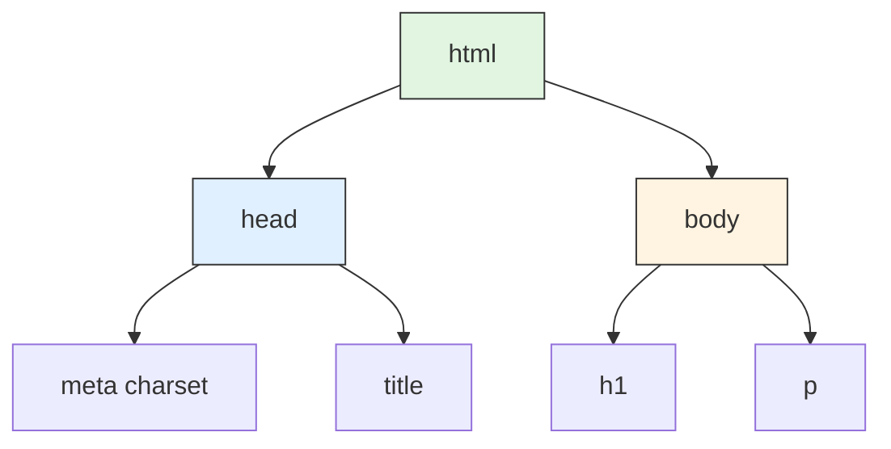
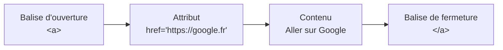
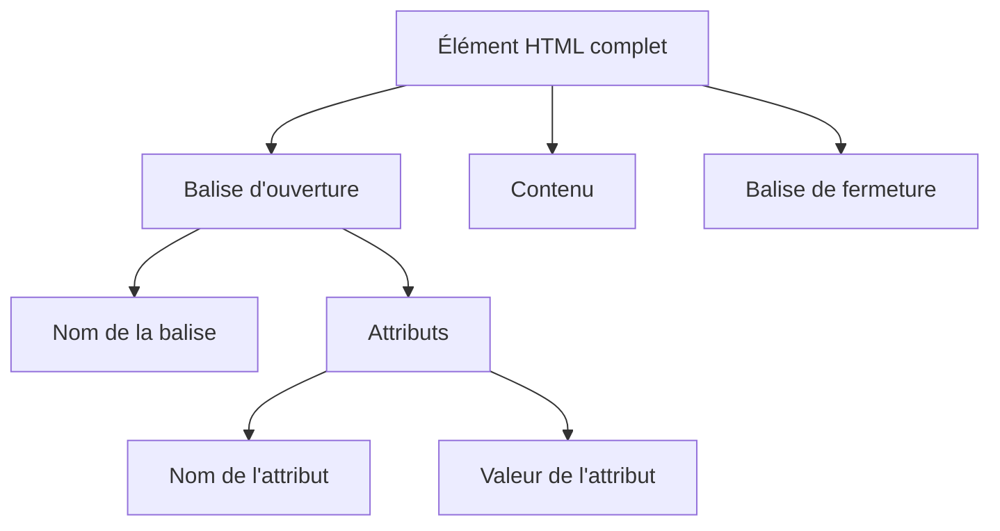
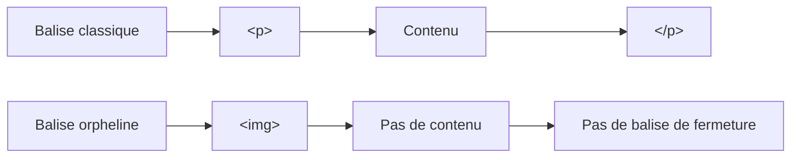

# Les Fondations HTML

<div
  class="omny-meta"
  data-level="🟢 Débutant"
  data-version="1.0"
  data-time="2-3 heures">
</div>

## Introduction

!!! quote "Analogie pédagogique - Le Squelette du Web"
    Imaginez construire une **maison**. Avant de peindre les murs (CSS) ou d'installer l'électricité (JavaScript), vous devez d'abord créer la **structure** : murs porteurs, portes, fenêtres. HTML est le **squelette structurel** de votre page. Chaque balise définit *ce qui existe* (ex: un titre) et non son apparence visuelle.

Ce module vous enseigne **la structure fondamentale d'une page HTML moderne**. Vous apprendrez à utiliser le **DOCTYPE**, l'encodage et les **métadonnées indispensables** à tout projet web.

Si **l’analogie de la maison** ne vous parle pas vraiment, nous vous proposons une **autre approche** : une vision globale du rôle du HTML **à travers l’analogie du corps humain**, illustrée par un schéma suivi d’une **explication plus approfondie** afin de mieux comprendre le positionnement du HTML.


**Le HTML** peut être comparé au **squelette humain**. Chaque page web possède un squelette plus ou moins complexe qui définit la structure fondamentale du document : titres, paragraphes, images, sections, formulaires, etc. Sans ce squelette, rien ne peut tenir debout. C’est donc **le HTML qui donne la structure et la solidité à la page**, exactement comme les os permettent au corps humain de se tenir droit.

**Le CSS**, quant à lui, correspond à **la pigmentation de la peau et à l’apparence extérieure**. Tous les humains possèdent un squelette similaire, mais **leur apparence peut être très différente** : couleur de peau, vêtements, coiffure, style général. Sur le web, c’est exactement la même logique. **Deux sites peuvent partager une structure HTML très proche, mais avoir un design totalement différent** grâce au CSS : couleurs, typographies, espacements, animations visuelles, disposition des éléments.

Enfin, **le JavaScript (JS)** représente **les capacités d’action et d’interaction** : parler, marcher, sauter, réagir à un stimulus. Dans un site web, **JavaScript apporte la vie et le comportement**. C’est lui qui permet par exemple de réagir à un clic, d’ouvrir un menu, de charger du contenu dynamiquement, de valider un formulaire ou encore de mettre à jour une interface sans recharger la page.

En résumé :

- **HTML → le squelette : la structure du corps (la structure de la page)**
- **CSS → la peau et l’apparence : le style visuel (le design)**
- **JavaScript → les actions et réactions : le comportement et l’interactivité**

Sans **HTML**, la page n’existe pas.  
Sans **CSS**, elle fonctionne mais reste visuellement brute.  
Sans **JavaScript**, elle reste statique et sans interaction.

> Maintenant que nous pouvons faire une distinction forte sur l'utilisation du HTML, nous pouvons découvrir la "Structure Minimale Obligatoire" de toute page web.

<br />

---

## La Structure Minimale Obligatoire

Une page HTML est un simple fichier texte enregistré avec l'extension `.html`. Pour qu'un navigateur Web (Chrome, Firefox, Safari) comprenne votre page, elle doit **toujours** respecter une structure de base.

Voici le *socle obligatoire* que vous taperez systématiquement pour tout nouveau projet :

```html
<!DOCTYPE html>
<html lang="fr">
<head>
    <meta charset="UTF-8">
    <title>Mon premier site</title>
</head>
<body>
    <h1>Bienvenue sur mon site</h1>
    <p>Ceci est mon premier paragraphe en HTML.</p>
</body>
</html>
```

### Le DOCTYPE : Déclaration d'intention

La toute première ligne de votre fichier n'est pas techniquement du HTML, c'est une *déclaration* pour le navigateur :

```html
<!DOCTYPE html>
```

- **Rôle :** Indique au navigateur d'utiliser le standard HTML5.
- **Pourquoi :** Sans cela, les navigateurs activent le mode *Quirks* (compatibilité rétroactive avec de vieux bugs des années 90). **Toujours à la ligne 1 !**

### L'élément racine : `<html>`

Tout le contenu de votre page doit se trouver **à l'intérieur** de la balise `<html>`. On l'appelle la balise "racine".

```html
<html lang="fr">
  ...
</html>
```

- L'attribut `lang="fr"` est vital, à la fois pour le **référencement (SEO)** et pour l'**accessibilité** (les lecteurs d'écran sauront qu'ils doivent prononcer le texte en français).

### `<head>` : Le cerveau invisible

La balise `<head>` contient toutes les métadonnées (informations techniques). **Rien de ce qui se trouve ici n'est affiché directement à l'écran du visiteur**.

```html
<head>
    <meta charset="UTF-8">
    <title>Mon premier site</title>
</head>
```

- **`<meta charset="UTF-8">`** : Gère l'encodage. C'est magique : cela permet à votre page d'afficher correctement les accents (é, à, ç) et les émojis (🚀).
- **`<title>`** : Le texte qui s'affichera dans l'onglet de votre navigateur et dans les résultats de Google.

### `<body>` : Le corps visible

Tout le contenu que le visiteur verra (textes, images, vidéos) vit ici.

```html
<body>
    <h1>Bienvenue sur mon site</h1>
</body>
```

**Arbre de rendu DOM** (Document Object Model) :
Le navigateur traduit ces balises en une structure d'arbre hiérarchique.



!!! tip "Dans les IDE[^1] moderne"
    Un raccourci bien utile existe : `!` suivi de <kbd>Tab</kbd> permettra de générer une structure immédiatement."


<br />

---

## Anatomie d'une balise HTML

HTML (HyperText Markup Language) n'est **pas** un langage de programmation. C'est un langage de **balisage**.

Le principe est simple : on *encadre* du contenu entre une **balise d'ouverture** et une **balise de fermeture** afin de lui donner du **sens sémantique**.

```html
<balise>Contenu visible</balise>
```

### Exemple concret

```html
<a href="https://google.fr">Aller sur Google</a>
```

Dans cet exemple :

* **`<a>`** : Balise d'ouverture (pour un lien).
* **`href="https://google.fr"`** : C'est un **attribut**. Il apporte une information supplémentaire à la balise (ici la destination).
* **`Aller sur Google`** : Le texte cliquable.
* **`</a>`** : Balise de fermeture (attention au slash `/`).

---

### Les balises orphelines

Certaines balises ne contiennent **pas de contenu**. Elles n'ont donc **pas de balise de fermeture**.
On les appelle des **balises orphelines** (*void elements* dans la spécification HTML).

```html

<br>
```

* L'image définit une source (`src`) et un texte alternatif (`alt`).
* Le saut de ligne (`<br>`) insère simplement un retour à la ligne.

Ces balises sont considérées comme **complètes dès leur écriture**, car elles ne peuvent pas contenir d'autres éléments.


!!! info "Historique : pourquoi voit-on parfois `` ou `<br />` ?"
Dans les anciennes documentations ou certains projets, vous pouvez rencontrer des balises écrites avec un **slash final**.

```html title="Ancien HTML (XHTML)"

<br />
```

Cette syntaxe provient de **XHTML**, une version plus stricte de HTML basée sur **XML**.

XML impose que **toutes les balises soient fermées**, même celles qui ne contiennent aucun contenu.  
Les éléments vides devaient donc être écrits sous forme **auto-fermante** avec `/>`.

Depuis **HTML5**, cette contrainte n'existe plus. Les navigateurs savent reconnaître automatiquement les **éléments vides**.


!!! tip "Recommandation moderne (HTML5)"
    En **HTML5**, la syntaxe la plus courante et la plus lisible est simplement :

```html

<br>
```

Le slash final reste **toléré**, mais il n'est **plus nécessaire**.

!!! warning "Attention : toutes les balises ne peuvent pas être orphelines"
    Seules certaines balises HTML sont définies comme **éléments vides**.

Par exemple :

```html
<p>Un paragraphe</p>
<div>Une section</div>
```

Ces balises **doivent toujours avoir une balise de fermeture**, car elles contiennent du contenu.

Pour résumer :

| Type de balise       | Exemple                  | Particularité                       |
| -------------------- | ------------------------ | ----------------------------------- |
| Balise classique     | `<p>Texte</p>`           | possède ouverture + fermeture       |
| Balise avec attribut | `<a href="...">Lien</a>` | attribut dans la balise d'ouverture |
| Balise orpheline     | ``                  | pas de balise de fermeture          |

---

### Schéma pédagogique : structure d'une balise HTML

Ce schéma illustre visuellement **la structure interne d'une balise HTML classique** afin de comprendre clairement le rôle de chaque composant : balise d'ouverture, attributs, contenu et balise de fermeture.



*Ce schéma montre la composition d'une balise HTML : la balise d'ouverture peut contenir des attributs, elle encadre un contenu, puis se termine par une balise de fermeture.*

---

### Schéma pédagogique : anatomie complète d'une balise

Ce diagramme représente **la structure complète d'un élément HTML**, en mettant en évidence la relation entre **les différentes parties de la balise**.



*Ce diagramme explique qu'un élément HTML est constitué d'une balise d'ouverture contenant éventuellement des attributs, d'un contenu, puis d'une balise de fermeture.*

---

### Schéma pédagogique : différence entre balise classique et balise orpheline

Ce schéma permet de comprendre **la différence structurelle entre une balise classique et une balise orpheline**.



*Ce schéma illustre que les balises classiques contiennent du contenu et possèdent une fermeture, tandis que les balises orphelines sont complètes dès leur écriture.*


<br />

---

## Ajout des balises Meta essentielles

De nos jours, le bloc `<head>` a besoin d'informations cruciales pour le SEO et l'affichage sur les smartphones.

### Le Viewport (Responsive Design)

Si vous omettez cette ligne, votre site s'affichera en *minuscule* sur les téléphones mobiles (comme s'ils dézommaient un écran d'ordinateur de 1000px). 

```html
<head>
    <meta name="viewport" content="width=device-width, initial-scale=1.0">
</head>
```

- Elle ordonne à l'écran du smartphone de baser la largeur du site sur la largeur physique de l'appareil (sans zoom arrière par défaut).

### SEO et Open Graph

Pour plaire à Google et aux réseaux sociaux, on enrichit le `<head>` :

```html
<head>
    <!-- Description dans Google -->
    <meta name="description" content="Développeur freelance spécialisé en HTML.">
    
    <!-- Prévisualisation WhatsApp, Facebook, LinkedIn -->
    <meta property="og:title" content="Mon Portfolio - Développeur Web">
    <meta property="og:description" content="Découvrez mes projets web créatifs.">
    <meta property="og:image" content="https://monsite.fr/preview.jpg">
</head>
```

### `meta description` : rôle et bonnes pratiques

La balise **`meta description`** est une métadonnée HTML placée dans la section `<head>` d'une page. Elle sert à fournir **un résumé du contenu de la page** aux moteurs de recherche et aux plateformes d’indexation.

Il n’existe **aucune limite technique imposée par le standard HTML**.
La contrainte provient en réalité **de l’affichage dans les moteurs de recherche**, notamment Google.

| Type d’affichage | Longueur recommandée             |
| ---------------- | -------------------------------- |
| Desktop          | environ **150 à 160 caractères** |
| Mobile           | environ **120 à 140 caractères** |

Lorsque la description dépasse cette longueur, **Google coupe le texte et ajoute des points de suspension `...`**.

!!! example "Exemple de résultat tronqué"
    Guide complet pour comprendre HTML, CSS et JavaScript avec des analogies simples et...


!!! tip "La bonne pratique SEO consiste donc à viser **entre 140 et 160 caractères maximum**."

La `meta description` n’est **pas un facteur direct de classement SEO**. Google l’a confirmé depuis plusieurs années.
Cependant, elle possède une **importance indirecte très forte**.

1. Amélioration du taux de clic (CTR)<br>
    Dans les résultats de recherche, la description apparaît **sous le titre de la page**.

    !!! quote "Une description claire et attractive peut **inciter l’utilisateur à cliquer**.<br>Un bon CTR peut indirectement **renforcer la visibilité d’une page**."

2. Contrôle du message affiché dans Google<br>
    Si aucune `meta description` n’est définie, Google **génère automatiquement un extrait du contenu de la page**.

    !!! example "Cela peut produire un résultat peu pertinent"
        ... HTML est un langage de balisage qui permet de structurer ...

    !!! note "La balise `meta description` permet donc **de contrôler le message marketing affiché dans les SERP** (Search Engine Result Pages)."

3. Réutilisation dans d’autres plateformes

    Cette description est également utilisée dans :

    * certains **partages de liens**
    * certains **réseaux sociaux**
    * certains **agrégateurs de contenu**
    * certains **navigateurs ou moteurs internes**

    Elle contribue donc à **la compréhension globale de la page par les systèmes d’indexation**.

**Bonnes pratiques SEO pour la description**

| Bonne pratique                | Explication                |
| ----------------------------- | -------------------------- |
| 140–160 caractères            | éviter la troncature       |
| description unique par page   | éviter le contenu dupliqué |
| intégrer des mots-clés        | améliore la pertinence     |
| écrire pour l’utilisateur     | favoriser le clic          |
| décrire réellement le contenu | éviter le “clickbait”      |

!!! example "Exemple optimisé"

    ```html
    <meta name="description" content="Apprenez les bases du HTML avec des explications simples, des schémas pédagogiques et des exemples concrets pour comprendre la structure d'une page web.">
    ```
    *Cette description résume clairement la page tout en contenant des mots-clés pertinents pour les moteurs de recherche.*


<br />

---

## Les commentaires HTML

Comme en programmation, vous pouvez laisser des notes *invisibles* pour le visiteur, mais *lisibles* pour les autres développeurs consultant le code source.

La syntaxe d'un commentaire est la suivante :

```html
<!-- Ceci est une note pour l'équipe -->
<!-- TODO: Il faudra remplacer l'image demain -->
```

!!! note "**À retenir : Ce code sera ignoré par le navigateur au rendu visuel**, mais il restera toujours visible lors de l'inspection du code source."

!!! danger "Ne stockez **jamais** de données sensibles (mot de passe, clé API) dans un commentaire HTML. N'importe quel visiteur peut faire un "Clic droit > Inspecter" pour les lire !"

<br />

---

## Conclusion et Synthèse

La syntaxe principale (Squelette HTML5 + Metatags) formera dorénavant la fondation inébranlable de tout fichier crée.

```html
<!DOCTYPE html>
<html lang="fr">
<head>
    <meta charset="UTF-8">
    <meta name="viewport" content="width=device-width, initial-scale=1.0">
    <title>Structure Parfaite</title>
    <meta name="description" content="Description pour les moteurs de recherche.">
</head>
<body>
    <!-- Le contenu de votre site ira ici -->
</body>
</html>
```

> Dans le module suivant, nous aborderons la structuration du texte à l'intérieur du `<body>` (Titres de h1 à h6, paragraphes, sémantique de mise en gras et création de liens hypertextes).

<br />

[^1]: IDE = Un **IDE (Integrated Development Environment - en français Environnement de Développement Intégré)** est un logiciel qui regroupe dans une seule interface les principaux outils nécessaires au développement logiciel — éditeur de code, compilateur ou interpréteur, débogueur et outils de gestion de projet — afin de faciliter l’écriture, l’exécution et la maintenance du code.
