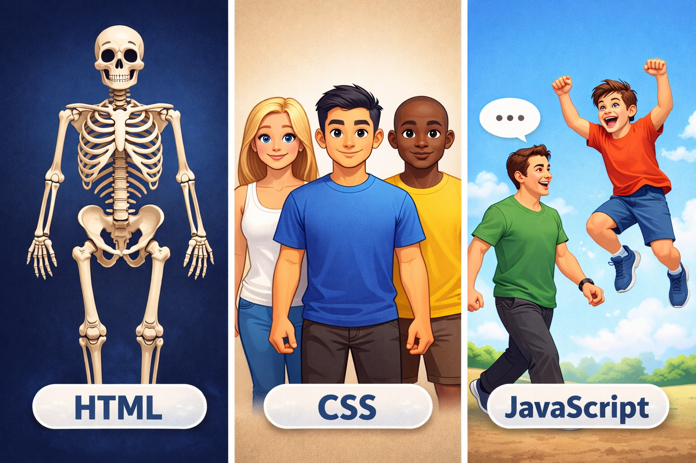
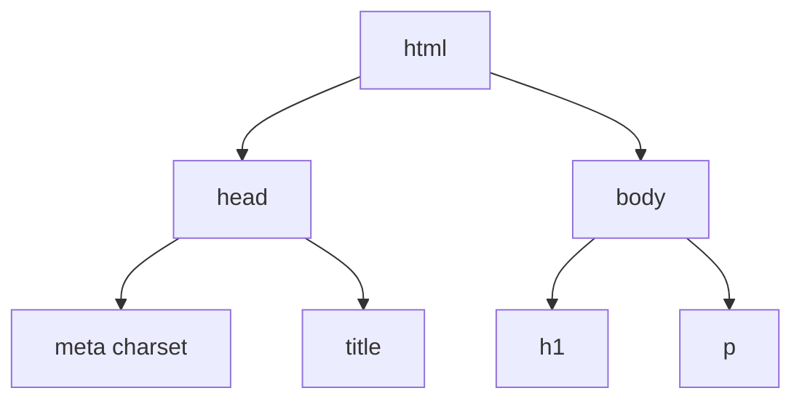
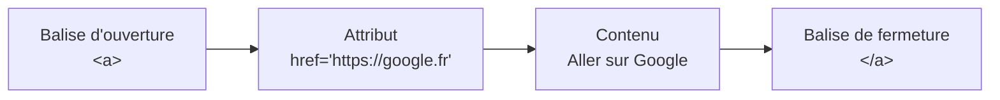
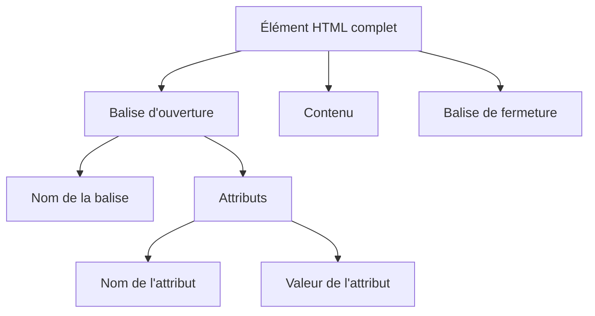
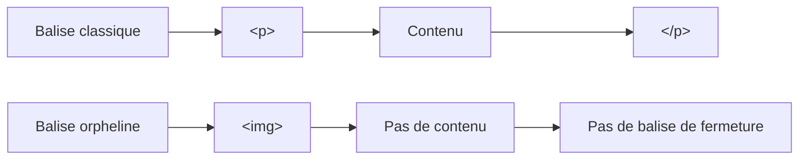

# Les Fondations HTML

<div
  class="omny-meta"
  data-level="🟢 Débutant"
  data-version="1.1"
  data-time="2-3 heures">
</div>

## Introduction

!!! quote "Analogie pédagogique - Le Squelette du Web"
    Imaginez construire une **maison**. Avant de peindre les murs (CSS) ou d'installer l'électricité (JavaScript), vous devez d'abord créer la **structure** : murs porteurs, portes, fenêtres. HTML est le **squelette structurel** de votre page. Chaque balise définit *ce qui existe* (ex: un titre) et non son apparence visuelle.

Ce module vous enseigne **la structure fondamentale d'une page HTML moderne**. Vous apprendrez à utiliser le **DOCTYPE**, l'encodage et les **métadonnées indispensables** à tout projet web.

Si **l'analogie de la maison** ne vous parle pas vraiment, nous vous proposons une **autre approche** : une vision globale du rôle du HTML **à travers l'analogie du corps humain**, illustrée par un schéma suivi d'une **explication plus approfondie** afin de mieux comprendre le positionnement du HTML.



*Représentation pédagogique du trio fondamental du Web : HTML pour la structure osseuse, CSS pour l'apparence, JavaScript pour le comportement.*

**Le HTML** peut être comparé au **squelette humain**. Chaque page web possède un squelette plus ou moins complexe qui définit la structure fondamentale du document : titres, paragraphes, images, sections, formulaires, etc. Sans ce squelette, rien ne peut tenir debout. C'est donc **le HTML qui donne la structure et la solidité à la page**, exactement comme les os permettent au corps humain de se tenir droit.

**Le CSS**, quant à lui, correspond à **la pigmentation de la peau et à l'apparence extérieure**. Tous les humains possèdent un squelette similaire, mais **leur apparence peut être très différente** : couleur de peau, vêtements, coiffure, style général. Sur le web, c'est exactement la même logique. **Deux sites peuvent partager une structure HTML très proche, mais avoir un design totalement différent** grâce au CSS : couleurs, typographies, espacements, animations visuelles, disposition des éléments.

Enfin, **le JavaScript (JS)** représente **les capacités d'action et d'interaction** : parler, marcher, sauter, réagir à un stimulus. Dans un site web, **JavaScript apporte la vie et le comportement**. C'est lui qui permet par exemple de réagir à un clic, d'ouvrir un menu, de charger du contenu dynamiquement, de valider un formulaire ou encore de mettre à jour une interface sans recharger la page.

En résumé :

- **HTML → le squelette : la structure du corps (la structure de la page)**
- **CSS → la peau et l'apparence : le style visuel (le design)**
- **JavaScript → les actions et réactions : le comportement et l'interactivité**

Sans **HTML**, la page n'existe pas.
Sans **CSS**, elle fonctionne mais reste visuellement brute.
Sans **JavaScript**, elle reste statique et sans interaction.

> Maintenant que nous pouvons faire une distinction forte sur l'utilisation du HTML, nous pouvons découvrir la "Structure Minimale Obligatoire" de toute page web.

<br>

---

## La Structure Minimale Obligatoire

Une page HTML est un simple fichier texte enregistré avec l'extension `.html`. Pour qu'un navigateur Web (Chrome, Firefox, Safari) comprenne votre page, elle doit **toujours** respecter une structure de base.

Voici le *socle obligatoire* que vous taperez systématiquement pour tout nouveau projet :

```html title="HTML - Squelette minimal d'une page"
<!DOCTYPE html>
<html lang="fr">
<head>
    <meta charset="UTF-8">
    <title>Mon premier site</title>
</head>
<body>
    <h1>Bienvenue sur mon site</h1>
    <p>Ceci est mon premier paragraphe en HTML.</p>
</body>
</html>
```

<br>

### Le DOCTYPE : Déclaration d'intention

La toute première ligne de votre fichier n'est pas techniquement du HTML, c'est une *déclaration* pour le navigateur :

```html title="HTML - Déclaration DOCTYPE"
<!DOCTYPE html>
```

- **Rôle :** Indique au navigateur d'utiliser le standard HTML5.
- **Pourquoi :** Sans cela, les navigateurs activent le mode *Quirks* (compatibilité rétroactive avec de vieux bugs des années 90). **Toujours à la ligne 1 !**

<br>

### L'élément racine : `<html>`

Tout le contenu de votre page doit se trouver **à l'intérieur** de la balise `<html>`. On l'appelle la balise "racine".

```html title="HTML - Balise racine avec attribut lang"
<html lang="fr">
  ...
</html>
```

- L'attribut `lang="fr"` est vital, à la fois pour le **référencement (SEO)** et pour l'**accessibilité** (les lecteurs d'écran sauront qu'ils doivent prononcer le texte en français).

<br>

### `<head>` : Le cerveau invisible

La balise `<head>` contient toutes les métadonnées (informations techniques). **Rien de ce qui se trouve ici n'est affiché directement à l'écran du visiteur**.

```html title="HTML - Contenu minimal du head"
<head>
    <!-- Encodage des caractères : indispensable pour afficher les accents -->
    <meta charset="UTF-8">
    <!-- Titre affiché dans l'onglet du navigateur et dans Google -->
    <title>Mon premier site</title>
</head>
```

- **`<meta charset="UTF-8">`** : Gère l'encodage. Cela permet à votre page d'afficher correctement les accents (é, à, ç) et les caractères spéciaux de toutes les langues du monde.
- **`<title>`** : Le texte qui s'affichera dans l'onglet de votre navigateur et dans les résultats de Google.

<br>

### `<body>` : Le corps visible

Tout le contenu que le visiteur verra (textes, images, vidéos) vit ici.

```html title="HTML - Contenu dans le body"
<body>
    <h1>Bienvenue sur mon site</h1>
</body>
```

**Arbre de rendu DOM** (Document Object Model) :
Le navigateur traduit ces balises en une structure d'arbre hiérarchique.



*Le DOM représente la hiérarchie des balises HTML sous forme d'arbre. Chaque balise est un noeud. Le navigateur parcourt cet arbre pour construire l'affichage de la page.*

!!! tip "Dans les IDE[^1] modernes"
    Un raccourci bien utile existe : `!` suivi de `Tab` génère automatiquement une structure HTML5 minimale complète.

<br>

---

## Anatomie d'une balise HTML

HTML (HyperText Markup Language) n'est **pas** un langage de programmation. C'est un langage de **balisage**.

Le principe est simple : on *encadre* du contenu entre une **balise d'ouverture** et une **balise de fermeture** afin de lui donner du **sens sémantique**.

```html title="HTML - Structure générique d'une balise"
<balise>Contenu visible</balise>
```

<br>

### Exemple concret

```html title="HTML - Balise de lien avec attribut"
<a href="https://google.fr">Aller sur Google</a>
```

Dans cet exemple :

- **`<a>`** : Balise d'ouverture (pour un lien hypertexte).
- **`href="https://google.fr"`** : C'est un **attribut**. Il apporte une information supplémentaire à la balise (ici la destination du lien).
- **`Aller sur Google`** : Le texte cliquable visible par l'utilisateur.
- **`</a>`** : Balise de fermeture (attention au slash `/`).



*Ce schéma montre la composition d'une balise HTML : la balise d'ouverture peut contenir des attributs, elle encadre un contenu, puis se termine par une balise de fermeture.*

<br>

### Anatomie complète d'une balise



*Un élément HTML est constitué d'une balise d'ouverture contenant éventuellement des attributs, d'un contenu textuel ou imbriqué, puis d'une balise de fermeture.*

<br>

---

## Les balises orphelines

Certaines balises ne contiennent **pas de contenu**. Elles n'ont donc **pas de balise de fermeture**.
On les appelle des **balises orphelines** (*void elements* dans la spécification HTML).

```html title="HTML - Exemples de balises orphelines"
<!-- Une image : elle ne contient pas d'autre balise, elle est complète telle quelle -->


<!-- Un saut de ligne : pas de contenu à encapsuler -->
<br>
```

- L'image définit une source (`src`) et un texte alternatif (`alt`).
- Le saut de ligne (`<br>`) insère simplement un retour à la ligne.

Ces balises sont considérées comme **complètes dès leur écriture**, car elles ne peuvent pas contenir d'autres éléments.

!!! info "Historique : pourquoi voit-on parfois `` ou `<br />` ?"
    Dans les anciennes documentations ou certains projets, vous pouvez rencontrer des balises écrites avec un **slash final**.

    ```html title="Ancien HTML (XHTML) - Syntaxe auto-fermante"
    
    <br />
    ```

    Cette syntaxe provient de **XHTML**, une version plus stricte de HTML basée sur **XML**. XML impose que toutes les balises soient fermées, même celles qui ne contiennent aucun contenu. Les éléments vides devaient donc être écrits sous forme **auto-fermante** avec `/>`.

    Depuis **HTML5**, cette contrainte n'existe plus. Les navigateurs reconnaissent automatiquement les éléments vides.

!!! tip "Recommandation HTML5"
    La syntaxe moderne est simplement :

    ```html title="HTML5 - Syntaxe recommandée"
    <!-- Le slash final n'est plus nécessaire en HTML5 -->
    
    <br>
    ```

    Le slash final reste **toléré** par les navigateurs, mais il n'est **plus nécessaire**.

!!! warning "Toutes les balises ne peuvent pas être orphelines"
    Seules certaines balises HTML sont définies comme éléments vides par la spécification. Les balises `<p>`, `<div>`, `<a>`, `<h1>` à `<h6>` doivent impérativement avoir une balise de fermeture car elles sont conçues pour encapsuler du contenu.

    ```html title="HTML - Balises qui doivent être fermées"
    <!-- Correct : ouverture et fermeture explicites -->
    <p>Un paragraphe</p>
    <div>Une section</div>
    ```

Pour résumer :

| Type de balise | Exemple | Particularité |
| --- | --- | --- |
| Balise classique | `<p>Texte</p>` | ouverture + fermeture obligatoires |
| Balise avec attribut | `<a href="...">Lien</a>` | attribut dans la balise d'ouverture |
| Balise orpheline | `` | pas de balise de fermeture |



*Les balises classiques encadrent du contenu et nécessitent une fermeture. Les balises orphelines sont des éléments autonomes, complets dès leur écriture.*

<br>

---

## Ajout des balises Meta essentielles

De nos jours, le bloc `<head>` a besoin d'informations cruciales pour le SEO et l'affichage correct sur les appareils mobiles.

<br>

### Le Viewport (Responsive Design)

Si vous omettez cette ligne, votre site s'affichera en *minuscule* sur les téléphones mobiles, comme si le navigateur dézoomait un écran d'ordinateur de bureau.

```html title="HTML - Meta viewport pour le responsive"
<head>
    <!-- Ordonne au navigateur mobile d'utiliser la largeur réelle de l'écran -->
    <meta name="viewport" content="width=device-width, initial-scale=1.0">
</head>
```

<br>

### SEO et Open Graph

Pour plaire à Google et permettre une prévisualisation correcte sur les réseaux sociaux :

```html title="HTML - Meta SEO et Open Graph"
<head>
    <!-- Description affichée sous le titre dans les résultats Google -->
    <meta name="description" content="Développeur freelance spécialisé en HTML.">

    <!-- Titre, description et image pour les prévisualisations WhatsApp, Facebook, LinkedIn -->
    <meta property="og:title" content="Mon Portfolio - Développeur Web">
    <meta property="og:description" content="Découvrez mes projets web créatifs.">
    <meta property="og:image" content="https://monsite.fr/preview.jpg">
</head>
```

<br>

### `meta description` : rôle et bonnes pratiques

La balise **`meta description`** fournit **un résumé du contenu de la page** aux moteurs de recherche et aux plateformes d'indexation.

Il n'existe **aucune limite technique** imposée par le standard HTML. La contrainte provient de l'affichage dans les moteurs de recherche, notamment Google.

| Type d'affichage | Longueur recommandée |
| --- | --- |
| Desktop | environ **150 à 160 caractères** |
| Mobile | environ **120 à 140 caractères** |

Lorsque la description dépasse cette longueur, Google coupe le texte et ajoute des points de suspension.

!!! example "Exemple de résultat tronqué"
    Guide complet pour comprendre HTML, CSS et JavaScript avec des analogies simples et...

La `meta description` n'est **pas un facteur direct de classement SEO**. Cependant, elle possède une importance indirecte forte sur trois points :

1. **Amélioration du taux de clic (CTR)** — une description claire et pertinente incite l'utilisateur à cliquer depuis les résultats de recherche.

2. **Contrôle du message dans Google** — sans `meta description`, Google génère automatiquement un extrait du contenu, souvent peu pertinent.

3. **Réutilisation multi-plateformes** — les réseaux sociaux, agrégateurs et navigateurs l'utilisent pour décrire la page lors des partages de liens.

**Bonnes pratiques SEO :**

| Bonne pratique | Explication |
| --- | --- |
| 140–160 caractères | éviter la troncature |
| Description unique par page | éviter le contenu dupliqué |
| Intégrer des mots-clés | améliore la pertinence perçue |
| Écrire pour l'utilisateur | favoriser le clic |
| Décrire réellement le contenu | éviter le "clickbait" |

!!! example "Exemple de description optimisée"
    ```html title="HTML - Meta description optimisée"
    <meta name="description" content="Apprenez les bases du HTML avec des explications simples, des schémas pédagogiques et des exemples concrets pour comprendre la structure d'une page web.">
    ```
    *Cette description résume clairement la page tout en intégrant des mots-clés pertinents pour les moteurs de recherche.*

<br>

---

## Les commentaires HTML

Comme dans tout langage de développement, vous pouvez laisser des notes *invisibles* pour le visiteur, mais *lisibles* par tous les développeurs consultant le code source.

```html title="HTML - Syntaxe des commentaires"
<!-- Ceci est une note pour l'équipe de développement -->
<!-- TODO: Remplacer cette image par la version finale -->
```

!!! note "Comportement des commentaires"
    Les commentaires sont ignorés par le navigateur au rendu visuel. Ils ne s'affichent pas à l'écran. En revanche, ils restent **entièrement visibles** lors de l'inspection du code source par n'importe quel visiteur.

!!! danger "Ne jamais stocker de données sensibles dans un commentaire HTML"
    Tout visiteur peut faire un clic droit > Inspecter (ou `Ctrl+U`) pour lire l'intégralité du code source d'une page, commentaires inclus. Les clés API, mots de passe, tokens ou informations confidentielles ne doivent **jamais** figurer dans un commentaire HTML.

<br>

---

## Conclusion

!!! quote "Ce qu'il faut retenir de ce module"
    Le squelette HTML5 (`DOCTYPE`, `<html lang>`, `<head>`, `<body>`) et les métadonnées essentielles (`charset`, `viewport`, `description`) constituent la fondation de toute page web. Une balise encadre du contenu et lui donne un sens sémantique. Les balises orphelines n'ont pas de fermeture car elles ne peuvent contenir d'autres éléments. Enfin, les commentaires HTML sont visibles par tous : ils ne doivent jamais contenir d'information sensible.

> Dans le module suivant, nous aborderons la structuration du texte à l'intérieur du `<body>` : titres hiérarchiques (`<h1>` à `<h6>`), paragraphes, sémantique de mise en forme (`<strong>`, `<em>`) et création de liens hypertextes (`<a>`).

<br>

[^1]: Un **IDE (Integrated Development Environment)** est un logiciel qui regroupe dans une seule interface les outils nécessaires au développement : éditeur de code, débogueur, terminal intégré et gestion de projet. Exemples courants : Visual Studio Code, PhpStorm, WebStorm.