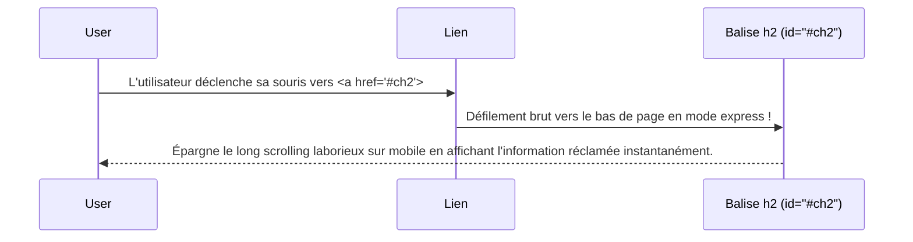

# Texte & Liens Hypertextes

<div
  class="omny-meta"
  data-level="🟢 Débutant"
  data-version="1.0"
  data-time="2-3 heures">
</div>

## Introduction

!!! quote "Analogie pédagogique - Le Contenu Prend Vie"
    Imaginez un **livre** : sans mise en forme, le texte brut est illisible. Pas de gras pour les mots importants, pas d'italique pour l'emphase. En HTML, la mise en forme ne sert pas qu'à décorer visuellement, elle apporte avant tout une **valeur sémantique** (_par exemple, la balise `<strong>` avertit un lecteur d'écran conçu pour les malvoyants que ce mot est *vital*_).
    
    Et les **liens hypertextes** (`<a>`) ? C'est le coeur même d'Internet : transformer un simple mot figé en une véritable porte vers le monde, capable de vous transporter d'une page à une autre d'un simple clic.

Ce module vous enseigne à structurer votre texte avec sens et à utiliser avec brio les principes de navigation internes et externes.

<br />

---

## La Titraille et les Paragraphes

Avant même de vouloir mettre en gras ou en italique, il faut pouvoir restructurer de grands blocs de textes. Le langage HTML prévoit pour cela des balises de titres (*Headings*) et de paragraphes.

### Les Titres (`<h1>` à `<h6>`)

En HTML, la taille et l'importance d'un titre sont définies par son niveau de hiérarchie numérique. Le `<h1>` est le **titre principal absolu** du document, les balises suivantes représentent des sous-titres limités informatiquement au dernier niveau possible : le `<h6>`. 

```html title="Code HTML"
<h1>Mon Article Principal (Un seul par page)</h1>

<h2>Chapitre 1</h2>
<p>Introduction du chapitre 1.</p>

<h3>Sous-section 1.1</h3>
<p>Détails spécifiques à l'intérieur du chapitre 1.</p>

<h2>Chapitre 2</h2>
```

**Les deux règles absolues du référencement (SEO):**

1. Il ne doit y avoir **qu'un seul `<h1>` par page**. (_Voir le warning ci-dessous_)

    !!! warning "Structure des titres HTML"
        Plusieurs balises **`<h1>`** peuvent exister dans une même page si elles appartiennent à **des sections distinctes** de la structure du document (par exemple dans des `<section>`, `<article>` ou `<aside>`).  

        En revanche, **au même niveau hiérarchique dans une même section**, il ne doit jamais y avoir deux `<h1>`, car cela briserait la logique de structure du document et nuirait à la compréhension sémantique par les navigateurs, les moteurs de recherche et les technologies d’assistance.

2. Ne sautez **jamais** de niveau en cascade (Ne passez pas d'un `<h2>` au milieu de votre cours à un `<h4>` directement sans raison logique).


    

### Les Paragraphes (`<p>`) et sauts de ligne (`<br>`)

Le texte classique ne doit *jamais* se balader librement dans votre document. Il doit **toujours** être encapsulé dans un paragraphe (`<p>`). Le navigateur Web y appliquera de lui même son "style" en y ajoutant un espace naturel et aéré au-dessus et en dessous. 

Si vous souhaitez toutefois revenir à la ligne **sans quitter le paragraphe actuel**, utilisez la balise orpheline `<br>`.

```html
<p>Ceci est un paragraphe standard et parfait.</p>

<p>
    Voici ma première ligne qui est visuellement séparée,<br>
    Et voici ma ligne numéro 2, toujours intégrée dans la même idée de paragraphe.
</p>
```

<br />

---

## Mise en Forme Sémantique du Texte

Mettre un texte en "gras" sur un site Web ne signifie pas seulement le rendre plus épais en pixels devant vos yeux. C'est surtout donner un **indicateur fort de notion d'importance** aux robots d'indexation (_comme Google_) et aux outils d'accessibilité (_comme les synthèses vocales matérielles_).

### Strong vs B (Importance vs Gras visuel)

Privilégiez toujours la balise `<strong>` au lieu de l'antique balise `<b>` pour mettre une information en exergue.

```html title="Code HTML - Strong vs B"
<!-- ✅ Sémantique : Le lecteur d'écran accentuera ce mot à haute voix -->
<p><strong>Attention :</strong> Le serveur sera coupé dès ce soir.</p>

<!-- ❌ Visuel uniquement : Évitez cette méthode -->
<p><b>Ne surtout pas oublier</b> d'enregistrer le fichier aujourd'hui.</p>
```

### Em vs I (Emphase vs Italique)

De la même manière exacte, emphase avec `<em>` va indiquer l'idée qu'un mot doit être **appuyé** vocalement contrairement au vieux `<i>` de l'italique visuel. 

```html title="Code HTML - Em vs I"
<!-- ✅ Sémantique : "Je VEUX ce gâteau" -->
<p>Je veux <em>absolument</em> ce grand morceau de gâteau.</p>

<!-- ✅ Visuel acceptable : Conçu pour les termes techniques, taxonomies scientifiques -->
<p>L'utilisation massive de la balise <i lang="en">div</i> était monnaie courante autrefois.</p>
```

!!! note "Le tag &lt;i&gt; est aujourd'hui principalement utilisé dans les icônes (Font Awesome, etc.)"

### Autres formats très spécifiques et utiles

Le HTML5 pousse la classification des données très loin et propose des balises prêtes à l'emploi spécifiques pour la majorité des besoins textuels liés au métier :

```html
<!-- Surlignage au marqueur pour résultat de recherche (par défaut en jaune fluo) -->
<p>J'ai tapé "développeur", voici le résultat: <mark>développeur HTML</mark> repéré !</p>

<!-- L'Exposant et l'Idice : pensés pour des cours de mathématiques/chimie purs -->
<p>La formule brute de l'eau claire est : H<sub>2</sub>O.</p>
<p>La valeur de l'énergie au repos: E = mc<sup>2</sup></p>

<!-- Suivi et Historique : Afficher du texte originellement faux -> corrigé aujourd'hui -->
<p>Le bon prix est passé de <del>129€</del> <ins>99€</ins>.</p>
```

<br />

---

## Citations et Code

### L'Art de la Citation

Le HTML possède plusieurs balises dédiées à la **représentation sémantique des citations**. Utiliser les bonnes balises permet de préserver la structure logique du document, d'améliorer l’accessibilité et de transmettre correctement l’origine d’une idée ou d’un propos.

Lorsqu’une citation est **longue et indépendante du texte principal**, on utilise la balise **`<blockquote>`**. Elle sert à isoler un extrait provenant d'une source externe (discours, livre, article, publication, etc.).

À l’inverse, lorsqu’il s’agit d’une **courte citation intégrée directement dans une phrase**, on utilise la balise **`<q>`**. Celle-ci ajoute automatiquement les guillemets typographiques autour du texte cité.

Enfin, pour **mentionner explicitement l’auteur ou la source d’une citation**, on utilise la balise **`<cite>`**, qui permet d’indiquer l’origine de l’extrait.

```html title="Code HTML - Citation longue avec blockquote + mention de l’auteur"
<!-- La citation longue est isolée du texte principal -->
<blockquote>
    Le Web n'est véritablement pas qu'une simple technologie de pointe, 
    c'est un authentique espace de liberté et de partage de données.
</blockquote>

<!-- La source de la citation -->
<p>
    — <cite>Tim Berners-Lee</cite>, inventeur du World Wide Web
</p>
```

```html title="Code HTML - Citation courte intégrée dans un paragraphe"
<p>
    Comme le disait brillamment <cite>Tim Berners-Lee</cite> lors de son discours :
    <q>The Web does not just connect machines, it connects people.</q>
</p>
```

Dans certains cas, il est également possible d’indiquer **la source originale sous forme d’URL** grâce à l’attribut `cite` de la balise `<blockquote>`. Cette information n’est pas visible directement par l’utilisateur mais reste exploitable par les navigateurs, les outils d’analyse ou les moteurs de recherche.

```html title="Code HTML - Lien de la citation avec l'attribut cite"
<blockquote cite="https://www.w3.org/People/Berners-Lee/">
    The Web does not just connect machines, it connects people.
</blockquote>

<p>
    — <cite>Tim Berners-Lee</cite>
</p>
```

Cette approche respecte pleinement la **sémantique HTML** en distinguant clairement :

| Élément        | Rôle                                           |
| -------------- | ---------------------------------------------- |
| `<blockquote>` | Citation longue provenant d’une source externe |
| `<q>`          | Citation courte intégrée dans une phrase       |
| `<cite>`       | Référence à l’auteur ou à l’œuvre citée        |
| `cite=""`      | URL de la source originale de la citation      |

!!! info "Sémantique des citations en HTML"

    L’attribut `cite` de la balise `<blockquote>` permet d’indiquer **l’URL de la source originale de la citation**, mais cette information **n’est pas visible par l’utilisateur**.  

    Pour afficher l’auteur ou l’œuvre citée dans la page, il est recommandé d’utiliser **la balise `<cite>` en dehors du `<blockquote>`** afin de séparer clairement **le contenu de la citation** et **sa source**.

### Formater avec succès du Code Informatique

L'affichage en brut d'un bout de code de programmation sur un blog personnel ou bien retranscrire une séquence de touches de clavier demande obligatoirement un traitement spécial et mécanique de la part du navigateur Web de vos lecteurs, sinon c'est illisible :

```html title="Code HTML - Formater du code informatique"
<!-- Afficher au public une petite portion logique de code sans l'exécuter -->
<p>Si vous ouvrez la balise <code>&lt;head&gt;</code>, il faudra aussi la refermer.</p>

<!-- Afficher au public une manipulation de touche clavier précise -->
<p>Afin de pouvoir enregistrer votre beau code, il faudra appuyer sur secrètement sur <kbd>Ctrl</kbd> + <kbd>S</kbd>.</p>
```

!!! example "rendu successif"

    <p>Si vous ouvrez la balise <code>&lt;head&gt;</code>, il faudra aussi la refermer.</p>

    <p>Afin de pouvoir enregistrer votre beau code, il faudra appuyer sur secrètement sur <kbd>Ctrl</kbd> + <kbd>S</kbd>.</p>

<br />

---

## Les redoutables Liens Hypertextes (`<a>`)

Bien qu'elle soit invisible techniquement, la petite balise `<a>` (venant de l'Anglais **Anchor**, donc d'Une Ancre) représente symboliquement le composant informatique fondamental de l'entièreté d'Internet mondial !

Sans elle, chaque page du globe web est emmurée vivante toute seule. Cette balise dispose de **l'attribut directeur** qu'on appelle très familièrement un `href` : il indique de manière transparente vers où votre cher visiteur doit être redirigé et aspiré de force en cliquant sur votre phrase.

### Les destinations cardinales

!!! quote "Il existe de très nombreuses manières d'écrire l'emplacement où devra emmener un lien hypertext."

```html title="Code HTML - Différents types de liens hypertextes"
<!-- 1 - Le Lien Externe Absolu - c'est celui qui vous fait voyager d'un site à l'autre afin de traverser
         totalement votre domaine URL de départ vers un autre -->
<a href="https://mdn.mozilla.org">M'emmener loin du site pour aller sur la doc de Mozilla</a>

<!-- 2 - Le Lien Interne Relatif - De votre bureau A à votre local B -->
<a href="contact-page.html">Vous voulez de l'aide ? Allons sur NOTRE page Contact interne</a>

<!-- 3 - Le Lien Automatique d'Application Rapide (Qui active directement votre OS) -->
<a href="mailto:[EMAIL_ADDRESS]">Faites nous un mail express</a>
<a href="tel:+33123456789">Appelez directement le service dédié</a>
```

### Focus inévitable sur le comportement de navigation (`target`)

Le comportement originel du Web est simple. Quand on clique avec notre souris logitech sur un lien hypertexte : celui écrasera totalement la page visualisée par nos yeux où l'on se trouve physiquement à la milliseconde de clique pour se métamorphoser en la nouvelle page magique commandée.

Et si en temps que rédacteur en chef on décidait plutôt de **forcer discrètement l'ouverture de ce petit lien sous le coup d'un "nouvel onglet" en second-plan silencieux** de notre visiteur ?

On injectera en secret l'enchantement paramétrique : `target="_blank"`. 

!!! warning "C'est ici que rentre impérativement en ligne de mire la **Cybersécurité** : Lorsqu'on accepte l'ouverture non contrôlable en nouvel onglet sur du code étranger pour une destination `https://` dont on n’est pas personnellement **propriétaire administrateur du serveur**, il est purement prohibé de se détourner de l’ajout du couteau suisse : `rel="noopener noreferrer"`. C'est la ligne de code barrière indispensable pour empêcher le code distant non connu de cet onget invisible de **pirater le cache original de vos propres scripts** en cours sur votre onglet numéro 1 de lecture."

```html title="Code HTML - Ouverture d'un lien dans un nouvel onglet"
<!-- L'ouverture sécurisée en second-plan (onglet deux) vers un site pas vous : -->
<a href="https://github.com" target="_blank" rel="noopener noreferrer">
    Aller tranquillement faire vos courses secrètes sur de Github dans un onglet 2
</a>
```

### Tableau récapitulatif des valeurs de l'attribut rel

| Valeur       | Explication                                                                                                                                                                                               |
| :------------ | --------------------------------------------------------------------------------------------------------------------------------------------------------------------------------------------------------- |
| **noopener**   | Empêche la page ouverte dans un nouvel onglet d'accéder à l'objet `window.opener`, ce qui bloque les attaques de type **tabnabbing** où la page externe pourrait modifier ou rediriger la page d'origine. |
| **noreferrer** | Empêche l'envoi de l'en-tête HTTP **Referer**, ce qui signifie que le site de destination ne saura pas depuis quelle page l'utilisateur provient, renforçant ainsi la confidentialité.                    |


<br />

---

## Les Ancres Intra-Pages dites Locales

Elles sont l'arme de poing classique pour réaliser du routing de section. C'est à dire des "**sauts de puce invisible**". En résumé ces liens très curieux ne vous font jamais, au grand jamais, quitter le document ou l'URL actuel mais font brutalement descendre à toute la vitesse un ascenseur visuel directement sans aucune autre aide extérieure vers une section ou phrase précise du même document ! 

Pour que l'alchimie mathématique fonctionne, il est purement imposé qu'en amont de l'URL l'on appose une identification absolue : l'identifiant unique nomé (`id="..."`) greffé en brut directement dans l'élément (la cible de destination), et bien entendu... un `#`. 

```html title="Code HTML - Ancre intra-page"
<!-- L'astuce du bouton ascenseur intra page rapide qui pointe une cible
     (ici un hashtag sur l'id chapitre-2) -->
<a href="#chapitre-2">Je suis pressé et pressée : emmenez moi sauter de 10 étages en un tour de magie !</a>

<p>... Vraiment beaucoup textes intermédiaires totalement passables à lire pour un homme pressé... </p>
<p>... encore et encore du blablabla inutile...</p>

<!-- La zone souterraine d'arrivée brutale dont est équipée d'une plaque immatriculée -->
<h2 id="chapitre-2">Et voilà, on se trouve instantanément affiché au second Chapitre !</h2>
```

<br>

**Exemple algorithmique détaillé de cette translation (Le point A vers le point A Bis) :**



<br />

---

## Conclusion et Synthèse

La structuration du texte est l'essence même du contenu web. En utilisant les bonnes balises (`<strong>`, `<em>`, `<blockquote>`, etc.), vous garantissez une lecture accessible pour les humains comme pour les robots. Les liens hypertextes (`<a>`), quant à eux, créent les autoroutes qui connectent vos pages entre elles et avec le reste du monde.

> Dans le module suivant, nous allons découvrir comment intégrer des **Images et des Médias (Audio/Vidéo)** pour rendre nos pages plus vivantes et multimédias.

<br />
