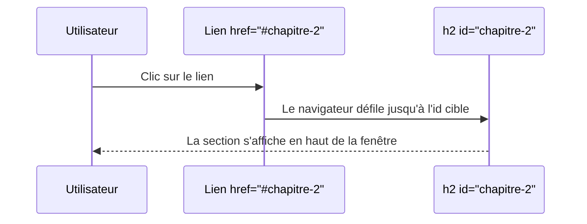

# Texte & Liens Hypertextes

<div
  class="omny-meta"
  data-level="🟢 Débutant"
  data-version="1.1"
  data-time="2-3 heures">
</div>

## Introduction

!!! quote "Analogie pédagogique - Le Contenu Prend Vie"
    Imaginez un **livre** : sans mise en forme, le texte brut est illisible. Pas de gras pour les mots importants, pas d'italique pour l'emphase. En HTML, la mise en forme ne sert pas qu'à décorer visuellement, elle apporte avant tout une **valeur sémantique** (_par exemple, la balise `<strong>` avertit un lecteur d'écran conçu pour les malvoyants que ce mot est *vital*_).

    Et les **liens hypertextes** (`<a>`) ? C'est le coeur même d'Internet : transformer un simple mot figé en une véritable porte vers le monde, capable de vous transporter d'une page à une autre d'un simple clic.

Ce module vous enseigne à structurer votre texte avec sens et à utiliser avec brio les principes de navigation internes et externes.

<br>

---

## La Titraille et les Paragraphes

Avant même de vouloir mettre en gras ou en italique, il faut pouvoir restructurer de grands blocs de textes. Le langage HTML prévoit pour cela des balises de titres (*Headings*) et de paragraphes.

<br>

### Les Titres (`<h1>` à `<h6>`)

En HTML, la taille et l'importance d'un titre sont définies par son niveau de hiérarchie numérique. Le `<h1>` est le **titre principal absolu** du document, les balises suivantes représentent des sous-titres limités informatiquement au dernier niveau possible : le `<h6>`.

```html title="HTML - Hiérarchie des titres"
<h1>Mon Article Principal (Un seul par page)</h1>

<h2>Chapitre 1</h2>
<p>Introduction du chapitre 1.</p>

<h3>Sous-section 1.1</h3>
<p>Détails spécifiques à l'intérieur du chapitre 1.</p>

<h2>Chapitre 2</h2>
```

**Les deux règles absolues du référencement (SEO) :**

1. Il ne doit y avoir **qu'un seul `<h1>` par page** au même niveau hiérarchique.

    !!! warning "Structure des titres HTML"
        Plusieurs balises **`<h1>`** peuvent exister dans une même page si elles appartiennent à **des sections distinctes** de la structure du document (par exemple dans des `<section>`, `<article>` ou `<aside>`).

        En revanche, **au même niveau hiérarchique dans une même section**, il ne doit jamais y avoir deux `<h1>`, car cela briserait la logique de structure du document et nuirait à la compréhension sémantique par les navigateurs, les moteurs de recherche et les technologies d'assistance.

2. Ne sautez **jamais** de niveau en cascade. Ne passez pas d'un `<h2>` directement à un `<h4>` sans raison logique.

<br>

### Les Paragraphes (`<p>`) et sauts de ligne (`<br>`)

Le texte classique ne doit *jamais* se balader librement dans votre document. Il doit **toujours** être encapsulé dans un paragraphe (`<p>`). Le navigateur Web y appliquera de lui même son "style" en y ajoutant un espace naturel et aéré au-dessus et en dessous.

Si vous souhaitez toutefois revenir à la ligne **sans quitter le paragraphe actuel**, utilisez la balise orpheline `<br>`.

```html title="HTML - Paragraphes et saut de ligne"
<p>Ceci est un paragraphe standard et parfait.</p>

<p>
    Voici ma première ligne qui est visuellement séparée,<br>
    Et voici ma ligne numéro 2, toujours intégrée dans la même idée de paragraphe.
</p>
```

<br>

---

## Mise en Forme Sémantique du Texte

Mettre un texte en "gras" sur un site Web ne signifie pas seulement le rendre plus épais en pixels devant vos yeux. C'est surtout donner un **indicateur fort de notion d'importance** aux robots d'indexation (_comme Google_) et aux outils d'accessibilité (_comme les synthèses vocales matérielles_).

<br>

### Strong vs B (Importance vs Gras visuel)

Privilégiez toujours la balise `<strong>` au lieu de l'antique balise `<b>` pour mettre une information en exergue.

```html title="HTML - strong (sémantique) vs b (visuel)"
<!-- BONNE PRATIQUE : le lecteur d'écran accentuera ce mot à haute voix -->
<p><strong>Attention :</strong> Le serveur sera coupé dès ce soir.</p>

<!-- A EVITER : gras visuel uniquement, aucune valeur sémantique -->
<p><b>Ne surtout pas oublier</b> d'enregistrer le fichier aujourd'hui.</p>
```

*`<strong>` transmet une importance sémantique aux technologies d'assistance. `<b>` est un reliquat HTML4 qui n'exprime qu'un style visuel.*

<br>

### Em vs I (Emphase vs Italique)

De la même manière exacte, `<em>` indique qu'un mot doit être **appuyé** vocalement, contrairement au vieux `<i>` de l'italique visuel.

```html title="HTML - em (emphase) vs i (italique sémantique)"
<!-- BONNE PRATIQUE : emphase vocale, équivaut à "Je VEUX ce gâteau" -->
<p>Je veux <em>absolument</em> ce grand morceau de gâteau.</p>

<!-- USAGE ACCEPTABLE : termes techniques, taxonomies scientifiques, mots en langue étrangère -->
<p>L'utilisation massive de la balise <i lang="en">div</i> était monnaie courante autrefois.</p>
```

*`<em>` crée une emphase vocale interprétée par les lecteurs d'écran. `<i>` est réservé aux termes techniques, noms propres en langue étrangère, ou titres d'œuvres.*

!!! note "L'usage moderne de `<i>` dans les bibliothèques d'icônes"
    Bien que `<i>` soit sémantiquement destiné à l'italique, les bibliothèques d'icônes comme **Font Awesome** ou **Bootstrap Icons** l'utilisent massivement comme conteneur d'icône via des classes CSS. C'est une convention d'usage très répandue, non conforme à la sémantique stricte, mais tolérée dans l'industrie.

    ```html title="HTML - Utilisation de i pour les icônes (convention Font Awesome)"
    <!-- Affiche une icône de maison via Font Awesome (classe CSS, pas de texte) -->
    <i class="fa-solid fa-house" aria-hidden="true"></i>

    <!-- Si l'icône est porteuse de sens, toujours ajouter un texte alternatif pour l'accessibilité -->
    <i class="fa-solid fa-house" aria-label="Accueil"></i>
    ```

    *Notez l'attribut `aria-hidden="true"` sur une icône purement décorative : il masque l'élément aux lecteurs d'écran et évite qu'ils lisent un texte vide.*

<br>

### Autres formats sémantiques utiles

Le HTML5 pousse la classification des données très loin et propose des balises prêtes à l'emploi pour la majorité des besoins textuels :

```html title="HTML - Balises de formatage sémantique"
<!-- Surlignage : met en évidence un résultat de recherche (rendu en jaune fluo par défaut) -->
<p>J'ai tapé "développeur", voici le résultat : <mark>développeur HTML</mark> repéré !</p>

<!-- Exposant et Indice : pour les formules mathématiques et chimiques -->
<p>La formule brute de l'eau est : H<sub>2</sub>O.</p>
<p>La valeur de l'énergie au repos : E = mc<sup>2</sup></p>

<!-- Suivi des modifications : texte supprimé et texte inséré en remplacement -->
<p>Le bon prix est passé de <del>129 €</del> <ins>99 €</ins>.</p>
```

*`<mark>` met en surbrillance un terme pertinent dans un contexte de recherche. `<del>` et `<ins>` tracent l'historique des modifications d'un contenu, utilisés notamment dans les systèmes de suivi de version éditoriale.*

<br>

---

## Citations et Code

### L'Art de la Citation

Le HTML possède plusieurs balises dédiées à la **représentation sémantique des citations**. Utiliser les bonnes balises permet de préserver la structure logique du document, d'améliorer l'accessibilité et de transmettre correctement l'origine d'une idée ou d'un propos.

Lorsqu'une citation est **longue et indépendante du texte principal**, on utilise la balise **`<blockquote>`**. Elle sert à isoler un extrait provenant d'une source externe (discours, livre, article, publication, etc.).

À l'inverse, lorsqu'il s'agit d'une **courte citation intégrée directement dans une phrase**, on utilise la balise **`<q>`**. Celle-ci ajoute automatiquement les guillemets typographiques autour du texte cité.

Enfin, pour **mentionner explicitement l'auteur ou la source d'une citation**, on utilise la balise **`<cite>`**.

```html title="HTML - Citation longue avec blockquote et mention de l'auteur"
<!-- La citation longue est isolée du texte principal -->
<blockquote>
    Le Web n'est véritablement pas qu'une simple technologie de pointe,
    c'est un authentique espace de liberté et de partage de données.
</blockquote>

<!-- La source de la citation, placée en dehors du blockquote -->
<p>— <cite>Tim Berners-Lee</cite>, inventeur du World Wide Web</p>
```

```html title="HTML - Citation courte intégrée dans un paragraphe"
<p>
    Comme le disait <cite>Tim Berners-Lee</cite> lors de son discours :
    <q>The Web does not just connect machines, it connects people.</q>
</p>
```

Il est possible d'indiquer **la source originale sous forme d'URL** grâce à l'attribut `cite` de `<blockquote>`. Cette information n'est pas visible par l'utilisateur mais reste exploitable par les moteurs de recherche et outils d'analyse.

```html title="HTML - Attribut cite avec URL de la source"
<blockquote cite="https://www.w3.org/People/Berners-Lee/">
    The Web does not just connect machines, it connects people.
</blockquote>

<p>— <cite>Tim Berners-Lee</cite></p>
```

| Élément | Rôle |
| --- | --- |
| `<blockquote>` | Citation longue provenant d'une source externe |
| `<q>` | Citation courte intégrée dans une phrase |
| `<cite>` | Référence à l'auteur ou à l'œuvre citée |
| `cite=""` | URL de la source originale (attribut non visible) |

!!! info "Sémantique des citations en HTML"
    L'attribut `cite` de la balise `<blockquote>` indique l'URL de la source originale, mais cette information **n'est pas visible par l'utilisateur**. Pour afficher l'auteur dans la page, utilisez **la balise `<cite>` en dehors du `<blockquote>`** afin de séparer clairement le contenu de la citation et sa source.

<br>

### Formater du Code Informatique

L'affichage d'un extrait de code ou d'une séquence de touches clavier demande des balises spécialisées. Sans elles, le texte s'affiche comme du texte ordinaire et perd toute lisibilité pour un lecteur technique.

```html title="HTML - Balises de formatage technique"
<!-- Fragment de code en ligne : pour un nom de balise, une variable, une fonction -->
<p>Si vous ouvrez la balise <code>&lt;head&gt;</code>, il faudra aussi la refermer.</p>

<!-- Combinaison de touches clavier -->
<p>Pour enregistrer, appuyez sur <kbd>Ctrl</kbd> + <kbd>S</kbd>.</p>

<!-- Sortie produite par un programme ou un terminal -->
<p>La commande a retourné : <samp>Error 404: file not found</samp></p>
```

*`<code>` marque un fragment de code inline. `<kbd>` représente une saisie clavier physique. `<samp>` affiche une sortie produite par une machine ou un terminal.*

!!! note "La balise `<pre>` pour les blocs de code multilignes"
    La balise **`<pre>`** (pour *preformatted text*) préserve **l'intégralité des espaces, tabulations et retours à la ligne** du texte source. C'est la balise de prédilection pour afficher un bloc de code multiligne en respectant son indentation exacte.

    ```html title="HTML - Bloc de code multiligne avec pre et code"
    <pre><code>
    function saluer(nom) {
        // Affiche un message de bienvenue dans la console
        console.log("Bonjour, " + nom);
    }

    saluer("Alice");
    </code></pre>
    ```

    *Notez l'imbrication `<pre><code>` : `<pre>` préserve le formatage visuel, `<code>` apporte la valeur sémantique "ceci est du code". Les deux ensembles constituent la meilleure pratique.*

<br>

---

## Les redoutables Liens Hypertextes (`<a>`)

Bien qu'elle soit invisible techniquement, la petite balise `<a>` (venant de l'Anglais **Anchor**, donc d'une Ancre) représente symboliquement le composant informatique fondamental de l'entièreté d'Internet mondial.

Sans elle, chaque page du globe web est emmurée vivante toute seule. Cette balise dispose de **l'attribut directeur** qu'on appelle très familièrement un `href` : il indique vers où votre visiteur doit être redirigé en cliquant sur votre phrase.

<br>

### Les destinations cardinales

Il existe de nombreuses manières d'écrire l'emplacement vers lequel un lien doit conduire.

```html title="HTML - Les quatre types de destinations d'un lien"
<!-- 1. Lien externe absolu : quitte votre domaine pour aller vers un autre site -->
<a href="https://mdn.mozilla.org">Aller sur la documentation Mozilla</a>

<!-- 2. Lien interne relatif : navigue entre les pages de votre propre site -->
<a href="contact.html">Aller sur notre page Contact</a>

<!-- 3. Lien applicatif : déclenche une action native de l'OS de l'utilisateur -->
<a href="mailto:contact@exemple.fr">Envoyer un e-mail</a>
<a href="tel:+33123456789">Appeler le service client</a>

<!-- 4. Lien de téléchargement : force le téléchargement du fichier au lieu de l'ouvrir -->
<a href="/rapports/bilan-2024.pdf" download="bilan-annuel-2024.pdf">
    Télécharger le bilan annuel 2024
</a>
```

*L'attribut `download` est souvent ignoré des débutants. Il indique au navigateur de déclencher un téléchargement plutôt qu'un affichage en ligne. La valeur de l'attribut devient le nom suggéré du fichier téléchargé.*

!!! tip "L'attribut `download` sans valeur"
    L'attribut `download` peut être utilisé sans valeur. Dans ce cas, le navigateur utilise le nom du fichier tel qu'il est dans l'URL.

    ```html title="HTML - Download sans nom imposé"
    <!-- Le fichier sera téléchargé sous le nom "rapport-q3.xlsx" -->
    <a href="/exports/rapport-q3.xlsx" download>Télécharger le rapport</a>
    ```

<br>

### Focus sur le comportement de navigation (`target`)

Le comportement originel du Web est simple : cliquer sur un lien remplace la page actuelle par la nouvelle destination.

Et si on voulait plutôt **forcer l'ouverture dans un nouvel onglet** sans quitter la page en cours ? On injecte l'attribut `target="_blank"`.

!!! warning "Sécurité obligatoire avec `target=\"_blank\"` vers des sites externes"
    Lorsque vous ouvrez un lien vers un site **dont vous n'êtes pas propriétaire** dans un nouvel onglet, l'ajout de `rel="noopener noreferrer"` est **obligatoire**. Sans lui, la page ouverte peut accéder à l'objet `window.opener` et potentiellement modifier ou rediriger votre page d'origine — c'est l'attaque connue sous le nom de **tabnabbing**.

```html title="HTML - Ouverture sécurisée dans un nouvel onglet"
<!-- La combinaison target="_blank" + rel="noopener noreferrer" est indissociable -->
<a href="https://github.com" target="_blank" rel="noopener noreferrer">
    Ouvrir GitHub dans un nouvel onglet
</a>
```

**Tableau récapitulatif des valeurs de l'attribut `rel` :**

| Valeur | Rôle |
| --- | --- |
| `noopener` | Empêche la page cible d'accéder à `window.opener`, bloquant le tabnabbing. |
| `noreferrer` | Empêche l'envoi de l'en-tête HTTP `Referer` : le site cible ne sait pas d'où vient le visiteur. |
| `nofollow` | Indique aux robots des moteurs de recherche de ne pas suivre ce lien pour le référencement. |
| `external` | Indication sémantique que le lien pointe vers un site externe (sans effet de sécurité direct). |

<br>

---

## Les Ancres Intra-Pages (Navigation Locale)

Ces liens très curieux ne vous font jamais quitter le document ou l'URL actuel. Ils font défiler la page vers une section précise du même document en un instant — indispensables pour la navigation dans un long article, une FAQ, une documentation technique.

Pour que le mécanisme fonctionne, deux éléments sont requis : un **identifiant unique** (`id="..."`) posé sur l'élément cible, et un lien `href="#identifiant"` pointant vers ce `#`.

```html title="HTML - Ancre intra-page et sa cible"
<!-- Le lien déclencheur : le # indique que la cible est sur la même page -->
<a href="#chapitre-2">Aller directement au Chapitre 2</a>

<p>... beaucoup de texte intermédiaire ...</p>
<p>... encore plus de contenu ...</p>

<!-- La cible : l'id doit être unique dans toute la page -->
<h2 id="chapitre-2">Chapitre 2 — Les Balises Avancées</h2>
```

*Au clic, le navigateur défile instantanément jusqu'à la balise portant l'`id` correspondant. Aucun JavaScript n'est nécessaire : c'est un comportement HTML natif.*



*Le mécanisme des ancres est largement utilisé dans les tables des matières automatiques de MkDocs, les FAQs, et les documentations techniques longues.*

<br>

---

## Conclusion

!!! quote "Ce qu'il faut retenir de ce module"
    La mise en forme du texte en HTML n'est jamais purement visuelle : `<strong>`, `<em>`, `<blockquote>`, `<cite>`, `<code>` transmettent tous un **sens sémantique** exploité par Google et les technologies d'accessibilité. Les liens hypertextes (`<a>`) connectent les pages entre elles, vers des ressources externes, vers des applications natives de l'OS, ou vers une section précise du même document. L'attribut `rel="noopener noreferrer"` est non négociable sur tout lien externe ouvrant un nouvel onglet.

> Dans le module suivant, nous allons découvrir comment intégrer des **Images et des Médias** (audio, vidéo) pour enrichir nos pages, avec une attention particulière aux performances et à l'accessibilité.

<br>