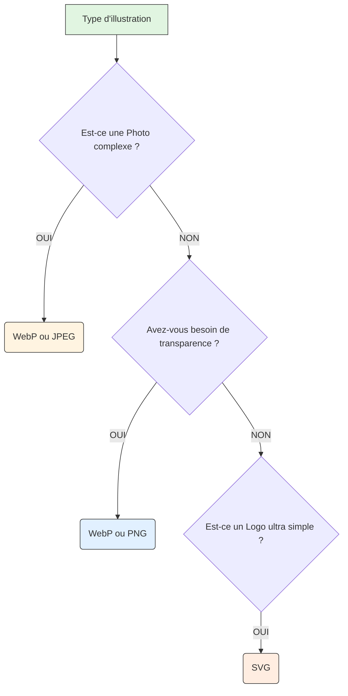

# Images et Médias

<div
  class="omny-meta"
  data-level="🟢 Débutant"
  data-version="1.0"
  data-time="2-3 heures">
</div>

## Introduction

!!! quote "Analogie pédagogique - Le Web Devient Visuel"
    Imaginez un **magazine** : sans photos, sans illustrations, juste du texte noir sur blanc. Ennuyeux, non ? Sur le web, c'est pareil : une page sans images est comme un livre sans illustrations. 
    
    Cependant, intégrer une image sur le web, ce n'est pas comme copier-coller dans Word ! Il va falloir aborder les **formats** (JPEG, WebP, SVG), **les résolutions** adaptatives pour mobile, et le concept **d'accessibilité** pour que les logiciels de synthèse vocale puissent littéralement "lire" vos images aux non-voyants.

Ce module vous apprend à intégrer images, audio et vidéo comme un véritable professionnel : de manière rapide, attrayante et accessible.

<br />

---

## L'intégration classique d'Images

La balise ultime pour appeler une photo est la célèbre orpheline ``. Elle a absoluement besoin d'un attribut source (`src`) pour pointer vers le bon fichier sur votre disque ou sur le web, et d'un attribut de texte alternatif (`alt`) pour la description vocale de sécurité.

### La structure de base

```html title="Code HTML - Intégration d'une image simple"
<!-- Une image minimale, mais accessible -->

```

- **`src="..."`** : Le chemin vers votre fichier. 
- **`alt="..."`** : Si l'image ne charge pas, ou si le visiteur est malvoyant, le navigateur affichera ou lira ce texte alternatif à la place de l'image. (⚠️ S'orienter vers une description contextuelle, n'écrivez jamais *alt="Image"*).

### La gestion du Layout Shift

Lorsqu'un réseau est lent, le navigateur télécharge le texte très vite, puis le texte est d'un coup poussé vers le bas quand la lourde image finit par s'afficher. Pour éviter ce "saut" très dérangent, on doit explicitement réserver le bon espace visuel à l'avance grâce à  `width` et `height`.

```html title="Code HTML - Prévention du Layout Shift"
<!-- Le navigateur réservera un encart vide de 800x600px en attendant l'image ! -->

```

!!! info "Prévenir les 'sauts' de page"
    Si vous ne spécifiez pas `width` et `height`, le navigateur Web ne connaîtra l'encombrement de l'image **qu'après l'avoir téléchargée**. Résultat : le texte sera brutalement repoussé vers le bas pendant la lecture de votre utilisateur. Renseigner les dimensions permet de créer un "fantôme invisible" de la bonne taille dès la première seconde.

<br />

---

## Le choix cornélien des Formats d'images

Un mauvais format = un site web extrêmement lent. Choisir judicieusement va sauver la bande passante de vos internautes sur mobile. 

| Format | Poids | Typologie Idéale |
|--------|-------|------------------|
| **JPEG** | Classique | Photographies réalistes (sans transparence). |
| **PNG** | Lourd | Logos, illustrations simples, *fonds transparents*. |
| **WebP** | **Ultra Léger** | Format Google moderne optimal pour **absoluement tout**. |
| **SVG** | KiloBites | Illustrations vectorielles parfaites, code mathématique tracé par le navigateur (Infini zoom sans pixel). |

**L'Arbre de décision Web moderne :**



<br />

---

## Le Responsive et la "Picture Art Direction"

De nos jours un écran 4K Retina de Mac et un petit écran d'iPhone vieux de 5 ans visualisent la même page. Est-ce pertinent de la part de notre serveur distant d'envoyer l'ultralourde image 4K sur le téléphone ? Non. C'est l'Art du `srcset`.

### Proposer un buffet d'images au navigateur

```html title="Code HTML - Attribut srcset"
<!-- On compile différentes tailles, et le navigateur prendra SEUL celle qu'il trouve adaptée à son écran ! -->

```

!!! note "Fonctionnement du `srcset`"
    Le `w` (pour *width*) indique au navigateur la largeur réelle de l'image disponible sur le serveur. Il calculera lui-même s'il est plus malin de télécharger la version 400px pour un iPhone ou la 1200px pour un grand moniteur 4K !

### La balise experte `<picture>`

Si vous souhaitez aller plus loin, c'est-à-dire carrément forcer une image "Portrait" recadrée pour le mobile et "Paysage" pour le PC (Art Direction) :

```html title="Code HTML - Balise picture"
<picture>
    <!-- Si l'écran fait moins de 600px, on impose l'image serrée du visage -->
    <source media="(max-width: 600px)" srcset="visage-serre-mobile.jpg">
    
    <!-- Sinon par defaut (sur grand PC PC) : -->
    
</picture>
```

<br />

---

## Légender officiellement une image (`<figure>`)

Pendant longtemps on mettait des paragraphes en italique sous les images pour les légender. HTML5 a introduit une vraie structure sémantique professionnelle, idéale pour des articles de blog ou de presse.

```html title="Code HTML - Image avec légende sémantique"
<!-- L'image -->


<!-- La légende : paragraphe avec mention explicite -->
<p><strong>Figure 1 :</strong> Évolution des ventes trimestrielles en 2024.</p>
```

_La légende est un simple paragraphe placé immédiatement après l'image. Le texte `alt` reste indispensable pour les lecteurs d'écran, tandis que le paragraphe visible fournit le contexte éditorial._

<br />

---

## La Révolution Multimédia (Audio & Vidéo)

Oubliez la terrible époque où il fallait installer *Adobe Flash Player*. HTML5 sait lire des médias nativement depuis tous les navigateurs avec un lecteur intégré digne de YouTube ou Spotify.

### Le lecteur Audio (`<audio>`)

La balise possède le fameux attribut `controls` pour faire apparaître le lecteur visuel interactif (lecture, pause, volume).

```html title="Code HTML - balise audio"
<!-- Lecteur musical Mp3 hyper basique -->
<audio src="mon-podcast.mp3" controls>
    Votre vieux navigateur ne supporte pas l'audio HTML5.
</audio>
```

### Le puissant lecteur Vidéo (`<video>`)

Identique à l'audio, mais avec la gestion gracieuse de l'image d'attente/couverture (`poster`).

```html title="Code HTML - balise video"
<!-- Une vidéo qui présente une couverture avant clic -->
<video controls poster="couverture-video.jpg" width="800">
    <source src="presentation.mp4" type="video/mp4">
    <source src="presentation.webm" type="video/webm">
    
    Désolé, votre navigateur est trop archaïque.
</video>
```

!!! tip "Astuce de Pro (Le faux GIF)"
    Pour simuler le comportement d'un bon vieux `GIF` animé ultra fluide, on place en réalité une vidéo mp4 très légère assourdie avec les attributs `autoplay`, `loop` et `muted`. 
    C'est environ **90% moins lourd** à télécharger pour vos visiteurs qu'un véritable format image `.gif` !

<br />

---

## Conclusion et Synthèse

Intégrer une image ou une vidéo est d'une grande simplicité en HTML, mais le faire avec professionnalisme demande d'anticiper son "poids" web, sa "résolution mobile" (`srcset`, `picture`) et son "accessibilité" (`alt`). 

> Dans le module suivant, nous aborderons une des structures de données les plus denses : **les Listes (`ul`, `ol`) et les Tableaux (`table`)**.

<br />
