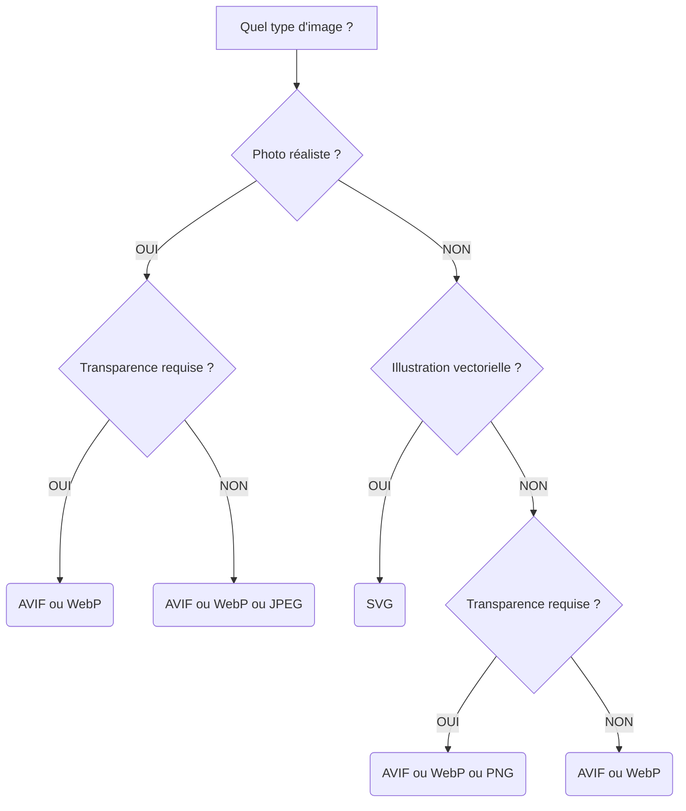

# Images et Médias

<div
  class="omny-meta"
  data-level="🟢 Débutant"
  data-version="1.1"
  data-time="2-3 heures">
</div>

## Introduction

!!! quote "Analogie pédagogique - Le Web Devient Visuel"
    Imaginez un **magazine** : sans photos, sans illustrations, juste du texte noir sur blanc. Ennuyeux, non ? Sur le web, c'est pareil : une page sans images est comme un livre sans illustrations.

    Cependant, intégrer une image sur le web, ce n'est pas comme copier-coller dans Word. Il faut aborder les **formats** (JPEG, WebP, AVIF, SVG), **les résolutions adaptatives** pour mobile, et le concept **d'accessibilité** pour que les logiciels de synthèse vocale puissent littéralement "lire" vos images aux personnes malvoyantes.

Ce module vous apprend à intégrer images, audio et vidéo comme un professionnel : de manière performante, attrayante et accessible.

<br>

---

## L'intégration classique d'Images

La balise de référence pour afficher une image est la balise orpheline ``. Elle requiert obligatoirement un attribut source (`src`) pour pointer vers le fichier, et un attribut de texte alternatif (`alt`) pour l'accessibilité.

<br>

### La structure de base

```html title="HTML - Intégration d'une image accessible"
<!-- Une image minimale conforme aux standards d'accessibilité -->

```

- **`src="..."`** : Le chemin vers votre fichier image (relatif ou absolu).
- **`alt="..."`** : Si l'image ne charge pas, ou si le visiteur utilise un lecteur d'écran, ce texte est lu ou affiché à la place. Toujours écrire une description contextuelle — jamais `alt="Image"` ou `alt=""` sur une image porteuse de sens.

!!! tip "Quand laisser l'attribut `alt` vide ?"
    Si l'image est **purement décorative** (un séparateur visuel, un fond, une bordure graphique), vous devez quand même écrire l'attribut `alt`, mais avec une valeur vide : `alt=""`. Cela indique au lecteur d'écran d'ignorer complètement l'élément. Omettre l'attribut `alt` est une erreur d'accessibilité.

<br>

### La gestion du Layout Shift

Lorsqu'un réseau est lent, le navigateur télécharge le texte très rapidement, puis le contenu est brutalement repoussé vers le bas quand l'image finit par s'afficher. Pour prévenir ce "saut" désagréable, on réserve l'espace visuel à l'avance grâce à `width` et `height`.

```html title="HTML - Prévention du Layout Shift avec dimensions explicites"
<!-- Le navigateur réservera un encart vide de 800x600px en attendant l'image -->

```

*Les attributs `width` et `height` permettent au navigateur de calculer le ratio de l'image avant même de l'avoir téléchargée, et de réserver l'espace correspondant dans la mise en page.*

!!! info "Layout Shift et score de performance"
    Le Layout Shift (déplacement de mise en page) est mesuré par la métrique **CLS (Cumulative Layout Shift)** des Core Web Vitals de Google. Un CLS élevé pénalise directement le référencement naturel de votre site. Renseigner systématiquement `width` et `height` est l'une des corrections les plus simples pour améliorer ce score.

<br>

### Le chargement différé natif (`loading="lazy"`)

Par défaut, le navigateur télécharge **toutes** les images d'une page au chargement, même celles en bas de page que l'utilisateur ne verra peut-être jamais. L'attribut `loading="lazy"` remédie à cela nativement, sans aucune bibliothèque JavaScript.

```html title="HTML - Chargement différé avec loading lazy"
<!-- Le navigateur ne télécharge cette image que lorsqu'elle approche du viewport -->

```

*`loading="lazy"` indique au navigateur de différer le téléchargement de l'image jusqu'à ce qu'elle soit sur le point d'entrer dans la zone visible de l'écran. Le résultat : un chargement initial de la page nettement plus rapide.*

!!! warning "Ne pas utiliser `loading=\"lazy\"` sur les images critiques"
    Les images situées **au-dessus de la ligne de flottaison** (visibles immédiatement à l'ouverture de la page, comme le logo ou le hero banner) ne doivent **pas** avoir `loading="lazy"`. Le navigateur les téléchargerait trop tard, créant un effet de retard visible. Réservez cet attribut aux images situées dans la partie basse de la page.

<br>

---

## Le choix des Formats d'Images

Un mauvais format de fichier équivaut à un site excessivement lent. Choisir correctement le format en fonction du contenu visuel est une décision d'architecture qui impacte directement les performances.

| Format | Poids relatif | Transparence | Cas d'usage idéal |
| --- | --- | --- | --- |
| **JPEG** | Moyen | Non | Photographies réalistes sans fond transparent. |
| **PNG** | Lourd | Oui | Logos, captures d'écran, illustrations avec transparence. |
| **WebP** | Léger | Oui | Remplacement moderne du JPEG et du PNG pour le web. |
| **AVIF** | Très léger | Oui | Format nouvelle génération : compression supérieure à WebP, support navigateur en progression. |
| **SVG** | Minimal (kB) | Oui | Illustrations vectorielles, icônes, logos : qualité infinie quel que soit le zoom. |

**Arbre de décision pour le choix de format :**



*En 2025, AVIF offre la meilleure compression disponible. Pour une compatibilité maximale, combinez AVIF, WebP et JPEG en format de repli via la balise `<picture>` présentée ci-dessous.*

<br>

---

## Le Responsive et l'Art Direction (`srcset` et `<picture>`)

Un écran 4K Retina et un iPhone d'entrée de gamme consultent la même page. Envoyer une image 4K sur un téléphone avec une connexion limitée est un gaspillage de bande passante considérable. HTML5 fournit deux mécanismes natifs pour y remédier.

<br>

### Proposer des tailles adaptées avec `srcset`

L'attribut `srcset` propose **plusieurs versions de la même image** au navigateur, qui choisit automatiquement la plus appropriée selon la densité d'écran et la résolution disponible.

```html title="HTML - Attribut srcset avec plusieurs résolutions"
<!-- Le navigateur choisit seul la version la plus adaptée à l'écran -->

```

*Le `w` (pour *width*) indique la largeur réelle de chaque fichier. L'attribut `sizes` précise quelle largeur l'image occupera dans la mise en page selon le viewport — le navigateur combine ces deux informations pour choisir le fichier optimal.*

!!! note "La différence entre `srcset` et `<picture>`"
    `srcset` laisse le navigateur décider seul de la version à télécharger en fonction des caractéristiques de l'écran. `<picture>` vous donne un **contrôle total** sur cette décision, en vous permettant d'imposer un format ou un cadrage selon le contexte.

<br>

### Contrôle total avec `<picture>`

La balise `<picture>` permet deux usages distincts et complémentaires.

**Usage 1 — Format switching (recommandé en production)**

C'est l'usage le plus courant : proposer un format moderne (AVIF, WebP) avec un repli gracieux vers JPEG pour les navigateurs plus anciens.

```html title="HTML - Format switching AVIF → WebP → JPEG"
<picture>
    <!-- Format nouvelle génération : téléchargé si le navigateur le supporte -->
    <source srcset="photo.avif" type="image/avif">

    <!-- Format moderne : second choix si AVIF non supporté -->
    <source srcset="photo.webp" type="image/webp">

    <!-- Repli universel : toujours en dernier, supporté par 100% des navigateurs -->
    
</picture>
```

*Le navigateur lit les `<source>` dans l'ordre et utilise le premier format qu'il supporte. La balise `` finale est indispensable : elle sert à la fois de repli pour les navigateurs très anciens et porte les attributs `alt`, `width`, `height` et `loading`.*

**Usage 2 — Art Direction (cadrage adaptatif selon l'écran)**

On impose une composition différente de l'image selon le type d'appareil — un plan serré sur mobile, un plan large sur desktop.

```html title="HTML - Art direction avec cadrage différent selon le viewport"
<picture>
    <!-- Sur mobile (moins de 600px) : image recadrée verticalement sur le sujet -->
    <source media="(max-width: 600px)" srcset="portrait-serre-mobile.jpg">

    <!-- Sur tablette et desktop : image paysage complète -->
    
</picture>
```

<br>

---

## Légender une image

Pour associer une légende visible à une image, la bonne pratique est de placer un paragraphe immédiatement après la balise ``.

```html title="HTML - Image avec légende éditoriale"

<p><em>Figure 1 — Évolution des ventes trimestrielles en 2024. Source : rapport interne Q3.</em></p>
```

*Le texte `alt` décrit le contenu factuel de l'image pour les lecteurs d'écran. La légende visible apporte le contexte éditorial pour les lecteurs voyants. Ces deux informations sont complémentaires et non redondantes.*

<br>

---

## Les Images Cliquables et les Cartes (`<map>` et `<area>`)

Une **image map** permet de définir plusieurs **zones cliquables** sur une seule et même image. Chaque zone est un lien indépendant pointant vers une destination différente. C'est une technique HTML native, sans JavaScript.

L'association se fait via l'attribut `usemap` sur ``, qui pointe vers l'`id` d'un élément `<map>`. Chaque zone est définie par une balise `<area>`.

```html title="HTML - Image map avec zones cliquables"
<!-- L'image avec son usemap pointant vers la carte définie ci-dessous -->


<!-- La carte : l'id doit correspondre à l'usemap (sans le #) -->
<map name="carte-france" id="carte-france">

    <!-- Zone rectangulaire : coords = x_gauche, y_haut, x_droite, y_bas -->
    <area
        shape="rect"
        coords="120,80,280,200"
        href="/regions/bretagne"
        alt="Bretagne"
    >

    <!-- Zone circulaire : coords = x_centre, y_centre, rayon -->
    <area
        shape="circle"
        coords="310,340,60"
        href="/regions/auvergne-rhone-alpes"
        alt="Auvergne-Rhône-Alpes"
    >

    <!-- Zone polygonale : liste de paires x,y définissant le périmètre -->
    <area
        shape="poly"
        coords="200,420,260,390,310,430,270,480,200,460"
        href="/regions/occitanie"
        alt="Occitanie"
    >

</map>
```

*Les trois formes disponibles sont `rect` (rectangle), `circle` (cercle) et `poly` (polygone libre). L'attribut `alt` sur chaque `<area>` est obligatoire pour l'accessibilité — il joue le même rôle que le `alt` d'une image.*

!!! note "Les coordonnées d'une image map"
    Les coordonnées sont exprimées en pixels à partir du coin supérieur gauche de l'image. L'outil le plus pratique pour les calculer est l'extension **Image Map Generator** disponible pour les principaux éditeurs de code, ou des outils en ligne comme `image-map.net`.

!!! warning "Image maps et responsive design"
    Les coordonnées d'une image map sont définies en pixels fixes et ne s'adaptent pas automatiquement si l'image est redimensionnée via CSS. En production responsive, il faut soit maintenir une taille d'image fixe, soit recalculer les coordonnées proportionnellement via JavaScript. Pour les interfaces modernes, les image maps sont souvent remplacées par des `<div>` positionnés en absolu sur l'image.

<br>

---

## La Révolution Multimédia : Audio et Vidéo

HTML5 permet de lire des médias nativement dans le navigateur, sans plugin externe.

<br>

### Le lecteur Audio (`<audio>`)

L'attribut `controls` déclenche l'affichage du lecteur visuel natif du navigateur (lecture, pause, volume, progression).

```html title="HTML - Lecteur audio avec sources multiples"
<audio controls>
    <!-- Format OGG Vorbis : meilleure compression, supporté par Firefox et Chrome -->
    <source src="podcast-episode-12.ogg" type="audio/ogg">

    <!-- Format MP3 : repli universel supporté par tous les navigateurs modernes -->
    <source src="podcast-episode-12.mp3" type="audio/mpeg">

    <!-- Message de repli pour les navigateurs très anciens -->
    <p>Votre navigateur ne supporte pas la lecture audio HTML5.
       <a href="podcast-episode-12.mp3">Télécharger le fichier MP3.</a>
    </p>
</audio>
```

*Comme pour `<video>`, proposer plusieurs formats garantit une compatibilité maximale. Le navigateur utilise le premier `<source>` qu'il sait lire.*

**Attributs importants de `<audio>` :**

| Attribut | Rôle |
| --- | --- |
| `controls` | Affiche le lecteur visuel natif du navigateur. |
| `autoplay` | Lance la lecture automatiquement (désactivé par les navigateurs mobiles sans `muted`). |
| `loop` | Relance la lecture en boucle à la fin du fichier. |
| `muted` | Démarre le son coupé. |
| `preload` | `auto`, `metadata` ou `none` — contrôle le préchargement du fichier. |

<br>

### Le lecteur Vidéo (`<video>`)

Identique à `<audio>` dans sa logique, enrichi de l'attribut `poster` pour afficher une image de couverture avant le démarrage de la lecture.

```html title="HTML - Lecteur vidéo avec sources multiples et poster"
<video
    controls
    poster="couverture-presentation.jpg"
    width="800"
    height="450"
>
    <!-- Format WebM : meilleure compression, natif dans Chrome et Firefox -->
    <source src="presentation.webm" type="video/webm">

    <!-- Format MP4/H.264 : repli universel supporté partout -->
    <source src="presentation.mp4" type="video/mp4">

    <!-- Repli textuel avec lien de téléchargement -->
    <p>Votre navigateur ne supporte pas la lecture vidéo HTML5.
       <a href="presentation.mp4" download>Télécharger la vidéo MP4.</a>
    </p>
</video>
```

*L'attribut `poster` définit l'image affichée avant que l'utilisateur lance la lecture. Si omis, le navigateur affiche la première image du fichier vidéo.*

!!! tip "La technique du faux GIF animé"
    Pour simuler un GIF animé avec une qualité et un poids bien supérieurs, on utilise une vidéo courte sans son avec les attributs `autoplay`, `loop`, `muted` et `playsinline` (indispensable sur iOS).

    ```html title="HTML - Remplacement performant d'un GIF animé"
    <!-- Une vidéo mp4 courte pèse environ 90% moins qu'un GIF équivalent -->
    <video autoplay loop muted playsinline width="600" height="400">
        <source src="animation-hero.webm" type="video/webm">
        <source src="animation-hero.mp4" type="video/mp4">
    </video>
    ```

    *`playsinline` est obligatoire sur iOS pour que la vidéo se lance dans la page sans passer en plein écran automatiquement.*

<br>

---

## Conclusion

!!! quote "Ce qu'il faut retenir de ce module"
    Intégrer des médias avec professionnalisme requiert de maîtriser trois dimensions simultanément : les **performances** (`loading="lazy"`, choix du format, `srcset`), l'**accessibilité** (attribut `alt` descriptif, `alt=""` sur les décoratifs, `alt` sur les `<area>`), et la **compatibilité** (sources multiples sur `<audio>` et `<video>`, format switching via `<picture>`). AVIF et WebP sont les formats de référence en 2025 — JPEG et PNG ne servent plus que de repli universel.

> Dans le module suivant, nous aborderons une des structures de données les plus denses du HTML : **les Listes (`ul`, `ol`, `dl`) et les Tableaux matriciels** (`caption`, `thead`, `tbody`, `tfoot`, `colspan`, `rowspan`).

<br>