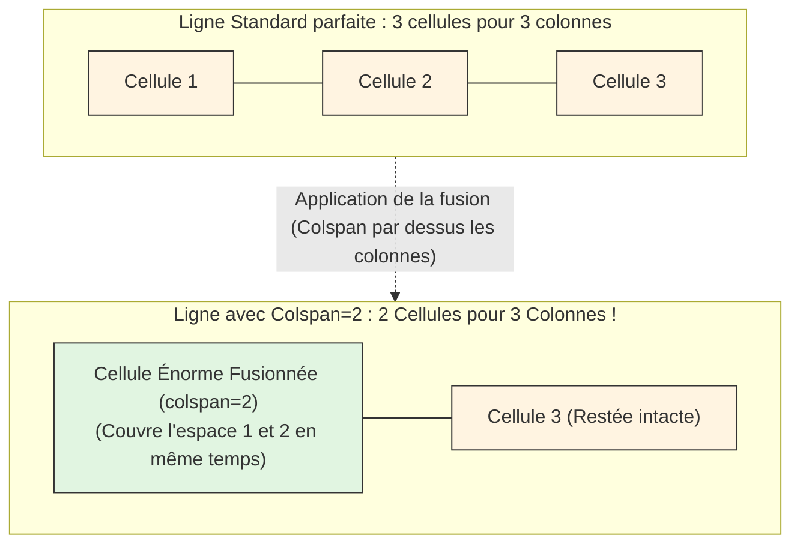

# Listes et Tableaux

<div
  class="omny-meta"
  data-level="🟢 Débutant"
  data-version="1.0"
  data-time="2-3 heures">
</div>


## Introduction

!!! quote "Analogie pédagogique - Ranger et Organiser"
    _Imaginez un **supermarché**. Sans allées ni panneaux d'indications, ce serait le chaos total : les produits seraient jetés en vrac au sol. Les **listes** sont comme les rayons d'un magasin ("Fruits et légumes" via une liste à puces, ou les étapes chronologiques d'une recette via une liste ordonnée)._

!!! abstract "Structurer l'Information Complexe"
    L'organisation visuelle d'un document brut passe par le rangement de ses données sérielles. 
    Les **listes** ne sont pas que de simples entassements de paragraphes : elles permettent de numéroter de manière stricte (_avec l'attribut de style matriciel `type` comme l'alphabet ou les chiffres romains_), de créer des sous-menus, ou des lexiques métiers avancés (_listes de définitions_). 
    
    Les **tableaux** sont de puissantes matrices dimensionnelles. Un tableau de données ce n'est pas juste d'écrire à la hâte des lignes (`<tr>`) et des cellules (`<td>`). Un tableau de qualité professionnelle possède des attributs sémantiques stricts : un titre officiel ancré (`<caption>`), une structure corporelle explicite qui ne dépend pas de l'ordre dont vous codez le HTML (`<thead>`, `<tbody>`, `<tfoot>`), et la faculté géométrique de fusionner des cellules de haut en bas (`rowspan`) ou de gauche à droite (`colspan`). 

Ce module va dans la profondeur technique des tableaux et des listes en HTML. On ne survole pas. On décortique chaque mécanisme de fusion et de comportement du navigateur.

<br />

---

## Les Listes (Non-Odonnées et Ordonnées)

### La Liste à puces (`<ul>`) et l'attribut Type
L'Acronyme UL signifie *Unordered List*. L'ordre de ses enfants *List Item* (`<li>`) n'a pas d'importance sémantique. 
Historiquement et visuellement, on peut modifier la forme de la puce directement en HTML avec l'attribut `type`. 

!!! info "**Bien qu'aujourd'hui, pour des raisons de séparation des pouvoirs, c'est le langage CSS qui gère le design visuel des puces**."

```html
<!-- `type="circle"` rend la puce vide, `square` la rend carrée, `disc` est le défaut (point plein). -->
<ul type="square">
    <li>Des Pommes de Terre</li>
    <li>Des Bananes</li>
</ul>
```

### La Liste Numérotée (`<ol>`) et les valeurs du Type
Acronyme de *Ordered List*. L'ordre est sémantiquement vital (_une recette par étape, un classement des 100 meilleures entreprises_). L'attribut `type` prend ici tout son sens pour changer le système numéraire de la liste selon vos besoins d'affichage. L'ordinateur incrémentera la suite mathématique automatiquement à chaque nouvel élément `<li>`.

```html
<!-- 
     Le type change la logique de lecture de la liste par le navigateur :
     type="I" imposera des chiffres romains majuscules (I, II, III, IV...)
     type="A" imposera l'alphabet majuscule ordonné (A, B, C...)
     type="a" imposera l'alphabet minuscule (a, b, c...)
     type="1" est le système décimal de base par défaut (1, 2, 3...) 
-->
<ol type="A">
    <li>Préchauffer le four.</li>
    <li>Mélanger la farine.</li>
    <li>Cuire la préparation à 150 degrés.</li>
</ol>
```
!!! warning "*Si vous inversez l'ordre des `<li>` de la recette : c'est un échec cuilinaire total (vous ne pouvez pas cuire un oeuf et verser de la farine froide dessus).*"

### Les Listes de définition (`<dl>`)
Totalement méconnues et pourtant vitales en SEO Sémantique. Elles sont spécialement conçues pour créer un **Glossaire**. Le bloc est composé du parent `<dl>` (_Definition List_), du terme ou mot-clé `<dt>` (_Definition Term_), et de la définition stricte du ce mot `<dd>` (_Definition Description_).

```html
<dl>
    <dt>HTML</dt>
    <dd>Langage de balisage utilisé pour structurer la colonne vertébrale des pages web.</dd>
    <dt>CSS</dt>
    <dd>Feuilles de style visant à maquiller et animer les balisages.</dd>
</dl>
```

<br />

---

## Construire un Tableau matriciel

La grande loi du codeur Web des années 2020 : **Il est formellement interdit d'utiliser un tableau HTML pour faire du design visuel** (Comme mettre vos images côtes à côtes). Un Tableau HTML est **exclusivement** réservé à des tableaux croisés de données (Un tarif horaire croisé à des jours, une base de données de résultats bancaires).

### Le Squelette simple et le tag unique `<caption>`
Contrairement à la croyance populaire, un tableau n'a pas l'obligation d'avoir une arborescence complexe en 3 blocs. Il peut très bien n'être constitué que d'une simple balise mère `<table>`, constituée de lignes (`<tr>`) et de cellules de données brutes (`<td>` ou cellules de têtes en gras `<th>`).

Cependant, **pour que votre tableau ne soit pas rejeté par l'accessibilité Web**, le tout premier enfant direct de `<table>` doit impérativement être la balise orpheline `<caption>`. Il s'agit du **Titre** officiel et sémantique du tableau (_Lu par les synthèses vocales pour résumer_).

```html
<table>
    <!-- Le `caption` se positionne obligatoirement EN PREMIER dans un `table` -->
    <caption>Horaires d'ouverture de la Bibliothèque</caption>
    
    <tr>
        <th>Lundi</th> <!-- En-tête : affiché en Gras et Centré par le navigateur par défaut-->
        <td>Fermé au public</td> 
    </tr>
    <tr>
        <th>Mardi</th>
        <td>09h00 - 18h30</td>
    </tr>
</table>
```

### La Super-Structure Métier (Thead, Tbody, Tfoot)

Lorsque le tableau contient des centaines de données, on le fragmente en 3 blocs stricts à la manière d'un corps humain. Cela permet au navigateur (_ou à l'imprimante_) de répéter perpétuellement son "En-Tête" sur plusieurs pages imprimées pendant qu'on scrolle le corps.

Le détail fascinant de l'ingénierie du W3C[^1] c'est le comportement illogique à première vue de l'ordre du `<tfoot>` :
Historiquement (HTML4), le Pied de Tableau (`<tfoot>`) **devait** être écrit juste après le `<thead>` (donc, avant même le contenu corporel du `<tbody>` !), pour que le petit processeur du navigateur sache visuellement quoi prévoir de dessiner tout en bas avant d'être englouti par des milliers de lignes de textes qu'on téléchargeait sur des modems lents de 56k.
Aujourd'hui, quoi qu'il arrive et quel que soit l'endroit où vous l'écrivez dans votre fichier source (avant, au beau milieu, ou après le TBody), **le navigateur HTML le propulsera visuellement toujours tout en bas du tableau à votre écran**. Vous n'avez pas à vous soucier de son ordre dans le code pour peu qui'l soit dans le `<table>` !

```html
<table>
    <caption>Tableau de bord comptable provisoire de Q2</caption>
    
    <!-- 1. L'en-tête fixe -->
    <thead>
        <tr>
            <th>Employé</th>
            <th>Ventes du Mois</th>
        </tr>
    </thead>
    
    <!-- 2. La masse énorme de données courantes -->
    <tbody>
        <tr>
            <td>Jeanne</td>
            <td>4000 €</td>
        </tr>
        <!-- (...) Des dizaines et centaines d'autres lignes ici (...) -->
    </tbody>
    
    <!-- 3. Le Pied de page de bilan. -->
    <tfoot>
        <tr>
            <th>TOTAL GENERAL</th>
            <td>4000 €</td>
        </tr>
    </tfoot>
</table>
```

<br />

---

## Fusionner la matrice : Colspan & Rowspan

Si vous travaillez sur Excel, vous savez qu'un simple damier régulier ne suffit pas toujours à rendre une donnée pertinente (_Un total prend généralement toute la largeur de sa dernière ligne !_). Le HTML propose deux "absorptions" dimensionnelles.

### Étendre Horizontalement (L'arme `colspan`)

!!! note "L'attribut `colspan="X"` indique à la cellule ordonnée : "Étale-toi physiquement et mange goulument l'espace destiné aux X prochaines colonnes"."

```html
<table>
    <tr>
        <th>Produit</th>
        <th>Quantité</th>
        <th>Prix Unitaire</th>
    </tr>
    <tr>
        <!-- Cette cellule s'étend vers la DROITE pour 2 colonnes au total... 
             Elle écrase l'espace "Quantité" sous ses pieds virtuellement. -->
        <td colspan="2">**TOTAL DE LA FACTURE COURANTE**</td>
        <td>150 €</td>
    </tr>
</table>
```

**Représentation schématique du Colspan (Étirement à l'horizontale Axe-X) :**



### Étendre Verticalement (L'arme délicate `rowspan`)

!!! note "L'attribut `rowspan="X"` est plus technique à maitriser à l'aveugle dans son code. Il ordonne à une cellule de "glisser vers le bas", de transpercer la matrice et de traverser littéralement les Lignes (`<tr>`) suivantes du code."

```html
<table>
    <tr>
        <!-- Cette case fond vers le sous-sol... et s'étale sur la 2ème ligne qui suivra. -->
        <th rowspan="2">Région Ouest de la France</th>
        <td>Boutique Nantes</td>
        <td>+10%</td>
    </tr>
    <tr>
        <!-- ATTENTION VITAL : On n'écrit pas de cellule 'Région Ouest' ici... ! 
             La case th du dessus a dégoulinée et pris l'espace physique du vide à gauche ! -->
        <td>Boutique Brest</td>
        <td>-2%</td>
    </tr>
</table>
```
*Le secret du codeur : Quand vous utilisez un `rowspan=2`, la Ligne Suivante dans votre code source de la page `04-index.html` DOIT contenir une cellule en moins que la normale, car la grosse case supérieure à coulée pour occuper sa place vide !*

<br />

---

## Conclusion et Synthèse

Les listes et les tableaux sont des outils purement sémantiques et structurels. Une liste bien formée permet une navigation claire, tandis qu'un tableau matriciel doté de `<caption>`, `<thead>`, `<tbody>` et `<tfoot>` est impératif pour une donnée statistique respectueuse des normes d'accessibilité.

> Dans le module suivant, nous apprendrons à doter nos pages de la mécanique la plus complexe du HTML pour échanger de la donnée avec l'utilisateur final : **Les Formulaires et leurs dizaines d'états temporels de soumissions.**

<br />


[^1]: Le **W3C (World Wide Web Consortium)** est une organisation internationale qui définit et standardise les technologies fondamentales du Web — comme HTML, CSS ou les normes d’accessibilité — afin de garantir l’interopérabilité, la compatibilité et l’évolution ouverte du Web.
