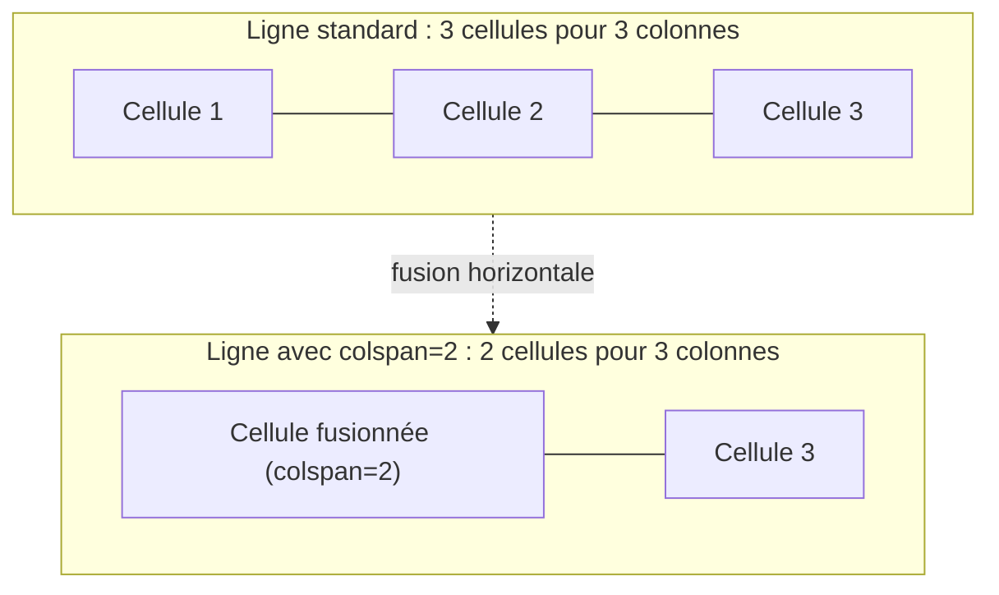

# Listes et Tableaux

<div
  class="omny-meta"
  data-level="🟢 Débutant"
  data-version="1.1"
  data-time="2-3 heures">
</div>

## Introduction

!!! quote "Analogie pédagogique - Ranger et Organiser"
    Imaginez un **supermarché**. Sans allées ni panneaux d'indications, ce serait le chaos total : les produits seraient jetés en vrac au sol. Les **listes** sont comme les rayons d'un magasin ("Fruits et légumes" via une liste à puces, ou les étapes chronologiques d'une recette via une liste ordonnée).

!!! info "Structurer l'information complexe"
    Les **listes** ne sont pas que de simples entassements de paragraphes : elles permettent de numéroter avec différents systèmes (alphabet, chiffres romains), de créer des sous-menus imbriqués, ou des glossaires métiers avancés.

    Les **tableaux** sont des matrices dimensionnelles. Un tableau professionnel possède un titre officiel (`<caption>`), une structure corporelle explicite (`<thead>`, `<tbody>`, `<tfoot>`), des en-têtes accessibles (`scope` sur `<th>`), et la faculté géométrique de fusionner des cellules (`colspan`, `rowspan`).

Ce module décortique chaque mécanisme de liste et de tableau HTML. On ne survole pas.

<br>

---

## Les Listes

<br>

### La Liste à puces (`<ul>`)

L'acronyme UL signifie *Unordered List*. L'ordre de ses éléments `<li>` (*List Item*) n'a pas d'importance sémantique. On l'utilise pour des énumérations dont les éléments sont interchangeables.

!!! info "L'attribut `type` sur `<ul>` est obsolète depuis HTML5"
    L'attribut `type="circle"`, `type="square"` ou `type="disc"` sur `<ul>` était la méthode HTML4 pour changer la forme des puces. En HTML5, cette responsabilité appartient exclusivement au CSS via la propriété `list-style-type`. Ne l'utilisez plus dans le code HTML.

```html title="HTML - Liste à puces non ordonnée"
<ul>
    <li>Pommes de terre</li>
    <li>Carottes</li>
    <li>Oignons</li>
</ul>
```

<br>

### La Liste Numérotée (`<ol>`)

Acronyme de *Ordered List*. L'ordre est sémantiquement vital : une recette par étape, un classement, une procédure technique. Le navigateur incrémente automatiquement la numérotation.

```html title="HTML - Liste ordonnée avec système de numérotation personnalisé"
<!--
    L'attribut type change le système de numérotation :
    type="1" → décimal par défaut (1, 2, 3...)
    type="A" → alphabet majuscule (A, B, C...)
    type="a" → alphabet minuscule (a, b, c...)
    type="I" → chiffres romains majuscules (I, II, III...)
    type="i" → chiffres romains minuscules (i, ii, iii...)
-->
<ol type="A">
    <li>Préchauffer le four à 180°C.</li>
    <li>Mélanger la farine et les œufs.</li>
    <li>Cuire 25 minutes.</li>
</ol>
```

*L'attribut `type` sur `<ol>` reste valide en HTML5 — contrairement à `<ul>`. Il modifie le système de numérotation affiché sans affecter la valeur sémantique ordinale des éléments.*

!!! warning "Respecter l'ordre dans une liste ordonnée"
    Inverser l'ordre des `<li>` d'une procédure technique ou d'une recette produit un résultat incorrect. L'ordre des éléments dans un `<ol>` est porteur de sens : le navigateur les numérotera dans l'ordre où ils sont écrits dans le code.

**Attributs complémentaires de `<ol>` :**

| Attribut | Rôle | Exemple |
| --- | --- | --- |
| `start="X"` | Démarre la numérotation à partir de X | `<ol start="5">` commence à 5 |
| `reversed` | Numérote en ordre décroissant | `<ol reversed>` : 3, 2, 1 |
| `type` | Définit le système de numérotation | `type="I"` pour les chiffres romains |

```html title="HTML - Liste ordonnée avec start et reversed"
<!-- Un classement qui commence au rang 4, numéroté à rebours -->
<ol start="6" reversed type="1">
    <li>Bronze — Mathieu DUPONT</li>  <!-- Affiché : 6 -->
    <li>Argent — Sophie MARTIN</li>   <!-- Affiché : 5 -->
    <li>Or — Laura BERNARD</li>       <!-- Affiché : 4 -->
</ol>
```

<br>

### Les Listes de Définition (`<dl>`)

Méconnues mais puissantes. La balise `<dl>` (*Definition List*) est conçue pour deux usages complémentaires : les glossaires, et les interfaces présentant des paires clé/valeur.

```html title="HTML - Glossaire technique avec dl, dt, dd"
<!-- Glossaire : chaque terme (dt) est suivi de sa définition (dd) -->
<dl>
    <dt>HTML</dt>
    <dd>Langage de balisage structurant la colonne vertébrale des pages web.</dd>

    <dt>CSS</dt>
    <dd>Feuilles de style en cascade gérant l'apparence visuelle des éléments HTML.</dd>

    <dt>JavaScript</dt>
    <dd>Langage de programmation apportant l'interactivité et le comportement dynamique.</dd>
</dl>
```

*`<dl>` est le parent de la liste. `<dt>` (*Definition Term*) porte le terme ou la clé. `<dd>` (*Definition Description*) porte sa valeur ou explication.*

!!! tip "Usage interface : paires clé/valeur"
    `<dl>` est particulièrement adapté pour afficher les métadonnées d'un article, les caractéristiques d'un produit, ou le résumé d'un formulaire soumis — tous ces contextes où on présente des paires "libellé : valeur".

    ```html title="HTML - Fiche produit avec dl (paires clé/valeur)"
    <!-- Fiche produit : usage dl pour les caractéristiques -->
    <dl>
        <dt>Référence</dt>
        <dd>PRD-2024-0472</dd>

        <dt>Poids</dt>
        <dd>1,4 kg</dd>

        <dt>Disponibilité</dt>
        <dd>En stock (23 unités)</dd>
    </dl>
    ```

<br>

### Les Listes Imbriquées

Une liste peut contenir une autre liste. C'est le mécanisme fondamental des menus de navigation multi-niveaux et des structures hiérarchiques.

```html title="HTML - Listes imbriquées multi-niveaux"
<!-- Menu de navigation principal avec sous-menus -->
<ul>
    <li>Accueil</li>

    <li>Nos Services
        <!-- Sous-liste imbriquée directement dans le li parent -->
        <ul>
            <li>Développement Web</li>
            <li>Cybersécurité
                <!-- Troisième niveau -->
                <ul>
                    <li>Audit de sécurité</li>
                    <li>Tests d'intrusion</li>
                    <li>Formation GRC</li>
                </ul>
            </li>
            <li>Conseil en architecture</li>
        </ul>
    </li>

    <li>Contact</li>
</ul>
```

*La sous-liste doit être placée **à l'intérieur** du `<li>` parent, jamais après lui. Le navigateur considère que le contenu d'un `<li>` inclut tout ce qui se trouve entre son ouverture et sa fermeture.*

!!! warning "Imbriquer différents types de listes"
    Il est tout à fait valide d'imbriquer un `<ol>` dans un `<ul>` et inversement. Les technologies d'assistance et les moteurs de recherche respectent la hiérarchie sémantique quelle que soit la combinaison de types.

    ```html title="HTML - Imbrication ol dans ul"
    <ul>
        <li>Recettes salées
            <ol>
                <li>Préparer les légumes</li>
                <li>Faire revenir à feu vif</li>
                <li>Assaisonner</li>
            </ol>
        </li>
    </ul>
    ```

<br>

---

## Construire un Tableau Matriciel

**Règle absolue du développement web moderne :** un tableau HTML est réservé exclusivement à l'affichage de **données tabulaires** (tarifs croisés avec des dates, résultats financiers, comparatifs techniques). Il est formellement interdit de l'utiliser pour mettre en page des éléments visuels — c'est le rôle de CSS Flexbox et Grid.

<br>

### Le squelette minimal et la balise `<caption>`

Un tableau peut n'être composé que d'une balise `<table>` avec des lignes `<tr>` et des cellules `<td>` ou `<th>`. Mais pour être **conforme aux normes d'accessibilité**, le premier enfant direct de `<table>` doit impérativement être `<caption>` — le titre officiel et sémantique du tableau, lu par les synthèses vocales.

```html title="HTML - Tableau minimal accessible avec caption"
<table>
    <!-- Le caption se positionne OBLIGATOIREMENT en premier dans table -->
    <caption>Horaires d'ouverture de la Bibliothèque municipale</caption>

    <tr>
        <!-- th : cellule d'en-tête (gras et centré par défaut) -->
        <th>Jour</th>
        <th>Horaires</th>
    </tr>
    <tr>
        <td>Lundi</td>
        <td>Fermé</td>
    </tr>
    <tr>
        <td>Mardi</td>
        <td>09h00 – 18h30</td>
    </tr>
</table>
```

<br>

### L'attribut `scope` sur `<th>` (accessibilité)

Pour les tableaux comportant plusieurs colonnes, l'attribut `scope` indique aux lecteurs d'écran si un `<th>` est l'en-tête d'une **colonne** (`scope="col"`) ou d'une **ligne** (`scope="row"`). Sans lui, un lecteur d'écran ne peut pas associer correctement les données à leurs en-têtes.

```html title="HTML - Tableau avec scope pour l'accessibilité"
<table>
    <caption>Résultats trimestriels par département</caption>
    <thead>
        <tr>
            <!-- scope="col" : cet en-tête s'applique à toute la colonne en dessous -->
            <th scope="col">Département</th>
            <th scope="col">T1</th>
            <th scope="col">T2</th>
            <th scope="col">T3</th>
        </tr>
    </thead>
    <tbody>
        <tr>
            <!-- scope="row" : cet en-tête s'applique à toute la ligne à droite -->
            <th scope="row">Commercial</th>
            <td>48 000 €</td>
            <td>53 200 €</td>
            <td>61 400 €</td>
        </tr>
        <tr>
            <th scope="row">Marketing</th>
            <td>12 000 €</td>
            <td>15 800 €</td>
            <td>14 200 €</td>
        </tr>
    </tbody>
</table>
```

*Un lecteur d'écran lisant la cellule "61 400 €" annoncera "Commercial, T3, 61 400 euros" grâce aux attributs `scope`. Sans `scope`, il lirait seulement le contenu brut de la cellule sans contexte.*

<br>

### La Super-Structure Métier (`<thead>`, `<tbody>`, `<tfoot>`)

Lorsque le tableau contient de nombreuses données, on le fragmente en trois blocs sémantiques. Cela permet au navigateur et à l'imprimante de répéter l'en-tête sur chaque page lors d'une impression de tableau long.

!!! info "L'ordre historique du `<tfoot>` en HTML4"
    En HTML4, le `<tfoot>` **devait** être écrit juste après le `<thead>`, avant le `<tbody>`. La raison : sur des modems 56k, le navigateur commençait à afficher le tableau avant d'avoir fini de le télécharger. En connaissant le pied de tableau à l'avance, il pouvait le positionner en bas pendant que le corps se chargeait.

    En HTML5, cette contrainte a disparu. Quel que soit l'endroit où vous écrivez le `<tfoot>` dans votre code, **le navigateur le positionnera toujours visuellement en bas du tableau**.

```html title="HTML - Tableau complet avec thead, tbody, tfoot et scope"
<table>
    <caption>Tableau de bord comptable — Q2 2024</caption>

    <!-- En-tête fixe, répété à l'impression sur chaque page -->
    <thead>
        <tr>
            <th scope="col">Employé</th>
            <th scope="col">Ventes du mois</th>
        </tr>
    </thead>

    <!-- Corps : la masse des données -->
    <tbody>
        <tr>
            <th scope="row">Jeanne DUPONT</th>
            <td>4 000 €</td>
        </tr>
        <tr>
            <th scope="row">Marc LEFEBVRE</th>
            <td>6 200 €</td>
        </tr>
    </tbody>

    <!-- Pied : toujours affiché en bas quel que soit sa position dans le code -->
    <tfoot>
        <tr>
            <th scope="row">TOTAL GÉNÉRAL</th>
            <td>10 200 €</td>
        </tr>
    </tfoot>
</table>
```

<br>

### Styliser des colonnes entières avec `<colgroup>` et `<col>`

Par défaut, il est impossible d'appliquer un style CSS à une colonne entière sans styler chaque cellule individuellement. La balise `<colgroup>` avec ses enfants `<col>` résout ce problème.

```html title="HTML - Colgroup et col pour styler des colonnes"
<table>
    <caption>Planning hebdomadaire de l'équipe</caption>

    <!--
        colgroup définit les colonnes du tableau.
        L'attribut span indique combien de colonnes successives ce col représente.
        On peut appliquer une classe CSS ou un style directement sur chaque col.
    -->
    <colgroup>
        <col style="width: 150px;">              <!-- Colonne 1 : noms -->
        <col class="col-weekend" span="2">        <!-- Colonnes 2-3 : lundi-mardi -->
        <col class="col-semaine" span="3">        <!-- Colonnes 4-6 : mer-jeu-ven -->
        <col class="col-weekend" span="2">        <!-- Colonnes 7-8 : sam-dim -->
    </colgroup>

    <thead>
        <tr>
            <th scope="col">Employé</th>
            <th scope="col">Lun</th>
            <th scope="col">Mar</th>
            <th scope="col">Mer</th>
            <th scope="col">Jeu</th>
            <th scope="col">Ven</th>
            <th scope="col">Sam</th>
            <th scope="col">Dim</th>
        </tr>
    </thead>
    <tbody>
        <tr>
            <th scope="row">Alice</th>
            <td>Présente</td>
            <td>Présente</td>
            <td>Présente</td>
            <td>Télétravail</td>
            <td>Présente</td>
            <td>—</td>
            <td>—</td>
        </tr>
    </tbody>
</table>
```

*`<colgroup>` doit se placer **après** `<caption>` et **avant** `<thead>`. L'attribut `span` sur `<col>` permet de regrouper plusieurs colonnes consécutives sous une même règle CSS.*

!!! warning "Propriétés CSS limitées sur `<col>`"
    Seules quatre propriétés CSS s'appliquent directement sur `<col>` : `background`, `border`, `visibility` et `width`. Les autres propriétés comme `color`, `padding` ou `font-size` sont ignorées — elles doivent être appliquées directement sur les cellules via une classe partagée.

<br>

---

## Fusionner la Matrice : `colspan` et `rowspan`

Un damier régulier ne suffit pas toujours pour représenter des données complexes. HTML propose deux attributs de fusion dimensionnelle.

<br>

### Étendre horizontalement : `colspan`

`colspan="X"` ordonne à une cellule de s'étendre vers la droite en occupant l'espace de X colonnes.

```html title="HTML - Fusion horizontale avec colspan"
<table>
    <caption>Facture de prestation — Mars 2024</caption>
    <thead>
        <tr>
            <th scope="col">Prestation</th>
            <th scope="col">Quantité</th>
            <th scope="col">Prix unitaire</th>
        </tr>
    </thead>
    <tbody>
        <tr>
            <td>Audit de sécurité</td>
            <td>3 jours</td>
            <td>1 200 €</td>
        </tr>
    </tbody>
    <tfoot>
        <tr>
            <!--
                Cette cellule s'étend sur 2 colonnes (Prestation + Quantité).
                La ligne ne contient donc plus que 2 cellules au lieu de 3.
            -->
            <td colspan="2">TOTAL DE LA FACTURE</td>
            <td>3 600 €</td>
        </tr>
    </tfoot>
</table>
```

*Lorsqu'une cellule utilise `colspan="2"`, la ligne concernée ne doit contenir que N-1 cellules (où N est le nombre total de colonnes). La cellule fusionnée compte déjà pour deux.*



<br>

### Étendre verticalement : `rowspan`

`rowspan="X"` ordonne à une cellule de s'étendre vers le bas en traversant les X lignes suivantes.

```html title="HTML - Fusion verticale avec rowspan"
<table>
    <caption>Boutiques par région — Évolution mensuelle</caption>
    <thead>
        <tr>
            <th scope="col">Région</th>
            <th scope="col">Boutique</th>
            <th scope="col">Évolution</th>
        </tr>
    </thead>
    <tbody>
        <tr>
            <!--
                Cette cellule s'étend sur 2 lignes vers le bas.
                La ligne suivante ne doit PAS répéter cet en-tête :
                la cellule fusionnée occupe déjà sa place.
            -->
            <th scope="rowgroup" rowspan="2">Région Ouest</th>
            <td>Boutique Nantes</td>
            <td>+10 %</td>
        </tr>
        <tr>
            <!--
                AUCUNE cellule "Région Ouest" ici.
                La cellule du dessus a coulé et occupe l'espace de gauche.
            -->
            <td>Boutique Brest</td>
            <td>−2 %</td>
        </tr>
        <tr>
            <th scope="rowgroup" rowspan="2">Région Sud</th>
            <td>Boutique Marseille</td>
            <td>+18 %</td>
        </tr>
        <tr>
            <td>Boutique Nice</td>
            <td>+7 %</td>
        </tr>
    </tbody>
</table>
```

!!! warning "La cellule manquante obligatoire avec rowspan"
    Lorsque vous utilisez `rowspan="2"`, la ligne **suivante** dans votre code source doit contenir **une cellule de moins** que la normale. La cellule fusionnée du dessus a déjà pris l'espace de cette position. Si vous écrivez quand même une cellule à cet endroit, le tableau déborde et la mise en page est corrompue.

<br>

---

## Conclusion

!!! quote "Ce qu'il faut retenir de ce module"
    Les listes (`<ul>`, `<ol>`, `<dl>`) et les listes imbriquées structurent les données sérielles avec une sémantique précise. Les tableaux (`<table>`) sont réservés exclusivement aux données tabulaires croisées — jamais au design visuel. Un tableau accessible exige impérativement un `<caption>`, des `<th>` avec `scope`, et une structure `<thead>` / `<tbody>` / `<tfoot>`. `<colgroup>` et `<col>` permettent de styler des colonnes entières. `colspan` et `rowspan` fusionnent les cellules horizontalement et verticalement.

> Dans le module suivant, nous apprendrons à doter nos pages de la mécanique la plus complexe du HTML pour échanger de la donnée avec l'utilisateur final : **les Formulaires**, avec leurs champs de saisie, leurs validations natives et leurs méthodes d'envoi.

<br>

[^1]: Le **W3C (World Wide Web Consortium)** est une organisation internationale qui définit et standardise les technologies fondamentales du Web — comme HTML, CSS ou les normes d'accessibilité — afin de garantir l'interopérabilité, la compatibilité et l'évolution ouverte du Web.