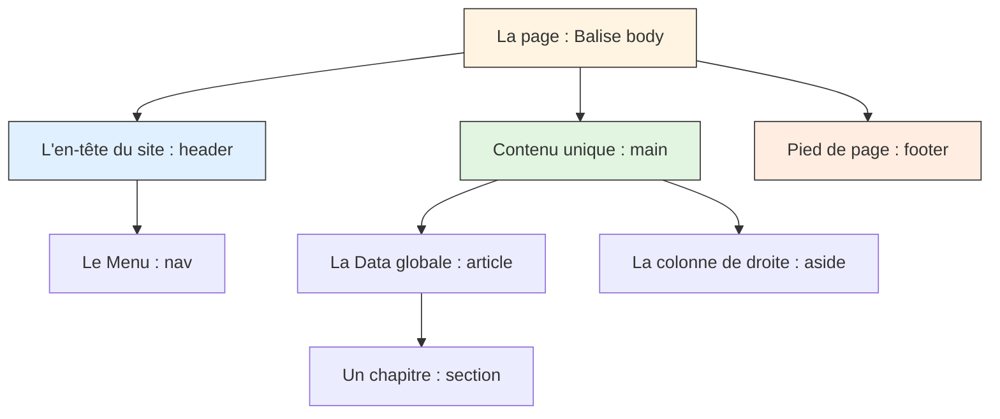

# Sémantique HTML5

<div
  class="omny-meta"
  data-level="🟡 Intermédiaire"
  data-version="1.0"
  data-time="2-3 heures">
</div>

## Introduction

!!! quote "Analogie pédagogique - Structurer comme un Architecte"
    Imaginez un **journal**. Sans structure, tout serait de la compote de lettres : pas de différence identifable entre le grand Titre du journal, le sommaire, l'article principal et l'encart publicitaire météo au bordel. 
    
    Dans les années 2000, un site Web était géré par une *soupe cosmique de "Div"*. Des conteneurs aveugles appelés `<div>`  qui encadraient littéralement, cent pour cent du site. Il était impossible pour Google de comprendre où se situait le menu et où démarrait le "vrai" contenu.
    
    Aujourd'hui, le standard **HTML5** a instauré la Sémantique universelle : de très nombreuses nouvelles balises dont le seul rôle est d'informer les robots des moteurs de recherches et les synthèses vocales du **sens de la zone**. (Ex: `<nav>` crie fièrement "Ici, c'est de la navigation !").

Ce module vous enseigne à structurer l'architecture profonde et invisible d'une page Web comme un professionnel aguerri, étape par étape.

<br />

---

## La vision globale d'une Page HTML5 

Au lieu de faire appel à la fameuse balise générique `<div>` (qui représente un vulgaire conteneur rectangulaire de style CSS sans le moindre sens réel), prenez l'habitude structurelle suivante pour n'importe quelle nouvelle page :



<br />

---

## Le Haut et le Bas (`<header>` et `<footer>`)

### Le fronton du temple : `<header>`
Le **header** n'a strictement rien à voir avec la balise technique métadonnée invisible `<head>`. Le `<header>` est une véritable balise visuelle qui contient les éléments d'introduction majeurs de la page, comme votre Logo, ou votre grand Titre h1, ou vos citations.

```html title="Code HTML - Le conteneur header"
<header>
    <h1>OmnyDocs V3</h1>
    <p>La base de données absolue réservée à l'apprentissage IT.</p>
</header>
```
*Note: Un `<header>` n'est pas restreint à la page globale ! Un simple petit `<article>` de bloc possède aussi son propre `<header>` dédié (avec le titre précis de cet article et son auteur daté).*

### Le sous-sol du site : `<footer>`
C'est le rideau de fin. On y intègre l'année de copyright, les petits liens détestés (CGU, Mentions LÉgales), ou encore vos réseaux sociaux de bas de page.

```html title="Code HTML - Le pied de page footer"
<footer>
    <p>&copy; 2024 - Omnyvia Corporation.</p>
    <!-- On peut y glisser un petit menu par exemple ! -->
</footer>
```

<br />

---

## La Navigation (`<nav>`)

Cette balise prévient Google et les lecteurs d'écran (pour aveugles) que "Attention, ce bloc de lien est le **sommaire** de déplacement". Vous devez utiliser `<nav>` uniquement pour les artères vitales de votre site (Le grand menu principal en haut, le fil d'ariane, la table des matières d'un article). 
*Ne l'utilisez pas pour 3 malheureux liens de partage perdus au milieu d'un texte.*

```html title="Code HTML - Artère de navigation nav"
<header>
    <h2>Mon Portfolio</h2>
    <nav aria-label="Menu Principal">
        <ul>
            <li><a href="/">Accueil</a></li>
            <li><a href="/bio">Ma vie</a></li>
            <li><a href="/projets">Mes expériences</a></li>
        </ul>
    </nav>
</header>
```

!!! warning "Alerte Accessibilité et Qualité"
    Remarquez l'attribut `aria-label=""` : C'est une obligation d'accessibilité. Si vous possédez 2 blocs `<nav>` sur votre site, la synthèse vocale énoncera très poliment à l'aveugle *"Entrée dans le Menu Principal"*, évitant une confusion dramatique.

<br />

---

## Le corps du contenu (`<main>`)

Le grand conteneur absolu. La règle d'or est radicale : Il ne doit y exister qu'un et **un seul `<main>` par page**. Il encadre le "sujet" spécifique de la page sur laquelle le visiteur se trouve (Le coeur de l'article de Blog en lui même).

```html title="Code HTML - Le conteneur exclusif main"
<body>
    <header>...Mon Menu commun à toutes les pages...</header>
    
    <!-- Zone EXCLUSIVE à la page /contact -->
    <main>
        <h1>Nous contacter</h1>
        <form> ... mon formulaire de contact ...</form>
    </main>
    
    <footer>...Mon pied de page commun à toutes les pages...</footer>
</body>
```

<br />

---

## Cœur sémantique : `Article` vs `Section` vs `Div`

La plus grande confusion du web moderne réside dans le choix d'imbrication des blocs du coeur de texte de la page.

### 1. La force de réutilisation (`<article>`)
Vous devez utiliser la balise `<article>` **seulement si** son contenu se suffit intrinséquement à lui-même en terme de sens complet. En d'autres mots : Si je prenais votre code et que je l'affichais tout seul sur un site étranger, est-ce que ça aurait à nouveau un sens logique et clôturé ?
- **Approuvé :** Un Post de blog, Une Fiche Produit (Image + prix + "Acheter"), Un Commentaire d'un visiteur posté.

### 2. Le chapitre structurant (`<section>`)
On utilise la balise `<section>` pour déchiqueter et fractionner un très long `<article>` en chapitres thématiques. 
La règle est absolue : **Une `<section>` doit TOUJOURS contenir un Titre (h2 à h6)** pour annoncer de quoi elle parle. Sinon, ne l'utilisez pas.

### 3. Le conteneur magique du diable (`<div>`)
Le `<div>` est la balise sans aucun sens sémantique par excellence. C'est une balise invisible qui forme une boîte neutre.
Vous ne devez utiliser le `<div>` **que** comme un super objet qui va vous servir plus tard à designer et appliquer du **style CSS visuel particulier** sans polluer le discours sémantique d'un `<article>` pour les robots.

**Mise en abyme démonstrative finale :**

```html title="Code HTML - Imbrication logique : article, section et div"
<main>
    <!-- Un blog post totalement complet et syndicable (Exportable ailleurs) -->
    <article>
        <h1>Apprendre le HTML5</h1>
        
        <!-- Chapitre 1 -->
        <section>
            <h2>Le balisage c'est quoi ?</h2>
            <p>De très longs paragraphes super intéressants ici.</p>
        </section>
        
        <!-- Chapitre 2 -->
        <section>
            <h2>L'importance du Style visuel</h2>
            
            <!-- Une simple boite invisible juste pour décorer la photo en CSS ensuite -->
            <div class="cadre-photo-en-bleu">
                
            </div>
            
        </section>
    </article>
</main>
```

<br />

---

## Conclusion et Synthèse

Le HTML5 nous a libérés de la "soupe de div" en introduisant des balises structurelles sémantiques. Chaque conteneur : `<header>`, `<main>`, `<footer>`, `<nav>`, `<article>` ou `<section>`, raconte à Google et aux lecteurs d'écran exactement ce qui se déroule dans votre page. Le `<div>` quant à lui redevient ce qu'il a toujours dû être : une boîte de design neutre.

> Passons maintenant à l'étape supérieure. Le squelette de notre site est monté, il possède des muscles et un sens de l'orientation parfait. Donnons-lui désormais l'apparence visuelle parfaite avec **Les Fondations du Langage CSS**.

<br />
