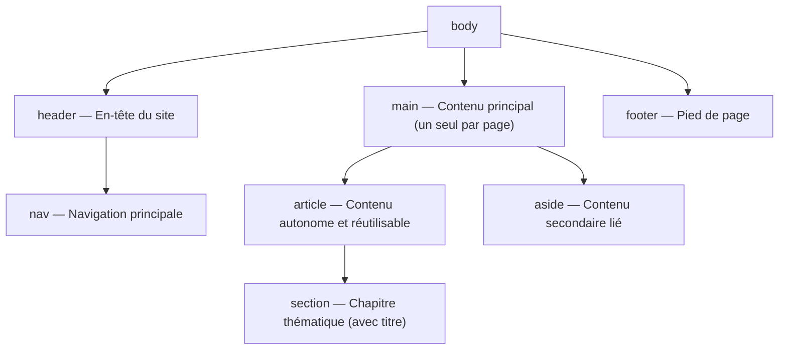

# Sémantique HTML5

<div
  class="omny-meta"
  data-level="🟡 Intermédiaire"
  data-version="1.1"
  data-time="2-3 heures">
</div>

## Introduction

!!! quote "Analogie pédagogique - Structurer comme un Architecte"
    Imaginez un **journal**. Sans structure, tout serait une compote de lettres : impossible de distinguer le grand titre du sommaire, l'article principal de l'encart météo.

    Dans les années 2000, un site Web était géré par une *soupe de `<div>`* : des conteneurs aveugles qui encadraient la totalité du site. Google ne pouvait pas distinguer le menu du contenu principal.

    Le standard **HTML5** a instauré la sémantique universelle : des balises dont le seul rôle est d'informer les moteurs de recherche et les synthèses vocales du **sens de la zone**. `<nav>` signifie "ici, c'est de la navigation". `<main>` signifie "ici, c'est le contenu principal de la page".

Ce module vous enseigne à structurer l'architecture profonde d'une page Web comme un professionnel, étape par étape.

<br>

---

## La vision globale d'une page HTML5

Au lieu de la balise générique `<div>` (un conteneur rectangulaire sans aucun sens sémantique), voici l'architecture standard d'une page HTML5 professionnelle :



*Chaque balise communique son rôle aux moteurs de recherche et aux technologies d'assistance. Le `<div>` reste disponible pour les conteneurs purement visuels sans valeur sémantique.*

<br>

---

## Le lien "aller au contenu" (accessibilité WCAG)

Avant d'aborder les balises sémantiques une par une, voici un élément que la majorité des développeurs oublient et qui est pourtant une **obligation d'accessibilité WCAG 2.1** : le lien de saut de navigation.

Un utilisateur naviguant au clavier ou avec un lecteur d'écran doit traverser tout le menu principal à chaque nouvelle page avant d'atteindre le contenu. Le lien "aller au contenu" est un lien ancre placé en tout premier dans le `<body>`, visible uniquement au focus clavier, qui saute directement au `<main>`.

```html title="HTML - Lien de saut de navigation (skip to content)"
<body>

    <!--
        Ce lien est le PREMIER élément du body.
        Invisible visuellement (via CSS : position absolute, clip, etc.)
        mais accessible via la touche Tab.
        Il pointe vers l'id "contenu-principal" du main ci-dessous.
    -->
    <a href="#contenu-principal" class="skip-nav">
        Aller au contenu principal
    </a>

    <header>
        <nav>...</nav>
    </header>

    <!-- L'id "contenu-principal" est la cible du lien de saut -->
    <main id="contenu-principal">
        <h1>Titre de la page</h1>
        ...
    </main>

    <footer>...</footer>

</body>
```

*Le style CSS masquant ce lien est une convention : `position: absolute; left: -9999px;` avec un `:focus { left: 0; }` pour le rendre visible lors de la navigation clavier. Ce comportement est attendu par les auditeurs d'accessibilité et exigé par la norme RGAA en France.*

<br>

---

## L'en-tête et le pied de page : `<header>` et `<footer>`

<br>

### `<header>` : l'en-tête

`<header>` ne doit pas être confondu avec `<head>`. Le `<head>` contient les métadonnées invisibles. Le `<header>` est un **élément visuel** qui contient les éléments d'introduction : logo, titre principal, navigation, slogan.

```html title="HTML - Header de page avec logo et navigation"
<header>
    
    <h1>OmnyDocs</h1>
    <p>La documentation technique structurée pour le marché francophone.</p>

    <nav aria-label="Navigation principale">
        <ul>
            <li><a href="/">Accueil</a></li>
            <li><a href="/bases">Fondamentaux IT</a></li>
            <li><a href="/dev-cloud">Développement</a></li>
        </ul>
    </nav>
</header>
```

*`<header>` n'est pas limité au niveau de la page. Un `<article>` peut avoir son propre `<header>` contenant le titre de l'article, son auteur et sa date de publication.*

<br>

### `<footer>` : le pied de page

`<footer>` contient les informations de fermeture : copyright, liens légaux, contacts, réseaux sociaux.

```html title="HTML - Footer de page avec navigation secondaire"
<footer>
    <nav aria-label="Liens légaux">
        <ul>
            <li><a href="/mentions-legales">Mentions légales</a></li>
            <li><a href="/politique-confidentialite">Confidentialité</a></li>
            <li><a href="/contact">Contact</a></li>
        </ul>
    </nav>

    <p>
        <small>&copy; 2025 — OmnyVia. Tous droits réservés.</small>
    </p>
</footer>
```

*Comme `<header>`, `<footer>` peut s'utiliser dans un `<article>` pour porter la signature de l'auteur ou les informations de source.*

<br>

---

## La Navigation : `<nav>`

`<nav>` indique aux moteurs de recherche et aux lecteurs d'écran que ce bloc contient des **liens de navigation structurants** — menu principal, fil d'Ariane, table des matières. Il ne doit pas être utilisé pour quelques liens contextuels perdus dans un paragraphe.

```html title="HTML - Nav avec aria-label pour les multiples navigations"
<header>
    <!-- Premier nav : le menu principal -->
    <nav aria-label="Navigation principale">
        <ul>
            <li><a href="/">Accueil</a></li>
            <li><a href="/services">Services</a></li>
            <li><a href="/contact">Contact</a></li>
        </ul>
    </nav>
</header>

<main>
    <article>
        <!-- Second nav dans l'article : la table des matières -->
        <nav aria-labelledby="titre-toc">
            <h2 id="titre-toc">Table des matières</h2>
            <ul>
                <li><a href="#introduction">Introduction</a></li>
                <li><a href="#installation">Installation</a></li>
                <li><a href="#configuration">Configuration</a></li>
            </ul>
        </nav>
    </article>
</main>
```

*`aria-labelledby` pointe vers l'`id` d'un titre existant dans la page pour nommer le `<nav>`. C'est préférable à `aria-label` quand un titre visible est déjà présent — on évite de dupliquer l'information.*

!!! warning "Nommer chaque `<nav>` sur une page"
    Si une page contient plusieurs blocs `<nav>`, chacun **doit** être nommé via `aria-label` ou `aria-labelledby`. Sans cela, un lecteur d'écran annonce simplement "navigation" pour chaque bloc, sans permettre à l'utilisateur de les distinguer. C'est une non-conformité WCAG 2.1 Critère 2.4.1.

<br>

---

## Le contenu principal : `<main>`

`<main>` encadre le sujet spécifique de la page en cours. La règle est absolue : **un seul `<main>` par page**. Il ne doit contenir ni l'en-tête commun à toutes les pages ni le pied de page.

```html title="HTML - Structure de page complète avec main"
<body>
    <a href="#contenu" class="skip-nav">Aller au contenu</a>

    <header>
        <nav aria-label="Navigation principale">...</nav>
    </header>

    <!--
        main reçoit un id pour être la cible du lien skip-nav.
        Son contenu change à chaque page : c'est sa caractéristique fondamentale.
    -->
    <main id="contenu">
        <h1>Nous contacter</h1>
        <form action="/contact" method="POST">
            ...
        </form>
    </main>

    <footer>...</footer>
</body>
```

<br>

---

## Le contenu secondaire : `<aside>`

`<aside>` contient du contenu **lié au contenu principal mais non indispensable** à sa compréhension. Si on supprimait l'aside, le sens de la page resterait intact.

```html title="HTML - Aside pour le contenu connexe"
<main>
    <article>
        <h1>Comprendre les injections SQL</h1>
        <p>Une injection SQL est une attaque qui consiste à injecter...</p>

        <!--
            L'aside est à l'intérieur de l'article : il est lié à cet article.
            Placé à l'extérieur du main, il serait lié à la page entière.
        -->
        <aside>
            <h2>Ressources complémentaires</h2>
            <ul>
                <li><a href="/outils/sqlmap">Guide SQLMap</a></li>
                <li><a href="/cyber/owasp">OWASP Top 10</a></li>
            </ul>
        </aside>

        <p>Les requêtes préparées avec PDO constituent la défense principale...</p>
    </article>
</main>
```

*Un `<aside>` placé à l'intérieur d'un `<article>` est sémantiquement lié à cet article. Placé directement dans `<body>` ou `<main>`, il est lié à la page entière — typiquement une colonne latérale de widgets, de publicités, ou de navigation secondaire.*

<br>

---

## Article, Section et Div : les trois conteneurs de fond

C'est la zone de confusion la plus fréquente du HTML5 moderne.

<br>

### `<article>` : contenu autonome et réutilisable

`<article>` encadre un contenu qui **se suffit à lui-même**. Le test décisif : si on extrayait ce contenu et on le publiait sur un autre site, aurait-il encore un sens complet et autonome ?

- **Cas valides :** un article de blog, une fiche produit, un commentaire d'utilisateur, une carte de résultat de recherche, un tweet.
- **Cas invalides :** une section d'une page, un widget de navigation, un bloc de mise en page.

```html title="HTML - Article de blog avec header et footer internes"
<article>
    <!-- Le header de l'article : titre, auteur, date -->
    <header>
        <h1>Sécuriser une API Laravel avec Sanctum</h1>
        <p>Par <address><a href="/auteurs/alain">Alain Guillon</a></address></p>
        <!-- time avec datetime machine-readable pour le SEO -->
        <time datetime="2025-03-15">15 mars 2025</time>
    </header>

    <section>
        <h2>Installation de Sanctum</h2>
        <p>...</p>
    </section>

    <section>
        <h2>Configuration des guards</h2>
        <p>...</p>
    </section>

    <!-- Le footer de l'article : tags, partage, auteur -->
    <footer>
        <p>Tags : Laravel, API, Sécurité</p>
    </footer>
</article>
```

<br>

### `<section>` : chapitre thématique

`<section>` subdivise un `<article>` en chapitres thématiques. **Une `<section>` doit toujours contenir un titre** (`<h2>` à `<h6>`). Sans titre, c'est un `<div>` que vous devriez utiliser.

```html title="HTML - Section avec titre obligatoire"
<article>
    <h1>Guide complet HTML5</h1>

    <!-- Chaque section est un chapitre avec son titre -->
    <section>
        <h2>Les balises de texte</h2>
        <p>strong, em, blockquote...</p>
    </section>

    <section>
        <h2>Les formulaires</h2>
        <p>input, label, fieldset...</p>
    </section>
</article>
```

<br>

### `<div>` et `<span>` : conteneurs neutres

`<div>` et `<span>` sont les seules balises HTML sans aucune valeur sémantique. Leur seul rôle est d'être des crochets pour le CSS et le JavaScript.

- **`<div>`** est un élément de type **bloc** (il prend toute la largeur disponible).
- **`<span>`** est un élément de type **inline** (il s'insère dans le flux du texte).

```html title="HTML - Div pour le style, span pour le ciblage inline"
<article>
    <h1>Rapport de sécurité</h1>

    <!--
        div : conteneur bloc pour appliquer un style CSS (bordure, ombre, padding)
        sans introduire de sémantique (ni article, ni section, ni aside).
    -->
    <div class="encadre-alerte">
        <p>Trois vulnérabilités critiques détectées.</p>
    </div>

    <p>
        Le serveur tourne sous
        <!--
            span : cible inline pour colorer un mot dans une phrase
            sans créer un nouveau bloc.
        -->
        <span class="tag-technologie">Ubuntu 24.04 LTS</span>
        avec PHP 8.5.
    </p>
</article>
```

*La règle pratique : si une balise sémantique existe pour votre cas d'usage (`<article>`, `<section>`, `<aside>`, `<nav>`...), utilisez-la. Le `<div>` et le `<span>` n'interviennent qu'en dernier recours, pour le style pur.*

<br>

---

## Balises sémantiques complémentaires

HTML5 propose plusieurs balises pour des cas d'usage précis qui améliorent le SEO et l'accessibilité.

<br>

### `<time>` : les dates et heures machine-readable

`<time>` permet d'afficher une date lisible par un humain tout en fournissant un format normalisé ISO 8601 aux moteurs de recherche via l'attribut `datetime`.

```html title="HTML - Balise time avec datetime normalisé"
<!-- Date simple -->
<p>Article publié le <time datetime="2025-03-15">15 mars 2025</time>.</p>

<!-- Date et heure avec fuseau -->
<p>Webinaire le <time datetime="2025-04-10T14:30:00+02:00">10 avril 2025 à 14h30</time>.</p>

<!-- Durée (format ISO 8601 pour les durées) -->
<p>Durée estimée : <time datetime="PT2H30M">2 heures 30 minutes</time>.</p>
```

*Google utilise `datetime` pour les rich snippets d'événements et d'articles. Sans `<time>`, la date est un texte opaque pour les robots.*

<br>

### `<address>` : les informations de contact

`<address>` marque les informations de contact de l'auteur d'un article ou du propriétaire du site. Il ne sert pas à marquer n'importe quelle adresse postale.

```html title="HTML - Address pour les informations de contact"
<footer>
    <address>
        <!-- Les informations de contact de l'auteur ou de l'organisation -->
        <p>OmnyVia — Alain Guillon</p>
        <p><a href="mailto:contact@omnyvia.fr">contact@omnyvia.fr</a></p>
        <p>Lyon, France</p>
    </address>
</footer>
```

<br>

### `<abbr>` : les abréviations

`<abbr>` marque une abréviation et propose sa forme développée via l'attribut `title`. Au survol, le navigateur affiche une infobulle avec la signification.

```html title="HTML - Abbr pour les acronymes et abréviations"
<p>
    Le projet respecte les recommandations de l'
    <abbr title="Open Web Application Security Project">OWASP</abbr>
    et est conforme au
    <abbr title="Règlement Général sur la Protection des Données">RGPD</abbr>.
</p>

<p>
    L'architecture suit le pattern
    <abbr title="Model-View-Controller">MVC</abbr>
    de Laravel.
</p>
```

*`<abbr>` améliore l'accessibilité pour les lecteurs d'écran et contribue au SEO en associant l'acronyme à sa forme longue.*

<br>

---

## Exemple d'architecture complète

Voici une page type intégrant l'ensemble des éléments sémantiques vus dans ce module.

```html title="HTML - Architecture sémantique complète d'une page"
<!DOCTYPE html>
<html lang="fr">
<head>
    <meta charset="UTF-8">
    <meta name="viewport" content="width=device-width, initial-scale=1.0">
    <title>Article — OmnyDocs</title>
</head>
<body>

    <!-- Lien de saut de navigation (accessibilité WCAG) -->
    <a href="#contenu" class="skip-nav">Aller au contenu principal</a>

    <!-- En-tête commun à toutes les pages du site -->
    <header>
        
        <nav aria-label="Navigation principale">
            <ul>
                <li><a href="/">Accueil</a></li>
                <li><a href="/dev-cloud">Développement</a></li>
                <li><a href="/cyber">Cybersécurité</a></li>
            </ul>
        </nav>
    </header>

    <!-- Contenu unique à cette page -->
    <main id="contenu">

        <!-- L'article : contenu autonome et réutilisable -->
        <article>

            <header>
                <h1>Les injections SQL : comprendre pour défendre</h1>
                <p>
                    Par <address><a href="/auteurs/alain">Alain Guillon</a></address> —
                    <time datetime="2025-03-15">15 mars 2025</time>
                </p>
            </header>

            <!-- Table des matières de l'article -->
            <nav aria-labelledby="toc-titre">
                <h2 id="toc-titre">Sommaire</h2>
                <ul>
                    <li><a href="#intro">Introduction</a></li>
                    <li><a href="#mecanisme">Mécanisme de l'attaque</a></li>
                    <li><a href="#defense">Défenses</a></li>
                </ul>
            </nav>

            <section id="intro">
                <h2>Introduction</h2>
                <p>
                    Une injection <abbr title="Structured Query Language">SQL</abbr>
                    est une attaque qui consiste à...
                </p>
            </section>

            <section id="mecanisme">
                <h2>Mécanisme de l'attaque</h2>
                <p>...</p>

                <!-- Aside lié à cet article -->
                <aside>
                    <h3>Outil de démonstration</h3>
                    <p><a href="/cyber/tools/sqlmap">Découvrir SQLMap</a></p>
                </aside>
            </section>

            <section id="defense">
                <h2>Défenses</h2>
                <p>Les requêtes préparées avec <abbr title="PHP Data Objects">PDO</abbr>...</p>
            </section>

            <footer>
                <p>Tags : SQL, Sécurité, PHP, Laravel</p>
            </footer>

        </article>

    </main>

    <!-- Pied de page commun à toutes les pages -->
    <footer>
        <nav aria-label="Liens légaux">
            <ul>
                <li><a href="/mentions-legales">Mentions légales</a></li>
                <li><a href="/contact">Contact</a></li>
            </ul>
        </nav>
        <address>
            <p>&copy; 2025 — <a href="mailto:contact@omnyvia.fr">OmnyVia</a></p>
        </address>
    </footer>

</body>
</html>
```

<br>

---

## Conclusion

!!! quote "Ce qu'il faut retenir de ce module"
    Le HTML5 sémantique remplace la soupe de `<div>` par des balises à sens : `<header>`, `<nav>`, `<main>`, `<article>`, `<section>`, `<aside>`, `<footer>`. Chacune transmet un rôle précis aux moteurs de recherche et aux technologies d'assistance. Le lien "skip to content" est une obligation d'accessibilité WCAG. `<time>`, `<address>` et `<abbr>` enrichissent la sémantique des données éditoriales. `<div>` et `<span>` restent réservés aux conteneurs purement visuels sans valeur sémantique.

> La structure de nos pages est maintenant complète et sémantiquement robuste. Le module suivant introduit les **éléments interactifs natifs** du HTML5 moderne : `<dialog>`, `<details>`, `<template>`, `<slot>` et l'API Popover — des composants qui fonctionnent sans JavaScript.

<br>