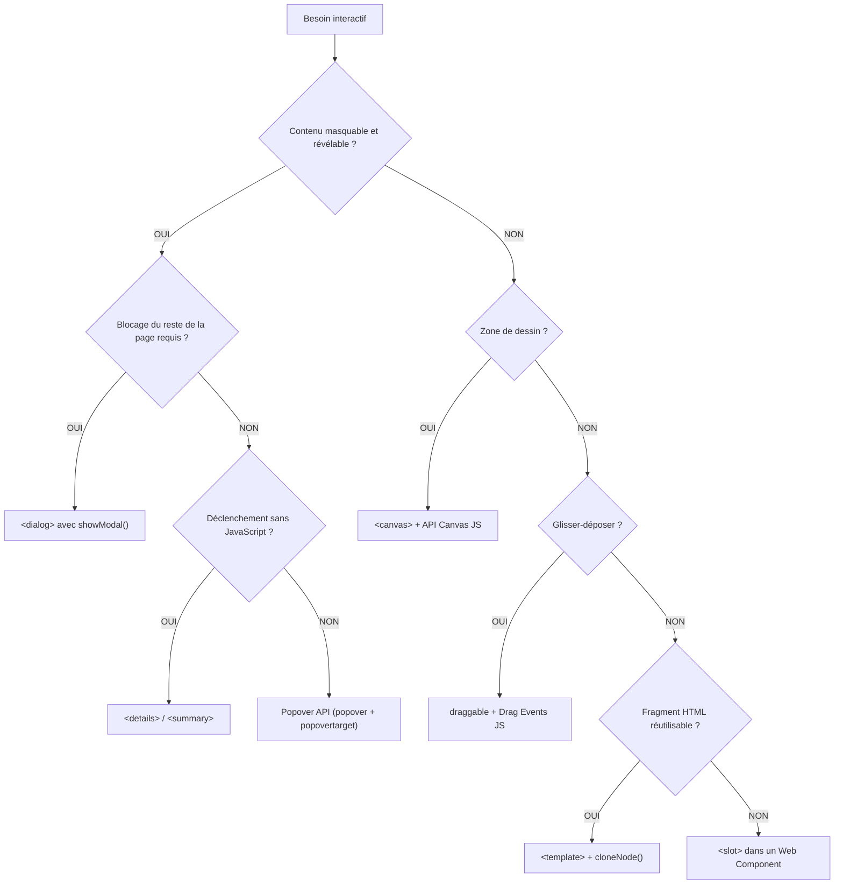

# Éléments Interactifs Natifs

<div
  class="omny-meta"
  data-level="🟡 Intermédiaire à 🔴 Avancé"
  data-version="1.0"
  data-time="3-4 heures">
</div>

## Introduction

!!! quote "Analogie pédagogique - L'Électricité Déjà Dans Les Murs"
    Imaginez emménager dans un appartement neuf. Avant même d'installer le moindre meuble, l'appartement dispose déjà d'une électricité fonctionnelle, d'un interphone, d'un visiophone et d'un tableau de disjoncteurs. Vous n'avez pas à construire ces infrastructures vous-même — elles sont déjà là, dans les murs.

    Le HTML5 moderne, c'est pareil. Avant d'écrire une seule ligne de JavaScript, le navigateur met à votre disposition des composants interactifs entièrement fonctionnels : une boîte de dialogue modale, un accordéon de contenu rétractable, un système de notifications contextuelles, une zone de dessin vectoriel. Ces composants respectent nativement l'accessibilité, le focus clavier, et les standards du Web.

Ce module couvre les éléments HTML natifs qui éliminent des centaines de lignes de JavaScript dans les projets modernes.

<br>

---

## L'accordéon natif : `<details>` et `<summary>`

La balise `<details>` crée un widget de divulgation progressive : un bloc de contenu masqué par défaut, révélé au clic. La balise `<summary>` est son titre cliquable.

**Aucun JavaScript n'est requis.** Le navigateur gère l'ouverture, la fermeture, le focus clavier et l'état ARIA automatiquement.

```html title="HTML - Accordéon natif avec details et summary"
<!--
    Par défaut, le contenu est masqué.
    L'attribut open le rend visible dès le chargement.
-->
<details>
    <summary>Qu'est-ce qu'une injection SQL ?</summary>

    <p>
        Une injection SQL est une attaque consistant à insérer du code SQL
        malveillant dans un champ de saisie pour manipuler la base de données
        du serveur cible.
    </p>
    <p>
        La défense principale est l'utilisation de requêtes préparées avec PDO
        en PHP, ou via l'ORM Eloquent de Laravel.
    </p>
</details>

<!-- Ouvert par défaut grâce à l'attribut open -->
<details open>
    <summary>Prérequis de ce module</summary>
    <ul>
        <li>Modules HTML 01 à 06 complétés</li>
        <li>Notion de base en CSS</li>
    </ul>
</details>
```

*Le `<summary>` est l'unique enfant direct obligatoire de `<details>`. Tout le reste du contenu à l'intérieur de `<details>` est masqué ou révélé selon l'état du widget.*

!!! tip "Construire une FAQ complète sans JavaScript"
    Plusieurs blocs `<details>` consécutifs forment une FAQ entièrement fonctionnelle. Le CSS permet de styliser le curseur, l'icône et la transition d'ouverture.

    ```html title="HTML - FAQ native avec plusieurs details"
    <section>
        <h2>Questions fréquentes</h2>

        <details>
            <summary>Comment installer Laravel ?</summary>
            <p>Via Composer : <code>composer create-project laravel/laravel mon-projet</code></p>
        </details>

        <details>
            <summary>Quelle version de PHP est requise ?</summary>
            <p>Laravel 11 requiert PHP 8.2 minimum. PHP 8.5 est recommandé.</p>
        </details>

        <details>
            <summary>Peut-on utiliser SQLite en production ?</summary>
            <p>Oui, pour des applications à faible charge. Pour les applications
            multi-utilisateurs concurrents, préférez PostgreSQL ou MariaDB.</p>
        </details>
    </section>
    ```

!!! note "L'événement `toggle` en JavaScript"
    Si vous avez besoin de réagir à l'ouverture ou la fermeture d'un `<details>` (pour enregistrer l'état, charger du contenu dynamiquement), l'élément émet nativement un événement `toggle` que JavaScript peut écouter sans aucune bibliothèque.

<br>

---

## La boîte de dialogue native : `<dialog>`

`<dialog>` est un élément modal natif du navigateur. Il gère automatiquement le piège de focus (l'utilisateur ne peut pas sortir du dialogue avec la touche Tab tant qu'il est ouvert), la fermeture via `Escape`, et les attributs ARIA.

Avant `<dialog>`, créer une modale accessible requérait des dizaines de lignes de JavaScript. Aujourd'hui, c'est natif.

```html title="HTML - Dialog modal avec ouverture et fermeture JavaScript minimale"
<!--
    L'attribut open peut être présent (dialog visible) ou absent (dialog masqué).
    En pratique, on ne l'écrit pas manuellement : on utilise les méthodes JS show() et close().
-->
<dialog id="modale-confirmation">

    <h2>Confirmer la suppression</h2>
    <p>
        Cette action est <strong>irréversible</strong>. L'article sera définitivement
        supprimé de la base de données.
    </p>

    <!-- Un form avec method="dialog" ferme la modale nativement sans JavaScript -->
    <form method="dialog">
        <button type="submit" value="annuler">Annuler</button>
        <button type="submit" value="confirmer">Supprimer</button>
    </form>

</dialog>

<!-- Le bouton déclencheur -->
<button type="button" id="btn-supprimer">Supprimer l'article</button>

<script>
    const modale = document.getElementById('modale-confirmation');
    const btnSupprimer = document.getElementById('btn-supprimer');

    // showModal() ouvre en mode modal (bloque le reste de la page)
    // show() ouvre en mode non-modal (le reste reste accessible)
    btnSupprimer.addEventListener('click', () => modale.showModal());

    // L'événement close est émis à la fermeture, quelle qu'en soit la cause
    // modale.returnValue contient la value du bouton submit qui a fermé la dialog
    modale.addEventListener('close', () => {
        if (modale.returnValue === 'confirmer') {
            console.log('Suppression confirmée');
        }
    });
</script>
```

*`<form method="dialog">` est une valeur spéciale : le formulaire ne soumet rien à un serveur. Il ferme la `<dialog>` parente et peuple `dialog.returnValue` avec la `value` du bouton utilisé. C'est le mécanisme natif pour récupérer le choix de l'utilisateur.*

**Méthodes JavaScript de `<dialog>` :**

| Méthode | Comportement |
| --- | --- |
| `show()` | Ouvre sans bloquer le reste de la page (non-modal). |
| `showModal()` | Ouvre en mode modal — un overlay est appliqué, le focus est piégé. |
| `close(returnValue)` | Ferme la dialog. La valeur optionnelle est accessible via `dialog.returnValue`. |

!!! warning "Différence entre `show()` et `showModal()`"
    `showModal()` est presque toujours ce qu'on veut pour une confirmation ou un formulaire critique. Il active le backdrop natif (l'overlay grisé derrière la modale), piège le focus à l'intérieur, et permet la fermeture via la touche `Escape`. `show()` ouvre sans aucune de ces protections.

!!! tip "Styler le backdrop de la dialog"
    Le pseudo-élément CSS `::backdrop` cible l'overlay généré automatiquement derrière une dialog modale. Il permet de personnaliser la couleur et l'opacité de l'arrière-plan sans JavaScript.

    ```css title="CSS - Personnalisation du backdrop natif"
    /* L'overlay derrière la dialog modale */
    dialog::backdrop {
        background: rgba(0, 0, 0, 0.6);
        backdrop-filter: blur(4px);
    }
    ```

<br>

---

## L'API Popover : notifications contextuelles natives

L'API Popover, introduite dans les navigateurs modernes en 2023-2024, permet de créer des tooltips, menus contextuels et panneaux flottants sans JavaScript, uniquement avec des attributs HTML.

```html title="HTML - Popover natif avec attributs HTML seuls"
<!--
    popover  : marque cet élément comme un popover (masqué par défaut).
    id       : requis pour que le bouton déclencheur puisse le référencer.
-->
<div id="info-securite" popover>
    <h3>Pourquoi ce champ est-il obligatoire ?</h3>
    <p>
        L'adresse e-mail est utilisée pour l'authentification double facteur
        et la récupération de compte. Elle n'est jamais partagée avec des tiers.
    </p>
    <button popovertarget="info-securite" popovertargetaction="hide">
        Fermer
    </button>
</div>

<!--
    popovertarget   : référence l'id du popover à contrôler.
    popovertargetaction : "show", "hide" ou "toggle" (défaut : toggle).
-->
<button
    type="button"
    popovertarget="info-securite"
    popovertargetaction="toggle"
>
    Pourquoi ce champ ?
</button>

<label for="email-compte">Adresse e-mail :</label>
<input type="email" id="email-compte" name="email" required>
```

*Un popover est automatiquement positionné au-dessus des autres éléments de la page via la couche "top layer" du navigateur — le même mécanisme que les `<dialog>` modales. Il se ferme nativement via la touche `Escape` ou en cliquant en dehors.*

**Types de popovers :**

```html title="HTML - Les deux types de popover"
<!--
    popover="auto" (défaut) :
    - Un seul popover auto peut être ouvert à la fois.
    - Se ferme au clic en dehors ou sur Escape.
    - Ferme automatiquement les autres popovers auto ouverts.
-->
<div id="menu-utilisateur" popover="auto">
    <a href="/profil">Mon profil</a>
    <a href="/parametres">Paramètres</a>
    <a href="/deconnexion">Déconnexion</a>
</div>

<!--
    popover="manual" :
    - Doit être fermé explicitement (via JavaScript ou popovertarget).
    - Ne se ferme pas au clic en dehors.
    - Plusieurs peuvent coexister simultanément.
    - Utile pour les notifications persistantes.
-->
<div id="notif-sauvegarde" popover="manual">
    <p>Brouillon sauvegardé automatiquement.</p>
</div>
```

!!! info "Support navigateur de l'API Popover"
    L'API Popover est supportée par Chrome 114+, Firefox 125+, Safari 17+ et Edge 114+. En mars 2025, la couverture dépasse 93% des utilisateurs mondiaux. Pour les projets Laravel/Livewire ciblant des navigateurs récents, elle est utilisable en production sans polyfill.

<br>

---

## Le contenu inerte : `<template>`

La balise `<template>` contient du HTML qui **n'est pas rendu par le navigateur** au chargement de la page. Son contenu n'est pas affiché, ses images ne sont pas téléchargées, ses scripts ne s'exécutent pas. Il s'agit d'un fragment HTML inerte, prêt à être cloné et inséré dynamiquement par JavaScript.

C'est le mécanisme fondamental des Web Components et des interfaces pilotées par les données.

```html title="HTML - Template pour les cartes dynamiques"
<!--
    Le contenu du template n'est jamais affiché directement.
    Il est accessible uniquement via JavaScript via template.content.
-->
<template id="carte-article">
    <article class="carte">
        
        <div class="carte-corps">
            <h3 class="carte-titre"></h3>
            <p class="carte-extrait"></p>
            <a href="#" class="carte-lien">Lire l'article</a>
        </div>
    </article>
</template>

<!-- Le conteneur qui recevra les cartes générées -->
<div id="liste-articles"></div>

<script>
    // Données exemple (viendraient d'une API en production)
    const articles = [
        {
            titre: "Sécuriser une API Laravel",
            extrait: "Sanctum, Passport, et les bonnes pratiques...",
            image: "/images/laravel-api.jpg",
            lien: "/articles/securiser-api-laravel"
        },
        {
            titre: "Introduction à Go pour les développeurs PHP",
            extrait: "Goroutines, channels et syntaxe comparée...",
            image: "/images/go-php.jpg",
            lien: "/articles/go-pour-developpeurs-php"
        }
    ];

    const template = document.getElementById('carte-article');
    const conteneur = document.getElementById('liste-articles');

    articles.forEach(article => {
        // Cloner le contenu du template (pas le template lui-même)
        const clone = template.content.cloneNode(true);

        // Remplir les éléments du clone avec les données
        clone.querySelector('.carte-image').src = article.image;
        clone.querySelector('.carte-image').alt = article.titre;
        clone.querySelector('.carte-titre').textContent = article.titre;
        clone.querySelector('.carte-extrait').textContent = article.extrait;
        clone.querySelector('.carte-lien').href = article.lien;

        // Insérer le clone peuplé dans le conteneur
        conteneur.appendChild(clone);
    });
</script>
```

*`template.content.cloneNode(true)` est l'opération clé : on clone le `DocumentFragment` contenu dans le `<template>` (le `true` indique un clone profond incluant tous les descendants). On ne manipule jamais le template original — on travaille toujours sur des clones.*

<br>

---

## Les emplacements dynamiques : `<slot>`

`<slot>` est l'élément complémentaire de `<template>`. Il définit des **points d'injection nommés** dans un Web Component — des emplacements où l'utilisateur du composant peut insérer son propre contenu.

`<slot>` n'a de sens qu'à l'intérieur du Shadow DOM[^1] d'un Web Component. Voici le contexte minimal pour comprendre son rôle.

```html title="HTML - Web Component simple avec slot"
<!-- Utilisation du composant personnalisé dans la page -->
<carte-profil>
    <!-- Le contenu placé ici sera injecté dans le slot "nom" -->
    <span slot="nom">Alain Guillon</span>

    <!-- Le contenu placé ici sera injecté dans le slot "role" -->
    <span slot="role">Expert Cybersécurité — OmnyVia</span>
</carte-profil>

<script>
    // Définition du Web Component
    class CarteProfil extends HTMLElement {
        constructor() {
            super();

            // Création du Shadow DOM : arbre DOM encapsulé, isolé du reste de la page
            const shadow = this.attachShadow({ mode: 'open' });

            // Le template du composant avec ses slots nommés
            shadow.innerHTML = `
                <style>
                    .carte {
                        border: 1px solid #e5e7eb;
                        border-radius: 8px;
                        padding: 1rem;
                        display: flex;
                        gap: 1rem;
                        align-items: center;
                    }
                </style>
                <div class="carte">
                    <!-- slot name="nom" sera remplacé par le contenu slot="nom" de l'utilisateur -->
                    <strong><slot name="nom">Nom non renseigné</slot></strong>
                    <span><slot name="role">Rôle non renseigné</slot></span>
                </div>
            `;
        }
    }

    // Enregistrement du custom element
    customElements.define('carte-profil', CarteProfil);
</script>
```

*Le texte dans le `<slot>` (`"Nom non renseigné"`) est le **contenu de repli** : il s'affiche si l'utilisateur du composant ne fournit pas de contenu pour ce slot.*

!!! note "Web Components : l'HTML, le CSS et le JavaScript en trois piliers"
    Les Web Components complets reposent sur trois standards complémentaires. `<template>` et `<slot>` constituent la partie HTML. Le Shadow DOM assure l'encapsulation CSS. Les Custom Elements (`customElements.define()`) sont le JavaScript. Ce module ne couvre que la partie HTML — l'implémentation complète d'un Web Component est traitée dans la section JavaScript.

<br>

---

## La zone de dessin : `<canvas>`

`<canvas>` définit une **zone de dessin bitmap** dans la page. La balise HTML ne fait que réserver l'espace. Tout le dessin — formes, images, animations, graphiques — est entièrement réalisé via JavaScript et l'API Canvas 2D (ou WebGL pour la 3D).

```html title="HTML - Canvas comme conteneur de dessin"
<!--
    width et height définissent la résolution interne du canvas (en pixels logiques).
    Ces attributs sont DIFFÉRENTS du width/height CSS qui contrôle la taille affichée.
    Un canvas mal configuré produit des visuels flous sur les écrans Retina.
-->
<canvas
    id="graphique-performances"
    width="800"
    height="400"
    aria-label="Graphique de performances — chargement en cours"
    role="img"
>
    <!-- Contenu de repli pour les navigateurs sans support Canvas (obsolète en 2025) -->
    <p>Votre navigateur ne supporte pas les graphiques Canvas.</p>
</canvas>

<script>
    const canvas = document.getElementById('graphique-performances');

    // getContext('2d') retourne le contexte de rendu 2D
    // C'est l'objet qui expose toutes les méthodes de dessin
    const ctx = canvas.getContext('2d');

    // Dessiner un rectangle plein
    ctx.fillStyle = '#3b82f6';
    ctx.fillRect(50, 50, 200, 100); // x, y, largeur, hauteur

    // Dessiner un texte
    ctx.fillStyle = '#1e3a5f';
    ctx.font = '16px sans-serif';
    ctx.fillText('Rapport Q1 2025', 50, 200);
</script>
```

*`<canvas>` est le conteneur HTML. L'API Canvas 2D est JavaScript. Cette documentation couvre uniquement le rôle HTML de la balise — son utilisation avancée (graphiques, jeux, traitement d'images) est traitée dans la section JavaScript.*

!!! warning "Ne pas confondre width/height HTML et CSS sur canvas"
    Les attributs `width="800"` et `height="400"` sur la balise `<canvas>` définissent la **résolution de la zone de dessin** en pixels internes. Ils sont distincts des propriétés CSS `width` et `height` qui définissent la **taille d'affichage**. Si on ne définit que le CSS sans les attributs HTML, le canvas aura sa résolution par défaut (300×150 px) étirée, produisant un rendu flou.

!!! tip "Cas d'usage de `<canvas>` en 2025"
    `<canvas>` est utilisé pour les graphiques de données (Chart.js, D3.js), les jeux 2D (Phaser.js), les effets visuels, la génération d'images côté client, la signature électronique, et les éditeurs de photos en ligne. Les frameworks modernes comme Livewire et Alpine.js ne l'utilisent pas directement — ils délèguent à des bibliothèques JavaScript spécialisées.

<br>

---

## Le glisser-déposer natif : l'attribut `draggable`

L'attribut `draggable` active le comportement de glisser-déposer natif du navigateur sur n'importe quel élément HTML. Il s'articule avec l'API Drag and Drop Events de JavaScript.

```html title="HTML - Interface de drag and drop native"
<!-- Les éléments draggable="true" peuvent être glissés -->
<div
    id="tache-1"
    draggable="true"
    class="tache"
    ondragstart="demarrerGlissement(event)"
>
    Analyser les logs de sécurité
</div>

<div
    id="tache-2"
    draggable="true"
    class="tache"
    ondragstart="demarrerGlissement(event)"
>
    Rédiger le rapport d'audit
</div>

<!-- Les zones de dépôt reçoivent les éléments glissés -->
<div
    id="colonne-en-cours"
    class="colonne"
    ondragover="autoriserDepot(event)"
    ondrop="deposer(event)"
>
    <h3>En cours</h3>
</div>

<div
    id="colonne-termine"
    class="colonne"
    ondragover="autoriserDepot(event)"
    ondrop="deposer(event)"
>
    <h3>Terminé</h3>
</div>

<script>
    function demarrerGlissement(event) {
        // Stocker l'id de l'élément glissé dans le transfert de données
        event.dataTransfer.setData('text/plain', event.target.id);
        event.dataTransfer.effectAllowed = 'move';
    }

    function autoriserDepot(event) {
        // Empêcher le comportement par défaut (refus du dépôt)
        event.preventDefault();
        event.dataTransfer.dropEffect = 'move';
    }

    function deposer(event) {
        event.preventDefault();

        // Récupérer l'id de l'élément glissé
        const idElement = event.dataTransfer.getData('text/plain');
        const element = document.getElementById(idElement);

        // Déplacer l'élément dans la zone de dépôt
        event.currentTarget.appendChild(element);
    }
</script>
```

*`draggable="true"` est l'activation HTML. Les événements `dragstart`, `dragover` et `drop` sont JavaScript. Le `<canvas>` peut également être rendu draggable avec ce mécanisme.*

**Valeurs de l'attribut `draggable` :**

| Valeur | Comportement |
| --- | --- |
| `true` | L'élément est glissable. |
| `false` | L'élément n'est pas glissable (même si son type le permettrait normalement). |
| (absent) | Comportement par défaut : les images et liens sont glissables, le reste non. |

!!! note "Drag and Drop natif vs bibliothèques"
    L'API native est fonctionnelle mais limitée visuellement. Pour des interfaces de type Kanban avec animations fluides et support tactile (mobile), les bibliothèques JavaScript comme **SortableJS** ou **Draggable** (Shopify) sont préférées en production. L'attribut `draggable` reste utile pour des cas simples ou pour comprendre les fondamentaux avant d'adopter une bibliothèque.

<br>

---

## Récapitulatif : quand utiliser chaque élément



<br>

---

## Conclusion

!!! quote "Ce qu'il faut retenir de ce module"
    HTML5 fournit nativement des composants interactifs qui éliminent le besoin de JavaScript pour les cas d'usage courants. `<details>` + `<summary>` créent des accordéons sans une ligne de JS. `<dialog>` gère les modales avec gestion automatique du focus et de la touche `Escape`. L'API Popover construit des menus et notifications contextuelles via de simples attributs HTML. `<template>` prépare des fragments HTML inertes prêts à être clonés par JavaScript. `<slot>` définit les points d'injection dans les Web Components. `<canvas>` réserve une zone de dessin pour l'API Canvas JavaScript. L'attribut `draggable` active le glisser-déposer natif.

> La section HTML est maintenant complète. La suite logique est le **CSS** — donner l'apparence et le comportement visuel à la structure que nous venons de maîtriser.

<br>

[^1]: Le **Shadow DOM** est un arbre DOM encapsulé, attaché à un élément HTML mais isolé du document principal. Les styles définis à l'intérieur du Shadow DOM n'affectent pas le reste de la page, et les styles externes n'affectent pas le Shadow DOM. C'est le mécanisme d'encapsulation fondamental des Web Components.
