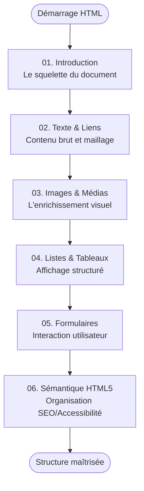

# HTML

!!! quote "Analogie"
    _Le HTML est le **squelette** de votre application Web. Sans lui, rien ne tient debout. Toutes les autres technologies (CSS, JavaScript) viennent ensuite s'y greffer pour ajouter l'apparence et le comportement tactique._

## Objectif

Le HTML (HyperText Markup Language) est le point de départ absolu de tout développement Web. Il ne sert pas à mettre en page ni à décorer, mais à **décrire la structure** et **donner du sens sémantique** aux informations (Ceci est un titre principal, ceci est un paragraphe, ceci est une donnée tabulaire).

Cette section se concentre exclusivement sur les bonnes pratiques d'intégration, primordiales pour l'Accessibilité Numérique (a11y) et le Référencement Naturel (SEO).

!!! note "Comment lire cette section"
    L'apprentissage du HTML est séquentiel. Nous commençons par les balises de base avant d'aborder des structures plus complexes comme les formulaires ou le découpage sémantique global lié à HTML5.

 

---

## Les six notions

- ### :lucide-file-code: 01. Introduction
    ---
    Comprendre le fonctionnement du web, l'arborescence DOM, la notion de balises et le squelette `<!DOCTYPE>`.

    [Voir la fiche Introduction](./01-introduction.md)

- ### :lucide-type: 02. Texte & Liens
    ---
    Maîtriser le formatage du texte (`strong`, `em`, `blockquote`) et la navigation vitale via la balise d'ancrage `<a>`.

    [Voir la fiche Texte & Liens](./02-texte-liens.md)

- ### :lucide-image: 03. Images & Médias
    ---
    Intégrer des images performantes (`srcset`, `<picture>`), comprendre l'impact des textes alternatifs `alt` et les médias audio/vidéo.

    [Voir la fiche Images & Médias](./03-images-et-m-dias.md)

- ### :lucide-table: 04. Listes & Tableaux
    ---
    Structurer des énumérations (`ul`, `ol`, `dl`) et afficher des données complexes via les balises tabulaires standards.

    [Voir la fiche Listes & Tableaux](./04-listes-et-tableaux.md)

- ### :lucide-form-input: 05. Les Formulaires
    ---
    Le nerf de l'interaction utilisateur : champs de saisie, cases à cocher, listes déroulantes et méthodes d'envoi (GET/POST).

    [Voir la fiche Formulaires](./05-formulaires.md)

- ### :lucide-layout-template: 06. Sémantique HTML5
    ---
    Distinguer `header`, `nav`, `main`, `article` et `footer` plutôt que d'utiliser des `div` génériques pour optimiser le SEO.

    [Voir la fiche Sémantique HTML5](./06-s-mantique-html5.md)

 

---

## Progression recommandée

Le parcours est totalement linéaire : on part des briques les plus fines (texte) pour finir sur la maquette globale (sémantique HTML5).

 

---

## Conclusion

!!! note "Notre recommandation"
    Prenez le temps de bien assimiler la sémantique originelle. Un HTML mal structuré coûte extrêmement cher à corriger plus tard en CSS ou JavaScript !

**Point d'entrée recommandé : [01. Introduction au HTML](./01-introduction.md)**

 
