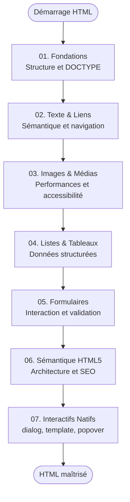

# HTML

!!! quote "Analogie"
    _Le HTML est le **squelette** de votre application Web. Sans lui, rien ne tient debout. Toutes les autres technologies (CSS, JavaScript) viennent ensuite s'y greffer pour ajouter l'apparence et le comportement._

## Objectif

Le HTML (HyperText Markup Language) est le point de départ absolu de tout développement Web. Il ne sert pas à mettre en page ni à décorer, mais à **décrire la structure** et **donner du sens sémantique** aux informations (ceci est un titre principal, ceci est un paragraphe, ceci est une donnée tabulaire).

Cette section couvre les bonnes pratiques d'intégration, l'Accessibilité Numérique (a11y), le Référencement Naturel (SEO), et les composants interactifs natifs HTML5 modernes.

!!! note "Comment lire cette section"
    L'apprentissage du HTML est séquentiel. Chaque module s'appuie sur les précédents. Les modules 01 à 04 sont de niveau débutant, les modules 05 à 07 introduisent des mécanismes intermédiaires.

 

---

## Les sept modules

- ### :lucide-file-code: 01. Les Fondations HTML
    ---
    Structure minimale obligatoire, DOCTYPE, arbre DOM, balises orphelines, meta essentielles, SEO et commentaires.

    [Voir le module 01](./01-introduction.md)

- ### :lucide-type: 02. Texte & Liens Hypertextes
    ---
    Titres, paragraphes, mise en forme sémantique (`strong`, `em`), citations, formatage de code (`pre`, `samp`), liens et ancres intra-page.

    [Voir le module 02](./02-texte-liens.md)

- ### :lucide-image: 03. Images et Médias
    ---
    Intégration d'images (`srcset`, `<picture>`, AVIF/WebP), chargement différé (`loading="lazy"`), image maps (`<map>`, `<area>`), audio et vidéo.

    [Voir le module 03](./03-images-et-medias.md)

- ### :lucide-table: 04. Listes et Tableaux
    ---
    Listes imbriquées (`ul`, `ol`, `dl`), attributs `start` et `reversed`, tableaux accessibles (`caption`, `scope`, `colgroup`, `colspan`, `rowspan`).

    [Voir le module 04](./04-listes-et-tableaux.md)

- ### :lucide-form-input: 05. Les Formulaires
    ---
    `form`, `input`, `label`, `fieldset`, `legend`, `datalist`, `meter`, `progress`, validation native HTML5, `enctype`, champs cachés.

    [Voir le module 05](./05-formulaires.md)

- ### :lucide-layout-template: 06. Sémantique HTML5
    ---
    `header`, `nav`, `main`, `article`, `section`, `aside`, `footer`, `time`, `address`, `abbr`, lien skip-to-content (WCAG).

    [Voir le module 06](./06-semantique-html5.md)

- ### :lucide-puzzle: 07. Éléments Interactifs Natifs
    ---
    `details`, `summary`, `dialog`, API Popover, `template`, `slot`, Web Components, `canvas` et attribut `draggable`.

    [Voir le module 07](./07-elements-interactifs-natifs.md)

 

---

## Progression recommandée

Le parcours est linéaire : on part des fondations structurelles pour progresser vers les composants interactifs natifs.

 

---

## Conclusion

!!! quote "Notre recommandation"
    Prenez le temps de bien assimiler la sémantique fondamentale avant d'aborder le CSS. Un HTML mal structuré coûte extrêmement cher à corriger plus tard, et pénalise directement le référencement, l'accessibilité et la maintenabilité de vos projets.

**Point d'entrée recommandé : [01. Les Fondations HTML](./01-introduction.md)**

 