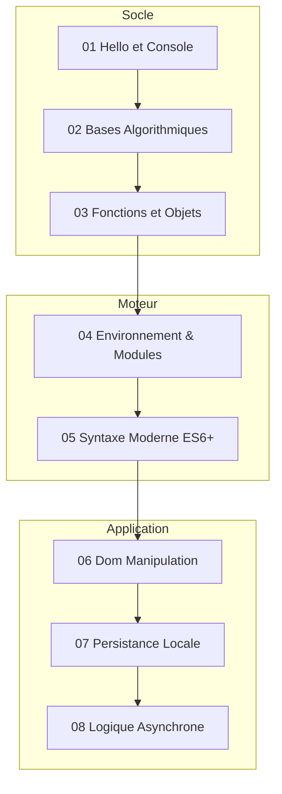

# Rapport de Formation — JavaScript

## Résumé Exécutif

| Indicateur | Valeur |
|---|---|
| **Modules rédigés** | 8 modules séparés en 3 sous-dossiers |
| **Bilan structurel** | Structure imbriquée innovante (socle, moteur, app) |
| **Conformité SKILL v2.0.0** | ✅ Excellente |
| **Niveau technique** | Débutant à Intermédiaire |
| **État d'avancement** | **Terminé & Conforme** |

 

---

## Structure Actuelle de la Formation

 

---

## Conformité SKILL v2.0.0

| Critère SKILL v2.0.0 | Statut | Commentaire |
|---|---|---|
| Frontmatter YAML | ✅ | Présent sur chaque fichier |
| `
` | ✅ | Conforme dans tous les sous-dossiers |
| Emploi des admonitions | ✅ | Analysé et conforme |
| Exemples de code | ✅ | Bien isolés et expliqués |
| Organisation des fichiers | ✅ | Fichiers concis (< 20 Ko) évitant l'effet mur de texte |

 

---

## Conclusion et Recommandations

!!! quote "Bilan global JavaScript"
    La formation JavaScript tire son épingle du jeu avec sa subdivision en `socle`, `moteur`, et `application`. Cela permet de garder les fichiers très petits (entre 3 et 19 Ko) maximisant ainsi l'attention de l'apprenant. Le fait que les modules ES6 et JS Asynchrone soient mis en avant démontre une formation très au goût du jour.

**Recommandations :**
- **Aucun travail majeur.** L'architecture en sous-piliers est pertinente. Vous pouvez envisager d'ajouter un projet final qui utiliserait Fetch (API), le DOM, et ES6 dans le dossier `application`.
