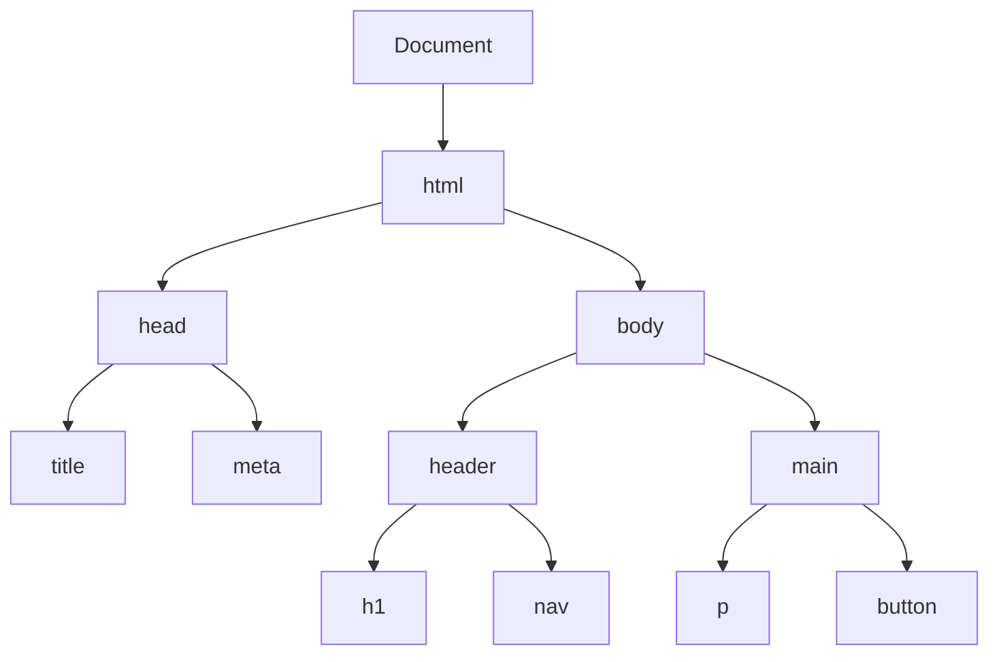

# Le DOM + Interactivité

<div
  class="omny-meta"
  data-level="🟡 Intermédiaire"
  data-version="1.0"
  data-time="3 Heures">
</div>

## Introduction

!!! quote "Analogie Pédagogique - Le Manipulateur"
    _Si votre fichier HTML est un théâtre rempli de marionnettes immobiles, et que le CSS représente leurs costumes... alors le **JavaScript est le marionnettiste clandestin**._
    
    _Cependant, le marionnettiste est aveugle : il ne voit pas l'écran. Pour interagir avec le théâtre, il a besoin d'une maquette 3D exacte de la scène qu'il peut manipuler avec ses mains. Cette maquette interne, générée automatiquement par le navigateur, s'appelle le **D.O.M (Document Object Model)**._

Le DOM est la représentation "Objet" de votre HTML. C'est l'API (l'interface) qui permet au JavaScript de dialoguer avec la page affichée en direct.

<br>

---

## Comprendre l'Arbre du DOM

Lorsque le navigateur charge votre HTML, il le transforme immédiatement en un immense tableau familial en forme d'arbre inversé.



**Chacun de ces rectangles devient un "Objet" manipulable en JavaScript.**

<br>

---

## Cibler une Marionnette (Sélection)

Historiquement, le langage utilisait d'innombrables méthodes lourdes (`getElementById`, `getElementsByClassName`).
Aujourd'hui, le standard moderne a fusionné ces approches en copiant scrupuleusement la logique des sélecteurs **CSS**.

```javascript title="JavaScript — L'outil unique : querySelector"
// Le marionnettiste cherche sur la scène (document) :

// 1. Cible le PREMIER élément `<button>`
const boutonMenu = document.querySelector('button');

// 2. Cible le PREMIER élément ayant la classe ".alert-box"
const maBoite = document.querySelector('.alert-box');

// 3. Cible TOUS les éléments <li> d'une liste (renvoie un Tableau/Nodelist)
const tousLesElementsDeListe = document.querySelectorAll('ul li');

// Accéder au premier (n°0)
const premierElement = tousLesElementsDeListe[0];

// Accéder au deuxième (n°1)
const deuxiemeElement = tousLesElementsDeListe[1];
```

!!! quote "C'est avec les nodeList que les boucles prennent tout leur sens"

<br>

---

## Dégainer les Ficelles (Modification)

Une fois l'élément HTML capturé dans une variable JavaScript, vous possédez sur ce dernier des "pouvoirs divins".

### Modifier le contenu textuel

```javascript title="JavaScript — Remplacer du texte"
const TitrePrincipal = document.querySelector('h1');

// textContent est plus rapide et plus sécurisé contre le piratage type XSS
TitrePrincipal.textContent = "Le JavaScript est génial !";

// innerHTML permet d'injecter ou de détruire de véritables balises HTML
TitrePrincipal.innerHTML = "Le JavaScript est <strong>immense</strong>";
```

!!! danger "Faille XSS : Ne faites pas confiance aux données externes"
    L'utilisation de `innerHTML` comporte un risque majeur : la faille **XSS (Cross-Site Scripting)**. Si vous injectez du texte provenant d'un utilisateur sans le nettoyer, un pirate peut insérer une balise `<script>` malveillante pour voler des données. Privilégiez **toujours** `textContent` pour afficher du texte brut.

<br>

### Modifier l'apparence (Classes CSS)

On ne modifie **jamais** ou très rarement l'objet direct `element.style.color = "red"`, car cela créé un style in-line non maintenable. L'unique bonne pratique consiste à ajouter ou retirer des classes CSS via `classList`.

```javascript title="JavaScript — L'API classList"
const carte = document.querySelector('.card');

carte.classList.add('invisible');    // La cache
carte.classList.remove('invisible'); // La montre
carte.classList.toggle('active');    // Interrupteur (active si éteint, éteint si actif)
```

<br>

---

## Le Chef d'Orchestre : Les Événements

Si vous savez manipuler le DOM, il vous manque un déclencheur ("trigger"). Le DOM réagit aux actions humaines (clics, frappe clavier, mouvement de souris) via l'outil `addEventListener`.

### Syntaxe Fondamentale

```javascript title="JavaScript — Écouter le monde"
const boutonContact = document.querySelector('#btn-contact');

// L'usine "addEventListener" (ajoute un écouteur d'évènement) demande deux choses :
// 1. Quoi écouter ? ("click")
// 2. Que faire quand ça arrive ? (Une Fonction, idéalement fléchée)

boutonContact.addEventListener('click', () => {
    // Ce bloc reste inactif tant que le clique n'a pas eu lieu.
    console.log("Le bouton a été pressé !");
    document.body.classList.toggle('dark-theme');
});
```

### L'Objet Event (Le Rapport de Police)

Lorsqu'un événement se produit, JavaScript crée **toujours** en secret un "rapport détaillé" (l'objet Event). Par convention, on le nomme très souvent `e` dans les paramètres de notre fonction.

```javascript title="JavaScript — Lecture de l'objet Event (e)"
const champsTexte = document.querySelector('input[type="text"]');

// À chaque fois qu'une touche se lève (keyup)
champsTexte.addEventListener('keyup', (e) => {
    // "e" sait TOUT sur l'accident corporel de votre clavier
    console.log("Touche pressée : ", e.key); // Ex: "Enter", "A", "Space"
});
```

!!! info "Prévenir l'action par défaut (`e.preventDefault` - Rappel)"
    Soumettre un formulaire HTML ou cliquer sur un grand lien `<a href>` recharge nativement la page. En Frontend moderne, on déteste ça ! On utilise la méthode `e.preventDefault()` pour ordonner au navigateur : *"Stoppe ton comportement natif absurde, je gère la suite moi-même en JS."*

<br>

### Le Bubbling (La Propagation en Bulle)

Lorsqu'un événement (comme un clic) se produit sur un élément HTML, il ne reste pas figé sur lui. Il se propage vers le haut (vers ses parents) comme une bulle d'air dans l'eau qui remonte à la surface.

!!! warning "Le piège du Bubbling"
    Si vous cliquez sur un bouton situé dans une `<div>`, le clic est d'abord détecté par le bouton, puis par la `<div>`, puis par le `<body>`. Si vous avez un écouteur d'événement sur les deux, **les deux se déclencheront** l'un après l'autre.

Pour stopper cette remontée et protéger les parents d'une réaction en chaîne, on utilise la commande `e.stopPropagation()`.

```html title="HTML — Structure imbriquée"
<div class="boite-parent">
    <button class="mon-bouton">Cliquez-moi</button>
</div>
```

```javascript title="JavaScript — Sélection des éléments"
const parentDiv = document.querySelector('.boite-parent');
const boutonEnfant = document.querySelector('.mon-bouton');
```

```javascript title="JavaScript — Le problème (La propagation automatique)"
// Si on clique sur le bouton, les deux messages s'affichent !
parentDiv.addEventListener('click', () => console.log("Clic PARENT"));
boutonEnfant.addEventListener('click', () => console.log("Clic ENFANT"));
```

```javascript title="JavaScript — La solution (Arrêt de la bulle)"
// Seul le message de l'enfant s'affichera
boutonEnfant.addEventListener('click', (e) => {
    e.stopPropagation(); // Stoppe la remontée ICI
    console.log("Clic UNIQUE sur l'enfant");
});
```

!!! note "L'exemple ci-dessus permet de comprendre le concept de bubbling et de stopPropagation"

<br>

---

## Les Attributs Data (dataset)

Parfois, vous avez besoin de stocker une information "cachée" directement dans votre HTML pour la récupérer plus tard en JavaScript. Pour cela, le standard HTML5 a inventé les attributs **`data-`**.

### Syntaxe HTML
Vous pouvez inventer n'importe quel nom après le préfixe `data-`.

```html title="HTML — Stocker des prix et des IDs"
<button class="btn-achat" data-id="123" data-prix="45">
    Ajouter au panier
</button>
```

### Accès JavaScript via `dataset`
Le JavaScript regroupe tous ces attributs dans un objet spécial nommé **`dataset`**. On accède ensuite à la valeur par son nom (sans le préfixe data).

```javascript title="JavaScript — Lire le dataset"
const bouton = document.querySelector('.btn-achat');

// Note : data-id devient dataset.id
console.log(bouton.dataset.id);   // "123"
console.log(bouton.dataset.prix); // "45"
```

!!! note "Important : Conversion de type"
    Les valeurs récupérées via `dataset` sont **toujours des chaînes de caractères** (String). Si vous voulez faire un calcul mathématique avec un prix, n'oubliez pas de le convertir (`Number(bouton.dataset.prix)`).

### Exemple concret : Un Sélecteur de Couleurs rapide

```html title="HTML — La palette"
<div class="palette">
    <div class="carre" data-color="red" style="background:red"></div>
    <div class="carre" data-color="blue" style="background:blue"></div>
    <div class="carre" data-color="green" style="background:green"></div>
</div>
```

```javascript title="JavaScript — L'interrupteur dynamique"
const tousLesCarres = document.querySelectorAll('.carre');

for (let carre of tousLesCarres) {
    carre.addEventListener('click', (e) => {
        // On récupère la couleur stockée dans le data-color
        const nouvelleCouleur = e.target.dataset.color;
        
        // On l'applique au fond de la page !
        document.body.style.backgroundColor = nouvelleCouleur;
    });
}
```

<br>

---

## Conclusion

!!! quote "Ce qu'il faut retenir"
    Aujourd'hui, l'architecture d'interaction sur un projet Vanillia JS s'articule toujours en trois temps :  
    **1. Sélectionner** l'élément (`document.querySelector`)  
    **2. Créer l'action** à effectuer (Via une structure algorithmique, destruction, boucle, etc)  
    **3. Déclencher** l'action au bon moment (`addEventListener`).

> Vous savez manipuler votre interface. Vous pouvez théoriquement tout faire. Un dernier chaînon manque à l'appel : si votre utilisateur quitte le navigateur puis revient le lendemain, comment vous souvenir de ses préférences (comme son thème ou sa langue) alors que vous n'avez de base de données backend ?
**Rendez-vous sur [Le Stockage et la Persistance Locale](./07-persistance-locale.md)**.

<br>
