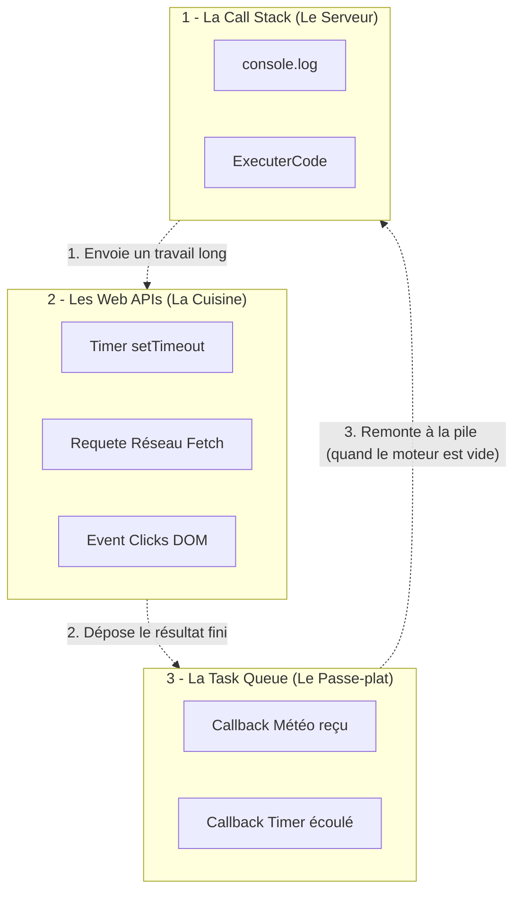

# L'Asynchrone et l'Event Loop

<div
  class="omny-meta"
  data-level="🔴 Avancé"
  data-version="1.0"
  data-time="3.5 Heures">
</div>

## Introduction

!!! quote "Analogie Pédagogique - Le Grand Restaurant"
    _Imaginez que le langage HTML/CSS soit le mobilier de la salle, et que **JavaScript soit l'unique serveur du restaurant**. Le JavaScript est **mono-thread**: il ne peut faire qu'une seule chose à la fois._
    
    _S'il prend la commande de la Table 1 (un calcul très long, comme interroger une base de données météo qui prend 3 secondes à répondre), que fait-il ? S'il reste figé devant la Table 1 pendant 3 secondes, tout le restaurant gèle (l'écran navigateur est bloqué)._
    
    _C'est ici qu'intervient **l'Asynchronisme**. Le serveur transmet le ticket en Cuisine (les Web APIs du navigateur), leur demande de l'appeler quand la météo est prête, et **repart instantanément** servir la Table 2 (permettant à l'utilisateur de continuer à cliquer et scroller) ! Quand la cuisson est finie, le plat est mis sur le passe-plat (la Task Queue), et le serveur viendra le livrer dès qu'il a les mains libres._

En Frontend, sans gestion asynchrone, votre page Web s'arrêterait totalement de réagir (freeze) dès que vous essayeriez de télécharger une image un peu lourde ou d'attendre la réponse d'un serveur tiers.

<br>

---

## La machinerie interne : L'Event Loop

La force du JavaScript dans le navigateur repose sur une architecture à 3 cerveaux distincts :




!!! quote "L'Event Loop (_Boucle d'événements_) est le vigile qui regarde sans cesse la Call Stack : dès qu'elle est vide (_le serveur n'a plus rien à faire_), le vigile met sur la pile le premier travail en attente dans la Task Queue."


<br>

### Le Retardataire : `setTimeout()`

La fonction **`setTimeout()`** est l'outil asynchrone le plus simple pour comprendre la mécanique du temps différé sans bloquer le reste de votre code.

```javascript title="JavaScript — Déclenchement par temporisation"
console.log("1. Je commence le script");

// On demande au navigateur d'attendre 2000ms (2 secondes)
setTimeout(() => {
    console.log("2. J'affiche ce message après 2 secondes !");
}, 2000); 

console.log("3. Je termine déjà la lecture du fichier !");
```

**Résultat attendu dans la console :**

1. `"1. Je commence le script"`
2. `"3. Je termine déjà la lecture du fichier !"`
3. `"2. J'affiche ce message après 2 secondes !"`

!!! info "Pourquoi l'ordre est inversé ?"
    Le `setTimeout` n'arrête pas l'exécution du reste du fichier. Le moteur JS envoie le chrono au navigateur, continue sa route (affiche le point 3), et 2 secondes plus tard, le navigateur injecte la fonction de rappel dans la file d'attente (Task Queue) pour être enfin affichée sur la pile.

### Annuler un minuteur : `clearTimeout()`

Chaque minuteur lancé avec `setTimeout` renvoie un **identifiant unique** (un nombre). En stockant cet identifiant dans une variable, vous pouvez annuler le compte à rebours avant qu'il ne se termine.

```javascript title="JavaScript — L'annulation stratégique"
const identifiantChrono = setTimeout(() => {
    console.log("Ce message ne s'affichera JAMAIS.");
}, 5000);

// Trop tard, je change d'avis ! (Imaginez un bouton annuler sur un envoi d'email)
clearTimeout(identifiantChrono);
```

### Le jumeau répétitif : `setInterval()`

Si `setTimeout` ne s'exécute qu'une seule fois, **`setInterval()`** ordonne au navigateur de répéter l'action à l'infini selon l'intervalle donné. On l'arrête via son jumeau : `clearInterval()`.

```javascript title="JavaScript — L'action perpétuelle"
let compteur = 0;

const horloge = setInterval(() => {
    compteur++;
    console.log(`Tic-tac... ${compteur} secondes.`);
    
    // Condition d'arrêt : On stoppe tout au bout de 5 !
    if (compteur === 5) {
        clearInterval(horloge);
        console.log("Horloge stoppée.");
    }
}, 1000);
```

<br>

---

## Un peu d'histoire : IIFE et Callbacks

### L'astuce historique : l'IIFE
Avant l'arrivée standardisée des modules (`.mjs`) ou des variables blindées (`let` / `const`), **toutes les variables JavaScript étaient globales**. Si 10 scripts tournaient de manière asynchrone, ils s'écrasaient leurs variables aléatoirement.

L'astuce de survie ultime dans les années 2010 était l'**IIFE** *(Immediately Invoked Function Expression)* : une fonction exécutée un quart de seconde après avoir été déclarée, pour emprisonner ses variables dans une bulle étanche.

```javascript title="JavaScript — L'IIFE (L'ancêtre des modules)"
(function() {
    // Cette variable n'existe qu'ici, isolée du monde extérieur.
    // L'asynchrone ne pouvait pas la modifier par magie depuis un autre script.
    var variableProtegee = "Secrète";
    console.log("Je m'exécute immédiatement !");
})();
```

### Le Callback Hell (L'Enfer)
Ensuite, pour gérer l'arrivée dans le temps, on passait des Fonctions en paramètre d'autres fonctions (les fameux `Callbacks`). L'Enfer commençait quand on voulait attendre 4 choses à la suite :

```javascript title="JavaScript — Le désastre pyramidal des Callbacks"
recupererMeteoParis(function(meteo) {
    traduireEnAnglais(meteo, function(meteoTraduite) {
        sauvegarderDansLeGrosDisque(meteoTraduite, function(resultat) {
            console.log("C'est enfin fni : ", resultat); // La Pyramide de l'Enfer
        });
    });
});
```

<br>

---

## La Promesse (Promise)

Pour aplanir ce désastre visuel, ES6 a standardisé l'objet `Promise` (Une Promesse).
Une Promesse a 3 états :
- **Pending** (En attente : la requête a été envoyée)
- **Resolved / Fulfilled** (Tenue : la réponse est arrivée avec succès)
- **Rejected** (Brisée : pas d'internet, serveur crashé)

```javascript title="JavaScript — L'enchainement par .then()"
recupererMeteoParis()
    .then(meteo => traduireEnAnglais(meteo)) // Attends tranquillement, PUIS traduis
    .then(meteoTraduite => sauvegarderDansLeGrosDisque(meteoTraduite)) // PUIS sauvegarde
    .then(resultat => console.log("C'est fini!")) // PUIS log
    .catch(erreur => console.error("Un drame est survenu !")); // Si UN SEUL maillon casse !
```

Le code s'aplatit, il redevient vertical, et un unique bloc `.catch()` attrape littéralement n'importe quelle erreur de la chaîne.

<br>

---

## Le Graal Moderne : `async` / `await`

Même avec le `.then()`, la syntaxe ressemblait encore trop à une chorégraphie mathématique. 
L'industrie a donc introduit les mots magiques `async` et `await` : **ils permettent d'écrire du code asynchrone exactement comme s'il s'agissait de code normal**.

```javascript title="JavaScript — La méthode la plus claire et moderne"
async function lancerProcessus() {
    try {
        // Le code "stoppe" ici de façon non-bloquante jusqu'à réception !
        const meteo = await recupererMeteoParis();
        const meteoTraduite = await traduireEnAnglais(meteo);
        
        console.log(meteoTraduite);
        
    } catch (erreur) {
        // En cas de panne de la promesse (pas d'internet)
        console.warn("Échec : ", erreur);
    }
}
```
*Ici, `await` est le signalement donné au serveur JS : "Passe ça à la cuisine, et mets ma fonction sur pause le temps que ce soit prêt. Vas faire autre chose en attendant".*

<br>

---

## Appel réseau en action : L'API `fetch`

La fonction `fetch()` est native au cœur de tous les navigateurs. Elle renvoie automatiquement une Promesse vous fournissant les données brutes d'une URL.

```javascript title="JavaScript — Exemple réel de Fetch vers une API"
async function obtenirBlagueChuckNorris() {
    try {
        // 1. On donne l'adresse au navigateur et on "attend" la réponse réseau
        const reponseNetwork = await fetch('https://api.chucknorris.io/jokes/random');
        
        // 2. On attend que le fichier brut soit traduit du format JSON vers Objet JS
        const donneePropre = await reponseNetwork.json();
        
        // 3. On sélectionne notre interface DOM pour l'injecter au visiteur !
        const elementTexte = document.querySelector('#boite-blague');
        elementTexte.textContent = donneePropre.value;
        
    } catch (erreur) {
        console.error("Le serveur Chuck Norris est tombé :", erreur);
    }
}

// Déclenchement
obtenirBlagueChuckNorris();
```

<br>

---

## Conclusion

!!! quote "Ce qu'il faut retenir"
    Aujourd'hui, vous ne ferez plus jamais de Fetch réseau avec des Callbacks. L'architecture sacrée se compose de trois règles : on enveloppe le code dans une fonction déclarée **`async`**, on encapsule le danger réseau dans un bloc **`try / catch`**, et on demande une pause chirurgicale avec **`await`** devant toute opération qui prend du temps.

> Félicitations ! Vous venez de clore le grand chapitre des rouages logiques nécessaires à l'intelligence côté client. Votre apprentissage n'a désormais de sens que si ces concepts sont croisés sur le terrain visuel. 
**Voici venu le moment de mettre les mains dans le code : le Projet "Dynamisation de la Vitrine HTML/CSS" vous attend !**

<br>
