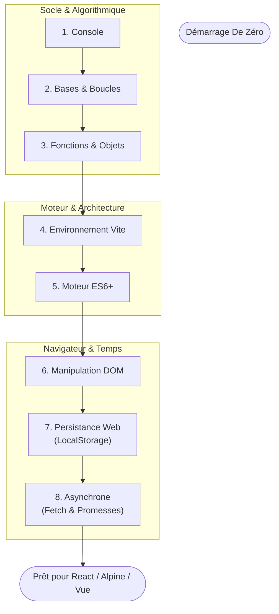

# JavaScript

!!! quote "Analogie Pédagogique"
    _Si le HTML est le squelette de la maison, et le CSS la plomberie et les couleurs... alors le **JavaScript** est l'électricité de la maison. C'est l'étage de l'intelligence artificielle de votre interface, celui qui réagit aux actions humaines (Allumer, éteindre, stocker, animer au clic)._

## Objectif

Le JavaScript (souvent abrégé "JS") est le **langage de programmation n°1 en demande dans le monde**. Il s'est étendu bien au-delà des navigateurs (NodeJS, applications mobiles, desktop). Ce curriculum se concentre sur **le Javascript Frontend Moderne et Applicatif**.

 

---

## Socle & Algorithmique

- ### :lucide-book-open-check: 01. Intro & Console
    ---
    Comprenez où vit la machine, comment interagir avec le navigateur en secret pour diagnostiquer vos erreurs de code sans rien casser visuellement.

    [01 - Hello World](./socle/01-hello-et-console.md)

- ### :lucide-book-open-check: 02. Bases Algorithmiques
    ---
    Un rappel bref mais intense de l'usage des `variables` (Tiroirs), des embranchements (Conditions `if/else`) et de la Répétition ultime (Boucles).

    [02 - La Base Algorithmique](./socle/02-bases-algorithmiques.md)

- ### :lucide-book-open-check: 03. Fonctions et Objets
    ---
    Organisez votre chaos : empaquetez votre code réutilisable dans des usines, et modelez le monde réel (un joueur, une voiture) dans des Dictionnaires JS.

    [03 - Fonctions et Objets](./socle/03-fonctions-et-objets.md)

 

## Moteur & Architecture

- ### :lucide-book-open-check: 04. Environnement & Modules
    ---
    Oubliez la balise `<script src>`. Bienvenue dans le monde industriel de **Vite.js**, du Hot-Reload fantastique et des imports/exports (`.mjs`).

    [04 - Tooling & Vite.js](./moteur/04-environnement-modules.md)

- ### :lucide-book-open-check: 05. Moteur et ES6+
    ---
    L'évolution vitale : Destructuration magique, l'opérateur Rest/Spread, les flèches `=>`, les **Classes** et les **Méthodes de Tableaux** modernes.

    [05 - Le miracle de l'ES6](./moteur/05-syntaxe-modern-es6.md)

 

## Navigateur & Temps

- ### :lucide-book-open-check: 06. Le DOM + Interactivité
    ---
    Sélectionnez des éléments HTML, modifiez leur texte, changez leurs couleurs CSS, et écoutez les actions d'un utilisateur au clic et au clavier.

    [06 - L'Interface DOM](./application/06-dom-manipulation.md)

- ### :lucide-book-open-check: 07. Persistance Locale
    ---
    Sauvegardez les préférences d'un visiteur physiquement dans son ordinateur (LocalStorage). Ne perdez jamais la mémoire au `F5`, sans aucune base de données.

    [07 - Le Web Storage API](./application/07-persistance-locale.md)

- ### :lucide-book-open-check: 08. L'Asynchrone
    ---
    L'**Event Loop** dévoilée : comprenez enfin pourquoi Chrome ne "freeze" jamais. Voyagez dans le temps avec les objets Promises et le fabuleux standard `async/await`.

    [08 - Maîtriser le Temps](./application/08-logique-asynchrone.md)

 

---

## 🛠️ Travaux Pratiques (Projets)

- ### :lucide-book-open-check: Projet 1 — La Vitrine
    ---
    Dynamisez la vitrine DigitalCraft Agency avec Vite.js, le mode sombre et Fetch API.

    [Voir le sujet](../../projets/javascript-vitrine/index.md)

- ### :lucide-book-open-check: Projet 2 — Le Hub
    ---
    Construisez un tableau de bord regroupant Todo-List, Météo et Blagues.

    [Voir le sujet](../../projets/javascript-hub/index.md)

 

---

## Progression de carrière

 

**Point d'entrée de votre carrière : [01. Introduction & Console](./socle/01-hello-et-console.md)**

 
