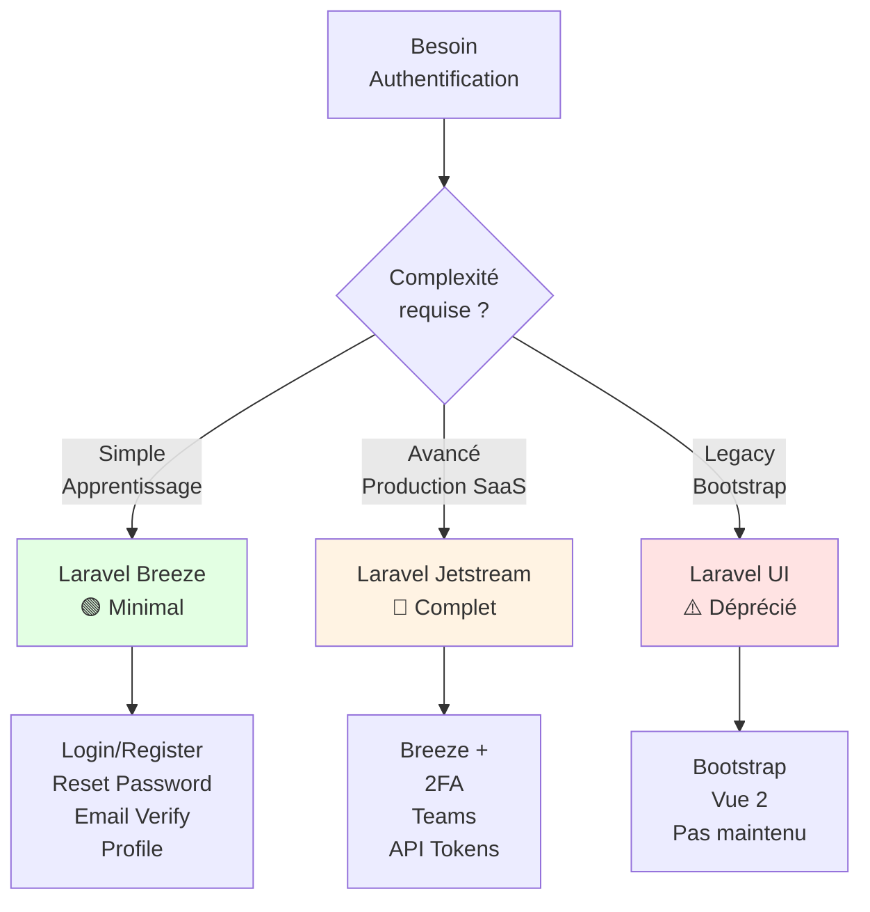

# Auth - Breeze

## Introduction

<div
  class="omny-meta"
  data-level="🟢 Débutant"
  data-version="1.0"
  data-time="45-60 minutes">
</div>

!!! quote "Analogie pédagogique"
    _Imaginez que vous construisez une **maison sécurisée**. Coder l'authentification manuellement (login, register, reset password, email verification) revient à **fabriquer vous-même** les serrures, les clés, le système d'alarme - long, complexe, et risqué si mal fait. **Laravel Breeze est comme un kit de sécurité professionnel pré-assemblé** : portes blindées déjà installées (routes auth), serrures certifiées (hashing bcrypt), caméras configurées (sessions sécurisées), et système d'alarme opérationnel (CSRF protection). Vous obtenez une **sécurité professionnelle en 2 minutes** d'installation._

> **Laravel Breeze** est le **starter kit d'authentification minimaliste** officiel de Laravel, créé par Taylor Otwell. Lancé en 2020, Breeze fournit une **implémentation complète mais simple** de toutes les fonctionnalités d'authentification essentielles : login, registration, reset password, email verification, et profile management. Contrairement à Jetstream (son grand frère), Breeze reste **volontairement simple** (~15 fichiers générés) pour être **facilement compréhensible et personnalisable**.

Laravel Breeze est devenu le **point de départ standard** pour les nouvelles applications Laravel nécessitant authentification. Sa philosophie "simple scaffolding" en fait l'outil parfait pour **apprendre l'authentification Laravel** ou pour des projets ne nécessitant pas les fonctionnalités avancées de Jetstream (2FA, teams, API tokens).

!!! info "Pourquoi c'est important ?"
    Breeze permet d'**implémenter l'authentification en 5 minutes** sans sacrifier la sécurité, de **comprendre le code** généré (contrairement aux packages "boîte noire"), de **personnaliser facilement** chaque aspect (vues, routes, contrôleurs visibles), d'**apprendre les bonnes pratiques** Laravel (Form Requests, Route Model Binding, Policies), et de **démarrer proprement** tout projet Laravel moderne.

## Philosophie Breeze

### Breeze vs Jetstream vs UI (deprecated)



| Fonctionnalité | Breeze | Jetstream | Laravel UI |
|----------------|:------:|:---------:|:----------:|
| **Login/Register** | ✅ | ✅ | ✅ |
| **Reset Password** | ✅ | ✅ | ✅ |
| **Email Verification** | ✅ | ✅ | ✅ |
| **Profile Management** | ✅ | ✅ | ❌ |
| **2FA (Two-Factor)** | ❌ | ✅ | ❌ |
| **Teams** | ❌ | ✅ | ❌ |
| **API Tokens** | ❌ | ✅ | ❌ |
| **Fichiers générés** | ~15 | ~100+ | ~20 |
| **Complexité** | 🟢 Simple | 🔴 Avancée | 🟡 Moyenne |
| **Personnalisable** | ✅ Très facile | ⚠️ Complexe | ✅ Facile |
| **Maintenance** | ✅ Active | ✅ Active | ❌ Déprécié |

!!! tip "Quand choisir Breeze ?"
    **Utilisez Breeze si :**
    
    - Vous **apprenez Laravel** et voulez comprendre l'authentification
    - Vous construisez une **application simple** (blog, portfolio, CRUD)
    - Vous voulez un **code minimal et lisible**
    - Vous **n'avez PAS besoin** de 2FA, teams, ou API tokens
    - Vous préférez **personnaliser vous-même** plutôt qu'utiliser des abstractions

## Installation et configuration

### Prérequis

```bash
# Laravel 10+ installé
composer create-project laravel/laravel blog-breeze
cd blog-breeze

# Configurer .env (database)
DB_CONNECTION=mysql
DB_DATABASE=blog_breeze
DB_USERNAME=root
DB_PASSWORD=

# Créer database
mysql -u root -p
CREATE DATABASE blog_breeze;
EXIT;
```

### Installer Breeze

```bash
# Installer package Breeze
composer require laravel/breeze --dev

# Installer Breeze (génère fichiers auth)
php artisan breeze:install

# Choisir stack (questions interactives) :
# ┌ Which Breeze stack would you like to install? ────────┐
# │ › Blade with Alpine                                     │
# │   Livewire (Volt Class API) with Alpine                │
# │   Livewire (Volt Functional API) with Alpine           │
# │   React with Inertia                                    │
# │   Vue with Inertia                                      │
# │   API only                                              │
# └─────────────────────────────────────────────────────────┘
# → Choisir : Blade with Alpine

# Choisir dark mode :
# ┌ Would you like dark mode support? ─────────────────────┐
# │ › No                                                    │
# └─────────────────────────────────────────────────────────┘

# Choisir framework tests :
# ┌ Which testing framework do you prefer? ────────────────┐
# │ › PHPUnit                                               │
# └─────────────────────────────────────────────────────────┘

# Installer dépendances NPM et compiler assets
npm install
npm run dev

# Exécuter migrations (créer tables users, etc.)
php artisan migrate

# Démarrer serveur
php artisan serve
```

### Ce qui a été généré

```
app/
├── Http/
│   ├── Controllers/
│   │   └── Auth/                              # Contrôleurs auth
│   │       ├── AuthenticatedSessionController.php    # Login/Logout
│   │       ├── ConfirmablePasswordController.php     # Confirm password
│   │       ├── EmailVerificationNotificationController.php
│   │       ├── EmailVerificationPromptController.php
│   │       ├── NewPasswordController.php             # Reset password
│   │       ├── PasswordController.php                # Update password
│   │       ├── PasswordResetLinkController.php       # Forgot password
│   │       ├── RegisteredUserController.php          # Register
│   │       └── VerifyEmailController.php             # Email verification
│   └── Requests/
│       └── Auth/                              # Form Requests validation
│           ├── LoginRequest.php
│           └── ...

resources/
└── views/
    ├── auth/                                  # Vues authentification
    │   ├── confirm-password.blade.php
    │   ├── forgot-password.blade.php
    │   ├── login.blade.php
    │   ├── register.blade.php
    │   ├── reset-password.blade.php
    │   └── verify-email.blade.php
    ├── layouts/
    │   ├── app.blade.php                      # Layout principal
    │   └── guest.blade.php                    # Layout guest (login, register)
    ├── profile/
    │   ├── edit.blade.php                     # Profile management
    │   └── partials/
    │       ├── delete-user-form.blade.php
    │       ├── update-password-form.blade.php
    │       └── update-profile-information-form.blade.php
    └── dashboard.blade.php                    # Page après login

routes/
├── auth.php                                   # Routes authentification
└── web.php                                    # Routes principales (modifiées)
```

## Fonctionnalités Breeze

### 1. Register (Inscription)

**Route :** `GET /register`

**Contrôleur :** `app/Http/Controllers/Auth/RegisteredUserController.php`

```php
<?php

namespace App\Http\Controllers\Auth;

use App\Http\Controllers\Controller;
use App\Models\User;
use Illuminate\Auth\Events\Registered;
use Illuminate\Http\Request;
use Illuminate\Support\Facades\Auth;
use Illuminate\Support\Facades\Hash;
use Illuminate\Validation\Rules;

class RegisteredUserController extends Controller
{
    /**
     * Afficher formulaire inscription
     */
    public function create()
    {
        return view('auth.register');
    }

    /**
     * Créer nouveau compte utilisateur
     */
    public function store(Request $request)
    {
        // Validation
        $request->validate([
            'name' => ['required', 'string', 'max:255'],
            'email' => ['required', 'string', 'email', 'max:255', 'unique:users'],
            'password' => ['required', 'confirmed', Rules\Password::defaults()],
        ]);

        // Créer utilisateur (password hashé automatiquement)
        $user = User::create([
            'name' => $request->name,
            'email' => $request->email,
            'password' => Hash::make($request->password),
        ]);

        // Événement "Registered" (déclenche email verification si activé)
        event(new Registered($user));

        // Login automatique après inscription
        Auth::login($user);

        // Rediriger vers dashboard
        return redirect(route('dashboard'));
    }
}
```

**Vue :** `resources/views/auth/register.blade.php`

```html
<!-- Code Blade : Formulaire inscription -->
<x-guest-layout>
    <form method="POST" action="{{ route('register') }}">
        @csrf

        <!-- Name -->
        <div>
            <label for="name">Nom</label>
            <input id="name" type="text" name="name" 
                   value="{{ old('name') }}" required autofocus>
            @error('name')
                <span class="error">{{ $message }}</span>
            @enderror
        </div>

        <!-- Email -->
        <div class="mt-4">
            <label for="email">Email</label>
            <input id="email" type="email" name="email" 
                   value="{{ old('email') }}" required>
            @error('email')
                <span class="error">{{ $message }}</span>
            @enderror
        </div>

        <!-- Password -->
        <div class="mt-4">
            <label for="password">Mot de passe</label>
            <input id="password" type="password" name="password" required>
            @error('password')
                <span class="error">{{ $message }}</span>
            @enderror
        </div>

        <!-- Confirm Password -->
        <div class="mt-4">
            <label for="password_confirmation">Confirmer mot de passe</label>
            <input id="password_confirmation" type="password" 
                   name="password_confirmation" required>
        </div>

        <div class="flex items-center justify-end mt-4">
            <a href="{{ route('login') }}" class="underline">
                Déjà inscrit ?
            </a>

            <button type="submit" class="ml-4">
                S'inscrire
            </button>
        </div>
    </form>
</x-guest-layout>
```

### 2. Login (Connexion)

**Route :** `GET /login`, `POST /login`

**Contrôleur :** `app/Http/Controllers/Auth/AuthenticatedSessionController.php`

```php
<?php

namespace App\Http\Controllers\Auth;

use App\Http\Controllers\Controller;
use App\Http\Requests\Auth\LoginRequest;
use Illuminate\Http\Request;
use Illuminate\Support\Facades\Auth;

class AuthenticatedSessionController extends Controller
{
    /**
     * Afficher formulaire login
     */
    public function create()
    {
        return view('auth.login');
    }

    /**
     * Authentifier utilisateur
     */
    public function store(LoginRequest $request)
    {
        // Validation + tentative authentification dans LoginRequest
        $request->authenticate();

        // Régénérer session (sécurité contre session fixation)
        $request->session()->regenerate();

        // Rediriger vers page prévue ou dashboard
        return redirect()->intended(route('dashboard'));
    }

    /**
     * Déconnexion
     */
    public function destroy(Request $request)
    {
        // Déconnecter utilisateur
        Auth::guard('web')->logout();

        // Invalider session
        $request->session()->invalidate();

        // Régénérer token CSRF
        $request->session()->regenerateToken();

        return redirect('/');
    }
}
```

**Form Request :** `app/Http/Requests/Auth/LoginRequest.php`

```php
<?php

namespace App\Http\Requests\Auth;

use Illuminate\Auth\Events\Lockout;
use Illuminate\Foundation\Http\FormRequest;
use Illuminate\Support\Facades\Auth;
use Illuminate\Support\Facades\RateLimiter;
use Illuminate\Support\Str;
use Illuminate\Validation\ValidationException;

class LoginRequest extends FormRequest
{
    /**
     * Règles validation
     */
    public function rules(): array
    {
        return [
            'email' => ['required', 'string', 'email'],
            'password' => ['required', 'string'],
        ];
    }

    /**
     * Tenter authentification
     */
    public function authenticate(): void
    {
        $this->ensureIsNotRateLimited();

        // Tentative login
        if (! Auth::attempt($this->only('email', 'password'), $this->boolean('remember'))) {
            RateLimiter::hit($this->throttleKey());

            throw ValidationException::withMessages([
                'email' => __('auth.failed'),
            ]);
        }

        RateLimiter::clear($this->throttleKey());
    }

    /**
     * Vérifier rate limiting (5 tentatives max)
     */
    public function ensureIsNotRateLimited(): void
    {
        if (! RateLimiter::tooManyAttempts($this->throttleKey(), 5)) {
            return;
        }

        event(new Lockout($this));

        $seconds = RateLimiter::availableIn($this->throttleKey());

        throw ValidationException::withMessages([
            'email' => trans('auth.throttle', [
                'seconds' => $seconds,
                'minutes' => ceil($seconds / 60),
            ]),
        ]);
    }

    /**
     * Clé rate limiting
     */
    public function throttleKey(): string
    {
        return Str::transliterate(Str::lower($this->input('email')).'|'.$this->ip());
    }
}
```

### 3. Password Reset (Réinitialisation)

**Flow complet :**

1. User clique "Forgot password" → Formulaire email
2. User soumet email → Email envoyé avec lien reset
3. User clique lien email → Formulaire nouveau password
4. User soumet nouveau password → Password mis à jour + login auto

**Routes :**

```php
// routes/auth.php
Route::get('/forgot-password', [PasswordResetLinkController::class, 'create'])
    ->name('password.request');

Route::post('/forgot-password', [PasswordResetLinkController::class, 'store'])
    ->name('password.email');

Route::get('/reset-password/{token}', [NewPasswordController::class, 'create'])
    ->name('password.reset');

Route::post('/reset-password', [NewPasswordController::class, 'store'])
    ->name('password.store');
```

**Contrôleur Forgot Password :**

```php
<?php

namespace App\Http\Controllers\Auth;

use App\Http\Controllers\Controller;
use Illuminate\Http\Request;
use Illuminate\Support\Facades\Password;

class PasswordResetLinkController extends Controller
{
    public function create()
    {
        return view('auth.forgot-password');
    }

    public function store(Request $request)
    {
        $request->validate(['email' => ['required', 'email']]);

        // Envoyer lien reset
        $status = Password::sendResetLink(
            $request->only('email')
        );

        return $status === Password::RESET_LINK_SENT
                    ? back()->with(['status' => __($status)])
                    : back()->withErrors(['email' => __($status)]);
    }
}
```

### 4. Email Verification

**Activer email verification :**

**Modèle User :** `app/Models/User.php`

```php
<?php

namespace App\Models;

use Illuminate\Contracts\Auth\MustVerifyEmail;
use Illuminate\Foundation\Auth\User as Authenticatable;
use Illuminate\Notifications\Notifiable;

class User extends Authenticatable implements MustVerifyEmail
{
    use Notifiable;
    
    // ... reste du modèle
}
```

**Protéger routes :**

```php
// routes/web.php
Route::middleware(['auth', 'verified'])->group(function () {
    Route::get('/dashboard', function () {
        return view('dashboard');
    })->name('dashboard');
    
    // Autres routes nécessitant email vérifié
});
```

**Flow :**

1. User s'inscrit → Email envoyé automatiquement
2. User tente accéder route `verified` → Redirecté vers prompt verification
3. User clique lien email → Email marqué vérifié → Redirecté dashboard

### 5. Profile Management

**Route :** `GET /profile`, `PATCH /profile`

**Contrôleur :** `app/Http/Controllers/ProfileController.php`

```php
<?php

namespace App\Http\Controllers;

use Illuminate\Http\Request;
use Illuminate\Support\Facades\Auth;
use Illuminate\Support\Facades\Redirect;
use Illuminate\Validation\Rule;

class ProfileController extends Controller
{
    public function edit(Request $request)
    {
        return view('profile.edit', [
            'user' => $request->user(),
        ]);
    }

    public function update(Request $request)
    {
        $validated = $request->validate([
            'name' => ['required', 'string', 'max:255'],
            'email' => ['required', 'string', 'email', 'max:255', 
                       Rule::unique('users')->ignore($request->user()->id)],
        ]);

        $request->user()->fill($validated);

        if ($request->user()->isDirty('email')) {
            $request->user()->email_verified_at = null;
        }

        $request->user()->save();

        return Redirect::route('profile.edit')->with('status', 'profile-updated');
    }

    public function destroy(Request $request)
    {
        $request->validateWithBag('userDeletion', [
            'password' => ['required', 'current_password'],
        ]);

        $user = $request->user();

        Auth::logout();

        $user->delete();

        $request->session()->invalidate();
        $request->session()->regenerateToken();

        return Redirect::to('/');
    }
}
```

## Personnalisation Breeze

### Ajouter champs au register

**Migration :** Ajouter colonne `phone`

```bash
php artisan make:migration add_phone_to_users_table
```

```php
<?php

public function up(): void
{
    Schema::table('users', function (Blueprint $table) {
        $table->string('phone')->nullable()->after('email');
    });
}
```

**Modèle User :** Ajouter `phone` dans `$fillable`

```php
protected $fillable = [
    'name',
    'email',
    'phone',
    'password',
];
```

**Contrôleur Register :** Modifier validation

```php
public function store(Request $request)
{
    $request->validate([
        'name' => ['required', 'string', 'max:255'],
        'email' => ['required', 'string', 'email', 'max:255', 'unique:users'],
        'phone' => ['nullable', 'string', 'max:20'],
        'password' => ['required', 'confirmed', Rules\Password::defaults()],
    ]);

    $user = User::create([
        'name' => $request->name,
        'email' => $request->email,
        'phone' => $request->phone,
        'password' => Hash::make($request->password),
    ]);

    event(new Registered($user));
    Auth::login($user);

    return redirect(route('dashboard'));
}
```

**Vue Register :** Ajouter champ phone

```html
<!-- Code Blade : Ajouter après email -->
<div class="mt-4">
    <label for="phone">Téléphone (optionnel)</label>
    <input id="phone" type="text" name="phone" value="{{ old('phone') }}">
    @error('phone')
        <span class="error">{{ $message }}</span>
    @enderror
</div>
```

### Personnaliser redirect après login

**Modifier :** `app/Providers/RouteServiceProvider.php`

```php
<?php

namespace App\Providers;

use Illuminate\Support\Facades\Route;
use Illuminate\Foundation\Support\Providers\RouteServiceProvider as ServiceProvider;

class RouteServiceProvider extends ServiceProvider
{
    /**
     * Redirect après login
     */
    public const HOME = '/dashboard';
    
    // OU redirection conditionnelle :
    public function boot(): void
    {
        $this->routes(function () {
            Route::middleware('web')
                ->group(base_path('routes/web.php'));
        });
    }
}
```

**Alternative : Redirection conditionnelle par rôle**

```php
// app/Http/Controllers/Auth/AuthenticatedSessionController.php
public function store(LoginRequest $request)
{
    $request->authenticate();
    $request->session()->regenerate();

    // Redirection selon rôle
    if ($request->user()->isAdmin()) {
        return redirect()->route('admin.dashboard');
    }

    return redirect()->intended(route('dashboard'));
}
```

## Exemple complet : Blog avec auth

**Scénario :** Blog où utilisateurs authentifiés peuvent créer/modifier leurs posts.

### Modèle Post

```bash
php artisan make:model Post -mcr
```

**Migration :**

```php
<?php

public function up(): void
{
    Schema::create('posts', function (Blueprint $table) {
        $table->id();
        $table->foreignId('user_id')->constrained()->onDelete('cascade');
        $table->string('title');
        $table->string('slug')->unique();
        $table->text('content');
        $table->boolean('is_published')->default(false);
        $table->timestamps();
    });
}
```

**Modèle :**

```php
<?php

namespace App\Models;

use Illuminate\Database\Eloquent\Model;
use Illuminate\Support\Str;

class Post extends Model
{
    protected $fillable = ['user_id', 'title', 'slug', 'content', 'is_published'];
    
    protected $casts = ['is_published' => 'boolean'];
    
    protected static function boot()
    {
        parent::boot();
        
        static::creating(function ($post) {
            $post->slug = Str::slug($post->title);
        });
    }
    
    public function user()
    {
        return $this->belongsTo(User::class);
    }
}
```

### Policy

```bash
php artisan make:policy PostPolicy --model=Post
```

```php
<?php

namespace App\Policies;

use App\Models\Post;
use App\Models\User;

class PostPolicy
{
    public function update(User $user, Post $post): bool
    {
        return $user->id === $post->user_id;
    }

    public function delete(User $user, Post $post): bool
    {
        return $user->id === $post->user_id;
    }
}
```

### Contrôleur

```php
<?php

namespace App\Http\Controllers;

use App\Models\Post;
use Illuminate\Http\Request;

class PostController extends Controller
{
    public function __construct()
    {
        $this->middleware('auth')->except(['index', 'show']);
    }

    public function index()
    {
        $posts = Post::with('user')
                     ->where('is_published', true)
                     ->latest()
                     ->paginate(10);
        
        return view('posts.index', compact('posts'));
    }

    public function create()
    {
        return view('posts.create');
    }

    public function store(Request $request)
    {
        $validated = $request->validate([
            'title' => 'required|max:255',
            'content' => 'required',
        ]);

        $post = $request->user()->posts()->create($validated);

        return redirect()->route('posts.show', $post)
                         ->with('success', 'Post créé !');
    }

    public function show(Post $post)
    {
        return view('posts.show', compact('post'));
    }

    public function edit(Post $post)
    {
        $this->authorize('update', $post);
        
        return view('posts.edit', compact('post'));
    }

    public function update(Request $request, Post $post)
    {
        $this->authorize('update', $post);
        
        $validated = $request->validate([
            'title' => 'required|max:255',
            'content' => 'required',
            'is_published' => 'boolean',
        ]);

        $post->update($validated);

        return redirect()->route('posts.show', $post)
                         ->with('success', 'Post mis à jour !');
    }

    public function destroy(Post $post)
    {
        $this->authorize('delete', $post);
        
        $post->delete();

        return redirect()->route('posts.index')
                         ->with('success', 'Post supprimé !');
    }
}
```

### Routes

```php
<?php

// routes/web.php
use App\Http\Controllers\PostController;

require __DIR__.'/auth.php';

Route::get('/', [PostController::class, 'index'])->name('home');

Route::middleware(['auth', 'verified'])->group(function () {
    Route::get('/dashboard', function () {
        return view('dashboard');
    })->name('dashboard');
});

Route::resource('posts', PostController::class);
```

## Le mot de la fin

!!! quote
    Laravel Breeze prouve qu'**élégance et simplicité** peuvent coexister avec **sécurité professionnelle**. En générant seulement ~15 fichiers de code **clair et lisible**, Breeze offre une implémentation complète de l'authentification qui surpasse la plupart des solutions custom codées manuellement. Son approche "scaffolding minimaliste" respecte l'intelligence du développeur : le code est là, visible, compréhensible, modifiable.
    
    Breeze est le **meilleur professeur d'authentification Laravel**. Chaque contrôleur, chaque Form Request, chaque vue Blade illustre les **bonnes pratiques** : validation robuste, rate limiting contre brute force, hashing bcrypt automatique, CSRF protection, session regeneration après login, email verification optionnelle. Pas de magie opaque, juste du **code Laravel standard** que vous pouvez étudier et personnaliser.
    
    Pour 95% des applications Laravel, Breeze est **amplement suffisant**. Il ne fait pas tout (pas de 2FA, pas de teams), mais il fait **l'essentiel parfaitement**. Et quand votre application grandit, rien ne vous empêche d'ajouter 2FA manuellement ou de migrer vers Jetstream. Breeze n'enferme pas, il **libère**.

---

**Ressources :**

- [Laravel Breeze Documentation](https://laravel.com/docs/starter-kits#laravel-breeze)
- [Breeze GitHub](https://github.com/laravel/breeze)

[^1]: **Scaffolding** : Génération automatique de code de base (contrôleurs, vues, routes) pour démarrer rapidement un projet. Le code généré est ensuite personnalisable.
