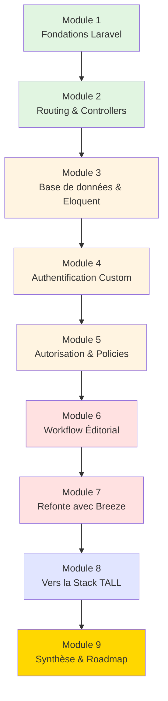
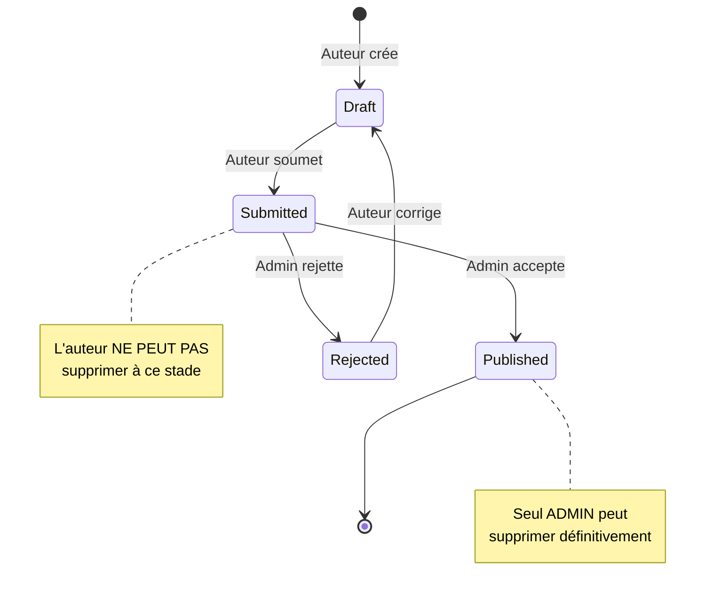
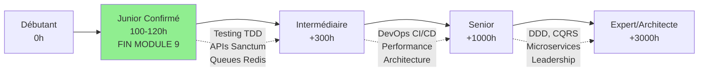
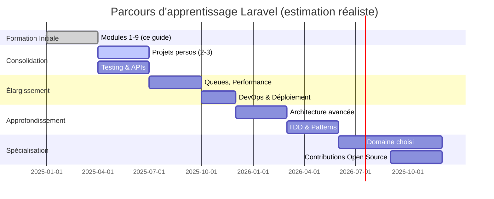

# Laravel

<div
  class="omny-meta"
  data-level="🟢 Débutant à 🔴 Avancé"
  data-version="2.0"
  data-time="100-120 heures">
</div>

## Introduction au parcours d'apprentissage

!!! quote "Analogie pédagogique"
    _Imaginez que vous construisez une maison. Vous ne commencez pas par poser le toit ou installer la cuisine. Vous commencez par les **fondations** : creuser, couler le béton, monter les murs porteurs. Ensuite viennent les **murs**, puis l'**électricité**, la **plomberie**, et enfin la **décoration**. Laravel fonctionne exactement de cette manière : nous allons construire un blog professionnel brique par brique, en comprenant **chaque fondation** avant d'ajouter la brique suivante._

**Ce guide complet** vous accompagne dans la maîtrise de Laravel à travers un projet réel : un **blog éditorialiste professionnel** où des auteurs créent du contenu technique, soumis à validation administrative avant publication. Ce n'est pas un simple tutoriel "copier-coller" : c'est un **parcours d'apprentissage structuré** qui vous fera passer de débutant à développeur Laravel confirmé.

### Pourquoi ce projet spécifique ?

Un blog éditorialiste avec validation administrative couvre **l'ensemble des concepts Laravel essentiels** :

- **Routing** : routes publiques, protégées, paramétrées
- **Controllers** : logique métier, validation, autorisations
- **Eloquent ORM** : relations, scopes, mutateurs
- **Authentification** : session, guards, middlewares
- **Autorisation** : policies, gates, rôles
- **Migrations** : schéma de base de données évolutif
- **Validation** : Form Requests, règles custom
- **Gestion d'état** : workflow éditorial (brouillon → soumis → publié)

!!! info "Approche pédagogique unique"
    Nous construirons ce projet **trois fois** avec des approches différentes pour comprendre les choix architecturaux :
    
    1. **Version "à la main"** : authentification session custom, tout explicite
    2. **Version Breeze** : starter kit standard Laravel
    3. **Perspectives TALL stack** : Tailwind + Alpine + Livewire (théorique)
    4. **Synthèse globale** : analyse complète, roadmap d'évolution, technologies avancées

### Public cible et prérequis

**Vous devriez maîtriser avant de commencer :**

- [x] PHP orienté objet (classes, interfaces, namespaces)
- [x] SQL de base (SELECT, INSERT, UPDATE, DELETE, JOIN)
- [x] Terminal / ligne de commande
- [x] Concepts HTTP (requêtes/réponses, méthodes, codes statut)
- [x] Composer (gestionnaire de dépendances PHP)

**Ce guide est fait pour vous si :**

- Vous voulez apprendre Laravel **en profondeur**, pas en surface
- Vous préférez comprendre le "pourquoi" avant le "comment"
- Vous voulez un projet **réaliste et professionnellement viable**
- Vous êtes prêt à investir **100-120 heures** pour une maîtrise solide

---

## Architecture du parcours d'apprentissage

Ce guide est divisé en **9 modules progressifs**. Chaque module construit sur les acquis des précédents, avec un module final de synthèse et perspectives d'évolution.


_Le parcours suit une progression logique : des fondations (vert) aux concepts intermédiaires (orange), avancés (rouge), perspectives (bleu), et synthèse finale (or)._

### Vue d'ensemble des modules

<div class="grid cards" markdown>

-   :lucide-hammer:{ .lg .middle } **Module 1** — _Fondations Laravel_

    ---
    Installation, structure de projet, cycle de vie requête/réponse, artisan, conventions.

    **Niveau** : 🟢 Débutant | **Durée** : 8-10h

    [:lucide-book-open-check: Accéder au Module 1](./module-01-fondations/)

-   :lucide-route:{ .lg .middle } **Module 2** — _Routing & Controllers_

    ---
    Routes (GET/POST/PUT/DELETE), Route Model Binding, controllers resource, validation basique.

    **Niveau** : 🟢 Débutant | **Durée** : 10-12h

    [:lucide-book-open-check: Accéder au Module 2](./module-02-routing-controllers/)

</div>

<div class="grid cards" markdown>

-   :lucide-database:{ .lg .middle } **Module 3** — _Base de données & Eloquent_

    ---
    Migrations, seeders, factories. Configuration SQLite/MariaDB/PostgreSQL. Eloquent : CRUD, relations, scopes.

    **Niveau** : 🟡 Intermédiaire | **Durée** : 15-18h

    [:lucide-book-open-check: Accéder au Module 3](./module-03-database-eloquent/)

-   :lucide-lock:{ .lg .middle } **Module 4** — _Authentification Custom_

    ---
    Session PHP, cookies, hashing, middlewares auth custom, register/login/logout "à la main".

    **Niveau** : 🟡 Intermédiaire | **Durée** : 12-15h

    [:lucide-book-open-check: Accéder au Module 4](./module-04-auth-custom/)

</div>

<div class="grid cards" markdown>

-   :lucide-shield-check:{ .lg .middle } **Module 5** — _Autorisation & Policies_

    ---
    Gates, Policies, ownership (un auteur édite SES posts), rôles (admin/auteur), middlewares métier.

    **Niveau** : 🟡 Intermédiaire | **Durée** : 10-12h

    [:lucide-book-open-check: Accéder au Module 5](./module-05-authorization-policies/)

-   :lucide-git-branch:{ .lg .middle } **Module 6** — _Workflow Éditorial_

    ---
    Machine à états (draft → submitted → published → rejected), notifications admin, gestion images.

    **Niveau** : 🔴 Avancé | **Durée** : 15-18h

    [:lucide-book-open-check: Accéder au Module 6](./module-06-workflow-editorial/)

</div>

<div class="grid cards" markdown>

-   :lucide-wind:{ .lg .middle } **Module 7** — _Refonte avec Breeze_

    ---
    Refaire le projet avec Laravel Breeze, comparaison approche custom vs starter kit, quand utiliser quoi.

    **Niveau** : 🔴 Avancé | **Durée** : 12-15h

    [:lucide-book-open-check: Accéder au Module 7](./module-07-breeze-refonte/)

-   :lucide-layers:{ .lg .middle } **Module 8** — _Perspectives TALL Stack_

    ---
    Introduction Tailwind CSS, Alpine.js, Livewire. Quand passer d'une stack Blade à TALL. Architecture moderne.

    **Niveau** : 🔴 Avancé | **Durée** : 8-10h

    [:lucide-book-open-check: Accéder au Module 8](./module-08-tall-perspectives/)

</div>

<div class="grid cards" markdown>

-   :lucide-graduation-cap:{ .lg .middle } **Module 9** — _Synthèse Globale & Perspectives_

    ---
    Récapitulatif complet, matrice de compétences, technologies essentielles (PHPUnit, Livewire avancé, Sanctum, Jetstream), sécurité OWASP, features non couvertes, roadmap d'évolution 24 mois.

    **Niveau** : 🔵 Synthèse | **Durée** : 10-12h

    [:lucide-graduation-cap: Accéder au Module 9](./module-09-synthese-roadmap/)

</div>

---

## Cahier des charges du projet

### Vision produit

Nous construisons un **blog technique éditorialiste** avec ces caractéristiques :

**Pour les lecteurs (public) :**
- Consultation libre des articles publiés
- Pas d'inscription nécessaire pour lire
- Affichage chronologique et par catégories

**Pour les auteurs (role: author_approved) :**
- Inscription puis validation par admin
- Création d'articles (titre, contenu, images)
- Modification de leurs propres articles
- Soumission à validation
- **Impossibilité de supprimer** (seul admin peut)
- Alerte explicite avant première soumission

**Pour les administrateurs (role: admin) :**
- Validation des nouveaux auteurs
- Validation des articles soumis
- Publication ou rejet avec commentaire
- Suppression d'articles
- Ban définitif d'auteurs malveillants

### Règles métier (business rules)


**Règles d'or du workflow :**

1. **Un auteur n'est jamais "auteur" à l'inscription**  
   Il doit être approuvé par un admin (`is_author_approved = true`)

2. **Un article soumis ne peut plus être supprimé par son auteur**  
   Seul un admin a ce pouvoir (raison : traçabilité éditoriale)

3. **Alerte explicite avant première soumission**  
   Message : _"Attention : une fois soumis, vous ne pourrez plus supprimer cet article. Seul un administrateur le pourra. Continuer ?"_

4. **Contenu hors-sujet = ban possible**  
   L'admin juge si le contenu est bien technique/informatique

5. **Images obligatoires**  
   Chaque article doit avoir une image principale (stockage local ou cloud selon config)

### Schéma de base de données (aperçu)
```mermaid
erDiagram
    USERS ||--o{ POSTS : creates
    USERS {
        bigint id PK
        string name
        string email UK
        string password
        boolean is_admin
        boolean is_author_approved
        boolean is_banned
        timestamp banned_at
        text ban_reason
        timestamps
    }
    
    POSTS ||--o{ POST_IMAGES : has
    POSTS {
        bigint id PK
        bigint user_id FK
        string title
        text body
        string slug UK
        string status
        timestamp submitted_at
        timestamp published_at
        text admin_note
        timestamps
    }
    
    POST_IMAGES {
        bigint id PK
        bigint post_id FK
        string path
        boolean is_main
        integer order
        timestamps
    }
```

_Relations clés : un utilisateur possède plusieurs posts, un post contient plusieurs images._

---

## Méthodologie d'apprentissage

### Comment utiliser ce guide efficacement

!!! tip "Règles d'or pour progresser"
    1. **Ne sautez JAMAIS de module** : chaque concept construit sur le précédent
    2. **Tapez le code vous-même** : ne copiez-collez pas mécaniquement
    3. **Lisez les commentaires** : ils contiennent des explications essentielles
    4. **Testez chaque étape** : utilisez `php artisan serve` et votre navigateur
    5. **Cassez volontairement** : modifiez le code pour voir ce qui se passe
    6. **Prenez des notes** : le Module 9 vous aidera à structurer vos connaissances

### Structure type de chaque module

Chaque module suit cette structure pédagogique :

**1. Introduction contextuelle**  
Pourquoi ce module ? Que va-t-on construire ? Comment cela s'intègre-t-il au tout ?

**2. Concepts théoriques fondamentaux**  
Explications "tableau blanc" avec diagrammes **avant** le code

**3. Implémentation pas à pas**  
Code commenté ligne par ligne, avec explications avant ET après chaque bloc

**4. Diagrammes de séquence**  
Visualisation des flux : requête → routing → controller → model → réponse

**5. Points d'attention et pièges courants**  
Les erreurs que font **tous** les débutants (et comment les éviter)

**6. Exercices de consolidation**  
Petits défis pour vérifier la compréhension

**7. Checkpoint de progression**  
Liste de vérification : "Vous devriez maintenant être capable de..."

### Environnement de développement

**Prérequis techniques :**

- **PHP 8.5** (dernière version via [php.new](https://php.new))
- **Composer** (dernière version)
- **Laravel** (dernière version)
- **Git** (gestion de versions)
- **Base de données** : SQLite OU MariaDB OU PostgreSQL (nous couvrirons les 3)
- **IDE recommandé** : PHPStorm, VS Code avec extensions Laravel

**Installation rapide via php.new :**
```bash
# Via php.new, l'environnement est pré-configuré
# Vous aurez déjà PHP 8.5, Composer, Laravel CLI

# Vérifier les versions
php -v
composer --version
laravel --version
```

---

## Compétences acquises à l'issue du parcours

À la fin de ce guide complet (9 modules), vous maîtriserez :

### Fondations Laravel (Modules 1-3)

- [x] Architecture MVC et structure de projet Laravel
- [x] Cycle de vie requête/réponse
- [x] Service Container et Dependency Injection
- [x] Artisan CLI et création de composants
- [x] Définition routes (GET, POST, PUT, PATCH, DELETE)
- [x] Route Model Binding automatique
- [x] Controllers Resource (7 méthodes CRUD standards)
- [x] Validation côté serveur (Request, Form Request)
- [x] Migrations versionnées et rollback
- [x] Seeders et Factories (données de test)
- [x] Configuration multi-SGBD (SQLite/MariaDB/PostgreSQL)
- [x] Eloquent : CRUD, relations (hasMany, belongsTo, etc.)
- [x] Query scopes et mutateurs
- [x] Transactions et intégrité référentielle

### Authentification & Autorisation (Modules 4-5)

- [x] Authentification session custom (hashing, middleware)
- [x] Laravel Breeze (starter kit standard)
- [x] Guards et Providers
- [x] Policies (règles d'autorisation granulaires)
- [x] Gates (autorisations globales)
- [x] Middleware de rôles custom
- [x] Ownership et contrôle d'accès granulaire

### Workflow & État Métier (Module 6)

- [x] Machine à états (draft/submitted/published/rejected)
- [x] Gestion du cycle de vie d'une entité
- [x] Notifications (mail, database)
- [x] Upload et gestion d'images (Storage facade)
- [x] Gestion des erreurs et exceptions custom
- [x] Transactions DB pour garantir l'intégrité

### Production & Architecture Moderne (Modules 7-8)

- [x] Refactoring vers Laravel Breeze
- [x] Comparaison architecture custom vs starter kits
- [x] Introduction TALL Stack (Tailwind, Alpine, Livewire)
- [x] Choix architecturaux (Blade vs Livewire vs SPA)
- [x] Frontend moderne avec composants réactifs

### Synthèse & Perspectives (Module 9)

- [x] Cartographie complète des compétences acquises
- [x] Technologies essentielles à approfondir :
  - PHPUnit et Testing avancé (TDD, Feature tests)
  - Livewire avancé (nested components, polling)
  - Alpine.js patterns (plugins, $watch, $refs)
  - Tailwind CSS avancé (JIT, custom plugins)
- [x] Authentification avancée :
  - Laravel Jetstream (2FA, Teams, API tokens)
  - Laravel Sanctum (API mobile, SPA)
  - Laravel Passport (OAuth2, APIs publiques)
- [x] Sécurité fondamentale (OWASP Top 10)
- [x] Features Laravel non couvertes :
  - Queues et Jobs (traitement asynchrone)
  - Broadcasting (WebSockets, temps réel)
  - Task Scheduling (Cron jobs)
  - Events et Listeners
- [x] Roadmap de progression détaillée (24 mois)
- [x] Plan d'action concret (30 jours post-formation)

---

## Positionnement professionnel post-formation

### Après ce guide complet (9 modules), vous serez :

**Niveau Junior Backend Laravel Confirmé :**
- Construire une application CRUD complète from scratch
- Implémenter authentification et autorisation granulaires
- Structurer une base de données relationnelle propre
- Gérer un workflow métier complexe (machine à états)
- Comprendre les choix architecturaux (custom vs starter kits)
- Identifier les technologies à approfondir pour évoluer

### Diagramme de progression professionnelle


**Le Module 9 vous fournit :**

- Une matrice détaillée des compétences acquises vs manquantes
- Une roadmap de 24 mois pour atteindre le niveau Senior
- Des plans d'action concrets par phase (consolidation, élargissement, spécialisation)
- Des diagrammes décisionnels (quelle techno choisir selon le contexte)

### Estimation réaliste du parcours vers expertise


**Timeline réaliste :**
- **0-3 mois** : Modules 1-9 (ce guide) → Junior confirmé ✅
- **3-9 mois** : Consolidation + projets perso → Intermédiaire
- **9-18 mois** : Approfondissements techniques → Senior Junior
- **18-24 mois** : Spécialisation + contributions → Senior confirmé

---

## Tableau récapitulatif des modules

| Module | Thème | Concepts Clés | Temps | Niveau |
|--------|-------|---------------|-------|--------|
| **1** | Fondations Laravel | MVC, Artisan, Conventions, Cycle requête/réponse | 8-10h | 🟢 Débutant |
| **2** | Routing & Controllers | Routes HTTP, RMB, Resource Controllers, Validation | 10-12h | 🟢 Débutant |
| **3** | Base de données & Eloquent | Migrations, Relations, Scopes, Eager Loading | 15-18h | 🟡 Intermédiaire |
| **4** | Authentification Custom | Sessions, Hashing, Middlewares, Auth from scratch | 12-15h | 🟡 Intermédiaire |
| **5** | Autorisation & Policies | Gates, Policies, RBAC, Ownership | 10-12h | 🟡 Intermédiaire |
| **6** | Workflow Éditorial | FSM, Transitions, Upload Images, Transactions | 15-18h | 🔴 Avancé |
| **7** | Refonte avec Breeze | Breeze install, Refactoring, Comparaison custom/kit | 12-15h | 🔴 Avancé |
| **8** | Perspectives TALL | Tailwind, Alpine, Livewire intro, Choix archi | 8-10h | 🔴 Avancé |
| **9** | Synthèse & Roadmap | Matrice compétences, OWASP, Sanctum, Roadmap 24M | 10-12h | 🔵 Synthèse |
| **TOTAL** | **Formation complète** | **De Zéro à Junior Backend Laravel Confirmé** | **100-120h** | 🎓 **Complet** |

---

## Le mot de la fin

!!! quote "Philosophie d'apprentissage"
    Laravel n'est pas "juste un framework PHP". C'est une **philosophie de développement** qui valorise l'**élégance du code**, la **productivité du développeur** et les **conventions sensées**. Ce guide ne vous enseigne pas à "utiliser Laravel" : il vous enseigne à **penser Laravel**, à comprendre les **décisions architecturales** derrière chaque composant, et à faire des **choix éclairés** dans vos propres projets.
    
    Le code que vous allez écrire dans ce parcours n'est pas "académique" : c'est du **code professionnel** commenté pédagogiquement. Chaque middleware, chaque policy, chaque migration est pensée comme dans un **vrai projet** en entreprise.
    
    **100 à 120 heures** peuvent sembler longues. Mais c'est le prix d'une **maîtrise réelle** plutôt qu'une connaissance superficielle. À la fin du Module 9, vous ne serez pas "quelqu'un qui a fait un tutoriel Laravel" : vous serez **un développeur Laravel avec une vision claire de votre parcours d'évolution professionnelle**.

**Points forts de cette formation :**

- ✅ **Progression structurée** : du zéro absolu au Junior confirmé
- ✅ **Projet réaliste** : workflow éditorial complet (pas un simple CRUD)
- ✅ **Trois approches** : custom → Breeze → perspectives TALL
- ✅ **Sécurité dès le départ** : OWASP, hashing, CSRF, autorisation
- ✅ **Synthèse complète** : Module 9 récapitule tout et trace la roadmap
- ✅ **Plan d'action concret** : 30 jours + 24 mois de progression
- ✅ **Matrices décisionnelles** : choisir la bonne techno selon le contexte

**Prêt à commencer ?** Direction le **Module 1 : Fondations Laravel**.

---

## Navigation du guide

**Prochain module :**  
[:lucide-arrow-right: Module 1 - Fondations Laravel](./module-01-fondations/)

**Modules du parcours :**

1. [Fondations Laravel](./module-01-fondations/) — Installation, MVC, Artisan
2. [Routing & Controllers](./module-02-routing-controllers/) — Routes, validation, RMB
3. [Base de données & Eloquent](./module-03-database-eloquent/) — Migrations, relations, scopes
4. [Authentification Custom](./module-04-auth-custom/) — Sessions, hashing, auth from scratch
5. [Autorisation & Policies](./module-05-authorization-policies/) — Gates, Policies, RBAC
6. [Workflow Éditorial](./module-06-workflow-editorial/) — FSM, transitions, images
7. [Refonte avec Breeze](./module-07-breeze-refonte/) — Refactoring, comparaison
8. [Perspectives TALL Stack](./module-08-tall-perspectives/) — Tailwind, Alpine, Livewire
9. [Synthèse Globale & Roadmap](./module-09-synthese-roadmap/) — Matrice compétences, OWASP, plan 24 mois

---

## Ressources complémentaires

### Documentation officielle Laravel

- **Laravel Documentation** : [https://laravel.com/docs](https://laravel.com/docs)
- **Laracasts** : [https://laracasts.com](https://laracasts.com) (vidéos premium, ROI immense)
- **Laravel News** : [https://laravel-news.com](https://laravel-news.com)
- **Laravel API** : [https://laravel.com/api](https://laravel.com/api)

### Communautés francophones

- **Laravel France** (Discord, Forum)
- **PHP France** (Slack)
- **Grafikart** (tutoriels vidéo français)
- **Stack Overflow** (tag `laravel`)

### Outils recommandés

- **Laravel Debugbar** : Debugging avancé
- **Laravel Telescope** : Monitoring développement
- **Laravel Horizon** : Dashboard queues
- **PHPStorm** : IDE avec support Laravel natif
- **Tinkerwell** : REPL Laravel standalone

### Livres essentiels (couverts au Module 9)

- "Laravel: Up & Running" (Matt Stauffer)
- "Laravel Testing Decoded" (Jeffrey Way)
- "Battle Ready Laravel" (Ash Allen)
- "Domain-Driven Laravel" (Robert Stringer)

---

**Formation Laravel Complète - Version 2.0 avec Module 9**

**100-120 heures | 9 modules | Du débutant au Junior Backend Confirmé**

[^1]: **Framework** : Structure logicielle réutilisable qui impose une architecture et fournit des composants préconçus pour accélérer le développement.