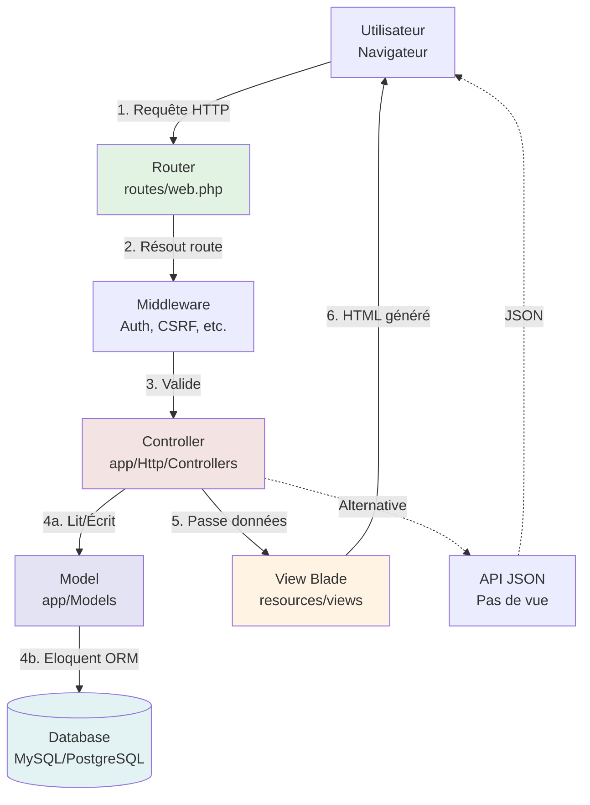
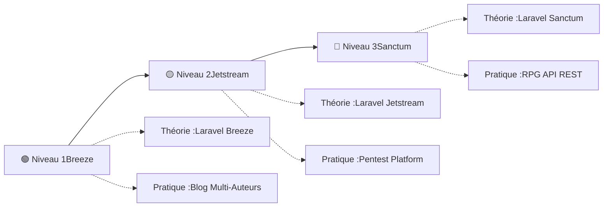

# Laravel

## Introduction

<div
  class="omny-meta"
  data-level="🟢 Débutant & 🟡 Intermédiaire & 🔴 Avancé"
  data-version="1.0"
  data-time="180-240 minutes">
</div>

!!! quote "Analogie pédagogique"
    _Imaginez que vous construisez une **ville moderne**. PHP brut est comme construire chaque bâtiment à la main (routes manuelles, connexions BDD répétitives, sécurité à coder soi-même) - long, répétitif, et risqué. **Laravel est comme avoir une équipe d'architectes et d'ingénieurs** : les fondations sont déjà posées (routing élégant, ORM Eloquent, authentification intégrée), les normes de sécurité respectées (CSRF, XSS, SQL injection prévenus), et les outils professionnels fournis (migrations BDD, queues, cache, broadcasting). Vous vous concentrez sur **construire votre application**, pas réinventer les fondamentaux._

> **Laravel** est un framework PHP créé en 2011 par **Taylor Otwell** avec un objectif ambitieux : rendre le développement PHP **élégant, expressif et agréable**. Inspiré par Ruby on Rails et Symfony, Laravel fournit une **boîte à outils complète** pour créer des applications web modernes : routing intuitif, ORM Eloquent puissant, système de templates Blade, authentification intégrée, queues, cache, broadcasting temps réel, et bien plus. Tout en conservant la simplicité syntaxique qui fait la beauté du code.

Laravel est devenu le **framework PHP le plus populaire au monde** (plus de 75 000 étoiles GitHub). Des startups aux grandes entreprises (BBC, Pfizer, 9GAG, Crowdcube), des millions d'applications utilisent Laravel quotidiennement. Sa philosophie "convention over configuration" combinée à une documentation exceptionnelle et un écosystème riche (Forge, Vapor, Nova, Spark) en font le **standard de l'industrie** pour le développement PHP professionnel.

!!! info "Pourquoi c'est important ?"
    Laravel permet de **développer 10x plus vite** qu'en PHP brut, de **sécuriser automatiquement** les failles courantes (CSRF, SQL injection, XSS), de **maintenir facilement** des bases de code complexes (architecture MVC claire, tests intégrés), d'**éviter les bugs courants** (validation robuste, migrations BDD versionnées), et d'**utiliser les meilleures pratiques** PHP modernes (PSR, Composer, namespaces, type hints).

## Pour repartir des bases (vrais débutants)

Si vous n'avez jamais utilisé de framework PHP, vous découvrirez que Laravel transforme le **chaos du PHP procédural** en **architecture élégante**. Fini les `include('header.php')` dispersés partout, fini les requêtes SQL manuelles vulnérables, fini la gestion manuelle des sessions. Laravel structure votre code selon le pattern **MVC** (Model-View-Controller) : les **Models** gèrent les données (Eloquent ORM), les **Views** affichent l'interface (Blade templates), les **Controllers** orchestrent la logique métier. Tout est **à sa place**, tout est **prévisible**.

!!! tip "Laravel n'est pas WordPress"
    Laravel n'est **pas** un CMS comme WordPress ou Drupal. C'est un **framework PHP générique** pour créer **n'importe quelle application web** : API REST, SaaS, marketplace, backoffice, plateforme e-learning, CRM, ERP, etc. Vous partez d'une **base vierge** et construisez exactement ce dont vous avez besoin, sans limitations, sans plugins douteux, sans legacy code.

## Philosophie Laravel

### Principes fondateurs

!!! quote "**Élégance syntaxique :** Laravel privilégie une syntaxe expressive et lisible qui rend le code PHP **agréable à écrire et facile à comprendre**."

=== "❌ PHP procédural traditionnel"

    ```php
    <?php
    // Connexion BDD manuelle
    $conn = mysqli_connect("localhost", "user", "pass", "db");
    
    // Requête SQL vulnérable
    $id = $_GET['id'];
    $result = mysqli_query($conn, "SELECT * FROM users WHERE id = $id");
    $user = mysqli_fetch_assoc($result);
    
    // Affichage mélangé avec logique
    echo "<h1>" . $user['name'] . "</h1>";
    
    // Gestion erreurs manuelle
    if (!$user) {
        die("User not found");
    }
    ```

    **Problèmes :** SQL injection, pas de séparation logique/affichage, gestion erreurs primitive, code difficile à tester

=== "✅ Laravel moderne"

    ```php
    <?php
    // routes/web.php
    Route::get('/users/{id}', [UserController::class, 'show']);
    
    // app/Http/Controllers/UserController.php
    class UserController extends Controller
    {
        public function show(User $user) // Route Model Binding automatique
        {
            return view('users.show', compact('user'));
        }
    }
    
    // app/Models/User.php
    class User extends Model
    {
        // Eloquent ORM - zéro SQL manuel
    }
    ```

    ```html
    <!-- resources/views/users/show.blade.php (Code Blade) -->
    <h1>{{ $user->name }}</h1>
    <!-- Protection XSS automatique -->
    ```

    **Avantages :** SQL injection impossible (Eloquent), séparation MVC claire, erreurs gérées automatiquement (404 si user inexistant), code testable

**Convention over configuration :**

Laravel suit des **conventions intelligentes** qui éliminent la configuration répétitive.

```php
// Modèle User → Table users automatiquement
class User extends Model
{
    // Laravel devine tout :
    // - Table : 'users' (pluriel du nom de classe)
    // - Primary key : 'id'
    // - Timestamps : created_at, updated_at
    // - Pas de configuration nécessaire !
}

// Migration suit aussi les conventions
Schema::create('users', function (Blueprint $table) {
    $table->id();                    // BIGINT UNSIGNED PRIMARY KEY
    $table->string('email')->unique(); // VARCHAR(255) UNIQUE
    $table->timestamps();            // created_at, updated_at
});
```

**Artisan CLI - Productivité maximale :**

Laravel fournit `artisan`, un **outil en ligne de commande** qui génère automatiquement le code répétitif.

```bash
# Créer modèle + migration + contrôleur + factory + seeder + policy en UNE commande
php artisan make:model Post -mcrfs

# Généré automatiquement :
# app/Models/Post.php                    (Modèle Eloquent)
# database/migrations/xxx_create_posts   (Migration BDD)
# app/Http/Controllers/PostController    (Contrôleur CRUD)
# database/factories/PostFactory         (Factory pour tests)
# database/seeders/PostSeeder            (Seeder données test)
# app/Policies/PostPolicy                (Autorisation)

# Lancer serveur développement
php artisan serve

# Exécuter migrations
php artisan migrate

# Créer des données de test
php artisan db:seed

# Nettoyer cache
php artisan cache:clear
php artisan config:clear
php artisan route:clear
php artisan view:clear
```

### Architecture MVC Laravel



**Cycle de vie requête Laravel :**

1. **Requête HTTP** arrive sur `public/index.php`
2. **Bootstrap** : Chargement framework, service providers
3. **Router** : Résolution de la route (`routes/web.php` ou `routes/api.php`)
4. **Middleware** : Exécution des filtres (auth, CSRF, etc.)
5. **Controller** : Exécution de la méthode du contrôleur
6. **Model** : Interaction avec la BDD via Eloquent (si nécessaire)
7. **View** : Rendu du template Blade (ou JSON pour API)
8. **Response** : Envoi de la réponse HTTP au client

### Comparaison avec autres frameworks

| Critère | Laravel | Symfony | CodeIgniter | CakePHP |
|---------|:-------:|:-------:|:-----------:|:-------:|
| **Courbe apprentissage** | 🟡 Moyenne | 🔴 Élevée | 🟢 Faible | 🟡 Moyenne |
| **Documentation** | ✅ Excellente | ✅ Excellente | ⚠️ Basique | ⚠️ Correcte |
| **Communauté** | ✅ Énorme | ✅ Grande | ⚠️ Petite | ⚠️ Moyenne |
| **ORM** | Eloquent (Active Record) | Doctrine (Data Mapper) | Query Builder | ORM CakePHP |
| **Templates** | Blade | Twig | PHP natif | PHP/CakePHP |
| **Écosystème** | ✅ Riche (Forge, Nova, Spark) | ✅ Composants | ❌ Limité | ⚠️ Moyen |
| **Performance brute** | ⚠️ Moyenne | ✅ Élevée | ✅ Élevée | ⚠️ Moyenne |
| **Fonctionnalités** | ✅ Batteries included | ✅ Composants modulaires | ⚠️ Basique | ✅ Complètes |
| **Modernité** | ✅ Très moderne | ✅ Moderne | ⚠️ Vieillissant | ⚠️ Moyen |

!!! tip "Quand choisir Laravel ?"
    **Utilisez Laravel si :**
    
    - Vous construisez une **application web moderne** (SaaS, API, dashboard)
    - Vous voulez **développer rapidement** sans sacrifier la qualité
    - Vous appréciez les **conventions intelligentes** vs configuration verbose
    - Vous voulez un **écosystème complet** (authentification, queues, cache, broadcasting)
    - Vous recherchez une **communauté active** et des ressources d'apprentissage abondantes

## 🗺️ Parcours d'Apprentissage Laravel : Théorie + Pratique

Laravel s'apprend efficacement en **combinant théorie et pratique**. Ce guide couvre les **fondamentaux théoriques**, mais la maîtrise vient de la **construction de projets complets**.

### 📚 Architecture Documentation

Nous avons structuré l'apprentissage Laravel en **3 niveaux progressifs**, chacun combinant :

1. **📖 Guide théorique** (concepts, syntaxe, bonnes pratiques)
2. **🛠️ Projet pratique complet** (application réelle, 12-28h)


---

### 🟢 Niveau 1 : Fondamentaux Laravel (Breeze)

**Objectif :** Maîtriser les bases Laravel + authentification simple

#### 📖 Théorie (3-5h)

1. **[Guide Laravel Fondamentaux](/dev-cloud/lang/laravel/)** ← Vous êtes ici
2. **[Guide Laravel Breeze](/dev-cloud/lang/laravel/breeze/)**

#### 🛠️ Pratique (12-18h)

**[Projet Blog Multi-Auteurs](/projets/breeze-blog-multi-auteurs/)**

- Authentification complète (register, login, 2FA, reset password)
- CRUD articles avec ownership (Policies)
- Relations Eloquent (User → Post → Category → Comment)
- Validation, Authorization, Form Requests
- Interface Blade + Tailwind CSS
- Déploiement production

**Compétences acquises :**

- [x] MVC Laravel complet
- [x] Authentification Breeze
- [x] CRUD avec ownership
- [x] Relations 1-N, N-N
- [x] Blade templating
- [x] Migrations, Seeders, Factories

---

### 🟡 Niveau 2 : Architecture SaaS (Jetstream)

**Objectif :** Construire applications multi-clients professionnelles

**Prérequis :** Niveau 1 terminé (Breeze maîtrisé)

#### 📖 Théorie (2-3h)

1. **[Guide Laravel Jetstream](/dev-cloud/lang/laravel/jetstream/)**

#### 🛠️ Pratique (20-28h)

**[Projet Pentest Management Platform](/projets/jetstream-pentest-platform/)**

- Teams multi-clients (multi-tenancy, isolation données)
- Authentification 2FA obligatoire (TOTP)
- API tokens pour scanners automatisés
- Frontend Angular 21 + Signals (architecture API-first)
- Génération rapports PDF professionnels
- Dashboard analytics temps réel
- Permissions granulaires (5 rôles)

**Compétences acquises :**

- [x] Architecture SaaS B2B
- [x] Teams Jetstream (multi-tenancy)
- [x] 2FA + sécurité avancée
- [x] API REST Laravel
- [x] Frontend découplé Angular
- [x] Signals state management
- [x] Rôles et permissions

---

### 🔴 Niveau 3 : API REST Moderne (Sanctum)

**Objectif :** Maîtriser architecture API-first + frontend découplé

**Prérequis :** Niveau 2 terminé (Jetstream maîtrisé)

#### 📖 Théorie (2-3h)

1. **[Guide Laravel Sanctum](/dev-cloud/lang/laravel/sanctum/)**

#### 🛠️ Pratique (18-24h)

**[Projet Dungeon Memory Battle RPG](/projets/sanctum-rpg-dungeon/)**

- API REST stateless complète (Sanctum tokens)
- Frontend Angular 21 + Signals (jeu temps réel)
- Jeu mémoire 4×4 + combat RPG tour par tour
- 3 classes jouables (Guerrier, Archer, Mage)
- Système progression (XP, levels, équipement)
- Token abilities (permissions granulaires)
- Leaderboard et achievements

**Compétences acquises :**

- [x] API REST stateless professionnelle
- [x] Authentification token-based (Sanctum)
- [x] Architecture API-first scalable
- [x] State management temps réel (Signals)
- [x] Guards, Interceptors Angular
- [x] Optimisation requêtes API

---

### 🎯 Après les 3 Niveaux : Vous Maîtrisez

✅ **Laravel complet** (Breeze, Jetstream, Sanctum)  
✅ **Architectures modernes** (Monolithe, SaaS, API-first)  
✅ **Frontend Angular 21** (Signals, TypeScript, Material)  
✅ **Déploiement production** (VPS, Docker, CI/CD)  
✅ **Portfolio professionnel** (3 projets production-ready)

---

### 🚀 Quelle Route Choisir ?

| Profil | Recommandation |
|--------|----------------|
| **Débutant Laravel complet** | Commencer **Niveau 1** (Breeze Blog) |
| **Connaît déjà Laravel bases** | Sauter à **Niveau 2** (Jetstream Pentest) |
| **Maîtrise Laravel + Angular** | Tester **Niveau 3** (Sanctum RPG) |
| **Objectif cybersécurité pro** | Focus **Niveau 2** (portfolio métier) |
| **Objectif développement API moderne** | Focus **Niveau 3** (architecture API-first) |

## Installation et configuration

### Prérequis système

**Avant d'installer Laravel, vérifiez les prérequis :**

```bash
# PHP 8.1 minimum (Laravel 10)
php -v
# PHP 8.1.x ou supérieur

# Extensions PHP requises
php -m | grep -E "(pdo|mbstring|openssl|tokenizer|xml|ctype|json|bcmath)"

# Composer (gestionnaire de dépendances PHP)
composer --version
# Composer version 2.x
```

**Installer Composer (si nécessaire) :**

```bash
# Linux/macOS
curl -sS https://getcomposer.org/installer | php
sudo mv composer.phar /usr/local/bin/composer

# Windows : Télécharger https://getcomposer.org/Composer-Setup.exe
```

### Créer un projet Laravel

**Méthode 1 : Via Composer (recommandée)**

```bash
# Créer nouveau projet "blog"
composer create-project laravel/laravel blog

# Naviguer dans le projet
cd blog

# Démarrer serveur développement
php artisan serve

# Ouvrir http://localhost:8000
```

**Méthode 2 : Via Laravel Installer**

```bash
# Installer Laravel Installer globalement
composer global require laravel/installer

# Créer projet
laravel new blog

cd blog
php artisan serve
```

### Structure de dossiers

```
blog/
├── app/                        # Code application
│   ├── Console/               # Commandes Artisan personnalisées
│   ├── Exceptions/            # Gestionnaire exceptions
│   ├── Http/
│   │   ├── Controllers/      # ⭐ Contrôleurs MVC
│   │   ├── Middleware/       # Middleware HTTP
│   │   └── Requests/         # Form Requests (validation)
│   ├── Models/                # ⭐ Modèles Eloquent
│   └── Providers/             # Service Providers
│
├── bootstrap/                  # Fichiers bootstrap framework
│   └── cache/                 # Cache framework
│
├── config/                     # ⭐ Fichiers configuration
│   ├── app.php               # Configuration app
│   ├── database.php          # Configuration BDD
│   ├── mail.php              # Configuration email
│   └── ...
│
├── database/                   # ⭐ BDD et migrations
│   ├── factories/            # Model Factories (données test)
│   ├── migrations/           # ⭐ Migrations BDD (versioning)
│   └── seeders/              # Seeders (données initiales)
│
├── public/                     # ⭐ Racine web (accessible publiquement)
│   ├── index.php             # Point d'entrée application
│   ├── css/                  # Assets CSS
│   ├── js/                   # Assets JavaScript
│   └── images/               # Images publiques
│
├── resources/                  # Ressources non compilées
│   ├── views/                # ⭐ Templates Blade
│   ├── css/                  # CSS source (avant compilation)
│   └── js/                   # JS source (avant compilation)
│
├── routes/                     # ⭐ Définition des routes
│   ├── web.php               # ⭐ Routes web (sessions, CSRF)
│   ├── api.php               # Routes API (stateless)
│   ├── console.php           # Commandes Artisan personnalisées
│   └── channels.php          # Broadcasting channels
│
├── storage/                    # Fichiers générés
│   ├── app/                  # Fichiers applicatifs
│   ├── framework/            # Cache framework, sessions
│   └── logs/                 # ⭐ Logs application
│
├── tests/                      # Tests automatisés
│   ├── Feature/              # Tests fonctionnels
│   └── Unit/                 # Tests unitaires
│
├── vendor/                     # Dépendances Composer (ne pas modifier)
│
├── .env                        # ⭐ Configuration environnement (SECRET)
├── .env.example                # Template .env
├── artisan                     # ⭐ CLI Artisan
├── composer.json               # Dépendances PHP
├── package.json                # Dépendances NPM
└── phpunit.xml                 # Configuration tests
```

### Configuration de base

**Fichier :** `.env` (⚠️ **NE JAMAIS COMMITER** dans Git)

```bash
# Environnement : local, production, staging
APP_ENV=local

# Debug mode (DÉSACTIVER en production)
APP_DEBUG=true

# URL application
APP_URL=http://localhost

# Clé de chiffrement (générer avec php artisan key:generate)
APP_KEY=base64:VOTRE_CLE_GENEREE_ICI

# Base de données
DB_CONNECTION=mysql
DB_HOST=127.0.0.1
DB_PORT=3306
DB_DATABASE=blog
DB_USERNAME=root
DB_PASSWORD=

# Cache (file, redis, memcached)
CACHE_DRIVER=file

# Sessions (file, cookie, database, redis)
SESSION_DRIVER=file

# Queue (sync, database, redis, sqs)
QUEUE_CONNECTION=sync

# Mail
MAIL_MAILER=smtp
MAIL_HOST=smtp.mailtrap.io
MAIL_PORT=2525
MAIL_USERNAME=null
MAIL_PASSWORD=null
```

**Générer clé application :**

```bash
# Générer APP_KEY (obligatoire pour chiffrement sessions/cookies)
php artisan key:generate

# Résultat dans .env :
# APP_KEY=base64:xxxxxxxxxxxxxxxxxxxxxxxxxxxxxxxxxxxxx
```

**Créer base de données :**

```bash
# MySQL
mysql -u root -p
CREATE DATABASE blog CHARACTER SET utf8mb4 COLLATE utf8mb4_unicode_ci;
EXIT;

# SQLite (développement simple)
touch database/database.sqlite

# Modifier .env
# DB_CONNECTION=sqlite
# DB_DATABASE=/chemin/absolu/vers/database/database.sqlite
```

## Routing - Fondamentaux

### Routes basiques

**Fichier :** `routes/web.php`

```php
<?php

use Illuminate\Support\Facades\Route;

// Route GET simple
Route::get('/', function () {
    return view('welcome');
});

// Route POST
Route::post('/contact', function () {
    // Traiter formulaire contact
    return 'Formulaire envoyé !';
});

// Route PUT (mise à jour)
Route::put('/posts/{id}', function ($id) {
    // Mettre à jour post
    return "Mise à jour du post $id";
});

// Route DELETE
Route::delete('/posts/{id}', function ($id) {
    // Supprimer post
    return "Suppression du post $id";
});

// Route répondant à plusieurs verbes HTTP
Route::match(['get', 'post'], '/form', function () {
    return 'GET ou POST';
});

// Route répondant à TOUS les verbes
Route::any('/wildcard', function () {
    return 'N\'importe quel verbe HTTP';
});
```

### Paramètres de route

```php
<?php

// Paramètre obligatoire
Route::get('/posts/{id}', function ($id) {
    return "Afficher post $id";
});

// Paramètre optionnel (avec valeur par défaut)
Route::get('/posts/{id?}', function ($id = 1) {
    return "Afficher post $id";
});

// Multiples paramètres
Route::get('/posts/{postId}/comments/{commentId}', function ($postId, $commentId) {
    return "Post $postId, Commentaire $commentId";
});

// Contraintes regex sur paramètres
Route::get('/users/{id}', function ($id) {
    return "User $id";
})->where('id', '[0-9]+'); // ID doit être numérique

Route::get('/users/{name}', function ($name) {
    return "User $name";
})->where('name', '[A-Za-z]+'); // Nom doit être alphabétique

// Contraintes multiples
Route::get('/posts/{id}/{slug}', function ($id, $slug) {
    return "Post $id : $slug";
})->where(['id' => '[0-9]+', 'slug' => '[a-z-]+']);
```

### Routes nommées

**Les routes nommées permettent de générer URLs/redirections sans coder en dur les URLs.**

```php
<?php

// Définir route nommée
Route::get('/posts/{id}', [PostController::class, 'show'])->name('posts.show');

// Générer URL depuis le nom
$url = route('posts.show', ['id' => 1]);
// Résultat : http://localhost/posts/1

// Redirection vers route nommée
return redirect()->route('posts.show', ['id' => 1]);
```

```html
<!-- Code Blade : Lien vers route nommée -->
<a href="{{ route('posts.show', ['id' => $post->id]) }}">
    Voir le post
</a>
```

### Groupes de routes

**Grouper routes avec préfixe, middleware, namespace commun.**

```php
<?php

// Groupe avec préfixe URL
Route::prefix('admin')->group(function () {
    Route::get('/dashboard', function () {
        // URL : /admin/dashboard
    });
    
    Route::get('/users', function () {
        // URL : /admin/users
    });
});

// Groupe avec middleware
Route::middleware(['auth'])->group(function () {
    Route::get('/dashboard', [DashboardController::class, 'index']);
    Route::get('/profile', [ProfileController::class, 'show']);
});

// Groupe avec préfixe de nom
Route::name('admin.')->group(function () {
    Route::get('/dashboard', function () {
        // Nom : admin.dashboard
    })->name('dashboard');
    
    Route::get('/users', function () {
        // Nom : admin.users
    })->name('users');
});

// Combinaison : préfixe + middleware + nom
Route::prefix('admin')
    ->middleware(['auth', 'admin'])
    ->name('admin.')
    ->group(function () {
        Route::get('/dashboard', [AdminController::class, 'dashboard'])->name('dashboard');
        Route::get('/users', [AdminController::class, 'users'])->name('users');
    });
```

### Routes vers contrôleurs

```php
<?php

use App\Http\Controllers\PostController;

// Méthode unique
Route::get('/posts', [PostController::class, 'index']);
Route::get('/posts/{id}', [PostController::class, 'show']);
Route::post('/posts', [PostController::class, 'store']);

// Route Resource (génère automatiquement 7 routes CRUD)
Route::resource('posts', PostController::class);

// Routes générées automatiquement :
// GET    /posts              → index()   (liste)
// GET    /posts/create       → create()  (formulaire création)
// POST   /posts              → store()   (sauvegarder)
// GET    /posts/{id}         → show()    (afficher)
// GET    /posts/{id}/edit    → edit()    (formulaire édition)
// PUT    /posts/{id}         → update()  (mettre à jour)
// DELETE /posts/{id}         → destroy() (supprimer)

// Route Resource partielle (seulement certaines méthodes)
Route::resource('posts', PostController::class)->only(['index', 'show']);
Route::resource('posts', PostController::class)->except(['create', 'edit']);

// Route API Resource (sans create/edit car pas de formulaires en API)
Route::apiResource('posts', PostController::class);
// Génère : index, store, show, update, destroy
```

## Controllers - Organisation de la logique

### Créer un contrôleur

```bash
# Créer contrôleur basique
php artisan make:controller PostController

# Créer contrôleur avec méthodes CRUD (Resource Controller)
php artisan make:controller PostController --resource

# Créer contrôleur + Model
php artisan make:controller PostController --model=Post

# Créer contrôleur API (sans create/edit)
php artisan make:controller PostController --api
```

### Contrôleur basique

**Fichier :** `app/Http/Controllers/PostController.php`

```php
<?php

namespace App\Http\Controllers;

use Illuminate\Http\Request;
use App\Models\Post;

class PostController extends Controller
{
    /**
     * Afficher liste des posts
     */
    public function index()
    {
        // Récupérer tous les posts
        $posts = Post::all();
        
        // Retourner vue avec données
        return view('posts.index', compact('posts'));
        
        // Alternative syntaxe :
        // return view('posts.index', ['posts' => $posts]);
    }
    
    /**
     * Afficher formulaire création
     */
    public function create()
    {
        return view('posts.create');
    }
    
    /**
     * Sauvegarder nouveau post
     */
    public function store(Request $request)
    {
        // Validation
        $validated = $request->validate([
            'title' => 'required|max:255',
            'content' => 'required',
        ]);
        
        // Créer post
        $post = Post::create($validated);
        
        // Redirection avec message
        return redirect()->route('posts.show', $post)
                         ->with('success', 'Post créé avec succès !');
    }
    
    /**
     * Afficher un post
     */
    public function show(Post $post) // Route Model Binding
    {
        return view('posts.show', compact('post'));
    }
    
    /**
     * Afficher formulaire édition
     */
    public function edit(Post $post)
    {
        return view('posts.edit', compact('post'));
    }
    
    /**
     * Mettre à jour post
     */
    public function update(Request $request, Post $post)
    {
        // Validation
        $validated = $request->validate([
            'title' => 'required|max:255',
            'content' => 'required',
        ]);
        
        // Mettre à jour
        $post->update($validated);
        
        return redirect()->route('posts.show', $post)
                         ->with('success', 'Post modifié avec succès !');
    }
    
    /**
     * Supprimer post
     */
    public function destroy(Post $post)
    {
        $post->delete();
        
        return redirect()->route('posts.index')
                         ->with('success', 'Post supprimé avec succès !');
    }
}
```

### Route Model Binding

**Laravel résout automatiquement les modèles depuis les paramètres de route.**

```php
<?php

// Route
Route::get('/posts/{post}', [PostController::class, 'show']);

// Contrôleur - AVANT (manuel)
public function show($id)
{
    $post = Post::findOrFail($id); // Si inexistant → 404
    return view('posts.show', compact('post'));
}

// Contrôleur - APRÈS (Route Model Binding automatique)
public function show(Post $post) // Laravel résout automatiquement !
{
    // $post est déjà chargé depuis la BDD
    // Si inexistant → 404 automatique
    return view('posts.show', compact('post'));
}
```

**Personnaliser la clé de résolution :**

```php
<?php

// Par défaut : recherche par 'id'
// Utiliser 'slug' à la place :

// Dans le modèle
class Post extends Model
{
    public function getRouteKeyName()
    {
        return 'slug'; // Chercher par slug au lieu de id
    }
}

// Route : /posts/mon-super-article
// Laravel cherche : Post::where('slug', 'mon-super-article')->firstOrFail()
```

### Middleware dans contrôleurs

```php
<?php

namespace App\Http\Controllers;

class PostController extends Controller
{
    /**
     * Appliquer middleware dans le constructeur
     */
    public function __construct()
    {
        // Middleware auth sur toutes les méthodes
        $this->middleware('auth');
        
        // Middleware seulement sur certaines méthodes
        $this->middleware('auth')->only(['create', 'store', 'edit', 'update', 'destroy']);
        
        // Middleware sauf certaines méthodes
        $this->middleware('auth')->except(['index', 'show']);
    }
    
    public function index()
    {
        // Accessible à tous (except)
    }
    
    public function create()
    {
        // Nécessite authentification (only)
    }
}
```

## Models et Eloquent ORM

### Créer un modèle

```bash
# Créer modèle simple
php artisan make:model Post

# Créer modèle + migration
php artisan make:model Post -m

# Créer modèle + migration + controller + factory + seeder
php artisan make:model Post -mcfs

# OU syntaxe complète
php artisan make:model Post --migration --controller --factory --seeder
```

### Modèle basique

**Fichier :** `app/Models/Post.php`

```php
<?php

namespace App\Models;

use Illuminate\Database\Eloquent\Model;
use Illuminate\Database\Eloquent\Factories\HasFactory;

class Post extends Model
{
    use HasFactory;
    
    /**
     * Table associée (optionnel, Laravel devine 'posts')
     */
    protected $table = 'posts';
    
    /**
     * Primary key (optionnel, défaut 'id')
     */
    protected $primaryKey = 'id';
    
    /**
     * Primary key auto-incrémentée ? (défaut true)
     */
    public $incrementing = true;
    
    /**
     * Type de primary key (défaut 'int')
     */
    protected $keyType = 'int';
    
    /**
     * Timestamps automatiques ? (défaut true)
     * Gère created_at et updated_at automatiquement
     */
    public $timestamps = true;
    
    /**
     * Attributs assignables en masse (Mass Assignment)
     * Protection contre injection de champs non voulus
     */
    protected $fillable = [
        'title',
        'content',
        'user_id',
    ];
    
    /**
     * Alternative : attributs NON assignables
     */
    // protected $guarded = ['id'];
    
    /**
     * Casts de types (conversion automatique)
     */
    protected $casts = [
        'published_at' => 'datetime',
        'is_published' => 'boolean',
        'views_count' => 'integer',
        'metadata' => 'array', // JSON → Array automatiquement
    ];
    
    /**
     * Valeurs par défaut
     */
    protected $attributes = [
        'is_published' => false,
        'views_count' => 0,
    ];
}
```

### CRUD avec Eloquent

```php
<?php

// CREATE - Créer nouveau post

// Méthode 1 : Instancier puis sauvegarder
$post = new Post();
$post->title = 'Mon titre';
$post->content = 'Mon contenu';
$post->save();

// Méthode 2 : Create (Mass Assignment - nécessite $fillable)
$post = Post::create([
    'title' => 'Mon titre',
    'content' => 'Mon contenu',
]);

// READ - Lire posts

// Tous les posts
$posts = Post::all();

// Premier post
$post = Post::first();

// Trouver par ID
$post = Post::find(1);
$post = Post::findOrFail(1); // 404 si inexistant

// Trouver par attribut
$post = Post::where('title', 'Mon titre')->first();

// Plusieurs conditions
$posts = Post::where('is_published', true)
            ->where('views_count', '>', 100)
            ->orderBy('created_at', 'desc')
            ->get();

// UPDATE - Mettre à jour

// Méthode 1 : Trouver puis modifier
$post = Post::find(1);
$post->title = 'Nouveau titre';
$post->save();

// Méthode 2 : Update (Mass Assignment)
$post = Post::find(1);
$post->update([
    'title' => 'Nouveau titre',
    'content' => 'Nouveau contenu',
]);

// Méthode 3 : Update direct (sans charger modèle)
Post::where('id', 1)->update(['title' => 'Nouveau titre']);

// DELETE - Supprimer

// Méthode 1 : Trouver puis supprimer
$post = Post::find(1);
$post->delete();

// Méthode 2 : Supprimer par ID
Post::destroy(1);
Post::destroy([1, 2, 3]); // Plusieurs IDs

// Méthode 3 : Supprimer par condition
Post::where('views_count', '<', 10)->delete();
```

### Relations Eloquent

**One-to-Many (Un utilisateur a plusieurs posts) :**

```php
<?php

// app/Models/User.php
class User extends Model
{
    /**
     * Un utilisateur a plusieurs posts
     */
    public function posts()
    {
        return $this->hasMany(Post::class);
    }
}

// app/Models/Post.php
class Post extends Model
{
    /**
     * Un post appartient à un utilisateur
     */
    public function user()
    {
        return $this->belongsTo(User::class);
    }
}

// Utilisation
$user = User::find(1);
$posts = $user->posts; // Récupérer tous les posts de l'utilisateur

$post = Post::find(1);
$author = $post->user; // Récupérer l'auteur du post
```

**Many-to-Many (Post ↔ Tags) :**

```php
<?php

// app/Models/Post.php
class Post extends Model
{
    /**
     * Un post a plusieurs tags
     */
    public function tags()
    {
        return $this->belongsToMany(Tag::class);
        // Table pivot par défaut : post_tag (alphabétique)
    }
}

// app/Models/Tag.php
class Tag extends Model
{
    /**
     * Un tag appartient à plusieurs posts
     */
    public function posts()
    {
        return $this->belongsToMany(Post::class);
    }
}

// Utilisation
$post = Post::find(1);
$tags = $post->tags; // Collection de tags

// Attacher tag à post
$post->tags()->attach($tagId);
$post->tags()->attach([1, 2, 3]); // Plusieurs tags

// Détacher
$post->tags()->detach($tagId);
$post->tags()->detach(); // Détacher tous

// Synchroniser (remplace tous les tags)
$post->tags()->sync([1, 2, 3]);
```

**Has-Many-Through (Pays → Utilisateurs → Posts) :**

```php
<?php

// app/Models/Country.php
class Country extends Model
{
    /**
     * Un pays a plusieurs utilisateurs
     */
    public function users()
    {
        return $this->hasMany(User::class);
    }
    
    /**
     * Un pays a plusieurs posts (à travers utilisateurs)
     */
    public function posts()
    {
        return $this->hasManyThrough(Post::class, User::class);
    }
}

// Utilisation
$country = Country::find(1);
$posts = $country->posts; // Tous les posts des utilisateurs de ce pays
```

### Eager Loading (éviter N+1 queries)

```php
<?php

// ❌ MAUVAIS : N+1 queries problem
$posts = Post::all(); // 1 query
foreach ($posts as $post) {
    echo $post->user->name; // +1 query par post (si 100 posts = 101 queries !)
}

// ✅ BON : Eager Loading (2 queries seulement)
$posts = Post::with('user')->get(); // 2 queries : posts + users
foreach ($posts as $post) {
    echo $post->user->name; // Aucune query additionnelle
}

// Eager Loading avec relations imbriquées
$posts = Post::with(['user', 'tags', 'comments.user'])->get();

// Eager Loading conditionnel
$posts = Post::with(['comments' => function ($query) {
    $query->where('approved', true);
}])->get();
```

### Scopes (requêtes réutilisables)

```php
<?php

// app/Models/Post.php
class Post extends Model
{
    /**
     * Scope : posts publiés
     */
    public function scopePublished($query)
    {
        return $query->where('is_published', true);
    }
    
    /**
     * Scope : posts populaires
     */
    public function scopePopular($query)
    {
        return $query->where('views_count', '>', 1000);
    }
    
    /**
     * Scope avec paramètre
     */
    public function scopeOfType($query, $type)
    {
        return $query->where('type', $type);
    }
}

// Utilisation
$posts = Post::published()->get();
$posts = Post::published()->popular()->get();
$posts = Post::ofType('tutorial')->published()->get();
```

## Migrations - Versioning de base de données

### Créer migration

```bash
# Créer migration pour nouvelle table
php artisan make:migration create_posts_table

# Créer migration pour modifier table existante
php artisan make:migration add_slug_to_posts_table

# Généré dans database/migrations/YYYY_MM_DD_HHMMSS_nom.php
```

### Migration de création de table

**Fichier :** `database/migrations/2024_01_01_000000_create_posts_table.php`

```php
<?php

use Illuminate\Database\Migrations\Migration;
use Illuminate\Database\Schema\Blueprint;
use Illuminate\Support\Facades\Schema;

return new class extends Migration
{
    /**
     * Exécuter migration (créer table)
     */
    public function up(): void
    {
        Schema::create('posts', function (Blueprint $table) {
            // Primary key auto-incrémentée
            $table->id(); // BIGINT UNSIGNED, PRIMARY KEY, AUTO_INCREMENT
            
            // Colonnes de base
            $table->string('title'); // VARCHAR(255)
            $table->string('slug')->unique(); // VARCHAR(255) UNIQUE
            $table->text('content'); // TEXT
            $table->text('excerpt')->nullable(); // TEXT NULL
            
            // Foreign key (utilisateur)
            $table->foreignId('user_id')
                  ->constrained() // FK vers users.id
                  ->onDelete('cascade'); // Supprimer posts si user supprimé
            
            // Types de colonnes variés
            $table->boolean('is_published')->default(false);
            $table->integer('views_count')->default(0);
            $table->decimal('rating', 3, 2)->nullable(); // 3 chiffres, 2 décimales
            $table->date('published_at')->nullable();
            $table->json('metadata')->nullable(); // JSON
            
            // Timestamps automatiques (created_at, updated_at)
            $table->timestamps();
            
            // Soft deletes (deleted_at pour suppression logique)
            $table->softDeletes();
            
            // Index
            $table->index('slug'); // INDEX sur slug
            $table->index(['user_id', 'is_published']); // INDEX composé
        });
    }
    
    /**
     * Annuler migration (supprimer table)
     */
    public function down(): void
    {
        Schema::dropIfExists('posts');
    }
};
```

### Types de colonnes disponibles

```php
<?php

// Entiers
$table->id();                    // BIGINT UNSIGNED AUTO_INCREMENT PRIMARY KEY
$table->bigInteger('votes');     // BIGINT
$table->integer('votes');        // INTEGER
$table->smallInteger('votes');   // SMALLINT
$table->tinyInteger('votes');    // TINYINT
$table->unsignedBigInteger('votes'); // BIGINT UNSIGNED

// Décimaux
$table->decimal('amount', 8, 2); // DECIMAL(8,2)
$table->double('amount', 8, 2);  // DOUBLE(8,2)
$table->float('amount', 8, 2);   // FLOAT(8,2)

// Chaînes
$table->string('name', 100);     // VARCHAR(100)
$table->text('description');     // TEXT
$table->mediumText('description');// MEDIUMTEXT
$table->longText('description'); // LONGTEXT
$table->char('code', 4);         // CHAR(4)

// Dates et heures
$table->date('created_at');      // DATE
$table->datetime('created_at');  // DATETIME
$table->timestamp('added_at');   // TIMESTAMP
$table->time('sunrise');         // TIME
$table->year('birth_year');      // YEAR

// Autres
$table->boolean('confirmed');    // BOOLEAN (TINYINT(1))
$table->json('options');         // JSON
$table->uuid('id');              // UUID
$table->enum('status', ['pending', 'active']); // ENUM
$table->binary('data');          // BLOB

// Modificateurs
$table->string('email')->nullable();        // NULL autorisé
$table->string('name')->default('Guest');   // Valeur par défaut
$table->integer('votes')->unsigned();       // UNSIGNED
$table->string('email')->unique();          // UNIQUE
$table->integer('user_id')->index();        // INDEX
$table->text('bio')->comment('User bio');   // Commentaire SQL
```

### Migration de modification

```php
<?php

use Illuminate\Database\Migrations\Migration;
use Illuminate\Database\Schema\Blueprint;
use Illuminate\Support\Facades\Schema;

return new class extends Migration
{
    public function up(): void
    {
        Schema::table('posts', function (Blueprint $table) {
            // Ajouter colonne
            $table->string('slug')->after('title');
            
            // Modifier colonne (nécessite doctrine/dbal)
            $table->string('title', 500)->change();
            
            // Renommer colonne
            $table->renameColumn('old_name', 'new_name');
            
            // Supprimer colonne
            $table->dropColumn('slug');
            $table->dropColumn(['slug', 'excerpt']); // Plusieurs
            
            // Ajouter index
            $table->index('slug');
            $table->unique('email');
            
            // Supprimer index
            $table->dropIndex('posts_slug_index');
            $table->dropUnique('posts_email_unique');
        });
    }
    
    public function down(): void
    {
        Schema::table('posts', function (Blueprint $table) {
            // Annuler modifications
        });
    }
};
```

### Exécuter migrations

```bash
# Exécuter toutes les migrations en attente
php artisan migrate

# Annuler dernière migration
php artisan migrate:rollback

# Annuler toutes les migrations
php artisan migrate:reset

# Annuler et re-exécuter toutes les migrations
php artisan migrate:refresh

# Refresh + seeders
php artisan migrate:refresh --seed

# Supprimer toutes les tables puis re-migrer
php artisan migrate:fresh

# Voir statut migrations
php artisan migrate:status
```

## Blade - Moteur de templates

### Syntaxe de base

```html
<!-- Code Blade : resources/views/posts/index.blade.php -->

<!-- Afficher variable (échappée automatiquement contre XSS) -->
<h1>{{ $title }}</h1>
<p>Auteur : {{ $post->user->name }}</p>

<!-- Afficher HTML non échappé (DANGEREUX) -->
<div>{!! $htmlContent !!}</div>

<!-- Afficher valeur avec défaut si null -->
{{ $name ?? 'Invité' }}
{{ $post->excerpt or 'Pas d\'extrait' }}

<!-- Commentaires Blade (non affichés dans HTML) -->
{{-- Ceci est un commentaire Blade --}}

<!-- Afficher variable JavaScript (échappée pour JS) -->
<script>
    var app = @json($array);
</script>

<!-- Éviter double échappement avec frameworks JS -->
<div>
    @{{ variable }} <!-- Rendu : {{ variable }} (non traité par Blade) -->
</div>
```

### Structures de contrôle

```html
<!-- Code Blade : Conditions -->

@if ($user->isAdmin())
    <p>Bienvenue Admin</p>
@elseif ($user->isModerator())
    <p>Bienvenue Modérateur</p>
@else
    <p>Bienvenue Utilisateur</p>
@endif

<!-- Unless (inverse de if) -->
@unless ($user->isSubscribed())
    <p>Veuillez vous abonner</p>
@endunless

<!-- Isset et empty -->
@isset($post)
    <p>{{ $post->title }}</p>
@endisset

@empty($posts)
    <p>Aucun post</p>
@endempty

<!-- Auth -->
@auth
    <p>Connecté</p>
@endauth

@guest
    <p>Non connecté</p>
@endguest

<!-- Boucles -->
@foreach ($posts as $post)
    <div>
        <h2>{{ $post->title }}</h2>
        <p>{{ $post->content }}</p>
    </div>
@endforeach

<!-- Forelse (foreach avec fallback) -->
@forelse ($posts as $post)
    <div>{{ $post->title }}</div>
@empty
    <p>Aucun post</p>
@endforelse

<!-- For -->
@for ($i = 0; $i < 10; $i++)
    <p>Itération {{ $i }}</p>
@endfor

<!-- While -->
@while (true)
    <p>Boucle infinie (attention !)</p>
@endwhile

<!-- Continue et break -->
@foreach ($posts as $post)
    @if ($post->is_draft)
        @continue
    @endif
    
    <div>{{ $post->title }}</div>
    
    @if ($loop->index >= 10)
        @break
    @endif
@endforeach
```

### Variable $loop dans les boucles

```html
<!-- Code Blade : $loop disponible dans foreach/forelse -->

@foreach ($posts as $post)
    <div>
        <!-- Index (commence à 0) -->
        Index : {{ $loop->index }}
        
        <!-- Iteration (commence à 1) -->
        Itération : {{ $loop->iteration }}
        
        <!-- Restant -->
        Restant : {{ $loop->remaining }}
        
        <!-- Total -->
        Total : {{ $loop->count }}
        
        <!-- Premier ? -->
        @if ($loop->first)
            <p>Premier élément</p>
        @endif
        
        <!-- Dernier ? -->
        @if ($loop->last)
            <p>Dernier élément</p>
        @endif
        
        <!-- Pair/Impair -->
        <div class="{{ $loop->even ? 'bg-gray' : 'bg-white' }}">
            {{ $post->title }}
        </div>
        
        <!-- Profondeur imbrication -->
        Niveau : {{ $loop->depth }}
        
        <!-- Parent loop (si boucle imbriquée) -->
        @foreach ($post->comments as $comment)
            Iteration parent : {{ $loop->parent->iteration }}
        @endforeach
    </div>
@endforeach
```

### Layouts et sections

**Layout principal :** `resources/views/layouts/app.blade.php`

```html
<!-- Code Blade : Layout principal -->
<!DOCTYPE html>
<html lang="fr">
<head>
    <meta charset="UTF-8">
    <meta name="viewport" content="width=device-width, initial-scale=1.0">
    <title>@yield('title', 'Mon Blog')</title>
    
    <!-- CSS -->
    <link rel="stylesheet" href="{{ asset('css/app.css') }}">
    
    @stack('styles') <!-- Stack pour styles additionnels -->
</head>
<body>
    <header>
        <nav>
            <a href="{{ route('home') }}">Accueil</a>
            <a href="{{ route('posts.index') }}">Blog</a>
        </nav>
    </header>
    
    <main>
        @yield('content') <!-- Contenu principal -->
    </main>
    
    <footer>
        <p>&copy; {{ date('Y') }} Mon Blog</p>
    </footer>
    
    <!-- JavaScript -->
    <script src="{{ asset('js/app.js') }}"></script>
    @stack('scripts') <!-- Stack pour scripts additionnels -->
</body>
</html>
```

**Vue enfant :** `resources/views/posts/show.blade.php`

```html
<!-- Code Blade : Vue héritant du layout -->
@extends('layouts.app')

@section('title', $post->title . ' - Mon Blog')

@push('styles')
    <link rel="stylesheet" href="{{ asset('css/post.css') }}">
@endpush

@section('content')
    <article>
        <h1>{{ $post->title }}</h1>
        
        <div class="meta">
            Par {{ $post->user->name }} le {{ $post->created_at->format('d/m/Y') }}
        </div>
        
        <div class="content">
            {!! $post->content !!}
        </div>
        
        <div class="tags">
            @foreach ($post->tags as $tag)
                <span class="tag">{{ $tag->name }}</span>
            @endforeach
        </div>
    </article>
    
    <!-- Inclure composant commentaires -->
    @include('partials.comments', ['comments' => $post->comments])
@endsection

@push('scripts')
    <script src="{{ asset('js/post.js') }}"></script>
@endpush
```

### Composants Blade

**Créer composant :**

```bash
# Créer composant alert
php artisan make:component Alert

# Génère :
# app/View/Components/Alert.php
# resources/views/components/alert.blade.php
```

**Classe composant :** `app/View/Components/Alert.php`

```php
<?php

namespace App\View\Components;

use Illuminate\View\Component;

class Alert extends Component
{
    public $type;
    public $message;
    
    public function __construct($type = 'info', $message = '')
    {
        $this->type = $type;
        $this->message = $message;
    }
    
    public function render()
    {
        return view('components.alert');
    }
}
```

**Vue composant :** `resources/views/components/alert.blade.php`

```html
<!-- Code Blade : Composant Alert -->
<div class="alert alert-{{ $type }}">
    @if ($message)
        <p>{{ $message }}</p>
    @else
        {{ $slot }}
    @endif
</div>
```

**Utilisation :**

```html
<!-- Code Blade : Utiliser composant -->

<!-- Avec attributs -->
<x-alert type="success" message="Opération réussie !" />

<!-- Avec slot -->
<x-alert type="danger">
    <strong>Erreur !</strong>
    Quelque chose s'est mal passé.
</x-alert>

<!-- Avec slots nommés -->
<x-card>
    <x-slot name="header">
        Titre de la carte
    </x-slot>
    
    Contenu de la carte
    
    <x-slot name="footer">
        Pied de page
    </x-slot>
</x-card>
```

## Validation des données

### Validation dans contrôleur

```php
<?php

namespace App\Http\Controllers;

use Illuminate\Http\Request;
use App\Models\Post;

class PostController extends Controller
{
    public function store(Request $request)
    {
        // Validation simple
        $validated = $request->validate([
            'title' => 'required|max:255',
            'content' => 'required',
            'excerpt' => 'nullable|max:500',
            'published_at' => 'nullable|date',
        ]);
        
        // Si validation échoue → redirect automatique avec erreurs
        // Si validation réussie → $validated contient données validées
        
        Post::create($validated);
        
        return redirect()->route('posts.index')
                         ->with('success', 'Post créé !');
    }
    
    public function update(Request $request, Post $post)
    {
        // Validation avec messages personnalisés
        $validated = $request->validate([
            'title' => 'required|max:255',
            'content' => 'required',
        ], [
            'title.required' => 'Le titre est obligatoire.',
            'title.max' => 'Le titre ne peut pas dépasser 255 caractères.',
            'content.required' => 'Le contenu est obligatoire.',
        ]);
        
        $post->update($validated);
        
        return redirect()->route('posts.show', $post);
    }
}
```

### Règles de validation courantes

```php
<?php

$request->validate([
    // Requis
    'title' => 'required',
    
    // Optionnel (nullable)
    'description' => 'nullable|max:500',
    
    // Chaînes
    'name' => 'string|max:255',
    'slug' => 'string|max:255|unique:posts,slug', // Unique dans table posts colonne slug
    
    // Numérique
    'age' => 'integer|min:18|max:100',
    'price' => 'numeric|min:0',
    'rating' => 'integer|between:1,5',
    
    // Email
    'email' => 'required|email|unique:users,email',
    
    // URL
    'website' => 'url',
    
    // Date
    'birth_date' => 'date',
    'published_at' => 'date|after:today',
    'event_date' => 'date|after:start_date|before:end_date',
    
    // Boolean
    'is_published' => 'boolean',
    
    // Fichiers
    'avatar' => 'image|mimes:jpeg,png,jpg|max:2048', // 2MB max
    'document' => 'file|mimes:pdf,doc,docx|max:10240', // 10MB max
    
    // Arrays
    'tags' => 'array',
    'tags.*' => 'string|max:50', // Chaque élément du tableau
    
    // Confirmation (password_confirmation doit exister et être identique)
    'password' => 'required|min:8|confirmed',
    
    // Regex
    'phone' => 'regex:/^[0-9]{10}$/',
    
    // Enum
    'status' => 'in:draft,published,archived',
    
    // Exists (doit exister dans une table)
    'user_id' => 'exists:users,id',
    
    // Unique sauf soi-même (pour updates)
    'email' => 'unique:users,email,' . $user->id,
]);
```

### Form Request (validation avancée)

**Créer Form Request :**

```bash
php artisan make:request StorePostRequest
```

**Fichier :** `app/Http/Requests/StorePostRequest.php`

```php
<?php

namespace App\Http\Requests;

use Illuminate\Foundation\Http\FormRequest;

class StorePostRequest extends FormRequest
{
    /**
     * Autorisation (si false → 403 Forbidden)
     */
    public function authorize(): bool
    {
        // Vérifier que l'utilisateur peut créer un post
        return auth()->check();
    }
    
    /**
     * Règles de validation
     */
    public function rules(): array
    {
        return [
            'title' => 'required|max:255',
            'content' => 'required',
            'tags' => 'array',
            'tags.*' => 'exists:tags,id',
        ];
    }
    
    /**
     * Messages d'erreur personnalisés
     */
    public function messages(): array
    {
        return [
            'title.required' => 'Le titre est obligatoire.',
            'content.required' => 'Le contenu ne peut pas être vide.',
        ];
    }
    
    /**
     * Noms d'attributs personnalisés (pour messages)
     */
    public function attributes(): array
    {
        return [
            'title' => 'titre du post',
            'content' => 'contenu du post',
        ];
    }
}
```

**Utilisation dans contrôleur :**

```php
<?php

namespace App\Http\Controllers;

use App\Http\Requests\StorePostRequest;
use App\Models\Post;

class PostController extends Controller
{
    public function store(StorePostRequest $request)
    {
        // Validation automatique avant d'arriver ici
        // Si échec → redirect avec erreurs
        // Si succès → méthode exécutée
        
        $validated = $request->validated();
        
        Post::create($validated);
        
        return redirect()->route('posts.index');
    }
}
```

### Afficher erreurs dans Blade

```html
<!-- Code Blade : Afficher erreurs validation -->

<!-- Toutes les erreurs -->
@if ($errors->any())
    <div class="alert alert-danger">
        <ul>
            @foreach ($errors->all() as $error)
                <li>{{ $error }}</li>
            @endforeach
        </ul>
    </div>
@endif

<!-- Erreur spécifique d'un champ -->
@error('title')
    <div class="error">{{ $message }}</div>
@enderror

<!-- Avec classe CSS conditionnelle -->
<input type="text" 
       name="title" 
       class="@error('title') border-red @enderror"
       value="{{ old('title') }}">

<!-- Helper old() conserve valeur après redirect -->
<input type="text" name="email" value="{{ old('email') }}">
<textarea name="content">{{ old('content') }}</textarea>
```

## Notions avancées essentielles

### Service Container et Dependency Injection

**Le Service Container est le cœur de Laravel - il gère l'instanciation et l'injection de dépendances.**

```php
<?php

// Exemple simple : Injection automatique dans contrôleur
namespace App\Http\Controllers;

use App\Services\PaymentService;
use Illuminate\Http\Request;

class PaymentController extends Controller
{
    // Laravel injecte automatiquement PaymentService
    public function __construct(protected PaymentService $paymentService)
    {
    }
    
    public function process(Request $request)
    {
        // Utiliser le service injecté
        $result = $this->paymentService->charge($request->amount);
        
        return response()->json($result);
    }
}
```

**Binding manuel dans Service Provider :**

```php
<?php

// app/Providers/AppServiceProvider.php
namespace App\Providers;

use Illuminate\Support\ServiceProvider;
use App\Services\PaymentService;
use App\Services\StripePaymentService;

class AppServiceProvider extends ServiceProvider
{
    public function register(): void
    {
        // Bind interface → implémentation
        $this->app->bind(PaymentService::class, StripePaymentService::class);
        
        // Singleton (même instance réutilisée)
        $this->app->singleton(PaymentService::class, function ($app) {
            return new StripePaymentService(config('services.stripe.key'));
        });
    }
}
```

### Repository Pattern

**Séparer logique BDD de la logique métier.**

**Interface :** `app/Repositories/PostRepositoryInterface.php`

```php
<?php

namespace App\Repositories;

interface PostRepositoryInterface
{
    public function all();
    public function find($id);
    public function create(array $data);
    public function update($id, array $data);
    public function delete($id);
}
```

**Implémentation :** `app/Repositories/PostRepository.php`

```php
<?php

namespace App\Repositories;

use App\Models\Post;

class PostRepository implements PostRepositoryInterface
{
    public function all()
    {
        return Post::with('user')->latest()->get();
    }
    
    public function find($id)
    {
        return Post::with('user', 'tags')->findOrFail($id);
    }
    
    public function create(array $data)
    {
        return Post::create($data);
    }
    
    public function update($id, array $data)
    {
        $post = $this->find($id);
        $post->update($data);
        return $post;
    }
    
    public function delete($id)
    {
        $post = $this->find($id);
        return $post->delete();
    }
}
```

**Binding :** `app/Providers/RepositoryServiceProvider.php`

```php
<?php

namespace App\Providers;

use Illuminate\Support\ServiceProvider;
use App\Repositories\PostRepositoryInterface;
use App\Repositories\PostRepository;

class RepositoryServiceProvider extends ServiceProvider
{
    public function register(): void
    {
        $this->app->bind(
            PostRepositoryInterface::class,
            PostRepository::class
        );
    }
}
```

**Utilisation dans contrôleur :**

```php
<?php

namespace App\Http\Controllers;

use App\Repositories\PostRepositoryInterface;

class PostController extends Controller
{
    public function __construct(
        protected PostRepositoryInterface $postRepository
    ) {}
    
    public function index()
    {
        $posts = $this->postRepository->all();
        return view('posts.index', compact('posts'));
    }
}
```

### Events et Listeners

**Les Events permettent de découpler la logique applicative.**

**Créer Event et Listener :**

```bash
php artisan make:event PostPublished
php artisan make:listener SendPostNotification --event=PostPublished
```

**Event :** `app/Events/PostPublished.php`

```php
<?php

namespace App\Events;

use App\Models\Post;
use Illuminate\Foundation\Events\Dispatchable;
use Illuminate\Queue\SerializesModels;

class PostPublished
{
    use Dispatchable, SerializesModels;
    
    public function __construct(public Post $post)
    {
    }
}
```

**Listener :** `app/Listeners/SendPostNotification.php`

```php
<?php

namespace App\Listeners;

use App\Events\PostPublished;
use App\Notifications\NewPostNotification;

class SendPostNotification
{
    public function handle(PostPublished $event): void
    {
        // Envoyer notification aux abonnés
        $subscribers = $event->post->user->followers;
        
        foreach ($subscribers as $subscriber) {
            $subscriber->notify(new NewPostNotification($event->post));
        }
    }
}
```

**Enregistrer dans EventServiceProvider :** `app/Providers/EventServiceProvider.php`

```php
<?php

namespace App\Providers;

use Illuminate\Foundation\Support\Providers\EventServiceProvider as ServiceProvider;
use App\Events\PostPublished;
use App\Listeners\SendPostNotification;

class EventServiceProvider extends ServiceProvider
{
    protected $listen = [
        PostPublished::class => [
            SendPostNotification::class,
            // Autres listeners...
        ],
    ];
}
```

**Déclencher Event :**

```php
<?php

use App\Events\PostPublished;

// Dans contrôleur ou modèle
$post = Post::create($validated);

// Déclencher event
event(new PostPublished($post));
// OU
PostPublished::dispatch($post);
```

### Queues (Files d'attente)

**Les Queues permettent de différer traitements longs (emails, images, etc.).**

**Configuration :** `.env`

```bash
# Driver queue : sync (immédiat), database, redis, sqs, beanstalkd
QUEUE_CONNECTION=database
```

**Créer table jobs :**

```bash
php artisan queue:table
php artisan migrate
```

**Créer Job :**

```bash
php artisan make:job ProcessPodcast
```

**Job :** `app/Jobs/ProcessPodcast.php`

```php
<?php

namespace App\Jobs;

use App\Models\Podcast;
use Illuminate\Bus\Queueable;
use Illuminate\Contracts\Queue\ShouldQueue;
use Illuminate\Foundation\Bus\Dispatchable;
use Illuminate\Queue\InteractsWithQueue;
use Illuminate\Queue\SerializesModels;

class ProcessPodcast implements ShouldQueue
{
    use Dispatchable, InteractsWithQueue, Queueable, SerializesModels;
    
    public function __construct(public Podcast $podcast)
    {
    }
    
    public function handle(): void
    {
        // Traitement long (encodage audio, etc.)
        $this->podcast->process();
    }
    
    /**
     * Échec du job
     */
    public function failed(\Throwable $exception): void
    {
        // Gérer l'échec (notification, log, etc.)
    }
}
```

**Dispatcher Job :**

```php
<?php

use App\Jobs\ProcessPodcast;

// Dans contrôleur
$podcast = Podcast::create($data);

// Dispatch dans queue (asynchrone)
ProcessPodcast::dispatch($podcast);

// Dispatch avec délai
ProcessPodcast::dispatch($podcast)->delay(now()->addMinutes(10));

// Dispatch sur queue spécifique
ProcessPodcast::dispatch($podcast)->onQueue('processing');
```

**Lancer worker :**

```bash
# Worker qui traite jobs en continu
php artisan queue:work

# Worker avec options
php artisan queue:work --queue=high,default --timeout=60

# Traiter une seule fois
php artisan queue:work --once

# Traiter X jobs puis s'arrêter
php artisan queue:work --max-jobs=100
```

### API Resources (Transformation JSON)

**Les API Resources transforment modèles Eloquent en JSON structuré.**

**Créer Resource :**

```bash
php artisan make:resource PostResource
php artisan make:resource PostCollection --collection
```

**Resource :** `app/Http/Resources/PostResource.php`

```php
<?php

namespace App\Http\Resources;

use Illuminate\Http\Request;
use Illuminate\Http\Resources\Json\JsonResource;

class PostResource extends JsonResource
{
    public function toArray(Request $request): array
    {
        return [
            'id' => $this->id,
            'title' => $this->title,
            'slug' => $this->slug,
            'excerpt' => $this->excerpt,
            'content' => $this->when($request->user()?->isAdmin(), $this->content),
            'published_at' => $this->published_at?->toDateTimeString(),
            'author' => new UserResource($this->whenLoaded('user')),
            'tags' => TagResource::collection($this->whenLoaded('tags')),
            'links' => [
                'self' => route('api.posts.show', $this->id),
            ],
        ];
    }
}
```

**Utilisation dans contrôleur API :**

```php
<?php

namespace App\Http\Controllers\Api;

use App\Http\Controllers\Controller;
use App\Http\Resources\PostResource;
use App\Models\Post;

class PostController extends Controller
{
    public function index()
    {
        $posts = Post::with('user', 'tags')->paginate(15);
        
        return PostResource::collection($posts);
    }
    
    public function show(Post $post)
    {
        $post->load('user', 'tags');
        
        return new PostResource($post);
    }
}
```

### Rate Limiting

**Limiter nombre de requêtes par utilisateur/IP.**

**Dans RouteServiceProvider :** `app/Providers/RouteServiceProvider.php`

```php
<?php

use Illuminate\Cache\RateLimiting\Limit;
use Illuminate\Support\Facades\RateLimiter;

public function boot(): void
{
    // Limiter API : 60 requêtes/minute
    RateLimiter::for('api', function (Request $request) {
        return Limit::perMinute(60)->by($request->user()?->id ?: $request->ip());
    });
    
    // Limiter uploads : 10 requêtes/minute
    RateLimiter::for('uploads', function (Request $request) {
        return Limit::perMinute(10)->by($request->user()->id);
    });
}
```

**Appliquer à routes :**

```php
<?php

// routes/api.php
Route::middleware(['throttle:api'])->group(function () {
    Route::apiResource('posts', PostController::class);
});

Route::middleware(['throttle:uploads'])->group(function () {
    Route::post('/upload', [UploadController::class, 'store']);
});
```

## Le mot de la fin

!!! quote
    Laravel a **transformé le développement PHP** en prouvant qu'élégance et productivité peuvent coexister sans sacrifier la robustesse. En une décennie, Taylor Otwell et la communauté ont construit bien plus qu'un framework : un **écosystème complet** (Forge, Vapor, Nova, Horizon, Telescope) qui couvre chaque aspect du cycle de vie applicatif, du développement local au déploiement cloud scalable.
    
    La philosophie "convention over configuration" de Laravel redonne au **développeur sa créativité**. Plutôt que perdre des heures à configurer des fichiers XML ou à écrire du boilerplate répétitif, vous **créez votre application** dès la première minute. Les migrations versionnent votre schéma BDD comme Git versionne votre code. Eloquent transforme requêtes SQL complexes en **expressions PHP élégantes**. Blade sépare logique et présentation sans verbosité. Artisan génère le code répétitif en une commande.
    
    Laravel excelle dans son **domaine de prédilection** : les **applications web modernes** (SaaS, marketplaces, APIs REST, dashboards, backoffices) où développement rapide, maintenabilité long terme, et sécurité robuste sont critiques. Il n'a jamais prétendu être le plus rapide en performance brute - et c'est son intelligence. Il optimise pour le **développeur humain**, pas pour le benchmark. Car un développeur productif avec un code maintenable vaut mieux qu'un micro-framework rapide mais opaque.
    
    Maîtriser Laravel, c'est comprendre que les **abstractions bien conçues** libèrent au lieu de contraindre. C'est réaliser que la **séparation des responsabilités** (MVC, Service Container, Events, Queues) réduit drastiquement la complexité. C'est adopter des **patterns éprouvés** (Repository, Observer, Strategy) sans les implémenter manuellement. Laravel prouve que la **productivité moderne** ne nécessite pas d'abandonner PHP - il suffit d'utiliser le bon framework.
    
    Dans un écosystème où certains frameworks PHP vieillissent, où d'autres sacrifient la simplicité pour la performance, Laravel reste **l'équilibre parfait** : moderne sans être bleeding-edge, puissant sans être complexe, flexible sans être anarchique. Simplement le meilleur framework PHP jamais créé.

---

**Ressources complémentaires :**

- [Documentation officielle Laravel](https://laravel.com/docs)
- [Laracasts (Screencasts Laravel)](https://laracasts.com)
- [Laravel News](https://laravel-news.com)
- [Laravel Daily Tips](https://laraveldaily.com)

**Packages essentiels :**

- **Laravel Debugbar** : Débogage développement
- **Laravel Telescope** : Debug et monitoring avancé
- **Spatie Laravel Permission** : Gestion rôles/permissions
- **Laravel Excel** : Import/Export Excel/CSV

**Communauté :**

- [Laravel Discord](https://discord.gg/laravel)
- [Laracasts Forum](https://laracasts.com/discuss)
- [Reddit /r/laravel](https://reddit.com/r/laravel)
