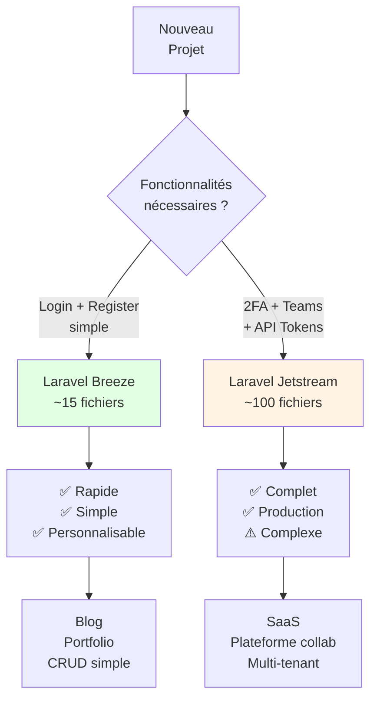

# Auth : Jetstream

## Introduction

<div
  class="omny-meta"
  data-level="🟡 Intermédiaire & 🔴 Avancé"
  data-version="1.0"
  data-time="120-180 minutes">
</div>

!!! quote "Analogie pédagogique"
    _Imaginez que vous construisez un **immeuble de bureaux professionnel multi-étages**. Breeze est comme construire une **maison individuelle** (simple, rapide, fonctionnel). **Jetstream est comme recevoir un immeuble entier clé en main** : système de sécurité avancé (2FA), gestion multi-locataires (teams), contrôle d'accès granulaire (roles/permissions), badges NFC (API tokens), salles de réunion configurées (team invitations), et système de surveillance (sessions management). Tout est **production-ready, testé, sécurisé** - mais la complexité est proportionnelle._

> **Laravel Jetstream** est le **starter kit d'authentification complet** officiel de Laravel, créé par Taylor Otwell en 2020. Jetstream fournit une **implémentation robuste niveau entreprise** de toutes les fonctionnalités d'authentification avancées : 2FA (authentification double facteur), teams (gestion équipes multi-utilisateurs), API tokens (génération tokens personnels), profile photos, browser sessions management, et account deletion. Construit sur Laravel Fortify (backend auth) et offre deux stacks frontend : Livewire ou Inertia (Vue/React).

Jetstream est devenu le **standard pour applications SaaS Laravel** nécessitant authentification avancée. Des milliers d'applications production (dashboards entreprise, plateformes collaboratives, SaaS multi-tenant) utilisent Jetstream comme fondation. Sa philosophie "batteries included" fournit tout le nécessaire pour démarrer une **application professionnelle moderne**.

!!! info "Pourquoi c'est important ?"
    Jetstream permet de **démarrer un SaaS en production en quelques heures** avec des fonctionnalités qui prendraient des **semaines à implémenter manuellement** (2FA, teams, invitations, permissions), de **garantir la sécurité** (code audité par des experts), d'**éviter les bugs classiques** (gestion teams complexe, race conditions invitations), de **suivre les standards industrie** (TOTP pour 2FA, JWT pour API tokens), et de **focaliser sur votre valeur ajoutée** plutôt que réinventer l'authentification.

## Philosophie Jetstream

### Jetstream vs Breeze


| Aspect | Breeze | Jetstream |
|--------|:------:|:---------:|
| **Complexité code** | 🟢 Simple | 🔴 Avancée |
| **Fichiers générés** | ~15 | ~100+ |
| **Temps apprentissage** | 1-2h | 6-12h |
| **2FA (TOTP)** | ❌ | ✅ |
| **Teams management** | ❌ | ✅ |
| **Team invitations** | ❌ | ✅ |
| **Roles/Permissions** | ❌ | ✅ |
| **API Tokens** | ❌ | ✅ |
| **Profile photos** | ❌ | ✅ |
| **Browser sessions** | ❌ | ✅ |
| **Delete account** | ✅ Basique | ✅ Avancé |
| **Personnalisable** | ✅ Très facile | ⚠️ Difficile |

!!! warning "Trade-off : Puissance vs Complexité"
    Jetstream est **puissant mais opinionated**. Il impose :
    
    - Architecture Actions (Laravel Fortify)
    - Structure teams spécifique
    - Relations Eloquent prédéfinies
    - Frontend Livewire OU Inertia (pas Blade pur)
    
    **Si vous voulez contrôle total**, utilisez Breeze et ajoutez fonctionnalités manuellement.

## Mise en Pratique : Projet Complet avec Jetstream

!!! success "Appliquer Jetstream dans un SaaS professionnel"
    Ce guide couvre **les concepts théoriques** de Laravel Jetstream. Pour **construire un SaaS complet** utilisant toutes les fonctionnalités Jetstream dans un contexte professionnel, suivez notre projet :
    
    **👉 [Pentest Management Platform avec Laravel Jetstream + Angular 21](/projets/jetstream-pentest-platform/)**
    
    **Ce que vous allez construire :**
    
    - ✅ **Teams multi-clients** (isolation complète données par organisation)
    - ✅ **Authentification 2FA obligatoire** (TOTP Google Authenticator)
    - ✅ **API tokens** pour scanners automatisés (Burp Suite, Nuclei)
    - ✅ **Gestion missions pentest** (web, mobile, infra, API)
    - ✅ **CVSS calculator** et classification OWASP automatique
    - ✅ **Upload evidences S3** (screenshots, PoC)
    - ✅ **Génération rapports PDF** (DOMPDF avec template professionnel)
    - ✅ **Frontend Angular 21 avec Signals** (architecture API-first moderne)
    - ✅ **Dashboard analytics** (Chart.js, métriques temps réel)
    - ✅ **Rôles granulaires** (owner, admin, pentester_lead, pentester_junior, client_ro)
    
    **Durée :** 20-28 heures (8 phases progressives)  
    **Niveau :** 🟡 Intermédiaire → 🔴 Avancé
    
    **Pourquoi ce projet ?**
    
    Ce n'est pas un tutoriel "ToDo SaaS" générique. C'est une **plateforme métier réelle** issue du domaine cybersécurité, couvrant l'intégralité des fonctionnalités Jetstream (Teams, 2FA, API tokens, permissions) dans un contexte professionnel. Le frontend Angular 21 avec Signals démontre l'architecture **API-first** moderne.
    
    **Réutilisable directement** pour votre portfolio cybersécurité ou comme base d'un outil de consulting pentest.

## Installation et configuration

### Prérequis
```bash
# Laravel 10+ installé
composer create-project laravel/laravel saas-jetstream
cd saas-jetstream

# Configurer .env
DB_CONNECTION=mysql
DB_DATABASE=saas_jetstream
DB_USERNAME=root
DB_PASSWORD=

# Créer database
mysql -u root -p
CREATE DATABASE saas_jetstream;
EXIT;
```

### Installer Jetstream
```bash
# Installer package Jetstream
composer require laravel/jetstream

# Installer Jetstream avec Livewire (RECOMMANDÉ pour débuter)
php artisan jetstream:install livewire

# OU Installer avec Inertia (Vue/React)
# php artisan jetstream:install inertia

# Options supplémentaires :
# --teams : Activer gestion teams
# --api : Activer API tokens (Laravel Sanctum)
php artisan jetstream:install livewire --teams --api

# Installer dépendances NPM et compiler
npm install
npm run dev

# Exécuter migrations (tables users, teams, etc.)
php artisan migrate

# Démarrer serveur
php artisan serve
```

### Structure générée
```
app/
├── Actions/                               # Actions Jetstream
│   ├── Fortify/                          # Actions authentification
│   │   ├── CreateNewUser.php            # Register
│   │   ├── UpdateUserPassword.php       # Update password
│   │   └── UpdateUserProfileInformation.php
│   └── Jetstream/                        # Actions teams
│       ├── AddTeamMember.php
│       ├── CreateTeam.php
│       ├── DeleteTeam.php
│       ├── DeleteUser.php
│       ├── InviteTeamMember.php
│       ├── RemoveTeamMember.php
│       └── UpdateTeamName.php
├── Models/
│   ├── Membership.php                    # Pivot User ↔ Team
│   ├── Team.php                          # Modèle Team
│   ├── TeamInvitation.php                # Invitations teams
│   └── User.php                          # Modèle User (étendu)
├── Policies/
│   └── TeamPolicy.php                    # Autorisation teams
└── Providers/
    └── JetstreamServiceProvider.php      # Configuration Jetstream

database/
└── migrations/
    ├── xxxx_create_teams_table.php
    ├── xxxx_create_team_user_table.php
    ├── xxxx_create_team_invitations_table.php
    └── ...

resources/
└── views/                                 # Vues Livewire
    ├── api/
    │   ├── index.blade.php               # Gestion API tokens
    │   └── api-token-manager.blade.php
    ├── profile/
    │   ├── show.blade.php                # Profile management
    │   └── ...
    ├── teams/
    │   ├── create.blade.php
    │   ├── show.blade.php
    │   └── ...
    └── ...
```

## Fonctionnalités Jetstream

### 1. Two-Factor Authentication (2FA)

**Jetstream utilise TOTP (Time-based One-Time Password) compatible Google Authenticator, Authy, 1Password, etc.**

**Activer 2FA utilisateur :**

1. User va dans Profile → Two Factor Authentication
2. Clic "Enable" → QR code généré
3. User scanne QR code avec app authenticator
4. User entre code 6 chiffres pour confirmer
5. Recovery codes générés (8 codes backup)

**Code backend :**

**Modèle User :** `app/Models/User.php`
```php
<?php

namespace App\Models;

use Laravel\Fortify\TwoFactorAuthenticatable;
use Laravel\Jetstream\HasProfilePhoto;
use Laravel\Jetstream\HasTeams;
use Laravel\Sanctum\HasApiTokens;

class User extends Authenticatable
{
    use HasApiTokens;
    use HasProfilePhoto;
    use HasTeams;
    use TwoFactorAuthenticatable; // ✅ Trait 2FA
    
    // ... reste du modèle
}
```

**Migrations :**
```php
// Migration ajoute colonnes à users :
$table->text('two_factor_secret')->nullable();           // Secret TOTP (chiffré)
$table->text('two_factor_recovery_codes')->nullable();   // Codes backup (chiffrés)
$table->timestamp('two_factor_confirmed_at')->nullable(); // Date confirmation 2FA
```

**Action Enable 2FA :** `app/Actions/Fortify/EnableTwoFactorAuthentication.php`
```php
<?php

namespace App\Actions\Fortify;

use Laravel\Fortify\Actions\EnableTwoFactorAuthentication as BaseAction;

class EnableTwoFactorAuthentication extends BaseAction
{
    /**
     * Enable 2FA génère :
     * - Secret TOTP (stocké chiffré dans BDD)
     * - QR code (affiché à user)
     * - Recovery codes (stockés chiffrés)
     */
}
```

**Challenge 2FA au login :**
```
Flow login avec 2FA :
1. User entre email + password → Validation
2. Si 2FA activé → Redirect vers /two-factor-challenge
3. User entre code 6 chiffres (ou recovery code)
4. Validation code → Login complet
```

**Personnaliser vue challenge :** `resources/views/auth/two-factor-challenge.blade.php`
```html
<!-- Code Blade : Challenge 2FA -->
<form method="POST" action="{{ url('/two-factor-challenge') }}">
    @csrf

    <div x-data="{ recovery: false }">
        <!-- Code TOTP (6 chiffres) -->
        <div x-show="! recovery">
            <label>Code d'authentification</label>
            <input type="text" name="code" autofocus x-ref="code">
        </div>

        <!-- Recovery code (backup) -->
        <div x-show="recovery">
            <label>Code de récupération</label>
            <input type="text" name="recovery_code" x-ref="recovery_code">
        </div>

        <!-- Toggle -->
        <button type="button" @click="
            recovery = ! recovery;
            $nextTick(() => { $refs.code?.focus() || $refs.recovery_code?.focus() })
        ">
            <span x-show="! recovery">Utiliser code de récupération</span>
            <span x-show="recovery">Utiliser code d'authentification</span>
        </button>

        <button type="submit">Se connecter</button>
    </div>
</form>
```

### 2. Teams Management

**Jetstream Teams permet de :**

- Créer plusieurs teams (équipes/organisations)
- Inviter membres par email
- Assigner rôles (owner, admin, editor, etc.)
- Changer team actif (user peut appartenir à plusieurs teams)
- Supprimer teams

**Modèle Team :** `app/Models/Team.php`
```php
<?php

namespace App\Models;

use Laravel\Jetstream\Events\TeamCreated;
use Laravel\Jetstream\Events\TeamDeleted;
use Laravel\Jetstream\Events\TeamUpdated;
use Laravel\Jetstream\Team as JetstreamTeam;

class Team extends JetstreamTeam
{
    protected $fillable = ['name', 'personal_team'];

    protected $casts = [
        'personal_team' => 'boolean',
    ];

    protected $dispatchesEvents = [
        'created' => TeamCreated::class,
        'updated' => TeamUpdated::class,
        'deleted' => TeamDeleted::class,
    ];

    /**
     * Team owner (créateur)
     */
    public function owner()
    {
        return $this->belongsTo(User::class, 'user_id');
    }

    /**
     * Membres du team
     */
    public function users()
    {
        return $this->belongsToMany(User::class, 'team_user')
                    ->withPivot('role')
                    ->withTimestamps()
                    ->as('membership');
    }

    /**
     * Team invitations en attente
     */
    public function teamInvitations()
    {
        return $this->hasMany(TeamInvitation::class);
    }

    /**
     * Purge team (supprimer tout)
     */
    public function purge()
    {
        $this->owner()->where('current_team_id', $this->id)
                      ->update(['current_team_id' => null]);

        $this->users()->detach();
        $this->delete();
    }
}
```

**Modèle User étendu :**
```php
<?php

namespace App\Models;

use Laravel\Jetstream\HasTeams;

class User extends Authenticatable
{
    use HasTeams;

    /**
     * Teams de l'utilisateur
     */
    public function teams()
    {
        return $this->belongsToMany(Team::class, 'team_user')
                    ->withPivot('role')
                    ->withTimestamps()
                    ->as('membership');
    }

    /**
     * Team actuellement sélectionné
     */
    public function currentTeam()
    {
        return $this->belongsTo(Team::class, 'current_team_id');
    }

    /**
     * Est propriétaire du team ?
     */
    public function ownsTeam($team)
    {
        return $this->id == $team->user_id;
    }

    /**
     * Changer team actif
     */
    public function switchTeam($team)
    {
        if (! $this->belongsToTeam($team)) {
            return;
        }

        $this->forceFill(['current_team_id' => $team->id])->save();
    }
}
```

**Rôles disponibles :** `config/jetstream.php`
```php
<?php

return [
    // Permissions disponibles
    'permissions' => [
        'create',
        'read',
        'update',
        'delete',
    ],
    
    // Rôles prédéfinis (personnalisables)
    'roles' => [
        'admin' => [
            'name' => 'Administrator',
            'permissions' => ['create', 'read', 'update', 'delete'],
        ],
        'editor' => [
            'name' => 'Editor',
            'permissions' => ['read', 'create', 'update'],
        ],
        'viewer' => [
            'name' => 'Viewer',
            'permissions' => ['read'],
        ],
    ],
];
```

**Inviter membre :** `app/Actions/Jetstream/InviteTeamMember.php`
```php
<?php

namespace App\Actions\Jetstream;

use App\Models\TeamInvitation;
use Illuminate\Support\Facades\Gate;
use Illuminate\Support\Facades\Mail;
use Laravel\Jetstream\Contracts\InvitesTeamMembers;
use Laravel\Jetstream\Events\InvitingTeamMember;
use Laravel\Jetstream\Jetstream;
use Laravel\Jetstream\Mail\TeamInvitation as TeamInvitationMail;

class InviteTeamMember implements InvitesTeamMembers
{
    public function invite($user, $team, string $email, string $role = null)
    {
        Gate::forUser($user)->authorize('addTeamMember', $team);

        $this->validate($team, $email, $role);

        InvitingTeamMember::dispatch($team, $email, $role);

        $invitation = $team->teamInvitations()->create([
            'email' => $email,
            'role' => $role,
        ]);

        Mail::to($email)->send(new TeamInvitationMail($invitation));
    }

    protected function validate($team, string $email, ?string $role)
    {
        Validator::make([
            'email' => $email,
            'role' => $role,
        ], [
            'email' => ['required', 'email', 
                        Rule::unique('team_invitations')->where(function ($query) use ($team) {
                            $query->where('team_id', $team->id);
                        })],
            'role' => Jetstream::hasRoles()
                        ? ['required', 'string', Rule::in(array_keys(Jetstream::$roles))]
                        : 'required',
        ])->validate();
    }
}
```

**Utiliser dans contrôleur :**
```php
<?php

namespace App\Http\Controllers;

use Illuminate\Http\Request;

class TeamController extends Controller
{
    public function store(Request $request)
    {
        $team = $request->user()->ownedTeams()->create([
            'name' => $request->name,
            'personal_team' => false,
        ]);

        $request->user()->switchTeam($team);

        return redirect()->route('teams.show', $team);
    }
    
    public function inviteMember(Request $request, Team $team)
    {
        $this->authorize('addTeamMember', $team);
        
        app(InvitesTeamMembers::class)->invite(
            $request->user(),
            $team,
            $request->email,
            $request->role
        );
        
        return back()->with('success', 'Invitation envoyée !');
    }
}
```

**Middleware team context :**
```php
<?php

// Automatiquement appliqué par Jetstream
// Charge current_team dans chaque requête

// Utilisation dans code :
$team = auth()->user()->currentTeam;

// Filtrer données par team actif :
$posts = Post::where('team_id', $team->id)->get();
```

### 3. API Tokens (Laravel Sanctum)

**Jetstream intègre Laravel Sanctum pour générer API tokens personnels.**

**Créer token :**
```php
<?php

// Dans contrôleur ou action
$token = $request->user()->createToken('token-name', ['read', 'write']);

// Récupérer token en clair (UNE SEULE FOIS)
$plainTextToken = $token->plainTextToken;
// Exemple : "1|abcdefghijklmnopqrstuvwxyz123456"

// Stocker token.id dans BDD, donner plainTextToken à user
return response()->json([
    'token' => $plainTextToken,
]);
```

**Utiliser token en API :**
```bash
# Requête API avec token Bearer
curl -H "Authorization: Bearer 1|abcdefghijklmnopqrstuvwxyz123456" \
     https://api.example.com/user
```

**Protéger routes API :**
```php
<?php

// routes/api.php
use Illuminate\Http\Request;

Route::middleware('auth:sanctum')->get('/user', function (Request $request) {
    return $request->user();
});

Route::middleware('auth:sanctum')->group(function () {
    Route::apiResource('posts', PostController::class);
});
```

**Vérifier abilities (permissions token) :**
```php
<?php

// Créer token avec abilities spécifiques
$token = $user->createToken('token-name', ['post:read', 'post:create']);

// Vérifier dans contrôleur
if ($request->user()->tokenCan('post:create')) {
    // User peut créer posts
}

// Middleware
Route::middleware(['auth:sanctum', 'abilities:post:create'])->group(function () {
    Route::post('/posts', [PostController::class, 'store']);
});
```

**Révoquer token :**
```php
<?php

// Révoquer token actuel
$request->user()->currentAccessToken()->delete();

// Révoquer tous les tokens
$request->user()->tokens()->delete();

// Révoquer token spécifique
$request->user()->tokens()->where('id', $tokenId)->delete();
```

**Gestion tokens dans interface :**

Jetstream fournit une interface complète dans Profile → API Tokens :

- Créer nouveau token avec nom + permissions
- Voir liste tokens existants (sans plainText, juste noms)
- Révoquer tokens individuellement

### 4. Profile Management avancé

**Features supplémentaires vs Breeze :**

- **Profile Photo** : Upload et crop image
- **Browser Sessions** : Voir sessions actives (IP, device, last active)
- **Two Factor Authentication** : Enable/disable 2FA
- **Delete Account** : Suppression compte avec confirmation password

**Upload profile photo :**
```php
<?php

// app/Actions/Jetstream/UpdateUserProfilePhoto.php
public function update($user, $photo)
{
    $user->updateProfilePhoto($photo);
}
```
```html
<!-- Code Blade : Upload photo -->
<form wire:submit.prevent="updateProfilePhoto">
    <input type="file" wire:model="photo">
    
    @if ($photo)
        <!-- Preview -->
        temporaryUrl() }}">
    @endif
    
    <button type="submit">Sauvegarder photo</button>
</form>
```

**Browser sessions management :**
```html
<!-- Code Blade : Sessions actives -->
@foreach ($sessions as $session)
    <div>
        <div>{{ $session->agent->platform() }} - {{ $session->agent->browser() }}</div>
        <div>{{ $session->ip_address }}</div>
        <div>
            @if ($session->is_current_device)
                Cet appareil
            @else
                Dernière activité : {{ $session->last_active }}
            @endif
        </div>
        
        @if (! $session->is_current_device)
            <button wire:click="logoutOtherBrowserSession({{ $session->id }})">
                Déconnecter
            </button>
        @endif
    </div>
@endforeach
```

## Exemple complet : SaaS multi-tenant

**Scénario :** Plateforme de gestion projets où chaque team a ses propres projets.

### Modèle Project
```bash
php artisan make:model Project -mcr
```

**Migration :**
```php
<?php

public function up(): void
{
    Schema::create('projects', function (Blueprint $table) {
        $table->id();
        $table->foreignId('team_id')->constrained()->onDelete('cascade');
        $table->foreignId('user_id')->constrained()->onDelete('cascade');
        $table->string('name');
        $table->text('description')->nullable();
        $table->date('deadline')->nullable();
        $table->enum('status', ['active', 'completed', 'archived'])->default('active');
        $table->timestamps();
    });
}
```

**Modèle :**
```php
<?php

namespace App\Models;

use Illuminate\Database\Eloquent\Model;

class Project extends Model
{
    protected $fillable = ['team_id', 'user_id', 'name', 'description', 'deadline', 'status'];
    
    protected $casts = [
        'deadline' => 'date',
    ];
    
    public function team()
    {
        return $this->belongsTo(Team::class);
    }
    
    public function creator()
    {
        return $this->belongsTo(User::class, 'user_id');
    }
}
```

**Policy :**
```php
<?php

namespace App\Policies;

use App\Models\Project;
use App\Models\User;

class ProjectPolicy
{
    public function viewAny(User $user): bool
    {
        return $user->currentTeam !== null;
    }
    
    public function view(User $user, Project $project): bool
    {
        return $user->belongsToTeam($project->team);
    }
    
    public function create(User $user): bool
    {
        return $user->currentTeam !== null;
    }
    
    public function update(User $user, Project $project): bool
    {
        return $user->belongsToTeam($project->team) &&
               $user->hasTeamRole($project->team, 'admin');
    }
    
    public function delete(User $user, Project $project): bool
    {
        return $user->ownsTeam($project->team) ||
               $user->hasTeamRole($project->team, 'admin');
    }
}
```

**Contrôleur :**
```php
<?php

namespace App\Http\Controllers;

use App\Models\Project;
use Illuminate\Http\Request;

class ProjectController extends Controller
{
    public function index()
    {
        $this->authorize('viewAny', Project::class);
        
        $projects = auth()->user()->currentTeam
                         ->projects()
                         ->with('creator')
                         ->latest()
                         ->get();
        
        return view('projects.index', compact('projects'));
    }
    
    public function store(Request $request)
    {
        $this->authorize('create', Project::class);
        
        $validated = $request->validate([
            'name' => 'required|max:255',
            'description' => 'nullable',
            'deadline' => 'nullable|date|after:today',
        ]);
        
        $project = auth()->user()->currentTeam->projects()->create([
            ...$validated,
            'user_id' => auth()->id(),
        ]);
        
        return redirect()->route('projects.show', $project);
    }
    
    public function show(Project $project)
    {
        $this->authorize('view', $project);
        
        return view('projects.show', compact('project'));
    }
    
    public function update(Request $request, Project $project)
    {
        $this->authorize('update', $project);
        
        $validated = $request->validate([
            'name' => 'required|max:255',
            'description' => 'nullable',
            'status' => 'in:active,completed,archived',
        ]);
        
        $project->update($validated);
        
        return back()->with('success', 'Projet mis à jour !');
    }
}
```

## Le mot de la fin

!!! quote
    Laravel Jetstream représente le **sommet de l'authentification Laravel**. En générant ~100 fichiers de code production-ready, Jetstream offre des fonctionnalités qui coûteraient **des milliers d'euros de développement** si implémentées manuellement : 2FA sécurisé (TOTP standard industrie), teams multi-tenant complexe (invitations, rôles, permissions), API tokens révocables (Sanctum), sessions management, profile photos. Tout **testé, audité, maintenu** par l'équipe Laravel.
    
    Jetstream est **opinionated par design**. Il impose une structure (Actions, Policies, Teams), un frontend (Livewire ou Inertia), et des conventions strictes. Ce n'est **pas un défaut**, c'est une **force** : cette structure garantit cohérence, maintenabilité, et évolutivité. Les meilleurs SaaS Laravel du monde utilisent Jetstream ou s'en inspirent fortement.
    
    Le trade-off est clair : **complexité contre puissance**. Si vous construisez un blog simple, Jetstream est overkill - utilisez Breeze. Mais si vous construisez un **SaaS professionnel multi-tenant** avec teams, rôles, permissions, 2FA obligatoire, et API - Jetstream vous fait gagner **3-6 mois de développement** et élimine **des centaines de bugs potentiels**.

---

**Ressources :**

- [Laravel Jetstream Documentation](https://jetstream.laravel.com)
- [Jetstream GitHub](https://github.com/laravel/jetstream)
- [Laravel Fortify](https://laravel.com/docs/fortify)

[^1]: **TOTP (Time-based One-Time Password)** : Standard IETF RFC 6238 pour générer codes 6 chiffres basés sur timestamp + secret partagé. Compatible Google Authenticator, Authy, 1Password, etc.