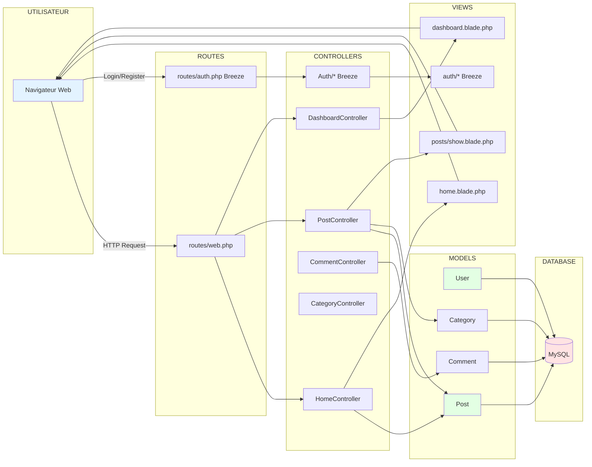
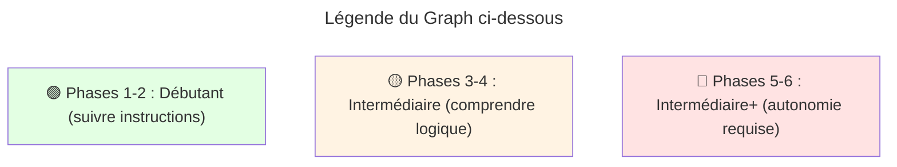
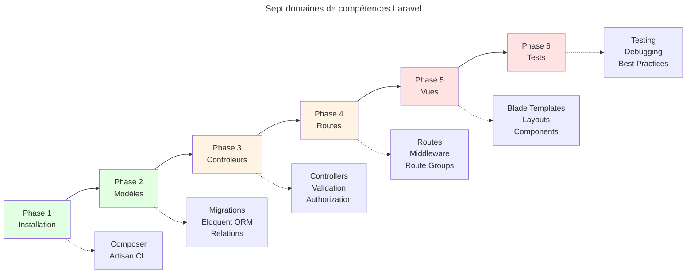

# Laravel - Breeze : Blog Multi-Auteurs

<div
  class="omny-meta"
  data-level="🟢 Débutant 🟡 Intermédiaire 🔴 Avancé"
  data-version="1.0"
  data-time="12-18 heures (7 phases)">
</div>

## Introduction du projet

Bienvenue dans ce projet **Blog Multi-Auteurs avec Laravel Breeze** ! Avant de commencer à "_coder_", "_"installer des dépendances"_ ou bien même de "_créer des migrations_", il est **crucial** que vous compreniez la vision d'ensemble du projet, son architecture complète et la logique pédagogique qui structure ce parcours d'apprentissage.

!!! note "Ce projet s’inscrit dans la continuité du module consacré aux fondamentaux de Breeze."

Cette phase **vous présente** :

- Les objectifs pédagogiques du projet
- L'architecture complète de l'application (base de données, modèles, contrôleurs, vues)
- Le rôle de Laravel Breeze dans le projet
- La structure logique des 7 Phases qui composent ce projet (Phases 1 à 7)
- Les compétences que vous allez acquérir étape par étape

!!! quote "Pourquoi commencer par la vision globale ?"
    Imaginez que vous construisez une **maison professionnelle**. Avant de couler les fondations, vous devez comprendre le plan d'ensemble : combien d'étages, où placer les pièces, comment organiser la plomberie et l'électricité. **C'est exactement le rôle de ce Phase** : vous donner le blueprint complet du blog avant d'écrire la première ligne de code. Sans cette vision, vous risquez de construire une pièce sans comprendre comment elle s'intègre au reste de la maison.

## Objectifs d'Apprentissage

!!! abstract "Avant le début de la première phase, **vous serez capable** :"

    - [ ] D'expliquer la finalité pédagogique du projet Blog Multi-Auteurs
    - [ ] D'identifier les 4 entités principales (**User**, **Post**, **Category**, **Comment**) et leurs relations
    - [ ] De comprendre le **rôle** de Laravel Breeze dans l'authentification
    - [ ] Décrire l'architecture **MVC** (_Model, View, Controller_) appliquée au blog
    - [ ] De situer chaque Phase (**1 à 7**) dans la progression logique du projet
    - [ ] D'anticiper les compétences Laravel que vous allez développer

## Finalité Pédagogique du Projet

### Pourquoi construire un blog multi-auteurs ?

!!! quote "Ce projet n'est **pas** un exercice théorique. C'est un **cas d'usage réel** que vous rencontrerez dans 80% des applications web professionnelles."

**Cas d'usage professionnels équivalents :**

- **Blog d'entreprise** → _Plateforme de publication avec modération_
- **Intranet collaboratif** → _Articles internes avec commentaires_
- **Base de connaissances** → _Documentation collaborative_
- **Plateforme e-learning** → _Cours publiés par formateurs_
- **Marketplace** → _Vendeurs publient produits avec reviews_

**Compétences transférables :**

- [x] Authentification utilisateur (**login**, **register**, **reset password**)
- [x] CRUD complet avec ownership (**un user gère SES ressources**)
- [x] Relations Eloquent (**1-N**, **N-N**)
- [x] Validation de formulaires
- [x] Système de rôles simplifié (**auteur vs visiteur**)
- [x] Modération de contenu (**commentaires**)
- [x] Dashboard statistiques

**Ce projet vous prépare directement pour :**

- CMS professionnels (**WordPress-like**)
- Applications **SaaS** avec gestion utilisateurs
- Plateformes collaboratives
- Systèmes de **tickets**/**support**

## Architecture Globale du Projet

### Modélisation Complète de la Base de Données

=== "UseCase - Cas d'utilisation"

    !!! quote "**Diagramme des cas d'utilisation** représentant les interactions entre les acteurs (Visiteur, Auteur, Système) et les fonctionnalités du blog."

    ```mermaid
    graph LR
        subgraph "Acteurs"
            V[Visiteur<br/>Non authentifié]
            A[Auteur<br/>Authentifié]
        end
        
        subgraph "Système Blog Multi-Auteurs"
            UC1[Consulter articles]
            UC2[Filtrer par catégorie]
            UC3[Voir profil auteur]
            UC4[Commenter article]
            
            UC5[S'inscrire]
            UC6[Se connecter]
            UC7[Gérer son profil]
            
            UC8[Créer article]
            UC9[Modifier article]
            UC10[Supprimer article]
            UC11[Gérer brouillons]
            
            UC12[Modérer commentaires]
            UC13[Consulter statistiques]
        end
        
        V --> UC1
        V --> UC2
        V --> UC3
        V --> UC4
        V --> UC5
        
        A --> UC1
        A --> UC2
        A --> UC3
        A --> UC6
        A --> UC7
        A --> UC8
        A --> UC9
        A --> UC10
        A --> UC11
        A --> UC12
        A --> UC13
        
        UC8 -.inclut.-> UC11
        UC9 -.inclut.-> UC11
        UC12 -.nécessite.-> UC9
        
        style V fill:#e3f3ff
        style A fill:#e3ffe3
    ```

    <small>*Le système distingue deux acteurs principaux : les **Visiteurs** (consultation et commentaires) et les **Auteurs** (gestion complète de leurs contenus). Les visiteurs peuvent s'inscrire pour devenir auteurs.*</small>

=== "MCD - Modèle Conceptuel"

    !!! quote "**Modèle Conceptuel de Données (MCD)** : Vue abstraite des entités métier et de leurs relations sans considération technique."

    ```mermaid
    classDiagram
        class USER {
            name : String
            email : String
            bio : Text
            avatar : String
        }
        
        class POST {
            title : String
            excerpt : Text
            content : Text
            status : Enum
            image : String
        }
        
        class CATEGORY {
            name : String
        }
        
        class COMMENT {
            author_name : String
            author_email : String
            content : Text
            approved : Boolean
        }
        
        USER "1" --> "0..*" POST : écrit
        POST "0..*" --> "1" CATEGORY : appartient_à
        POST "1" --> "0..*" COMMENT : reçoit
    ```
    <small>*Le MCD se concentre sur les **règles métier** sans détails techniques : un auteur peut écrire plusieurs articles, chaque article appartient à une seule catégorie, les commentaires sont attachés à un article spécifique.*</small>

    **Cardinalités expliquées (dans les deux sens) :**

    | Relation | Cardinalité | Signification |
    |----------|-------------|---------------|
    | **USER → POST** | 1 vers 0..* | Un auteur écrit de 0 à N articles |
    | **POST → USER** | 0..* vers 1 | N articles sont écrits par exactement 1 auteur |
    | **POST → CATEGORY** | 0..* vers 1 | N articles appartiennent à exactement 1 catégorie |
    | **CATEGORY → POST** | 1 vers 0..* | Une catégorie contient de 0 à N articles |
    | **POST → COMMENT** | 1 vers 0..* | Un article reçoit de 0 à N commentaires |
    | **COMMENT → POST** | 0..* vers 1 | N commentaires concernent exactement 1 article |


=== "MLD - Modèle Logique"

    !!! quote "**Modèle Logique de Données (MLD)** : Traduction du MCD en tables relationnelles avec clés primaires (PK) et clés étrangères (FK)."

    ```mermaid
    erDiagram
        USER ||--o{ POST : "écrit"
        USER {
            int id PK
            string name
            string email UK "UNIQUE"
            string password
            text bio "NULLABLE"
            string avatar "NULLABLE"
            timestamp email_verified_at "NULLABLE"
        }
        
        CATEGORY ||--o{ POST : "contient"
        CATEGORY {
            int id PK
            string name
            string slug UK "UNIQUE"
        }
        
        POST ||--o{ COMMENT : "reçoit"
        POST {
            int id PK
            int user_id FK
            int category_id FK
            string title
            string slug UK "UNIQUE"
            text excerpt
            text content
            string image "NULLABLE"
            string status "draft/published"
            timestamp published_at "NULLABLE"
            int views_count
        }
        
        COMMENT {
            int id PK
            int post_id FK
            string author_name
            string author_email
            text content
            boolean approved
        }
    ```
    <small>*Le MLD introduit les **clés techniques** pour établir les relations : **les clés étrangères `user_id`**, **`category_id`**, **`post_id` matérialisent les associations du MCD**. Les suppressions en cascade garantissent la cohérence.*</small>

    **Contraintes d'intégrité :**
    
    - **Clés primaires (PK)** : Identifiant unique auto-incrémenté pour chaque table
    - **Clés étrangères (FK)** :
        - `posts.user_id` référence `users.id` (CASCADE DELETE)
        - `posts.category_id` référence `categories.id` (CASCADE DELETE)
        - `comments.post_id` référence `posts.id` (CASCADE DELETE)
    - **Contraintes UNIQUE (UK)** : email (users), slug (categories, posts)
    - **Contraintes CHECK** : status IN ('draft', 'published')

=== "MPD - Modèle Physique"

    !!! quote "**Modèle Physique de Données (MPD)** : Structure finale implémentée en base MySQL avec types de données SQL précis, index et optimisations."

    ```mermaid
    erDiagram
        USER ||--o{ POST : "écrit"
        USER {
            int id PK "AUTO_INCREMENT"
            varchar_255 name
            varchar_255 email "UNIQUE INDEX"
            varchar_255 password
            text bio "NULLABLE"
            varchar_255 avatar "NULLABLE"
            timestamp email_verified_at "NULLABLE"
            timestamp created_at
            timestamp updated_at
        }
        
        POST ||--|| CATEGORY : "appartient_à"
        POST ||--o{ COMMENT : "reçoit"
        POST {
            int id PK "AUTO_INCREMENT"
            int user_id FK "INDEX, CASCADE DELETE"
            int category_id FK "INDEX, CASCADE DELETE"
            varchar_255 title
            varchar_255 slug "UNIQUE INDEX"
            text excerpt
            longtext content
            varchar_255 image "NULLABLE"
            enum status "DEFAULT 'draft'"
            timestamp published_at "NULLABLE, INDEX"
            int views_count "DEFAULT 0"
            timestamp created_at
            timestamp updated_at
        }
        
        CATEGORY ||--o{ POST : "contient"
        CATEGORY {
            int id PK "AUTO_INCREMENT"
            varchar_255 name
            varchar_255 slug "UNIQUE INDEX"
            timestamp created_at
            timestamp updated_at
        }
        
        COMMENT {
            int id PK "AUTO_INCREMENT"
            int post_id FK "INDEX, CASCADE DELETE"
            varchar_255 author_name
            varchar_255 author_email
            text content
            boolean approved "DEFAULT FALSE"
            timestamp created_at
            timestamp updated_at
        }
    ```

    <small>*Le MPD représente la **structure réelle MySQL** avec optimisations de performance : les index accélèrent les requêtes fréquentes (filtres par status, recherche par slug), les types de données sont dimensionnés au plus juste.*</small>

    **Optimisations physiques :**

    - **Index simples** : email, slug, published_at
    - **Index composites** : (user_id, status), (post_id, approved)
    - **Types de stockage** :
        - `longtext` pour content (jusqu'à 4 Go)
        - `text` pour excerpt, bio (jusqu'à 64 Ko)
        - `enum` pour status (1 octet vs varchar)
    - **Valeurs par défaut** : status='draft', approved=false, views_count=0
    - **Timestamps automatiques** : created_at, updated_at gérés par Laravel


## Architecture MVC Appliquée

### Flux de Données et Séparation des Responsabilités

Le pattern **MVC (Model-View-Controller)** est l'architecture fondamentale de Laravel. Il sépare clairement les responsabilités : les **Modèles** gèrent les données et la logique métier, les **Vues** affichent l'interface utilisateur, et les **Contrôleurs** orchestrent les interactions entre les deux. Cette séparation garantit un code maintenable, testable et évolutif.

Dans notre blog multi-auteurs, chaque requête HTTP suit un cycle précis : l'utilisateur interagit via son navigateur, les routes dirigent vers les contrôleurs appropriés (**authentification Breeze ou logique métier custom**), les contrôleurs interrogent les modèles Eloquent qui communiquent avec MySQL, puis retournent les vues Blade enrichies des données au navigateur.



<small>*Le diagramme illustre le **cycle de vie d'une requête** : (1) le navigateur envoie une requête HTTP, (2) les routes (`web.php` ou `auth.php`) dirigent vers le contrôleur approprié, (3) le contrôleur interroge les modèles Eloquent pour récupérer/modifier les données, (4) les modèles communiquent avec MySQL, (5) le contrôleur charge une vue Blade avec les données, (6) la vue HTML est retournée au navigateur. Laravel Breeze gère automatiquement tout le flux d'authentification (partie droite du diagramme).*</small>

## Rôle de Laravel Breeze

### Qu'est-ce que Breeze apporte ?

Laravel Breeze est un **starter kit d'authentification minimaliste** qui génère automatiquement :

=== "Contrôleurs d'authentification"

    - `RegisteredUserController` → Inscription
    - `AuthenticatedSessionController` → Login/Logout
    - `PasswordResetLinkController` → Demande reset password
    - `NewPasswordController` → Reset password effectif
    - `EmailVerificationController` → Vérification email
    - `ProfileController` → Gestion profil

=== "Routes d'authentification"

    - `GET /register` → Formulaire inscription
    - `POST /register` → Créer compte
    - `GET /login` → Formulaire connexion
    - `POST /login` → Authentifier
    - `POST /logout` → Déconnexion
    - `GET /forgot-password` → Formulaire reset
    - `POST /forgot-password` → Envoyer email reset
    - etc.

=== "Vues Blade"

    - `auth/register.blade.php`
    - `auth/login.blade.php`
    - `auth/forgot-password.blade.php`
    - `profile/edit.blade.php`
    - etc.

=== "Middleware"

    - `auth` → Protéger routes (utilisateur connecté requis)
    - `verified` → Email vérifié requis

!!! tip "Breeze = Fondations Solides"
    Breeze vous **fait gagner 8-12 heures** de développement en générant du code authentification production-ready, testé et sécurisé. Vous vous concentrez sur **votre logique métier** (le blog) plutôt que réinventer l'authentification.

## Structure des 7 Phases

!!! quote "Au-delà de la compréhension de l’architecture globale, explorez les sept phases du projet, accompagnées du **temps estimé**, de **l’objectif visé** et **des livrables attendus**. Cette vue d’ensemble garantit une progression claire et sans ambiguïté."

<div class="cards grid" markdown>

- :fontawesome-solid-download: **Phase 1 : Installation et Configuration**

    ---

    **Temps :** 30-45 minutes  
    **Objectif :** Installer Laravel, Breeze, configurer BDD  
    **Livrables :**

    - Projet Laravel fonctionnel
    - Breeze installé et migrations exécutées
    - Authentification testée (register/login)
    - 

    ---

    🟢 Débutant

- :fontawesome-solid-database: **Phase 2 : Base de Données et Modèles**

    ---

    **Temps :** 1h30-2 heures  
    **Objectif :** Créer structure BDD complète et modèles Eloquent  
    **Livrables :**

    - Migrations (categories, posts, comments)
    - Modèles avec relations (User, Post, Category, Comment)
    - Seeders avec données de test

    ---

    🟡 Intermédiaire

- :fontawesome-solid-seedling: **Phase 3 : Seeders et Données de Test**

    ---

    **Temps :** 45-60 minutes  
    **Objectif :** Créer données de test pour développement  
    **Livrables :**

    - CategorySeeder avec 6 catégories
    - DatabaseSeeder avec 3 users + 7 posts + 2 comments
    - Commande `migrate:fresh --seed` fonctionnelle

    ---

    🟢 Débutant

- :fontawesome-solid-code: **Phase 4 : Contrôleurs et Logique Métier**

    ---

    **Temps :** 2-3 heures  
    **Objectif :** Implémenter toute la logique CRUD et business  
    **Livrables :**

    - 7 contrôleurs complets (Home, Post, Dashboard, Comment, Category, Author, Profile)
    - Validation formulaires
    - Authorization (ownership)

    ---

    🟡 Intermédiaire

- :fontawesome-solid-route: **Phase 5 : Routes et Organisation**

    ---

    **Temps :** 30-45 minutes  
    **Objectif :** Structurer routes publiques/protégées  
    **Livrables :**

    - Routes publiques (home, posts, categories)
    - Routes protégées (dashboard, CRUD posts)
    - Routes authentification (Breeze)

    ---

    🟢 Débutant

- :fontawesome-solid-eye: **Phase 6 : Vues Blade et Interface**

    ---

    **Temps :** 3-4 heures  
    **Objectif :** Créer toute l'interface utilisateur  
    **Livrables :**

    - Layout principal (navigation, footer)
    - 9 vues complètes (home, post show, create, edit, dashboard, etc.)
    - Design Tailwind CSS responsive

    ---

    🟡 Intermédiaire

</div>

<div class="cards grid" markdown>

- :fontawesome-solid-check-circle: **Phase 7 : Tests et Validation Finale**

    ---

    **Temps :** 4-6 heures  
    **Objectif :** Tester toutes les fonctionnalités  
    **Livrables :**

    - Checklist tests complète
    - Blog 100% fonctionnel
    - Documentation utilisation

    ---

    🔴 Avancé

</div>

## Progression des Compétences

### Compétences Laravel Acquises

> Ce projet couvre l'ensemble des compétences fondamentales nécessaires pour développer une application Laravel professionnelle en conditions réelles. Vous maîtriserez non seulement la création de migrations et de modèles Eloquent, mais également l'orchestration complète du cycle MVC, la gestion des relations complexes entre entités, la validation des données, l'autorisation via les Policies, et l'intégration de l'authentification Breeze. Chaque phase du projet renforce progressivement votre expertise, de la structure de base de données jusqu'à l'interface utilisateur responsive.

!!! note "Le parcours d'apprentissage suit une progression logique : après avoir posé les fondations techniques (**BDD**, **modèles**, **seeders**), vous implémenterez la logique métier dans **les contrôleurs**, organiserez **le routage** de l'application, puis construirez **l'interface utilisateur** avec Blade et Tailwind CSS. Cette approche garantit une compréhension profonde de l'architecture Laravel et des bonnes pratiques de développement."





<small>_Le diagramme présente les sept domaines de compétences Laravel développés tout au long du projet, avec leur niveau d'expertise atteint et leurs sous-compétences associées. Chaque compétence est contextualisée par rapport aux phases du projet : **les Migrations** et **Modèles Eloquent** sont acquis dès les phases 2-3, **les Contrôleurs** et **Routes** en phases 4-5, **les Vues Blade** en phase 6, tandis que **l'Authentification Breeze** est transversale (utilisée dès la phase 1 et enrichie jusqu'à la phase 7). Cette progression garantit une montée en compétence naturelle et structurée._</small>

## Fonctionnalités Complètes du Blog

### Pour les Visiteurs (Non Authentifiés)

<div class="cards grid" markdown>

- :fontawesome-solid-book-open: **Consultation**

    ---

    - Lire tous les articles publiés
    - Filtrer par catégorie
    - Voir profil auteurs
    - Rechercher articles (pagination)

- :fontawesome-solid-comments: **Interaction**

    ---

    - Commenter articles (nom + email)
    - Voir commentaires approuvés

</div>

### Pour les Auteurs (Utilisateurs Authentifiés)

<div class="cards grid" markdown>

- :fontawesome-solid-user-gear: **Gestion de compte**

    ---

    - S'inscrire avec vérification email
    - Se connecter / Déconnecter
    - Réinitialiser mot de passe oublié
    - Modifier profil (nom, email, bio, avatar)
    - Supprimer compte

- :fontawesome-solid-pen-to-square: **Gestion articles**

    ---

    - Créer article (brouillon ou publié)
    - Modifier ses articles uniquement
    - Supprimer ses articles
    - Voir statistiques (vues, commentaires)
    - Changer statut (brouillon ↔ publié)

- :fontawesome-solid-chart-line: **Dashboard personnel**

    ---

    - Statistiques globales (total articles, vues, commentaires)
    - Liste tous mes articles
    - Article le plus populaire
    - Accès rapide création/édition

- :fontawesome-solid-shield-halved: **Modération commentaires**

    ---

    - Approuver commentaires sur mes articles
    - Supprimer commentaires sur mes articles
</div>

## Architecture Technique Résumée

Cette section synthétise l'environnement technique complet du projet : de la stack technologique utilisée (**Laravel 11**, **MySQL**, **Blade**, **Tailwind CSS**) jusqu'à l'organisation concrète des fichiers et dossiers du projet. Comprendre cette architecture permet d'anticiper la structure du code, de localiser rapidement les composants lors du développement, et d'appréhender la séparation des responsabilités entre backend (**contrôleurs**, **modèles**), frontend (**vues Blade**), et persistance (**migrations**, **seeders**).

!!! info "Les deux vues présentées ci-dessous sont complémentaires"

    - la **Stack Technologique** détaille les outils et frameworks employés avec leur rôle précis
    - la **Structure Fichiers Finale** expose l'arborescence complète du projet une fois toutes les phases terminées.
    
    > Cette double lecture vous offre une vision stratégique (**quels outils**) et opérationnelle (**où trouver chaque fichier**).

=== "Stack Technologique"

    | Composant | Technologie | Rôle |
    |-----------|-------------|------|
    | **Backend** | Laravel 11 | Framework PHP MVC |
    | **Authentification** | Laravel Breeze | Starter kit auth |
    | **Base de Données** | MySQL 8.0+ | Stockage données |
    | **Frontend** | Blade + Tailwind CSS | Templates + Styling |
    | **Assets** | Vite | Compilation JS/CSS |
    | **ORM** | Eloquent | Mapping objet-relationnel |

=== "Structure Fichiers Finale"

    ```
    blog-breeze/
    ├── app/
    │   ├── Http/Controllers/
    │   │   ├── Auth/                    # Breeze (7 contrôleurs)
    │   │   ├── HomeController.php       # Page accueil
    │   │   ├── PostController.php       # CRUD articles
    │   │   ├── DashboardController.php  # Dashboard auteur
    │   │   ├── CommentController.php    # Gestion commentaires
    │   │   ├── CategoryController.php   # Filtres catégories
    │   │   ├── AuthorController.php     # Profil auteur
    │   │   └── ProfileController.php    # Édition profil
    │   └── Models/
    │       ├── User.php                 # Modèle utilisateur
    │       ├── Post.php                 # Modèle article
    │       ├── Category.php             # Modèle catégorie
    │       └── Comment.php              # Modèle commentaire
    ├── database/
    │   ├── migrations/
    │   │   ├── xxxx_create_users_table.php
    │   │   ├── xxxx_create_categories_table.php
    │   │   ├── xxxx_create_posts_table.php
    │   │   └── xxxx_create_comments_table.php
    │   └── seeders/
    │       ├── CategorySeeder.php       # 6 catégories
    │       └── DatabaseSeeder.php       # 3 users + 7 posts
    ├── resources/views/
    │   ├── layouts/app.blade.php        # Layout principal
    │   ├── home.blade.php               # Page accueil
    │   ├── dashboard.blade.php          # Dashboard auteur
    │   ├── posts/                       # Vues articles
    │   │   ├── show.blade.php
    │   │   ├── create.blade.php
    │   │   └── edit.blade.php
    │   ├── categories/show.blade.php    # Articles par catégorie
    │   ├── authors/show.blade.php       # Profil auteur public
    │   ├── profile/edit.blade.php       # Édition profil
    │   └── auth/                        # Vues Breeze auth
    └── routes/
        ├── web.php                      # Routes principales
        └── auth.php                     # Routes Breeze
    ```

## Prérequis et Environnement

Ce projet constitue la **suite naturelle d'un cours d'initiation à Laravel Breeze**, où vous avez déjà découvert les fondamentaux de l'authentification et du système de routing Laravel. Toutefois, **chaque concept sera systématiquement réexpliqué et contextualisé** dans les phases du projet, garantissant une compréhension complète même si vous abordez certains sujets pour la première fois. L'objectif est de consolider vos acquis sur Breeze tout en élargissant votre maîtrise de Laravel à travers un cas d'usage réel et professionnel.

Les prérequis techniques listés ci-dessous distinguent clairement les **connaissances indispensables** (bases PHP, SQL, HTML/CSS) des **compétences recommandées** (MVC, relations BDD) et des **technologies apprises durant le projet** (Eloquent, Blade). Cette distinction vous permet d'évaluer votre niveau de départ et d'anticiper les apprentissages à venir.

### Connaissances Requises

<div class="cards grid" markdown>

- :fontawesome-solid-circle-check: **Indispensables**

    ---

    - [x] Bases PHP (variables, fonctions, tableaux, classes)
    - [x] Bases SQL (SELECT, INSERT, UPDATE, DELETE)
    - [x] Bases HTML/CSS (structure page, sélecteurs)
    - [x] Terminal/Ligne de commande (cd, ls, navigation)

- :fontawesome-solid-circle-half-stroke: **Recommandées**

    ---

    - 🟡 MVC pattern (Model-View-Controller)
    - 🟡 Relations base de données (1-N, N-N)
    - 🟡 HTTP (GET, POST, sessions, cookies)
    - 🟡 Notions Laravel Breeze (authentification, middleware)

</div>

<div class="cards grid" markdown>

- :fontawesome-solid-graduation-cap: **Apprises durant le projet**

    ---

    - [x] Laravel (architecture MVC complète)
    - [x] Eloquent ORM (relations, scopes, mutators)
    - [x] Blade templating (directives, components, layouts)
    - [x] Validation et Authorization (Policies, Form Requests)
    - [x] Migrations et Seeders (schema builder, factories)

</div>

<small>*Si vous avez suivi le cours d'initiation Laravel Breeze, vous possédez déjà les bases d'authentification (**register**, **login**, **password reset**) et la structure MVC de base. Ce projet enrichit ces connaissances en ajoutant la gestion complète d'un blog multi-auteurs avec relations complexes (**User ↔ Post ↔ Category ↔ Comment**), autorisation granulaire (**ownership des articles**), et interface utilisateur responsive. **Tous les concepts seront réexpliqués étape par étape**, y compris ceux vus dans le cours Breeze.*</small>

### Environnement Technique

**Logiciels requis :**

<div class="cards grid" markdown>

- :fontawesome-brands-php: **PHP & Composer**

    ---

    - **PHP 8.1+** (8.2 ou 8.3 recommandé)
    - **Composer 2.x** (gestionnaire dépendances)
    
    ```bash
    php -v        # Vérifier version PHP
    composer -V   # Vérifier version Composer
    ```

- :fontawesome-solid-database: **Base de Données**

    ---

    - **MySQL 8.0+** ou **MariaDB 10.5+**
    - Client GUI recommandé : phpMyAdmin, Adminer, DBeaver
    
    ```bash
    mysql --version   # Vérifier version MySQL
    ```

</div>

<div class="cards grid" markdown>

- :fontawesome-brands-node-js: **Node.js & NPM**

    ---

    - **Node.js 22+** (LTS recommandé)
    - **NPM 10+** (compilation assets Vite)
    
    ```bash
    node -v    # Vérifier version Node
    npm -v     # Vérifier version NPM
    ```

- :fontawesome-solid-code: **Éditeur de Code**

    ---

    - **VS Code** (recommandé)
    - Extensions utiles :
        - Laravel Extension Pack
        - PHP Intelephense
        - Blade Formatter
        - Tailwind CSS IntelliSense

</div>

### Systèmes d'exploitation supportés

| OS | Solutions | Recommandation |
|---|---|---|
| :fontawesome-brands-windows: **Windows 11** | Laravel Herd (officiel) | Docker Sail, Laragon |
| :fontawesome-brands-apple: **macOS** | Laravel Herd (officiel) | Docker Sail, Valet |
| :fontawesome-brands-linux: **Linux** | Docker Sail | Installation native (LAMP/LEMP) |

<small>_Laravel recommande officiellement **Laravel Herd** pour Windows et macOS : c'est un environnement de développement local ultra-rapide qui gère automatiquement PHP, Composer, Node.js et configure Laravel en un clic. **Docker Sail** est l'alternative cross-platform officielle, idéale pour Linux ou si vous souhaitez un environnement conteneurisé identique à la production. L'installation native reste possible mais nécessite une configuration manuelle plus complexe (voir [documentation officielle](https://laravel.com/docs/12.x/installation))._</small>


## Méthodologie d'Apprentissage

### Approche Pédagogique

!!! note "Ce projet suit une méthodologie très simple : **"Lire → Comprendre → Appliquer"**"

<div class="cards grid" markdown>

- :fontawesome-solid-book-open: **1 - LIRE** 
  
    ---

    > Chaque Phase commence par des explications claires

    - Vision d'ensemble de l'étape
    - Concepts théoriques nécessaires
    - Diagrammes et schémas

- :fontawesome-solid-lightbulb: **2. COMPRENDRE**

    ---

    > Pourquoi fait-on comme ça ?

    - Analogies concrètes
    - Comparaisons alternatives
    - Bonnes pratiques expliquées

</div>
<div class="cards grid" markdown>

- :fontawesome-solid-code: **3. APPLIQUER**

    ---

    > Code fonctionnel pas à pas

    - Commandes exactes à taper
    - Code complet à copier
    - Tests pour vérifier que ça marche

</div>

!!! tip "Philosophie : Zéro Magie Noire"
    **Vous ne copierez JAMAIS de code sans comprendre ce qu'il fait.** Chaque ligne est expliquée, chaque choix est justifié. L'objectif n'est pas de "faire marcher", c'est de **maîtriser**.

## Checklist de Validation

!!! quote "Avant de passer à la Phase 1, assurez-vous de pouvoir répondre OUI à toutes ces questions"

- [ ] Je comprends **pourquoi** on construit un blog multi-auteurs (cas d'usage réel)
- [ ] Je connais les **4 entités principales** (User, Post, Category, Comment)
- [ ] Je visualise les **relations entre entités** (1-N, N-1)
- [ ] Je comprends le **rôle de Breeze** (authentification pré-codée)
- [ ] Je sais ce que contiennent les **7 Phases** du projet
- [ ] Je connais la **durée estimée** de chaque Phase
- [ ] J'ai vérifié que j'ai les **prérequis techniques** (PHP, Composer, MySQL, Node.js)
- [ ] Je suis prêt à investir **2h-4h** pour compléter le projet

## Ce que vous allez construire

<div class="cards grid" markdown>

- :fontawesome-solid-users: **Un blog collaboratif professionnel**

    ---

    - [x] **Auteurs** peuvent s'inscrire, se connecter, vérifier leur email
    - [x] **Créer/Modifier/Supprimer** leurs propres articles
    - [x] **Gérer brouillons** avant publication
    - [x] **Assigner catégories** aux articles
    - [x] **Visiteurs** peuvent lire articles publiés et commenter
    - [x] **Dashboard personnel** avec statistiques (articles, vues, commentaires)
    - [x] **Page auteur** publique avec tous ses articles

- :fontawesome-solid-list-check: **Fonctionnalités détaillées**

    - Authentification complète (Register, Login, Reset Password, Email Verification)
    - CRUD articles avec ownership (user ne peut modifier que ses articles)
    - Système brouillon/publié
    - Commentaires publics (sans inscription)
    - Upload image d'article (optionnel)
    - Slug automatique pour URLs propres
    - Compteur de vues par article
    - Dashboard avec statistiques

</div>

<br />