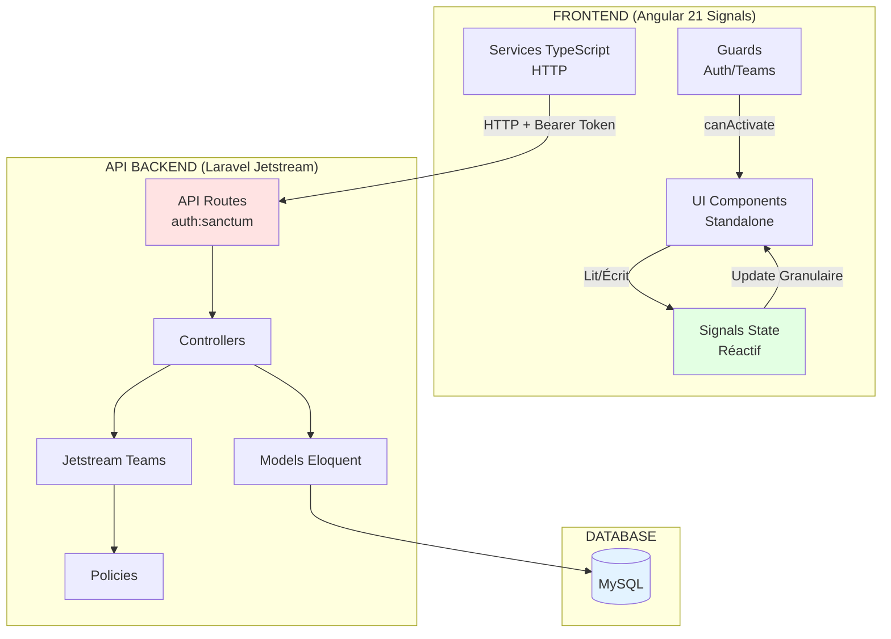
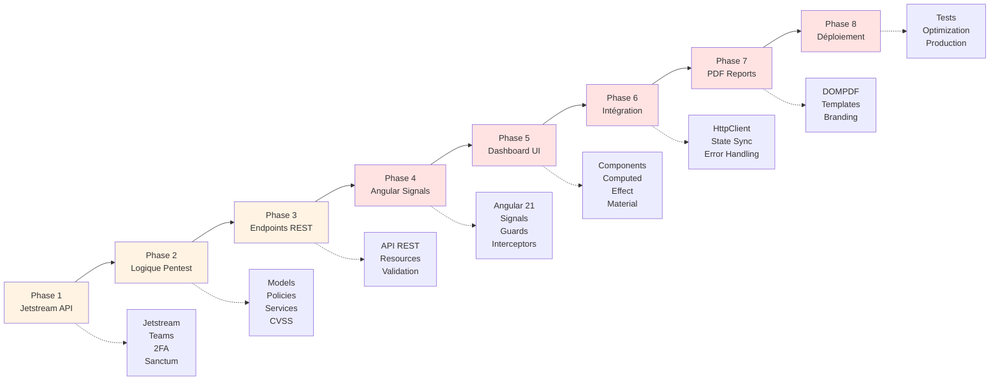

# Laravel Jetstream

<div
  class="omny-meta"
  data-level="🟡 Intermédiaire 🔴 Avancé"
  data-version="1.0"
  data-time="20-28 heures (8 phases)">
</div>

## Introduction du projet - Pentest Management Platform

Bienvenue dans ce projet **Pentest Management Platform** combinant **Laravel Jetstream** (backend API SaaS) et **Angular 21 avec Signals** (frontend moderne) ! Cette plateforme permet aux cabinets de cybersécurité de gérer leurs missions clients : création d'organisations Teams, gestion de campagnes pentest, tracking vulnérabilités (CVSS, OWASP), upload de preuves (screenshots, PoC), génération de rapports PDF automatisés, et collaboration en équipe avec rôles granulaires.

!!! note "Ce projet exploite l'architecture **API-first moderne** avec les dernières innovations Angular : backend Jetstream expose API REST sécurisée (Teams, 2FA, permissions), frontend Angular 21 utilise **Signals** pour un state management réactif, performant et simple."

Cette phase **zéro vous présente** :

- Les objectifs pédagogiques et professionnels (cybersécurité + dev SaaS)
- L'architecture complète (API Jetstream, Frontend Angular Signals, isolation Teams)
- Le workflow pentest complet (Reconnaissance → Exploitation → Reporting)
- Le rôle de Jetstream (Teams multi-tenancy, 2FA, API tokens, permissions)
- Le paradigme **Signals** d'Angular 21 (réactivité moderne sans complexité)
- La structure logique des 8 Phases (API → Frontend → Intégration → Déploiement)
- Les compétences cybersécurité + Laravel + Angular Signals acquises

!!! quote "Pourquoi Angular 21 avec Signals pour plateforme pentest ?"
    En tant que professionnel RNCP 36399 spécialisé en cybersécurité, vous avez besoin d'outils métier pour **gérer vos missions clients**. Angular 21 avec **Signals** révolutionne le développement frontend : state management **10× plus simple** que les approches précédentes, **performances optimales** (change detection granulaire), et **code maintenable** (pas de subscriptions à gérer). Combiné à Jetstream (Teams, sécurité renforcée), vous obtenez une application SaaS B2B production-ready, directement réutilisable pour consulting pentest ou comme socle technique pour OmnyShield.

## Objectifs d'Apprentissage

!!! abstract "Avant le début de la Phase 1, **vous serez capable de** :"

    - [ ] Expliquer l'architecture **API-first SaaS** (Jetstream backend, Angular frontend)
    - [ ] Identifier les 6 entités principales (**Team**, **Mission**, **Asset**, **Finding**, **Evidence**, **Report**)
    - [ ] Comprendre le système **Teams Jetstream** (isolation multi-tenancy)
    - [ ] Décrire le workflow pentest métier (Recon → Exploit → Remediation → Report)
    - [ ] Maîtriser **Jetstream + Sanctum** (Teams API, 2FA, tokens, permissions)
    - [ ] Comprendre le paradigme **Signals** (state management moderne Angular)
    - [ ] Situer chaque Phase (1 à 8) dans la progression logique
    - [ ] Anticiper les compétences cybersécurité + Laravel + Angular Signals acquises

## Finalité Pédagogique et Professionnelle

### Pourquoi construire une plateforme pentest professionnelle ?

!!! quote "Ce projet n'est **pas** un exercice académique. C'est un **outil métier professionnel** directement déployable pour vos missions cybersécurité réelles, développé avec les **technologies Angular les plus modernes** (Signals, Standalone Components, Control Flow)."

**Cas d'usage professionnels directs :**

- **Cabinet consulting pentest** → Plateforme interne gestion missions clients
- **Équipe red team entreprise** → Suivi campagnes sécurité offensives
- **Bug bounty hunters** → Centralisation découvertes vulnérabilités
- **Freelance pentest** → Portfolio professionnel avec rapports générés
- **OmnyShield** → Base technique plateforme GRC complète

**Compétences cybersécurité + dev transférables :**

- [x] Architecture SaaS multi-tenants (Teams Jetstream)
- [x] Classification vulnérabilités (CVSS v3.1, CWE, OWASP Top 10)
- [x] Workflow pentest professionnel (reconnaissance, exploitation, reporting)
- [x] Authentification 2FA obligatoire (sécurité renforcée)
- [x] API tokens (intégration scanners Burp Suite, Nuclei, OWASP ZAP)
- [x] Génération rapports PDF automatisés (DOMPDF)
- [x] Gestion preuves (uploads sécurisés S3, screenshots PoC)
- [x] Audit trail complet (logs actions sensibles Activity Log)
- [x] Frontend Angular 21 moderne (Signals, TypeScript, Material Design)

**Ce projet vous prépare directement pour :**

- Développement plateformes SaaS B2B (multi-clients)
- Applications cybersécurité professionnelles
- Outils GRC (Governance, Risk, Compliance)
- Architectures découplées API + Frontend moderne

## Architecture Globale du Projet

### Architecture Découplée API + Frontend



<small>*L'architecture sépare complètement **backend (API Laravel)** et **frontend (Angular SPA Signals)**. Angular communique via requêtes HTTP avec tokens Sanctum. **Signals** gèrent le state côté frontend de manière **réactive et performante** sans complexité de subscriptions. Jetstream gère Teams, permissions, 2FA côté backend. Cette séparation permet : scalabilité horizontale, déploiement indépendant (API VPS, Frontend CDN), et réutilisation API pour apps mobiles futures.*</small>

### Modélisation Complète de la Base de Données

=== "UseCase - Cas d'utilisation"

    !!! quote "**Diagramme des cas d'utilisation** représentant les interactions entre acteurs (Admin Team, Pentester, Client Read-Only) et fonctionnalités de la plateforme."

    ```mermaid
    graph LR
        subgraph "Acteurs"
            A[Admin Team<br/>Propriétaire]
            P[Pentester<br/>Lead/Junior]
            C[Client<br/>Read-Only]
        end
        
        subgraph "Système Pentest Platform"
            UC1[Créer organisation Team]
            UC2[Inviter membres]
            UC3[Gérer rôles/permissions]
            
            UC4[Créer mission pentest]
            UC5[Ajouter assets cibles]
            UC6[Créer findings]
            UC7[Uploader evidences]
            UC8[Rédiger recommandations]
            
            UC9[Générer rapport PDF]
            UC10[Consulter dashboard]
            UC11[Visualiser statistiques]
            UC12[Exporter données]
            
            UC13[Consulter missions assignées]
            UC14[Voir rapports finaux]
        end
        
        A --> UC1
        A --> UC2
        A --> UC3
        A --> UC4
        A --> UC9
        A --> UC10
        A --> UC12
        
        P --> UC4
        P --> UC5
        P --> UC6
        P --> UC7
        P --> UC8
        P --> UC10
        
        C --> UC13
        C --> UC14
        
        UC4 -.inclut.-> UC5
        UC6 -.inclut.-> UC7
        UC6 -.inclut.-> UC8
        UC9 -.nécessite.-> UC6
        
        style A fill:#ffe3e3
        style P fill:#e3f3ff
        style C fill:#e3ffe3
    ```

    <small>*Le système distingue trois rôles principaux : **Admin Team** (propriétaire organisation, droits complets), **Pentester** (lead ou junior, création findings), et **Client Read-Only** (consultation rapports uniquement). L'isolation Teams Jetstream garantit que chaque client accède uniquement à ses données via scoping automatique.*</small>

=== "MCD - Modèle Conceptuel"

    !!! quote "**Modèle Conceptuel de Données (MCD)** : Vue abstraite des entités métier pentest et leurs relations."

    ```mermaid
    classDiagram
        class TEAM {
            name : String
            owner_id : FK
        }
        
        class USER {
            name : String
            email : String
            two_factor_enabled : Boolean
        }
        
        class MISSION {
            name : String
            scope : Text
            type : Enum
            start_date : Date
            end_date : Date
        }
        
        class ASSET {
            type : Enum
            value : String
        }
        
        class FINDING {
            title : String
            cvss_score : Float
            severity : Enum
            cwe_id : String
            owasp_category : String
            description : Text
            impact : Text
            status : Enum
        }
        
        class EVIDENCE {
            type : Enum
            file_path : String
        }
        
        class REMEDIATION {
            recommendation : Text
            priority : Enum
        }
        
        TEAM "1" --> "0..*" USER : possède_membres
        TEAM "1" --> "0..*" MISSION : gère
        MISSION "1" --> "0..*" ASSET : cible
        MISSION "1" --> "0..*" FINDING : découvre
        FINDING "1" --> "0..*" EVIDENCE : prouve
        FINDING "1" --> "0..1" REMEDIATION : recommande
    ```
    <small>*Le MCD reflète la structure métier pentest : chaque **Team** (organisation cliente) gère ses **Missions**, chaque mission cible des **Assets** (URLs, IPs, applications) et produit des **Findings** (vulnérabilités) accompagnés d'**Evidences** (PoC, screenshots) et de **Remediations** (recommandations fixes). Jetstream ajoute automatiquement les tables `team_user` (pivot) et `personal_access_tokens` (API tokens Sanctum).*</small>

=== "MLD - Modèle Logique"

    !!! quote "**Modèle Logique de Données (MLD)** : Traduction en tables relationnelles avec clés étrangères et contraintes Teams scoping."

    ```mermaid
    erDiagram
        TEAM ||--o{ TEAM_USER : "appartient"
        TEAM ||--o{ MISSION : "gère"
        TEAM_USER {
            int team_id FK
            int user_id FK
            string role "owner/admin/pentester_lead/pentester_junior/client_ro"
        }
        
        USER {
            int id PK
            string name
            string email UK
            string password
            boolean two_factor_enabled
            text two_factor_secret "ENCRYPTED"
            text two_factor_recovery_codes "ENCRYPTED"
        }
        
        MISSION ||--o{ ASSET : "cible"
        MISSION ||--o{ FINDING : "découvre"
        MISSION {
            int id PK
            int team_id FK "SCOPED"
            string name
            text scope
            string type "web/infra/mobile/api"
            date start_date
            date end_date
            string status "planning/active/completed"
        }
        
        ASSET {
            int id PK
            int mission_id FK
            string type "url/ip/domain/app"
            string value
        }
        
        FINDING ||--o{ EVIDENCE : "prouve"
        FINDING ||--|| REMEDIATION : "recommande"
        FINDING {
            int id PK
            int mission_id FK
            int user_id FK "pentester"
            string title
            float cvss_score
            string severity "critical/high/medium/low/info"
            string cwe_id
            string owasp_category
            text description
            text impact
            text poc
            string status "open/fixed/accepted_risk"
        }
        
        EVIDENCE {
            int id PK
            int finding_id FK
            string type "screenshot/video/payload/log"
            string file_path
        }
        
        REMEDIATION {
            int id PK
            int finding_id FK
            text recommendation
            string priority "immediate/short_term/long_term"
        }
    ```
    <small>*Le MLD implémente l'**isolation Teams** via les foreign keys `team_id` : toutes les requêtes sont automatiquement scopées à la Team active de l'utilisateur (géré par Jetstream middleware). Les rôles personnalisés contrôlent les permissions CRUD via les Policies Laravel.*</small>

=== "MPD - Modèle Physique"

    !!! quote "**Modèle Physique de Données (MPD)** : Structure MySQL optimisée avec indexes performances et types de données cybersécurité."

    ```mermaid
    erDiagram
        TEAM ||--o{ MISSION : "gère"
        TEAM {
            int id PK "AUTO_INCREMENT"
            int user_id FK "owner"
            varchar_255 name "INDEX"
            boolean personal_team
            timestamp created_at
            timestamp updated_at
        }
        
        MISSION ||--o{ FINDING : "découvre"
        MISSION {
            int id PK
            int team_id FK "INDEX, CASCADE DELETE"
            varchar_255 name
            text scope
            enum type "DEFAULT 'web'"
            date start_date "INDEX"
            date end_date "INDEX"
            enum status "DEFAULT 'planning', INDEX"
            timestamp created_at
            timestamp updated_at
        }
        
        FINDING ||--o{ EVIDENCE : "prouve"
        FINDING {
            int id PK
            int mission_id FK "INDEX"
            int user_id FK "pentester, INDEX"
            varchar_255 title
            decimal cvss_score "PRECISION 3,1"
            enum severity "INDEX"
            varchar_20 cwe_id "INDEX"
            varchar_50 owasp_category "INDEX"
            longtext description
            longtext impact
            longtext poc
            enum status "DEFAULT 'open', INDEX"
            timestamp created_at
            timestamp updated_at
        }
        
        EVIDENCE {
            int id PK
            int finding_id FK "INDEX, CASCADE DELETE"
            enum type
            varchar_500 file_path
            timestamp created_at
        }
    ```

    <small>*Le MPD optimise les requêtes fréquentes : **index composite `(team_id, status)`** pour dashboards filtrés, **index `severity`** pour tri findings critiques, **index `owasp_category`** pour statistiques OWASP Top 10. Le type **DECIMAL(3,1)** pour `cvss_score` garantit précision (0.0 à 10.0).*</small>

## Rôle de Laravel Jetstream + Angular 21 Signals

### Qu'est-ce que Jetstream apporte ? (Backend API)

Laravel Jetstream est un **starter kit d'authentification avancé SaaS** qui ajoute à Breeze :

=== "Teams (Multi-Tenancy)"

    **Fonctionnalités natives :**
    
    - Création/gestion équipes (organisations clientes)
    - Invitations membres par email (JWT signed links)
    - Rôles personnalisables (owner, admin, pentester_lead, pentester_junior, client_ro)
    - Permissions granulaires (create:missions, delete:findings, generate:reports)
    - Isolation données automatique (scope queries par team_id via middleware)
    - Switch entre Teams (utilisateur peut appartenir à plusieurs organisations)
    
    **Endpoints API consommés par Angular :**
    
    ```typescript
    // Angular TeamService
    class TeamService {
      private http = inject(HttpClient);
      
      // Signal state
      teams = signal<Team[]>([]);
      currentTeam = signal<Team | null>(null);
      
      loadTeams(): void {
        this.http.get<Team[]>('/api/teams').subscribe(
          teams => this.teams.set(teams)
        );
      }
      
      switchTeam(teamId: number): void {
        this.http.put<void>('/api/user/current-team', { team_id: teamId })
          .subscribe(() => {
            const team = this.teams().find(t => t.id === teamId);
            this.currentTeam.set(team ?? null);
          });
      }
      
      inviteMember(email: string, role: string): void {
        this.http.post<void>('/api/team-invitations', { email, role })
          .subscribe(() => this.loadTeams());
      }
    }
    ```

=== "2FA (Authentification Deux Facteurs)"

    **Sécurité renforcée obligatoire :**
    
    - Configuration 2FA via QR Code (Google Authenticator, Authy)
    - Recovery codes (10 codes backup imprimables)
    - Middleware `2fa.verified` (bloquer accès API si 2FA non configuré)
    - Historique connexions avec détection anomalies
    - Révocation sessions distantes
    
    **Flow Angular avec Signals :**
    
    ```typescript
    class TwoFactorService {
      private http = inject(HttpClient);
      
      // State
      twoFactorEnabled = signal<boolean>(false);
      qrCode = signal<string | null>(null);
      recoveryCodes = signal<string[]>([]);
      
      enable2FA(): void {
        this.http.post<{ qr_code: string }>('/api/user/two-factor-authentication', {})
          .subscribe(response => {
            this.qrCode.set(response.qr_code);
          });
      }
      
      confirm2FA(code: string): void {
        this.http.post<{ recovery_codes: string[] }>(
          '/api/user/confirmed-two-factor-authentication', 
          { code }
        ).subscribe(response => {
          this.twoFactorEnabled.set(true);
          this.recoveryCodes.set(response.recovery_codes);
          this.qrCode.set(null);
        });
      }
    }
    
    // Component
    @Component({
      template: `
        @if (twoFactorService.qrCode(); as qr) {
          <mat-card>
            <mat-card-header>
              <mat-card-title>Scan QR Code</mat-card-title>
            </mat-card-header>
            <mat-card-content>
              
              <mat-form-field>
                <input matInput [(ngModel)]="confirmCode" placeholder="Code 2FA" />
              </mat-form-field>
              <button mat-raised-button (click)="confirm()">Confirmer</button>
            </mat-card-content>
          </mat-card>
        }
      `
    })
    class TwoFactorSetupComponent {
      twoFactorService = inject(TwoFactorService);
      confirmCode = signal<string>('');
      
      confirm(): void {
        this.twoFactorService.confirm2FA(this.confirmCode());
      }
    }
    ```

=== "API Tokens (Scanners Automatisés)"

    **Intégration scanners automatisés (Burp, Nuclei) :**
    
    - Génération tokens API (Sanctum intégré)
    - Permissions scopes (read:findings, write:missions, generate:reports)
    - Expiration configurable (jamais, 30 jours, 90 jours)
    - Révocation instantanée si compromis
    - Logs utilisation API (rate limiting, audit)
    
    **Angular gère tokens personnels avec Signals :**
    
    ```typescript
    class APITokenService {
      private http = inject(HttpClient);
      
      // State
      tokens = signal<APIToken[]>([]);
      generatedToken = signal<string | null>(null);
      
      loadTokens(): void {
        this.http.get<APIToken[]>('/api/user/api-tokens')
          .subscribe(tokens => this.tokens.set(tokens));
      }
      
      createToken(name: string, permissions: string[]): void {
        this.http.post<{ token: string }>('/api/user/api-tokens', { 
          name, 
          abilities: permissions 
        }).subscribe(response => {
          this.generatedToken.set(response.token);
          this.loadTokens(); // Refresh list
        });
      }
      
      revokeToken(tokenId: number): void {
        this.http.delete(`/api/user/api-tokens/${tokenId}`)
          .subscribe(() => {
            // Update signal immutably
            this.tokens.update(tokens => 
              tokens.filter(t => t.id !== tokenId)
            );
          });
      }
    }
    ```

=== "Permissions Granulaires"

    **Jetstream Permissions (définies backend, vérifiées frontend) :**
    
    ```php
    // config/jetstream.php
    'permissions' => [
        'missions' => ['create', 'read', 'update', 'delete'],
        'findings' => ['create', 'read', 'update', 'delete', 'approve'],
        'reports' => ['generate', 'download'],
    ],
    ```
    
    **Angular vérifie permissions avec Signals :**
    
    ```typescript
    class PermissionService {
      private http = inject(HttpClient);
      
      // State
      currentUser = signal<User | null>(null);
      
      // Computed permissions
      canCreateMission = computed(() => 
        this.currentUser()?.permissions.includes('missions:create') ?? false
      );
      
      canDeleteFinding = computed(() =>
        this.currentUser()?.permissions.includes('findings:delete') ?? false
      );
      
      hasRole = (role: string) => computed(() =>
        this.currentUser()?.role === role
      );
    }
    
    // Component
    @Component({
      template: `
        @if (permissionService.canCreateMission()) {
          <button mat-fab (click)="createMission()">
            <mat-icon>add</mat-icon>
          </button>
        }
      `
    })
    ```

### Qu'est-ce qu'Angular 21 Signals apporte ? (Frontend SPA)

**Angular 21 Signals** révolutionne la gestion d'état frontend avec une approche **simple, performante et moderne**.

=== "Paradigme Signals : Réactivité Sans Complexité"

    **Les Signals sont la nouvelle fondation d'Angular pour gérer l'état réactif :**
    
    !!! quote "**Pourquoi Signals remplace les approches précédentes ?**"
        Les Signals simplifient radicalement la gestion d'état : plus besoin de gérer des subscriptions, pas de risque de memory leaks, change detection optimisée automatiquement. C'est la **direction officielle d'Angular** pour le futur.
    
    **Concepts fondamentaux :**
    
    ```typescript
    import { signal, computed, effect } from '@angular/core';
    
    // 1. Signal basique (state mutable)
    const count = signal(0);
    
    // Lecture : appel fonction
    console.log(count()); // 0
    
    // Écriture : .set() ou .update()
    count.set(5);
    count.update(n => n + 1); // 6
    
    // 2. Computed signal (dérivation automatique)
    const double = computed(() => count() * 2);
    console.log(double()); // 12 (se met à jour automatiquement)
    
    // 3. Effect (side effect réactif)
    effect(() => {
      console.log('Count changed:', count());
      // S'exécute automatiquement à chaque changement de count
    });
    ```
    
    **Avantages pour plateforme pentest :**
    
    | Avantage | Impact | Exemple Pentest |
    |----------|--------|----------------|
    | **Simplicité** | Code 50% plus court | State missions sans subscribe/unsubscribe |
    | **Performance** | Change detection granulaire | Update 1 finding → re-render seulement composant concerné |
    | **Type Safety** | TypeScript compile-time | `signal<Finding[]>()` garantit type |
    | **Pas de leaks** | Impossible d'oublier unsubscribe | Effect se nettoie automatiquement |
    | **Computed auto** | Re-calcul intelligent | Total critical findings toujours synchronisé |

=== "State Management avec Signals"

    **Gestion état plateforme pentest avec Signals :**
    
    ```typescript
    // services/mission-state.service.ts
    import { Injectable, signal, computed } from '@angular/core';
    import { inject } from '@angular/core';
    import { HttpClient } from '@angular/common/http';
    
    @Injectable({ providedIn: 'root' })
    export class MissionStateService {
      private http = inject(HttpClient);
      
      // ============================================
      // STATE SIGNALS
      // ============================================
      
      // Missions list
      missions = signal<Mission[]>([]);
      
      // Selected mission (détail)
      selectedMission = signal<Mission | null>(null);
      
      // Loading states
      loading = signal<boolean>(false);
      error = signal<string | null>(null);
      
      // ============================================
      // COMPUTED SIGNALS (dérivations automatiques)
      // ============================================
      
      // Missions actives (filtre automatique)
      activeMissions = computed(() => 
        this.missions().filter(m => m.status === 'active')
      );
      
      // Missions complétées
      completedMissions = computed(() =>
        this.missions().filter(m => m.status === 'completed')
      );
      
      // Stats mission sélectionnée
      selectedMissionStats = computed(() => {
        const mission = this.selectedMission();
        if (!mission) return null;
        
        const findings = mission.findings || [];
        return {
          total: findings.length,
          critical: findings.filter(f => f.severity === 'critical').length,
          high: findings.filter(f => f.severity === 'high').length,
          medium: findings.filter(f => f.severity === 'medium').length,
          low: findings.filter(f => f.severity === 'low').length,
          avgCVSS: findings.reduce((sum, f) => sum + f.cvss_score, 0) / findings.length || 0
        };
      });
      
      // ============================================
      // ACTIONS (modifient signals)
      // ============================================
      
      loadMissions(teamId: number): void {
        this.loading.set(true);
        this.error.set(null);
        
        this.http.get<Mission[]>(`/api/teams/${teamId}/missions`)
          .subscribe({
            next: missions => {
              this.missions.set(missions);
              this.loading.set(false);
            },
            error: err => {
              this.error.set(err.message);
              this.loading.set(false);
            }
          });
      }
      
      selectMission(missionId: number): void {
        this.http.get<Mission>(`/api/missions/${missionId}`)
          .subscribe(mission => this.selectedMission.set(mission));
      }
      
      createMission(mission: CreateMissionDTO): void {
        this.http.post<Mission>('/api/missions', mission)
          .subscribe(newMission => {
            // Update immutable : copie tableau + ajout
            this.missions.update(missions => [...missions, newMission]);
          });
      }
      
      addFinding(finding: Finding): void {
        // Update nested state immutably
        this.selectedMission.update(mission => {
          if (!mission) return null;
          return {
            ...mission,
            findings: [...mission.findings, finding],
            findings_count: mission.findings_count + 1
          };
        });
        
        // Update liste missions aussi (findings_count)
        this.missions.update(missions =>
          missions.map(m => 
            m.id === finding.mission_id
              ? { ...m, findings_count: m.findings_count + 1 }
              : m
          )
        );
      }
      
      updateFindingSeverity(findingId: number, severity: string, cvss: number): void {
        this.selectedMission.update(mission => {
          if (!mission) return null;
          return {
            ...mission,
            findings: mission.findings.map(f =>
              f.id === findingId 
                ? { ...f, severity, cvss_score: cvss }
                : f
            )
          };
        });
      }
      
      deleteMission(missionId: number): void {
        this.http.delete(`/api/missions/${missionId}`)
          .subscribe(() => {
            this.missions.update(missions =>
              missions.filter(m => m.id !== missionId)
            );
            if (this.selectedMission()?.id === missionId) {
              this.selectedMission.set(null);
            }
          });
      }
    }
    ```

=== "Components avec Signals"

    **Composants Angular consomment Signals directement :**
    
    ```typescript
    // components/mission-dashboard.component.ts
    import { Component, inject, effect } from '@angular/core';
    import { MissionStateService } from '@services/mission-state.service';
    
    @Component({
      selector: 'app-mission-dashboard',
      standalone: true,
      imports: [MatCardModule, MatButtonModule, MatIconModule],
      template: `
        <div class="dashboard">
          <!-- Header avec stats -->
          <div class="stats-row">
            <mat-card>
              <mat-card-header>
                <mat-card-title>Missions Actives</mat-card-title>
              </mat-card-header>
              <mat-card-content>
                <h2>{{ missionService.activeMissions().length }}</h2>
              </mat-card-content>
            </mat-card>
            
            <mat-card>
              <mat-card-header>
                <mat-card-title>Total Missions</mat-card-title>
              </mat-card-header>
              <mat-card-content>
                <h2>{{ missionService.missions().length }}</h2>
              </mat-card-content>
            </mat-card>
          </div>
          
          <!-- Loading state -->
          @if (missionService.loading()) {
            <mat-spinner></mat-spinner>
          }
          
          <!-- Error state -->
          @if (missionService.error(); as error) {
            <mat-error>{{ error }}</mat-error>
          }
          
          <!-- Missions list -->
          <div class="missions-grid">
            @for (mission of missionService.activeMissions(); track mission.id) {
              <app-mission-card 
                [mission]="mission"
                (click)="selectMission(mission.id)" />
            } @empty {
              <p>Aucune mission active</p>
            }
          </div>
          
          <!-- Detail mission sélectionnée -->
          @if (missionService.selectedMission(); as mission) {
            <mat-card class="mission-detail">
              <mat-card-header>
                <mat-card-title>{{ mission.name }}</mat-card-title>
                <mat-card-subtitle>
                  {{ mission.start_date }} - {{ mission.end_date }}
                </mat-card-subtitle>
              </mat-card-header>
              
              <mat-card-content>
                <!-- Stats findings (computed signal) -->
                @if (missionService.selectedMissionStats(); as stats) {
                  <div class="findings-stats">
                    <div class="stat critical">
                      <span>Critical</span>
                      <strong>{{ stats.critical }}</strong>
                    </div>
                    <div class="stat high">
                      <span>High</span>
                      <strong>{{ stats.high }}</strong>
                    </div>
                    <div class="stat medium">
                      <span>Medium</span>
                      <strong>{{ stats.medium }}</strong>
                    </div>
                    <div class="stat low">
                      <span>Low</span>
                      <strong>{{ stats.low }}</strong>
                    </div>
                    <div class="stat avg-cvss">
                      <span>Avg CVSS</span>
                      <strong>{{ stats.avgCVSS | number:'1.1-1' }}</strong>
                    </div>
                  </div>
                }
                
                <!-- Findings list -->
                <app-findings-list [findings]="mission.findings" />
              </mat-card-content>
            </mat-card>
          }
        </div>
      `
    })
    export class MissionDashboardComponent {
      missionService = inject(MissionStateService);
      
      constructor() {
        // Effect : réagit automatiquement aux changements
        effect(() => {
          const mission = this.missionService.selectedMission();
          if (mission) {
            console.log('Mission selected:', mission.name);
            this.trackAnalytics(mission.id);
          }
        });
        
        // Load missions au démarrage
        const teamId = inject(ActivatedRoute).snapshot.params['teamId'];
        this.missionService.loadMissions(teamId);
      }
      
      selectMission(missionId: number): void {
        this.missionService.selectMission(missionId);
      }
      
      private trackAnalytics(missionId: number): void {
        // Send analytics event
      }
    }
    ```
    
    **Points clés :**
    
    - ✅ **Pas de `.subscribe()`** : Signals lus directement dans template
    - ✅ **Pas de `ngOnDestroy`** : Effect se nettoie automatiquement
    - ✅ **Control flow moderne** : `@if`, `@for`, `@empty` (Angular 17+)
    - ✅ **Change detection optimale** : Seulement composants utilisant signal concerné

=== "Communication HTTP avec Signals"

    **Convertir Observables HTTP en Signals :**
    
    Angular fournit `toSignal()` pour convertir Observables en Signals, mais dans notre cas, on **préfère laisser HTTP asynchrone** et mettre à jour les Signals manuellement pour plus de contrôle.
    
    ```typescript
    // Pattern recommandé : HTTP → subscribe → update signal
    class FindingService {
      private http = inject(HttpClient);
      
      findings = signal<Finding[]>([]);
      loading = signal<boolean>(false);
      
      loadFindings(missionId: number): void {
        this.loading.set(true);
        
        this.http.get<Finding[]>(`/api/missions/${missionId}/findings`)
          .subscribe({
            next: findings => {
              this.findings.set(findings);
              this.loading.set(false);
            },
            error: err => {
              console.error(err);
              this.loading.set(false);
            }
          });
      }
      
      createFinding(finding: CreateFindingDTO): void {
        this.http.post<Finding>('/api/findings', finding)
          .subscribe(newFinding => {
            // Optimistic update
            this.findings.update(findings => [...findings, newFinding]);
          });
      }
    }
    
    // Pattern alternatif : toSignal() pour streams continus
    class NotificationService {
      private http = inject(HttpClient);
      
      // WebSocket stream → Signal
      notifications$ = this.http.get<Notification[]>('/api/notifications/stream');
      notifications = toSignal(this.notifications$, { initialValue: [] });
    }
    ```

=== "TypeScript Strict avec Signals"

    **Type safety complet avec TypeScript + Signals :**
    
    ```typescript
    // models/finding.model.ts
    export interface Finding {
      id: number;
      mission_id: number;
      title: string;
      cvss_score: number; // 0.0-10.0
      severity: 'critical' | 'high' | 'medium' | 'low' | 'info';
      cwe_id: string; // "CWE-89"
      owasp_category: string; // "A03:2021-Injection"
      description: string;
      impact: string;
      poc: string;
      status: 'open' | 'fixed' | 'accepted_risk';
      created_at: Date;
      user?: User;
      evidences?: Evidence[];
      remediation?: Remediation;
    }
    
    // Service typé strictement
    class FindingService {
      // Signal typé
      findings = signal<Finding[]>([]);
      
      // Computed typé
      criticalFindings = computed<Finding[]>(() =>
        this.findings().filter(f => f.severity === 'critical')
      );
      
      // Méthode typée
      calculateSeverity(cvssScore: number): Finding['severity'] {
        if (cvssScore >= 9.0) return 'critical';
        if (cvssScore >= 7.0) return 'high';
        if (cvssScore >= 4.0) return 'medium';
        if (cvssScore >= 0.1) return 'low';
        return 'info';
      }
      
      // Update typé sûr
      updateFinding(id: number, updates: Partial<Finding>): void {
        this.findings.update(findings =>
          findings.map(f => f.id === id ? { ...f, ...updates } : f)
        );
      }
    }
    ```

## Pourquoi Angular 21 Signals pour Plateforme SaaS Pentest ?

**Angular 21 avec Signals est le choix optimal pour cette plateforme professionnelle car :**

<div class="cards grid" markdown>

- :fontawesome-solid-bolt-lightning: **1. Simplicité Radicale**

    ---

    - **50% moins de code** : Pas de subscribe/unsubscribe
    - **API intuitive** : signal(), computed(), effect()
    - **Courbe apprentissage douce** : Concepts simples
    - **Maintenance facile** : Moins de bugs (pas de leaks)

- :fontawesome-solid-rocket: **2. Performances Optimales**

    ---

    - **Change detection granulaire** : Update seulement composants concernés
    - **Computed intelligent** : Re-calcul seulement si dépendances changent
    - **Pas de Zone.js overhead** : Angular future sans Zone.js
    - **Benchmarks** : 2-3× plus rapide que approches précédentes

- :fontawesome-solid-shield-halved: **3. Type Safety Complète**

    ---

    - **TypeScript natif** : signal<Finding[]>() type strict
    - **Erreurs compile-time** : Pas de `undefined` surprise
    - **Refactoring sûr** : IDE détecte impacts changements
    - **Autocomplete intelligent** : Propriétés suggérées

- :fontawesome-solid-building: **4. Architecture Scalable**

    ---

    - **Standalone components** : Imports explicites, tree-shaking optimal
    - **Signals partagés** : Services injectés, state global simple
    - **Computed chains** : Dérivations complexes élégantes
    - **Pas de NgRx requis** : Signals suffisent pour 90% cas

</div>

**Comparaison avec autres approches :**

| Aspect | **Signals (Angular 21)** | Services + Subjects | NgRx/NGRX Signal Store |
|--------|-------------------------|---------------------|------------------------|
| **Complexité** | ⭐ Très simple | ⭐⭐⭐ Moyen | ⭐⭐⭐⭐⭐ Complexe |
| **Boilerplate** | ✅ Minimal | 🟡 Moyen | ❌ Énorme |
| **Memory Leaks** | ✅ Impossible | ⚠️ Si oubli unsubscribe | ✅ Géré |
| **Performance** | ⭐⭐⭐⭐⭐ Excellent | ⭐⭐⭐ Moyen | ⭐⭐⭐⭐ Bon |
| **Courbe apprentissage** | ⭐⭐ Douce | ⭐⭐⭐ Moyenne | ⭐⭐⭐⭐⭐ Steep |
| **Debugging** | ✅ Simple (valeurs directes) | 🟡 DevTools requis | 🟡 Redux DevTools |
| **Future-proof** | ✅ Direction officielle Angular | ❌ Legacy pattern | 🟡 Évoluera vers Signals |

**Pour plateforme SaaS B2B professionnelle → Signals est le choix évident.**

## Structure des 8 Phases

!!! quote "Progression logique : Backend API Jetstream → Frontend Angular Signals → Intégration → Déploiement production."

<div class="cards grid" markdown>

- :fontawesome-solid-server: **Phase 1 : API Laravel Jetstream**

    ---

    **Temps :** 1h30-2h  
    **Objectif :** Installer Laravel 11 + Jetstream + Sanctum  
    **Livrables :**

    - API Laravel fonctionnelle
    - Jetstream installé (Teams, 2FA, API tokens)
    - Endpoints auth testés (Postman)
    - Sanctum configured (CORS, SPA auth)

    ---

    🟡 Intermédiaire

- :fontawesome-solid-database: **Phase 2 : Modèles et Logique Pentest**

    ---

    **Temps :** 3h-4h  
    **Objectif :** Créer BDD complète + logique métier  
    **Livrables :**

    - Migrations (teams, missions, assets, findings, evidences, remediations)
    - Modèles avec relations + scopes Teams
    - Services métier (CVSSCalculator, FindingService)
    - Policies (Team-scoped authorization)
    - Seeders (missions OWASP Top 10, données test)

    ---

    🔴 Avancé

- :fontawesome-solid-code: **Phase 3 : Endpoints API REST**

    ---

    **Temps :** 3h-4h  
    **Objectif :** Implémenter tous endpoints API  
    **Livrables :**

    - GET /api/teams
    - POST /api/missions
    - GET /api/missions/{id}/findings
    - POST /api/findings
    - POST /api/evidences (upload S3)
    - GET /api/reports/{mission}/pdf
    - API Resources (sérialisation JSON)
    - Tests Postman collection complète

    ---

    🔴 Avancé

- :fontawesome-brands-angular: **Phase 4 : Setup Angular 21 + Signals**

    ---

    **Temps :** 1h30-2h  
    **Objectif :** Initialiser projet Angular moderne  
    **Livrables :**

    - Projet Angular 21 (standalone components)
    - Configuration proxy API (éviter CORS dev)
    - AuthService avec Signals (currentUser, tokens)
    - HTTP Interceptor (injection Bearer token)
    - Guards (Auth, 2FA, Team)
    - Material Design installé
    - Routing structure (lazy loading)

    ---

    🟡 Intermédiaire

</div>

<div class="cards grid" markdown>

- :fontawesome-solid-palette: **Phase 5 : Interface Dashboard (Angular Signals)**

    ---

    **Temps :** 5h-7h  
    **Objectif :** Créer UI complète avec Signals  
    **Livrables :**

    - Dashboard analytics (CVSS distribution charts)
    - Gestion Teams (switch, invitations Signals)
    - CRUD Missions (formulaires Material)
    - CRUD Findings (table + détail Signals)
    - Upload evidences (drag & drop)
    - CVSS Calculator (composant interactif)
    - Timeline mission (Gantt chart)
    - State management Signals (services)

    ---

    🔴 Avancé

- :fontawesome-solid-link: **Phase 6 : Intégration API ↔ Frontend**

    ---

    **Temps :** 3h-4h  
    **Objectif :** Connecter Angular avec API Laravel  
    **Livrables :**

    - Services Angular typés (MissionService, FindingService)
    - Signals state synchronisé avec API
    - Error handling (interceptor + notifications)
    - Loading states (spinners, skeleton)
    - Optimistic updates (UI réactive)
    - Computed signals (stats auto)

    ---

    🔴 Avancé

- :fontawesome-solid-file-pdf: **Phase 7 : Génération Rapports PDF**

    ---

    **Temps :** 2h-3h  
    **Objectif :** Export rapports pentest professionnels  
    **Livrables :**

    - Template PDF Laravel (DOMPDF)
    - Sections : Executive Summary, Findings, Recommendations
    - Graphiques (Chart.js → image)
    - Logo client + branding custom
    - Endpoint : GET /api/reports/{mission}/pdf
    - Téléchargement Angular (saveAs blob)

    ---

    🔴 Avancé

- :fontawesome-solid-rocket: **Phase 8 : Tests et Déploiement**

    ---

    **Temps :** 3h-4h  
    **Objectif :** Tests + déploiement production  
    **Livrables :**

    - Tests Feature Laravel (Teams isolation)
    - Tests Unit (CVSS calculator)
    - Optimisations (indexes, caches, lazy loading)
    - Build production Angular (AOT, minify)
    - Déploiement backend (VPS/Vapor)
    - Déploiement frontend (Netlify/Vercel)
    - SSL + CORS configurés

    ---

    🔴 Avancé

</div>

## Architecture Technique Résumée

=== "Stack Technologique"

    | Composant | Technologie | Rôle |
    |-----------|-------------|------|
    | **Backend API** | Laravel 11 | Logique métier, BDD, authentification |
    | **Auth/Teams** | Jetstream + Sanctum | Teams multi-tenancy, 2FA, API tokens |
    | **Base de Données** | MySQL 8.0+ / PostgreSQL | Stockage données |
    | **Frontend SPA** | **Angular 21** | Interface utilisateur professionnelle |
    | **State Management** | **Signals** (natif Angular) | Gestion état réactif moderne |
    | **UI Components** | Angular Material | Design system Material Design |
    | **HTTP Client** | HttpClient + Interceptors | Appels API, injection tokens |
    | **Charts** | Chart.js / ng2-charts | Visualisations analytics |
    | **PDF** | DOMPDF / wkhtmltopdf | Génération rapports backend |
    | **Uploads** | S3 (AWS/DigitalOcean) | Stockage evidences |

=== "Flow Communication API ↔ Frontend"

    **Flow requête typique avec Signals :**
    
    ```
    1. User clique "Créer Finding" (Angular Component)
    2. Component appelle FindingService.createFinding()
    3. Service signal loading.set(true)
    4. Service envoie POST /api/findings (HttpClient)
    5. Interceptor injecte : Authorization: Bearer {token}
    6. Laravel middleware auth:sanctum vérifie token
    7. Middleware Teams scope query (team_id actuel)
    8. Policy FindingPolicy vérifie permission create:findings
    9. Controller crée finding en BDD
    10. API retourne JSON (API Resource)
    11. HttpClient Observable émet réponse
    12. Service findings.update() ajoute finding (immutable)
    13. Signal change déclenche change detection granulaire
    14. Composant utilisant findings() se met à jour automatiquement
    15. Computed signals (stats) se recalculent automatiquement
    ```

=== "Architecture Fichiers Angular"

    ```
    src/
    ├── app/
    │   ├── core/
    │   │   ├── guards/
    │   │   │   ├── auth.guard.ts
    │   │   │   ├── two-factor.guard.ts
    │   │   │   └── team.guard.ts
    │   │   ├── interceptors/
    │   │   │   ├── auth-token.interceptor.ts
    │   │   │   └── error.interceptor.ts
    │   │   └── services/
    │   │       ├── auth.service.ts (Signals)
    │   │       └── team.service.ts (Signals)
    │   ├── features/
    │   │   ├── missions/
    │   │   │   ├── services/
    │   │   │   │   └── mission-state.service.ts (Signals)
    │   │   │   ├── components/
    │   │   │   │   ├── mission-dashboard.component.ts
    │   │   │   │   ├── mission-form.component.ts
    │   │   │   │   └── mission-card.component.ts
    │   │   │   └── mission.routes.ts
    │   │   ├── findings/
    │   │   │   ├── services/
    │   │   │   │   └── finding-state.service.ts (Signals)
    │   │   │   ├── components/
    │   │   │   │   ├── findings-list.component.ts
    │   │   │   │   ├── finding-detail.component.ts
    │   │   │   │   └── cvss-calculator.component.ts
    │   │   │   └── finding.routes.ts
    │   │   └── reports/
    │   │       └── ...
    │   ├── shared/
    │   │   ├── models/
    │   │   │   ├── mission.model.ts
    │   │   │   ├── finding.model.ts
    │   │   │   └── user.model.ts
    │   │   └── components/
    │   │       └── ...
    │   └── app.routes.ts
    └── main.ts
    ```

## Progression des Compétences



## Fonctionnalités Complètes de la Plateforme

### Pour les Admins Team (Propriétaires)

<div class="cards grid" markdown>

- :fontawesome-solid-users-gear: **Gestion Organisation**

    ---

    - Créer/Renommer Team
    - Inviter membres (email + rôle)
    - Assigner rôles custom
    - Révoquer accès membres
    - Switch entre Teams (Angular dropdown Signal)
    - Configurer 2FA obligatoire

- :fontawesome-solid-clipboard-list: **Gestion Missions**

    ---

    - Créer missions (web, mobile, infra, API)
    - Définir scope/assets cibles
    - Assigner pentesters
    - Suivre progression (planning → active → completed)
    - Générer rapport final PDF
    - Exporter données (JSON, CSV)

</div>

### Pour les Pentesters (Lead/Junior)

<div class="cards grid" markdown>

- :fontawesome-solid-bug: **Gestion Findings**

    ---

    - Créer finding (CVSS calculator intégré)
    - Mapper CWE ID + OWASP category
    - Uploader evidences (drag & drop S3)
    - Rédiger PoC détaillé
    - Recommandations remédiation
    - Suivre statut (open → fixed → accepted_risk)

- :fontawesome-solid-chart-pie: **Dashboard Analytics (Signals)**

    ---

    - Distribution findings par severity (pie chart réactif)
    - Timeline mission (Gantt chart interactif)
    - OWASP Top 10 coverage (bar chart)
    - Statistiques Team (computed signals auto)
    - Stats temps réel (change detection granulaire)

</div>

### Pour les Clients (Read-Only)

<div class="cards grid" markdown>

- :fontawesome-solid-eye: **Consultation**

    ---

    - Voir missions assignées
    - Consulter findings validés
    - Télécharger rapports PDF finaux
    - Suivre progression remédiation
    - Dashboard read-only

</div>

## Prérequis et Environnement

### Connaissances Requises

<div class="cards grid" markdown>

- :fontawesome-solid-circle-check: **Indispensables**

    ---

    - [x] **Laravel Breeze maîtrisé** (authentification, CRUD)
    - [x] **TypeScript** (interfaces, types, génériques)
    - [x] **Angular bases** (components, services, routing)
    - [x] Bases cybersécurité (CVSS, OWASP, CWE)
    - [x] PHP 8.2+ (POO, interfaces)
    - [x] SQL avancé (relations, indexes, transactions)

- :fontawesome-solid-circle-half-stroke: **Recommandées**

    ---

    - 🟡 Architecture SaaS (multi-tenancy)
    - 🟡 API REST (verbes HTTP, statelessness)
    - 🟡 Angular Material (components, theming)
    - 🟡 Tests E2E (Cypress)

- :fontawesome-solid-graduation-cap: **Apprises durant le projet**

    ---

    - [x] **Signals Angular** (signal, computed, effect)
    - [x] Standalone components Angular 21
    - [x] Control flow moderne (@if, @for)
    - [x] Jetstream Teams + Permissions
    - [x] Sanctum API tokens

</div>

### Environnement Technique

**Backend Laravel :**

```bash
# Installer Jetstream + Sanctum
composer require laravel/jetstream
php artisan jetstream:install api

# Packages supplémentaires
composer require barryvdh/laravel-dompdf
composer require spatie/laravel-activitylog
composer require league/flysystem-aws-s3-v3
```

**Frontend Angular 21 :**

```bash
# Installer Angular CLI
npm install -g @angular/cli@21

# Créer projet (standalone par défaut)
ng new pentest-platform --routing --style=scss

# Packages
npm install @angular/material @angular/cdk
npm install chart.js ng2-charts
npm install file-saver
npm install @types/file-saver --save-dev

# Material setup
ng add @angular/material
```

## Checklist de Validation

- [ ] Je comprends l'**architecture API-first** (Jetstream backend, Angular frontend)
- [ ] Je connais les **6 entités pentest** (Mission, Asset, Finding, Evidence, Remediation, Report)
- [ ] Je visualise le **workflow pentest** (recon → exploit → report)
- [ ] Je comprends **Jetstream Teams** (isolation multi-tenancy)
- [ ] Je maîtrise **Angular bases** (components, services, routing)
- [ ] Je comprends le paradigme **Signals** (signal, computed, effect)
- [ ] Je connais **TypeScript** (interfaces, types strictes)
- [ ] Je sais ce que contiennent les **8 Phases**
- [ ] J'ai vérifié les **prérequis techniques** (PHP 8.2+, Node 22+, Angular CLI)
- [ ] Je suis prêt à investir **20-28h** pour compléter le projet
- [ ] J'ai une base solide en cybersécurité (CVSS, OWASP, vulnérabilités)

## Ce que vous allez construire

<div class="cards grid" markdown>

- :fontawesome-solid-shield-halved: **Plateforme SaaS Pentest Production-Ready**

    ---

    - [x] **Backend API Laravel Jetstream** (Teams, 2FA, Sanctum)
    - [x] **Frontend Angular 21 avec Signals** (state management moderne)
    - [x] **Multi-clients Teams** avec isolation données stricte
    - [x] **Authentification 2FA obligatoire** (QR Code)
    - [x] **Workflow pentest complet** (missions → findings → rapports)
    - [x] **Classification CVSS/OWASP** automatique (calculator intégré)
    - [x] **Upload evidences sécurisé** (S3, drag & drop)
    - [x] **Génération rapports PDF** professionnels (logo client)
    - [x] **API tokens** pour scanners (Burp Suite, Nuclei)
    - [x] **Dashboard analytics réactif** (charts Chart.js + Signals)
    - [x] **Audit trail** (Activity Log toutes actions)
    - [x] **Responsive** (mobile/desktop Material Design)
    - [x] **Performances optimales** (change detection granulaire Signals)

</div>

<br />