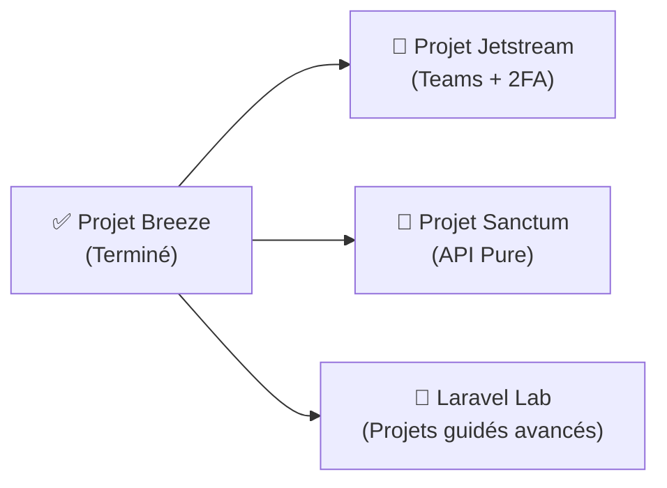

# Conclusion — Projet Breeze Terminé

## Ce que vous avez accompli

!!! success "Félicitations !"
    Vous avez construit une application d'authentification **complète et déployée en production**. Ce n'est pas un exercice d'école — c'est une application fonctionnelle avec des pratiques professionnelles.

### Récapitulatif des compétences acquises

| Phase | Compétence clé |
|---|---|
| Phase 1 | Installation et configuration d'un projet Laravel + Breeze |
| Phase 2 | Migrations, modèles Eloquent et factory |
| Phase 3 | Templates Blade, composants réutilisables, Tailwind CSS |
| Phase 4 | Upload de fichiers sécurisé, validation MIME |
| Phase 5 | Middleware personnalisé, Policies d'autorisation |
| Phase 6 | Feature Tests PHPUnit de bout en bout |
| Phase 7 | Déploiement VPS, Nginx, SSL, optimisations production |

## Que faire ensuite ?

 

---

## Conclusion

!!! quote "Ce qu'il faut retenir"
    Le projet Breeze vous a donné quelque chose de plus précieux que du code fonctionnel : une **compréhension profonde de l'authentification Laravel**. Vous avez lu le code généré, vous l'avez étendu, testé et déployé. Ce niveau de maîtrise vous permet désormais d'aborder Jetstream et Sanctum sans être intimidé par leur complexité — vous savez ce qui se cache derrière.

> [Passer au projet Jetstream pour une architecture SaaS multi-teams →](./../project-jetstream/)
