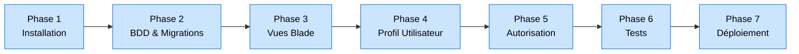

# Projet Breeze — Application d'Authentification Complète

## Introduction

!!! quote "Qu'est-ce que ce projet ?"
    **Laravel Breeze** est le kit de démarrage officiel le plus léger de Laravel. Contrairement à Jetstream (qui inclut Teams, 2FA, API tokens dès l'installation), Breeze se concentre sur l'essentiel : **inscription, connexion, réinitialisation de mot de passe, et vérification d'email**. C'est le point d'entrée idéal pour comprendre l'authentification Laravel sans la complexité d'un kit complet.

Ce projet guidé vous accompagne sur **7 phases progressives**, de l'installation à la personnalisation complète d'une application authentifiée, avec une interface Blade et Tailwind.

 

---

## Architecture du Projet

 

---

## Structure du Projet

| Phase | Contenu | Durée estimée |
|---|---|---|
| **Phase 1** | Installation Laravel + Breeze, configuration `.env`, structure | 45 min |
| **Phase 2** | Migrations, modèle User, relations | 1h |
| **Phase 3** | Personnalisation des vues Blade (login, register, dashboard) | 1h30 |
| **Phase 4** | Page de profil, mise à jour utilisateur, upload avatar | 1h |
| **Phase 5** | Middleware, autorisation, protection des routes | 45 min |
| **Phase 6** | Tests PHPUnit (Feature tests d'authentification) | 1h |
| **Phase 7** | Déploiement sur VPS, configuration Nginx + SSL | 1h |

 

---

## Prérequis

!!! info "Avant de commencer ce projet"
    - ✅ Avoir complété les modules **Controllers** (11) et **Validation** (12)
    - ✅ Connaître les bases d'**Eloquent** (15-16)
    - ✅ Avoir lu le module **Authentification** (21-22)
    - ✅ Node.js installé (`npm` pour Vite/Tailwind)
    - ✅ Serveur MySQL ou PostgreSQL configuré

 

---

## Conclusion

!!! quote "Ce qu'il faut retenir"
    Breeze n'est pas un raccourci — c'est une fondation. Ce projet vous apprend à **posséder** votre système d'authentification : comprendre chaque middleware, chaque guard, chaque vue générée. C'est cette compréhension qui vous permettra d'étendre Breeze avec vos propres fonctionnalités sans vous perdre dans du code que vous n'avez pas écrit.

> [Commencer : Phase 1 — Installation →](./phase1.md)
