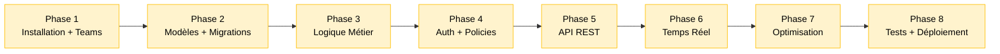

# Projet Jetstream — Plateforme SaaS Multi-Teams

## Introduction

!!! quote "Qu'est-ce que ce projet ?"
    **Laravel Jetstream** est le kit d'authentification avancé de Laravel. Il va bien au-delà de Breeze en incluant nativement : **Teams** (multi-tenant), **2FA** (authentification à deux facteurs), **API tokens (Sanctum)**, **gestion de profil complète**, et le choix entre Livewire ou Inertia.js pour le frontend.

Ce projet guidé simule la construction d'une **plateforme de gestion de missions Pentest** en mode SaaS multi-équipes — un cas d'usage réel et représentatif des applications Jetstream en production.

 

---

## Architecture du Projet

 

---

## Prérequis

!!! warning "Ce projet est avancé"
    - ✅ Maîtriser les projets Breeze (Phases 1-7)
    - ✅ Connaître les Policies et le RBAC (modules 24-26)
    - ✅ Avoir lu les modules Services et State Machine (28-29)
    - ✅ Connaître les bases des Queues (41)
    - ✅ Node.js + Redis installés

 

---

## Conclusion

!!! quote "Ce qu'il faut retenir"
    Jetstream est la référence pour les applications Laravel en production avec des besoins d'authentification avancés. La complexité de sa configuration initiale est compensée par la richesse des fonctionnalités livrées clé en main. Ce projet vous confrontera aux défis réels d'un SaaS : isolation des données par tenant, gestion des droits multi-niveaux, et scalabilité. C'est le projet le plus proche d'une application professionnelle réelle.

> [Commencer : Phase 1 — Installation Jetstream + Teams →](./01-phase1.md)
