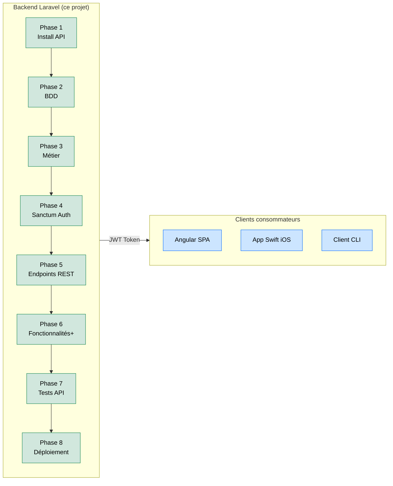

# Projet Sanctum — API RESTful Pure & Stateless

## Introduction

!!! quote "Qu'est-ce que ce projet ?"
    **Laravel Sanctum** en mode API Pure est le pattern d'architecture pour les applications qui séparent complètement le backend (Laravel API) du frontend (Angular, React, application mobile). Contrairement au mode SPA (cookies de session), ce mode utilise des **Personal Access Tokens** — chaque requête doit transporter son token dans le header `Authorization: Bearer`.

Ce projet guidé construit une **API de gestion de ressources** consommable par n'importe quel client : une application Angular, une app mobile Swift, ou un outil CLI.

 

---

## Architecture du Projet

 

---

## Prérequis

!!! info "Prérequis recommandés"
    - ✅ Maîtriser les Relations Eloquent (module 16)
    - ✅ Avoir lu le module API et Sanctum (module 42)
    - ✅ Connaître les Form Requests (module 12)
    - ✅ Notions de base en Queues (module 41)
    - ✅ Un client HTTP installé (Postman, Hoppscotch, Bruno)

 

---

## Conclusion

!!! quote "Ce qu'il faut retenir"
    Ce projet vous enseigne la compétence la plus demandée du marché Laravel : **concevoir et livrer une API REST professionnelle**. Au terme de ces 8 phases, vous serez capable de construire un backend que n'importe quel frontend peut consommer — Angular, React, Vue, Swift, ou Flutter. C'est l'architecture qui alimente tous les projets modernes découplant le front du back.

> [Commencer : Phase 1 — Installation API Laravel + Sanctum →](./01-phase1.md)
