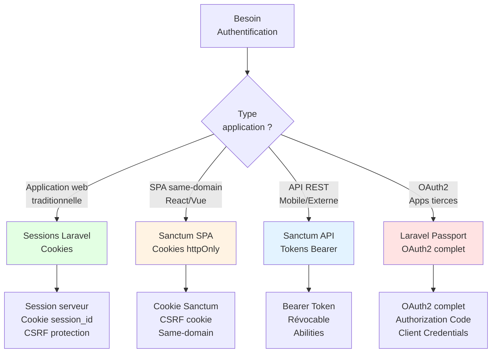

# Laravel Sanctum

## Introduction

<div
  class="omny-meta"
  data-level="🟡 Intermédiaire & 🔴 Avancé"
  data-version="1.0"
  data-time="90-120 minutes">
</div>

!!! quote "Analogie pédagogique"
    _Imaginez un **aéroport international** avec deux types d'accès. Les **passagers traditionnels** (applications web classiques) utilisent leur **passeport** (sessions cookies) - vérifié à chaque contrôle, valide tant qu'ils restent dans l'aéroport. Les **passagers fréquents** (applications mobiles, SPA externes) reçoivent une **carte d'accès personnel** (API token) - scannée à chaque entrée, révocable à distance, avec permissions spécifiques (business lounge, zones VIP). **Laravel Sanctum gère les deux systèmes** : cookies sécurisés pour SPA same-domain et tokens API pour applications externes._

> **Laravel Sanctum** est le système d'authentification API officiel de Laravel, créé par Taylor Otwell en 2019 (anciennement "Laravel Airlock"). Sanctum fournit une solution **simple et élégante** pour deux cas d'usage distincts : (1) **authentification SPA** via cookies httpOnly sécurisés pour applications same-domain (React/Vue sur `app.example.com` consommant API `api.example.com`), et (2) **API tokens personnels** pour applications mobiles ou services tiers. Contrairement à Laravel Passport (OAuth2 complet), Sanctum reste **volontairement simple** pour couvrir 95% des besoins API.

Laravel Sanctum est devenu le **standard pour APIs Laravel modernes**. Des milliers d'applications (APIs REST, applications mobiles iOS/Android, SPA React/Vue) utilisent Sanctum pour authentifier utilisateurs et sécuriser endpoints. Sa philosophie "simple token authentication" en fait l'alternative parfaite à Passport pour projets ne nécessitant pas OAuth2 complet.

!!! info "Pourquoi c'est important ?"
    Sanctum permet d'**authentifier APIs REST simplement** sans complexité OAuth2, de **sécuriser SPAs** avec cookies httpOnly (pas de XSS), de **gérer tokens révocables** avec permissions granulaires (abilities), d'**éviter CORS complexes** pour SPA same-domain, de **s'intégrer parfaitement** avec Jetstream/Breeze, et de **scaler facilement** (stateless tokens, pas de sessions serveur).

## Philosophie Sanctum

### Sanctum vs Passport vs Sessions



| Cas d'usage | Solution | Mécanisme | Complexité |
|-------------|----------|-----------|:----------:|
| **Web app traditionnelle** | Sessions Laravel | Cookie `session_id` + session serveur | 🟢 Simple |
| **SPA same-domain** | Sanctum SPA | Cookie httpOnly + CSRF cookie | 🟡 Moyenne |
| **API REST mobile** | Sanctum API Tokens | Bearer Token (header Authorization) | 🟡 Moyenne |
| **API REST externe** | Sanctum API Tokens | Bearer Token + Abilities | 🟡 Moyenne |
| **OAuth2 tiers** | Laravel Passport | Authorization Code, Client Credentials | 🔴 Complexe |

!!! tip "Quand choisir Sanctum ?"
    **Utilisez Sanctum si :**
    
    - Vous construisez une **API REST** pour mobile ou service externe
    - Vous construisez une **SPA** (React/Vue) sur même domaine
    - Vous voulez **tokens révocables** avec permissions
    - Vous **n'avez PAS besoin** d'OAuth2 complet (apps tierces, authorization server)
    - Vous voulez **simplicité** plutôt que spec OAuth2 complète

## Mise en Pratique : Projet Complet avec Sanctum

!!! success "Appliquer Sanctum dans une API REST moderne"
    Ce guide couvre **les concepts théoriques** de Laravel Sanctum. Pour **construire une API REST complète** avec authentification token-based et frontend découplé, suivez notre projet :
    
    **👉 [Dungeon Memory Battle RPG avec Laravel Sanctum + Angular 21](/projets/sanctum-rpg-dungeon/)**
    
    **Ce que vous allez construire :**
    
    - ✅ **API REST stateless complète** (authentification token-based)
    - ✅ **Frontend Angular 21 avec Signals** (state management jeu temps réel)
    - ✅ **Jeu mémoire 4×4** (flip cartes, paires, trésors, monstres)
    - ✅ **Combat RPG tour par tour** (attaque, défense, sorts, potions)
    - ✅ **3 classes jouables** (Guerrier, Archer, Mage avec stats uniques)
    - ✅ **Système progression** (XP, levels, équipement, inventaire)
    - ✅ **Token abilities** (permissions granulaires par token)
    - ✅ **Leaderboard et achievements** (déblocables)
    - ✅ **Architecture API-first** (réutilisable pour app mobile future)
    
    **Durée :** 18-24 heures (8 phases progressives)  
    **Niveau :** 🟡 Intermédiaire → 🔴 Avancé
    
    **Pourquoi un jeu ?**
    
    Les jeux sont des **applications complexes** nécessitant gestion d'état temps réel (HP, Mana, Combat), logique métier (calculs dégâts, progression), et interactions instantanées. Ce projet démontre :
    
    - **API REST** professionnelle avec Sanctum (tokens révocables, abilities)
    - **Architecture stateless** scalable (pas de sessions serveur)
    - **Frontend découplé** Angular 21 (Signals pour réactivité 60 FPS)
    - **State management** temps réel pour applications exigeantes
    
    **Compétences transférables** directement aux **apps mobiles**, **dashboards temps réel**, **plateformes SaaS**, et **APIs REST** professionnelles.

### Architecture Sanctum

**Deux modes d'authentification distincts :**

!!! Abstract "Mode 1 : SPA Authentication (Cookies)"

    ```mermaid
    sequenceDiagram
        participant SPA as SPA Frontend<br/>(React/Vue)
        participant API as API Laravel<br/>(Sanctum)
        participant DB as Database
        
        SPA->>API: GET /sanctum/csrf-cookie
        API->>SPA: Set-Cookie: XSRF-TOKEN
        
        SPA->>API: POST /login (credentials)
        Note over SPA,API: Cookie: XSRF-TOKEN<br/>Header: X-XSRF-TOKEN
        API->>DB: Vérifier credentials
        API->>SPA: Set-Cookie: session_id (httpOnly)
        
        SPA->>API: GET /api/user
        Note over SPA,API: Cookie: session_id (auto)
        API->>DB: Charger user via session
        API->>SPA: JSON user data
        
        SPA->>API: POST /logout
        API->>SPA: Clear cookies
    ```

    **Caractéristiques :**

    - **Cookie httpOnly** (JavaScript ne peut pas lire → protection XSS)
    - **CSRF protection** automatique (cookie XSRF-TOKEN)
    - **Stateful** (session serveur Laravel classique)
    - **Same-domain** ou subdomains (cookies partagés)

!!! abstract "Mode 2 : API Token Authentication"

    ```mermaid
    sequenceDiagram
        participant Client as Client<br/>(Mobile/Postman)
        participant API as API Laravel<br/>(Sanctum)
        participant DB as Database
        
        Client->>API: POST /api/tokens/create<br/>(email, password, device_name)
        API->>DB: Vérifier credentials
        API->>DB: Créer token (hashed)
        API->>Client: JSON: { token: "1|plaintext..." }
        
        Note over Client: Stocker token localement
        
        Client->>API: GET /api/user<br/>Authorization: Bearer 1|plaintext...
        API->>DB: Vérifier token (hash)
        API->>DB: Charger user
        API->>Client: JSON user data
        
        Client->>API: DELETE /api/tokens/5<br/>Authorization: Bearer ...
        API->>DB: Supprimer token
        API->>Client: 204 No Content
    ```

    **Caractéristiques :**

    - **Bearer Token** (header `Authorization: Bearer {token}`)
    - **Stateless** (pas de session serveur)
    - **Révocable** (supprimer token en BDD)
    - **Abilities** (permissions granulaires par token)
    - **Cross-domain** (pas de cookies, juste header)

## Installation et configuration

### Prérequis

```bash
# Laravel 10+ installé
composer create-project laravel/laravel api-sanctum
cd api-sanctum

# Configurer .env
DB_CONNECTION=mysql
DB_DATABASE=api_sanctum
DB_USERNAME=root
DB_PASSWORD=

# Créer database
mysql -u root -p
CREATE DATABASE api_sanctum;
EXIT;
```

### Installer Sanctum

```bash
# Installer package Sanctum (inclus par défaut Laravel 11+)
composer require laravel/sanctum

# Publier configuration (optionnel)
php artisan vendor:publish --provider="Laravel\Sanctum\SanctumServiceProvider"
# Génère : config/sanctum.php

# Exécuter migrations (crée table personal_access_tokens)
php artisan migrate
```

**Migration générée :** `database/migrations/xxxx_create_personal_access_tokens_table.php`

```php
<?php

use Illuminate\Database\Migrations\Migration;
use Illuminate\Database\Schema\Blueprint;
use Illuminate\Support\Facades\Schema;

return new class extends Migration
{
    public function up(): void
    {
        Schema::create('personal_access_tokens', function (Blueprint $table) {
            $table->id();
            $table->morphs('tokenable');              // Polymorphic (user_id, user_type)
            $table->string('name');                   // Nom du token (ex: "iPhone 13")
            $table->string('token', 64)->unique();    // Hash SHA-256 du token
            $table->text('abilities')->nullable();    // Permissions JSON
            $table->timestamp('last_used_at')->nullable();
            $table->timestamp('expires_at')->nullable();
            $table->timestamps();
        });
    }

    public function down(): void
    {
        Schema::dropIfExists('personal_access_tokens');
    }
};
```

### Configuration de base

**Fichier :** `config/sanctum.php`

```php
<?php

return [
    /**
     * Durée de vie tokens (minutes)
     * null = jamais expire
     */
    'expiration' => null,
    
    /**
     * Middleware API Sanctum
     */
    'middleware' => [
        'verify_csrf_token' => App\Http\Middleware\VerifyCsrfToken::class,
        'encrypt_cookies' => App\Http\Middleware\EncryptCookies::class,
    ],
    
    /**
     * Domaines autorisés pour SPA (cookies)
     * Exemple : localhost:3000, app.example.com
     */
    'stateful' => explode(',', env('SANCTUM_STATEFUL_DOMAINS', sprintf(
        '%s%s',
        'localhost,localhost:3000,127.0.0.1,127.0.0.1:8000,::1',
        env('APP_URL') ? ','.parse_url(env('APP_URL'), PHP_URL_HOST) : ''
    ))),
    
    /**
     * Préfixe URL guards (pour auth:sanctum)
     */
    'guard' => ['web'],
];
```

**Fichier `.env` :** Configuration domaines SPA

```bash
# Domaines autorisés pour cookies Sanctum (séparés par virgule)
SANCTUM_STATEFUL_DOMAINS=localhost:3000,app.example.com

# URL frontend SPA
FRONTEND_URL=http://localhost:3000

# Session domain (pour partager cookies entre subdomains)
SESSION_DOMAIN=.example.com
```

**Ajouter trait HasApiTokens au User :** `app/Models/User.php`

```php
<?php

namespace App\Models;

use Laravel\Sanctum\HasApiTokens;
use Illuminate\Foundation\Auth\User as Authenticatable;
use Illuminate\Notifications\Notifiable;

class User extends Authenticatable
{
    use HasApiTokens, Notifiable; // ✅ Trait Sanctum
    
    protected $fillable = [
        'name',
        'email',
        'password',
    ];
    
    protected $hidden = [
        'password',
        'remember_token',
    ];
    
    protected $casts = [
        'email_verified_at' => 'datetime',
        'password' => 'hashed',
    ];
}
```

**Ajouter middleware Sanctum aux routes API :** `app/Http/Kernel.php`

```php
<?php

namespace App\Http;

use Illuminate\Foundation\Http\Kernel as HttpKernel;

class Kernel extends HttpKernel
{
    protected $middlewareGroups = [
        'api' => [
            \Laravel\Sanctum\Http\Middleware\EnsureFrontendRequestsAreStateful::class,
            'throttle:api',
            \Illuminate\Routing\Middleware\SubstituteBindings::class,
        ],
    ];
}
```

## Mode 1 : API Token Authentication

### Créer token pour mobile/externe

**Endpoint création token :** `routes/api.php`

```php
<?php

use Illuminate\Http\Request;
use Illuminate\Support\Facades\Hash;
use Illuminate\Validation\ValidationException;
use App\Models\User;

// Route publique : créer token
Route::post('/tokens/create', function (Request $request) {
    $request->validate([
        'email' => 'required|email',
        'password' => 'required',
        'device_name' => 'required',
    ]);

    $user = User::where('email', $request->email)->first();

    if (! $user || ! Hash::check($request->password, $user->password)) {
        throw ValidationException::withMessages([
            'email' => ['The provided credentials are incorrect.'],
        ]);
    }

    // Créer token avec nom et abilities
    $token = $user->createToken($request->device_name, ['*']);

    return response()->json([
        'token' => $token->plainTextToken,
        'user' => $user,
    ]);
});
```

**Requête depuis client (Postman, mobile, etc.) :**

```bash
# Créer token
curl -X POST http://localhost:8000/api/tokens/create \
  -H "Content-Type: application/json" \
  -d '{
    "email": "john@example.com",
    "password": "password",
    "device_name": "iPhone 13"
  }'

# Réponse :
{
  "token": "1|abcdefghijklmnopqrstuvwxyz1234567890",
  "user": {
    "id": 1,
    "name": "John Doe",
    "email": "john@example.com"
  }
}
```

**Stocker token côté client :**

```javascript
// React Native / Expo
import AsyncStorage from '@react-native-async-storage/async-storage';

async function login(email, password) {
    const response = await fetch('http://api.example.com/api/tokens/create', {
        method: 'POST',
        headers: { 'Content-Type': 'application/json' },
        body: JSON.stringify({
            email,
            password,
            device_name: 'iPhone App'
        })
    });
    
    const data = await response.json();
    
    // Stocker token localement
    await AsyncStorage.setItem('api_token', data.token);
}
```

### Protéger routes API

```php
<?php

use Illuminate\Http\Request;

// Route protégée : nécessite token valide
Route::middleware('auth:sanctum')->get('/user', function (Request $request) {
    return $request->user();
});

// Groupe de routes protégées
Route::middleware('auth:sanctum')->group(function () {
    Route::apiResource('posts', PostController::class);
    Route::apiResource('comments', CommentController::class);
    
    // Route pour supprimer token actuel (logout)
    Route::post('/logout', function (Request $request) {
        $request->user()->currentAccessToken()->delete();
        return response()->json(['message' => 'Token revoked']);
    });
});
```

**Requête avec token :**

```bash
# Requête API avec Bearer token
curl -H "Authorization: Bearer 1|abcdefghijklmnopqrstuvwxyz1234567890" \
     http://localhost:8000/api/user

# Réponse :
{
  "id": 1,
  "name": "John Doe",
  "email": "john@example.com"
}
```

```javascript
// JavaScript Fetch avec token
const token = localStorage.getItem('api_token');

fetch('http://api.example.com/api/user', {
    headers: {
        'Authorization': `Bearer ${token}`,
        'Accept': 'application/json'
    }
})
.then(response => response.json())
.then(user => console.log(user));
```

### Abilities (Permissions granulaires)

**Créer token avec abilities spécifiques :**

```php
<?php

// Token avec toutes permissions
$token = $user->createToken('token-name', ['*']);

// Token lecture seule
$token = $user->createToken('token-name', ['post:read']);

// Token lecture + création
$token = $user->createToken('token-name', ['post:read', 'post:create']);

// Token admin complet
$token = $user->createToken('admin-token', [
    'post:create',
    'post:read',
    'post:update',
    'post:delete',
    'user:manage'
]);
```

**Vérifier abilities dans contrôleur :**

```php
<?php

namespace App\Http\Controllers\Api;

use App\Http\Controllers\Controller;
use App\Models\Post;
use Illuminate\Http\Request;

class PostController extends Controller
{
    public function index(Request $request)
    {
        // Accessible si token a ability 'post:read' ou '*'
        if (! $request->user()->tokenCan('post:read')) {
            return response()->json(['message' => 'Forbidden'], 403);
        }
        
        $posts = Post::all();
        return response()->json($posts);
    }
    
    public function store(Request $request)
    {
        // Vérifier ability
        if (! $request->user()->tokenCan('post:create')) {
            return response()->json(['message' => 'Forbidden'], 403);
        }
        
        $validated = $request->validate([
            'title' => 'required|max:255',
            'content' => 'required',
        ]);
        
        $post = Post::create($validated);
        
        return response()->json($post, 201);
    }
}
```

**Middleware abilities :**

```php
<?php

// routes/api.php

// Route nécessitant ability spécifique
Route::middleware(['auth:sanctum', 'ability:post:create'])->group(function () {
    Route::post('/posts', [PostController::class, 'store']);
});

// Route nécessitant AU MOINS UNE des abilities
Route::middleware(['auth:sanctum', 'abilities:post:create,post:update'])->group(function () {
    Route::put('/posts/{post}', [PostController::class, 'update']);
});
```

### Gérer tokens (liste, révocation)

**Lister tokens utilisateur :**

```php
<?php

Route::middleware('auth:sanctum')->get('/tokens', function (Request $request) {
    return $request->user()->tokens;
});
```

**Révoquer token spécifique :**

```php
<?php

// Révoquer token actuel
Route::middleware('auth:sanctum')->post('/tokens/revoke', function (Request $request) {
    $request->user()->currentAccessToken()->delete();
    return response()->json(['message' => 'Token revoked']);
});

// Révoquer tous les tokens
Route::middleware('auth:sanctum')->post('/tokens/revoke-all', function (Request $request) {
    $request->user()->tokens()->delete();
    return response()->json(['message' => 'All tokens revoked']);
});

// Révoquer token par ID
Route::middleware('auth:sanctum')->delete('/tokens/{id}', function (Request $request, $id) {
    $request->user()->tokens()->where('id', $id)->delete();
    return response()->json(['message' => 'Token revoked']);
});
```

**Vérifier dernière utilisation :**

```php
<?php

$token = $user->tokens()->find($tokenId);

if ($token->last_used_at->lt(now()->subDays(30))) {
    // Token non utilisé depuis 30 jours → révoquer
    $token->delete();
}
```

### Expiration tokens

**Configuration globale :** `config/sanctum.php`

```php
<?php

return [
    // Expiration 60 jours
    'expiration' => 60 * 24 * 60,
    
    // OU null = jamais expire
    'expiration' => null,
];
```

**Expiration par token :**

```php
<?php

// Token expire dans 7 jours
$token = $user->createToken('token-name', ['*'], now()->addDays(7));

// Token expire dans 1 heure
$token = $user->createToken('short-lived', ['*'], now()->addHour());
```

**Middleware vérification expiration automatique** (intégré Sanctum).

## Mode 2 : SPA Authentication (Cookies)

### Configuration CORS et Session

**Fichier :** `config/cors.php`

```php
<?php

return [
    'paths' => ['api/*', 'sanctum/csrf-cookie'],
    
    'allowed_methods' => ['*'],
    
    'allowed_origins' => [
        env('FRONTEND_URL', 'http://localhost:3000')
    ],
    
    'allowed_origins_patterns' => [],
    
    'allowed_headers' => ['*'],
    
    'exposed_headers' => [],
    
    'max_age' => 0,
    
    'supports_credentials' => true, // ✅ CRUCIAL pour cookies
];
```

**Fichier `.env` :**

```bash
# URL Frontend SPA
FRONTEND_URL=http://localhost:3000

# Session domain (si subdomains)
SESSION_DOMAIN=localhost

# Session driver (database recommandé pour scalabilité)
SESSION_DRIVER=database

# Sanctum stateful domains
SANCTUM_STATEFUL_DOMAINS=localhost:3000,localhost:8000
```

### Flow SPA Authentication

**Étape 1 : Récupérer CSRF cookie**

```javascript
// Frontend React/Vue : Avant toute requête authentifiée
await axios.get('http://localhost:8000/sanctum/csrf-cookie', {
    withCredentials: true
});

// Sanctum set cookie XSRF-TOKEN
```

**Étape 2 : Login avec credentials**

```javascript
// Login
await axios.post('http://localhost:8000/login', {
    email: 'john@example.com',
    password: 'password'
}, {
    withCredentials: true // ✅ Envoyer et recevoir cookies
});

// Sanctum set cookie session_id (httpOnly)
```

**Backend endpoint login :** `routes/web.php`

```php
<?php

use Illuminate\Http\Request;
use Illuminate\Support\Facades\Auth;

Route::post('/login', function (Request $request) {
    $credentials = $request->validate([
        'email' => ['required', 'email'],
        'password' => ['required'],
    ]);

    if (Auth::attempt($credentials)) {
        $request->session()->regenerate();

        return response()->json([
            'message' => 'Authenticated',
            'user' => Auth::user()
        ]);
    }

    return response()->json([
        'message' => 'The provided credentials do not match our records.'
    ], 401);
});
```

**Étape 3 : Requêtes API avec cookies**

```javascript
// Toutes les requêtes suivantes envoient automatiquement cookie session
const response = await axios.get('http://localhost:8000/api/user', {
    withCredentials: true
});

console.log(response.data); // User data
```

**Backend protégé :** `routes/api.php`

```php
<?php

use Illuminate\Http\Request;

Route::middleware('auth:sanctum')->get('/user', function (Request $request) {
    return $request->user();
});

Route::middleware('auth:sanctum')->group(function () {
    Route::apiResource('posts', PostController::class);
});
```

**Étape 4 : Logout**

```javascript
// Frontend : Logout
await axios.post('http://localhost:8000/logout', {}, {
    withCredentials: true
});
```

```php
<?php

// Backend : routes/web.php
Route::post('/logout', function (Request $request) {
    Auth::guard('web')->logout();
    $request->session()->invalidate();
    $request->session()->regenerateToken();

    return response()->json(['message' => 'Logged out']);
});
```

### Configuration Axios globale

**Frontend React :** `src/api/axios.js`

```javascript
import axios from 'axios';

const api = axios.create({
    baseURL: 'http://localhost:8000',
    withCredentials: true, // ✅ Toujours envoyer cookies
    headers: {
        'Accept': 'application/json',
        'Content-Type': 'application/json'
    }
});

// Interceptor pour CSRF
api.interceptors.request.use(async (config) => {
    // Si cookie XSRF-TOKEN existe, Axios l'envoie automatiquement
    // via header X-XSRF-TOKEN
    return config;
});

export default api;
```

**Utilisation :**

```javascript
import api from './api/axios';

// Login
async function login(email, password) {
    // 1. Récupérer CSRF cookie
    await api.get('/sanctum/csrf-cookie');
    
    // 2. Login
    const response = await api.post('/login', { email, password });
    return response.data;
}

// Fetch user
async function getUser() {
    const response = await api.get('/api/user');
    return response.data;
}

// Fetch posts
async function getPosts() {
    const response = await api.get('/api/posts');
    return response.data;
}
```

## Exemple complet : API Blog

**Scénario :** API REST pour blog avec authentification Sanctum.

### Modèles et Relations

```bash
php artisan make:model Post -mcr
php artisan make:model Comment -mc
```

**Migration Post :**

```php
<?php

public function up(): void
{
    Schema::create('posts', function (Blueprint $table) {
        $table->id();
        $table->foreignId('user_id')->constrained()->onDelete('cascade');
        $table->string('title');
        $table->string('slug')->unique();
        $table->text('content');
        $table->boolean('published')->default(false);
        $table->timestamps();
    });
}
```

**Modèle Post :**

```php
<?php

namespace App\Models;

use Illuminate\Database\Eloquent\Model;
use Illuminate\Support\Str;

class Post extends Model
{
    protected $fillable = ['user_id', 'title', 'slug', 'content', 'published'];
    
    protected $casts = ['published' => 'boolean'];
    
    protected static function boot()
    {
        parent::boot();
        
        static::creating(function ($post) {
            $post->slug = Str::slug($post->title);
        });
    }
    
    public function user()
    {
        return $this->belongsTo(User::class);
    }
    
    public function comments()
    {
        return $this->hasMany(Comment::class);
    }
}
```

### API Resource (Transformation JSON)

```bash
php artisan make:resource PostResource
php artisan make:resource PostCollection
```

**Resource :** `app/Http/Resources/PostResource.php`

```php
<?php

namespace App\Http\Resources;

use Illuminate\Http\Request;
use Illuminate\Http\Resources\Json\JsonResource;

class PostResource extends JsonResource
{
    public function toArray(Request $request): array
    {
        return [
            'id' => $this->id,
            'title' => $this->title,
            'slug' => $this->slug,
            'content' => $this->content,
            'published' => $this->published,
            'author' => [
                'id' => $this->user->id,
                'name' => $this->user->name,
            ],
            'comments_count' => $this->comments()->count(),
            'created_at' => $this->created_at->toDateTimeString(),
            'updated_at' => $this->updated_at->toDateTimeString(),
        ];
    }
}
```

### Contrôleur API

```php
<?php

namespace App\Http\Controllers\Api;

use App\Http\Controllers\Controller;
use App\Http\Resources\PostResource;
use App\Models\Post;
use Illuminate\Http\Request;

class PostController extends Controller
{
    /**
     * Liste posts publics (pas d'auth)
     */
    public function index()
    {
        $posts = Post::with('user')
                     ->where('published', true)
                     ->latest()
                     ->paginate(15);
        
        return PostResource::collection($posts);
    }
    
    /**
     * Afficher post (pas d'auth si publié)
     */
    public function show(Post $post)
    {
        if (!$post->published && (!auth('sanctum')->check() || auth('sanctum')->id() !== $post->user_id)) {
            return response()->json(['message' => 'Not found'], 404);
        }
        
        $post->load('user', 'comments');
        return new PostResource($post);
    }
    
    /**
     * Créer post (auth required + ability)
     */
    public function store(Request $request)
    {
        // Vérifier ability
        if (!$request->user()->tokenCan('post:create')) {
            return response()->json(['message' => 'Forbidden'], 403);
        }
        
        $validated = $request->validate([
            'title' => 'required|max:255|unique:posts',
            'content' => 'required',
            'published' => 'boolean',
        ]);
        
        $post = $request->user()->posts()->create($validated);
        
        return new PostResource($post);
    }
    
    /**
     * Mettre à jour post (auth + ownership)
     */
    public function update(Request $request, Post $post)
    {
        // Vérifier propriétaire
        if ($request->user()->id !== $post->user_id) {
            return response()->json(['message' => 'Forbidden'], 403);
        }
        
        // Vérifier ability
        if (!$request->user()->tokenCan('post:update')) {
            return response()->json(['message' => 'Forbidden'], 403);
        }
        
        $validated = $request->validate([
            'title' => 'sometimes|required|max:255|unique:posts,title,'.$post->id,
            'content' => 'sometimes|required',
            'published' => 'boolean',
        ]);
        
        $post->update($validated);
        
        return new PostResource($post);
    }
    
    /**
     * Supprimer post (auth + ownership)
     */
    public function destroy(Request $request, Post $post)
    {
        if ($request->user()->id !== $post->user_id) {
            return response()->json(['message' => 'Forbidden'], 403);
        }
        
        if (!$request->user()->tokenCan('post:delete')) {
            return response()->json(['message' => 'Forbidden'], 403);
        }
        
        $post->delete();
        
        return response()->json(null, 204);
    }
}
```

### Routes API

```php
<?php

// routes/api.php
use App\Http\Controllers\Api\PostController;
use Illuminate\Http\Request;

// Routes publiques
Route::get('/posts', [PostController::class, 'index']);
Route::get('/posts/{post:slug}', [PostController::class, 'show']);

// Routes authentifiées
Route::middleware('auth:sanctum')->group(function () {
    Route::get('/user', function (Request $request) {
        return $request->user();
    });
    
    Route::post('/posts', [PostController::class, 'store']);
    Route::put('/posts/{post}', [PostController::class, 'update']);
    Route::delete('/posts/{post}', [PostController::class, 'destroy']);
});
```

### Tests avec Postman

**Collection Postman :**

```json
{
  "info": {
    "name": "Laravel Sanctum API",
    "schema": "https://schema.getpostman.com/json/collection/v2.1.0/collection.json"
  },
  "item": [
    {
      "name": "Create Token",
      "request": {
        "method": "POST",
        "header": [],
        "body": {
          "mode": "raw",
          "raw": "{\n  \"email\": \"john@example.com\",\n  \"password\": \"password\",\n  \"device_name\": \"Postman\"\n}",
          "options": {
            "raw": {
              "language": "json"
            }
          }
        },
        "url": {
          "raw": "http://localhost:8000/api/tokens/create",
          "protocol": "http",
          "host": ["localhost"],
          "port": "8000",
          "path": ["api", "tokens", "create"]
        }
      }
    },
    {
      "name": "Get User",
      "request": {
        "method": "GET",
        "header": [
          {
            "key": "Authorization",
            "value": "Bearer {{token}}",
            "type": "text"
          }
        ],
        "url": {
          "raw": "http://localhost:8000/api/user",
          "protocol": "http",
          "host": ["localhost"],
          "port": "8000",
          "path": ["api", "user"]
        }
      }
    },
    {
      "name": "Create Post",
      "request": {
        "method": "POST",
        "header": [
          {
            "key": "Authorization",
            "value": "Bearer {{token}}",
            "type": "text"
          }
        ],
        "body": {
          "mode": "raw",
          "raw": "{\n  \"title\": \"Mon premier post\",\n  \"content\": \"Contenu du post...\",\n  \"published\": true\n}",
          "options": {
            "raw": {
              "language": "json"
            }
          }
        },
        "url": {
          "raw": "http://localhost:8000/api/posts",
          "protocol": "http",
          "host": ["localhost"],
          "port": "8000",
          "path": ["api", "posts"]
        }
      }
    }
  ]
}
```

## Le mot de la fin

!!! quote
    Laravel Sanctum représente l'**équilibre parfait** entre simplicité et puissance pour l'authentification API moderne. En offrant deux modes distincts (cookies httpOnly pour SPA, tokens Bearer pour mobile/externe), Sanctum couvre **95% des besoins d'authentification** API sans la complexité monstrueuse d'OAuth2 complet. Son approche "simple token authentication" prouve qu'on peut avoir **sécurité robuste** (tokens révocables, abilities granulaires, httpOnly cookies) sans spec de 200 pages.
    
    Sanctum est le **choix intelligent** pour la majorité des projets Laravel modernes. Si vous construisez une API REST pour application mobile, Sanctum avec tokens Bearer est parfait. Si vous construisez une SPA React/Vue same-domain, Sanctum avec cookies httpOnly est idéal. **Seulement si** vous construisez un authorization server OAuth2 pour applications tierces (comme GitHub permet à des apps tierces d'accéder à votre compte), alors considérez Laravel Passport - mais c'est **<5% des cas**.
    
    L'intégration transparente avec Jetstream/Breeze, la documentation claire, et l'adoption massive par la communauté font de Sanctum le **standard de facto** pour authentification API Laravel. Simple à installer, simple à utiliser, simple à maintenir - exactement ce que devrait être l'authentification API.

---

**Ressources :**

- [Laravel Sanctum Documentation](https://laravel.com/docs/sanctum)
- [Sanctum GitHub](https://github.com/laravel/sanctum)
- [API Authentication Guide](https://laravel.com/docs/authentication#api-authentication)

[^1]: **Bearer Token** : Standard RFC 6750 pour transmettre token d'authentification via header HTTP `Authorization: Bearer {token}`. "Bearer" signifie "porteur" - celui qui possède le token est authentifié, sans vérification d'identité supplémentaire.

[^2]: **httpOnly Cookie** : Cookie avec flag `httpOnly=true` empêchant JavaScript d'accéder au cookie (via `document.cookie`). Protection critique contre XSS (Cross-Site Scripting) car même si attaquant injecte JS malveillant, il ne peut pas voler le cookie de session.

[^3]: **CSRF (Cross-Site Request Forgery)** : Attaque forçant utilisateur authentifié à exécuter actions non désirées. Protection Laravel : token CSRF unique par session, vérifié à chaque requête POST/PUT/DELETE. Sanctum utilise cookie `XSRF-TOKEN` (lisible JS) que frontend renvoie via header `X-XSRF-TOKEN`.
