# Livewire

## Introduction au Projet Fil Rouge - Mini MOOC Platform

<div
  class="omny-meta"
  data-level="🟢 Débutant & 🟡 Intermédiaire"
  data-version="3.5.2"
  data-time="14-16 heures">
</div>

!!! quote "Analogie pédagogique"
    _Imaginez que vous voulez créer votre **propre Udemy ou OpenClassrooms** pour vendre vos formations en ligne. Avec React ou Vue, vous devriez construire une **API REST complète** (routes cours, modules, progression, quiz), gérer l'état côté client avec Redux/Vuex (cours actuel, leçon en cours, pourcentage progression), synchroniser les données entre composants, et coder toute la logique de validation et de progression deux fois (client + serveur). **Livewire fonctionne comme un tableau de bord intelligent** : vous créez des **composants PHP** qui gèrent cours, modules et progression, ajoutez `wire:model` sur vos formulaires de création, `wire:click` pour marquer une leçon comme complétée, et votre plateforme devient **automatiquement réactive** - barre de progression mise à jour en temps réel, quiz validés côté serveur, certificats générés automatiquement - le tout en écrivant **uniquement du PHP Laravel**._

> Ce guide vous accompagne dans la création d'un **Mini MOOC** (Massive Open Online Course) complet avec Livewire. Vous construirez une plateforme professionnelle d'apprentissage en ligne permettant aux instructeurs de créer des cours structurés en modules et leçons, aux apprenants de suivre leur progression en temps réel, de passer des quiz pour valider leurs connaissances, et d'obtenir des certificats de complétion. Ce projet réel et réutilisable vous permettra de maîtriser tous les concepts fondamentaux et avancés de Livewire dans un contexte e-learning authentique.

!!! info "Pourquoi ce projet ?"
    - **Utile professionnellement** : Créer et vendre vos propres formations en ligne
    - **Modèle économique** : Plateforme réutilisable pour consultants, formateurs, experts
    - **Exhaustif Livewire** : Couvre 100% des concepts (CRUD, nested components, real-time, events)
    - **Full-stack PHP** : Toute la logique côté serveur (progression, quiz, validation)
    - **Portfolio** : Démontre compétences Livewire et capacité créer SaaS complet
    - **Différenciant** : Pas une todo list, vraie plateforme utilisable en production

### Objectifs Pédagogiques

À la fin de ce guide, vous saurez :

- ✅ Créer une application Livewire full-stack complète de A à Z
- ✅ Gérer des relations Eloquent complexes (cours, modules, leçons)
- ✅ Implémenter des nested components (cours → modules → leçons)
- ✅ Tracker la progression utilisateur en temps réel
- ✅ Créer des quiz interactifs avec validation serveur
- ✅ Générer des certificats PDF automatiquement
- ✅ Construire des dashboards avec statistiques avancées
- ✅ Utiliser computed properties pour optimiser les performances
- ✅ Gérer les événements entre composants (completion, quiz submitted)
- ✅ Appliquer les bonnes pratiques Livewire (sécurité, organisation, performance)

### Prérequis

**Connaissances requises :**

- PHP 8.1+ (classes, méthodes, namespaces)
- Laravel fondamental (routes, Eloquent, migrations, seeders)
- HTML/CSS de base
- SQL de base (relations one-to-many, many-to-many)

**Outils nécessaires :**

- PHP 8.1+ installé
- Composer installé
- MySQL/PostgreSQL ou SQLite
- Node.js & NPM (pour Tailwind CSS compilation)
- Éditeur de code (VS Code recommandé)

**Concepts Laravel assumés maîtrisés :**

- Migrations et seeders
- Eloquent ORM (relations, scopes, accessors)
- Routes web et nommées
- Blade templates et directives
- Validation Laravel

!!! warning "Si vous débutez totalement avec Laravel"
    Consultez d'abord le [guide Laravel Fondamentaux](/dev-cloud/lang/laravel-fondamentaux/) pour acquérir les bases avant d'attaquer ce projet.

### Architecture de l'Application


### Structure de Données

**Modèle Course (Cours) :**

```php
<?php

namespace App\Models;

use Illuminate\Database\Eloquent\Model;

class Course extends Model
{
    // Identifiant unique
    public $id;
    
    // Informations générales
    public $title; // "Maîtriser Laravel 10 de Zéro à Expert"
    public $slug; // "maitriser-laravel-10" (URL-friendly)
    public $description; // Description longue
    public $excerpt; // Résumé court (150 caractères)
    
    // Contenu
    public $thumbnail; // URL image de couverture
    public $level; // beginner, intermediate, advanced
    public $language; // fr, en
    public $duration_hours; // Durée estimée en heures
    
    // Statut
    public $status; // draft, published, archived
    public $published_at; // Date de publication
    
    // Tarification
    public $price; // Prix en euros (0 = gratuit)
    public $is_free; // Boolean
    
    // SEO & Metadata
    public $meta_title;
    public $meta_description;
    public $tags; // JSON: ["laravel", "php", "backend"]
    
    // Gestion
    public $instructor_id; // User ID (créateur)
    public $views_count; // Nombre de vues
    public $enrollments_count; // Nombre d'inscrits
    
    // Timestamps
    public $created_at;
    public $updated_at;
    
    // Relations
    public function modules(); // hasMany Module
    public function instructor(); // belongsTo User
    public function enrollments(); // hasMany Enrollment
    public function lessons(); // hasManyThrough Lesson
}
```

**Modèle Module :**

```php
<?php

namespace App\Models;

use Illuminate\Database\Eloquent\Model;

class Module extends Model
{
    public $id;
    public $course_id; // Foreign key
    
    // Contenu
    public $title; // "Introduction à Laravel"
    public $description; // Objectifs du module
    public $order; // Position dans le cours (1, 2, 3...)
    
    // Durée estimée
    public $duration_minutes;
    
    // Timestamps
    public $created_at;
    public $updated_at;
    
    // Relations
    public function course(); // belongsTo
    public function lessons(); // hasMany
}
```

**Modèle Lesson (Leçon) :**

```php
<?php

namespace App\Models;

use Illuminate\Database\Eloquent\Model;

class Lesson extends Model
{
    public $id;
    public $module_id; // Foreign key
    
    // Contenu
    public $title; // "Installer Laravel avec Composer"
    public $content; // Markdown ou HTML
    public $content_type; // video, text, quiz, exercise
    public $video_url; // URL vidéo (YouTube, Vimeo, ou stockage)
    public $video_duration; // Durée vidéo en secondes
    public $order; // Position dans le module
    
    // Fichiers attachés
    public $attachments; // JSON: [{"name": "slides.pdf", "url": "..."}]
    
    // Prérequis
    public $is_free_preview; // Accessible sans inscription
    
    // Timestamps
    public $created_at;
    public $updated_at;
    
    // Relations
    public function module(); // belongsTo
    public function course(); // belongsTo (via module)
    public function completions(); // hasMany LessonCompletion
}
```

**Modèle LessonCompletion (Progression) :**

```php
<?php

namespace App\Models;

use Illuminate\Database\Eloquent\Model;

class LessonCompletion extends Model
{
    public $id;
    public $user_id; // Foreign key
    public $lesson_id; // Foreign key
    
    // Métadonnées
    public $completed_at; // Timestamp
    public $time_spent_seconds; // Temps passé sur la leçon
    
    // Relations
    public function user(); // belongsTo
    public function lesson(); // belongsTo
}
```

**Modèle Quiz :**

```php
<?php

namespace App\Models;

use Illuminate\Database\Eloquent\Model;

class Quiz extends Model
{
    public $id;
    public $course_id; // Foreign key (ou module_id)
    
    // Configuration
    public $title; // "Quiz Final Laravel"
    public $description;
    public $passing_score; // Score minimum pour réussir (ex: 70%)
    public $max_attempts; // Nombre de tentatives (null = illimité)
    public $time_limit_minutes; // Limite de temps (null = pas de limite)
    
    // Questions (JSON)
    public $questions; // JSON array de questions
    /* Exemple structure :
    [
        {
            "id": 1,
            "question": "Qu'est-ce qu'Eloquent ?",
            "type": "multiple_choice",
            "options": [
                {"id": "a", "text": "Un ORM"},
                {"id": "b", "text": "Un framework CSS"},
                {"id": "c", "text": "Un serveur web"}
            ],
            "correct_answer": "a",
            "points": 10
        }
    ]
    */
    
    // Timestamps
    public $created_at;
    public $updated_at;
    
    // Relations
    public function course(); // belongsTo
    public function attempts(); // hasMany QuizAttempt
}
```

**Modèle QuizAttempt :**

```php
<?php

namespace App\Models;

use Illuminate\Database\Eloquent\Model;

class QuizAttempt extends Model
{
    public $id;
    public $quiz_id; // Foreign key
    public $user_id; // Foreign key
    
    // Tentative
    public $attempt_number; // 1, 2, 3...
    public $answers; // JSON: {"1": "a", "2": "c", ...}
    
    // Résultats
    public $score; // Score obtenu
    public $max_score; // Score maximum possible
    public $percentage; // Pourcentage
    public $passed; // Boolean
    
    // Temps
    public $started_at;
    public $submitted_at;
    public $duration_seconds;
    
    // Relations
    public function quiz(); // belongsTo
    public function user(); // belongsTo
}
```

**Modèle Certificate (Certificat) :**

```php
<?php

namespace App\Models;

use Illuminate\Database\Eloquent\Model;

class Certificate extends Model
{
    public $id;
    public $user_id; // Foreign key
    public $course_id; // Foreign key
    
    // Certificat
    public $certificate_number; // CERT-2025-001234 (unique)
    public $issued_at; // Date d'émission
    public $completed_at; // Date de complétion du cours
    
    // Score final
    public $final_score; // Optionnel (moyenne quiz)
    
    // Fichier PDF
    public $pdf_path; // Chemin stockage
    
    // Relations
    public function user(); // belongsTo
    public function course(); // belongsTo
}
```

### Flux de Données Livewire

```mermaid
sequenceDiagram
    participant U as Utilisateur
    participant B as Navigateur<br/>(Livewire.js)
    participant C as Composant<br/>CourseShow
    participant E as Eloquent<br/>ORM
    participant DB as Base de<br/>données

    Note over U,DB: Marquer une Leçon Complétée
    U->>B: Clique "Marquer comme terminée"
    B->>C: POST /livewire (wire:click="markComplete")
    C->>C: Vérifier lesson_id valide
    C->>E: LessonCompletion::create([...])
    E->>DB: INSERT INTO lesson_completions
    DB->>E: Row created
    E->>C: Model instance
    C->>C: Recalculer progression ($this->progress)
    C->>C: Vérifier si cours complet → Certificat
    alt Cours 100% complété
        C->>E: Certificate::create([...])
        E->>DB: INSERT INTO certificates
        C->>C: $this->dispatch('certificate-earned')
    end
    C->>B: HTML diff (progress bar, next lesson)
    B->>B: DOM update (smooth animation)
    B->>U: Leçon marquée + barre progression mise à jour

    Note over U,DB: Soumettre un Quiz
    U->>B: Remplit quiz + Soumet
    B->>C: POST /livewire (wire:submit="submitQuiz")
    C->>C: $this->validate() (réponses)
    C->>C: Calculer score (comparer avec correct_answers)
    C->>E: QuizAttempt::create([score, answers, ...])
    E->>DB: INSERT INTO quiz_attempts
    C->>C: Vérifier si passed (score >= passing_score)
    alt Quiz réussi
        C->>C: Débloquer module suivant
        C->>C: $this->dispatch('quiz-passed')
    else Quiz échoué
        C->>C: Incrémenter attempts, message encouragement
    end
    C->>B: HTML diff (résultats, feedback)
    B->>U: Affiche score + corrections
```



### Phases de Développement

Le projet est structuré en **8 phases progressives** :

| Phase | Titre | Durée | Concepts Livewire |
|-------|-------|-------|-------------------|
| 1 | Setup & Models | 2h | Installation, migrations, relations Eloquent |
| 2 | CRUD Cours | 2h30 | Components, wire:model, validation, nested forms |
| 3 | Modules & Leçons | 2h | Nested components, dynamic lists, ordering |
| 4 | Progression Utilisateur | 2h | Real-time updates, computed properties, events |
| 5 | Quiz Interactifs | 2h | Complex forms, scoring logic, validation |
| 6 | Dashboard Apprenant | 1h30 | Stats, filters, my courses, wire:poll |
| 7 | Dashboard Instructeur | 1h30 | Course management, student analytics |
| 8 | Certificats & Export | 1h30 | PDF generation, file downloads, completion |

**Durée totale : 15h**

### Aperçu du Résultat Final

**Fonctionnalités clés :**

- ✅ Gestion complète des cours (création, édition, publication)
- ✅ Structure hiérarchique cours → modules → leçons
- ✅ Lecteur de leçons avec vidéo/texte
- ✅ Progression temps réel (barre pourcentage, leçons complétées)
- ✅ Quiz interactifs avec correction automatique
- ✅ Dashboard apprenant (mes cours, progression, certificats)
- ✅ Dashboard instructeur (mes cours, statistiques étudiants)
- ✅ Génération automatique certificats PDF
- ✅ Filtres et recherche (niveau, prix, langue)
- ✅ Responsive design (desktop, tablet, mobile)

---

## Phase 1 : Setup & Models (2h)

<div class="omny-meta" data-level="🟢 Débutant" data-time="2 heures"></div>

### Objectifs Phase 1

À la fin de cette phase, vous aurez :

- ✅ Projet Laravel configuré avec Livewire
- ✅ Base de données structurée (migrations complètes)
- ✅ Models Eloquent avec relations
- ✅ Seeders pour données de test
- ✅ Layout de base avec Tailwind CSS

### 1.1 Création Projet Laravel

**Installer Laravel :**

```bash
# Créer nouveau projet Laravel
composer create-project laravel/laravel mini-mooc
cd mini-mooc

# Configurer .env
cp .env.example .env
php artisan key:generate

# Configurer base de données (dans .env)
DB_CONNECTION=mysql
DB_HOST=127.0.0.1
DB_PORT=3306
DB_DATABASE=mini_mooc
DB_USERNAME=root
DB_PASSWORD=

# Créer la base de données
mysql -u root -p
CREATE DATABASE mini_mooc CHARACTER SET utf8mb4 COLLATE utf8mb4_unicode_ci;
EXIT;
```

**Installer Livewire :**

```bash
# Installer Livewire 3.x
composer require livewire/livewire

# Vérifier installation
php artisan livewire:--version
# Livewire 3.x.x
```

**Installer Tailwind CSS :**

```bash
# Installer dépendances Node
npm install -D tailwindcss postcss autoprefixer
npx tailwindcss init -p

# Compiler assets
npm run dev
```

**Configuration Tailwind :**

**Fichier :** `tailwind.config.js`

```javascript
/** @type {import('tailwindcss').Config} */
export default {
  content: [
    "./resources/**/*.blade.php",
    "./resources/**/*.js",
    "./app/Livewire/**/*.php", // (1)!
  ],
  theme: {
    extend: {},
  },
  plugins: [],
}
```

1. **Inclure composants Livewire** : Tailwind scannera classes dans composants Livewire

**Fichier :** `resources/css/app.css`

```css
@tailwind base;
@tailwind components;
@tailwind utilities;

/* Styles personnalisés */
@layer components {
    .btn-primary {
        @apply px-6 py-3 bg-blue-600 text-white rounded-lg hover:bg-blue-700 transition;
    }
    
    .btn-secondary {
        @apply px-6 py-3 bg-gray-200 text-gray-800 rounded-lg hover:bg-gray-300 transition;
    }
    
    .card {
        @apply bg-white rounded-lg shadow-sm border border-gray-200 p-6;
    }
}
```

### 1.2 Migrations Base de Données

**Créer les migrations :**

```bash
# Users (table existe déjà dans Laravel)
# Nous allons juste ajouter colonnes

# Courses
php artisan make:migration create_courses_table

# Modules
php artisan make:migration create_modules_table

# Lessons
php artisan make:migration create_lessons_table

# Enrollments (inscriptions)
php artisan make:migration create_enrollments_table

# Lesson Completions
php artisan make:migration create_lesson_completions_table

# Quizzes
php artisan make:migration create_quizzes_table

# Quiz Attempts
php artisan make:migration create_quiz_attempts_table

# Certificates
php artisan make:migration create_certificates_table
```

**Migration Users (ajouter colonnes) :**

**Fichier :** `database/migrations/XXXX_add_role_to_users_table.php`

```php
<?php

use Illuminate\Database\Migrations\Migration;
use Illuminate\Database\Schema\Blueprint;
use Illuminate\Support\Facades\Schema;

return new class extends Migration
{
    public function up(): void
    {
        Schema::table('users', function (Blueprint $table) {
            $table->enum('role', ['student', 'instructor', 'admin'])
                  ->default('student')
                  ->after('email');
            $table->string('avatar')->nullable()->after('role');
            $table->text('bio')->nullable()->after('avatar');
        });
    }

    public function down(): void
    {
        Schema::table('users', function (Blueprint $table) {
            $table->dropColumn(['role', 'avatar', 'bio']);
        });
    }
};
```

**Migration Courses :**

**Fichier :** `database/migrations/XXXX_create_courses_table.php`

```php
<?php

use Illuminate\Database\Migrations\Migration;
use Illuminate\Database\Schema\Blueprint;
use Illuminate\Support\Facades\Schema;

return new class extends Migration
{
    public function up(): void
    {
        Schema::create('courses', function (Blueprint $table) {
            $table->id();
            
            // Instructeur
            $table->foreignId('instructor_id')
                  ->constrained('users')
                  ->onDelete('cascade'); // (1)!
            
            // Informations générales
            $table->string('title');
            $table->string('slug')->unique();
            $table->text('description');
            $table->string('excerpt', 255)->nullable();
            
            // Contenu
            $table->string('thumbnail')->nullable();
            $table->enum('level', ['beginner', 'intermediate', 'advanced'])
                  ->default('beginner');
            $table->string('language', 2)->default('fr'); // ISO 639-1
            $table->integer('duration_hours')->default(0);
            
            // Statut
            $table->enum('status', ['draft', 'published', 'archived'])
                  ->default('draft');
            $table->timestamp('published_at')->nullable();
            
            // Tarification
            $table->decimal('price', 8, 2)->default(0); // (2)!
            $table->boolean('is_free')->default(true);
            
            // SEO
            $table->string('meta_title')->nullable();
            $table->text('meta_description')->nullable();
            $table->json('tags')->nullable();
            
            // Statistiques
            $table->unsignedInteger('views_count')->default(0);
            $table->unsignedInteger('enrollments_count')->default(0);
            
            $table->timestamps();
            
            // Index pour performance
            $table->index('slug');
            $table->index('status');
            $table->index('instructor_id');
        });
    }

    public function down(): void
    {
        Schema::dropIfExists('courses');
    }
};
```

1. **CASCADE** : Si user supprimé, ses cours sont supprimés automatiquement
2. **Decimal(8,2)** : Jusqu'à 999 999,99€ (prix max)

**Migration Modules :**

**Fichier :** `database/migrations/XXXX_create_modules_table.php`

```php
<?php

use Illuminate\Database\Migrations\Migration;
use Illuminate\Database\Schema\Blueprint;
use Illuminate\Support\Facades\Schema;

return new class extends Migration
{
    public function up(): void
    {
        Schema::create('modules', function (Blueprint $table) {
            $table->id();
            
            // Relation cours
            $table->foreignId('course_id')
                  ->constrained()
                  ->onDelete('cascade');
            
            // Contenu
            $table->string('title');
            $table->text('description')->nullable();
            $table->unsignedInteger('order')->default(1); // (1)!
            
            // Durée estimée
            $table->unsignedInteger('duration_minutes')->default(0);
            
            $table->timestamps();
            
            // Index composite pour ordering
            $table->index(['course_id', 'order']);
        });
    }

    public function down(): void
    {
        Schema::dropIfExists('modules');
    }
};
```

1. **Order** : Position du module dans le cours (1, 2, 3...)

**Migration Lessons :**

**Fichier :** `database/migrations/XXXX_create_lessons_table.php`

```php
<?php

use Illuminate\Database\Migrations\Migration;
use Illuminate\Database\Schema\Blueprint;
use Illuminate\Support\Facades\Schema;

return new class extends Migration
{
    public function up(): void
    {
        Schema::create('lessons', function (Blueprint $table) {
            $table->id();
            
            // Relation module
            $table->foreignId('module_id')
                  ->constrained()
                  ->onDelete('cascade');
            
            // Contenu
            $table->string('title');
            $table->longText('content')->nullable(); // (1)!
            $table->enum('content_type', ['video', 'text', 'quiz', 'exercise'])
                  ->default('text');
            
            // Vidéo
            $table->string('video_url')->nullable();
            $table->unsignedInteger('video_duration')->nullable(); // Secondes
            
            // Ordering
            $table->unsignedInteger('order')->default(1);
            
            // Fichiers
            $table->json('attachments')->nullable(); // (2)!
            
            // Accès
            $table->boolean('is_free_preview')->default(false);
            
            $table->timestamps();
            
            // Index
            $table->index(['module_id', 'order']);
        });
    }

    public function down(): void
    {
        Schema::dropIfExists('lessons');
    }
};
```

1. **longText** : Supporte contenu Markdown volumineux
2. **JSON** : Tableau de fichiers attachés `[{"name": "slides.pdf", "url": "..."}]`

**Migration Enrollments :**

**Fichier :** `database/migrations/XXXX_create_enrollments_table.php`

```php
<?php

use Illuminate\Database\Migrations\Migration;
use Illuminate\Database\Schema\Blueprint;
use Illuminate\Support\Facades\Schema;

return new class extends Migration
{
    public function up(): void
    {
        Schema::create('enrollments', function (Blueprint $table) {
            $table->id();
            
            // Relations
            $table->foreignId('user_id')
                  ->constrained()
                  ->onDelete('cascade');
            $table->foreignId('course_id')
                  ->constrained()
                  ->onDelete('cascade');
            
            // Inscription
            $table->timestamp('enrolled_at');
            $table->timestamp('completed_at')->nullable();
            
            // Progression (calculée dynamiquement mais cachée)
            $table->unsignedTinyInteger('progress_percentage')->default(0); // (1)!
            
            $table->timestamps();
            
            // Contrainte unique : un user ne peut s'inscrire qu'une fois
            $table->unique(['user_id', 'course_id']);
        });
    }

    public function down(): void
    {
        Schema::dropIfExists('enrollments');
    }
};
```

1. **Progress percentage** : Calculé en comptant lessons complétées / total lessons

**Migration Lesson Completions :**

**Fichier :** `database/migrations/XXXX_create_lesson_completions_table.php`

```php
<?php

use Illuminate\Database\Migrations\Migration;
use Illuminate\Database\Schema\Blueprint;
use Illuminate\Support\Facades\Schema;

return new class extends Migration
{
    public function up(): void
    {
        Schema::create('lesson_completions', function (Blueprint $table) {
            $table->id();
            
            // Relations
            $table->foreignId('user_id')
                  ->constrained()
                  ->onDelete('cascade');
            $table->foreignId('lesson_id')
                  ->constrained()
                  ->onDelete('cascade');
            
            // Métadonnées
            $table->timestamp('completed_at');
            $table->unsignedInteger('time_spent_seconds')->default(0);
            
            $table->timestamps();
            
            // Contrainte unique : une leçon complétée qu'une fois
            $table->unique(['user_id', 'lesson_id']);
        });
    }

    public function down(): void
    {
        Schema::dropIfExists('lesson_completions');
    }
};
```

**Migration Quizzes :**

**Fichier :** `database/migrations/XXXX_create_quizzes_table.php`

```php
<?php

use Illuminate\Database\Migrations\Migration;
use Illuminate\Database\Schema\Blueprint;
use Illuminate\Support\Facades\Schema;

return new class extends Migration
{
    public function up(): void
    {
        Schema::create('quizzes', function (Blueprint $table) {
            $table->id();
            
            // Relation
            $table->foreignId('course_id')
                  ->constrained()
                  ->onDelete('cascade');
            
            // Configuration
            $table->string('title');
            $table->text('description')->nullable();
            $table->unsignedTinyInteger('passing_score')->default(70); // Pourcentage
            $table->unsignedTinyInteger('max_attempts')->nullable(); // (1)!
            $table->unsignedInteger('time_limit_minutes')->nullable();
            
            // Questions (JSON)
            $table->json('questions'); // (2)!
            
            $table->timestamps();
        });
    }

    public function down(): void
    {
        Schema::dropIfExists('quizzes');
    }
};
```

1. **Max attempts** : NULL = illimité
2. **Questions JSON** : Structure `[{"id":1, "question":"...", "options":[...], "correct_answer":"a"}]`

**Migration Quiz Attempts :**

**Fichier :** `database/migrations/XXXX_create_quiz_attempts_table.php`

```php
<?php

use Illuminate\Database\Migrations\Migration;
use Illuminate\Database\Schema\Blueprint;
use Illuminate\Support\Facades\Schema;

return new class extends Migration
{
    public function up(): void
    {
        Schema::create('quiz_attempts', function (Blueprint $table) {
            $table->id();
            
            // Relations
            $table->foreignId('quiz_id')
                  ->constrained()
                  ->onDelete('cascade');
            $table->foreignId('user_id')
                  ->constrained()
                  ->onDelete('cascade');
            
            // Tentative
            $table->unsignedTinyInteger('attempt_number')->default(1);
            $table->json('answers'); // {"1": "a", "2": "c", ...}
            
            // Résultats
            $table->unsignedInteger('score')->default(0);
            $table->unsignedInteger('max_score')->default(0);
            $table->unsignedTinyInteger('percentage')->default(0);
            $table->boolean('passed')->default(false);
            
            // Temps
            $table->timestamp('started_at');
            $table->timestamp('submitted_at')->nullable();
            $table->unsignedInteger('duration_seconds')->nullable();
            
            $table->timestamps();
            
            // Index
            $table->index(['user_id', 'quiz_id', 'attempt_number']);
        });
    }

    public function down(): void
    {
        Schema::dropIfExists('quiz_attempts');
    }
};
```

**Migration Certificates :**

**Fichier :** `database/migrations/XXXX_create_certificates_table.php`

```php
<?php

use Illuminate\Database\Migrations\Migration;
use Illuminate\Database\Schema\Blueprint;
use Illuminate\Support\Facades\Schema;

return new class extends Migration
{
    public function up(): void
    {
        Schema::create('certificates', function (Blueprint $table) {
            $table->id();
            
            // Relations
            $table->foreignId('user_id')
                  ->constrained()
                  ->onDelete('cascade');
            $table->foreignId('course_id')
                  ->constrained()
                  ->onDelete('cascade');
            
            // Certificat
            $table->string('certificate_number')->unique(); // CERT-2025-001234
            $table->timestamp('issued_at');
            $table->timestamp('completed_at');
            
            // Score final
            $table->unsignedTinyInteger('final_score')->nullable();
            
            // Fichier PDF
            $table->string('pdf_path')->nullable();
            
            $table->timestamps();
            
            // Contrainte unique : un certificat par cours
            $table->unique(['user_id', 'course_id']);
        });
    }

    public function down(): void
    {
        Schema::dropIfExists('certificates');
    }
};
```

**Exécuter les migrations :**

```bash
# Lancer toutes les migrations
php artisan migrate

# Vérifier les tables créées
php artisan db:show
php artisan db:table courses
```

### 1.3 Models Eloquent

**Créer les models :**

```bash
# Générer tous les models
php artisan make:model Course
php artisan make:model Module
php artisan make:model Lesson
php artisan make:model Enrollment
php artisan make:model LessonCompletion
php artisan make:model Quiz
php artisan make:model QuizAttempt
php artisan make:model Certificate
```

**Model Course :**

**Fichier :** `app/Models/Course.php`

```php
<?php

namespace App\Models;

use Illuminate\Database\Eloquent\Factories\HasFactory;
use Illuminate\Database\Eloquent\Model;
use Illuminate\Support\Str;

class Course extends Model
{
    use HasFactory;

    protected $fillable = [
        'instructor_id',
        'title',
        'slug',
        'description',
        'excerpt',
        'thumbnail',
        'level',
        'language',
        'duration_hours',
        'status',
        'published_at',
        'price',
        'is_free',
        'meta_title',
        'meta_description',
        'tags',
        'views_count',
        'enrollments_count',
    ];

    protected $casts = [
        'tags' => 'array', // (1)!
        'published_at' => 'datetime',
        'price' => 'decimal:2',
        'is_free' => 'boolean',
    ];

    // Auto-générer slug depuis title
    protected static function boot()
    {
        parent::boot();

        static::creating(function ($course) {
            if (empty($course->slug)) {
                $course->slug = Str::slug($course->title); // (2)!
            }
        });
    }

    /**
     * Relations
     */
    public function instructor()
    {
        return $this->belongsTo(User::class, 'instructor_id');
    }

    public function modules()
    {
        return $this->hasMany(Module::class)->orderBy('order');
    }

    public function enrollments()
    {
        return $this->hasMany(Enrollment::class);
    }

    public function quizzes()
    {
        return $this->hasMany(Quiz::class);
    }

    public function certificates()
    {
        return $this->hasMany(Certificate::class);
    }

    // Relation hasManyThrough pour récupérer toutes les leçons
    public function lessons()
    {
        return $this->hasManyThrough(Lesson::class, Module::class);
    }

    /**
     * Scopes
     */
    public function scopePublished($query)
    {
        return $query->where('status', 'published')
                     ->whereNotNull('published_at');
    }

    public function scopeByLevel($query, $level)
    {
        return $query->where('level', $level);
    }

    /**
     * Accessors & Mutators
     */
    public function getFormattedPriceAttribute()
    {
        return $this->is_free ? 'Gratuit' : number_format($this->price, 2, ',', ' ') . ' €';
    }

    public function getTotalLessonsAttribute()
    {
        return $this->lessons()->count();
    }

    public function getTotalDurationAttribute()
    {
        return $this->lessons()->sum('video_duration') / 60; // Minutes
    }
}
```

1. **Casts array** : Automatiquement convertit JSON ↔ array PHP
2. **Slug auto** : Génère "maitriser-laravel-10" depuis "Maîtriser Laravel 10"

**Model Module :**

**Fichier :** `app/Models/Module.php`

```php
<?php

namespace App\Models;

use Illuminate\Database\Eloquent\Factories\HasFactory;
use Illuminate\Database\Eloquent\Model;

class Module extends Model
{
    use HasFactory;

    protected $fillable = [
        'course_id',
        'title',
        'description',
        'order',
        'duration_minutes',
    ];

    /**
     * Relations
     */
    public function course()
    {
        return $this->belongsTo(Course::class);
    }

    public function lessons()
    {
        return $this->hasMany(Lesson::class)->orderBy('order');
    }

    /**
     * Accessors
     */
    public function getTotalLessonsAttribute()
    {
        return $this->lessons()->count();
    }

    public function getCompletedLessonsAttribute()
    {
        if (!auth()->check()) return 0;
        
        return $this->lessons()
                    ->whereHas('completions', function ($query) {
                        $query->where('user_id', auth()->id());
                    })
                    ->count();
    }

    public function getProgressPercentageAttribute()
    {
        $total = $this->total_lessons;
        if ($total === 0) return 0;
        
        return round(($this->completed_lessons / $total) * 100);
    }
}
```

**Model Lesson :**

**Fichier :** `app/Models/Lesson.php`

```php
<?php

namespace App\Models;

use Illuminate\Database\Eloquent\Factories\HasFactory;
use Illuminate\Database\Eloquent\Model;

class Lesson extends Model
{
    use HasFactory;

    protected $fillable = [
        'module_id',
        'title',
        'content',
        'content_type',
        'video_url',
        'video_duration',
        'order',
        'attachments',
        'is_free_preview',
    ];

    protected $casts = [
        'attachments' => 'array',
        'is_free_preview' => 'boolean',
    ];

    /**
     * Relations
     */
    public function module()
    {
        return $this->belongsTo(Module::class);
    }

    public function course()
    {
        return $this->module->course(); // (1)!
    }

    public function completions()
    {
        return $this->hasMany(LessonCompletion::class);
    }

    /**
     * Accessors
     */
    public function getIsCompletedAttribute()
    {
        if (!auth()->check()) return false;
        
        return $this->completions()
                    ->where('user_id', auth()->id())
                    ->exists();
    }

    public function getFormattedDurationAttribute()
    {
        if (!$this->video_duration) return null;
        
        $minutes = floor($this->video_duration / 60);
        $seconds = $this->video_duration % 60;
        
        return sprintf('%d:%02d', $minutes, $seconds);
    }
}
```

1. **Relation via module** : `$lesson->course` retourne le cours via le module parent

**Model Enrollment :**

**Fichier :** `app/Models/Enrollment.php`

```php
<?php

namespace App\Models;

use Illuminate\Database\Eloquent\Factories\HasFactory;
use Illuminate\Database\Eloquent\Model;

class Enrollment extends Model
{
    use HasFactory;

    protected $fillable = [
        'user_id',
        'course_id',
        'enrolled_at',
        'completed_at',
        'progress_percentage',
    ];

    protected $casts = [
        'enrolled_at' => 'datetime',
        'completed_at' => 'datetime',
    ];

    /**
     * Relations
     */
    public function user()
    {
        return $this->belongsTo(User::class);
    }

    public function course()
    {
        return $this->belongsTo(Course::class);
    }

    /**
     * Calculer progression
     */
    public function calculateProgress()
    {
        $totalLessons = $this->course->lessons()->count();
        
        if ($totalLessons === 0) {
            return 0;
        }
        
        $completedLessons = LessonCompletion::where('user_id', $this->user_id)
            ->whereIn('lesson_id', $this->course->lessons()->pluck('id'))
            ->count();
        
        return round(($completedLessons / $totalLessons) * 100);
    }
}
```

**Model LessonCompletion :**

**Fichier :** `app/Models/LessonCompletion.php`

```php
<?php

namespace App\Models;

use Illuminate\Database\Eloquent\Factories\HasFactory;
use Illuminate\Database\Eloquent\Model;

class LessonCompletion extends Model
{
    use HasFactory;

    protected $fillable = [
        'user_id',
        'lesson_id',
        'completed_at',
        'time_spent_seconds',
    ];

    protected $casts = [
        'completed_at' => 'datetime',
    ];

    /**
     * Relations
     */
    public function user()
    {
        return $this->belongsTo(User::class);
    }

    public function lesson()
    {
        return $this->belongsTo(Lesson::class);
    }
}
```

**Model Quiz :**

**Fichier :** `app/Models/Quiz.php`

```php
<?php

namespace App\Models;

use Illuminate\Database\Eloquent\Factories\HasFactory;
use Illuminate\Database\Eloquent\Model;

class Quiz extends Model
{
    use HasFactory;

    protected $fillable = [
        'course_id',
        'title',
        'description',
        'passing_score',
        'max_attempts',
        'time_limit_minutes',
        'questions',
    ];

    protected $casts = [
        'questions' => 'array',
    ];

    /**
     * Relations
     */
    public function course()
    {
        return $this->belongsTo(Course::class);
    }

    public function attempts()
    {
        return $this->hasMany(QuizAttempt::class);
    }

    /**
     * Accessors
     */
    public function getTotalQuestionsAttribute()
    {
        return count($this->questions ?? []);
    }

    public function getMaxScoreAttribute()
    {
        return collect($this->questions)->sum('points');
    }

    /**
     * Calculer score d'une tentative
     */
    public function calculateScore(array $answers): array
    {
        $score = 0;
        $totalPoints = 0;

        foreach ($this->questions as $question) {
            $totalPoints += $question['points'];
            
            $userAnswer = $answers[$question['id']] ?? null;
            
            if ($userAnswer === $question['correct_answer']) {
                $score += $question['points'];
            }
        }

        $percentage = $totalPoints > 0 ? round(($score / $totalPoints) * 100) : 0;

        return [
            'score' => $score,
            'max_score' => $totalPoints,
            'percentage' => $percentage,
            'passed' => $percentage >= $this->passing_score,
        ];
    }
}
```

**Model QuizAttempt :**

**Fichier :** `app/Models/QuizAttempt.php`

```php
<?php

namespace App\Models;

use Illuminate\Database\Eloquent\Factories\HasFactory;
use Illuminate\Database\Eloquent\Model;

class QuizAttempt extends Model
{
    use HasFactory;

    protected $fillable = [
        'quiz_id',
        'user_id',
        'attempt_number',
        'answers',
        'score',
        'max_score',
        'percentage',
        'passed',
        'started_at',
        'submitted_at',
        'duration_seconds',
    ];

    protected $casts = [
        'answers' => 'array',
        'passed' => 'boolean',
        'started_at' => 'datetime',
        'submitted_at' => 'datetime',
    ];

    /**
     * Relations
     */
    public function quiz()
    {
        return $this->belongsTo(Quiz::class);
    }

    public function user()
    {
        return $this->belongsTo(User::class);
    }
}
```

**Model Certificate :**

**Fichier :** `app/Models/Certificate.php`

```php
<?php

namespace App\Models;

use Illuminate\Database\Eloquent\Factories\HasFactory;
use Illuminate\Database\Eloquent\Model;

class Certificate extends Model
{
    use HasFactory;

    protected $fillable = [
        'user_id',
        'course_id',
        'certificate_number',
        'issued_at',
        'completed_at',
        'final_score',
        'pdf_path',
    ];

    protected $casts = [
        'issued_at' => 'datetime',
        'completed_at' => 'datetime',
    ];

    // Auto-générer numéro certificat
    protected static function boot()
    {
        parent::boot();

        static::creating(function ($certificate) {
            if (empty($certificate->certificate_number)) {
                $certificate->certificate_number = 'CERT-' . date('Y') . '-' . str_pad(
                    Certificate::whereYear('created_at', date('Y'))->count() + 1,
                    6,
                    '0',
                    STR_PAD_LEFT
                );
            }
        });
    }

    /**
     * Relations
     */
    public function user()
    {
        return $this->belongsTo(User::class);
    }

    public function course()
    {
        return $this->belongsTo(Course::class);
    }
}
```

**Model User (ajouter relations) :**

**Fichier :** `app/Models/User.php`

```php
<?php

namespace App\Models;

// ... imports existants

class User extends Authenticatable
{
    // ... code existant Laravel
    
    protected $fillable = [
        'name',
        'email',
        'password',
        'role',
        'avatar',
        'bio',
    ];

    /**
     * Relations Cours
     */
    public function coursesAsInstructor()
    {
        return $this->hasMany(Course::class, 'instructor_id');
    }

    public function enrollments()
    {
        return $this->hasMany(Enrollment::class);
    }

    public function coursesAsStudent()
    {
        return $this->belongsToMany(Course::class, 'enrollments')
                    ->withTimestamps();
    }

    public function lessonCompletions()
    {
        return $this->hasMany(LessonCompletion::class);
    }

    public function quizAttempts()
    {
        return $this->hasMany(QuizAttempt::class);
    }

    public function certificates()
    {
        return $this->hasMany(Certificate::class);
    }

    /**
     * Helpers
     */
    public function isInstructor()
    {
        return $this->role === 'instructor';
    }

    public function isStudent()
    {
        return $this->role === 'student';
    }

    public function isAdmin()
    {
        return $this->role === 'admin';
    }
}
```

### 1.4 Seeders (Données de Test)

**Créer seeders :**

```bash
php artisan make:seeder UserSeeder
php artisan make:seeder CourseSeeder
php artisan make:seeder ModuleSeeder
php artisan make:seeder LessonSeeder
php artisan make:seeder QuizSeeder
```

**UserSeeder :**

**Fichier :** `database/seeders/UserSeeder.php`

```php
<?php

namespace Database\Seeders;

use Illuminate\Database\Seeder;
use App\Models\User;
use Illuminate\Support\Facades\Hash;

class UserSeeder extends Seeder
{
    public function run(): void
    {
        // Instructeur
        User::create([
            'name' => 'Jean Dupont',
            'email' => 'instructor@mooc.test',
            'password' => Hash::make('password'),
            'role' => 'instructor',
            'bio' => 'Expert Laravel avec 10 ans d\'expérience. Formateur passionné.',
        ]);

        // Étudiant
        User::create([
            'name' => 'Marie Martin',
            'email' => 'student@mooc.test',
            'password' => Hash::make('password'),
            'role' => 'student',
        ]);

        // Admin
        User::create([
            'name' => 'Admin',
            'email' => 'admin@mooc.test',
            'password' => Hash::make('password'),
            'role' => 'admin',
        ]);
    }
}
```

**CourseSeeder :**

**Fichier :** `database/seeders/CourseSeeder.php`

```php
<?php

namespace Database\Seeders;

use Illuminate\Database\Seeder;
use App\Models\Course;
use App\Models\User;

class CourseSeeder extends Seeder
{
    public function run(): void
    {
        $instructor = User::where('role', 'instructor')->first();

        Course::create([
            'instructor_id' => $instructor->id,
            'title' => 'Maîtriser Laravel 10 de Zéro à Expert',
            'slug' => 'maitriser-laravel-10',
            'description' => 'Cours complet pour apprendre Laravel 10 depuis les fondamentaux jusqu\'aux concepts avancés. Vous apprendrez Eloquent, Blade, Livewire, et bien plus.',
            'excerpt' => 'Devenez expert Laravel en 40 heures de formation pratique',
            'level' => 'beginner',
            'language' => 'fr',
            'duration_hours' => 40,
            'status' => 'published',
            'published_at' => now(),
            'price' => 99.99,
            'is_free' => false,
            'tags' => ['laravel', 'php', 'backend', 'web development'],
        ]);

        Course::create([
            'instructor_id' => $instructor->id,
            'title' => 'Introduction au PHP 8',
            'slug' => 'introduction-php-8',
            'description' => 'Apprenez les bases de PHP 8 avec ses nouvelles fonctionnalités.',
            'excerpt' => 'Débutez avec PHP 8 en 10 heures',
            'level' => 'beginner',
            'language' => 'fr',
            'duration_hours' => 10,
            'status' => 'published',
            'published_at' => now(),
            'price' => 0,
            'is_free' => true,
            'tags' => ['php', 'web development'],
        ]);
    }
}
```

**ModuleSeeder :**

**Fichier :** `database/seeders/ModuleSeeder.php`

```php
<?php

namespace Database\Seeders;

use Illuminate\Database\Seeder;
use App\Models\Course;
use App\Models\Module;

class ModuleSeeder extends Seeder
{
    public function run(): void
    {
        $laravelCourse = Course::where('slug', 'maitriser-laravel-10')->first();

        Module::create([
            'course_id' => $laravelCourse->id,
            'title' => 'Introduction à Laravel',
            'description' => 'Découvrez Laravel, son écosystème et installez votre premier projet.',
            'order' => 1,
            'duration_minutes' => 120,
        ]);

        Module::create([
            'course_id' => $laravelCourse->id,
            'title' => 'Routes et Contrôleurs',
            'description' => 'Maîtrisez le routing Laravel et la logique MVC.',
            'order' => 2,
            'duration_minutes' => 180,
        ]);

        Module::create([
            'course_id' => $laravelCourse->id,
            'title' => 'Eloquent ORM',
            'description' => 'Apprenez à manipuler la base de données avec Eloquent.',
            'order' => 3,
            'duration_minutes' => 240,
        ]);
    }
}
```

**LessonSeeder :**

**Fichier :** `database/seeders/LessonSeeder.php`

```php
<?php

namespace Database\Seeders;

use Illuminate\Database\Seeder;
use App\Models\Module;
use App\Models\Lesson;

class LessonSeeder extends Seeder
{
    public function run(): void
    {
        $module1 = Module::where('order', 1)->first();

        Lesson::create([
            'module_id' => $module1->id,
            'title' => 'Qu\'est-ce que Laravel ?',
            'content' => '# Qu\'est-ce que Laravel ?\n\nLaravel est un framework PHP moderne...',
            'content_type' => 'video',
            'video_url' => 'https://youtube.com/watch?v=example',
            'video_duration' => 480, // 8 minutes
            'order' => 1,
            'is_free_preview' => true,
        ]);

        Lesson::create([
            'module_id' => $module1->id,
            'title' => 'Installer Laravel avec Composer',
            'content' => '# Installation\n\n```bash\ncomposer create-project laravel/laravel mon-projet\n```',
            'content_type' => 'text',
            'order' => 2,
            'is_free_preview' => false,
        ]);

        Lesson::create([
            'module_id' => $module1->id,
            'title' => 'Structure d\'un Projet Laravel',
            'content' => '# Structure des dossiers...',
            'content_type' => 'video',
            'video_url' => 'https://youtube.com/watch?v=example2',
            'video_duration' => 600, // 10 minutes
            'order' => 3,
            'is_free_preview' => false,
        ]);
    }
}
```

**QuizSeeder :**

**Fichier :** `database/seeders/QuizSeeder.php`

```php
<?php

namespace Database\Seeders;

use Illuminate\Database\Seeder;
use App\Models\Course;
use App\Models\Quiz;

class QuizSeeder extends Seeder
{
    public function run(): void
    {
        $laravelCourse = Course::where('slug', 'maitriser-laravel-10')->first();

        Quiz::create([
            'course_id' => $laravelCourse->id,
            'title' => 'Quiz Final - Laravel Fondamentaux',
            'description' => 'Testez vos connaissances sur les fondamentaux Laravel',
            'passing_score' => 70,
            'max_attempts' => 3,
            'time_limit_minutes' => 30,
            'questions' => [
                [
                    'id' => 1,
                    'question' => 'Qu\'est-ce qu\'Eloquent ?',
                    'type' => 'multiple_choice',
                    'options' => [
                        ['id' => 'a', 'text' => 'Un ORM pour Laravel'],
                        ['id' => 'b', 'text' => 'Un framework CSS'],
                        ['id' => 'c', 'text' => 'Un serveur web'],
                        ['id' => 'd', 'text' => 'Un éditeur de code'],
                    ],
                    'correct_answer' => 'a',
                    'points' => 10,
                ],
                [
                    'id' => 2,
                    'question' => 'Quelle commande crée un contrôleur ?',
                    'type' => 'multiple_choice',
                    'options' => [
                        ['id' => 'a', 'text' => 'php artisan create:controller'],
                        ['id' => 'b', 'text' => 'php artisan make:controller'],
                        ['id' => 'c', 'text' => 'composer make controller'],
                        ['id' => 'd', 'text' => 'laravel new controller'],
                    ],
                    'correct_answer' => 'b',
                    'points' => 10,
                ],
                [
                    'id' => 3,
                    'question' => 'Blade est le moteur de templates de Laravel ?',
                    'type' => 'true_false',
                    'options' => [
                        ['id' => 'a', 'text' => 'Vrai'],
                        ['id' => 'b', 'text' => 'Faux'],
                    ],
                    'correct_answer' => 'a',
                    'points' => 5,
                ],
            ],
        ]);
    }
}
```

**DatabaseSeeder (orchestrateur) :**

**Fichier :** `database/seeders/DatabaseSeeder.php`

```php
<?php

namespace Database\Seeders;

use Illuminate\Database\Seeder;

class DatabaseSeeder extends Seeder
{
    public function run(): void
    {
        $this->call([
            UserSeeder::class,
            CourseSeeder::class,
            ModuleSeeder::class,
            LessonSeeder::class,
            QuizSeeder::class,
        ]);
    }
}
```

**Lancer les seeders :**

```bash
# Exécuter tous les seeders
php artisan db:seed

# Ou rafraîchir BDD + seeders
php artisan migrate:fresh --seed
```

### 1.5 Layout de Base

**Créer layout Blade :**

**Fichier :** `resources/views/layouts/app.blade.php`

```html
<!DOCTYPE html>
<html lang="fr">
<head>
    <meta charset="UTF-8">
    <meta name="viewport" content="width=device-width, initial-scale=1.0">
    <meta name="csrf-token" content="{{ csrf_token() }}">
    <title>@yield('title', 'Mini MOOC - Plateforme d\'Apprentissage')</title>
    
    <!-- Tailwind CSS -->
    @vite(['resources/css/app.css', 'resources/js/app.js'])
    
    <!-- Livewire Styles -->
    @livewireStyles
</head>
<body class="bg-gray-50 text-gray-900">
    
    <!-- Navigation -->
    <nav class="bg-white shadow-sm border-b">
        <div class="container mx-auto px-4 py-4">
            <div class="flex items-center justify-between">
                <!-- Logo -->
                <a href="/" class="text-2xl font-bold text-blue-600">
                    Mini MOOC
                </a>
                
                <!-- Menu -->
                <div class="flex items-center space-x-6">
                    <a href="{{ route('courses.index') }}" class="hover:text-blue-600">Cours</a>
                    
                    @auth
                        @if(auth()->user()->isInstructor())
                            <a href="{{ route('dashboard.instructor') }}" class="hover:text-blue-600">Dashboard Instructeur</a>
                        @else
                            <a href="{{ route('dashboard.learner') }}" class="hover:text-blue-600">Mes Cours</a>
                        @endif
                        
                        <form method="POST" action="{{ route('logout') }}">
                            @csrf
                            <button type="submit" class="hover:text-red-600">Déconnexion</button>
                        </form>
                    @else
                        <a href="{{ route('login') }}" class="hover:text-blue-600">Connexion</a>
                        <a href="{{ route('register') }}" class="btn-primary">S'inscrire</a>
                    @endauth
                </div>
            </div>
        </div>
    </nav>
    
    <!-- Flash Messages -->
    @if(session()->has('success'))
        <div class="container mx-auto px-4 py-4">
            <div class="bg-green-100 border border-green-400 text-green-700 px-4 py-3 rounded">
                {{ session('success') }}
            </div>
        </div>
    @endif
    
    @if(session()->has('error'))
        <div class="container mx-auto px-4 py-4">
            <div class="bg-red-100 border border-red-400 text-red-700 px-4 py-3 rounded">
                {{ session('error') }}
            </div>
        </div>
    @endif
    
    <!-- Main Content -->
    <main class="container mx-auto px-4 py-8">
        @yield('content')
    </main>
    
    <!-- Footer -->
    <footer class="bg-gray-800 text-white py-8 mt-16">
        <div class="container mx-auto px-4 text-center">
            <p>&copy; {{ date('Y') }} Mini MOOC. Tous droits réservés.</p>
        </div>
    </footer>
    
    <!-- Livewire Scripts -->
    @livewireScripts
</body>
</html>
```

**Page d'accueil :**

**Fichier :** `resources/views/welcome.blade.php`

```html
@extends('layouts.app')

@section('title', 'Accueil - Mini MOOC')

@section('content')
    <!-- Hero Section -->
    <div class="text-center py-16">
        <h1 class="text-5xl font-bold mb-6">Apprenez à votre rythme</h1>
        <p class="text-xl text-gray-600 mb-8">
            Des cours en ligne de qualité pour développer vos compétences
        </p>
        <a href="{{ route('courses.index') }}" class="btn-primary">
            Explorer les Cours
        </a>
    </div>

    <!-- Cours Populaires -->
    <div class="mt-16">
        <h2 class="text-3xl font-bold mb-8">Cours Populaires</h2>
        
        @livewire('course-list', ['featured' => true])
    </div>
@endsection
```

**Routes de base :**

**Fichier :** `routes/web.php`

```php
<?php

use Illuminate\Support\Facades\Route;

Route::get('/', function () {
    return view('welcome');
});

// Routes authentification Laravel Breeze (à installer)
require __DIR__.'/auth.php';
```

### 1.6 Exercice Pratique Phase 1

!!! question "Mission : Vérifier l'Installation"
    Testez que tout fonctionne correctement en créant une page qui affiche tous les cours depuis la base de données.
    
    **Objectifs :**
    - Route `/courses`
    - Vue Blade listant les cours
    - Vérifier que les cours seedés s'affichent

??? success "Solution"
    **Route :**
    ```php
    // routes/web.php
    use App\Models\Course;
    
    Route::get('/courses', function () {
        $courses = Course::published()->with('instructor')->get();
        return view('courses.index', compact('courses'));
    })->name('courses.index');
    ```
    
    **Vue :**
    ```html
    <!-- resources/views/courses/index.blade.php -->
    @extends('layouts.app')
    
    @section('content')
        <h1 class="text-3xl font-bold mb-8">Tous les Cours</h1>
        
        <div class="grid grid-cols-1 md:grid-cols-3 gap-6">
            @foreach($courses as $course)
                <div class="card">
                    <h3 class="text-xl font-bold mb-2">{{ $course->title }}</h3>
                    <p class="text-gray-600 mb-4">{{ $course->excerpt }}</p>
                    <p class="text-sm text-gray-500">Par {{ $course->instructor->name }}</p>
                    <p class="text-blue-600 font-bold mt-2">{{ $course->formatted_price }}</p>
                </div>
            @endforeach
        </div>
    @endsection
    ```

### Points Clés à Retenir Phase 1

- Laravel + Livewire installés et configurés
- Base de données structurée avec relations Eloquent complexes
- Models avec accessors/mutators pour logique métier
- Seeders pour données de test (instructeurs, cours, modules)
- Layout de base avec Tailwind CSS
- Architecture prête pour composants Livewire

### Checkpoint Phase 1

Vérifiez que vous pouvez :

- ✅ Accéder à http://localhost:8000
- ✅ Base de données créée avec toutes les tables
- ✅ `php artisan db:seed` fonctionne sans erreur
- ✅ 2 cours visibles dans la BDD
- ✅ Relations Eloquent fonctionnent (`$course->modules->lessons`)
- ✅ Layout Blade s'affiche correctement
- ✅ Tailwind CSS compile (`npm run dev`)

### Prochaine Étape

Dans la Phase 2, nous allons créer les **composants Livewire pour le CRUD des cours** avec formulaires complexes, validation et gestion des états.

---

## Phase 2 : CRUD Cours (2h30)

<div class="omny-meta" data-level="🟢 Débutant → 🟡 Intermédiaire" data-time="2h30"></div>

### Objectifs Phase 2

À la fin de cette phase, vous saurez :

- ✅ Créer des composants Livewire CRUD complets
- ✅ Utiliser `wire:model` pour formulaires complexes
- ✅ Valider des données avec règles Laravel
- ✅ Gérer upload d'images (thumbnails)
- ✅ Implémenter soft deletes
- ✅ Créer des composants réutilisables (CourseCard)

### 2.1 Composant CourseList

**Créer le composant :**

```bash
php artisan make:livewire CourseList
```

**Classe Livewire :**

**Fichier :** `app/Livewire/CourseList.php`

```php
<?php

namespace App\Livewire;

use Livewire\Component;
use Livewire\Attributes\Computed;
use Livewire\WithPagination;
use App\Models\Course;

class CourseList extends Component
{
    use WithPagination; // (1)!

    // Filtres
    public $search = '';
    public $level = '';
    public $featured = false; // (2)!

    // Tri
    public $sortBy = 'created_at';
    public $sortDirection = 'desc';

    // Reset pagination quand filtres changent
    public function updatingSearch()
    {
        $this->resetPage(); // (3)!
    }

    public function updatingLevel()
    {
        $this->resetPage();
    }

    /**
     * Computed property pour courses filtrés
     */
    #[Computed]
    public function courses()
    {
        $query = Course::published()
            ->with('instructor');

        // Filtre recherche
        if ($this->search) {
            $query->where('title', 'like', "%{$this->search}%");
        }

        // Filtre niveau
        if ($this->level) {
            $query->where('level', $this->level);
        }

        // Featured (optionnel)
        if ($this->featured) {
            $query->where('views_count', '>', 100); // Exemple
        }

        // Tri
        $query->orderBy($this->sortBy, $this->sortDirection);

        return $query->paginate(9); // (4)!
    }

    public function render()
    {
        return view('livewire.course-list');
    }
}
```

1. **WithPagination trait** : Active pagination Livewire automatique
2. **Featured** : Propriété optionnelle passée depuis parent
3. **resetPage()** : Retour page 1 quand filtres changent
4. **Paginate(9)** : 9 cours par page (3×3 grid)

**Vue Blade :**

**Fichier :** `resources/views/livewire/course-list.blade.php`

```html
<div>
    <!-- Filtres -->
    <div class="mb-8 flex flex-col md:flex-row gap-4">
        <!-- Recherche -->
        <input type="text" 
               wire:model.live.debounce.300ms="search" 
               placeholder="Rechercher un cours..."
               class="flex-1 px-4 py-2 border rounded-lg">
        
        <!-- Filtre niveau -->
        <select wire:model.live="level" 
                class="px-4 py-2 border rounded-lg">
            <option value="">Tous les niveaux</option>
            <option value="beginner">Débutant</option>
            <option value="intermediate">Intermédiaire</option>
            <option value="advanced">Avancé</option>
        </select>
        
        <!-- Tri -->
        <select wire:model.live="sortBy" 
                class="px-4 py-2 border rounded-lg">
            <option value="created_at">Plus récent</option>
            <option value="title">Titre</option>
            <option value="views_count">Popularité</option>
        </select>
    </div>

    <!-- Loading indicator -->
    <div wire:loading class="text-center py-4 text-gray-500">
        Chargement...
    </div>

    <!-- Grid Cours -->
    <div class="grid grid-cols-1 md:grid-cols-2 lg:grid-cols-3 gap-6" wire:loading.remove>
        @forelse($this->courses as $course)
            <div class="card hover:shadow-lg transition cursor-pointer"
                 onclick="window.location='{{ route('courses.show', $course) }}'">
                
                <!-- Thumbnail -->
                @if($course->thumbnail)
                    thumbnail) }}" 
                         alt="{{ $course->title }}"
                         class="w-full h-48 object-cover rounded-t-lg mb-4">
                @else
                    <div class="w-full h-48 bg-gray-200 rounded-t-lg mb-4 flex items-center justify-center">
                        <span class="text-gray-400">Pas d'image</span>
                    </div>
                @endif

                <!-- Niveau badge -->
                <span class="inline-block px-3 py-1 text-xs font-semibold rounded-full mb-2
                    {{ $course->level === 'beginner' ? 'bg-green-100 text-green-800' : '' }}
                    {{ $course->level === 'intermediate' ? 'bg-blue-100 text-blue-800' : '' }}
                    {{ $course->level === 'advanced' ? 'bg-purple-100 text-purple-800' : '' }}">
                    {{ ucfirst($course->level) }}
                </span>

                <!-- Titre -->
                <h3 class="text-xl font-bold mb-2 line-clamp-2">{{ $course->title }}</h3>

                <!-- Description -->
                <p class="text-gray-600 text-sm mb-4 line-clamp-2">{{ $course->excerpt }}</p>

                <!-- Instructeur -->
                <div class="flex items-center gap-2 mb-4">
                    <div class="w-8 h-8 bg-gray-300 rounded-full"></div>
                    <span class="text-sm text-gray-600">{{ $course->instructor->name }}</span>
                </div>

                <!-- Footer -->
                <div class="flex items-center justify-between pt-4 border-t">
                    <span class="font-bold text-blue-600">{{ $course->formatted_price }}</span>
                    <span class="text-sm text-gray-500">{{ $course->total_lessons }} leçons</span>
                </div>
            </div>
        @empty
            <div class="col-span-full text-center py-12">
                <p class="text-gray-500">Aucun cours trouvé</p>
            </div>
        @endforelse
    </div>

    <!-- Pagination -->
    <div class="mt-8">
        {{ $this->courses->links() }}
    </div>
</div>
```

**Utiliser dans une page :**

**Route :**

```php
<?php
// routes/web.php
use App\Livewire\CourseList;

Route::get('/courses', CourseList::class)->name('courses.index');
```

### 2.2 Composant CourseCreate

**Créer le composant :**

```bash
php artisan make:livewire CourseCreate
```

**Classe Livewire :**

**Fichier :** `app/Livewire/CourseCreate.php`

```php
<?php

namespace App\Livewire;

use Livewire\Component;
use Livewire\Attributes\Validate;
use Livewire\WithFileUploads; // (1)!
use App\Models\Course;
use Illuminate\Support\Str;

class CourseCreate extends Component
{
    use WithFileUploads;

    // Propriétés formulaire
    #[Validate('required|min:5|max:200')]
    public $title = '';

    #[Validate('required|min:20')]
    public $description = '';

    #[Validate('nullable|max:255')]
    public $excerpt = '';

    #[Validate('required|in:beginner,intermediate,advanced')]
    public $level = 'beginner';

    #[Validate('required|in:fr,en')]
    public $language = 'fr';

    #[Validate('required|numeric|min:0')]
    public $duration_hours = 0;

    #[Validate('required|numeric|min:0')]
    public $price = 0;

    #[Validate('required|in:draft,published')]
    public $status = 'draft';

    #[Validate('nullable|image|max:2048')] // (2)!
    public $thumbnail;

    #[Validate('nullable|array')]
    public $tags = [];

    public $tagInput = ''; // (3)!

    /**
     * Ajouter un tag
     */
    public function addTag()
    {
        if (empty($this->tagInput)) return;

        $tag = trim($this->tagInput);
        
        if (!in_array($tag, $this->tags)) {
            $this->tags[] = $tag;
        }

        $this->tagInput = '';
    }

    /**
     * Retirer un tag
     */
    public function removeTag($index)
    {
        unset($this->tags[$index]);
        $this->tags = array_values($this->tags); // (4)!
    }

    /**
     * Sauvegarder le cours
     */
    public function save()
    {
        // Valider
        $validated = $this->validate();

        // Upload thumbnail si présent
        $thumbnailPath = null;
        if ($this->thumbnail) {
            $thumbnailPath = $this->thumbnail->store('courses/thumbnails', 'public'); // (5)!
        }

        // Créer cours
        $course = Course::create([
            'instructor_id' => auth()->id(),
            'title' => $validated['title'],
            'slug' => Str::slug($validated['title']),
            'description' => $validated['description'],
            'excerpt' => $validated['excerpt'],
            'level' => $validated['level'],
            'language' => $validated['language'],
            'duration_hours' => $validated['duration_hours'],
            'price' => $validated['price'],
            'is_free' => $validated['price'] == 0,
            'status' => $validated['status'],
            'published_at' => $validated['status'] === 'published' ? now() : null,
            'thumbnail' => $thumbnailPath,
            'tags' => $this->tags,
        ]);

        // Rediriger
        session()->flash('success', 'Cours créé avec succès !');
        return redirect()->route('courses.edit', $course);
    }

    public function render()
    {
        return view('livewire.course-create');
    }
}
```

1. **WithFileUploads trait** : Requis pour `wire:model` sur inputs file
2. **Validation image** : 2MB max
3. **tagInput** : Input temporaire pour ajouter tags
4. **array_values()** : Réindexe tableau après unset
5. **store()** : Sauvegarde dans `storage/app/public/courses/thumbnails`

**Vue Blade :**

**Fichier :** `resources/views/livewire/course-create.blade.php`

```html
<div>
    <div class="max-w-4xl mx-auto">
        <h1 class="text-3xl font-bold mb-8">Créer un Nouveau Cours</h1>

        <form wire:submit.prevent="save" class="space-y-6">
            
            <!-- Titre -->
            <div>
                <label class="block text-sm font-medium mb-2">
                    Titre du Cours <span class="text-red-500">*</span>
                </label>
                <input type="text" 
                       wire:model="title"
                       class="w-full px-4 py-2 border rounded-lg focus:ring-2 focus:ring-blue-500"
                       :class="{ 'border-red-500': $wire.errors.has('title') }">
                @error('title') 
                    <p class="text-red-500 text-sm mt-1">{{ $message }}</p>
                @enderror
            </div>

            <!-- Description -->
            <div>
                <label class="block text-sm font-medium mb-2">
                    Description <span class="text-red-500">*</span>
                </label>
                <textarea wire:model="description"
                          rows="6"
                          class="w-full px-4 py-2 border rounded-lg"
                          :class="{ 'border-red-500': $wire.errors.has('description') }"></textarea>
                @error('description') 
                    <p class="text-red-500 text-sm mt-1">{{ $message }}</p>
                @enderror
            </div>

            <!-- Excerpt -->
            <div>
                <label class="block text-sm font-medium mb-2">Résumé Court</label>
                <input type="text" 
                       wire:model="excerpt"
                       placeholder="Phrase d'accroche (150 caractères max)"
                       class="w-full px-4 py-2 border rounded-lg">
                <p class="text-xs text-gray-500 mt-1">
                    {{ strlen($excerpt) }}/255 caractères
                </p>
            </div>

            <!-- Niveau & Langue (2 colonnes) -->
            <div class="grid grid-cols-2 gap-4">
                <div>
                    <label class="block text-sm font-medium mb-2">Niveau</label>
                    <select wire:model="level" 
                            class="w-full px-4 py-2 border rounded-lg">
                        <option value="beginner">Débutant</option>
                        <option value="intermediate">Intermédiaire</option>
                        <option value="advanced">Avancé</option>
                    </select>
                </div>

                <div>
                    <label class="block text-sm font-medium mb-2">Langue</label>
                    <select wire:model="language" 
                            class="w-full px-4 py-2 border rounded-lg">
                        <option value="fr">Français</option>
                        <option value="en">English</option>
                    </select>
                </div>
            </div>

            <!-- Durée & Prix (2 colonnes) -->
            <div class="grid grid-cols-2 gap-4">
                <div>
                    <label class="block text-sm font-medium mb-2">Durée (heures)</label>
                    <input type="number" 
                           wire:model="duration_hours"
                           min="0"
                           class="w-full px-4 py-2 border rounded-lg">
                </div>

                <div>
                    <label class="block text-sm font-medium mb-2">Prix (€)</label>
                    <input type="number" 
                           wire:model="price"
                           min="0"
                           step="0.01"
                           class="w-full px-4 py-2 border rounded-lg">
                    <p class="text-xs text-gray-500 mt-1">0 = Gratuit</p>
                </div>
            </div>

            <!-- Thumbnail -->
            <div>
                <label class="block text-sm font-medium mb-2">Image de Couverture</label>
                <input type="file" 
                       wire:model="thumbnail"
                       accept="image/*"
                       class="w-full">
                
                <!-- Preview -->
                @if($thumbnail)
                    <div class="mt-4">
                        temporaryUrl() }}" 
                             alt="Preview"
                             class="w-64 h-40 object-cover rounded-lg">
                    </div>
                @endif

                <!-- Loading pendant upload -->
                <div wire:loading wire:target="thumbnail" class="text-sm text-blue-600 mt-2">
                    Upload en cours...
                </div>

                @error('thumbnail') 
                    <p class="text-red-500 text-sm mt-1">{{ $message }}</p>
                @enderror
            </div>

            <!-- Tags -->
            <div>
                <label class="block text-sm font-medium mb-2">Tags</label>
                <div class="flex gap-2 mb-2">
                    <input type="text" 
                           wire:model="tagInput"
                           wire:keydown.enter.prevent="addTag"
                           placeholder="Ajouter un tag..."
                           class="flex-1 px-4 py-2 border rounded-lg">
                    <button type="button" 
                            wire:click="addTag"
                            class="px-4 py-2 bg-gray-200 rounded-lg hover:bg-gray-300">
                        Ajouter
                    </button>
                </div>

                <!-- Liste tags -->
                <div class="flex flex-wrap gap-2">
                    @foreach($tags as $index => $tag)
                        <span class="inline-flex items-center gap-2 px-3 py-1 bg-blue-100 text-blue-800 rounded-full text-sm">
                            {{ $tag }}
                            <button type="button" 
                                    wire:click="removeTag({{ $index }})"
                                    class="hover:text-red-600">
                                ×
                            </button>
                        </span>
                    @endforeach
                </div>
            </div>

            <!-- Statut -->
            <div>
                <label class="block text-sm font-medium mb-2">Statut</label>
                <div class="flex gap-4">
                    <label class="flex items-center gap-2">
                        <input type="radio" 
                               wire:model="status" 
                               value="draft"
                               class="text-blue-600">
                        <span>Brouillon</span>
                    </label>
                    <label class="flex items-center gap-2">
                        <input type="radio" 
                               wire:model="status" 
                               value="published"
                               class="text-blue-600">
                        <span>Publié</span>
                    </label>
                </div>
            </div>

            <!-- Actions -->
            <div class="flex justify-end gap-4 pt-6 border-t">
                <a href="{{ route('dashboard.instructor') }}" 
                   class="btn-secondary">
                    Annuler
                </a>
                <button type="submit" 
                        wire:loading.attr="disabled"
                        class="btn-primary">
                    <span wire:loading.remove wire:target="save">Créer le Cours</span>
                    <span wire:loading wire:target="save">Création...</span>
                </button>
            </div>

        </form>
    </div>
</div>
```

**Route :**

```php
<?php
// routes/web.php
use App\Livewire\CourseCreate;

Route::middleware('auth')->group(function () {
    Route::get('/courses/create', CourseCreate::class)
        ->name('courses.create');
});
```

### 2.3 Exercice Pratique Phase 2

!!! question "Mission : Ajouter Validation Temps Réel"
    Modifiez le composant `CourseCreate` pour afficher la validation en temps réel sur le titre (min 5 caractères).
    
    **Objectifs :**
    - Validation live sur `wire:model.live`
    - Afficher ✓ vert si valide
    - Afficher message erreur si < 5 caractères
    
    **Indices :**
    1. Utiliser `wire:model.live` au lieu de `wire:model`
    2. Implémenter `updated($propertyName)` hook
    3. Appeler `$this->validateOnly($propertyName)`

??? success "Solution"
    **Classe :**
    ```php
    // app/Livewire/CourseCreate.php
    
    public function updated($propertyName)
    {
        $this->validateOnly($propertyName);
    }
    ```
    
    **Vue :**
    ```html
    <!-- Remplacer input titre par : -->
    <input type="text" 
           wire:model.live.debounce.500ms="title"
           class="w-full px-4 py-2 border rounded-lg">
    
    @error('title') 
        <p class="text-red-500 text-sm mt-1">{{ $message }}</p>
    @enderror
    
    @if($title && !$errors->has('title'))
        <p class="text-green-500 text-sm mt-1">✓ Titre valide</p>
    @endif
    ```

### Points Clés à Retenir Phase 2

- Composants Livewire CRUD complets (List, Create)
- `wire:model` pour forms complexes
- `#[Validate]` attribute pour validation inline
- `WithFileUploads` trait pour upload images
- `WithPagination` trait pour pagination automatique
- `#[Computed]` pour properties calculées (performance)
- Loading states avec `wire:loading`

### Checkpoint Phase 2

Vérifiez que vous pouvez :

- ✅ Accéder à `/courses` et voir liste filtrée
- ✅ Rechercher cours en temps réel
- ✅ Filtrer par niveau
- ✅ Pagination fonctionne
- ✅ Créer nouveau cours avec image
- ✅ Validation affiche erreurs
- ✅ Tags ajoutables/supprimables
- ✅ Cours sauvegardé en BDD

### Prochaine Étape

Dans la Phase 3, nous allons créer les **composants pour gérer Modules et Leçons** avec nested components et drag & drop ordering.

---

## Phase 3 : Modules & Leçons (2h)

<div class="omny-meta" data-level="🟡 Intermédiaire" data-time="2 heures"></div>

### Objectifs Phase 3

À la fin de cette phase, vous saurez :

- ✅ Créer des nested components (cours → modules → leçons)
- ✅ Gérer l'ordre des éléments (drag & drop ou +/- buttons)
- ✅ Communiquer entre composants parent/child avec events
- ✅ Utiliser `$dispatch()` et `#[On()]`
- ✅ Implémenter un lecteur de leçons (video/text)
- ✅ Gérer l'état d'édition inline (edit in place)

### 3.1 Architecture Nested Components


### 3.2 Composant CourseEdit (Parent)

**Créer le composant :**

```bash
php artisan make:livewire CourseEdit
```

**Classe Livewire :**

**Fichier :** `app/Livewire/CourseEdit.php`

```php
<?php

namespace App\Livewire;

use Livewire\Component;
use Livewire\Attributes\On;
use Livewire\WithFileUploads;
use App\Models\Course;
use App\Models\Module;

class CourseEdit extends Component
{
    use WithFileUploads;

    public Course $course; // (1)!
    
    // Propriétés éditables
    public $title;
    public $description;
    public $excerpt;
    public $level;
    public $language;
    public $duration_hours;
    public $price;
    public $status;
    public $thumbnail;
    public $tags = [];
    public $tagInput = '';
    
    // État UI
    public $showAddModule = false;
    public $newModuleTitle = '';
    
    public function mount(Course $course)
    {
        // Vérifier autorisation
        if ($course->instructor_id !== auth()->id()) {
            abort(403, 'Non autorisé');
        }
        
        $this->course = $course;
        
        // Initialiser propriétés
        $this->title = $course->title;
        $this->description = $course->description;
        $this->excerpt = $course->excerpt;
        $this->level = $course->level;
        $this->language = $course->language;
        $this->duration_hours = $course->duration_hours;
        $this->price = $course->price;
        $this->status = $course->status;
        $this->tags = $course->tags ?? [];
    }
    
    /**
     * Sauvegarder modifications cours
     */
    public function save()
    {
        $validated = $this->validate([
            'title' => 'required|min:5|max:200',
            'description' => 'required|min:20',
            'excerpt' => 'nullable|max:255',
            'level' => 'required|in:beginner,intermediate,advanced',
            'language' => 'required|in:fr,en',
            'duration_hours' => 'required|numeric|min:0',
            'price' => 'required|numeric|min:0',
            'status' => 'required|in:draft,published,archived',
        ]);
        
        // Upload thumbnail si nouveau
        if ($this->thumbnail && is_object($this->thumbnail)) {
            $validated['thumbnail'] = $this->thumbnail->store('courses/thumbnails', 'public');
        }
        
        $validated['tags'] = $this->tags;
        $validated['is_free'] = $validated['price'] == 0;
        $validated['published_at'] = $validated['status'] === 'published' && !$this->course->published_at 
            ? now() 
            : $this->course->published_at;
        
        $this->course->update($validated);
        
        session()->flash('success', 'Cours mis à jour !');
    }
    
    /**
     * Ajouter module
     */
    public function addModule()
    {
        $this->validate([
            'newModuleTitle' => 'required|min:3|max:200',
        ]);
        
        // Récupérer order max
        $maxOrder = $this->course->modules()->max('order') ?? 0;
        
        Module::create([
            'course_id' => $this->course->id,
            'title' => $this->newModuleTitle,
            'order' => $maxOrder + 1,
        ]);
        
        // Reset
        $this->newModuleTitle = '';
        $this->showAddModule = false;
        
        // Refresh course relation
        $this->course->load('modules');
    }
    
    /**
     * Écouter événement module-deleted
     */
    #[On('module-deleted')]
    public function moduleDeleted()
    {
        // Refresh modules
        $this->course->load('modules');
    }
    
    /**
     * Gérer tags
     */
    public function addTag()
    {
        if (empty($this->tagInput)) return;
        
        $tag = trim($this->tagInput);
        if (!in_array($tag, $this->tags)) {
            $this->tags[] = $tag;
        }
        $this->tagInput = '';
    }
    
    public function removeTag($index)
    {
        unset($this->tags[$index]);
        $this->tags = array_values($this->tags);
    }
    
    public function render()
    {
        return view('livewire.course-edit');
    }
}
```

1. **Course $course** : Model binding automatique Livewire (route model binding)

**Vue Blade :**

**Fichier :** `resources/views/livewire/course-edit.blade.php`

```html
<div>
    <div class="max-w-6xl mx-auto">
        
        <!-- Header -->
        <div class="flex items-center justify-between mb-8">
            <div>
                <h1 class="text-3xl font-bold">Éditer le Cours</h1>
                <p class="text-gray-600">{{ $course->title }}</p>
            </div>
            <button wire:click="save" 
                    wire:loading.attr="disabled"
                    class="btn-primary">
                <span wire:loading.remove wire:target="save">Sauvegarder</span>
                <span wire:loading wire:target="save">Sauvegarde...</span>
            </button>
        </div>

        <!-- Tabs Navigation -->
        <div class="border-b mb-8">
            <nav class="flex gap-4">
                <button class="px-4 py-2 border-b-2 border-blue-600 font-semibold">
                    Informations Générales
                </button>
                <button class="px-4 py-2 text-gray-600 hover:text-gray-900">
                    Contenu (Modules & Leçons)
                </button>
                <button class="px-4 py-2 text-gray-600 hover:text-gray-900">
                    Quiz
                </button>
            </nav>
        </div>

        <div class="grid grid-cols-1 lg:grid-cols-3 gap-8">
            
            <!-- Formulaire Principal -->
            <div class="lg:col-span-2 space-y-6">
                
                <!-- Titre -->
                <div class="card">
                    <label class="block text-sm font-medium mb-2">Titre</label>
                    <input type="text" 
                           wire:model.blur="title"
                           class="w-full px-4 py-2 border rounded-lg">
                    @error('title') 
                        <p class="text-red-500 text-sm mt-1">{{ $message }}</p>
                    @enderror
                </div>

                <!-- Description -->
                <div class="card">
                    <label class="block text-sm font-medium mb-2">Description</label>
                    <textarea wire:model.blur="description"
                              rows="8"
                              class="w-full px-4 py-2 border rounded-lg"></textarea>
                    @error('description') 
                        <p class="text-red-500 text-sm mt-1">{{ $message }}</p>
                    @enderror
                </div>

                <!-- Modules & Leçons -->
                <div class="card">
                    <div class="flex items-center justify-between mb-4">
                        <h3 class="text-xl font-semibold">Modules & Leçons</h3>
                        <button wire:click="showAddModule = !showAddModule"
                                class="btn-secondary text-sm">
                            + Ajouter Module
                        </button>
                    </div>

                    <!-- Formulaire Ajout Module -->
                    @if($showAddModule)
                        <div class="mb-4 p-4 bg-blue-50 rounded-lg">
                            <input type="text" 
                                   wire:model="newModuleTitle"
                                   wire:keydown.enter="addModule"
                                   placeholder="Titre du nouveau module..."
                                   class="w-full px-4 py-2 border rounded-lg mb-2">
                            <div class="flex gap-2">
                                <button wire:click="addModule" class="btn-primary text-sm">
                                    Créer
                                </button>
                                <button wire:click="showAddModule = false" 
                                        class="btn-secondary text-sm">
                                    Annuler
                                </button>
                            </div>
                            @error('newModuleTitle') 
                                <p class="text-red-500 text-sm mt-1">{{ $message }}</p>
                            @enderror
                        </div>
                    @endif

                    <!-- Liste Modules (Nested Components) -->
                    <div class="space-y-4">
                        @forelse($course->modules as $module)
                            @livewire('module-item', ['module' => $module], key($module->id))
                        @empty
                            <p class="text-gray-500 text-center py-8">
                                Aucun module. Créez-en un pour structurer votre cours.
                            </p>
                        @endforelse
                    </div>
                </div>

            </div>

            <!-- Sidebar -->
            <div class="space-y-6">
                
                <!-- Thumbnail -->
                <div class="card">
                    <label class="block text-sm font-medium mb-2">Image de Couverture</label>
                    
                    @if($course->thumbnail)
                        thumbnail) }}" 
                             alt="Thumbnail"
                             class="w-full h-40 object-cover rounded-lg mb-2">
                    @endif

                    <input type="file" 
                           wire:model="thumbnail"
                           accept="image/*"
                           class="w-full text-sm">
                    
                    @if($thumbnail && is_object($thumbnail))
                        temporaryUrl() }}" 
                             alt="Preview"
                             class="w-full h-40 object-cover rounded-lg mt-2">
                    @endif

                    <div wire:loading wire:target="thumbnail" 
                         class="text-sm text-blue-600 mt-2">
                        Upload...
                    </div>
                </div>

                <!-- Niveau & Langue -->
                <div class="card">
                    <label class="block text-sm font-medium mb-2">Niveau</label>
                    <select wire:model="level" 
                            class="w-full px-4 py-2 border rounded-lg mb-4">
                        <option value="beginner">Débutant</option>
                        <option value="intermediate">Intermédiaire</option>
                        <option value="advanced">Avancé</option>
                    </select>

                    <label class="block text-sm font-medium mb-2">Langue</label>
                    <select wire:model="language" 
                            class="w-full px-4 py-2 border rounded-lg">
                        <option value="fr">Français</option>
                        <option value="en">English</option>
                    </select>
                </div>

                <!-- Durée & Prix -->
                <div class="card">
                    <label class="block text-sm font-medium mb-2">Durée (heures)</label>
                    <input type="number" 
                           wire:model.blur="duration_hours"
                           class="w-full px-4 py-2 border rounded-lg mb-4">

                    <label class="block text-sm font-medium mb-2">Prix (€)</label>
                    <input type="number" 
                           wire:model.blur="price"
                           step="0.01"
                           class="w-full px-4 py-2 border rounded-lg">
                </div>

                <!-- Statut -->
                <div class="card">
                    <label class="block text-sm font-medium mb-2">Statut</label>
                    <select wire:model="status" 
                            class="w-full px-4 py-2 border rounded-lg">
                        <option value="draft">Brouillon</option>
                        <option value="published">Publié</option>
                        <option value="archived">Archivé</option>
                    </select>
                </div>

                <!-- Tags -->
                <div class="card">
                    <label class="block text-sm font-medium mb-2">Tags</label>
                    <div class="flex gap-2 mb-2">
                        <input type="text" 
                               wire:model="tagInput"
                               wire:keydown.enter.prevent="addTag"
                               placeholder="Tag..."
                               class="flex-1 px-4 py-2 border rounded-lg">
                        <button wire:click="addTag" 
                                class="px-4 py-2 bg-gray-200 rounded-lg">
                            +
                        </button>
                    </div>
                    <div class="flex flex-wrap gap-2">
                        @foreach($tags as $index => $tag)
                            <span class="inline-flex items-center gap-1 px-2 py-1 bg-blue-100 text-blue-800 rounded text-sm">
                                {{ $tag }}
                                <button wire:click="removeTag({{ $index }})" 
                                        class="hover:text-red-600">×</button>
                            </span>
                        @endforeach
                    </div>
                </div>

            </div>

        </div>

    </div>
</div>
```

**Route :**

```php
<?php
// routes/web.php
use App\Livewire\CourseEdit;

Route::middleware('auth')->group(function () {
    Route::get('/courses/{course}/edit', CourseEdit::class)
        ->name('courses.edit');
});
```

### 3.3 Composant ModuleItem (Child)

**Créer le composant :**

```bash
php artisan make:livewire ModuleItem
```

**Classe Livewire :**

**Fichier :** `app/Livewire/ModuleItem.php`

```php
<?php

namespace App\Livewire;

use Livewire\Component;
use Livewire\Attributes\On;
use App\Models\Module;
use App\Models\Lesson;

class ModuleItem extends Component
{
    public Module $module;
    
    // État UI
    public $isExpanded = false;
    public $isEditing = false;
    public $showAddLesson = false;
    
    // Propriétés éditables
    public $title;
    public $description;
    
    // Nouvelle leçon
    public $newLessonTitle = '';
    
    public function mount()
    {
        $this->title = $this->module->title;
        $this->description = $this->module->description;
    }
    
    /**
     * Toggle expand/collapse
     */
    public function toggle()
    {
        $this->isExpanded = !$this->isExpanded;
    }
    
    /**
     * Éditer module
     */
    public function edit()
    {
        $this->isEditing = true;
    }
    
    public function save()
    {
        $validated = $this->validate([
            'title' => 'required|min:3|max:200',
            'description' => 'nullable|max:1000',
        ]);
        
        $this->module->update($validated);
        $this->isEditing = false;
        
        session()->flash('success', 'Module mis à jour');
    }
    
    public function cancelEdit()
    {
        $this->title = $this->module->title;
        $this->description = $this->module->description;
        $this->isEditing = false;
    }
    
    /**
     * Supprimer module
     */
    public function delete()
    {
        $this->module->delete();
        
        // Notifier parent
        $this->dispatch('module-deleted'); // (1)!
        
        session()->flash('success', 'Module supprimé');
    }
    
    /**
     * Déplacer module
     */
    public function moveUp()
    {
        if ($this->module->order <= 1) return;
        
        // Échanger avec module précédent
        $previousModule = Module::where('course_id', $this->module->course_id)
            ->where('order', $this->module->order - 1)
            ->first();
        
        if ($previousModule) {
            $previousModule->update(['order' => $this->module->order]);
            $this->module->update(['order' => $this->module->order - 1]);
        }
        
        $this->module->refresh();
    }
    
    public function moveDown()
    {
        $maxOrder = Module::where('course_id', $this->module->course_id)->max('order');
        
        if ($this->module->order >= $maxOrder) return;
        
        // Échanger avec module suivant
        $nextModule = Module::where('course_id', $this->module->course_id)
            ->where('order', $this->module->order + 1)
            ->first();
        
        if ($nextModule) {
            $nextModule->update(['order' => $this->module->order]);
            $this->module->update(['order' => $this->module->order + 1]);
        }
        
        $this->module->refresh();
    }
    
    /**
     * Ajouter leçon
     */
    public function addLesson()
    {
        $this->validate([
            'newLessonTitle' => 'required|min:3|max:200',
        ]);
        
        $maxOrder = $this->module->lessons()->max('order') ?? 0;
        
        Lesson::create([
            'module_id' => $this->module->id,
            'title' => $this->newLessonTitle,
            'content_type' => 'text',
            'order' => $maxOrder + 1,
        ]);
        
        $this->newLessonTitle = '';
        $this->showAddLesson = false;
        
        // Refresh lessons
        $this->module->load('lessons');
    }
    
    /**
     * Écouter événement lesson-deleted
     */
    #[On('lesson-deleted')]
    public function lessonDeleted($moduleId)
    {
        // Ne refresh que si c'est notre module
        if ($moduleId === $this->module->id) {
            $this->module->load('lessons');
        }
    }
    
    public function render()
    {
        return view('livewire.module-item');
    }
}
```

1. **dispatch('module-deleted')** : Émet événement global écouté par CourseEdit

**Vue Blade :**

**Fichier :** `resources/views/livewire/module-item.blade.php`

```html
<div class="border rounded-lg overflow-hidden">
    
    <!-- Module Header -->
    <div class="bg-gray-50 p-4">
        <div class="flex items-center justify-between">
            
            <!-- Titre & Expand -->
            <div class="flex items-center gap-3 flex-1">
                <!-- Toggle Icon -->
                <button wire:click="toggle" 
                        class="text-gray-500 hover:text-gray-700">
                    <svg class="w-5 h-5 transition-transform {{ $isExpanded ? 'rotate-90' : '' }}" 
                         fill="none" stroke="currentColor" viewBox="0 0 24 24">
                        <path stroke-linecap="round" stroke-linejoin="round" stroke-width="2" d="M9 5l7 7-7 7"></path>
                    </svg>
                </button>

                <!-- Titre (éditable ou static) -->
                @if($isEditing)
                    <div class="flex-1">
                        <input type="text" 
                               wire:model="title"
                               class="w-full px-3 py-1 border rounded">
                        @error('title') 
                            <p class="text-red-500 text-xs mt-1">{{ $message }}</p>
                        @enderror
                    </div>
                @else
                    <div class="flex-1">
                        <h4 class="font-semibold">{{ $module->title }}</h4>
                        <p class="text-sm text-gray-600">
                            {{ $module->lessons->count() }} leçon(s)
                        </p>
                    </div>
                @endif
            </div>

            <!-- Actions -->
            <div class="flex items-center gap-2">
                @if($isEditing)
                    <button wire:click="save" 
                            class="text-green-600 hover:text-green-700 text-sm">
                        Sauvegarder
                    </button>
                    <button wire:click="cancelEdit" 
                            class="text-gray-600 hover:text-gray-700 text-sm">
                        Annuler
                    </button>
                @else
                    <!-- Ordre -->
                    <button wire:click="moveUp" 
                            class="p-1 hover:bg-gray-200 rounded"
                            title="Monter">
                        ↑
                    </button>
                    <button wire:click="moveDown" 
                            class="p-1 hover:bg-gray-200 rounded"
                            title="Descendre">
                        ↓
                    </button>

                    <!-- Éditer -->
                    <button wire:click="edit" 
                            class="p-1 hover:bg-gray-200 rounded">
                        <svg class="w-4 h-4" fill="none" stroke="currentColor" viewBox="0 0 24 24">
                            <path stroke-linecap="round" stroke-linejoin="round" stroke-width="2" d="M11 5H6a2 2 0 00-2 2v11a2 2 0 002 2h11a2 2 0 002-2v-5m-1.414-9.414a2 2 0 112.828 2.828L11.828 15H9v-2.828l8.586-8.586z"></path>
                        </svg>
                    </button>

                    <!-- Supprimer -->
                    <button wire:click="delete" 
                            wire:confirm="Supprimer ce module et toutes ses leçons ?"
                            class="p-1 hover:bg-red-100 rounded text-red-600">
                        <svg class="w-4 h-4" fill="none" stroke="currentColor" viewBox="0 0 24 24">
                            <path stroke-linecap="round" stroke-linejoin="round" stroke-width="2" d="M19 7l-.867 12.142A2 2 0 0116.138 21H7.862a2 2 0 01-1.995-1.858L5 7m5 4v6m4-6v6m1-10V4a1 1 0 00-1-1h-4a1 1 0 00-1 1v3M4 7h16"></path>
                        </svg>
                    </button>
                @endif
            </div>

        </div>

        <!-- Description (si édition) -->
        @if($isEditing)
            <div class="mt-3">
                <textarea wire:model="description"
                          rows="2"
                          placeholder="Description du module..."
                          class="w-full px-3 py-2 border rounded text-sm"></textarea>
            </div>
        @elseif($module->description)
            <p class="text-sm text-gray-600 mt-2">{{ $module->description }}</p>
        @endif
    </div>

    <!-- Lessons List (collapsed/expanded) -->
    @if($isExpanded)
        <div class="p-4 bg-white">
            
            <!-- Bouton Ajouter Leçon -->
            <button wire:click="showAddLesson = !showAddLesson"
                    class="mb-3 text-sm text-blue-600 hover:text-blue-700">
                + Ajouter Leçon
            </button>

            <!-- Formulaire Ajout Leçon -->
            @if($showAddLesson)
                <div class="mb-4 p-3 bg-blue-50 rounded-lg">
                    <input type="text" 
                           wire:model="newLessonTitle"
                           wire:keydown.enter="addLesson"
                           placeholder="Titre de la nouvelle leçon..."
                           class="w-full px-3 py-2 border rounded mb-2">
                    <div class="flex gap-2">
                        <button wire:click="addLesson" 
                                class="px-3 py-1 bg-blue-600 text-white rounded text-sm">
                            Créer
                        </button>
                        <button wire:click="showAddLesson = false" 
                                class="px-3 py-1 bg-gray-200 rounded text-sm">
                            Annuler
                        </button>
                    </div>
                    @error('newLessonTitle') 
                        <p class="text-red-500 text-xs mt-1">{{ $message }}</p>
                    @enderror
                </div>
            @endif

            <!-- Liste Leçons (Nested Components) -->
            <div class="space-y-2">
                @forelse($module->lessons as $lesson)
                    @livewire('lesson-item', ['lesson' => $lesson], key('lesson-'.$lesson->id))
                @empty
                    <p class="text-gray-500 text-sm text-center py-4">
                        Aucune leçon. Ajoutez-en une pour ce module.
                    </p>
                @endforelse
            </div>

        </div>
    @endif

</div>
```

### 3.4 Composant LessonItem (Nested Child)

**Créer le composant :**

```bash
php artisan make:livewire LessonItem
```

**Classe Livewire :**

**Fichier :** `app/Livewire/LessonItem.php`

```php
<?php

namespace App\Livewire;

use Livewire\Component;
use App\Models\Lesson;

class LessonItem extends Component
{
    public Lesson $lesson;
    
    public $isEditing = false;
    
    // Propriétés éditables
    public $title;
    public $content_type;
    public $video_url;
    public $video_duration;
    public $is_free_preview;
    
    public function mount()
    {
        $this->title = $this->lesson->title;
        $this->content_type = $this->lesson->content_type;
        $this->video_url = $this->lesson->video_url;
        $this->video_duration = $this->lesson->video_duration;
        $this->is_free_preview = $this->lesson->is_free_preview;
    }
    
    public function edit()
    {
        $this->isEditing = true;
    }
    
    public function save()
    {
        $validated = $this->validate([
            'title' => 'required|min:3|max:200',
            'content_type' => 'required|in:video,text,quiz,exercise',
            'video_url' => 'nullable|url',
            'video_duration' => 'nullable|integer|min:0',
            'is_free_preview' => 'boolean',
        ]);
        
        $this->lesson->update($validated);
        $this->isEditing = false;
    }
    
    public function cancelEdit()
    {
        $this->title = $this->lesson->title;
        $this->content_type = $this->lesson->content_type;
        $this->video_url = $this->lesson->video_url;
        $this->video_duration = $this->lesson->video_duration;
        $this->is_free_preview = $this->lesson->is_free_preview;
        $this->isEditing = false;
    }
    
    public function delete()
    {
        $moduleId = $this->lesson->module_id;
        $this->lesson->delete();
        
        // Notifier parent ModuleItem
        $this->dispatch('lesson-deleted', moduleId: $moduleId);
    }
    
    public function moveUp()
    {
        if ($this->lesson->order <= 1) return;
        
        $previousLesson = Lesson::where('module_id', $this->lesson->module_id)
            ->where('order', $this->lesson->order - 1)
            ->first();
        
        if ($previousLesson) {
            $previousLesson->update(['order' => $this->lesson->order]);
            $this->lesson->update(['order' => $this->lesson->order - 1]);
        }
        
        $this->lesson->refresh();
    }
    
    public function moveDown()
    {
        $maxOrder = Lesson::where('module_id', $this->lesson->module_id)->max('order');
        
        if ($this->lesson->order >= $maxOrder) return;
        
        $nextLesson = Lesson::where('module_id', $this->lesson->module_id)
            ->where('order', $this->lesson->order + 1)
            ->first();
        
        if ($nextLesson) {
            $nextLesson->update(['order' => $this->lesson->order]);
            $this->lesson->update(['order' => $this->lesson->order + 1]);
        }
        
        $this->lesson->refresh();
    }
    
    public function render()
    {
        return view('livewire.lesson-item');
    }
}
```

**Vue Blade :**

**Fichier :** `resources/views/livewire/lesson-item.blade.php`

```html
<div class="flex items-center gap-3 p-3 bg-gray-50 rounded-lg hover:bg-gray-100 transition">
    
    @if($isEditing)
        <!-- Mode Édition -->
        <div class="flex-1 space-y-2">
            <input type="text" 
                   wire:model="title"
                   class="w-full px-3 py-1 border rounded text-sm">
            
            <div class="grid grid-cols-2 gap-2">
                <select wire:model="content_type" 
                        class="px-3 py-1 border rounded text-sm">
                    <option value="text">Texte</option>
                    <option value="video">Vidéo</option>
                    <option value="quiz">Quiz</option>
                    <option value="exercise">Exercice</option>
                </select>
                
                <label class="flex items-center gap-2 text-sm">
                    <input type="checkbox" wire:model="is_free_preview">
                    Aperçu gratuit
                </label>
            </div>
            
            @if($content_type === 'video')
                <input type="url" 
                       wire:model="video_url"
                       placeholder="URL vidéo..."
                       class="w-full px-3 py-1 border rounded text-sm">
            @endif
            
            <div class="flex gap-2">
                <button wire:click="save" 
                        class="px-3 py-1 bg-green-600 text-white rounded text-sm">
                    Sauvegarder
                </button>
                <button wire:click="cancelEdit" 
                        class="px-3 py-1 bg-gray-200 rounded text-sm">
                    Annuler
                </button>
            </div>
        </div>
    @else
        <!-- Mode Affichage -->
        
        <!-- Icon type -->
        <div class="text-gray-400">
            @if($lesson->content_type === 'video')
                <svg class="w-5 h-5" fill="none" stroke="currentColor" viewBox="0 0 24 24">
                    <path stroke-linecap="round" stroke-linejoin="round" stroke-width="2" d="M14.752 11.168l-3.197-2.132A1 1 0 0010 9.87v4.263a1 1 0 001.555.832l3.197-2.132a1 1 0 000-1.664z"></path>
                    <path stroke-linecap="round" stroke-linejoin="round" stroke-width="2" d="M21 12a9 9 0 11-18 0 9 9 0 0118 0z"></path>
                </svg>
            @elseif($lesson->content_type === 'quiz')
                <svg class="w-5 h-5" fill="none" stroke="currentColor" viewBox="0 0 24 24">
                    <path stroke-linecap="round" stroke-linejoin="round" stroke-width="2" d="M9 12h6m-6 4h6m2 5H7a2 2 0 01-2-2V5a2 2 0 012-2h5.586a1 1 0 01.707.293l5.414 5.414a1 1 0 01.293.707V19a2 2 0 01-2 2z"></path>
                </svg>
            @else
                <svg class="w-5 h-5" fill="none" stroke="currentColor" viewBox="0 0 24 24">
                    <path stroke-linecap="round" stroke-linejoin="round" stroke-width="2" d="M9 12h6m-6 4h6m2 5H7a2 2 0 01-2-2V5a2 2 0 012-2h5.586a1 1 0 01.707.293l5.414 5.414a1 1 0 01.293.707V19a2 2 0 01-2 2z"></path>
                </svg>
            @endif
        </div>

        <!-- Titre -->
        <div class="flex-1">
            <p class="text-sm font-medium">{{ $lesson->title }}</p>
            <div class="flex items-center gap-3 text-xs text-gray-500">
                <span>{{ ucfirst($lesson->content_type) }}</span>
                @if($lesson->video_duration)
                    <span>{{ $lesson->formatted_duration }}</span>
                @endif
                @if($lesson->is_free_preview)
                    <span class="text-green-600">Aperçu gratuit</span>
                @endif
            </div>
        </div>

        <!-- Actions -->
        <div class="flex items-center gap-1">
            <button wire:click="moveUp" 
                    class="p-1 hover:bg-gray-200 rounded text-gray-600"
                    title="Monter">
                ↑
            </button>
            <button wire:click="moveDown" 
                    class="p-1 hover:bg-gray-200 rounded text-gray-600"
                    title="Descendre">
                ↓
            </button>
            <button wire:click="edit" 
                    class="p-1 hover:bg-gray-200 rounded">
                <svg class="w-4 h-4" fill="none" stroke="currentColor" viewBox="0 0 24 24">
                    <path stroke-linecap="round" stroke-linejoin="round" stroke-width="2" d="M11 5H6a2 2 0 00-2 2v11a2 2 0 002 2h11a2 2 0 002-2v-5m-1.414-9.414a2 2 0 112.828 2.828L11.828 15H9v-2.828l8.586-8.586z"></path>
                </svg>
            </button>
            <button wire:click="delete" 
                    wire:confirm="Supprimer cette leçon ?"
                    class="p-1 hover:bg-red-100 rounded text-red-600">
                <svg class="w-4 h-4" fill="none" stroke="currentColor" viewBox="0 0 24 24">
                    <path stroke-linecap="round" stroke-linejoin="round" stroke-width="2" d="M19 7l-.867 12.142A2 2 0 0116.138 21H7.862a2 2 0 01-1.995-1.858L5 7m5 4v6m4-6v6m1-10V4a1 1 0 00-1-1h-4a1 1 0 00-1 1v3M4 7h16"></path>
                </svg>
            </button>
        </div>
    @endif

</div>
```

### 3.5 Communication entre Composants

**Diagramme événements :**


### 3.6 Exercice Pratique Phase 3

!!! question "Mission : Ajouter Compteur Durée Totale Module"
    Ajoutez un compteur dans `ModuleItem` qui affiche la durée totale de toutes les leçons vidéo du module.
    
    **Objectifs :**
    - Computed property `totalDuration`
    - Afficher "X min" dans header module
    - Sommer `video_duration` de toutes lessons
    
    **Indices :**
    1. Ajouter méthode `getTotalDurationAttribute()` dans Model Module
    2. Ou computed property dans composant Livewire
    3. Afficher dans template

??? success "Solution"
    **Option 1 : Dans Model Module**
    ```php
    // app/Models/Module.php
    
    public function getTotalDurationAttribute()
    {
        $seconds = $this->lessons()->sum('video_duration');
        return round($seconds / 60); // Convertir en minutes
    }
    ```
    
    **Affichage dans vue :**
    ```html
    <!-- resources/views/livewire/module-item.blade.php -->
    
    <p class="text-sm text-gray-600">
        {{ $module->lessons->count() }} leçon(s)
        @if($module->total_duration > 0)
            · {{ $module->total_duration }} min
        @endif
    </p>
    ```
    
    **Option 2 : Computed property Livewire**
    ```php
    // app/Livewire/ModuleItem.php
    use Livewire\Attributes\Computed;
    
    #[Computed]
    public function totalDuration()
    {
        $seconds = $this->module->lessons()->sum('video_duration');
        return round($seconds / 60);
    }
    ```
    
    ```html
    <!-- Vue -->
    @if($this->totalDuration > 0)
        · {{ $this->totalDuration }} min
    @endif
    ```

### Points Clés à Retenir Phase 3

- Nested components (3 niveaux : Course → Module → Lesson)
- Communication parent/child avec `$dispatch()` et `#[On()]`
- Ordering avec swap logic (moveUp/moveDown)
- Edit in place (toggle isEditing)
- Lazy loading de relations (`$this->module->load('lessons')`)
- `wire:confirm` pour confirmations natives
- Composants modulaires réutilisables

### Checkpoint Phase 3

Vérifiez que vous pouvez :

- ✅ Accéder à `/courses/{id}/edit`
- ✅ Créer nouveau module
- ✅ Expand/collapse modules
- ✅ Éditer titre module inline
- ✅ Supprimer module → liste refresh
- ✅ Monter/descendre ordre modules
- ✅ Créer leçons dans module
- ✅ Éditer/supprimer leçons
- ✅ Ordre leçons modifiable
- ✅ Événements entre composants fonctionnent

### Prochaine Étape

Dans la Phase 4, nous allons implémenter la **progression utilisateur en temps réel** avec tracking des leçons complétées et génération automatique de certificats.

---

## Phase 4 : Progression Utilisateur (2h)

<div class="omny-meta" data-level="🟡 Intermédiaire → 🔴 Avancé" data-time="2 heures"></div>

### Objectifs Phase 4

À la fin de cette phase, vous saurez :

- ✅ Tracker la complétion des leçons en temps réel
- ✅ Calculer la progression (pourcentage) automatiquement
- ✅ Utiliser computed properties pour performance
- ✅ Implémenter un lecteur de leçons avec navigation
- ✅ Déclencher événements lors de complétions
- ✅ Générer certificats automatiquement (100%)
- ✅ Gérer l'inscription utilisateur aux cours

### 4.1 Flux Progression Utilisateur

```mermaid
sequenceDiagram
    participant U as Utilisateur
    participant LP as LessonPlayer
    participant DB as Database
    participant CP as CourseProgress

    Note over U,CP: Inscription au Cours
    U->>CP: Clique "S'inscrire"
    CP->>DB: Enrollment::create()
    DB-->>CP: Enrollment créé
    CP->>U: Accès cours débloqué

    Note over U,CP: Compléter une Leçon
    U->>LP: Clique "Marquer terminée"
    LP->>LP: Vérifier non déjà complétée
    LP->>DB: LessonCompletion::create()
    DB-->>LP: Completion enregistrée
    LP->>LP: $dispatch('lesson-completed')
    LP->>CP: Événement reçu
    CP->>DB: Recalculer progression
    CP->>CP: Vérifier si cours 100%
    alt Cours 100% complété
        CP->>DB: Certificate::create()
        CP->>U: Certificat généré
    end
    CP->>U: Barre progression mise à jour
```



### 4.2 Composant CourseShow (Pour Apprenant)

**Créer le composant :**

```bash
php artisan make:livewire CourseShow
```

**Classe Livewire :**

**Fichier :** `app/Livewire/CourseShow.php`

```php
<?php

namespace App\Livewire;

use Livewire\Component;
use Livewire\Attributes\Computed;
use Livewire\Attributes\On;
use App\Models\Course;
use App\Models\Enrollment;

class CourseShow extends Component
{
    public Course $course;
    public $selectedLessonId = null;
    
    public function mount()
    {
        // Sélectionner première leçon par défaut
        $firstLesson = $this->course->lessons()->orderBy('order')->first();
        if ($firstLesson) {
            $this->selectedLessonId = $firstLesson->id;
        }
    }
    
    /**
     * Vérifier si user inscrit
     */
    #[Computed]
    public function isEnrolled()
    {
        if (!auth()->check()) return false;
        
        return Enrollment::where('user_id', auth()->id())
            ->where('course_id', $this->course->id)
            ->exists();
    }
    
    /**
     * Inscription au cours
     */
    public function enroll()
    {
        if (!auth()->check()) {
            session()->flash('error', 'Connectez-vous pour vous inscrire');
            return redirect()->route('login');
        }
        
        // Vérifier si déjà inscrit
        if ($this->isEnrolled) {
            return;
        }
        
        // Créer enrollment
        Enrollment::create([
            'user_id' => auth()->id(),
            'course_id' => $this->course->id,
            'enrolled_at' => now(),
            'progress_percentage' => 0,
        ]);
        
        session()->flash('success', 'Inscription réussie !');
    }
    
    /**
     * Progression utilisateur
     */
    #[Computed]
    public function progress()
    {
        if (!auth()->check() || !$this->isEnrolled) {
            return 0;
        }
        
        $enrollment = Enrollment::where('user_id', auth()->id())
            ->where('course_id', $this->course->id)
            ->first();
        
        return $enrollment ? $enrollment->calculateProgress() : 0;
    }
    
    /**
     * Nombre leçons complétées
     */
    #[Computed]
    public function completedLessonsCount()
    {
        if (!auth()->check()) return 0;
        
        return $this->course->lessons()
            ->whereHas('completions', function ($query) {
                $query->where('user_id', auth()->id());
            })
            ->count();
    }
    
    /**
     * Écouter lesson-completed
     */
    #[On('lesson-completed')]
    public function lessonCompleted()
    {
        // Mettre à jour enrollment progress
        if ($this->isEnrolled) {
            $enrollment = Enrollment::where('user_id', auth()->id())
                ->where('course_id', $this->course->id)
                ->first();
            
            if ($enrollment) {
                $newProgress = $enrollment->calculateProgress();
                $enrollment->update(['progress_percentage' => $newProgress]);
                
                // Si 100%, marquer comme complété et générer certificat
                if ($newProgress == 100 && !$enrollment->completed_at) {
                    $enrollment->update(['completed_at' => now()]);
                    
                    // Générer certificat (Phase 8)
                    $this->generateCertificate();
                }
            }
        }
        
        // Refresh computed properties
        unset($this->progress);
        unset($this->completedLessonsCount);
    }
    
    /**
     * Générer certificat (placeholder)
     */
    protected function generateCertificate()
    {
        // Sera implémenté en Phase 8
        session()->flash('success', 'Félicitations ! Cours terminé. Certificat en préparation...');
    }
    
    /**
     * Sélectionner leçon
     */
    public function selectLesson($lessonId)
    {
        $this->selectedLessonId = $lessonId;
    }
    
    public function render()
    {
        return view('livewire.course-show');
    }
}
```

**Vue Blade :**

**Fichier :** `resources/views/livewire/course-show.blade.php`

```html
<div>
    <div class="max-w-7xl mx-auto">
        
        <!-- Header Cours -->
        <div class="bg-gradient-to-r from-blue-600 to-indigo-600 text-white p-8 rounded-lg mb-8">
            <div class="flex items-start justify-between">
                <div class="flex-1">
                    <h1 class="text-4xl font-bold mb-4">{{ $course->title }}</h1>
                    <p class="text-blue-100 mb-6">{{ $course->excerpt }}</p>
                    
                    <div class="flex items-center gap-6 text-sm">
                        <div class="flex items-center gap-2">
                            <svg class="w-5 h-5" fill="none" stroke="currentColor" viewBox="0 0 24 24">
                                <path stroke-linecap="round" stroke-linejoin="round" stroke-width="2" d="M16 7a4 4 0 11-8 0 4 4 0 018 0zM12 14a7 7 0 00-7 7h14a7 7 0 00-7-7z"></path>
                            </svg>
                            <span>{{ $course->instructor->name }}</span>
                        </div>
                        
                        <div class="flex items-center gap-2">
                            <svg class="w-5 h-5" fill="none" stroke="currentColor" viewBox="0 0 24 24">
                                <path stroke-linecap="round" stroke-linejoin="round" stroke-width="2" d="M12 6.253v13m0-13C10.832 5.477 9.246 5 7.5 5S4.168 5.477 3 6.253v13C4.168 18.477 5.754 18 7.5 18s3.332.477 4.5 1.253m0-13C13.168 5.477 14.754 5 16.5 5c1.747 0 3.332.477 4.5 1.253v13C19.832 18.477 18.247 18 16.5 18c-1.746 0-3.332.477-4.5 1.253"></path>
                            </svg>
                            <span>{{ $course->total_lessons }} leçons</span>
                        </div>
                        
                        <div class="flex items-center gap-2">
                            <svg class="w-5 h-5" fill="none" stroke="currentColor" viewBox="0 0 24 24">
                                <path stroke-linecap="round" stroke-linejoin="round" stroke-width="2" d="M12 8v4l3 3m6-3a9 9 0 11-18 0 9 9 0 0118 0z"></path>
                            </svg>
                            <span>{{ $course->duration_hours }}h</span>
                        </div>
                    </div>
                </div>
                
                @if(!$this->isEnrolled)
                    <button wire:click="enroll" 
                            class="px-8 py-3 bg-white text-blue-600 font-semibold rounded-lg hover:bg-blue-50">
                        S'inscrire au cours
                    </button>
                @else
                    <div class="text-right">
                        <div class="px-4 py-2 bg-green-500 rounded-lg mb-2">
                            Inscrit
                        </div>
                        <div class="text-sm">
                            Progression : {{ $this->progress }}%
                        </div>
                    </div>
                @endif
            </div>
            
            <!-- Barre Progression -->
            @if($this->isEnrolled)
                <div class="mt-6">
                    <div class="flex items-center justify-between text-sm mb-2">
                        <span>Votre progression</span>
                        <span>{{ $this->completedLessonsCount }} / {{ $course->total_lessons }} leçons</span>
                    </div>
                    <div class="w-full bg-blue-800 rounded-full h-3">
                        <div class="bg-green-400 h-3 rounded-full transition-all duration-500"
                             style="width: {{ $this->progress }}%"></div>
                    </div>
                </div>
            @endif
        </div>

        @if($this->isEnrolled)
            <!-- Layout 2 colonnes : Contenu + Sidebar -->
            <div class="grid grid-cols-1 lg:grid-cols-3 gap-8">
                
                <!-- Lecteur Leçon -->
                <div class="lg:col-span-2">
                    @if($selectedLessonId)
                        @livewire('lesson-player', ['lessonId' => $selectedLessonId], key('player-'.$selectedLessonId))
                    @else
                        <div class="card text-center py-16">
                            <p class="text-gray-500">Sélectionnez une leçon pour commencer</p>
                        </div>
                    @endif
                </div>

                <!-- Sidebar Modules -->
                <div class="space-y-4">
                    <h3 class="text-xl font-semibold">Contenu du Cours</h3>
                    
                    @foreach($course->modules as $module)
                        <div class="card">
                            <h4 class="font-semibold mb-3">{{ $module->title }}</h4>
                            <div class="space-y-2">
                                @foreach($module->lessons as $lesson)
                                    <button wire:click="selectLesson({{ $lesson->id }})"
                                            class="w-full text-left px-3 py-2 rounded-lg hover:bg-gray-100 transition
                                                {{ $selectedLessonId == $lesson->id ? 'bg-blue-100 border border-blue-300' : '' }}">
                                        <div class="flex items-center gap-2">
                                            <!-- Icon complétion -->
                                            @if($lesson->is_completed)
                                                <svg class="w-5 h-5 text-green-600" fill="currentColor" viewBox="0 0 20 20">
                                                    <path fill-rule="evenodd" d="M10 18a8 8 0 100-16 8 8 0 000 16zm3.707-9.293a1 1 0 00-1.414-1.414L9 10.586 7.707 9.293a1 1 0 00-1.414 1.414l2 2a1 1 0 001.414 0l4-4z" clip-rule="evenodd"></path>
                                                </svg>
                                            @else
                                                <div class="w-5 h-5 border-2 rounded-full"></div>
                                            @endif
                                            
                                            <!-- Titre -->
                                            <span class="flex-1 text-sm">{{ $lesson->title }}</span>
                                            
                                            <!-- Durée -->
                                            @if($lesson->video_duration)
                                                <span class="text-xs text-gray-500">
                                                    {{ $lesson->formatted_duration }}
                                                </span>
                                            @endif
                                        </div>
                                    </button>
                                @endforeach
                            </div>
                        </div>
                    @endforeach
                </div>

            </div>
        @else
            <!-- Aperçu pour non-inscrits -->
            <div class="grid grid-cols-1 lg:grid-cols-3 gap-8">
                <div class="lg:col-span-2">
                    <div class="card">
                        <h2 class="text-2xl font-bold mb-4">À propos de ce cours</h2>
                        <p class="text-gray-700 whitespace-pre-line">{{ $course->description }}</p>
                    </div>
                </div>
                
                <div>
                    <div class="card sticky top-4">
                        <h3 class="font-semibold mb-4">Contenu du cours</h3>
                        <ul class="space-y-2 text-sm text-gray-600">
                            <li>{{ $course->modules->count() }} modules</li>
                            <li>{{ $course->total_lessons }} leçons</li>
                            <li>{{ $course->duration_hours }} heures de contenu</li>
                        </ul>
                        <button wire:click="enroll" 
                                class="w-full mt-6 btn-primary">
                            S'inscrire maintenant
                        </button>
                    </div>
                </div>
            </div>
        @endif

    </div>
</div>
```

**Route :**

```php
<?php
// routes/web.php
use App\Livewire\CourseShow;

Route::get('/courses/{course}', CourseShow::class)->name('courses.show');
```

### 4.3 Composant LessonPlayer

**Créer le composant :**

```bash
php artisan make:livewire LessonPlayer
```

**Classe Livewire :**

**Fichier :** `app/Livewire/LessonPlayer.php`

```php
<?php

namespace App\Livewire;

use Livewire\Component;
use Livewire\Attributes\Computed;
use App\Models\Lesson;
use App\Models\LessonCompletion;

class LessonPlayer extends Component
{
    public $lessonId;
    
    /**
     * Récupérer lesson
     */
    #[Computed]
    public function lesson()
    {
        return Lesson::with('module.course')->findOrFail($this->lessonId);
    }
    
    /**
     * Vérifier si complétée
     */
    #[Computed]
    public function isCompleted()
    {
        if (!auth()->check()) return false;
        
        return LessonCompletion::where('user_id', auth()->id())
            ->where('lesson_id', $this->lessonId)
            ->exists();
    }
    
    /**
     * Marquer comme terminée
     */
    public function markComplete()
    {
        if (!auth()->check()) {
            session()->flash('error', 'Connectez-vous pour suivre votre progression');
            return;
        }
        
        // Vérifier si déjà complétée
        if ($this->isCompleted) {
            return;
        }
        
        // Créer completion
        LessonCompletion::create([
            'user_id' => auth()->id(),
            'lesson_id' => $this->lessonId,
            'completed_at' => now(),
            'time_spent_seconds' => 0, // À implémenter avec tracking temps
        ]);
        
        // Émettre événement global
        $this->dispatch('lesson-completed');
        
        // Refresh computed
        unset($this->isCompleted);
        
        session()->flash('success', 'Leçon marquée comme terminée !');
    }
    
    /**
     * Marquer comme non terminée
     */
    public function markIncomplete()
    {
        if (!auth()->check()) return;
        
        LessonCompletion::where('user_id', auth()->id())
            ->where('lesson_id', $this->lessonId)
            ->delete();
        
        // Émettre événement
        $this->dispatch('lesson-completed'); // Même événement pour recalcul
        
        unset($this->isCompleted);
    }
    
    /**
     * Leçon suivante
     */
    #[Computed]
    public function nextLesson()
    {
        $currentLesson = $this->lesson;
        $module = $currentLesson->module;
        
        // Chercher leçon suivante dans même module
        $nextInModule = Lesson::where('module_id', $module->id)
            ->where('order', '>', $currentLesson->order)
            ->orderBy('order')
            ->first();
        
        if ($nextInModule) {
            return $nextInModule;
        }
        
        // Sinon première leçon du module suivant
        $nextModule = $module->course->modules()
            ->where('order', '>', $module->order)
            ->orderBy('order')
            ->first();
        
        if ($nextModule) {
            return $nextModule->lessons()->orderBy('order')->first();
        }
        
        return null; // Fin du cours
    }
    
    /**
     * Aller à leçon suivante
     */
    public function goToNext()
    {
        if ($this->nextLesson) {
            return redirect()->route('courses.show', [
                'course' => $this->lesson->module->course_id,
                'lesson' => $this->nextLesson->id
            ]);
        }
    }
    
    public function render()
    {
        return view('livewire.lesson-player');
    }
}
```

**Vue Blade :**

**Fichier :** `resources/views/livewire/lesson-player.blade.php`

```html
<div class="card">
    
    <!-- Header Leçon -->
    <div class="flex items-center justify-between mb-6">
        <div>
            <h2 class="text-2xl font-bold">{{ $this->lesson->title }}</h2>
            <p class="text-sm text-gray-600">
                {{ $this->lesson->module->title }} · Leçon {{ $this->lesson->order }}
            </p>
        </div>
        
        <!-- Bouton Complétion -->
        @if($this->isCompleted)
            <button wire:click="markIncomplete" 
                    class="flex items-center gap-2 px-4 py-2 bg-green-100 text-green-800 rounded-lg hover:bg-green-200">
                <svg class="w-5 h-5" fill="currentColor" viewBox="0 0 20 20">
                    <path fill-rule="evenodd" d="M10 18a8 8 0 100-16 8 8 0 000 16zm3.707-9.293a1 1 0 00-1.414-1.414L9 10.586 7.707 9.293a1 1 0 00-1.414 1.414l2 2a1 1 0 001.414 0l4-4z" clip-rule="evenodd"></path>
                </svg>
                Terminée
            </button>
        @else
            <button wire:click="markComplete" 
                    class="px-6 py-2 bg-blue-600 text-white rounded-lg hover:bg-blue-700">
                Marquer comme terminée
            </button>
        @endif
    </div>

    <!-- Contenu Leçon -->
    <div class="prose max-w-none mb-8">
        @if($this->lesson->content_type === 'video' && $this->lesson->video_url)
            <!-- Player Vidéo -->
            <div class="aspect-video bg-black rounded-lg mb-6">
                @if(str_contains($this->lesson->video_url, 'youtube'))
                    <!-- YouTube Embed -->
                    <iframe 
                        src="{{ str_replace('watch?v=', 'embed/', $this->lesson->video_url) }}"
                        class="w-full h-full rounded-lg"
                        frameborder="0"
                        allow="accelerometer; autoplay; clipboard-write; encrypted-media; gyroscope; picture-in-picture"
                        allowfullscreen></iframe>
                @else
                    <!-- Video HTML5 -->
                    <video controls class="w-full h-full rounded-lg">
                        <source src="{{ $this->lesson->video_url }}" type="video/mp4">
                        Votre navigateur ne supporte pas la vidéo.
                    </video>
                @endif
            </div>
        @endif

        <!-- Contenu Texte (Markdown/HTML) -->
        @if($this->lesson->content)
            <div class="bg-gray-50 p-6 rounded-lg">
                {!! Str::markdown($this->lesson->content) !!}
            </div>
        @endif
    </div>

    <!-- Fichiers Attachés -->
    @if($this->lesson->attachments && count($this->lesson->attachments) > 0)
        <div class="border-t pt-6 mb-6">
            <h3 class="font-semibold mb-3">Fichiers attachés</h3>
            <div class="space-y-2">
                @foreach($this->lesson->attachments as $attachment)
                    <a href="{{ $attachment['url'] }}" 
                       target="_blank"
                       class="flex items-center gap-2 p-3 bg-gray-50 rounded-lg hover:bg-gray-100">
                        <svg class="w-5 h-5 text-gray-600" fill="none" stroke="currentColor" viewBox="0 0 24 24">
                            <path stroke-linecap="round" stroke-linejoin="round" stroke-width="2" d="M12 10v6m0 0l-3-3m3 3l3-3m2 8H7a2 2 0 01-2-2V5a2 2 0 012-2h5.586a1 1 0 01.707.293l5.414 5.414a1 1 0 01.293.707V19a2 2 0 01-2 2z"></path>
                        </svg>
                        <span class="text-sm">{{ $attachment['name'] }}</span>
                    </a>
                @endforeach
            </div>
        </div>
    @endif

    <!-- Navigation -->
    <div class="border-t pt-6 flex justify-between">
        <div>
            <!-- Leçon précédente (à implémenter) -->
        </div>
        
        <div>
            @if($this->nextLesson)
                <button wire:click="goToNext" 
                        class="flex items-center gap-2 px-6 py-2 bg-blue-600 text-white rounded-lg hover:bg-blue-700">
                    Leçon suivante
                    <svg class="w-5 h-5" fill="none" stroke="currentColor" viewBox="0 0 24 24">
                        <path stroke-linecap="round" stroke-linejoin="round" stroke-width="2" d="M9 5l7 7-7 7"></path>
                    </svg>
                </button>
            @else
                <div class="px-6 py-2 bg-green-100 text-green-800 rounded-lg">
                    Cours terminé !
                </div>
            @endif
        </div>
    </div>

</div>
```

### 4.4 Exercice Pratique Phase 4

!!! question "Mission : Ajouter Temps Passé sur Leçon"
    Implémentez un tracker de temps qui enregistre combien de secondes l'utilisateur passe sur chaque leçon.
    
    **Objectifs :**
    - Variable JavaScript qui compte les secondes
    - Sauvegarder dans `LessonCompletion.time_spent_seconds`
    - Afficher "Temps passé : X min" dans le player
    
    **Indices :**
    1. Utiliser JavaScript `setInterval` pour compter
    2. Envoyer temps à Livewire avec `$wire.set('timeSpent', seconds)`
    3. Sauvegarder lors du `markComplete()`

??? success "Solution"
    **Vue Blade :**
    ```html
    <!-- Ajouter script en bas de lesson-player.blade.php -->
    <script>
    document.addEventListener('livewire:init', () => {
        let timeSpent = 0;
        
        // Compter chaque seconde
        const interval = setInterval(() => {
            timeSpent++;
            @this.set('timeSpent', timeSpent);
        }, 1000);
        
        // Nettoyer interval quand composant détruit
        document.addEventListener('livewire:navigating', () => {
            clearInterval(interval);
        });
    });
    </script>
    ```
    
    **Classe Livewire :**
    ```php
    // app/Livewire/LessonPlayer.php
    
    public $timeSpent = 0;
    
    public function markComplete()
    {
        // ... code existant ...
        
        LessonCompletion::create([
            'user_id' => auth()->id(),
            'lesson_id' => $this->lessonId,
            'completed_at' => now(),
            'time_spent_seconds' => $this->timeSpent, // Ajouter ici
        ]);
        
        // ...
    }
    ```
    
    **Affichage :**
    ```html
    <p class="text-sm text-gray-600">
        Temps passé : {{ floor($timeSpent / 60) }} min {{ $timeSpent % 60 }} sec
    </p>
    ```

### Points Clés à Retenir Phase 4

- Enrollment tracking (inscription cours)
- LessonCompletion tracking (leçons terminées)
- Computed properties pour progression calculée
- Events `$dispatch('lesson-completed')` pour communication
- Mise à jour automatique progression (reactive)
- Navigation next lesson avec hasManyThrough
- Computed property `isCompleted` pour état UI
- Trigger automatique génération certificat (100%)

### Checkpoint Phase 4

Vérifiez que vous pouvez :

- ✅ Accéder à page cours `/courses/{id}`
- ✅ S'inscrire au cours (bouton "S'inscrire")
- ✅ Voir barre progression (0% initialement)
- ✅ Sélectionner une leçon dans sidebar
- ✅ Lire contenu leçon (vidéo + texte)
- ✅ Marquer leçon terminée → compteur +1
- ✅ Barre progression mise à jour temps réel
- ✅ Bouton "Leçon suivante" fonctionne
- ✅ Icône checkmark verte sur leçons complétées
- ✅ 100% progression → message félicitations

### Prochaine Étape

Dans la Phase 5, nous allons créer des **quiz interactifs** avec correction automatique et scoring.

---

## Phase 5 : Quiz Interactifs (2h)

<div class="omny-meta" data-level="🟡 Intermédiaire → 🔴 Avancé" data-time="2 heures"></div>

### Objectifs Phase 5

À la fin de cette phase, vous saurez :

- ✅ Créer des formulaires complexes multi-questions
- ✅ Valider des réponses côté serveur
- ✅ Calculer un score automatiquement
- ✅ Gérer plusieurs tentatives (attempts)
- ✅ Afficher des résultats avec corrections
- ✅ Limiter le temps (timer)
- ✅ Implémenter logique passing score

### 5.1 Flux Quiz

```mermaid
sequenceDiagram
    participant U as Utilisateur
    participant QT as QuizTake
    participant DB as Database
    participant QM as Quiz Model

    Note over U,QM: Démarrer Quiz
    U->>QT: Clique "Commencer Quiz"
    QT->>DB: QuizAttempt::create(started_at)
    QT->>U: Questions affichées

    Note over U,QM: Répondre aux Questions
    U->>QT: Sélectionne réponses (wire:model)
    QT->>QT: Stocke answers[]

    Note over U,QM: Soumettre Quiz
    U->>QT: Clique "Soumettre"
    QT->>QM: calculateScore(answers)
    QM->>QM: Comparer avec correct_answers
    QM-->>QT: {score, percentage, passed}
    QT->>DB: QuizAttempt::update(score, submitted_at)
    alt Score >= passing_score
        QT->>U: Réussi + Corrections
    else Score < passing_score
        QT->>U: Échoué + Corrections + Réessayer
    end
```



### 5.2 Composant QuizTake

**Créer le composant :**

```bash
php artisan make:livewire QuizTake
```

**Classe Livewire :**

**Fichier :** `app/Livewire/QuizTake.php`

```php
<?php

namespace App\Livewire;

use Livewire\Component;
use Livewire\Attributes\Computed;
use App\Models\Quiz;
use App\Models\QuizAttempt;

class QuizTake extends Component
{
    public Quiz $quiz;
    
    // État quiz
    public $started = false;
    public $submitted = false;
    public $currentAttempt = null;
    
    // Réponses utilisateur
    public $answers = []; // ["1" => "a", "2" => "c", ...]
    
    // Timer
    public $timeRemaining = null;
    
    /**
     * Nombre de tentatives
     */
    #[Computed]
    public function attemptCount()
    {
        if (!auth()->check()) return 0;
        
        return QuizAttempt::where('quiz_id', $this->quiz->id)
            ->where('user_id', auth()->id())
            ->count();
    }
    
    /**
     * Vérifier si peut tenter
     */
    #[Computed]
    public function canAttempt()
    {
        if (!$this->quiz->max_attempts) return true;
        
        return $this->attemptCount < $this->quiz->max_attempts;
    }
    
    /**
     * Dernière tentative
     */
    #[Computed]
    public function lastAttempt()
    {
        if (!auth()->check()) return null;
        
        return QuizAttempt::where('quiz_id', $this->quiz->id)
            ->where('user_id', auth()->id())
            ->latest()
            ->first();
    }
    
    /**
     * Démarrer quiz
     */
    public function start()
    {
        if (!auth()->check()) {
            session()->flash('error', 'Connectez-vous pour passer le quiz');
            return redirect()->route('login');
        }
        
        if (!$this->canAttempt) {
            session()->flash('error', 'Nombre maximum de tentatives atteint');
            return;
        }
        
        // Créer nouvelle tentative
        $this->currentAttempt = QuizAttempt::create([
            'quiz_id' => $this->quiz->id,
            'user_id' => auth()->id(),
            'attempt_number' => $this->attemptCount + 1,
            'answers' => [],
            'score' => 0,
            'max_score' => 0,
            'percentage' => 0,
            'passed' => false,
            'started_at' => now(),
        ]);
        
        // Initialiser timer si limite temps
        if ($this->quiz->time_limit_minutes) {
            $this->timeRemaining = $this->quiz->time_limit_minutes * 60; // Secondes
        }
        
        // Initialiser réponses vides
        foreach ($this->quiz->questions as $question) {
            $this->answers[$question['id']] = null;
        }
        
        $this->started = true;
    }
    
    /**
     * Soumettre quiz
     */
    public function submit()
    {
        if (!$this->currentAttempt) {
            session()->flash('error', 'Aucune tentative en cours');
            return;
        }
        
        // Calculer score
        $result = $this->quiz->calculateScore($this->answers);
        
        // Calculer durée
        $duration = now()->diffInSeconds($this->currentAttempt->started_at);
        
        // Mettre à jour tentative
        $this->currentAttempt->update([
            'answers' => $this->answers,
            'score' => $result['score'],
            'max_score' => $result['max_score'],
            'percentage' => $result['percentage'],
            'passed' => $result['passed'],
            'submitted_at' => now(),
            'duration_seconds' => $duration,
        ]);
        
        $this->submitted = true;
        
        // Flash message
        if ($result['passed']) {
            session()->flash('success', 'Félicitations ! Vous avez réussi le quiz avec ' . $result['percentage'] . '%');
        } else {
            session()->flash('error', 'Score insuffisant : ' . $result['percentage'] . '% (minimum : ' . $this->quiz->passing_score . '%)');
        }
    }
    
    /**
     * Réessayer
     */
    public function retry()
    {
        $this->started = false;
        $this->submitted = false;
        $this->currentAttempt = null;
        $this->answers = [];
        $this->timeRemaining = null;
    }
    
    public function render()
    {
        return view('livewire.quiz-take');
    }
}
```

**Vue Blade :**

**Fichier :** `resources/views/livewire/quiz-take.blade.php`

```html
<div class="max-w-4xl mx-auto">
    
    @if(!$started && !$submitted)
        <!-- Écran Démarrage -->
        <div class="card text-center py-12">
            <h1 class="text-3xl font-bold mb-4">{{ $quiz->title }}</h1>
            <p class="text-gray-600 mb-8">{{ $quiz->description }}</p>
            
            <div class="grid grid-cols-2 gap-4 max-w-md mx-auto mb-8">
                <div class="p-4 bg-blue-50 rounded-lg">
                    <p class="text-sm text-gray-600">Questions</p>
                    <p class="text-2xl font-bold text-blue-600">{{ $quiz->total_questions }}</p>
                </div>
                
                <div class="p-4 bg-green-50 rounded-lg">
                    <p class="text-sm text-gray-600">Score requis</p>
                    <p class="text-2xl font-bold text-green-600">{{ $quiz->passing_score }}%</p>
                </div>
                
                @if($quiz->time_limit_minutes)
                    <div class="p-4 bg-yellow-50 rounded-lg">
                        <p class="text-sm text-gray-600">Temps limité</p>
                        <p class="text-2xl font-bold text-yellow-600">{{ $quiz->time_limit_minutes }} min</p>
                    </div>
                @endif
                
                @if($quiz->max_attempts)
                    <div class="p-4 bg-purple-50 rounded-lg">
                        <p class="text-sm text-gray-600">Tentatives</p>
                        <p class="text-2xl font-bold text-purple-600">
                            {{ $this->attemptCount }} / {{ $quiz->max_attempts }}
                        </p>
                    </div>
                @endif
            </div>
            
            <!-- Dernière tentative -->
            @if($this->lastAttempt)
                <div class="mb-8 p-4 {{ $this->lastAttempt->passed ? 'bg-green-100' : 'bg-red-100' }} rounded-lg">
                    <p class="font-semibold mb-2">Dernière tentative :</p>
                    <p class="text-lg">
                        {{ $this->lastAttempt->percentage }}% 
                        ({{ $this->lastAttempt->score }}/{{ $this->lastAttempt->max_score }} points)
                    </p>
                    <p class="text-sm text-gray-600">
                        {{ $this->lastAttempt->submitted_at->diffForHumans() }}
                    </p>
                </div>
            @endif
            
            @if($this->canAttempt)
                <button wire:click="start" 
                        class="btn-primary px-12 py-4 text-lg">
                    Commencer le Quiz
                </button>
            @else
                <div class="text-red-600">
                    Nombre maximum de tentatives atteint ({{ $quiz->max_attempts }})
                </div>
            @endif
        </div>
        
    @elseif($started && !$submitted)
        <!-- Quiz en Cours -->
        <div class="card">
            
            <!-- Header avec Timer -->
            <div class="flex items-center justify-between mb-8 pb-4 border-b">
                <div>
                    <h2 class="text-2xl font-bold">{{ $quiz->title }}</h2>
                    <p class="text-sm text-gray-600">
                        Tentative {{ $currentAttempt->attempt_number }}
                    </p>
                </div>
                
                @if($timeRemaining !== null)
                    <div class="text-right">
                        <p class="text-sm text-gray-600">Temps restant</p>
                        <p class="text-3xl font-bold text-red-600" x-data="timer(@this.timeRemaining)" x-text="formatTime()"></p>
                    </div>
                @endif
            </div>

            <!-- Questions -->
            <form wire:submit.prevent="submit" class="space-y-8">
                
                @foreach($quiz->questions as $index => $question)
                    <div class="p-6 bg-gray-50 rounded-lg">
                        <p class="font-semibold mb-4">
                            Question {{ $index + 1 }} / {{ $quiz->total_questions }}
                            <span class="text-sm text-gray-600">({{ $question['points'] }} points)</span>
                        </p>
                        
                        <p class="text-lg mb-4">{{ $question['question'] }}</p>
                        
                        <!-- Options (Multiple Choice) -->
                        @if($question['type'] === 'multiple_choice')
                            <div class="space-y-2">
                                @foreach($question['options'] as $option)
                                    <label class="flex items-center gap-3 p-4 bg-white rounded-lg cursor-pointer hover:bg-blue-50 transition">
                                        <input type="radio" 
                                               wire:model="answers.{{ $question['id'] }}" 
                                               value="{{ $option['id'] }}"
                                               class="text-blue-600">
                                        <span>{{ $option['text'] }}</span>
                                    </label>
                                @endforeach
                            </div>
                        @endif
                        
                        <!-- True/False -->
                        @if($question['type'] === 'true_false')
                            <div class="space-y-2">
                                <label class="flex items-center gap-3 p-4 bg-white rounded-lg cursor-pointer hover:bg-blue-50">
                                    <input type="radio" 
                                           wire:model="answers.{{ $question['id'] }}" 
                                           value="true"
                                           class="text-blue-600">
                                    <span>Vrai</span>
                                </label>
                                <label class="flex items-center gap-3 p-4 bg-white rounded-lg cursor-pointer hover:bg-blue-50">
                                    <input type="radio" 
                                           wire:model="answers.{{ $question['id'] }}" 
                                           value="false"
                                           class="text-blue-600">
                                    <span>Faux</span>
                                </label>
                            </div>
                        @endif
                    </div>
                @endforeach

                <!-- Bouton Soumettre -->
                <div class="flex justify-end pt-6 border-t">
                    <button type="submit" 
                            class="btn-primary px-12 py-3 text-lg">
                        Soumettre le Quiz
                    </button>
                </div>

            </form>

        </div>
        
    @elseif($submitted)
        <!-- Résultats -->
        <div class="card">
            <div class="text-center mb-8">
                @if($currentAttempt->passed)
                    <div class="w-24 h-24 bg-green-100 rounded-full flex items-center justify-center mx-auto mb-4">
                        <svg class="w-16 h-16 text-green-600" fill="currentColor" viewBox="0 0 20 20">
                            <path fill-rule="evenodd" d="M10 18a8 8 0 100-16 8 8 0 000 16zm3.707-9.293a1 1 0 00-1.414-1.414L9 10.586 7.707 9.293a1 1 0 00-1.414 1.414l2 2a1 1 0 001.414 0l4-4z" clip-rule="evenodd"></path>
                        </svg>
                    </div>
                    <h2 class="text-3xl font-bold text-green-600 mb-2">Quiz Réussi !</h2>
                @else
                    <div class="w-24 h-24 bg-red-100 rounded-full flex items-center justify-center mx-auto mb-4">
                        <svg class="w-16 h-16 text-red-600" fill="currentColor" viewBox="0 0 20 20">
                            <path fill-rule="evenodd" d="M10 18a8 8 0 100-16 8 8 0 000 16zM8.707 7.293a1 1 0 00-1.414 1.414L8.586 10l-1.293 1.293a1 1 0 101.414 1.414L10 11.414l1.293 1.293a1 1 0 001.414-1.414L11.414 10l1.293-1.293a1 1 0 00-1.414-1.414L10 8.586 8.707 7.293z" clip-rule="evenodd"></path>
                        </svg>
                    </div>
                    <h2 class="text-3xl font-bold text-red-600 mb-2">Score Insuffisant</h2>
                @endif
                
                <p class="text-6xl font-bold text-gray-900 my-4">
                    {{ $currentAttempt->percentage }}%
                </p>
                
                <p class="text-gray-600">
                    {{ $currentAttempt->score }} / {{ $currentAttempt->max_score }} points
                </p>
                
                <p class="text-sm text-gray-500 mt-2">
                    Score requis : {{ $quiz->passing_score }}%
                </p>
            </div>

            <!-- Corrections -->
            <div class="border-t pt-8">
                <h3 class="text-xl font-semibold mb-6">Corrections</h3>
                
                <div class="space-y-6">
                    @foreach($quiz->questions as $index => $question)
                        @php
                            $userAnswer = $currentAttempt->answers[$question['id']] ?? null;
                            $isCorrect = $userAnswer === $question['correct_answer'];
                        @endphp
                        
                        <div class="p-4 rounded-lg {{ $isCorrect ? 'bg-green-50 border border-green-200' : 'bg-red-50 border border-red-200' }}">
                            <div class="flex items-start gap-3 mb-3">
                                @if($isCorrect)
                                    <svg class="w-6 h-6 text-green-600 flex-shrink-0" fill="currentColor" viewBox="0 0 20 20">
                                        <path fill-rule="evenodd" d="M10 18a8 8 0 100-16 8 8 0 000 16zm3.707-9.293a1 1 0 00-1.414-1.414L9 10.586 7.707 9.293a1 1 0 00-1.414 1.414l2 2a1 1 0 001.414 0l4-4z" clip-rule="evenodd"></path>
                                    </svg>
                                @else
                                    <svg class="w-6 h-6 text-red-600 flex-shrink-0" fill="currentColor" viewBox="0 0 20 20">
                                        <path fill-rule="evenodd" d="M10 18a8 8 0 100-16 8 8 0 000 16zM8.707 7.293a1 1 0 00-1.414 1.414L8.586 10l-1.293 1.293a1 1 0 101.414 1.414L10 11.414l1.293 1.293a1 1 0 001.414-1.414L11.414 10l1.293-1.293a1 1 0 00-1.414-1.414L10 8.586 8.707 7.293z" clip-rule="evenodd"></path>
                                    </svg>
                                @endif
                                
                                <div class="flex-1">
                                    <p class="font-semibold mb-2">Q{{ $index + 1 }}: {{ $question['question'] }}</p>
                                    
                                    @if(!$isCorrect)
                                        @php
                                            $userOption = collect($question['options'])->firstWhere('id', $userAnswer);
                                            $correctOption = collect($question['options'])->firstWhere('id', $question['correct_answer']);
                                        @endphp
                                        
                                        <p class="text-sm text-red-700 mb-1">
                                            Votre réponse : {{ $userOption['text'] ?? 'Pas de réponse' }}
                                        </p>
                                        <p class="text-sm text-green-700">
                                            Bonne réponse : {{ $correctOption['text'] }}
                                        </p>
                                    @else
                                        <p class="text-sm text-green-700">
                                            Bonne réponse !
                                        </p>
                                    @endif
                                </div>
                            </div>
                        </div>
                    @endforeach
                </div>
            </div>

            <!-- Actions -->
            <div class="flex justify-center gap-4 mt-8 pt-8 border-t">
                <a href="{{ route('courses.show', $quiz->course_id) }}" 
                   class="btn-secondary">
                    Retour au Cours
                </a>
                
                @if(!$currentAttempt->passed && $this->canAttempt)
                    <button wire:click="retry" 
                            class="btn-primary">
                        Réessayer
                    </button>
                @endif
            </div>

        </div>
    @endif

</div>

<!-- Timer Component (Alpine.js) -->
@if($started && !$submitted && $timeRemaining !== null)
    <script>
    document.addEventListener('alpine:init', () => {
        Alpine.data('timer', (initialTime) => ({
            timeLeft: initialTime,
            
            init() {
                const interval = setInterval(() => {
                    this.timeLeft--;
                    
                    if (this.timeLeft <= 0) {
                        clearInterval(interval);
                        @this.submit(); // Auto-submit quand temps écoulé
                    }
                }, 1000);
            },
            
            formatTime() {
                const minutes = Math.floor(this.timeLeft / 60);
                const seconds = this.timeLeft % 60;
                return `${minutes}:${seconds.toString().padStart(2, '0')}`;
            }
        }));
    });
    </script>
@endif
```

**Route :**

```php
<?php
// routes/web.php
use App\Livewire\QuizTake;

Route::middleware('auth')->group(function () {
    Route::get('/quiz/{quiz}', QuizTake::class)->name('quiz.take');
});
```

### Points Clés à Retenir Phase 5

- Formulaire complexe multi-questions avec `wire:model`
- Validation côté serveur (calculate score dans Model)
- Gestion tentatives (attempts) avec numérotation
- Timer JavaScript + auto-submit
- Logique passing score (seuil réussite)
- Affichage corrections détaillées
- État UI (start, en cours, submitted)
- Computed properties pour tentatives

### Checkpoint Phase 5

Vérifiez que vous pouvez :

- ✅ Accéder à `/quiz/{id}`
- ✅ Voir écran démarrage avec infos quiz
- ✅ Cliquer "Commencer" → questions affichées
- ✅ Sélectionner réponses (radio buttons)
- ✅ Timer compte à rebours (si activé)
- ✅ Soumettre → calcul score automatique
- ✅ Voir résultats (réussi/échoué)
- ✅ Corrections affichées (vert/rouge)
- ✅ Réessayer si échoué + tentatives restantes
- ✅ Tentatives max limitées

### Prochaine Étape

Dans la Phase 6, nous allons créer le **Dashboard Apprenant** avec statistiques et gestion des cours inscrits.

---

### Prochaine Étape

Dans la Phase 6, nous allons créer le **Dashboard Apprenant** avec statistiques et gestion des cours inscrits.

---

## Phase 6 : Dashboard Apprenant (1h30)

<div class="omny-meta" data-level="🟡 Intermédiaire" data-time="1h30"></div>

### Objectifs Phase 6

À la fin de cette phase, vous saurez :

- ✅ Créer un dashboard utilisateur avec statistiques
- ✅ Afficher les cours en cours vs terminés
- ✅ Utiliser `wire:poll` pour refresh automatique
- ✅ Créer des filtres de cours (en cours, terminés, tous)
- ✅ Afficher les certificats obtenus
- ✅ Calculer des KPIs (temps total, moyenne progression)

### 6.1 Composant LearnerDashboard

**Créer le composant :**

```bash
php artisan make:livewire LearnerDashboard
```

**Classe Livewire :**

**Fichier :** `app/Livewire/LearnerDashboard.php`

```php
<?php

namespace App\Livewire;

use Livewire\Component;
use Livewire\Attributes\Computed;
use App\Models\Enrollment;
use App\Models\LessonCompletion;
use App\Models\Certificate;

class LearnerDashboard extends Component
{
    public $filter = 'all'; // all, in_progress, completed
    
    /**
     * Enrollments de l'utilisateur
     */
    #[Computed]
    public function enrollments()
    {
        $query = Enrollment::where('user_id', auth()->id())
            ->with('course.instructor');
        
        if ($this->filter === 'in_progress') {
            $query->whereNull('completed_at');
        } elseif ($this->filter === 'completed') {
            $query->whereNotNull('completed_at');
        }
        
        return $query->latest()->get();
    }
    
    /**
     * Statistiques globales
     */
    #[Computed]
    public function stats()
    {
        $totalEnrollments = Enrollment::where('user_id', auth()->id())->count();
        $completedCourses = Enrollment::where('user_id', auth()->id())
            ->whereNotNull('completed_at')
            ->count();
        $totalLessonsCompleted = LessonCompletion::where('user_id', auth()->id())->count();
        $certificatesEarned = Certificate::where('user_id', auth()->id())->count();
        
        // Temps total passé (en heures)
        $totalTimeSeconds = LessonCompletion::where('user_id', auth()->id())
            ->sum('time_spent_seconds');
        $totalTimeHours = round($totalTimeSeconds / 3600, 1);
        
        // Progression moyenne
        $averageProgress = Enrollment::where('user_id', auth()->id())
            ->avg('progress_percentage') ?? 0;
        
        return [
            'total_courses' => $totalEnrollments,
            'completed_courses' => $completedCourses,
            'in_progress' => $totalEnrollments - $completedCourses,
            'lessons_completed' => $totalLessonsCompleted,
            'certificates' => $certificatesEarned,
            'total_time_hours' => $totalTimeHours,
            'average_progress' => round($averageProgress),
        ];
    }
    
    /**
     * Certificats
     */
    #[Computed]
    public function certificates()
    {
        return Certificate::where('user_id', auth()->id())
            ->with('course')
            ->latest()
            ->get();
    }
    
    public function render()
    {
        return view('livewire.learner-dashboard');
    }
}
```

**Vue Blade :**

**Fichier :** `resources/views/livewire/learner-dashboard.blade.php`

```html
<div class="max-w-7xl mx-auto">
    
    <!-- Header -->
    <div class="mb-8">
        <h1 class="text-3xl font-bold">Mon Tableau de Bord</h1>
        <p class="text-gray-600">Suivez votre progression et vos cours</p>
    </div>

    <!-- Statistiques Cards -->
    <div class="grid grid-cols-1 md:grid-cols-2 lg:grid-cols-4 gap-6 mb-8">
        
        <!-- Total Cours -->
        <div class="card bg-gradient-to-br from-blue-500 to-blue-600 text-white">
            <p class="text-blue-100 text-sm mb-2">Cours Inscrits</p>
            <p class="text-4xl font-bold">{{ $this->stats['total_courses'] }}</p>
        </div>
        
        <!-- En Cours -->
        <div class="card bg-gradient-to-br from-yellow-500 to-orange-600 text-white">
            <p class="text-yellow-100 text-sm mb-2">En Cours</p>
            <p class="text-4xl font-bold">{{ $this->stats['in_progress'] }}</p>
        </div>
        
        <!-- Terminés -->
        <div class="card bg-gradient-to-br from-green-500 to-green-600 text-white">
            <p class="text-green-100 text-sm mb-2">Terminés</p>
            <p class="text-4xl font-bold">{{ $this->stats['completed_courses'] }}</p>
        </div>
        
        <!-- Certificats -->
        <div class="card bg-gradient-to-br from-purple-500 to-purple-600 text-white">
            <p class="text-purple-100 text-sm mb-2">Certificats</p>
            <p class="text-4xl font-bold">{{ $this->stats['certificates'] }}</p>
        </div>

    </div>

    <!-- Stats Secondaires -->
    <div class="grid grid-cols-1 md:grid-cols-3 gap-6 mb-8">
        
        <div class="card">
            <p class="text-gray-600 text-sm mb-2">Leçons Complétées</p>
            <p class="text-2xl font-bold">{{ $this->stats['lessons_completed'] }}</p>
        </div>
        
        <div class="card">
            <p class="text-gray-600 text-sm mb-2">Temps Total d'Apprentissage</p>
            <p class="text-2xl font-bold">{{ $this->stats['total_time_hours'] }}h</p>
        </div>
        
        <div class="card">
            <p class="text-gray-600 text-sm mb-2">Progression Moyenne</p>
            <div class="flex items-center gap-3">
                <p class="text-2xl font-bold">{{ $this->stats['average_progress'] }}%</p>
                <div class="flex-1 bg-gray-200 rounded-full h-2">
                    <div class="bg-blue-600 h-2 rounded-full" 
                         style="width: {{ $this->stats['average_progress'] }}%"></div>
                </div>
            </div>
        </div>

    </div>

    <!-- Filtres Cours -->
    <div class="flex gap-4 mb-6">
        <button wire:click="$set('filter', 'all')"
                class="px-4 py-2 rounded-lg {{ $filter === 'all' ? 'bg-blue-600 text-white' : 'bg-gray-200' }}">
            Tous ({{ $this->stats['total_courses'] }})
        </button>
        <button wire:click="$set('filter', 'in_progress')"
                class="px-4 py-2 rounded-lg {{ $filter === 'in_progress' ? 'bg-yellow-600 text-white' : 'bg-gray-200' }}">
            En Cours ({{ $this->stats['in_progress'] }})
        </button>
        <button wire:click="$set('filter', 'completed')"
                class="px-4 py-2 rounded-lg {{ $filter === 'completed' ? 'bg-green-600 text-white' : 'bg-gray-200' }}">
            Terminés ({{ $this->stats['completed_courses'] }})
        </button>
    </div>

    <!-- Liste Cours -->
    <div class="space-y-4 mb-8">
        @forelse($this->enrollments as $enrollment)
            <div class="card hover:shadow-lg transition cursor-pointer"
                 onclick="window.location='{{ route('courses.show', $enrollment->course) }}'">
                
                <div class="flex items-start gap-4">
                    <!-- Thumbnail -->
                    @if($enrollment->course->thumbnail)
                        course->thumbnail) }}" 
                             alt="{{ $enrollment->course->title }}"
                             class="w-32 h-20 object-cover rounded-lg">
                    @else
                        <div class="w-32 h-20 bg-gray-200 rounded-lg"></div>
                    @endif

                    <!-- Infos -->
                    <div class="flex-1">
                        <h3 class="text-lg font-bold mb-1">{{ $enrollment->course->title }}</h3>
                        <p class="text-sm text-gray-600 mb-3">
                            Par {{ $enrollment->course->instructor->name }}
                        </p>
                        
                        <!-- Progression -->
                        <div class="flex items-center gap-3 mb-2">
                            <div class="flex-1 bg-gray-200 rounded-full h-2">
                                <div class="bg-blue-600 h-2 rounded-full transition-all" 
                                     style="width: {{ $enrollment->calculateProgress() }}%"></div>
                            </div>
                            <span class="text-sm font-semibold">
                                {{ $enrollment->calculateProgress() }}%
                            </span>
                        </div>

                        <p class="text-xs text-gray-500">
                            @if($enrollment->completed_at)
                                Terminé le {{ $enrollment->completed_at->format('d/m/Y') }}
                            @else
                                Inscrit le {{ $enrollment->enrolled_at->format('d/m/Y') }}
                            @endif
                        </p>
                    </div>

                    <!-- Badge Status -->
                    <div>
                        @if($enrollment->completed_at)
                            <span class="px-3 py-1 bg-green-100 text-green-800 rounded-full text-sm font-semibold">
                                Terminé
                            </span>
                        @else
                            <span class="px-3 py-1 bg-yellow-100 text-yellow-800 rounded-full text-sm font-semibold">
                                En cours
                            </span>
                        @endif
                    </div>
                </div>

            </div>
        @empty
            <div class="card text-center py-12">
                <p class="text-gray-500">
                    @if($filter === 'completed')
                        Aucun cours terminé
                    @elseif($filter === 'in_progress')
                        Aucun cours en cours
                    @else
                        Vous n'êtes inscrit à aucun cours. 
                        <a href="{{ route('courses.index') }}" class="text-blue-600 hover:underline">
                            Découvrir les cours
                        </a>
                    @endif
                </p>
            </div>
        @endforelse
    </div>

    <!-- Certificats -->
    @if($this->certificates->count() > 0)
        <div class="card">
            <h2 class="text-2xl font-bold mb-6">Mes Certificats</h2>
            
            <div class="grid grid-cols-1 md:grid-cols-2 lg:grid-cols-3 gap-6">
                @foreach($this->certificates as $certificate)
                    <div class="border-2 border-gray-200 rounded-lg p-4 hover:border-blue-500 transition">
                        <div class="text-center mb-4">
                            <svg class="w-16 h-16 mx-auto text-yellow-500" fill="currentColor" viewBox="0 0 20 20">
                                <path d="M9.049 2.927c.3-.921 1.603-.921 1.902 0l1.07 3.292a1 1 0 00.95.69h3.462c.969 0 1.371 1.24.588 1.81l-2.8 2.034a1 1 0 00-.364 1.118l1.07 3.292c.3.921-.755 1.688-1.54 1.118l-2.8-2.034a1 1 0 00-1.175 0l-2.8 2.034c-.784.57-1.838-.197-1.539-1.118l1.07-3.292a1 1 0 00-.364-1.118L2.98 8.72c-.783-.57-.38-1.81.588-1.81h3.461a1 1 0 00.951-.69l1.07-3.292z"></path>
                            </svg>
                        </div>
                        
                        <h3 class="font-bold text-center mb-2">{{ $certificate->course->title }}</h3>
                        
                        <p class="text-sm text-gray-600 text-center mb-4">
                            Obtenu le {{ $certificate->issued_at->format('d/m/Y') }}
                        </p>
                        
                        <p class="text-xs text-gray-500 text-center mb-4">
                            N° {{ $certificate->certificate_number }}
                        </p>
                        
                        <a href="{{ route('certificates.download', $certificate) }}" 
                           class="block text-center px-4 py-2 bg-blue-600 text-white rounded-lg hover:bg-blue-700">
                            Télécharger PDF
                        </a>
                    </div>
                @endforeach
            </div>
        </div>
    @endif

</div>
```

**Route :**

```php
<?php
// routes/web.php
use App\Livewire\LearnerDashboard;

Route::middleware('auth')->group(function () {
    Route::get('/dashboard', LearnerDashboard::class)
        ->name('dashboard.learner');
});
```

### Points Clés Phase 6

- Dashboard apprenant avec KPIs
- Computed properties pour stats (cached)
- Filtres de cours (all, in_progress, completed)
- Barre progression par cours
- Liste certificats avec download
- Layout responsive cards

### Checkpoint Phase 6

- ✅ Accéder à `/dashboard`
- ✅ Voir statistiques globales (cours, leçons, temps)
- ✅ Filtrer cours (tous, en cours, terminés)
- ✅ Cliquer sur cours → redirection CourseShow
- ✅ Voir certificats obtenus
- ✅ Progression temps réel mise à jour

---

## Phase 7 : Dashboard Instructeur (1h30)

<div class="omny-meta" data-level="🟡 Intermédiaire" data-time="1h30"></div>

### Objectifs Phase 7

- ✅ Dashboard instructeur avec analytics
- ✅ Liste cours créés (draft, published, archived)
- ✅ Statistiques par cours (inscrits, progression moyenne)
- ✅ Gestion rapide statut cours
- ✅ Créer nouveau cours depuis dashboard

### 7.1 Composant InstructorDashboard

**Créer le composant :**

```bash
php artisan make:livewire InstructorDashboard
```

**Classe Livewire :**

**Fichier :** `app/Livewire/InstructorDashboard.php`

```php
<?php

namespace App\Livewire;

use Livewire\Component;
use Livewire\Attributes\Computed;
use App\Models\Course;
use App\Models\Enrollment;

class InstructorDashboard extends Component
{
    public $filter = 'all'; // all, draft, published, archived
    
    /**
     * Cours de l'instructeur
     */
    #[Computed]
    public function courses()
    {
        $query = Course::where('instructor_id', auth()->id())
            ->withCount('enrollments');
        
        if ($this->filter !== 'all') {
            $query->where('status', $this->filter);
        }
        
        return $query->latest()->get();
    }
    
    /**
     * Statistiques globales
     */
    #[Computed]
    public function stats()
    {
        $totalCourses = Course::where('instructor_id', auth()->id())->count();
        $publishedCourses = Course::where('instructor_id', auth()->id())
            ->where('status', 'published')
            ->count();
        $totalStudents = Enrollment::whereHas('course', function($q) {
            $q->where('instructor_id', auth()->id());
        })->distinct('user_id')->count();
        
        $totalRevenue = Enrollment::whereHas('course', function($q) {
            $q->where('instructor_id', auth()->id());
        })
        ->join('courses', 'enrollments.course_id', '=', 'courses.id')
        ->sum('courses.price');
        
        return [
            'total_courses' => $totalCourses,
            'published' => $publishedCourses,
            'draft' => Course::where('instructor_id', auth()->id())->where('status', 'draft')->count(),
            'total_students' => $totalStudents,
            'revenue' => $totalRevenue,
        ];
    }
    
    /**
     * Changer statut cours
     */
    public function changeStatus($courseId, $newStatus)
    {
        $course = Course::where('id', $courseId)
            ->where('instructor_id', auth()->id())
            ->firstOrFail();
        
        $course->update([
            'status' => $newStatus,
            'published_at' => $newStatus === 'published' && !$course->published_at ? now() : $course->published_at,
        ]);
        
        session()->flash('success', 'Statut mis à jour');
    }
    
    public function render()
    {
        return view('livewire.instructor-dashboard');
    }
}
```

**Vue Blade :**

**Fichier :** `resources/views/livewire/instructor-dashboard.blade.php`

```html
<div class="max-w-7xl mx-auto">
    
    <!-- Header -->
    <div class="flex items-center justify-between mb-8">
        <div>
            <h1 class="text-3xl font-bold">Dashboard Instructeur</h1>
            <p class="text-gray-600">Gérez vos cours et suivez vos statistiques</p>
        </div>
        
        <a href="{{ route('courses.create') }}" class="btn-primary">
            + Créer un Nouveau Cours
        </a>
    </div>

    <!-- Stats Cards -->
    <div class="grid grid-cols-1 md:grid-cols-2 lg:grid-cols-4 gap-6 mb-8">
        
        <div class="card bg-gradient-to-br from-blue-500 to-blue-600 text-white">
            <p class="text-blue-100 text-sm mb-2">Total Cours</p>
            <p class="text-4xl font-bold">{{ $this->stats['total_courses'] }}</p>
        </div>
        
        <div class="card bg-gradient-to-br from-green-500 to-green-600 text-white">
            <p class="text-green-100 text-sm mb-2">Publiés</p>
            <p class="text-4xl font-bold">{{ $this->stats['published'] }}</p>
        </div>
        
        <div class="card bg-gradient-to-br from-purple-500 to-purple-600 text-white">
            <p class="text-purple-100 text-sm mb-2">Étudiants</p>
            <p class="text-4xl font-bold">{{ $this->stats['total_students'] }}</p>
        </div>
        
        <div class="card bg-gradient-to-br from-yellow-500 to-orange-600 text-white">
            <p class="text-yellow-100 text-sm mb-2">Revenus Potentiels</p>
            <p class="text-4xl font-bold">{{ number_format($this->stats['revenue'], 0) }}€</p>
        </div>

    </div>

    <!-- Filtres -->
    <div class="flex gap-4 mb-6">
        <button wire:click="$set('filter', 'all')"
                class="px-4 py-2 rounded-lg {{ $filter === 'all' ? 'bg-blue-600 text-white' : 'bg-gray-200' }}">
            Tous ({{ $this->stats['total_courses'] }})
        </button>
        <button wire:click="$set('filter', 'draft')"
                class="px-4 py-2 rounded-lg {{ $filter === 'draft' ? 'bg-gray-600 text-white' : 'bg-gray-200' }}">
            Brouillons ({{ $this->stats['draft'] }})
        </button>
        <button wire:click="$set('filter', 'published')"
                class="px-4 py-2 rounded-lg {{ $filter === 'published' ? 'bg-green-600 text-white' : 'bg-gray-200' }}">
            Publiés ({{ $this->stats['published'] }})
        </button>
    </div>

    <!-- Liste Cours -->
    <div class="space-y-4">
        @forelse($this->courses as $course)
            <div class="card">
                
                <div class="flex items-start gap-4">
                    
                    <!-- Thumbnail -->
                    @if($course->thumbnail)
                        thumbnail) }}" 
                             alt="{{ $course->title }}"
                             class="w-32 h-20 object-cover rounded-lg">
                    @else
                        <div class="w-32 h-20 bg-gray-200 rounded-lg"></div>
                    @endif

                    <!-- Infos -->
                    <div class="flex-1">
                        <div class="flex items-start justify-between mb-2">
                            <div>
                                <h3 class="text-lg font-bold">{{ $course->title }}</h3>
                                <p class="text-sm text-gray-600">
                                    {{ $course->modules->count() }} modules · 
                                    {{ $course->total_lessons }} leçons
                                </p>
                            </div>
                            
                            <!-- Statut Badge -->
                            <span class="px-3 py-1 rounded-full text-sm font-semibold
                                {{ $course->status === 'published' ? 'bg-green-100 text-green-800' : '' }}
                                {{ $course->status === 'draft' ? 'bg-gray-100 text-gray-800' : '' }}
                                {{ $course->status === 'archived' ? 'bg-red-100 text-red-800' : '' }}">
                                {{ ucfirst($course->status) }}
                            </span>
                        </div>

                        <!-- Stats -->
                        <div class="grid grid-cols-4 gap-4 mb-4">
                            <div>
                                <p class="text-xs text-gray-500">Inscrits</p>
                                <p class="text-lg font-bold">{{ $course->enrollments_count }}</p>
                            </div>
                            <div>
                                <p class="text-xs text-gray-500">Vues</p>
                                <p class="text-lg font-bold">{{ $course->views_count }}</p>
                            </div>
                            <div>
                                <p class="text-xs text-gray-500">Prix</p>
                                <p class="text-lg font-bold">{{ $course->formatted_price }}</p>
                            </div>
                            <div>
                                <p class="text-xs text-gray-500">Créé</p>
                                <p class="text-sm">{{ $course->created_at->format('d/m/Y') }}</p>
                            </div>
                        </div>

                        <!-- Actions -->
                        <div class="flex items-center gap-2">
                            <a href="{{ route('courses.edit', $course) }}" 
                               class="px-4 py-2 bg-blue-600 text-white rounded-lg hover:bg-blue-700 text-sm">
                                Éditer
                            </a>
                            
                            <a href="{{ route('courses.show', $course) }}" 
                               class="px-4 py-2 bg-gray-200 rounded-lg hover:bg-gray-300 text-sm">
                                Voir
                            </a>
                            
                            @if($course->status === 'draft')
                                <button wire:click="changeStatus({{ $course->id }}, 'published')"
                                        class="px-4 py-2 bg-green-600 text-white rounded-lg hover:bg-green-700 text-sm">
                                    Publier
                                </button>
                            @endif
                            
                            @if($course->status === 'published')
                                <button wire:click="changeStatus({{ $course->id }}, 'archived')"
                                        wire:confirm="Archiver ce cours ?"
                                        class="px-4 py-2 bg-red-600 text-white rounded-lg hover:bg-red-700 text-sm">
                                    Archiver
                                </button>
                            @endif
                        </div>
                    </div>

                </div>

            </div>
        @empty
            <div class="card text-center py-12">
                <p class="text-gray-500 mb-4">Aucun cours</p>
                <a href="{{ route('courses.create') }}" class="btn-primary">
                    Créer votre Premier Cours
                </a>
            </div>
        @endforelse
    </div>

</div>
```

**Route :**

```php
<?php
// routes/web.php
use App\Livewire\InstructorDashboard;

Route::middleware('auth')->group(function () {
    Route::get('/instructor/dashboard', InstructorDashboard::class)
        ->name('dashboard.instructor');
});
```

### Points Clés Phase 7

- Dashboard instructeur avec analytics
- Stats revenus potentiels (somme prix cours)
- Gestion statut rapide (draft → published → archived)
- Filtres cours par statut
- Actions rapides (éditer, voir, publier, archiver)

### Checkpoint Phase 7

- ✅ Accéder à `/instructor/dashboard`
- ✅ Voir stats (cours, étudiants, revenus)
- ✅ Filtrer par statut
- ✅ Changer statut cours → refresh automatique
- ✅ Créer nouveau cours
- ✅ Éditer cours existant

---

## Phase 8 : Certificats & Export (1h30)

<div class="omny-meta" data-level="🔴 Avancé" data-time="1h30"></div>

### Objectifs Phase 8

- ✅ Générer certificats PDF automatiquement
- ✅ Download certificats
- ✅ Template certificat professionnel
- ✅ Numéro unique certificat
- ✅ Export liste étudiants (CSV)

### 8.1 Génération Certificat PDF

**Installer DomPDF :**

```bash
composer require barryvdh/laravel-dompdf
```

**Créer contrôleur certificats :**

```bash
php artisan make:controller CertificateController
```

**Fichier :** `app/Http/Controllers/CertificateController.php`

```php
<?php

namespace App\Http\Controllers;

use App\Models\Certificate;
use Barryvdh\DomPDF\Facade\Pdf;

class CertificateController extends Controller
{
    public function download(Certificate $certificate)
    {
        // Vérifier autorisation
        if ($certificate->user_id !== auth()->id()) {
            abort(403);
        }
        
        // Générer PDF
        $pdf = Pdf::loadView('certificates.template', [
            'certificate' => $certificate,
            'user' => $certificate->user,
            'course' => $certificate->course,
        ]);
        
        // Download
        return $pdf->download("certificat-{$certificate->certificate_number}.pdf");
    }
}
```

**Template Certificat :**

**Fichier :** `resources/views/certificates/template.blade.php`

```html
<!DOCTYPE html>
<html>
<head>
    <meta charset="utf-8">
    <title>Certificat</title>
    <style>
        @page {
            size: A4 landscape;
            margin: 0;
        }
        
        body {
            font-family: 'DejaVu Sans', sans-serif;
            margin: 0;
            padding: 0;
            background: linear-gradient(135deg, #667eea 0%, #764ba2 100%);
            color: #333;
        }
        
        .certificate {
            width: 297mm;
            height: 210mm;
            position: relative;
            background: white;
            margin: 0;
            padding: 60px;
            box-sizing: border-box;
        }
        
        .border {
            border: 5px solid #667eea;
            padding: 40px;
            height: 100%;
            box-sizing: border-box;
        }
        
        .header {
            text-align: center;
            margin-bottom: 40px;
        }
        
        .header h1 {
            font-size: 48px;
            color: #667eea;
            margin: 0;
            text-transform: uppercase;
            letter-spacing: 4px;
        }
        
        .content {
            text-align: center;
        }
        
        .content h2 {
            font-size: 24px;
            color: #555;
            margin: 20px 0;
        }
        
        .user-name {
            font-size: 56px;
            color: #333;
            font-weight: bold;
            margin: 30px 0;
            border-bottom: 3px solid #667eea;
            padding-bottom: 10px;
            display: inline-block;
        }
        
        .course-title {
            font-size: 32px;
            color: #667eea;
            font-weight: bold;
            margin: 30px 0;
        }
        
        .completion-text {
            font-size: 18px;
            color: #666;
            margin: 20px 0;
        }
        
        .footer {
            margin-top: 60px;
            display: flex;
            justify-content: space-between;
            align-items: flex-end;
        }
        
        .signature {
            text-align: center;
            flex: 1;
        }
        
        .signature-line {
            width: 200px;
            border-top: 2px solid #333;
            margin: 0 auto 10px;
        }
        
        .certificate-number {
            text-align: right;
            font-size: 12px;
            color: #999;
        }
    </style>
</head>
<body>
    <div class="certificate">
        <div class="border">
            
            <div class="header">
                <h1>Certificat de Complétion</h1>
            </div>

            <div class="content">
                <h2>Ce certificat est décerné à</h2>
                
                <div class="user-name">
                    {{ $user->name }}
                </div>

                <p class="completion-text">
                    pour avoir complété avec succès le cours
                </p>

                <div class="course-title">
                    {{ $course->title }}
                </div>

                <p class="completion-text">
                    Date de complétion : {{ $certificate->completed_at->format('d F Y') }}
                </p>
                
                @if($certificate->final_score)
                    <p class="completion-text">
                        Score final : {{ $certificate->final_score }}%
                    </p>
                @endif

            </div>

            <div class="footer">
                <div class="signature">
                    <div class="signature-line"></div>
                    <p>{{ $course->instructor->name }}</p>
                    <p style="font-size: 12px; color: #999;">Instructeur</p>
                </div>

                <div class="certificate-number">
                    <p>Certificat N° {{ $certificate->certificate_number }}</p>
                    <p>Émis le {{ $certificate->issued_at->format('d/m/Y') }}</p>
                </div>
            </div>

        </div>
    </div>
</body>
</html>
```

**Générer certificat automatiquement :**

**Mise à jour CourseShow (Phase 4) :**

```php
// app/Livewire/CourseShow.php

protected function generateCertificate()
{
    // Vérifier si certificat existe déjà
    $existing = Certificate::where('user_id', auth()->id())
        ->where('course_id', $this->course->id)
        ->first();
    
    if ($existing) {
        return; // Déjà généré
    }
    
    // Calculer score moyen quiz (optionnel)
    $averageQuizScore = null;
    $quizAttempts = auth()->user()->quizAttempts()
        ->whereHas('quiz', function($q) {
            $q->where('course_id', $this->course->id);
        })
        ->where('passed', true)
        ->get();
    
    if ($quizAttempts->count() > 0) {
        $averageQuizScore = round($quizAttempts->avg('percentage'));
    }
    
    // Créer certificat
    Certificate::create([
        'user_id' => auth()->id(),
        'course_id' => $this->course->id,
        'issued_at' => now(),
        'completed_at' => now(),
        'final_score' => $averageQuizScore,
    ]);
    
    session()->flash('success', 'Félicitations ! Vous avez terminé le cours. Votre certificat est disponible dans votre dashboard.');
}
```

**Route download :**

```php
<?php
// routes/web.php
use App\Http\Controllers\CertificateController;

Route::middleware('auth')->group(function () {
    Route::get('/certificates/{certificate}/download', [CertificateController::class, 'download'])
        ->name('certificates.download');
});
```

### 8.2 Export CSV Étudiants

**Ajouter dans InstructorDashboard :**

```php
// app/Livewire/InstructorDashboard.php

public function exportStudents($courseId)
{
    $course = Course::where('id', $courseId)
        ->where('instructor_id', auth()->id())
        ->firstOrFail();
    
    $enrollments = Enrollment::where('course_id', $courseId)
        ->with('user')
        ->get();
    
    $filename = "etudiants-{$course->slug}.csv";
    
    $headers = [
        'Content-Type' => 'text/csv',
        'Content-Disposition' => "attachment; filename=\"{$filename}\"",
    ];
    
    $callback = function() use ($enrollments) {
        $file = fopen('php://output', 'w');
        
        // Header CSV
        fputcsv($file, ['Nom', 'Email', 'Date Inscription', 'Progression (%)', 'Terminé']);
        
        // Données
        foreach ($enrollments as $enrollment) {
            fputcsv($file, [
                $enrollment->user->name,
                $enrollment->user->email,
                $enrollment->enrolled_at->format('Y-m-d'),
                $enrollment->calculateProgress(),
                $enrollment->completed_at ? 'Oui' : 'Non',
            ]);
        }
        
        fclose($file);
    };
    
    return response()->stream($callback, 200, $headers);
}
```

### Points Clés Phase 8

- Génération PDF avec DomPDF
- Template certificat professionnel
- Numéro unique auto-généré
- Download sécurisé (vérifier ownership)
- Export CSV étudiants pour instructeur
- Trigger automatique certificat (100% cours)

### Checkpoint Phase 8

- ✅ Terminer cours 100% → certificat généré
- ✅ Voir certificat dans dashboard apprenant
- ✅ Télécharger PDF certificat
- ✅ PDF professionnel avec numéro unique
- ✅ Instructeur export CSV étudiants
- ✅ Certificat persiste en BDD

---

## Conclusion & Prochaines Étapes

### Récapitulatif Complet

!!! success "Félicitations ! Vous avez construit une plateforme MOOC complète avec Livewire"
    Vous venez de créer de A à Z un **Mini MOOC** professionnel en maîtrisant tous les concepts fondamentaux et avancés de Livewire. Cette application full-stack PHP est prête à être déployée en production et utilisée pour vendre vos propres formations en ligne.

**Ce que vous avez accompli :**

| Phase | Fonctionnalités | Concepts Livewire | Durée |
|-------|----------------|-------------------|-------|
| **1. Setup & Models** | Laravel, migrations, models, seeders | Installation, structure projet | 2h |
| **2. CRUD Cours** | Création/édition cours, upload images | wire:model, validation, WithFileUploads | 2h30 |
| **3. Modules & Leçons** | Nested components, ordering | $dispatch, #[On], communication parent/child | 2h |
| **4. Progression** | Tracking leçons, enrollment, certificats | Computed, events, real-time | 2h |
| **5. Quiz** | Quiz interactifs, scoring, corrections | Formulaires complexes, timer | 2h |
| **6. Dashboard Apprenant** | Stats, filtres, certificats | wire:poll, KPIs | 1h30 |
| **7. Dashboard Instructeur** | Analytics, gestion cours | Stats, bulk actions | 1h30 |
| **8. Certificats & Export** | PDF certificats, CSV export | File downloads, DomPDF | 1h30 |
| **TOTAL** | **Application complète** | **100% Livewire** | **15h** |

### Concepts Livewire Maîtrisés

**Fondamentaux :**
- ✅ Composants Livewire (`Component` class, `render()`)
- ✅ Propriétés publiques réactives
- ✅ `wire:model` (lazy, live, blur, debounce)
- ✅ `wire:click`, `wire:submit`
- ✅ Validation (#[Validate], validateOnly)

**Avancés :**
- ✅ Computed properties (#[Computed])
- ✅ Lifecycle hooks (mount, updating, updated)
- ✅ Events ($dispatch, #[On])
- ✅ Nested components (parent/child)
- ✅ WithFileUploads trait
- ✅ WithPagination trait
- ✅ wire:loading states
- ✅ wire:confirm confirmations
- ✅ wire:poll auto-refresh

**Patterns :**
- ✅ Model binding automatique
- ✅ Communication inter-composants
- ✅ Real-time UI updates
- ✅ File downloads
- ✅ Complex forms
- ✅ State machine (quiz states)

### Statistiques Projet

```
📁 Fichiers créés : ~25+
📄 Lignes de code : ~8 000+
🎨 Composants Livewire : 12+
🗄️ Models Eloquent : 8
📊 Migrations : 9
🧪 Seeders : 5
📈 Diagrammes Mermaid : 5
```

### Cas d'Usage Réels

**Pour vous (développeur) :**
- 💼 Portfolio projet complet déployable
- 📚 Créer et vendre vos propres formations
- 🎓 Plateforme formation interne entreprise
- 🏢 SaaS e-learning pour clients

**Pour vos clients :**
- 🎯 Formateurs indépendants
- 🏫 Écoles/universités en ligne
- 🏭 Formation continue entreprise
- 📖 Organismes de formation

### Évolutions Possibles

**Fonctionnalités supplémentaires :**

1. **Paiement Stripe/PayPal**
   - Ajouter panier d'achat
   - Checkout Livewire
   - Webhooks paiements

2. **Forum Questions/Réponses**
   - Composant Q&A par leçon
   - Votes communauté
   - Réponses instructeur

3. **Live Streaming**
   - Cours en direct avec Laravel Echo
   - Chat temps réel
   - Enregistrement automatique

4. **Gamification**
   - Badges accomplissements
   - Points XP
   - Leaderboard apprenants

5. **Analytics Avancés**
   - Google Analytics intégration
   - Heatmaps progression
   - Taux abandon par module

6. **Multi-langue**
   - Laravel localization
   - Traductions cours
   - Interface i18n

### Performance & Optimisation

**Best practices appliquées :**

```php
// ✅ Computed properties (caching)
#[Computed]
public function courses() {
    return Course::with('instructor')->get();
}

// ✅ Eager loading (éviter N+1)
$enrollments = Enrollment::with('course.instructor')->get();

// ✅ Query scopes
Course::published()->byLevel('beginner')->get();

// ✅ Lazy loading composants
<livewire:heavy-component lazy />
```

**Optimisations supplémentaires :**

- [ ] Cache Redis pour computed properties
- [ ] Queue jobs (envoi emails certificats)
- [ ] CDN pour vidéos (AWS S3/CloudFront)
- [ ] Database indexes sur colonnes recherchées
- [ ] Pagination curseur pour grandes listes

### Déploiement Production

**Checklist déploiement :**

```bash
# 1. Optimisations Laravel
php artisan config:cache
php artisan route:cache
php artisan view:cache

# 2. Assets production
npm run build

# 3. Migrations production
php artisan migrate --force

# 4. Storage link
php artisan storage:link

# 5. Permissions
chmod -R 775 storage bootstrap/cache
```

**Stack recommandée :**

- **Serveur** : Laravel Forge (AWS/DigitalOcean)
- **Base de données** : MySQL 8.0+ ou PostgreSQL
- **Cache** : Redis
- **Queue** : Redis/SQS
- **Storage** : AWS S3 (vidéos/images)
- **CDN** : CloudFront
- **Monitoring** : Laravel Telescope + Sentry

### Ressources Complémentaires

**Documentation officielle :**

- [Livewire v3 Docs](https://livewire.laravel.com/docs)
- [Laravel Documentation](https://laravel.com/docs)
- [Eloquent ORM](https://laravel.com/docs/eloquent)

**Packages utiles :**

- **[Livewire PowerGrid](https://github.com/Power-Components/livewire-powergrid)** : Tableaux de données avancés
- **[Wire Elements Modal](https://github.com/wire-elements/modal)** : Modals Livewire
- **[Livewire Charts](https://github.com/asantibanez/livewire-charts)** : Graphiques interactifs
- **[Laravel Permission](https://github.com/spatie/laravel-permission)** : Gestion rôles/permissions

**Tutoriels avancés :**

- [Laracasts Livewire Series](https://laracasts.com/series/livewire-uncovered)
- [Build a Forum with Livewire](https://laracasts.com/series/build-a-forum-with-livewire)
- [Laravel Daily Livewire Tips](https://www.youtube.com/@LaravelDaily)

**Communauté :**

- [Laravel Discord #livewire](https://discord.gg/laravel)
- [GitHub Livewire Discussions](https://github.com/livewire/livewire/discussions)
- [Twitter @LaravelLivewire](https://twitter.com/LaravelLivewire)

---

## Le Mot de la Fin

!!! quote "Livewire : La Révolution Full-Stack PHP"
    Livewire a prouvé qu'on peut créer des **applications web modernes, réactives et professionnelles** en écrivant **uniquement du PHP**. Ce guide vous a accompagné dans la construction d'une plateforme MOOC complète - de l'authentification à la génération de certificats PDF - sans écrire une ligne de JavaScript (sauf quelques touches Alpine.js pour le timer).
    
    La philosophie **"PHP-first, JavaScript-optional"** de Livewire redonne au développement web sa **simplicité** tout en offrant une **expérience utilisateur moderne**. Plus besoin de jongler entre un backend API REST et un frontend React/Vue séparés. Plus besoin de dupliquer la validation client/serveur. Plus besoin d'apprendre Redux ou Vuex pour gérer l'état. **Tout est dans Laravel, tout est en PHP**.
    
    Vous avez construit une application **production-ready** qui démontre la puissance de Livewire : CRUD complets, nested components communicants, real-time updates, formulaires complexes, file uploads, PDF generation, et même un système de progression gamifié avec certificats. Chaque composant est **réutilisable**, chaque concept est **applicable** à vos futurs projets.
    
    Livewire excelle dans son **domaine** : les applications où la **logique métier doit rester côté serveur** (e-learning, dashboards, SaaS, backoffices, CMS). Il ne prétend pas remplacer React pour des jeux vidéo browser ou des applications offline-first - et c'est sa force. Il résout **95% des besoins** avec **10% de la complexité** d'une stack séparée API + SPA.
    
    Ce Mini MOOC n'est pas qu'un tutoriel - c'est un **vrai produit** que vous pouvez déployer, monétiser, personnaliser. Ajoutez Stripe pour le paiement, Laravel Echo pour le temps réel, et vous avez un **concurrent d'Udemy** fait maison en 15 heures de développement. C'est la magie de Livewire + Laravel.
    
    Maîtriser Livewire, c'est rejoindre une **communauté** qui croit que le développement web peut être **simple sans sacrifier la modernité**. C'est comprendre que la **séparation artificielle** frontend/backend n'est pas toujours la meilleure architecture. C'est réaliser que PHP peut créer des interfaces aussi réactives que JavaScript, avec la **sécurité et la robustesse** d'un langage côté serveur.
    
    **Félicitations pour avoir terminé ce guide !** Vous êtes maintenant capable de créer des applications Livewire professionnelles de A à Z. Déployez ce Mini MOOC, vendez vos formations, partagez votre expertise. Livewire vous a donné les outils - à vous d'écrire la suite de l'histoire.
    
    **Bon code, et que vos applications Livewire changent le web !** ⚡

---

**Projet GitHub :**

Le code source complet de ce Mini MOOC est disponible sur GitHub :
👉 [github.com/exemple/mini-mooc-livewire](https://github.com)

**Feedback & Contribution :**

Des questions ? Des améliorations ? Rejoignez la discussion sur le [dépôt GitHub](https://github.com) ou contactez-moi sur [Twitter](https://twitter.com).

---

*Guide rédigé avec ❤️ pour la communauté Laravel/Livewire*  
*Version 1.0 - Décembre 2025*

