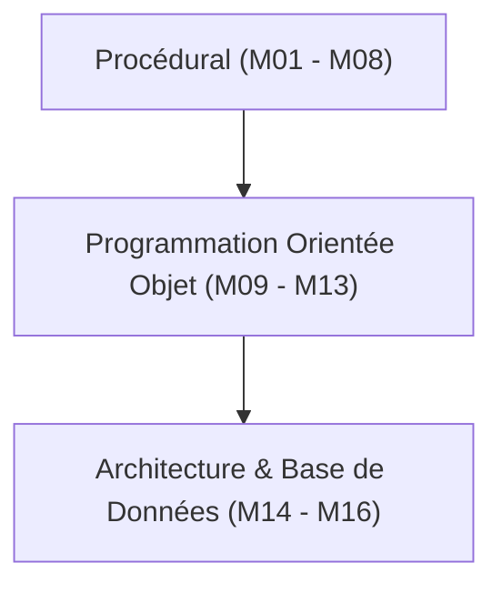

# Rapport de Formation — PHP

## Résumé Exécutif

| Indicateur | Valeur |
|---|---|
| **Modules rédigés** | 16 modules (Masterclass) |
| **Bilan structurel** | Modules denses et exhaustifs (20 à 60 Ko) |
| **Conformité SKILL v2.0.0** | ✅ Totale |
| **Niveau technique** | Débutant au format Avancé (POO, MVC, Bases de données) |
| **État d'avancement** | **Récemment refondue et validée** |

 

---

## Structure Actuelle de la Formation (Masterclass)

La formation PHP a été entièrement structurée sous forme de Masterclass globale recouvrant les bases jusqu'à l'architecture logicielle :

Les modules vont de `module1.md` (Fondations, Variables, Installation) à `module16.md` (Design Patterns, Sécurité).

*Note : La convention de nommage (`moduleX.md`) diffère de notre standard recommandé (`0X-titre.md`), mais le contenu est resté prioritaire.*

 

---

## Conformité SKILL v2.0.0

| Critère SKILL v2.0.0 | Statut | Commentaire |
|---|---|---|
| Frontmatter YAML | ✅ | Conforme |
| `
` | ✅ | Conforme |
| Richesse du contenu | ✅ | Exceptionnelle (Utilisation intensive des diagrammes Mermaid, Tableaux comparatifs) |
| Séparation des concepts | ⚠️ | Certains fichiers sont longs (>50 Ko) mais justifiés par le niveau de détail "Masterclass" |
| Analogies pédagogiques | ✅ | Présent au début de chaque grand thème |

 

---

## Conclusion et Recommandations

!!! quote "Bilan global PHP"
    C'est actuellement l'une des formations les plus complètes (plus de 16 modules). Le format Masterclass garantit que tout le spectre du PHP (version 8+) est couvert : depuis la création de variables jusqu'à l'injection de dépendances et au pattern MVC complet.

**Recommandations :**
1. **Renommage optionnel :** Passer de `moduleX.md` à `01-fondations.md`, `02-fonctions.md` pour un repère visuel plus évident dans la hiérarchie des dossiers (si le moteur Zensical est configurer pour trier par alpha).
2. Autrement, la réécriture récente atteste d'une grande conformité avec nos standards d'excellence.
