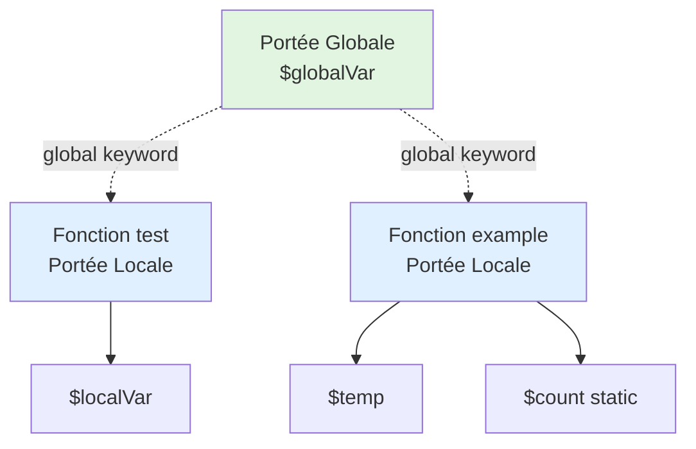

# I - Fondations PHP

<div
  class="omny-meta"
  data-level="🟢 Débutant"
  data-version="1.0"
  data-time="6-8 heures">
</div>

## Introduction : Bienvenue dans le Monde PHP

!!! abstract "Objectif du module"
    Ce module pose les bases indispensables de votre parcours de développeur PHP. Nous allons configurer votre environnement, comprendre comment PHP communique avec le serveur, et maîtriser la syntaxe fondamentale pour écrire du code propre, performant et sécurisé.

!!! quote "Analogie pédagogique"
    _Imaginez PHP comme une **cuisine professionnelle**. Avant de préparer un repas gastronomique (application web), vous devez d'abord **connaître vos outils** : où sont les couteaux (variables), comment fonctionne le four (serveur), quels ingrédients utiliser (types de données), et surtout les **règles d'hygiène** (sécurité). Un grand chef ne commence jamais par un plat complexe : il apprend d'abord à tenir correctement un couteau, à mesurer précisément, à goûter et ajuster. Ce module est votre **formation de base en cuisine PHP** : vous apprendrez les fondamentaux qui serviront de socle à toute votre carrière de développeur._

**PHP (Hypertext Preprocessor)** = Langage de script côté serveur pour créer des sites web dynamiques.

**Pourquoi apprendre PHP en 2026 ?**

- ✅ **80% du web** tourne sur PHP (WordPress, Laravel, Symfony)
- ✅ **Facile à apprendre** pour débutants
- ✅ **Écosystème riche** (Composer, frameworks modernes)
- ✅ **Emplois nombreux** et bien rémunérés
- ✅ **Communauté active** et ressources abondantes
- ✅ **Évolution constante** (PHP 8.3 apporte typage strict, performances, sécurité)

!!! note "**Ce module vous apprend les fondations solides pour construire du PHP sûr et professionnel.**"

<br>

---

## 1. Installation et Configuration

### 1.1 Comprendre l'Environnement PHP

Avant de coder, il est primordial de comprendre où s'exécute votre code. Contrairement au HTML/CSS, PHP ne "vit" pas chez l'utilisateur mais sur votre serveur.

**Diagramme : Comment fonctionne PHP**

```mermaid
sequenceDiagram
    autonumber
    participant User as Utilisateur
    participant Browser as Navigateur
    participant Server as "Serveur Web<br/>(Apache/Nginx)"
    participant PHP as Moteur PHP
    participant DB as Base de Données
    
    User->>Browser: Ouvre https://site.com/page.php
    Browser->>Server: Requête HTTP GET /page.php
    Server->>PHP: Exécuter page.php
    
    Note over PHP: "<?php<br/>echo "Hello";<br/>?>"
    
    PHP->>DB: SELECT * FROM users
    DB-->>PHP: Données utilisateurs
    
    PHP-->>Server: HTML généré
    Server-->>Browser: Réponse HTTP (HTML)
    Browser->>User: Affiche page HTML
    
    Note over User,DB: Le code PHP n'est JAMAIS visible<br/>par l'utilisateur (sécurité)
```
_Ce diagramme illustre le cycle requête-réponse : le serveur traite le PHP et ne renvoie que du HTML pur au navigateur._

**Point clé :** PHP s'exécute **côté serveur**, pas dans le navigateur (comme JavaScript).

### 1.2 Installation Moderne sur Windows (Sans XAMPP)

**Fini le temps des environnements lourds comme XAMPP ou WAMP.** Aujourd'hui, on privilégie une approche légère, modulaire et proche de la réalité des serveurs de production. Maîtriser l'installation manuelle vous permet de mieux comprendre les rouages de votre serveur.

**Les 3 piliers d'un environnement moderne :**

1. **PHP (Le Langage)** : L'exécutable qui interprète votre code.
2. **MySQL / MariaDB (Le Serveur de BDD)** : L'endroit où vos données sont stockées.
3. **Le Client BDD (Interface)** : L'outil pour visualiser vos tables (DBeaver, TablePlus).

!!! tip "Alternative Tout-en-un Moderne : PHPNew / Herd"
    Il existe aussi des solutions plus modernes que XAMPP (comme _PHPNew_ ou _Laravel Herd_) qui sont très pratiques et configurées par défaut.

#### Démarrer votre premier serveur PHP

Avec le serveur interne de PHP, c'est **vous** qui décidez où vous codez ! Plus besoin de dossiers imposés par un logiciel tiers.

1. **Créer votre dossier projet n'importe où (ex: `C:\Projets\MonSite`)**
2. **Créer un fichier `index.php`** :

```php title="PHP - Premier script de test"
<?php
// Mon premier script PHP pour tester l'installation
echo "<h1>Hello World depuis le Serveur Interne PHP !</h1>";

// Affiche toute la configuration du serveur (version, extensions...)
phpinfo(); 
?>
```
_Ce script affiche un message de bienvenue suivi de la page de configuration détaillée de votre installation PHP._

3. **Lancer le Serveur Interne (La Magie)**
   - Ouvrez votre Terminal (PowerShell ou Bash) **dans ce dossier**.
   - Tapez la commande suivante :

```bash title="Terminal - Démarrage du serveur PHP"
php -S localhost:8000
```
_Cette commande lance un serveur web léger écoutant sur le port 8000 de votre machine locale._

4. **Vérifier l'installation**
   - Ouvrez votre navigateur et allez sur : `http://localhost:8000`
   - Le serveur tournera tant que vous ne fermez pas la fenêtre de votre terminal (Ctrl+C pour l'arrêter).

### 1.3 Installation sur macOS (Laravel Valet)

Valet est l'outil de référence pour les développeurs Mac : il est ultra-léger et configure automatiquement vos noms de domaine locaux en `.test`.

**Prérequis : Homebrew installé**

```bash title="Terminal - Installation de Valet sur macOS"
# 1. Installer Homebrew si pas déjà fait
/bin/bash -c "$(curl -fsSL https://raw.githubusercontent.com/Homebrew/install/HEAD/install.sh)"

# 2. Installer PHP
brew install php@8.2

# 3. Installer Composer (gestionnaire de dépendances)
brew install composer

# 4. Installer Valet globalement
composer global require laravel/valet

# 5. Ajouter Composer au PATH pour accéder aux commandes
echo 'export PATH="$HOME/.composer/vendor/bin:$PATH"' >> ~/.zshrc
source ~/.zshrc

# 6. Finaliser l'installation de Valet
valet install

# 7. Définir le dossier où se trouvent vos sites
mkdir ~/Sites
cd ~/Sites
valet park
```
_Cette suite de commandes configure un environnement professionnel automatisé où chaque dossier devient un site accessible via une URL._

**Créer premier projet :**

```bash title="Terminal - Création d'un projet Valet"
cd ~/Sites
mkdir mon-projet
cd mon-projet
echo "<?php echo 'Hello Valet'; ?>" > index.php
```
_Nous créons ici un projet 'mon-projet' qui sera immédiatement accessible sur http://mon-projet.test._

### 1.4 Installation avec Docker (Recommandé Pro)

Docker est la méthode "professionnelle" par excellence. Il permet de créer une bulle isolée (conteneur) contenant exactement la version de PHP et les réglages dont vous avez besoin, sans polluer votre système hôte.

**Fichier `docker-compose.yml` :**

```yaml title="Docker - Configuration environnement PHP"
version: '3.8'

services:
  php:
    image: php:8.2-apache
    container_name: php-formation
    ports:
      - "8080:80"
    volumes:
      - ./src:/var/www/html
    environment:
      - PHP_DISPLAY_ERRORS=On
      - PHP_ERROR_REPORTING=E_ALL
```
_Ce fichier définit un service 'php' utilisant le serveur Apache, redirigeant le port 8080 vers le conteneur._

**Commandes de démarrage :**

```bash title="Terminal - Lancement de Docker"
# 1. Créer structure projet
mkdir php-formation
cd php-formation
mkdir src

# 2. Créer docker-compose.yml (contenu ci-dessus)

# 3. Créer src/index.php
echo "<?php echo 'Hello Docker'; ?>" > src/index.php

# 4. Démarrer le conteneur en arrière-plan
docker-compose up -d
```
_L'option -d permet de lancer le serveur sans bloquer votre terminal actif._

**Avantages Docker :**

- ✅ Isolation complète 
- ✅ Reproductible 
- ✅ Facile à partager 
- ✅ Multiple versions PHP

### 1.5 Éditeur de Code : VS Code

Un bon artisan possède de bons outils. VS Code est l'éditeur standard, mais il a besoin de quelques extensions pour devenir un véritable allié en PHP.

**Configuration recommandée :**

```bash title="VS Code - Extensions essentielles"
# 1. Télécharger VS Code sur https://code.visualstudio.com/

# 2. Extensions PHP à installer depuis le market :
- PHP Intelephense : Pour l'autocomplétion intelligente et la détection d'erreurs.
- PHP Debug : Pour utiliser Xdebug et inspecter votre code en temps réel.
- PHP CS Fixer : Pour formater automatiquement votre code selon les standards (PSR).
```
_Ces extensions transforment un simple éditeur de texte en un Environnement de Développement Intégré (IDE) puissant._

**Configuration VS Code pour PHP (`settings.json`) :**

```json title="VS Code - Configuration settings.json"
{
  "php.validate.executablePath": "C:/xampp/php/php.exe",
  "php.suggest.basic": true,
  "editor.formatOnSave": true,
  "files.autoSave": "afterDelay",
  "files.autoSaveDelay": 1000
}
```
_Ces reglages assurent que votre code est validé par PHP et sauvegardé/formaté automatiquement à chaque modification._

<br>

---

## 2. Syntaxe de Base PHP

La syntaxe est la grammaire du langage. En PHP, elle est héritée du C et du Java, ce qui la rend familière pour beaucoup de développeurs.

### 2.1 Balises PHP

Toute instruction PHP doit être encadrée par des balises spécifiques pour que le serveur sache qu'il doit interpréter ce bloc.

```php title="PHP - Utilisation des balises"
<?php
// Le code PHP commence ici
echo "Hello";

// Le code PHP s'arrête ici
?>
```
_La balise d'ouverture <?php est obligatoire pour démarrer le moteur de script._

**Règles de bonnes pratiques :**

```php title="PHP - Comparaison des styles de balises"
<?php
// ✅ BON : Balises complètes, compatibilité maximale
echo "Ceci fonctionne partout";
?>

<?
// ❌ MAUVAIS : Balises courtes (short tags)
// Souvent désactivé sur les serveurs de production, à bannir.
echo "Ne pas utiliser";
?>

<?php
// ✅ RECOMMANDATION : Pas de balise fermante ?> 
// Dans un fichier contenant UNIQUEMENT du PHP, on omet la fermeture
// pour éviter l'envoi accidentel d'espaces blancs au navigateur.
echo "Fichier PHP pur sans fermeture";
```
_Omettre la balise fermante est un standard moderne pour éviter des erreurs de headers HTTP (Unexpected output)._

### 2.2 Affichage avec echo et print

Afficher des données est l'action la plus courante. PHP propose plusieurs méthodes, `echo` étant la plus performante.

```php title="PHP - Exemples d'affichage"
<?php

// Affichage simple d'une chaîne
echo "Bonjour le monde";

// Affichage de code HTML (sera interprété par le navigateur)
echo "<h1>Titre de ma page</h1>";

// Affichage multiple avec séparation par des virgules
echo "Bonjour", " ", "à", " ", "tous";

// Concaténation avec le point (.)
$nom = "Alice";
echo "Bonjour " . $nom; 

// Interprétation de variable dans des guillemets doubles
echo "Bonjour $nom"; 

// Utilisation de print (retourne une valeur, plus lent)
print "Hello via print";
```
_L'utilisation des guillemets doubles permet d'injecter directement des variables sans utiliser de concaténation._

**Comparaison echo vs print :**

| Aspect | echo | print |
| :--- | :--- | :--- |
| **Rapidité** | Plus rapide (pas de retour) | Plus lent (retourne 1) |
| **Paramètres** | Multiples autorisés | Un seul autorisé |
| **Usage** | Standard de l'industrie | Cas spécifiques |

### 2.3 Commentaires

Un code n'est bon que s'il est compréhensible. Les commentaires servent à expliquer le **pourquoi** de votre logique, pas le **comment**.

```php title="PHP - Types de commentaires"
<?php

// Commentaire sur une seule ligne (le plus courant)
echo "Ceci s'exécute";

# Commentaire style Bash (moins fréquent en PHP moderne)
# Préférer // pour la cohérence

/*
 * Commentaire multi-lignes
 * Idéal pour expliquer des algorithmes complexes
 * ou désactiver temporairement des blocs de code.
 */
echo "Ceci s'exécute aussi";

/**
 * Commentaire de documentation (PHPDoc)
 * Utilisé par les IDE pour générer de l'aide au survol.
 * 
 * @param string $nom Le nom de l'utilisateur
 * @return string Le message de bienvenue
 */
function direBonjour($nom) {
    return "Bonjour " . $nom;
}
```
_Les blocs PHPDoc (commençant par /**) sont essentiels pour documenter vos fonctions et classes de manière professionnelle._

### 2.4 Point-virgule et Accolades

Le PHP est un langage "terminé par des points-virgules". Chaque instruction doit être close, sous peine de bloquer toute l'exécution.

```php title="PHP - Ponctuation du code"
<?php

// ✅ Chaque instruction finit par ;
echo "Hello";
$x = 5;

// ❌ L'absence de point-virgule génère une 'Parse Error'
// echo "Erreur"

// Utilisation des accolades pour définir des blocs (conditions, boucles)
if ($x > 0) {
    echo "Le nombre est positif";
}

// ✅ RÈGLE D'OR : Toujours mettre des accolades
// Même pour une seule ligne, cela évite des bugs lors de l'ajout de code futur.
if ($x > 0) {
    echo "Style propre et sécurisé";
}
```
_Le respect des accolades et de l'indentation rend votre code robuste et facile à maintenir._

<br>

---

## 3. Variables et Constantes

Les variables sont le cœur de tout programme. Elles permettent de stocker, manipuler et transporter des données tout au long de l'exécution du script.

### 3.1 Déclaration de Variables

En PHP, les variables commencent toujours par le symbole `$`. Le langage est à typage dynamique : vous n'avez pas besoin de préciser si c'est un texte ou un nombre, PHP le devine tout seul.

**Syntaxe et assignation :**

```php title="PHP - Déclaration de variables"
<?php

// Stockage de différents types de données
$nom = "Alice";      // String (chaîne)
$age = 25;           // Integer (entier)
$prix = 19.99;       // Float (décimal)
$estActif = true;    // Boolean (vrai/faux)

// Affichage simple
echo $nom;      // Affiche : Alice
echo $age;      // Affiche : 25
```
_La variable est créée dès qu'une valeur lui est affectée avec le signe égal (=)._

**Règles de nommage strictes :**

```php title="PHP - Règles de nommage"
<?php

// ✅ VALIDE : Commence par une lettre ou un underscore
$nom = "Alice";
$_score = 100;
$user2 = "Bob";

// ❌ INVALIDE : Erreurs fatales
// $2user = "Bob";    // Interdit de commencer par un chiffre
// $user-name = "";   // Interdit d'utiliser des tirets (interprétés comme signe moins)
// $user name = "";   // Interdit d'utiliser des espaces
```
_Choisir des noms clairs et respectant ces règles est la première étape vers un code de qualité._

**Conventions de style professionnelles :**

```php title="PHP - Conventions camelCase vs snake_case"
<?php

// ✅ RECOMMANDÉ (Standard PSR) : camelCase
$nomUtilisateur = "Alice";
$prixTotalTTC = 240.50;

// ✅ ACCEPTÉ : snake_case (souvent utilisé dans Laravel)
$nom_utilisateur = "Alice";
$prix_total_ttc = 240.50;

// ❌ À ÉVITER : Noms trop courts ou obscurs
$n = "Alice";  // Que signifie 'n' ?
$data = [];    // Trop générique
```
_L'utilisation du camelCase (majuscule à chaque nouveau mot sauf le premier) est la convention la plus répandue en PHP moderne._


### 3.2 Portée des Variables (Scope)

La "portée" désigne l'endroit dans votre code où une variable est accessible. Comprendre le scope est vital pour éviter que vos fonctions n'écrasent accidentellement des données importantes.

```php title="PHP - Portée globale et locale"
<?php

// 1. PORTÉE GLOBALE (définie en dehors de toute fonction)
$globalVar = "Je suis globale";

function test() {
    // ❌ ERREUR : $globalVar n'est pas accessible ici par défaut
    // echo $globalVar; 
    
    // Pour accéder à une variable globale dans une fonction :
    global $globalVar;
    echo $globalVar; // ✅ Fonctionne maintenant
}

test();

// 2. PORTÉE LOCALE (définie à l'intérieur d'une fonction)
function example() {
    $localVar = "Je suis locale";
    echo $localVar; // ✅ Accessible uniquement ici
}

example();
// echo $localVar; // ❌ ERREUR : elle n'existe plus en dehors de la fonction
```
_Par défaut, les fonctions PHP sont isolées du monde extérieur pour garantir la sécurité et la modularité._

```php title="PHP - Portée statique"
<?php

// 3. PORTÉE STATIQUE (persiste entre plusieurs appels)
function compteur() {
    static $count = 0; // Initialisée une seule fois
    $count++;
    echo $count . "\n";
}

compteur(); // Affiche 1
compteur(); // Affiche 2
compteur(); // Affiche 3
?>
```
_Une variable statique garde sa valeur en mémoire même après la fin de l'exécution de la fonction._

**Diagramme : Portée des variables**


_Ce schéma illustre l'étanchéité entre les différents espaces de stockage de données._

### 3.3 Variables Superglobales

Les superglobales sont des variables intégrées au langage, créées automatiquement par PHP, et accessibles absolument partout dans votre script sans utiliser le mot-clé `global`.

```php title="PHP - Utilisation des Superglobales"
<?php

// $_GET : Données transmises via l'URL (ex: page.php?nom=Alice)
echo $_GET['nom'] ?? 'Inconnu';

// $_POST : Données envoyées par un formulaire sécurisé
echo $_POST['email'] ?? 'Non renseigné';

// $_SERVER : Informations techniques sur l'environnement
echo $_SERVER['SERVER_NAME'];    // ex: localhost
echo $_SERVER['REQUEST_METHOD']; // GET ou POST

// $_SESSION : Données qui "suivent" l'utilisateur sur tout le site
session_start();
$_SESSION['id'] = 42;

// $_COOKIE : Petits fichiers stockés sur l'ordinateur de l'utilisateur
echo $_COOKIE['theme'] ?? 'light';

// $_FILES : Détails des fichiers uploadés par l'utilisateur
echo $_FILES['avatar']['name'] ?? 'Aucun fichier';

// $GLOBALS : Accès direct à toutes les variables globales du script
$x = 10;
echo $GLOBALS['x'];
```
_Ces variables sont des tableaux associatifs contenant des informations précieuses sur la requête de l'utilisateur._

**⚠️ SÉCURITÉ CRITIQUE :**

Ne faites jamais confiance aux données venant des superglobales (`$_GET`, `$_POST`...). Un utilisateur malveillant peut y injecter du code dangereux (XSS).

```php title="PHP - Sécurisation des entrées utilisateur"
<?php

// ❌ DANGER : Affichage direct (vulnérable au XSS)
// echo $_GET['nom']; 

// ✅ SOLUTION : Toujours filtrer ou échapper
$nom = htmlspecialchars($_GET['nom'] ?? 'Invité', ENT_QUOTES, 'UTF-8');
echo $nom; 

// ✅ VÉRIFICATION D'EXISTENCE :
if (isset($_GET['id']) && is_numeric($_GET['id'])) {
    $id = (int)$_GET['id'];
}
```
_L'utilisation de htmlspecialchars() transforme les caractères HTML spéciaux en texte inoffensif._

### 3.4 Constantes

Une constante est un identifiant pour une valeur simple qui, comme son nom l'indique, ne pourra jamais être modifiée durant l'exécution du script. Elles sont idéales pour les réglages de configuration.

```php title="PHP - Définition de constantes"
<?php

// Méthode moderne et recommandée : mot-clé 'const'
const APP_VERSION = '1.2.0';
const DB_NAME = 'formation_php';

// Méthode classique : fonction define()
define('SITE_URL', 'https://omnyvia.com');

// Affichage (pas de symbole $)
echo APP_VERSION;
echo SITE_URL;

// ❌ ERREUR : On ne peut pas réassigner une constante
// APP_VERSION = '2.0'; // Fatal Error
```
_Les constantes ne portent pas le symbole $ et sont accessibles partout, comme les superglobales._

**Tableau : Variables vs Constantes**
| Aspect | Variables | Constantes |
| :--- | :--- | :--- |
| **Symbole** | `$nomVariable` | `NOM_CONSTANTE` (Majuscules) |
| **Modification** | Possible à tout moment | **Strictement interdite** |
| **Portée** | Locale/Globale | **Toujours globale** |
| **Usage** | Données vivantes | réglages, configuration |

<br>

---

## 4. Types de Données

PHP gère intelligemment la nature des informations que vous manipulez. Bien qu'il soit souple, connaître les types est essentiel pour éviter des erreurs de calcul ou de logique.

### 4.1 Types Scalaires

Les types scalaires sont les types de base contenant une seule valeur à la fois.

**1. Integer (Entier)** : Nombres sans virgule.

```php title="PHP - Nombres entiers"
<?php
$age = 25;           // Décimal classique
$hexadecimal = 0xFF; // 255 en décimal
$binaire = 0b1010;   // 10 en décimal

// Vérification de type
var_dump($age);    // Affiche le type et la valeur
echo is_int($age); // Retourne 1 (vrai)
```
_PHP supporte les notations binaires, octales et hexadécimales nativement._

**2. Float (Décimal)** : Nombres à virgule (appelés nombres à virgule flottante).

```php title="PHP - Nombres à virgule"
<?php
$prix = 19.99;
$pi = 3.14159;

// ⚠️ ATTENTION : La précision des décimaux est limitée en informatique
$a = 0.1;
$b = 0.2;
echo ($a + $b); // Peut afficher 0.30000000000000004
```
_Ne comparez jamais deux floats directement avec ==, utilisez une marge d'erreur (epsilon)._

**3. String (Chaîne de caractères)** : Du texte.

```php title="PHP - Chaînes de caractères"
<?php
// Guillemets simples : pas d'interprétation
$prenom = 'Alice'; 

// Guillemets doubles : interprète les variables et les caractères spéciaux (\n)
echo "Bonjour $prenom\n";

// Concaténation (réunion de chaînes)
$nomComplet = $prenom . " DUPONT";

// Heredoc : pour les blocs multi-lignes longs (HTML, SQL)
$email = <<<TXT
Bonjour $prenom,
Bienvenue dans la formation PHP.
TXT;
```
_Utilisez les guillemets simples par défaut pour gagner en performance si vous n'avez pas de variables à injecter._

**4. Boolean (Booléen)** : Vrai (`true`) ou Faux (`false`).

```php title="PHP - États binaires"
<?php
$estConnecte = true;
$aAcces = false;

// Ce qui est considéré comme FALSE par PHP :
// false, 0, 0.0, "", "0", null, [] (tableau vide)
```
_Les booléens sont le moteur de toutes les conditions logiques que nous verrons plus tard._

### 4.2 Types Composés

Les types composés permettent de regrouper plusieurs valeurs dans une seule "super-variable".

**1. Array (Tableau)** : Une collection ordonnée de données.

```php title="PHP - Tableaux (indexés et associatifs)"
<?php
// Tableau indexé (numéros commençant par 0)
$fruits = ["Pomme", "Banane"];
echo $fruits[0]; // Pomme

// Tableau associatif (clés personnalisées)
$user = [
    "nom" => "Alice",
    "role" => "Admin"
];
echo $user["nom"]; // Alice
```
_Un tableau peut contenir n'importe quel autre type, y compris d'autres tableaux (multidimensionnel)._

**2. Object (Objet)** : Une instance d'une classe (base de la POO).

```php title="PHP - Objets simples"
<?php
$client = new stdClass(); // Création d'un objet vide
$client->nom = "Alice";

echo $client->nom;
```
_Les objets permettent de lier des données et des fonctions (méthodes) au sein d'une structure commune._

### 4.3 Types Spéciaux

**1. NULL** : Représente l'absence totale de valeur.

```php title="PHP - Valeur nulle"
<?php
$panier = null; // Le panier est vide
echo is_null($panier); // true
```
_NULL est différent d'une chaîne vide ou du chiffre 0._

**2. Resource** : Un lien vers une ressource externe (fichier ouvert, connexion BDD).

```php title="PHP - Ressources externes"
<?php
$fichier = fopen("test.txt", "r");
// $fichier est ici une ressource PHP
fclose($fichier);
```
_Vous ne manipulerez pas souvent les ressources directement, mais via des fonctions dédiées._

<br>

---

## 5. Opérateurs

Les opérateurs sont les symboles qui permettent de transformer, combiner ou comparer des données.

### 5.1 Opérateurs Arithmétiques

Pour effectuer des calculs mathématiques classiques.

```php title="PHP - Mathématiques de base"
<?php
$a = 10;
$b = 3;

echo $a + $b;  // 13 (Addition)
echo $a % $b;  // 1  (Modulo : reste de la division entière)
echo $a ** $b; // 1000 (Puissance : 10 exposant 3)

// Incrémentation (ajouter 1)
$x = 5;
$x++; // $x vaut maintenant 6
```
_L'opérateur modulo (%) est très utile pour savoir si un nombre est pair ou pour créer des cycles._

### 5.2 Opérateurs d'Affectation

Pour enregistrer une valeur dans une variable, souvent en la modifiant au passage.

```php title="PHP - Raccourcis d'affectation"
<?php
$total = 100;
$total += 20; // Équivalent à $total = $total + 20;

$nom = "Alice";
$nom .= " D."; // Concaténation et affectation
```
_Ces raccourcis rendent votre code plus concis et plus lisible._

### 5.3 Opérateurs de Comparaison

Indispensables pour créer de la logique. Ils comparent deux valeurs et renvoient un booléen.

```php title="PHP - Comparaisons logiques"
<?php
$a = 5;
$b = "5";

// Égalité simple (vérifie la valeur, convertit le type si besoin)
echo ($a == $b); // true

// Égalité stricte (vérifie la valeur ET le type)
echo ($a === $b); // false (car int != string)

// Différence
echo ($a !== $b); // true (ils sont différents strictement)

// Comparaisons classiques
echo (10 > 5);  // true
echo (10 <= 10); // true
```
_**RÈGLE D'OR :** Utilisez toujours === et !== pour éviter des comportements imprévisibles liés aux conversions automatiques de PHP._

### 5.4 Opérateurs Logiques

Pour combiner plusieurs conditions ensemble.

```php title="PHP - Combinaisons logiques"
<?php
$age = 20;
$permis = true;

// ET (&&) : Les deux doivent être vrais
if ($age >= 18 && $permis) {
    echo "Droit de conduire";
}

// OU (||) : Au moins un des deux doit être vrai
if ($age < 18 || !$permis) {
    echo "Interdit de conduire";
}

// NON (!) : Inverse l'état (vrai devient faux)
$estBloque = false;
if (!$estBloque) { echo "Accès autorisé"; }
```
_PHP s'arrête de vérifier dès qu'il connaît le résultat (court-circuit) : si la première partie d'un && est fausse, la deuxième n'est même pas testée._

### 5.5 Opérateurs Spéciaux PHP

PHP a introduit des opérateurs modernes pour simplifier la gestion des valeurs nulles et les comparaisons complexes.

```php title="PHP - Opérateurs modernes (PHP 7/8)"
<?php

// Opérateur Null Coalescing (??)
// Retourne la première valeur si elle existe et n'est pas nulle, sinon la seconde.
$nom = $_GET['user'] ?? 'Anonyme';

// Opérateur Spaceship (<=>)
// Utile pour le tri : retourne -1, 0 ou 1
echo 5 <=> 10; // -1 (inférieur)
echo 10 <=> 5; // 1 (supérieur)
echo 5 <=> 5;  // 0 (égal)

// Opérateur de coalescence d'affectation (??=)
$config['theme'] ??= 'dark'; // Assigne seulement si n'est pas déjà défini
```
_Ces opérateurs réduisent considérablement la verbosité de votre code, le rendant plus lisible et moins sujet aux erreurs._

<br>

---

## 6. Type Juggling et Casting

Le PHP est un langage à "typage faible". Il essaie de convertir automatiquement les données pour que vos opérations fonctionnent, ce qui est pratique mais parfois dangereux.

### 6.1 Conversion Automatique (Type Juggling)

C'est le comportement par défaut : PHP change le type d'une variable selon le contexte.

```php title="PHP - Exemples de Type Juggling"
<?php
$a = "5";     // String
$b = 10;      // Integer
$c = $a + $b; // PHP convertit "5" en 5 et additionne

var_dump($c); // int(15)
```
_PHP privilégie toujours l'exécution du script, quitte à deviner vos intentions de calcul._

### 6.2 Conversion Manuelle (Casting)

Pour un code robuste, il est préférable de forcer vous-même le type d'une donnée. C'est ce qu'on appelle le "casting".

```php title="PHP - Casting explicite"
<?php

// Forcer une variable en entier (utile pour sécuriser des IDs)
$idProjet = (int)"42-formation"; 
echo $idProjet; // 42

// Forcer en booléen
$isActive = (bool)1; // true

// Forcer en tableau
$liste = (array)"Une seule valeur";
```
_Le casting explicite documente votre intention et rend le code beaucoup plus prévisible._

### 6.3 declare(strict_types=1)

Depuis PHP 7, vous pouvez activer le mode strict. Cela oblige PHP à vérifier que les types passés aux fonctions correspondent exactement à ce qui est attendu.

```php title="PHP - Activation du mode strict"
<?php
declare(strict_types=1); // DOIT être la toute première ligne du fichier

function additionner(int $a, int $b): int {
    return $a + $b;
}

// ✅ Fonctionne (les deux sont des entiers)
echo additionner(5, 3); 

// ❌ ERREUR FATALE (et c'est une bonne chose !)
// echo additionner("5", 3); // TypeError lancé immédiatement
```
_L'utilisation de strict_types=1 est un standard de qualité incontournable dans tout projet professionnel moderne._

<br>

---

## 7. Sécurité Dès le Départ

La sécurité n'est pas une option qu'on ajoute à la fin : elle se construit brique par brique, dès votre premier script.

### 7.1 Validation des Entrées utilisateur

Ne faites jamais confiance à ce qu'un utilisateur envoie. PHP propose `filter_input` pour valider proprement vos données.

```php title="PHP - Validation d'email et d'entier"
<?php

// Valider un email propre
$email = filter_input(INPUT_POST, 'email', FILTER_VALIDATE_EMAIL);

if (!$email) {
    echo "Format d'email invalide !";
}

// Valider un âge dans une tranche précise
$age = filter_input(INPUT_GET, 'age', FILTER_VALIDATE_INT, [
    "options" => ["min_range" => 1, "max_range" => 120]
]);
```
_La validation assure que les données reçues correspondent au format attendu avant même de les traiter._

### 7.2 Prévention des failles XSS

Si vous affichez une donnée envoyée par un utilisateur, vous devez impérativement "l'échapper" pour empêcher l'exécution de scripts malveillants.

```php title="PHP - Échappement HTML sécurisé"
<?php

$nomProfil = $_GET['nom'] ?? 'Invité';

// ✅ Transformation des caractères dangereux en texte inoffensif
echo htmlspecialchars($nomProfil, ENT_QUOTES, 'UTF-8');
```
_La fonction htmlspecialchars() est votre bouclier principal contre les attaques par injection de scripts dans vos pages._

<br>

---

## 8. Exercices Pratiques

La théorie n'est rien sans la pratique. Voici vos deux premiers défis pour valider vos acquis.

### Exercice 1 : Calculatrice Sécurisée

!!! tip "Pratique Intensive — Projet 1"
    La création complète d'une Calculatrice gérant les divisions par zéro et échappant nativement les failles XSS se trouve dans la section **Projets Pratiques**.
    
    👉 **[Aller au Projet 1 : Calculatrice PHP](../../../../projets/php-lab/01-calculatrice/index.md)**

### Exercice 2 : Convertisseur d'Unités

!!! tip "Pratique Intensive — Projet 2"
    La construction architecturée des switchs et le typage strict des fonctions de conversion mathématiques se trouvent dans votre lab.
    
    👉 **[Aller au Projet 2 : Convertisseur Web](../../../../projets/php-lab/02-convertisseur/index.md)**

<br>

---

## 9. Checkpoint de Progression

### Savoir-Faire Validés :

- [x] Installer et configurer un serveur local (Docker, Valet ou interne)
- [x] Utiliser les balises de manière moderne (sans fermeture sur fichiers purs)
- [x] Manipuler les variables avec le bon scope (Portée)
- [x] Maîtriser les 8 types de données fondamentaux
- [x] Comparer des données avec l'égalité stricte (`===`)
- [x] Sécuriser les entrées avec `filter_input` et les sorties avec `htmlspecialchars`

<br>

---

## Conclusion

!!! quote "Résumé du module"
    Félicitations ! Vous venez de franchir la première étape, et sans doute la plus cruciale, de votre apprentissage. Vous ne vous contentez pas de "faire marcher" du code PHP : vous comprenez désormais comment l'installer proprement, comment structurer vos données de manière typée et surtout comment protéger votre application dès les premières lignes. Ces fondations sont le socle sur lequel reposent tous les frameworks modernes comme Laravel ou Symfony.

> Prêt à donner de l'intelligence à vos scripts ? Dans le **Module 2**, nous allons apprendre à prendre des décisions avec les structures de contrôle et à automatiser des tâches répétitives avec les boucles.

<br>

---

## Conclusion

!!! quote "Ce qu'il faut retenir"
    Le langage PHP a radicalement évolué. Il n'est plus le langage de script désordonné d'il y a 15 ans, mais un langage typé, orienté objet et performant. La maîtrise de ses concepts avancés est essentielle pour utiliser correctement un framework comme Laravel.

> [Retourner à la Masterclass PHP →](../index.md)
