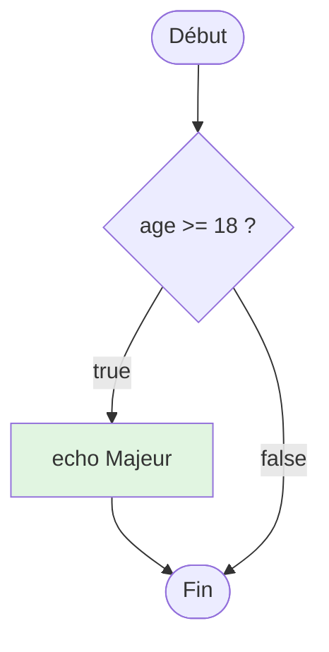
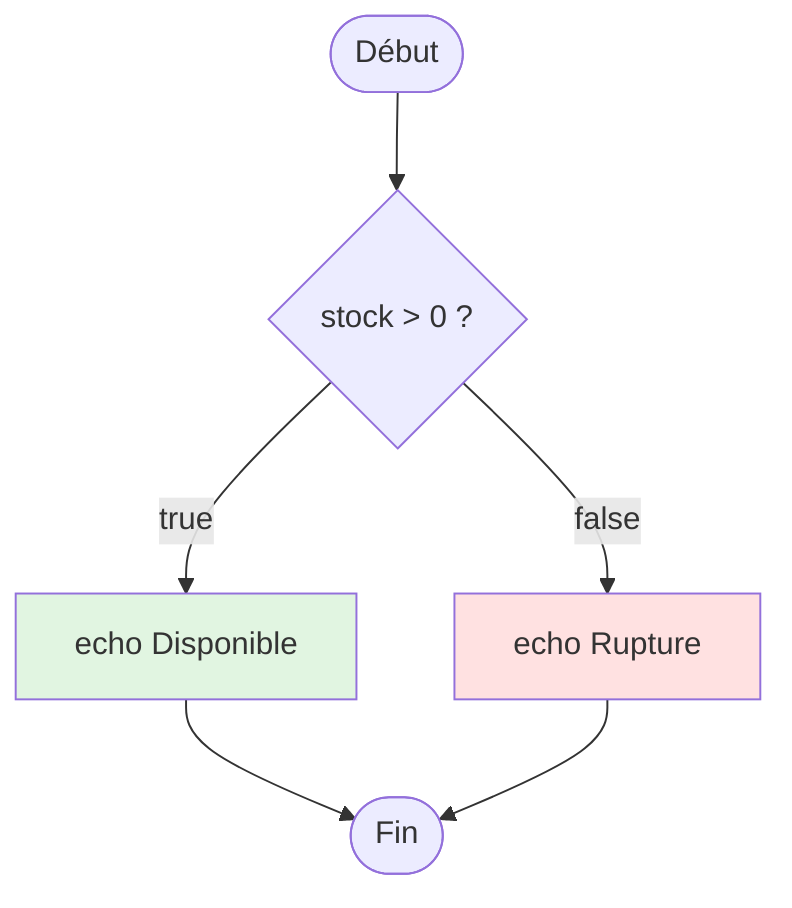
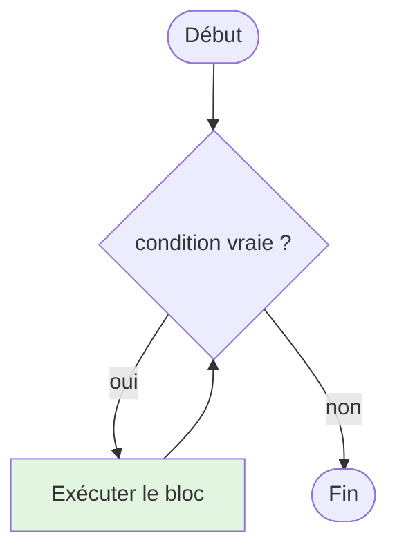

# II - Structures de Contrôle

<div
  class="omny-meta"
  data-level="🟢 Débutant"
  data-version="1.0"
  data-time="7-9 heures">
</div>

!!! abstract "Objectif du module"
    Apprendre à diriger le flux d'exécution de vos programmes PHP. Vous découvrirez comment faire prendre des décisions à votre code (conditions), comment automatiser des tâches répétitives (boucles) et comment utiliser les nouvelles expressions de PHP 8 pour un code plus propre et plus sûr.

## Introduction : Diriger le Flux de votre Code

!!! quote "Analogie pédagogique"
    _Imaginez votre code comme une **rivière**. Sans structures de contrôle, l'eau coule toujours tout droit, du début à la fin, sans possibilité de déviation. Les **conditions (if/else)** sont comme des **barrages** qui dirigent l'eau dans différents canaux selon des critères (pluie, sécheresse). Les **boucles (for/while)** sont comme des **roues à aubes** qui répètent une action tant qu'il y a du courant. Le **switch** est un **système d'aiguillage ferroviaire** qui dirige vers une voie parmi plusieurs. Ces structures donnent à votre code la capacité de **prendre des décisions** et de **répéter des actions**, transformant un simple script linéaire en un programme intelligent et dynamique._

**Structures de contrôle** = Mécanismes pour diriger le flux d'exécution du code.

**Pourquoi sont-elles essentielles ?**

- ✅ **Décisions intelligentes** : Exécuter code selon conditions
- ✅ **Répétitions efficaces** : Éviter duplication avec boucles
- ✅ **Logique métier** : Implémenter règles d'affaires
- ✅ **Interactivité** : Réagir aux inputs utilisateurs
- ✅ **Optimisation** : Exécuter seulement ce qui est nécessaire

<br>

---

## 1. Conditions : if, elseif, else

Les conditions sont la base de toute logique algorithmique. Elles permettent de n'exécuter un bloc de code que si une expression est évaluée à `true`.

### 1.1 Structure if Simple

C'est la forme la plus basique : "Si cette condition est vraie, fais ceci."

```php title="PHP - Condition if simple"
<?php
declare(strict_types=1);

$age = 20;

if ($age >= 18) {
    echo "Vous êtes majeur";
}
```
_Le bloc entre accolades n'est exécuté que si la comparaison renvoie vrai. Si elle renvoie faux, PHP passe simplement à la suite._

**Diagramme : Flux if**



**Exemples pratiques de vérifications courantes :**

```php title="PHP - Vérifications de variables et types"
<?php

// Vérifier si une variable de session existe
if (isset($_SESSION['user_id'])) {
    echo "Bienvenue " . htmlspecialchars($_SESSION['username']);
}

// Vérifier si un tableau n'est pas vide
$fruits = ['pomme', 'banane'];
if (!empty($fruits)) {
    echo "Le panier contient " . count($fruits) . " fruits.";
}

// Combinaison de conditions avec l'opérateur ET (&&)
$age = 25;
$hasLicense = true;
if ($age >= 18 && $hasLicense) {
    echo "Autorisation de conduire validée.";
}
```
_L'utilisation de fonctions comme isset() ou empty() à l'intérieur d'un if est une pratique fondamentale pour éviter les erreurs de type "Undefined variable"._

### 1.2 Structure if...else

Elle permet de définir un chemin alternatif si la condition n'est pas remplie : "Si c'est vrai fais A, SINON fais B."

```php title="PHP - Alternative if...else"
<?php

$stock = 5;

if ($stock > 0) {
    echo "Produit disponible ($stock en stock)";
} else {
    echo "Produit en rupture de stock";
}
```
_La clause else garantit qu'une action sera effectuée dans tous les cas, que la condition initiale soit remplie ou non._

**Diagramme : Flux if...else**



### 1.3 Structure if...elseif...else

Pour gérer plus de deux possibilités, `elseif` permet d'enchaîner les tests de manière logique et hiérarchisée.

```php title="PHP - Conditions multiples avec elseif"
<?php

$note = 15;

if ($note >= 16) {
    $mention = "Très bien";
} elseif ($note >= 14) {
    $mention = "Bien";
} elseif ($note >= 12) {
    $mention = "Assez bien";
} elseif ($note >= 10) {
    $mention = "Passable";
} else {
    $mention = "Insuffisant";
}

echo "Mention obtenue : $mention";
```
_PHP teste les conditions dans l'ordre de haut en bas. Dès qu'une condition est vraie, son bloc est exécuté et PHP sort de toute la structure conditionnelle._

### 1.4 Syntaxe Alternative (HTML embarqué)

Dans les templates ou les fichiers mélangeant logique et affichage, PHP propose une syntaxe basée sur les deux points (`:`) et `endif;` qui est beaucoup plus lisible.

```php title="PHP - Syntaxe alternative pour les templates HTML"
<?php $isAuthenticated = true; ?>

<?php if ($isAuthenticated): ?>
    <div class="user-panel">
        <p>Bienvenue sur votre espace sécurisé.</p>
    </div>
<?php else: ?>
    <div class="login-form">
        <p>Veuillez vous connecter pour accéder au contenu.</p>
    </div>
<?php endif; ?>
```
_Cette syntaxe évite la confusion liée à l'accumulation d'accolades fermantes au milieu de balises HTML complexes._

<br>

---

## 2. Opérateur Ternaire

Le ternaire est une manière concise d'écrire un `if...else` simple, généralement pour assigner une valeur à une variable sur une seule ligne.

### 2.1 Syntaxe de Base

```php title="PHP - L'opérateur ternaire"
<?php

// Format : (condition) ? valeur_si_vrai : valeur_si_faux
$age = 20;
$statut = ($age >= 18) ? "Majeur" : "Mineur";

echo "Votre profil : $statut";
```
_Bien que pratique, le ternaire doit être utilisé avec parcimonie pour ne pas nuire à la lisibilité du code._

### 2.2 Ternaire Raccourci (Elvis Operator)

L'opérateur `?:` permet de retourner la valeur de gauche si elle est "vraie", sinon la valeur de droite.

```php title="PHP - L'opérateur Elvis"
<?php

$pseudo = $_GET['user'] ?: 'Anonyme';

echo "Profil de : $pseudo";
```
_Attention : Contrairement au Null Coalescing (??), l'opérateur Elvis renverra la valeur par défaut si la variable existe mais contient une valeur considérée comme fausse (0, chaîne vide, etc.)._

### 2.3 Ternaire Imbriqué (À éviter)

Il est techniquement possible d'imbriquer des ternaires, mais c'est une très mauvaise pratique.

```php title="PHP - Ternaires imbriqués (Démonstration d'illisibilité)"
<?php

$note = 15;
$res = ($note >= 16) ? 'TB' : (($note >= 14) ? 'B' : 'Moyen');
```
_Privilégiez toujours un if...else classique ou une expression match (voir section 4) pour garder un code maintenable et clair._

<br>

---

## 3. Switch Statement

Le `switch` est une alternative élégante au `if...elseif` lorsque vous devez comparer une même variable à une multitude de valeurs précises.

### 3.1 Syntaxe de Base

```php title="PHP - Structure switch...case"
<?php

$menu = "contact";

switch ($menu) {
    case "home":
        echo "Page d'accueil";
        break;
    case "about":
        echo "À propos de nous";
        break;
    case "contact":
        echo "Formulaire de contact";
        break;
    default:
        echo "Erreur 404 : Page introuvable";
}
```
_N'oubliez jamais le mot-clé break ! Sans lui, PHP continue d'exécuter les cas suivants même si la condition ne correspond plus._

### 3.2 Le concept de Fall-through

On peut intentionnellement omettre le `break` pour regrouper plusieurs cas sous une même action.

```php title="PHP - Regroupement de cas dans un switch"
<?php

$jour = "samedi";

switch ($jour) {
    case "samedi":
    case "dimanche":
        echo "C'est le week-end !";
        break;
    default:
        echo "Bon courage pour le travail.";
}
```
_Cette technique simplifie la logique en évitant de dupliquer le même code pour des entrées différentes mais au traitement identique._

### 3.3 Switch vs if...elseif

Bien que similaires, le `switch` et le `if` répondent à des besoins légèrement différents.

| Aspect | switch | if...elseif |
| :--- | :--- | :--- |
| **Comparaison** | Valeurs exactes (`==`) | Conditions complexes (`&&`, `||`, ranges) |
| **Lisibilité** | ✅ Excellente pour des listes de cas | ⚠️ Peut devenir lourd avec trop de elseif |
| **Types** | Typage faible par défaut | Flexible (faible ou strict) |
| **Performance** | Légèrement plus rapide sur de longues listes | Standard |

<br>

---

---

## 4. Match Expression (PHP 8+)

Introduite avec PHP 8, l'expression `match` est une version modernisée et plus puissante du `switch`. Ses deux avantages majeurs sont qu'elle retourne une valeur et qu'elle utilise la comparaison stricte (`===`).

### 4.1 Syntaxe match

Contrairement au switch, le match est une **expression**, ce qui signifie que vous pouvez l'assigner directement à une variable.

```php title="PHP - L'expression match (PHP 8)"
<?php

$statutCode = 200;

$message = match ($statutCode) {
    200, 201 => 'Succès',
    400 => 'Requête invalide',
    404 => 'Page non trouvée',
    500 => 'Erreur serveur',
    default => 'Code inconnu',
};

echo "Résultat : $message";
```
_Le match ne nécessite pas de break : il s'arrête automatiquement dès qu'une correspondance est trouvée et retourne la valeur associée._

### 4.2 Différences match vs switch

Le choix entre les deux dépend souvent de la complexité de vos besoins et de la version de PHP utilisée.

| Aspect | switch | match |
| :--- | :--- | :--- |
| **Comparaison** | Faible (`==`) | Stricte (`===`) |
| **Retour** | Pas de valeur | Retourne une valeur |
| **Vérification** | Continue sans break | S'arrête au premier succès |
| **Exhaustivité** | Optionnelle | Obligatoire (default requis) |

### 4.3 Match avec Conditions Complexes

En utilisant `match(true)`, vous pouvez évaluer des expressions booléennes complexes, remplaçant avantageusement de longs blocs `if...elseif`.

```php title="PHP - Match utilisé pour des plages de valeurs"
<?php

$note = 17;

$mention = match (true) {
    $note >= 16 => 'Très Bien',
    $note >= 14 => 'Bien',
    $note >= 12 => 'Assez Bien',
    $note >= 10 => 'Passable',
    default => 'Insuffisant',
};

echo "Mention : $mention";
```
_Cette syntaxe est extrêmement lisible pour gérer des seuils ou des règles métier multiples._

<br>

---

## 5. Boucles

Les boucles sont des structures répétitives qui permettent d'exécuter un bloc de code plusieurs fois tant qu'une condition reste vraie.

### 5.1 Boucle for

Elle est idéale lorsque vous connaissez à l'avance le nombre de répétitions à effectuer (par exemple, compter de 1 à 10).

```php title="PHP - La boucle for (compteur)"
<?php

// for (initialisation ; condition ; incrémentation)
for ($i = 1; $i <= 5; $i++) {
    echo "Itération numéro $i <br>";
}
```
_Le compteur $i est incrémenté à chaque fin de tour, et la boucle s'arrête dès que la condition (ici $i <= 5) devient fausse._

### 5.2 Boucle while

On utilise `while` ("tant que") quand on ne connaît pas précisément le nombre de tours nécessaires, mais qu'on a une condition d'arrêt.

```php title="PHP - La boucle while"
<?php

$compteur = 0;

while ($compteur < 3) {
    echo "Le compteur est à : $compteur <br>";
    $compteur++; // Crucial pour éviter une boucle infinie
}
```
_La condition est vérifiée AVANT chaque tour. Si elle est fausse dès le départ, le code à l'intérieur ne sera jamais exécuté._

**Diagramme : Flux boucle while**



### 5.3 Boucle do...while

C'est une variante de `while`, à la différence près que le code est exécuté **au moins une fois** avant que la condition ne soit testée.

```php title="PHP - La boucle do...while"
<?php

$i = 10;

do {
    echo "Ce message s'affiche au moins une fois.";
} while ($i < 5);
```
_Même si 10 n'est pas inférieur à 5, l'instruction à l'intérieur du do est exécutée avant que la vérification ne bloque le tour suivant._

### 5.4 Boucle foreach

C'est la boucle la plus utilisée en PHP pour parcourir des listes de données (tableaux).

```php title="PHP - Parcourir un tableau avec foreach"
<?php

$utilisateurs = ["Alice", "Bob", "Charlie"];

foreach ($utilisateurs as $index => $nom) {
    echo "ID $index : Utilisateur $nom <br>";
}
```
_Foreach simplifie l'extraction de chaque élément d'un tableau sans avoir à gérer manuellement un compteur d'index._

<br>

---

## 6. Break et Continue

Ces deux instructions permettent d'interrompre ou de modifier le comportement normal des boucles en cours d'exécution.

### 6.1 L'instruction break

Elle permet de sortir immédiatement d'une boucle, même si la condition de sortie n'est pas encore remplie.

```php title="PHP - Utilisation de break"
<?php

for ($i = 1; $i <= 10; $i++) {
    if ($i === 6) {
        break; // On arrête tout à 6
    }
    echo "$i ";
}
```
_Utile pour stopper une recherche dans un tableau dès qu'un élément est trouvé, économisant ainsi des ressources serveur._

### 6.2 L'instruction continue

Au lieu de sortir de la boucle, `continue` saute simplement les instructions restantes du tour actuel pour passer directement au tour suivant.

```php title="PHP - Utilisation de continue"
<?php

for ($i = 1; $i <= 10; $i++) {
    if ($i % 2 === 0) {
        continue; // Saute les nombres pairs
    }
    echo "$i "; // N'affichera que 1, 3, 5, 7, 9
}
```
_On l'utilise souvent pour filtrer des données jugées invalides ou inutiles lors d'un traitement de masse._

<br>

---
        if ($file) {
            fclose($file);
        }
        
    } catch (Exception $e) {
        // Gérer erreur
    }
}

// ✅ MEILLEUR : Utiliser try-finally
function processFileBetter($filename) {
    $file = fopen($filename, 'r');
    
    try {
        $lock = flock($file, LOCK_EX);
        $content = fread($file, filesize($filename));
        return $content;
    } finally {
        if (isset($lock)) {
            flock($file, LOCK_UN);
        }
        fclose($file);
    }
}
```

---

## 7. Opérateurs Avancés PHP

### 7.1 Spaceship Operator <=>

**Retourne -1, 0 ou 1 selon comparaison :**

```php
<?php

// $a <=> $b
// Retourne : -1 si $a < $b
//             0 si $a == $b
//             1 si $a > $b

echo 1 <=> 2;  // -1
echo 2 <=> 2;  //  0
echo 3 <=> 2;  //  1

// Tri personnalisé
$users = [
    ['name' => 'Charlie', 'age' => 25],
    ['name' => 'Alice', 'age' => 30],
    ['name' => 'Bob', 'age' => 20]
];

// Trier par âge
usort($users, function($a, $b) {
    return $a['age'] <=> $b['age'];
});

print_r($users);
// Bob (20), Charlie (25), Alice (30)

// Tri décroissant
usort($users, fn($a, $b) => $b['age'] <=> $a['age']);
// Alice (30), Charlie (25), Bob (20)

// Tri multi-critères
$products = [
    ['category' => 'B', 'price' => 100],
    ['category' => 'A', 'price' => 200],
    ['category' => 'A', 'price' => 150]
];

usort($products, function($a, $b) {
    // D'abord par catégorie, puis par prix
    return $a['category'] <=> $b['category']
        ?: $a['price'] <=> $b['price'];
});
```

### 7.2 Null Coalescing ?? (Rappel)

```php
<?php

// Valeur par défaut si null ou non défini
$username = $_GET['name'] ?? 'Invité';

// Chaînage
$config = $userConfig ?? $defaultConfig ?? 'fallback';

// Dans arrays
$settings = [
    'theme' => $_GET['theme'] ?? 'light',
    'lang' => $_COOKIE['lang'] ?? 'fr',
    'timezone' => $_SESSION['tz'] ?? 'Europe/Paris'
];

// Avec fonctions
function getUsername(): ?string {
    return $_SESSION['user'] ?? null;
}

$displayName = getUsername() ?? 'Anonyme';
```

### 7.3 Null Coalescing Assignment ??=

```php
<?php

// Assigne seulement si non défini ou null
$config = [];

$config['theme'] ??= 'dark';
echo $config['theme']; // dark

$config['theme'] ??= 'light';
echo $config['theme']; // dark (pas changé)

// Équivalent à :
if (!isset($config['theme'])) {
    $config['theme'] = 'dark';
}

// Exemple pratique : Lazy loading
$cache = [];

    return $cache[$key];
}

<br>

---

## 7. Opérateurs de Contrôle Avancés

PHP propose des opérateurs modernes pour simplifier la gestion des valeurs nulles et les comparaisons logiques complexes.

### 7.1 L'opérateur Nullsafe (?->)

Il permet de chaîner des appels de méthodes ou d'accéder à des propriétés sans risquer une erreur fatale si l'un des maillons de la chaîne est `null`.

```php title="PHP - L'opérateur Nullsafe (PHP 8)"
<?php

// Sans nullsafe : accumulation de conditions
$country = null;
if ($user !== null) {
    $address = $user->getAddress();
    if ($address !== null) {
        $country = $address->getCountry();
    }
}

// Avec nullsafe : ligne unique et sécurisée
$country = $user?->getAddress()?->getCountry();
```
_Si n'importe quel élément de la chaîne renvoie null, l'exécution s'arrête et la variable finale reçoit simplement la valeur null au lieu de provoquer un crash._

### 7.2 L'opérateur Spaceship (<=>)

Utilisé principalement pour le tri, il compare deux expressions et retourne -1, 0 ou 1.

```php title="PHP - L'opérateur Spaceship (<=>)"
<?php

echo 1 <=> 1; // 0 (égaux)
echo 1 <=> 2; // -1 (gauche < droite)
echo 2 <=> 1; // 1 (gauche > droite)

// Application concrète : trier un tableau
$nombres = [4, 1, 8, 3];
usort($nombres, fn($a, $b) => $a <=> $b);
```
_Cet opérateur remplace avantageusement des blocs if denses lors de l'écriture de fonctions de comparaison personnalisées._

<br>

---

## 8. Sécurité dans les Structures de Contrôle

La manière dont vous écrivez vos conditions peut ouvrir ou fermer des portes aux attaquants. La règle d'or est la **validation stricte**.

### 8.1 Validation Stricte vs Faible

L'utilisation de `==` (comparaison faible) peut entraîner des comportements imprévus dus au "Type Juggling" de PHP.

```php title="PHP - Danger de la comparaison faible"
<?php

$userId = $_GET['id'] ?? 0;

// ❌ DANGEREUX : Si id = "1abc", PHP le convertit en 1
if ($userId == 1) {
    // Accès admin potentiellement usurpé
}

// ✅ SÉCURISÉ : Comparaison stricte du type et de la valeur
if ($userId === "1") {
    // Accès validé
}
```
_La comparaison stricte (===) vérifie que les deux éléments sont de même type (ex: deux chaînes) AVANT de comparer leur valeur._

### 8.2 Whitelisting (Liste blanche)

Lorsqu'une condition dépend d'une entrée utilisateur (ex: choix d'une page), ne testez pas ce qui est interdit, mais autorisez seulement ce qui est connu.

```php title="PHP - Sécurisation par liste blanche"
<?php

$action = $_GET['method'] ?? 'view';
$allowed = ['view', 'edit', 'delete'];

if (!in_array($action, $allowed, true)) {
    die("Action non autorisée.");
}

// Traitement sécurisé
```
_L'argument 'true' dans in_array active la vérification stricte des types, empêchant ainsi tout contournement malicieux par manipulation de type._

<br>

---

## 9. Exercices Pratiques

Mettez en pratique vos connaissances sur les structures de contrôle avec ces deux projets applicatifs.

### Exercice 1 : Système de Notes avec Conditions

!!! tip "Pratique Intensive — Projet 3"
    Apprenez à manipuler des structures complexes (Match et If) pour transformer des données brutes en un système de notation universitaire intelligent.
    
    👉 **[Aller au Projet 3 : Système de Notation Universitaire](../../../../projets/php-lab/03-systeme-notes/index.md)**

### Exercice 2 : Quiz Interactif avec Scoring

!!! tip "Pratique Intensive — Projet 4"
    Utilisez la puissance des boucles `foreach` et des conditions pour créer un moteur de quiz capable d'évaluer les réponses d'un utilisateur en temps réel.
    
    👉 **[Aller au Projet 4 : Générateur de QCM](../../../../projets/php-lab/04-quiz-interactif/index.md)**

<br>

---

## ## Checkpoint de Progression

### Savoir-Faire Validés :
- [x] Diriger le flux avec `if`, `else` et `elseif`.
- [x] Utiliser le `switch` et le `match` pour des aiguillages multiples.
- [x] Maîtriser les 4 types de boucles (`for`, `while`, `do...while`, `foreach`).
- [x] Interrompre intelligemment un flux avec `break` et `continue`.
- [x] Sécuriser ses conditions par la comparaison stricte.

<br>

---

## Conclusion

!!! quote "Récapitulatif"
    Vous avez maintenant les clés pour rendre vos scripts PHP "intelligents". En maîtrisant les structures de contrôle, vous passez de l'écriture d'une simple recette linéaire à la conception d'un véritable algorithme capable de s'adapter aux données et aux actions des utilisateurs. Gardez toujours à l'esprit la simplicité : si une structure devient trop complexe, c'est souvent le signe qu'il faut la simplifier avec `match` ou en découpant votre logique.

> Prêt à organiser votre code de manière professionnelle ? Dans le **Module 3**, nous allons apprendre à créer nos propres **fonctions** pour éviter la répétition et structurer nos applications comme des experts.

<br>

---

## Conclusion

!!! quote "Ce qu'il faut retenir"
    Le langage PHP a radicalement évolué. Il n'est plus le langage de script désordonné d'il y a 15 ans, mais un langage typé, orienté objet et performant. La maîtrise de ses concepts avancés est essentielle pour utiliser correctement un framework comme Laravel.

> [Retourner à la Masterclass PHP →](../index.md)
