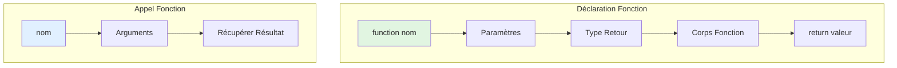
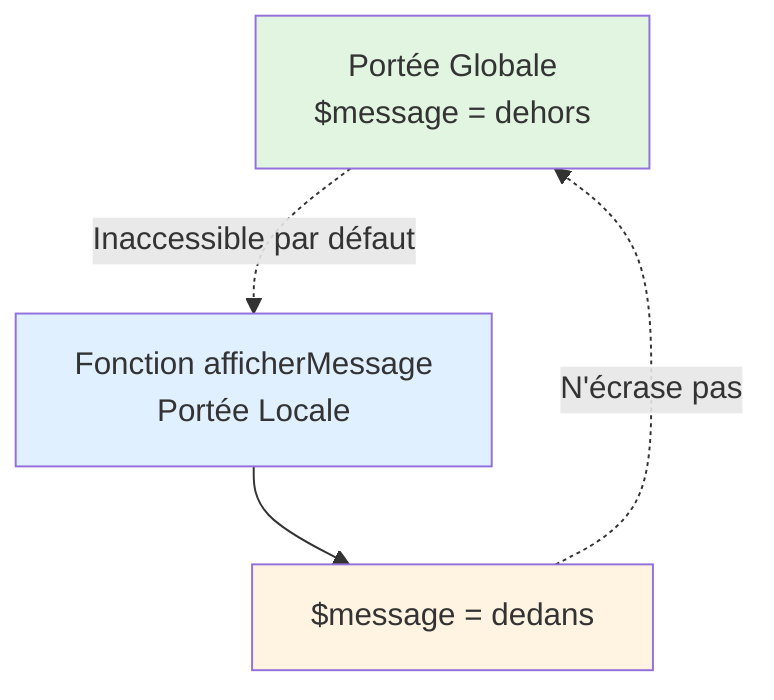

# III - Fonctions & Orga.

<div
  class="omny-meta"
  data-level="🟡 Intermédiaire"
  data-version="1.0"
  data-time="8-10 heures">
</div>

!!! abstract "Objectif du module"
    Apprendre à structurer vos scripts de manière professionnelle en utilisant les fonctions. Vous découvrirez comment éviter la duplication de code (principe DRY), gérer la portée des variables, utiliser les nouveautés de PHP 8 et organiser vos fichiers de manière sécurisée avec les inclusions.

## Introduction : DRY - Don't Repeat Yourself

!!! quote "Analogie pédagogique"
    _Imaginez que vous êtes **chef cuisinier**. Au début, vous répétez les mêmes gestes 100 fois par jour : couper des oignons, préparer une sauce, dresser une assiette. C'est épuisant. Pour gagner du temps, vous créez des **recettes** : une fois la recette de base écrite, vous pouvez la réutiliser à l'infini en la personnalisant. Les **fonctions PHP** sont vos recettes : vous écrivez le code une fois, puis vous l'appelez partout avec des variations. Un bon développeur ne copie-colle pas son code, il crée des fonctions réutilisables._

**Fonctions** = Blocs de code autonomes conçus pour accomplir une tâche spécifique.

**Pourquoi les fonctions sont essentielles ?**

- ✅ **DRY (Don't Repeat Yourself)** : Éliminer la redondance
- ✅ **Maintenabilité** : Une modification à un seul endroit impacte tout le site
- ✅ **Lisibilité** : Votre code principal devient une suite d'actions claires
- ✅ **Collaboration** : Permet de diviser le travail en modules indépendants

<br>

---

## 1. Déclaration et Appel de Fonctions

Une fonction doit être déclarée avant de pouvoir être utilisée. Elle peut prendre des informations en entrée (paramètres) et renvoyer un résultat (retour).

### 1.1 Syntaxe de Base

```php title="PHP - Déclarer et appeler une fonction"
<?php
declare(strict_types=1);

// 1. Fonction sans paramètre
function direBonjour() {
    echo "Bonjour tout le monde !";
}

direBonjour(); // Appel de la fonction

// 2. Fonction avec paramètre et type de retour (PHP 7/8)
function saluer(string $nom): string {
    return "Bonjour $nom !";
}

$message = saluer("Alice");
echo $message;
```
_La déclaration commence par le mot-clé function. Notez l'utilisation du type de retour (: string) qui garantit que la fonction renverra toujours ce type._

**Diagramme : Anatomie d'une fonction**



### 1.2 Conventions de Nommage PSR

En PHP, il est crucial de respecter les standards officiels (PSR) pour que votre code soit lisible par d'autres développeurs.

```php title="PHP - Bonnes pratiques de nommage"
<?php

// ✅ RECOMMANDÉ : camelCase (verbe d'action)
function calculerPrixTTC(float $prixHT) { /* ... */ }

// ✅ SÉCURISÉ : Préfixes explicites
function estUtilisateurAdmin(): bool { /* ... */ } // is/has pour les booléens
function obtenirListeProduits(): array { /* ... */ } // get pour les récupérations

// ❌ À ÉVITER : Noms obscurs ou excessivement longs
function traiter($data) { /* ... */ }
function faire() { /* ... */ }
```
_L'utilisation du camelCase (minuscule au début, puis majuscule à chaque mot) et de préfixes d'action clairs est le standard de la communauté PHP moderne._

### 1.3 Documentation (PHPDoc)

Documenter ses fonctions avec des commentaires structurés permet à votre éditeur de code (tel que VS Code) de proposer une autocomplétion pertinente.

```php title="PHP - Utiliser PHPDoc pour documenter"
<?php

/**
 * Calcule le montant total d'une commande
 * 
 * @param array $articles Liste des prix des articles (HT)
 * @param float $tva Taux de TVA (ex: 1.20 pour 20%)
 * @return float Montant total TTC
 */
function calculerTotal(array $articles, float $tva = 1.20): float {
    return array_sum($articles) * $tva;
}
```
_Les blocs PHPDoc (qui commencent par /**) analysent votre code pour extraire le rôle de chaque paramètre et le type de donnée retournée._

<br>

---

## 2. Paramètres de Fonctions

Les paramètres sont les variables que vous transmettez à la fonction pour qu'elle puisse travailler. PHP 8 a introduit des fonctionnalités très puissantes pour les gérer.

### 2.1 Types de Paramètres (Type Hinting)

Indiquer le type attendu permet d'éviter des bugs critiques en forçant PHP à vérifier la nature des données transmises.

```php title="PHP - Typage strict des paramètres"
<?php
declare(strict_types=1);

// Paramètres typés : refusera un string si on attend un int
function multiplier(int $a, int $b): int {
    return $a * $b;
}

// Union Type (PHP 8+) : autorise plusieurs types, utile pour les données flexibles
function afficherValeur(int|float|string $value): void {
    echo (string)$value;
}

// Type nullable (PHP 7.1+) : autorise null
function afficherMessage(?string $message): void {
    echo $message ?? "Aucun message";
}
```
_Le typage strict (activé avec `declare(strict_types=1);`) est indispensable en milieu professionnel pour garantir la robustesse des applications et détecter les erreurs dès le stade du développement._

### 2.2 Valeurs par Défaut

Vous pouvez rendre certains paramètres optionnels en leur assignant une valeur par défaut directement dans la déclaration de la fonction.

```php title="PHP - Paramètres optionnels"
<?php

function creerBouton(string $label, string $couleur = "bleu"): string {
    return "<button class='btn-$couleur'>$label</button>";
}

echo creerBouton("Valider"); // couleur sera "bleu" par défaut
echo creerBouton("Annuler", "rouge"); // couleur sera "rouge"
```
_Astuce : Placez toujours les paramètres ayant une valeur par défaut obligatoirement à la fin de la liste des arguments._

### 2.3 Arguments Nommés (PHP 8+)

Cette fonctionnalité permet de passer des valeurs à une fonction en précisant le nom du paramètre, ce qui libère de l'obligation de respecter l'ordre initial.

```php title="PHP - Arguments nommés (Named Arguments)"
<?php

function configurerSession(bool $secure = true, int $timeout = 3600, string $name = "PHPSID") {
    // Configuration de la session...
}

// On ne veut changer QUE le timeout, sans toucher à 'secure' ni à 'name'
configurerSession(timeout: 7200);
```
_Les arguments nommés rendent les appels de fonctions complexes beaucoup plus lisibles et évitent de se tromper dans l'ordre des paramètres._

### 2.4 Passage par Référence

Par défaut, PHP passe une copie de la variable à la fonction. Pour modifier la variable originale à l'intérieur de la fonction, on utilise le symbole `&`.

```php title="PHP - Le passage par référence (&)"
<?php

function ajouterTaxe(float &$prix, float $taxe = 0.20): void {
    $prix += ($prix * $taxe);
}

$produit = 100.0;
ajouterTaxe($produit);

echo $produit; // Affiche 120 (la variable originale a été modifiée)
```
_Attention : Le passage par référence doit être utilisé avec précaution car il peut rendre le flux de données difficile à suivre dans de gros projets._

### 2.5 Variadic Functions (Nombre Variable d'Arguments)

Utiles pour les fonctions qui acceptent une liste indéfinie d'éléments (comme une somme ou une liste de noms), les fonctions variadiques utilisent l'opérateur `...` (splat operator).

```php title="PHP - Utiliser les fonctions variadiques (...)"
<?php

function additionnerTout(int ...$nombres): int {
    return array_sum($nombres);
}

echo additionnerTout(5, 10, 15, 20); // Affiche 50

// L'opération inverse (unpacking)
$notes = [15, 12, 18];
echo additionnerTout(...$notes); // Affiche 45
```
_L'opérateur '...' transforme tous les arguments passés de manière libre en un tableau unique manipuable à l'intérieur de la fonction._

<br>

---

## 3. Return Types et Void

Une fonction bien écrite doit toujours indiquer clairement ce qu'elle renvoie. Cela simplifie la maintenance et limite les effets de bord. PHP 8 a beaucoup enrichi les possibilités.

### 3.1 Type de retour simple ou "Vide" (void)

```php title="PHP - Typage du retour et Void"
<?php

// Une fonction classique retourne une donnée précise
function calculerAge(int $anneeNaissance): int {
    return date('Y') - $anneeNaissance;
}

// "void" indique que la fonction effectue une action sans rien renvoyer
function envoyerMailConfirmation(string $email): void {
    mail($email, "Inscription validée", "Bienvenue !");
    // Pas de 'return' avec valeur
}
```
_`void` est indispensable pour les actions "silencieuses" (écrire dans un fichier, envoyer un email, déclencher un événement)._

### 3.2 Types de retour avancés (PHP 8+)

Avec les dernières versions, vous pouvez anticiper le fait qu'une fonction puisse échouer ou renvoyer des types multiples.

```php title="PHP - Nullable, Unions et Never"
<?php

// Le point d'interrogation (?) indique : "float OU null"
function diviser(int $a, int $b): ?float {
    if ($b === 0) return null;
    return $a / $b;
}

// Les Pipes (|) permettent plusieurs types (Union Types)
function trouverValeur(): int|string {
    return rand(0, 1) ? 42 : "indéfini";
}

// 'never' indique que la fonction stoppe net l'exécution du script
function pageIntrouvable(): never {
    header("HTTP/1.0 404 Not Found");
    exit();
}
```
_Le type `never` est utile pour les fonctions de redirection, permettant à PHP et à vos outils de savoir que la suite du code ne sera pas exécutée._

<br>

---

## 4. Portée des Variables (Scope)

La portée d'une variable définit d'où elle peut être lue ou modifiée. En PHP, par défaut, le code écrit **à l'intérieur** d'une fonction est totalement isolé du code écrit à l'extérieur.

### 4.1 Portée Locale

```php title="PHP - L'isolation des variables locales"
<?php

$message = "Je suis dehors";

function afficherMessage() {
    $message = "Je suis dedans";
    echo $message;
}

afficherMessage(); // Affiche : Je suis dedans
echo $message;     // Affiche : Je suis dehors (inchangé)
```
_Le cloisonnement est une sécurité : cela évite qu'une fonction ne modifie accidentellement l'état de votre site en touchant à une variable globale homonyme._

**Diagramme : Portée des variables**



### 4.2 Portée Globale (Le mot-clé `global`)

Il est possible de forcer une fonction à lire et écrire dans une variable située à l'extérieur en utilisant le mot-clé `global`.

```php title="PHP - Accéder à une variable globale (Déconseillé)"
<?php

$compteur = 0;

function incrementer() {
    global $compteur; // On importe la variable externe
    $compteur++;
}

incrementer();
incrementer();
echo $compteur; // Affiche : 2
```
_L'utilisation de `global` est souvent considérée comme une mauvaise pratique. Il vaut toujours mieux passer la variable en paramètre et récupérer sa nouvelle valeur avec un `return`._

### 4.3 Variables Statiques (`static`)

Une variable déclarée avec `static` conserve sa valeur en mémoire entre chaque appel de la fonction, contrairement à une variable locale classique qui est détruite à la fin de l'appel.

```php title="PHP - La mémorisation statique"
<?php

function compterAppels(): int {
    static $compteur = 0; // Cette ligne n'est exécutée qu'au 1er appel
    $compteur++;
    return $compteur;
}

echo compterAppels(); // 1
echo compterAppels(); // 2
echo compterAppels(); // 3
```
_C'est une excellente solution pour créer de petits systèmes de cache internes (ex: ne pas refaire un calcul complexe si la fonction est appelée plusieurs fois avec les mêmes paramètres)._

<br>

---

## 5. Fonctions Anonymes (Closures)

Les fonctions anonymes, aussi appelées closures, n'ont pas de nom. Elles sont souvent assignées à une variable ou passées en paramètre à une autre fonction.

### 5.1 Syntaxe de Base

```php title="PHP - Création et appel de Closure"
<?php

// 1. Assignation à une variable
$direBonjour = function(string $nom): string {
    return "Bonjour $nom !";
}; // Le point-virgule est obligatoire ici car c'est une affectation

echo $direBonjour("Alice");

// 2. Passage direct en tant que paramètre (Callback)
$nombres = [1, 2, 3];
$doubles = array_map(function($n) {
    return $n * 2;
};

echo appliquer(10, $doubler); // 20

// Inline closure
echo appliquer(10, function(int $n): int {
    return $n * 3;
}); // 30
```

### 5.2 Utilisation courante : Arrays

Les closures sont extrêmement populaires pour toutes les fonctions de traitement de listes et tableaux de données.

```php title="PHP - Closures et array_map / array_filter"
<?php

$produits = [
    ['nom' => 'Livre', 'prix' => 15],
    ['nom' => 'PC', 'prix' => 900],
    ['nom' => 'Clavier', 'prix' => 45]
];

// Exemple : Filtrer les produits pas chers
$produitsPasChers = array_filter($produits, function($produit) {
    return $produit['prix'] < 50;
});
```
_`array_filter` et `array_map` reçoivent une fonction en paramètre et vont l'appliquer sur chaque élément du tableau._

### 5.3 Capturer des variables (`use`)

Par défaut, une fonction anonyme ne connaît rien de ce qui l'entoure. Il faut explicitement lui demander d'importer une variable à l'aide de `use`.

```php title="PHP - L'import de variables externes avec use"
<?php

$tauxTVA = 1.20;

$calculerTTC = function(float $prixHT) use ($tauxTVA): float {
    return $prixHT * $tauxTVA;
};

echo $calculerTTC(100); // Affiche 120
```
_Si vous n'ajoutez pas `use ($tauxTVA)`, PHP générera une erreur car la structure est isolée par défaut._

### 5.4 Fonctions Fléchées / Arrow Functions (PHP 7.4+)

C'est une syntaxe extrêmement compacte pour écrire des fonctions anonymes qui ne font qu'**un seul calcul** et renvoient le résultat. Elles importent automatiquement les variables extérieures (pas besoin de `use`).

```php title="PHP - Raccourci avec les fonctions fléchées"
<?php

$tauxTVA = 1.20;

// Version fléchée du calcul TTC
$calculerTTC = fn(float $prixHT): float => $prixHT * $tauxTVA;

// Utilisé de manière fluide dans un array_map : 
$prixTTC = array_map(fn($p) => $p['prix'] * $tauxTVA, $produits);
```
_Rappelez-vous : `fn() => résultat` est parfait pour un calcul sur une ligne. S'il y a des conditions complexes, utilisez une closure normale._

---

## 6. Includes et Requires

### 6.1 Include vs Require

**4 méthodes d'inclusion de fichiers :**

```php
<?php

// include : Inclut fichier, Warning si absent
include 'header.php';

// require : Inclut fichier, Fatal Error si absent
require 'config.php';

// include_once : Inclut 1 seule fois
include_once 'functions.php';

// require_once : Inclut 1 seule fois, Fatal Error si absent
require_once 'database.php';
```

**Tableau comparatif :**

| Méthode | Erreur si absent | Peut inclure plusieurs fois |
|---------|------------------|------------------------------|
| **include** | Warning (continue) | ✅ Oui |
| **require** | Fatal Error (stop) | ✅ Oui |
| **include_once** | Warning | ❌ Non (1 fois max) |
| **require_once** | Fatal Error | ❌ Non (1 fois max) |

### 6.2 Cas d'Usage

```php
<?php

// require : Fichiers CRITIQUES (config, fonctions essentielles)
require 'config/database.php';  // App ne peut pas fonctionner sans
require 'includes/functions.php';

// include : Fichiers OPTIONNELS (templates, widgets)
include 'widgets/sidebar.php';   // App peut fonctionner sans
include 'templates/footer.php';

// require_once : Fichiers avec déclarations (fonctions, classes)
require_once 'src/User.php';     // Évite redéclaration
require_once 'src/helpers.php';

// include_once : Templates pouvant être référencés plusieurs fois
include_once 'partials/menu.php';
```

### 6.3 Organisation de Code

**Structure projet typique :**

```
projet/
├── index.php           # Point d'entrée
├── config/
│   ├── database.php    # Configuration BDD
│   └── app.php         # Configuration app
├── includes/
│   ├── functions.php   # Fonctions utilitaires
│   └── helpers.php     # Helpers
├── templates/
│   ├── header.php      # En-tête HTML
│   ├── footer.php      # Pied de page
│   └── menu.php        # Menu navigation
└── src/
    ├── User.php        # Classes métier (POO plus tard)
    └── Product.php
```

**Fichier `config/database.php` :**

```php
<?php
declare(strict_types=1);

// Configuration base de données
const DB_HOST = 'localhost';
const DB_NAME = 'mon_site';
const DB_USER = 'root';
const DB_PASS = '';

function obtenirConnexion(): PDO {
    try {
        $pdo = new PDO(
            'mysql:host=' . DB_HOST . ';dbname=' . DB_NAME,
            DB_USER,
            DB_PASS,
            [
                PDO::ATTR_ERRMODE => PDO::ERRMODE_EXCEPTION,
                PDO::ATTR_DEFAULT_FETCH_MODE => PDO::FETCH_ASSOC
            ]
        );
        
        return $pdo;
    } catch (PDOException $e) {
        die("Erreur connexion BDD : " . $e->getMessage());
    }
}
```

**Fichier `includes/functions.php` :**

```php
<?php
declare(strict_types=1);

/**
 * Échappe HTML pour prévenir XSS
 */
function e(string $value): string {
    return htmlspecialchars($value, ENT_QUOTES, 'UTF-8');
}

/**
 * Redirige vers une URL
 */
function rediriger(string $url): never {
    header("Location: $url");
    exit();
}

<br>

---

## 6. Includes et Organisation de Code

Pour éviter d'avoir des fichiers contenant des milliers de lignes, on sépare le code en plusieurs petits fichiers que l'on "inclut" les uns dans les autres.

### 6.1 Les 4 Directives d'Inclusion

```php title="PHP - Inclure et requérir des fichiers"
<?php

// 1. include : Warning si le fichier est absent, mais script continue
include 'templates/footer.php';

// 2. require : Erreur Fatale si absent, arrête le script
require 'config.php';

// 3. require_once : Sécurité, garantit que PHP ne l'inclura qu'une fois
require_once 'fonctions.php';
```
_En général, on utilise `require_once` pour les fichiers de fonctions et de classes afin d'éviter les erreurs fatales liées à une redéclaration. On utilise `include` pour les bouts d'interfaces (HTML)._

### 6.2 Structure de projet recommandée

Un projet PHP standard sépare la logique métier de l'affichage.

```text
mon_projet/
├── config/
│   └── setup.php       # Paramètres de base de données
├── includes/
│   └── functions.php   # Fonctions réutilisables (calculs, etc)
├── templates/
│   ├── header.php      # En-tête HTML
│   └── footer.php      # Pied de page HTML
└── index.php           # Point d'entrée principal
```

**Exemple de fichier `index.php` sécurisé :**
```php title="PHP - Structure type d'un point d'entrée"
<?php
// 1. Chargement des dépendances
require_once __DIR__.'/config/setup.php';
require_once __DIR__.'/includes/functions.php';

// 2. Traitement des données
$utilisateurs = array("Alice", "Bob");

// 3. Affichage
include __DIR__.'/templates/header.php';
// ... contenu HTML dynamique ...
include __DIR__.'/templates/footer.php';
```
_L'utilisation de la constante magique `__DIR__` permet de définir un chemin absolu basé sur l'emplacement actuel du fichier, ce qui garantit que l'inclusion évaluera toujours le bon chemin peu importe d'où ce script est appelé._

---

## 7. Sécurité avec Fonctions

### 7.1 Toujours valider les paramètres entrants

Même avec le typage strict activé, il est essentiel de s'assurer que les valeurs reçues respectent les limites logiques de votre application (ex: un âge ne peut pas être négatif, une adresse email doit avoir un format valide).

```php title="PHP - Validation des valeurs entrantes dans une fonction"
<?php

function inscrireMembre(string $nom, int $age, string $email): bool {

    // 1. Validation de l'âge
    if ($age < 18 || $age > 120) {
        throw new \InvalidArgumentException("L'âge doit être compris entre 18 et 120 ans.");
    }
    
    // 2. Validation de l'email
    if (!filter_var($email, FILTER_VALIDATE_EMAIL)) {
        throw new \InvalidArgumentException("Le format de l'adresse email est invalide.");
    }
    
    return true; // L'inscription continue
}
```
_Chaque fonction manipulant des données critiques se doit d'agir comme un garde-barrière avant de poursuivre le script._

### 7.2 L'échappement des données (XSS)

Si vous créez des fonctions qui renvoient du texte destiné à être affiché en HTML (tels que des messages d'erreur ou des noms), vous devez systématiquement neutraliser les caractères dangereux pour bloquer les attaques par faille XSS.

```php title="PHP - Création d'une fonction utilitaire d'échappement"
<?php

// Création d'un très court helper d'échappement HTML nommé 'e'
function e(string $texte): string {
    return htmlspecialchars($texte, ENT_QUOTES, 'UTF-8');
}

// Utilisation sécurisée pour l'affichage de notre vue
$pseudoSaisi = "<script>alert('Hack!');</script>"; // Simulation d'une attaque XSS
echo "<h1>Bienvenue " . e($pseudoSaisi) . " !</h1>";
```
_Il est très courant dans l'industrie de créer cette petite fonction utilitaire `e()` dans un fichier `functions.php` transversal, ce qui simplifie énormément l'échappement dans tous vos templates HTML._

### 7.3 La sécurité des inclusions de fichiers

Si l'utilisateur peut passer un nom de fichier dans l'URL (par exemple `?page=contact`), un hacker pourrait essayer d'entrer `?page=../../config/database.php`. C'est ce qu'on appelle une attaque par Traversée de Dossier (Path Traversal).

```php title="PHP - Protéger ses inclusions"
<?php

// Une approche sécurisée consiste à vérifier la demande par rapport à une liste blanche
function chargerPage(string $pageDemandee): void {
    $pagesAutorisees = [
        'accueil' => 'pages/accueil.php',
        'contact' => 'pages/contact.php'
    ];
    
    // Si la page demandée n'existe pas dans notre tableau, on force une page par défaut ou une erreur
    if (!isset($pagesAutorisees[$pageDemandee])) {
        throw new \Exception("Tentative d'accès non autorisée.");
    }
    
    include $pagesAutorisees[$pageDemandee];
}
```
_Cette méthode (Liste Blanche) garantit qu'il est absolument impossible d'inclure ou de lire un fichier qui n'aurait pas été explicitement autorisé par le développeur._

<br>

---

## 8. Checkpoint et Exercices

!!! quote "En résumé"
    - **Les fonctions** permettent d'encapsuler la logique pour ne pas se répéter (DRY).
    - **Le passage par référence (`&`)** modifie la variable d'origine (à utiliser avec parcimonie).
    - **L'opérateur splat (`...`)** est magique pour les arguments variables (Variadiques) et le déballage de tableaux.
    - **La portée (Scope)** isole les variables à l'intérieur des fonctions. Le mot-clé `global` est à proscrire.
    - **`static`** permet à une variable locale de survivre entre deux appels de fonction.
    - **Les Closures et Arrow Functions** sont parfaites pour être passées aux fonctions de traitement de tableaux (`array_map`, `array_filter`).
    - **Les Inclusions** : Utilisez `require_once` pour les classes/fonctions, et `include` pour les templates visuels en utilisant la constante absolue `__DIR__`.
    - **Sécurité** : Ne faites jamais confiance aux entrées. Validez les paramètres et échappez systématiquement les sorties avec `htmlspecialchars()`.

<br>

---

## Conclusion

!!! quote "Résumé du module"
    Félicitations ! Vous venez d'acquérir l'un des piliers de la programmation moderne : l'encapsulation de la logique métier. En découpant intelligemment votre code en fonctions testables et sécurisées, et en structurant vos fichiers grâce aux inclusions, vous commencez à écrire un vrai code professionnel, maintenable et collaboratif.
    
> Prêt à aller plus loin ? Dans le **Module 4**, vous apprendrez à manipuler et transformer les données avec les tableaux complexes, les chaînes de caractères et les expressions régulières.
