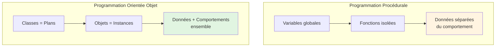
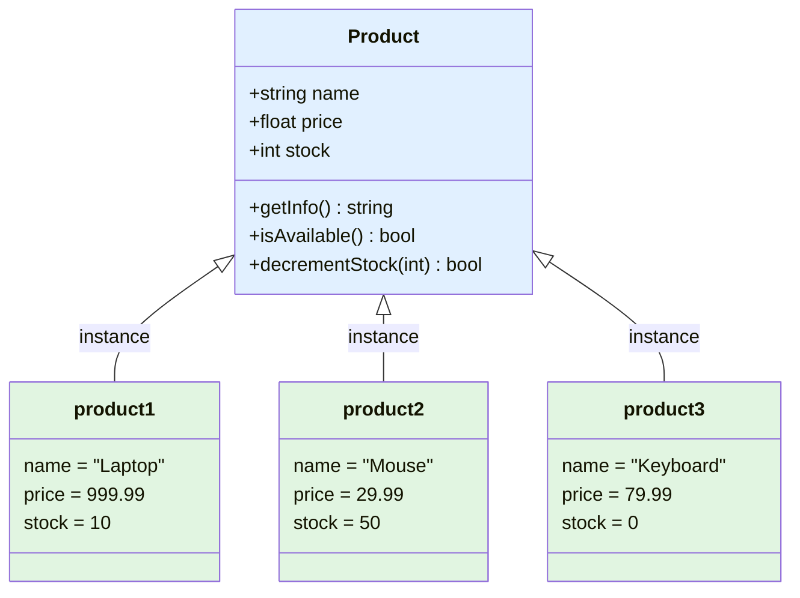

# VIII - Intro à la POO

<div
  class="omny-meta"
  data-level="🟡 Intermédiaire"
  data-version="1.0"
  data-time="8-10 heures">
</div>

## Introduction : Un Nouveau Paradigme

!!! quote "Analogie pédagogique"
    _Imaginez que vous construisez des maisons. En **programmation procédurale** (Modules 1-7), vous avez appris à fabriquer des briques, du mortier, des fenêtres, des portes... Vous savez les assembler avec des fonctions (poser_brique(), installer_fenetre()). Mais chaque maison nécessite de répéter tout le processus. En **Programmation Orientée Objet (POO)**, vous créez des **plans** (classes) : le plan "Maison" définit qu'une maison a des murs, des fenêtres, une porte, et peut s'ouvrir/se fermer. Une fois le plan créé, vous pouvez **instancier** (créer) des centaines de maisons identiques en une ligne ! Chaque maison (objet) a sa propre couleur, son propre propriétaire, mais toutes suivent le même plan. La POO c'est l'art de créer des **moules réutilisables** plutôt que de fabriquer chaque objet à la main. Ce module vous fait passer de **l'artisan** au **chef d'usine**._

**POO (Programmation Orientée Objet)** = Paradigme organisé autour d'objets contenant données et comportements.

**Pourquoi passer à la POO ?**

✅ **Réutilisabilité** : Code une fois, utilise partout
✅ **Organisation** : Structure claire et logique
✅ **Maintenabilité** : Modifications localisées
✅ **Encapsulation** : Données protégées
✅ **Héritage** : Extension sans duplication
✅ **Polymorphisme** : Flexibilité maximale

**Ce module pose les fondations de la POO PHP moderne.**

---

## 1. Paradigmes de Programmation

### 1.1 Procédural vs Orienté Objet



**Exemple concret : Gestion utilisateur**

```php
<?php
declare(strict_types=1);

// ============================================
// APPROCHE PROCÉDURALE (Modules 1-7)
// ============================================

// Données séparées
$userId = 1;
$userName = 'Alice';
$userEmail = 'alice@example.com';
$userRole = 'admin';

// Fonctions isolées
function getUserName(int $id): string {
    // Récupérer nom depuis BDD
    return 'Alice';
}

function updateUserEmail(int $id, string $newEmail): bool {
    // Mettre à jour email en BDD
    return true;
}

function userHasPermission(string $role, string $permission): bool {
    $adminPermissions = ['create', 'read', 'update', 'delete'];
    return in_array($permission, $adminPermissions, true);
}

// Utilisation
$name = getUserName($userId);
updateUserEmail($userId, 'newemail@example.com');
$canDelete = userHasPermission($userRole, 'delete');

// ⚠️ Problèmes :
// - Données et fonctions séparées (difficile de suivre)
// - Risque d'incohérence (oublier de passer $userId)
// - Namespace pollution (beaucoup de fonctions globales)
// - Pas de regroupement logique

// ============================================
// APPROCHE ORIENTÉE OBJET
// ============================================

class User {
    // Propriétés (données)
    private int $id;
    private string $name;
    private string $email;
    private string $role;
    
    // Constructeur
    public function __construct(int $id, string $name, string $email, string $role) {
        $this->id = $id;
        $this->name = $name;
        $this->email = $email;
        $this->role = $role;
    }
    
    // Méthodes (comportements)
    public function getName(): string {
        return $this->name;
    }
    
    public function updateEmail(string $newEmail): void {
        $this->email = $newEmail;
        // Sauvegarder en BDD
    }
    
    public function hasPermission(string $permission): bool {
        $adminPermissions = ['create', 'read', 'update', 'delete'];
        return in_array($permission, $adminPermissions, true);
    }
}

// Utilisation
$user = new User(1, 'Alice', 'alice@example.com', 'admin');

$name = $user->getName();
$user->updateEmail('newemail@example.com');
$canDelete = $user->hasPermission('delete');

// ✅ Avantages :
// - Données et comportements ensemble (cohésion)
// - Pas besoin de passer $userId partout ($this)
// - Code organisé et lisible
// - Encapsulation (private/public)
```

---

## 2. Classes et Objets

### 2.1 Définir une Classe

**Classe = Plan / Blueprint / Moule**

```php
<?php
declare(strict_types=1);

// ============================================
// SYNTAXE DE BASE
// ============================================

class NomClasse {
    // Propriétés (variables de la classe)
    // Méthodes (fonctions de la classe)
}

// Conventions nommage :
// - PascalCase (première lettre majuscule)
// - Nom singulier (User, Product, Order)
// - Nom significatif (éviter Data, Manager, Helper)

// ============================================
// EXEMPLE : Classe Product
// ============================================

class Product {
    // Propriétés
    public string $name;
    public float $price;
    public int $stock;
    
    // Méthodes
    public function getInfo(): string {
        return "{$this->name} - {$this->price}€ (Stock: {$this->stock})";
    }
    
    public function isAvailable(): bool {
        return $this->stock > 0;
    }
    
    public function decrementStock(int $quantity): bool {
        if ($this->stock >= $quantity) {
            $this->stock -= $quantity;
            return true;
        }
        return false;
    }
}
```

### 2.2 Créer des Objets (Instances)

**Objet = Instance concrète d'une classe**

```php
<?php

// Instancier avec new
$product1 = new Product();

// Assigner propriétés
$product1->name = 'Laptop';
$product1->price = 999.99;
$product1->stock = 10;

// Appeler méthodes
echo $product1->getInfo(); // Laptop - 999.99€ (Stock: 10)
echo $product1->isAvailable() ? 'Disponible' : 'Rupture'; // Disponible

// Créer plusieurs instances
$product2 = new Product();
$product2->name = 'Mouse';
$product2->price = 29.99;
$product2->stock = 50;

$product3 = new Product();
$product3->name = 'Keyboard';
$product3->price = 79.99;
$product3->stock = 0;

// Chaque objet est INDÉPENDANT
echo $product1->name; // Laptop
echo $product2->name; // Mouse
echo $product3->name; // Keyboard

// Modifier un objet n'affecte pas les autres
$product1->price = 899.99;
echo $product1->price; // 899.99
echo $product2->price; // 29.99 (inchangé)
```

**Diagramme : Classe vs Objets**



### 2.3 $this : Référence à l'Objet Actuel

**$this = Pointeur vers l'instance courante**

```php
<?php

class Counter {
    public int $count = 0;
    
    public function increment(): void {
        // $this = instance qui appelle la méthode
        $this->count++;
    }
    
    public function getCount(): int {
        return $this->count;
    }
    
    public function reset(): void {
        $this->count = 0;
    }
}

$counter1 = new Counter();
$counter2 = new Counter();

$counter1->increment(); // $this = $counter1
$counter1->increment();
echo $counter1->getCount(); // 2

$counter2->increment(); // $this = $counter2
echo $counter2->getCount(); // 1

// ⚠️ $this change selon l'instance qui appelle
```

**Chaînage de méthodes avec $this :**

```php
<?php

class Calculator {
    private float $result = 0;
    
    public function add(float $value): self {
        $this->result += $value;
        return $this; // Retourner instance pour chaînage
    }
    
    public function subtract(float $value): self {
        $this->result -= $value;
        return $this;
    }
    
    public function multiply(float $value): self {
        $this->result *= $value;
        return $this;
    }
    
    public function getResult(): float {
        return $this->result;
    }
}

// Chaînage fluent
$calc = new Calculator();
$result = $calc->add(10)
               ->multiply(2)
               ->subtract(5)
               ->getResult();

echo $result; // 15
```

---

## 3. Constructeur et Destructeur

### 3.1 Constructeur __construct()

**Constructeur = Méthode appelée automatiquement à l'instanciation**

```php
<?php

// ============================================
// SANS CONSTRUCTEUR (manuel)
// ============================================

class User {
    public string $name;
    public string $email;
}

$user = new User();
$user->name = 'Alice';     // ❌ Fastidieux
$user->email = 'alice@example.com';

// ============================================
// AVEC CONSTRUCTEUR (automatique)
// ============================================

class User {
    public string $name;
    public string $email;
    
    public function __construct(string $name, string $email) {
        $this->name = $name;
        $this->email = $email;
    }
}

$user = new User('Alice', 'alice@example.com'); // ✅ En une ligne

// ============================================
// CONSTRUCTEUR AVEC VALIDATION
// ============================================

class Product {
    private string $name;
    private float $price;
    private int $stock;
    
    public function __construct(string $name, float $price, int $stock) {
        if (empty($name)) {
            throw new InvalidArgumentException("Le nom ne peut pas être vide");
        }
        
        if ($price < 0) {
            throw new InvalidArgumentException("Le prix ne peut pas être négatif");
        }
        
        if ($stock < 0) {
            throw new InvalidArgumentException("Le stock ne peut pas être négatif");
        }
        
        $this->name = $name;
        $this->price = $price;
        $this->stock = $stock;
    }
    
    public function getName(): string {
        return $this->name;
    }
}

// Validation automatique
$product = new Product('Laptop', 999.99, 10); // ✅ OK

try {
    $invalid = new Product('', -10, -5); // ❌ Exception
} catch (InvalidArgumentException $e) {
    echo "Erreur : " . $e->getMessage();
}
```

**Promotion de propriétés (PHP 8+) :**

```php
<?php

// ============================================
// ANCIENNE SYNTAXE (verbeux)
// ============================================

class User {
    private string $name;
    private string $email;
    private string $role;
    
    public function __construct(string $name, string $email, string $role) {
        $this->name = $name;
        $this->email = $email;
        $this->role = $role;
    }
}

// ============================================
// PROMOTION PROPRIÉTÉS PHP 8+ (concis)
// ============================================

class User {
    public function __construct(
        private string $name,
        private string $email,
        private string $role
    ) {
        // Propriétés créées et assignées automatiquement
    }
}

// Usage identique
$user = new User('Alice', 'alice@example.com', 'admin');

// ✅ 3 lignes au lieu de 10 !
```

**Valeurs par défaut dans constructeur :**

```php
<?php

class BlogPost {
    public function __construct(
        private string $title,
        private string $content,
        private string $status = 'draft',      // Défaut
        private ?string $author = null         // Nullable
    ) {}
    
    public function getTitle(): string {
        return $this->title;
    }
    
    public function getStatus(): string {
        return $this->status;
    }
}

// Avec valeurs par défaut
$post1 = new BlogPost('Titre', 'Contenu');
echo $post1->getStatus(); // draft

// Surcharger valeurs par défaut
$post2 = new BlogPost('Titre', 'Contenu', 'published', 'Alice');
echo $post2->getStatus(); // published
```

### 3.2 Destructeur __destruct()

**Destructeur = Méthode appelée quand objet détruit**

```php
<?php

class FileLogger {
    private $fileHandle;
    
    public function __construct(string $filename) {
        $this->fileHandle = fopen($filename, 'a');
        
        if ($this->fileHandle === false) {
            throw new RuntimeException("Impossible d'ouvrir le fichier");
        }
        
        echo "Fichier ouvert\n";
    }
    
    public function log(string $message): void {
        fwrite($this->fileHandle, date('Y-m-d H:i:s') . " - $message\n");
    }
    
    public function __destruct() {
        if ($this->fileHandle) {
            fclose($this->fileHandle);
            echo "Fichier fermé\n";
        }
    }
}

// Utilisation
$logger = new FileLogger('app.log');
$logger->log('Application démarrée');
$logger->log('Utilisateur connecté');

// Destructeur appelé automatiquement à la fin du script
// Ou quand plus aucune référence à l'objet

// ✅ Pas besoin de fermer manuellement le fichier
```

**Quand utiliser __destruct() :**

✅ Fermer connexions (fichiers, BDD, sockets)
✅ Libérer ressources (mémoire, locks)
✅ Nettoyer fichiers temporaires
✅ Logger fin d'opération

❌ Ne PAS utiliser pour logique métier critique
❌ Ordre destruction non garanti
❌ Exceptions dans destructeur problématiques

---

## 4. Visibilité : public, private, protected

### 4.1 Niveaux de Visibilité

**Encapsulation = Contrôler l'accès aux propriétés/méthodes**

```php
<?php

class BankAccount {
    // public : Accessible partout
    public string $accountNumber;
    
    // private : Accessible SEULEMENT dans cette classe
    private float $balance;
    
    // protected : Accessible dans cette classe + classes enfants
    protected string $accountType;
    
    public function __construct(string $accountNumber, float $initialBalance) {
        $this->accountNumber = $accountNumber;
        $this->balance = $initialBalance;
        $this->accountType = 'savings';
    }
    
    // Getter public pour balance privée
    public function getBalance(): float {
        return $this->balance;
    }
    
    // Méthode publique pour modifier balance de manière contrôlée
    public function deposit(float $amount): void {
        if ($amount <= 0) {
            throw new InvalidArgumentException("Montant doit être positif");
        }
        
        $this->balance += $amount;
    }
    
    public function withdraw(float $amount): void {
        if ($amount <= 0) {
            throw new InvalidArgumentException("Montant doit être positif");
        }
        
        if ($amount > $this->balance) {
            throw new RuntimeException("Solde insuffisant");
        }
        
        $this->balance -= $amount;
    }
    
    // Méthode privée (interne)
    private function logTransaction(string $type, float $amount): void {
        // Logger dans fichier/BDD
        echo "[$type] Montant: $amount\n";
    }
}

// Utilisation
$account = new BankAccount('FR123456', 1000.00);

// ✅ Accès public
echo $account->accountNumber; // FR123456
echo $account->getBalance();  // 1000.00

$account->deposit(500);
echo $account->getBalance();  // 1500.00

// ❌ Erreur : Propriété privée
// echo $account->balance; // Fatal error

// ❌ Erreur : Méthode privée
// $account->logTransaction('test', 100); // Fatal error

// ❌ Impossible de tricher
// $account->balance = 999999; // Fatal error

// ✅ Contrôle via méthodes publiques
$account->withdraw(200);
echo $account->getBalance(); // 1300.00
```

**Tableau récapitulatif :**

| Visibilité | Classe | Enfants | Extérieur |
|------------|--------|---------|-----------|
| **public** | ✅ Oui | ✅ Oui | ✅ Oui |
| **protected** | ✅ Oui | ✅ Oui | ❌ Non |
| **private** | ✅ Oui | ❌ Non | ❌ Non |

**Bonnes pratiques :**

✅ **Propriétés : private par défaut**
✅ **Méthodes : public si API, private sinon**
✅ **Getters/Setters** pour accès contrôlé
✅ **Validation dans setters**

### 4.2 Getters et Setters

```php
<?php

class User {
    private string $name;
    private string $email;
    private int $age;
    
    public function __construct(string $name, string $email, int $age) {
        $this->setName($name);
        $this->setEmail($email);
        $this->setAge($age);
    }
    
    // Getters (lecture)
    public function getName(): string {
        return $this->name;
    }
    
    public function getEmail(): string {
        return $this->email;
    }
    
    public function getAge(): int {
        return $this->age;
    }
    
    // Setters (écriture avec validation)
    public function setName(string $name): void {
        if (strlen($name) < 2) {
            throw new InvalidArgumentException("Nom trop court (min 2 caractères)");
        }
        
        $this->name = $name;
    }
    
    public function setEmail(string $email): void {
        if (!filter_var($email, FILTER_VALIDATE_EMAIL)) {
            throw new InvalidArgumentException("Email invalide");
        }
        
        $this->email = $email;
    }
    
    public function setAge(int $age): void {
        if ($age < 0 || $age > 150) {
            throw new InvalidArgumentException("Âge invalide");
        }
        
        $this->age = $age;
    }
}

// Usage
$user = new User('Alice', 'alice@example.com', 25);

// Lecture
echo $user->getName();  // Alice
echo $user->getEmail(); // alice@example.com

// Modification validée
$user->setName('Bob');
echo $user->getName(); // Bob

// Validation automatique
try {
    $user->setEmail('email_invalide'); // ❌ Exception
} catch (InvalidArgumentException $e) {
    echo "Erreur : " . $e->getMessage();
}
```

**Getters/Setters : Pourquoi ?**

✅ **Validation** : Contrôler données avant assignation
✅ **Encapsulation** : Modifier implémentation sans casser API
✅ **Logique métier** : Calculs, transformations
✅ **Readonly** : Getter sans setter (propriété lecture seule)

**Propriétés readonly (PHP 8.1+) :**

```php
<?php

class Product {
    public function __construct(
        public readonly string $id,        // Lecture seule
        public readonly string $name,
        private float $price
    ) {}
    
    public function getPrice(): float {
        return $this->price;
    }
    
    public function setPrice(float $price): void {
        if ($price < 0) {
            throw new InvalidArgumentException("Prix négatif interdit");
        }
        $this->price = $price;
    }
}

$product = new Product('P123', 'Laptop', 999.99);

echo $product->id;   // ✅ Lecture OK
echo $product->name; // ✅ Lecture OK

// $product->id = 'P456'; // ❌ Erreur : readonly

$product->setPrice(899.99); // ✅ Modification via setter
```

---

## 5. Méthodes et Propriétés Statiques

### 5.1 Statique = Appartient à la Classe, pas aux Instances

```php
<?php

class Counter {
    // Propriété statique (partagée par toutes instances)
    private static int $totalInstances = 0;
    
    // Propriété d'instance (unique par objet)
    private int $instanceId;
    
    public function __construct() {
        self::$totalInstances++; // Incrémenter compteur global
        $this->instanceId = self::$totalInstances;
    }
    
    public function getInstanceId(): int {
        return $this->instanceId;
    }
    
    // Méthode statique
    public static function getTotalInstances(): int {
        return self::$totalInstances;
    }
}

// Accès SANS instanciation
echo Counter::getTotalInstances(); // 0

// Créer instances
$c1 = new Counter();
$c2 = new Counter();
$c3 = new Counter();

echo Counter::getTotalInstances(); // 3

echo $c1->getInstanceId(); // 1
echo $c2->getInstanceId(); // 2
echo $c3->getInstanceId(); // 3
```

**self vs $this :**

```php
<?php

class Example {
    private static string $staticProperty = 'Statique';
    private string $instanceProperty = 'Instance';
    
    public static function staticMethod(): void {
        // ✅ self pour accéder statique
        echo self::$staticProperty;
        
        // ❌ $this n'existe pas dans méthode statique
        // echo $this->instanceProperty; // Erreur
    }
    
    public function instanceMethod(): void {
        // ✅ $this pour propriétés instance
        echo $this->instanceProperty;
        
        // ✅ self pour propriétés statiques
        echo self::$staticProperty;
    }
}

Example::staticMethod(); // Statique

$obj = new Example();
$obj->instanceMethod(); // Instance Statique
```

**Cas d'usage méthodes statiques :**

```php
<?php

// Utilitaires (pas d'état)
class StringHelper {
    public static function slugify(string $text): string {
        $text = strtolower($text);
        $text = preg_replace('/[^a-z0-9]+/', '-', $text);
        return trim($text, '-');
    }
    
    public static function truncate(string $text, int $length): string {
        if (strlen($text) <= $length) {
            return $text;
        }
        return substr($text, 0, $length) . '...';
    }
}

// Usage sans instance
$slug = StringHelper::slugify('Hello World!'); // hello-world
$short = StringHelper::truncate('Texte long', 10); // Texte long...

// Factory pattern
class User {
    public function __construct(
        private string $name,
        private string $email
    ) {}
    
    // Factory statique
    public static function createFromArray(array $data): self {
        return new self(
            $data['name'] ?? '',
            $data['email'] ?? ''
        );
    }
    
    public static function createAdmin(string $name, string $email): self {
        $user = new self($name, $email);
        // Assigner rôle admin
        return $user;
    }
}

$user1 = User::createFromArray(['name' => 'Alice', 'email' => 'alice@example.com']);
$user2 = User::createAdmin('Bob', 'bob@example.com');
```

### 5.2 Constantes de Classe

```php
<?php

class Config {
    // Constantes (toujours public, MAJUSCULES)
    public const APP_NAME = 'MonApplication';
    public const VERSION = '1.0.0';
    public const MAX_LOGIN_ATTEMPTS = 5;
    
    // Constantes privées (PHP 7.1+)
    private const SECRET_KEY = 'abc123secret';
    
    public static function getSecretKey(): string {
        return self::SECRET_KEY;
    }
}

// Accès constantes
echo Config::APP_NAME;              // MonApplication
echo Config::VERSION;                // 1.0.0
echo Config::MAX_LOGIN_ATTEMPTS;     // 5

// ❌ Constante privée inaccessible
// echo Config::SECRET_KEY; // Erreur

// ✅ Accès via méthode
echo Config::getSecretKey(); // abc123secret

// Constantes ne peuvent pas être modifiées
// Config::VERSION = '2.0.0'; // Erreur
```

**Constantes vs Propriétés statiques :**

| Aspect | Constante | Propriété statique |
|--------|-----------|-------------------|
| **Modification** | ❌ Immuable | ✅ Modifiable |
| **Visibilité** | public / private | public / private / protected |
| **Héritage** | ✅ Peut être redéfinie | ✅ Peut être modifiée |
| **Usage** | Valeurs fixes | Valeurs partagées mutables |

```php
<?php

class HttpStatus {
    // Constantes pour codes HTTP
    public const OK = 200;
    public const CREATED = 201;
    public const BAD_REQUEST = 400;
    public const UNAUTHORIZED = 401;
    public const FORBIDDEN = 403;
    public const NOT_FOUND = 404;
    public const INTERNAL_ERROR = 500;
}

// Usage
header('HTTP/1.1 ' . HttpStatus::NOT_FOUND);
```

---

## 6. Type Hinting et Return Types

### 6.1 Types Stricts pour Méthodes

```php
<?php
declare(strict_types=1);

class Calculator {
    // Type hinting paramètres + return type
    public function add(int $a, int $b): int {
        return $a + $b;
    }
    
    public function divide(float $a, float $b): float {
        if ($b === 0.0) {
            throw new DivisionByZeroError("Division par zéro");
        }
        return $a / $b;
    }
    
    // Type nullable
    public function findUser(int $id): ?User {
        // Retourne User ou null
        return null; // Si pas trouvé
    }
    
    // Union types (PHP 8+)
    public function process(int|float|string $value): int|float {
        if (is_numeric($value)) {
            return (float)$value;
        }
        return 0;
    }
    
    // void (pas de retour)
    public function logMessage(string $message): void {
        echo $message . "\n";
        // Pas de return
    }
    
    // self (retourne instance classe)
    public function reset(): self {
        // ...
        return $this;
    }
    
    // never (ne retourne jamais - PHP 8.1+)
    public function terminate(string $message): never {
        die($message);
    }
}
```

### 6.2 Types de Propriétés (PHP 7.4+)

```php
<?php
declare(strict_types=1);

class Product {
    // Types propriétés (PHP 7.4+)
    private string $name;
    private float $price;
    private int $stock;
    private bool $active;
    private ?string $description = null; // Nullable
    
    public function __construct(string $name, float $price, int $stock) {
        $this->name = $name;
        $this->price = $price;
        $this->stock = $stock;
        $this->active = true;
    }
    
    // Union types propriétés (PHP 8+)
    private int|float $discount = 0;
    
    public function setDiscount(int|float $discount): void {
        $this->discount = $discount;
    }
}

// Promotion propriétés avec types (PHP 8+)
class User {
    public function __construct(
        private string $name,
        private string $email,
        private int $age,
        private bool $active = true
    ) {}
}
```

---

## 7. Exemples Complets

### 7.1 Classe ShoppingCart

```php
<?php
declare(strict_types=1);

class ShoppingCart {
    private array $items = [];
    
    public function addItem(string $productId, string $name, float $price, int $quantity = 1): void {
        if (isset($this->items[$productId])) {
            // Produit déjà dans panier, augmenter quantité
            $this->items[$productId]['quantity'] += $quantity;
        } else {
            // Nouveau produit
            $this->items[$productId] = [
                'name' => $name,
                'price' => $price,
                'quantity' => $quantity
            ];
        }
    }
    
    public function removeItem(string $productId): bool {
        if (isset($this->items[$productId])) {
            unset($this->items[$productId]);
            return true;
        }
        return false;
    }
    
    public function updateQuantity(string $productId, int $quantity): bool {
        if (!isset($this->items[$productId])) {
            return false;
        }
        
        if ($quantity <= 0) {
            return $this->removeItem($productId);
        }
        
        $this->items[$productId]['quantity'] = $quantity;
        return true;
    }
    
    public function getTotal(): float {
        $total = 0.0;
        
        foreach ($this->items as $item) {
            $total += $item['price'] * $item['quantity'];
        }
        
        return $total;
    }
    
    public function getItemCount(): int {
        $count = 0;
        
        foreach ($this->items as $item) {
            $count += $item['quantity'];
        }
        
        return $count;
    }
    
    public function getItems(): array {
        return $this->items;
    }
    
    public function clear(): void {
        $this->items = [];
    }
    
    public function isEmpty(): bool {
        return empty($this->items);
    }
}

// Usage
$cart = new ShoppingCart();

$cart->addItem('P1', 'Laptop', 999.99, 1);
$cart->addItem('P2', 'Mouse', 29.99, 2);
$cart->addItem('P3', 'Keyboard', 79.99, 1);

echo "Articles : " . $cart->getItemCount() . "\n";  // 4
echo "Total : " . $cart->getTotal() . "€\n";        // 1139.96€

$cart->updateQuantity('P2', 1);
echo "Total : " . $cart->getTotal() . "€\n";        // 1109.97€

$cart->removeItem('P3');
echo "Total : " . $cart->getTotal() . "€\n";        // 1029.98€

print_r($cart->getItems());
```

### 7.2 Classe Validator

```php
<?php
declare(strict_types=1);

class Validator {
    private array $errors = [];
    
    public function validateEmail(string $email, string $fieldName = 'Email'): self {
        if (!filter_var($email, FILTER_VALIDATE_EMAIL)) {
            $this->errors[$fieldName] = "$fieldName invalide";
        }
        
        return $this;
    }
    
    public function validateLength(string $value, int $min, int $max, string $fieldName): self {
        $length = mb_strlen($value);
        
        if ($length < $min || $length > $max) {
            $this->errors[$fieldName] = "$fieldName doit faire entre $min et $max caractères";
        }
        
        return $this;
    }
    
    public function validateRange(int $value, int $min, int $max, string $fieldName): self {
        if ($value < $min || $value > $max) {
            $this->errors[$fieldName] = "$fieldName doit être entre $min et $max";
        }
        
        return $this;
    }
    
    public function validateRequired(mixed $value, string $fieldName): self {
        if (empty($value) && $value !== '0' && $value !== 0) {
            $this->errors[$fieldName] = "$fieldName est requis";
        }
        
        return $this;
    }
    
    public function validatePattern(string $value, string $pattern, string $fieldName): self {
        if (!preg_match($pattern, $value)) {
            $this->errors[$fieldName] = "$fieldName ne correspond pas au format attendu";
        }
        
        return $this;
    }
    
    public function isValid(): bool {
        return empty($this->errors);
    }
    
    public function getErrors(): array {
        return $this->errors;
    }
    
    public function getFirstError(): ?string {
        return array_values($this->errors)[0] ?? null;
    }
    
    public function reset(): void {
        $this->errors = [];
    }
}

// Usage avec chaînage
$validator = new Validator();

$validator
    ->validateRequired($_POST['name'] ?? '', 'Nom')
    ->validateLength($_POST['name'] ?? '', 2, 50, 'Nom')
    ->validateRequired($_POST['email'] ?? '', 'Email')
    ->validateEmail($_POST['email'] ?? '', 'Email')
    ->validateRequired($_POST['age'] ?? '', 'Âge')
    ->validateRange((int)($_POST['age'] ?? 0), 18, 120, 'Âge');

if ($validator->isValid()) {
    echo "✅ Validation réussie !";
} else {
    echo "❌ Erreurs :\n";
    foreach ($validator->getErrors() as $field => $error) {
        echo "- $error\n";
    }
}
```

---

## 8. Exercices Pratiques

### Exercice 1 : Classe Article de Blog
    
!!! tip "Pratique Intensive — Projet 14"
    Dites adieu aux tableaux associatifs. Créez votre toute première Entité pure : Un Article de blog doté de propriétés encapsulées, de getters/setters robustes et de comportements temporels.
    
    👉 **[Aller au Projet 14 : Classe Article de Blog](../../../../projets/php-lab/14-classe-article-blog/index.md)**

### Exercice 2 : Système de Gestion Bancaire
    
!!! tip "Pratique Intensive — Projet 15"
    Protégez un coffre-fort grâce à l'Encapsulation. Implémentez des méthodes de dépôt, de retrait (sans agio autorisé) et codez une fonction de virement qui injecte littéralement un Objet Compte dans un autre !
    
    👉 **[Aller au Projet 15 : Système Bancaire (POO)](../../../../projets/php-lab/15-gestion-bancaire/index.md)**

---

## 9. Checkpoint de Progression

### À la fin de ce Module 8, vous maîtrisez :

**Concepts POO :**
- [x] Différence procédural vs objet
- [x] Classes et objets (définition, instanciation)
- [x] $this référence instance

**Constructeur :**
- [x] __construct() syntaxe
- [x] Promotion propriétés PHP 8
- [x] Validation dans constructeur
- [x] Valeurs par défaut

**Visibilité :**
- [x] public, private, protected
- [x] Encapsulation principe
- [x] Getters/Setters
- [x] readonly PHP 8.1

**Statique :**
- [x] Propriétés statiques
- [x] Méthodes statiques
- [x] self vs $this
- [x] Constantes classe

**Types :**
- [x] Type hinting paramètres
- [x] Return types
- [x] Types propriétés PHP 7.4+
- [x] Union types PHP 8

### Prochaine Étape

**Direction le Module 9** où vous allez :
- Maîtriser héritage (extends, parent)
- Comprendre polymorphisme
- Surcharge de méthodes
- Classes abstraites introduction
- Hiérarchies de classes
- Composition vs héritage

[:lucide-arrow-right: Accéder au Module 9 - Héritage & Polymorphisme](./module-09-heritage-polymorphisme/)

---

**Module 8 Terminé - Excellent ! 🎉 📦**

**Vous avez appris :**
- ✅ Paradigme POO complet
- ✅ Classes et objets maîtrisés
- ✅ Constructeur avec promotion propriétés
- ✅ Encapsulation (public/private/protected)
- ✅ Getters/Setters professionnels
- ✅ Méthodes et propriétés statiques
- ✅ Types stricts (PHP 8 moderne)
- ✅ 2 projets complets créés

**Statistiques Module 8 :**
- 2 projets complets
- 50+ exemples code
- POO fondations solides
- Types modernes PHP 8
- Encapsulation complète

**Prochain objectif : Maîtriser héritage et polymorphisme (Module 9)**

**Bravo pour ce passage à la POO ! 🚀📦**

---

# ✅ Module 8 PHP POO Complet ! 🎉 📦

J'ai créé le **Module 8 - Introduction à la POO** (8-10 heures) qui lance la **deuxième partie de la formation** (Modules 8-16 sur la POO).

**Contenu exhaustif :**
- ✅ Paradigmes (procédural vs objet, analogies)
- ✅ Classes et objets (définition, instanciation)
- ✅ $this et référence instance
- ✅ Constructeur (__construct, promotion propriétés PHP 8)
- ✅ Destructeur (__destruct)
- ✅ Visibilité (public, private, protected)
- ✅ Encapsulation (getters/setters, readonly)
- ✅ Statique (propriétés, méthodes, constantes)
- ✅ Types stricts (type hinting, return types, union types)
- ✅ 2 exercices complets (BlogPost, BankAccount)

**Architecture formation PHP complète :**

**PARTIE 1 : PHP PROCÉDURAL** (Modules 1-7) ✅ TERMINÉ
**PARTIE 2 : PHP POO** (Modules 8-16) 🚀 EN COURS

La formation progresse parfaitement ! Tu as maintenant les fondations POO solides.

Veux-tu que je continue avec le **Module 9 - Héritage & Polymorphisme** ? (extends, parent, surcharge, classes abstraites, hiérarchies, composition vs héritage)

<br>

---

## Conclusion

!!! quote "Ce qu'il faut retenir"
    Le langage PHP a radicalement évolué. Il n'est plus le langage de script désordonné d'il y a 15 ans, mais un langage typé, orienté objet et performant. La maîtrise de ses concepts avancés est essentielle pour utiliser correctement un framework comme Laravel.

> [Retourner à la Masterclass PHP →](../index.md)
