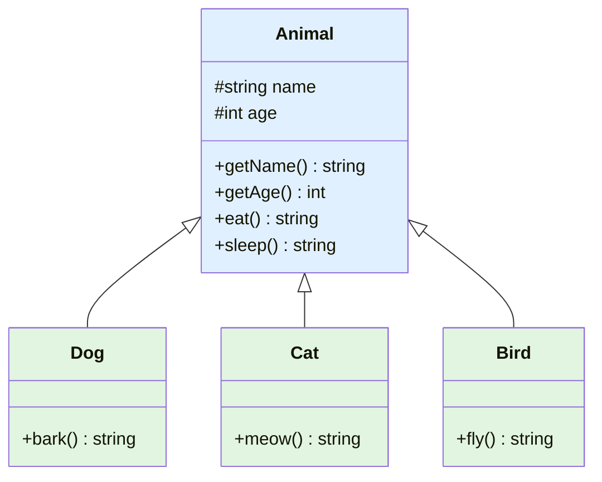
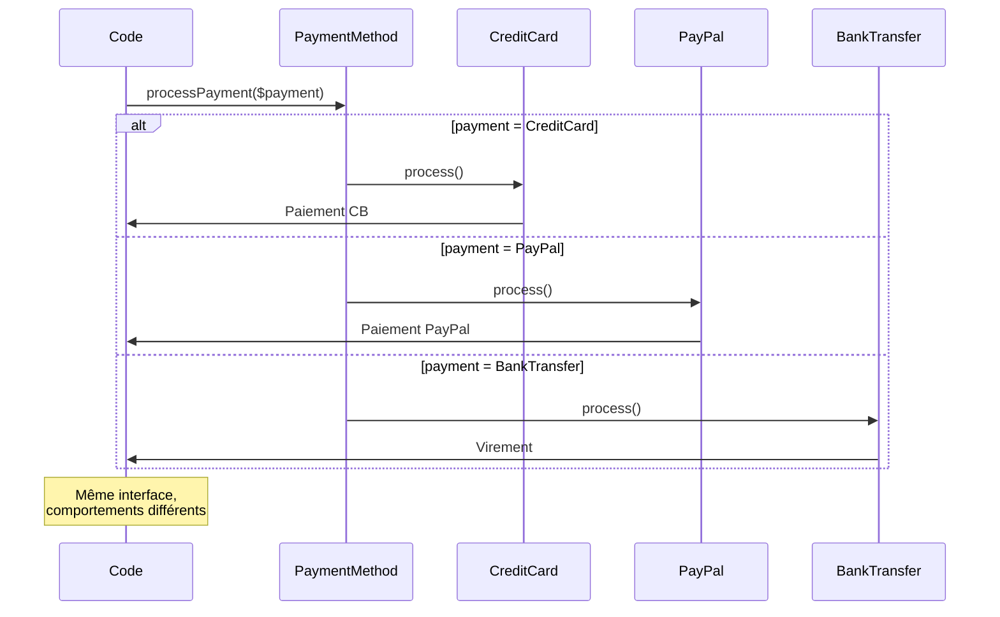
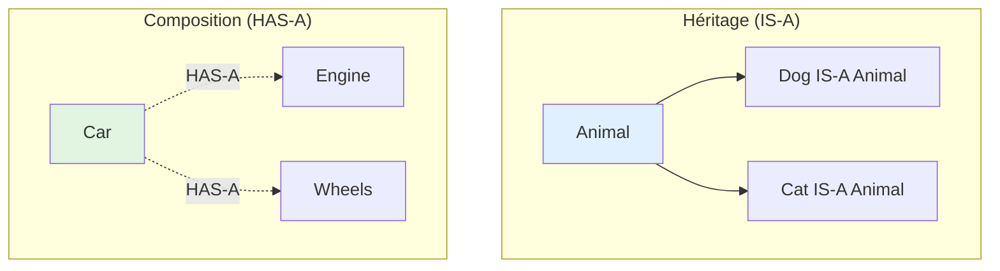

# IX - Héritage & Polymorphisme

<div
  class="omny-meta"
  data-level="🟡 Intermédiaire"
  data-version="1.0"
  data-time="8-10 heures">
</div>

## Introduction : Réutiliser et Étendre

!!! quote "Analogie pédagogique"
    _Imaginez une **famille d'animaux dans un zoo**. Tous les animaux partagent des caractéristiques communes : ils ont un nom, un âge, peuvent manger, dormir. Mais chaque espèce a ses spécificités : le lion rugit, l'oiseau vole, le poisson nage. En programmation procédurale, vous créeriez des fonctions `lion_rugir()`, `oiseau_voler()`, `poisson_nager()` avec beaucoup de code dupliqué pour les comportements communs. Avec l'**héritage**, vous créez une classe `Animal` (parent) avec les comportements communs, puis des classes `Lion`, `Oiseau`, `Poisson` (enfants) qui héritent automatiquement des comportements du parent et ajoutent leurs spécificités. C'est comme un **arbre généalogique** : les enfants héritent des gènes des parents (propriétés et méthodes) mais développent leur propre personnalité (méthodes spécifiques). Le **polymorphisme**, c'est la capacité de traiter tous les animaux de la même manière (appeler `manger()`) même si chaque espèce mange différemment. Ce module vous enseigne l'art de créer des hiérarchies élégantes et flexibles._

**Héritage** = Mécanisme permettant à une classe d'hériter des propriétés et méthodes d'une autre classe.

**Polymorphisme** = Capacité d'objets de classes différentes à être traités de manière uniforme.

**Pourquoi héritage et polymorphisme ?**

✅ **DRY (Don't Repeat Yourself)** : Code commun une seule fois
✅ **Organisation hiérarchique** : Structure logique et claire
✅ **Extensibilité** : Ajouter fonctionnalités sans modifier existant
✅ **Maintenance** : Modification dans parent affecte tous enfants
✅ **Flexibilité** : Polymorphisme permet interchangeabilité

**Ce module vous apprend à construire des architectures POO élégantes et maintenables.**

---

## 1. Héritage Simple avec extends

### 1.1 Syntaxe de Base

```php
<?php
declare(strict_types=1);

// ============================================
// CLASSE PARENT (SUPERCLASSE)
// ============================================

class Animal {
    protected string $name;
    protected int $age;
    
    public function __construct(string $name, int $age) {
        $this->name = $name;
        $this->age = $age;
    }
    
    public function getName(): string {
        return $this->name;
    }
    
    public function getAge(): int {
        return $this->age;
    }
    
    public function eat(): string {
        return "{$this->name} mange.";
    }
    
    public function sleep(): string {
        return "{$this->name} dort.";
    }
}

// ============================================
// CLASSES ENFANTS (SOUS-CLASSES)
// ============================================

class Dog extends Animal {
    // Hérite automatiquement de :
    // - protected $name
    // - protected $age
    // - getName()
    // - getAge()
    // - eat()
    // - sleep()
    
    // Ajoute méthode spécifique
    public function bark(): string {
        return "{$this->name} aboie : Woof!";
    }
}

class Cat extends Animal {
    public function meow(): string {
        return "{$this->name} miaule : Meow!";
    }
}

class Bird extends Animal {
    public function fly(): string {
        return "{$this->name} vole dans les airs.";
    }
}

// ============================================
// UTILISATION
// ============================================

$dog = new Dog('Rex', 5);
echo $dog->getName();  // Rex (hérité)
echo $dog->eat();      // Rex mange. (hérité)
echo $dog->sleep();    // Rex dort. (hérité)
echo $dog->bark();     // Rex aboie : Woof! (spécifique)

$cat = new Cat('Mimi', 3);
echo $cat->eat();      // Mimi mange.
echo $cat->meow();     // Mimi miaule : Meow!

$bird = new Bird('Tweety', 1);
echo $bird->sleep();   // Tweety dort.
echo $bird->fly();     // Tweety vole dans les airs.
```

**Diagramme : Hiérarchie d'héritage**



### 1.2 Portée protected

**protected = Accessible dans classe + classes enfants (mais pas extérieur)**

```php
<?php

class Vehicle {
    public string $brand;           // Public : accessible partout
    protected int $year;            // Protected : classe + enfants
    private string $engineCode;     // Private : classe uniquement
    
    public function __construct(string $brand, int $year, string $engineCode) {
        $this->brand = $brand;
        $this->year = $year;
        $this->engineCode = $engineCode;
    }
    
    protected function getYear(): int {
        return $this->year;
    }
    
    private function getEngineCode(): string {
        return $this->engineCode;
    }
}

class Car extends Vehicle {
    public function displayInfo(): string {
        // ✅ Accès protected OK
        $year = $this->year;
        $yearMethod = $this->getYear();
        
        // ❌ Accès private INTERDIT
        // $code = $this->engineCode; // Erreur
        // $code = $this->getEngineCode(); // Erreur
        
        return "{$this->brand} ({$year})";
    }
}

$car = new Car('Toyota', 2023, 'ENG123');

// ✅ Accès public OK
echo $car->brand; // Toyota

// ❌ Accès protected INTERDIT depuis extérieur
// echo $car->year; // Erreur
// echo $car->getYear(); // Erreur

// ❌ Accès private INTERDIT
// echo $car->engineCode; // Erreur
```

**Tableau récapitulatif visibilité avec héritage :**

| Visibilité | Classe | Enfants | Extérieur |
|------------|--------|---------|-----------|
| **public** | ✅ Oui | ✅ Oui | ✅ Oui |
| **protected** | ✅ Oui | ✅ Oui | ❌ Non |
| **private** | ✅ Oui | ❌ Non | ❌ Non |

**Bonnes pratiques :**

✅ **protected** pour propriétés/méthodes partagées avec enfants
✅ **private** pour implémentation interne (pas d'héritage)
✅ **public** pour API externe

---

## 2. Mot-clé parent

### 2.1 Appeler Constructeur Parent

```php
<?php
declare(strict_types=1);

class Person {
    protected string $firstName;
    protected string $lastName;
    
    public function __construct(string $firstName, string $lastName) {
        $this->firstName = $firstName;
        $this->lastName = $lastName;
    }
    
    public function getFullName(): string {
        return "{$this->firstName} {$this->lastName}";
    }
}

class Employee extends Person {
    private string $employeeId;
    private float $salary;
    
    public function __construct(
        string $firstName,
        string $lastName,
        string $employeeId,
        float $salary
    ) {
        // ⚠️ CRITIQUE : Appeler constructeur parent
        parent::__construct($firstName, $lastName);
        
        // Puis initialiser propriétés spécifiques
        $this->employeeId = $employeeId;
        $this->salary = $salary;
    }
    
    public function getEmployeeId(): string {
        return $this->employeeId;
    }
    
    public function getSalary(): float {
        return $this->salary;
    }
}

// Usage
$employee = new Employee('Alice', 'Dupont', 'EMP001', 45000);

echo $employee->getFullName();    // Alice Dupont (hérité)
echo $employee->getEmployeeId();  // EMP001
echo $employee->getSalary();      // 45000
```

**Promotion propriétés avec parent (PHP 8+) :**

```php
<?php

class Person {
    public function __construct(
        protected string $firstName,
        protected string $lastName
    ) {}
}

class Employee extends Person {
    public function __construct(
        string $firstName,
        string $lastName,
        private string $employeeId,
        private float $salary
    ) {
        parent::__construct($firstName, $lastName);
    }
}
```

### 2.2 Appeler Méthodes Parent

```php
<?php

class Logger {
    protected string $filename;
    
    public function __construct(string $filename) {
        $this->filename = $filename;
    }
    
    public function log(string $message): void {
        $timestamp = date('Y-m-d H:i:s');
        $formattedMessage = "[$timestamp] $message\n";
        
        file_put_contents($this->filename, $formattedMessage, FILE_APPEND);
    }
}

class DatabaseLogger extends Logger {
    private PDO $pdo;
    
    public function __construct(string $filename, PDO $pdo) {
        parent::__construct($filename);
        $this->pdo = $pdo;
    }
    
    public function log(string $message): void {
        // 1. Appeler méthode parent (log fichier)
        parent::log($message);
        
        // 2. Ajouter comportement supplémentaire (log BDD)
        $stmt = $this->pdo->prepare("INSERT INTO logs (message, created_at) VALUES (?, NOW())");
        $stmt->execute([$message]);
    }
}

// Usage
$logger = new DatabaseLogger('app.log', $pdo);

// Log dans fichier ET base de données
$logger->log('Application démarrée');
$logger->log('Utilisateur connecté');
```

---

## 3. Surcharge de Méthodes (Override)

### 3.1 Redéfinir Méthode Parent

**Surcharge = Redéfinir méthode héritée avec comportement différent**

```php
<?php
declare(strict_types=1);

class Shape {
    protected string $name;
    
    public function __construct(string $name) {
        $this->name = $name;
    }
    
    public function getArea(): float {
        return 0.0; // Valeur par défaut
    }
    
    public function getDescription(): string {
        return "Forme : {$this->name}, Aire : {$this->getArea()}";
    }
}

class Circle extends Shape {
    private float $radius;
    
    public function __construct(float $radius) {
        parent::__construct('Cercle');
        $this->radius = $radius;
    }
    
    // ✅ SURCHARGE : Redéfinir getArea()
    public function getArea(): float {
        return pi() * $this->radius ** 2;
    }
}

class Rectangle extends Shape {
    private float $width;
    private float $height;
    
    public function __construct(float $width, float $height) {
        parent::__construct('Rectangle');
        $this->width = $width;
        $this->height = $height;
    }
    
    // ✅ SURCHARGE : Redéfinir getArea()
    public function getArea(): float {
        return $this->width * $this->height;
    }
}

class Triangle extends Shape {
    private float $base;
    private float $height;
    
    public function __construct(float $base, float $height) {
        parent::__construct('Triangle');
        $this->base = $base;
        $this->height = $height;
    }
    
    // ✅ SURCHARGE : Redéfinir getArea()
    public function getArea(): float {
        return ($this->base * $this->height) / 2;
    }
}

// Usage
$circle = new Circle(5);
echo $circle->getDescription(); // Forme : Cercle, Aire : 78.54

$rectangle = new Rectangle(10, 20);
echo $rectangle->getDescription(); // Forme : Rectangle, Aire : 200

$triangle = new Triangle(10, 15);
echo $triangle->getDescription(); // Forme : Triangle, Aire : 75

// ✅ Chaque forme calcule son aire différemment
// ✅ Mais toutes utilisent getDescription() du parent
```

### 3.2 Signature de Méthode

**⚠️ IMPORTANT : Signature compatible avec parent**

```php
<?php

class BaseClass {
    public function process(string $data): string {
        return strtoupper($data);
    }
}

// ✅ BON : Signature identique
class GoodChild extends BaseClass {
    public function process(string $data): string {
        return strtolower($data);
    }
}

// ✅ BON : Signature compatible (types plus larges en param, plus stricts en return)
class CompatibleChild extends BaseClass {
    public function process(string $data): string|int {
        return strlen($data); // Return type plus large OK
    }
}

// ❌ ERREUR : Signature incompatible
/*
class BadChild extends BaseClass {
    // Erreur : Type param différent
    public function process(int $data): string {
        return (string)$data;
    }
}
*/

// ❌ ERREUR : Return type incompatible
/*
class BadChild2 extends BaseClass {
    // Erreur : Return type plus strict
    public function process(string $data): int {
        return strlen($data);
    }
}
*/
```

**Règles compatibilité (PHP 7.2+) :**

✅ **Paramètres** : Peut être plus large (contravariance)
✅ **Return type** : Peut être plus strict (covariance)
❌ **Nombre paramètres** : Doit être identique (ou moins avec défauts)

---

## 4. Polymorphisme

### 4.1 Principe du Polymorphisme

**Polymorphisme = Traiter objets de classes différentes de manière uniforme**

```php
<?php
declare(strict_types=1);

// Classe parent
abstract class PaymentMethod {
    protected float $amount;
    
    public function __construct(float $amount) {
        $this->amount = $amount;
    }
    
    // Méthode abstraite (doit être implémentée par enfants)
    abstract public function process(): bool;
    
    public function getAmount(): float {
        return $this->amount;
    }
}

// Enfants avec implémentations différentes
class CreditCardPayment extends PaymentMethod {
    private string $cardNumber;
    
    public function __construct(float $amount, string $cardNumber) {
        parent::__construct($amount);
        $this->cardNumber = $cardNumber;
    }
    
    public function process(): bool {
        echo "Paiement CB {$this->amount}€ avec carte {$this->cardNumber}\n";
        // Logique paiement CB
        return true;
    }
}

class PayPalPayment extends PaymentMethod {
    private string $email;
    
    public function __construct(float $amount, string $email) {
        parent::__construct($amount);
        $this->email = $email;
    }
    
    public function process(): bool {
        echo "Paiement PayPal {$this->amount}€ pour {$this->email}\n";
        // Logique paiement PayPal
        return true;
    }
}

class BankTransferPayment extends PaymentMethod {
    private string $iban;
    
    public function __construct(float $amount, string $iban) {
        parent::__construct($amount);
        $this->iban = $iban;
    }
    
    public function process(): bool {
        echo "Virement bancaire {$this->amount}€ vers {$this->iban}\n";
        // Logique virement
        return true;
    }
}

// ============================================
// POLYMORPHISME EN ACTION
// ============================================

function processPayment(PaymentMethod $payment): bool {
    // ✅ Fonctionne avec N'IMPORTE quelle classe enfant
    echo "Traitement paiement de {$payment->getAmount()}€...\n";
    return $payment->process();
}

// Utilisation polymorphique
$payments = [
    new CreditCardPayment(100, '1234-5678-9012-3456'),
    new PayPalPayment(50, 'alice@example.com'),
    new BankTransferPayment(200, 'FR76123456789')
];

foreach ($payments as $payment) {
    // ✅ Même fonction, comportements différents
    processPayment($payment);
}

/*
Output :
Traitement paiement de 100€...
Paiement CB 100€ avec carte 1234-5678-9012-3456

Traitement paiement de 50€...
Paiement PayPal 50€ pour alice@example.com

Traitement paiement de 200€...
Virement bancaire 200€ vers FR76123456789
*/
```

**Diagramme : Polymorphisme**



### 4.2 Type Hinting avec Classes Parent

```php
<?php

// Type hint avec classe parent
function calculateTotalArea(array $shapes): float {
    $total = 0;
    
    // ✅ Accepte Circle, Rectangle, Triangle, etc.
    foreach ($shapes as $shape) {
        if (!$shape instanceof Shape) {
            throw new InvalidArgumentException("Doit être un Shape");
        }
        
        $total += $shape->getArea();
    }
    
    return $total;
}

// Usage polymorphique
$shapes = [
    new Circle(5),
    new Rectangle(10, 20),
    new Triangle(10, 15),
    new Circle(3)
];

$total = calculateTotalArea($shapes);
echo "Aire totale : $total"; // 78.54 + 200 + 75 + 28.27 = 381.81
```

---

## 5. Classes Abstraites

### 5.1 Définition et Utilisation

**Classe abstraite = Classe qui ne peut PAS être instanciée directement**

```php
<?php
declare(strict_types=1);

// ============================================
// CLASSE ABSTRAITE
// ============================================

abstract class Database {
    protected string $host;
    protected string $database;
    protected string $username;
    protected string $password;
    protected $connection;
    
    public function __construct(string $host, string $database, string $username, string $password) {
        $this->host = $host;
        $this->database = $database;
        $this->username = $username;
        $this->password = $password;
    }
    
    // Méthode abstraite (DOIT être implémentée par enfants)
    abstract public function connect(): void;
    abstract public function disconnect(): void;
    abstract public function query(string $sql): array;
    
    // Méthode concrète (implémentation fournie)
    public function getDatabaseName(): string {
        return $this->database;
    }
    
    public function isConnected(): bool {
        return $this->connection !== null;
    }
}

// ============================================
// IMPLÉMENTATIONS CONCRÈTES
// ============================================

class MySQLDatabase extends Database {
    public function connect(): void {
        $dsn = "mysql:host={$this->host};dbname={$this->database}";
        $this->connection = new PDO($dsn, $this->username, $this->password);
        echo "Connexion MySQL réussie\n";
    }
    
    public function disconnect(): void {
        $this->connection = null;
        echo "Déconnexion MySQL\n";
    }
    
    public function query(string $sql): array {
        $stmt = $this->connection->query($sql);
        return $stmt->fetchAll(PDO::FETCH_ASSOC);
    }
}

class PostgreSQLDatabase extends Database {
    public function connect(): void {
        $dsn = "pgsql:host={$this->host};dbname={$this->database}";
        $this->connection = new PDO($dsn, $this->username, $this->password);
        echo "Connexion PostgreSQL réussie\n";
    }
    
    public function disconnect(): void {
        $this->connection = null;
        echo "Déconnexion PostgreSQL\n";
    }
    
    public function query(string $sql): array {
        $stmt = $this->connection->query($sql);
        return $stmt->fetchAll(PDO::FETCH_ASSOC);
    }
}

// ============================================
// UTILISATION
// ============================================

// ❌ IMPOSSIBLE : Classe abstraite non instanciable
// $db = new Database('localhost', 'test', 'root', ''); // Erreur

// ✅ Instanciation classes concrètes
$mysql = new MySQLDatabase('localhost', 'test_mysql', 'root', '');
$mysql->connect();
$results = $mysql->query('SELECT * FROM users');
$mysql->disconnect();

$postgres = new PostgreSQLDatabase('localhost', 'test_postgres', 'postgres', '');
$postgres->connect();
$results = $postgres->query('SELECT * FROM users');
$postgres->disconnect();

// ✅ Polymorphisme
function executeQuery(Database $db, string $sql): array {
    if (!$db->isConnected()) {
        $db->connect();
    }
    
    return $db->query($sql);
}

$result1 = executeQuery($mysql, 'SELECT * FROM products');
$result2 = executeQuery($postgres, 'SELECT * FROM products');
```

**Règles classes abstraites :**

✅ **abstract class** = Mot-clé obligatoire
✅ **abstract method** = Déclaration seulement (pas d'implémentation)
✅ **Méthodes concrètes** = Autorisées dans classe abstraite
✅ **Propriétés** = Autorisées (public, protected, private)
❌ **Instanciation** = Impossible (new AbstractClass)
✅ **Héritage** = Enfants DOIVENT implémenter méthodes abstraites

### 5.2 Quand Utiliser Classes Abstraites ?

**Cas d'usage :**

✅ **Partager code commun** entre classes similaires
✅ **Définir contrat** (méthodes obligatoires)
✅ **Éviter instanciation** classe trop générique
✅ **Architecture MVC** : Controller abstrait, Model abstrait

**Exemple : Architecture contrôleurs**

```php
<?php

abstract class Controller {
    protected array $data = [];
    
    // Méthode abstraite : chaque contrôleur implémente
    abstract public function index(): void;
    
    // Méthodes concrètes partagées
    protected function render(string $view, array $data = []): void {
        $this->data = array_merge($this->data, $data);
        extract($this->data);
        
        require "views/{$view}.php";
    }
    
    protected function redirect(string $url): void {
        header("Location: $url");
        exit;
    }
    
    protected function json(array $data): void {
        header('Content-Type: application/json');
        echo json_encode($data);
        exit;
    }
}

class HomeController extends Controller {
    public function index(): void {
        $this->render('home', [
            'title' => 'Accueil'
        ]);
    }
}

class UserController extends Controller {
    public function index(): void {
        // Récupérer users depuis BDD
        $users = $this->getUsers();
        
        $this->render('users/index', [
            'users' => $users
        ]);
    }
    
    private function getUsers(): array {
        // Logique BDD
        return [];
    }
}

class ApiController extends Controller {
    public function index(): void {
        $this->json([
            'status' => 'success',
            'data' => []
        ]);
    }
}
```

---

## 6. Mot-clé final

### 6.1 Empêcher Héritage

**final = Empêcher surcharge de classe ou méthode**

```php
<?php

// ============================================
// CLASSE FINAL (pas d'héritage possible)
// ============================================

final class ImmutableConfig {
    private array $settings;
    
    public function __construct(array $settings) {
        $this->settings = $settings;
    }
    
    public function get(string $key): mixed {
        return $this->settings[$key] ?? null;
    }
}

// ❌ ERREUR : Impossible d'hériter classe final
/*
class ExtendedConfig extends ImmutableConfig {
    // Fatal error
}
*/

// ============================================
// MÉTHODE FINAL (pas de surcharge possible)
// ============================================

class User {
    protected string $name;
    
    public function __construct(string $name) {
        $this->name = $name;
    }
    
    // Méthode final : enfants ne peuvent PAS la surcharger
    final public function getName(): string {
        return $this->name;
    }
    
    // Méthode normale : peut être surchargée
    public function getDescription(): string {
        return "Utilisateur : {$this->name}";
    }
}

class Admin extends User {
    // ✅ OK : Surcharge méthode normale
    public function getDescription(): string {
        return "Administrateur : {$this->name}";
    }
    
    // ❌ ERREUR : Impossible de surcharger méthode final
    /*
    public function getName(): string {
        return strtoupper($this->name);
    }
    */
}
```

**Quand utiliser final ?**

✅ **Sécurité** : Méthode critique ne doit pas être modifiée
✅ **Performance** : Optimisation PHP (pas de lookup héritage)
✅ **Design** : Classe utilitaire sans héritage prévu
✅ **Immutabilité** : Garantir comportement fixe

**Exemples réels :**

```php
<?php

// Classe utilitaire : pas d'héritage nécessaire
final class StringHelper {
    public static function slugify(string $text): string {
        return strtolower(preg_replace('/[^a-z0-9]+/', '-', $text));
    }
}

// Méthode critique de sécurité
class Authentication {
    final public function hashPassword(string $password): string {
        // ⚠️ Méthode critique, ne DOIT PAS être modifiée
        return password_hash($password, PASSWORD_BCRYPT, ['cost' => 12]);
    }
}

// Value Object immuable
final class Money {
    public function __construct(
        private readonly float $amount,
        private readonly string $currency
    ) {}
    
    public function getAmount(): float {
        return $this->amount;
    }
    
    public function getCurrency(): string {
        return $this->currency;
    }
}
```

---

## 7. Composition vs Héritage

### 7.1 Principe

**Composition = "A un" (Has-a)**  
**Héritage = "Est un" (Is-a)**



### 7.2 Héritage : Quand l'Utiliser ?

**✅ Utiliser héritage quand :**

- Relation "est un" claire (Dog IS-A Animal)
- Comportements partagés nombreux
- Hiérarchie naturelle et stable

```php
<?php

// ✅ BON : Hiérarchie naturelle
abstract class Vehicle {
    protected string $brand;
    protected int $year;
    
    public function start(): void {
        echo "Véhicule démarré\n";
    }
}

class Car extends Vehicle {
    // Car IS-A Vehicle ✅
}

class Motorcycle extends Vehicle {
    // Motorcycle IS-A Vehicle ✅
}

class Truck extends Vehicle {
    // Truck IS-A Vehicle ✅
}
```

### 7.3 Composition : Quand l'Utiliser ?

**✅ Utiliser composition quand :**

- Relation "a un" (Car HAS-AN Engine)
- Flexibilité nécessaire (comportements interchangeables)
- Éviter hiérarchies complexes

```php
<?php
declare(strict_types=1);

// ============================================
// COMPOSITION : Injecter dépendances
// ============================================

class Engine {
    public function __construct(
        private string $type,
        private int $horsepower
    ) {}
    
    public function start(): void {
        echo "Moteur {$this->type} ({$this->horsepower} CV) démarré\n";
    }
}

class GPS {
    public function getLocation(): string {
        return "48.8566, 2.3522"; // Paris
    }
}

class MusicPlayer {
    public function play(string $song): void {
        echo "Lecture : $song\n";
    }
}

// Car HAS-A Engine, HAS-A GPS, HAS-A MusicPlayer
class Car {
    // Composition : objets injectés
    public function __construct(
        private string $brand,
        private Engine $engine,
        private ?GPS $gps = null,
        private ?MusicPlayer $musicPlayer = null
    ) {}
    
    public function start(): void {
        echo "Démarrage {$this->brand}\n";
        $this->engine->start();
        
        if ($this->gps) {
            echo "Position : " . $this->gps->getLocation() . "\n";
        }
    }
    
    public function playMusic(string $song): void {
        if ($this->musicPlayer) {
            $this->musicPlayer->play($song);
        } else {
            echo "Pas de lecteur musique\n";
        }
    }
}

// Flexibilité : composer fonctionnalités
$engine1 = new Engine('Essence', 150);
$engine2 = new Engine('Électrique', 200);

$gps = new GPS();
$music = new MusicPlayer();

// Voiture basique (seulement moteur)
$basicCar = new Car('Renault', $engine1);
$basicCar->start();

// Voiture premium (moteur + GPS + musique)
$premiumCar = new Car('Tesla', $engine2, $gps, $music);
$premiumCar->start();
$premiumCar->playMusic('Bohemian Rhapsody');

// ✅ Flexibilité maximale : combiner composants
// ✅ Testabilité : mock Engine, GPS, MusicPlayer
// ✅ Réutilisabilité : Engine dans Car, Motorcycle, Boat
```

### 7.4 Problème Héritage Multiple (Diamond Problem)

**PHP n'autorise PAS héritage multiple**

```php
<?php

// ❌ IMPOSSIBLE en PHP
/*
class FlyingCar extends Car, Airplane {
    // Fatal error : PHP n'autorise pas héritage multiple
}
*/

// ✅ SOLUTION : Composition + Interfaces (Module 10)
class FlyingCar {
    private Car $car;
    private Airplane $airplane;
    
    public function __construct(Car $car, Airplane $airplane) {
        $this->car = $car;
        $this->airplane = $airplane;
    }
    
    public function drive(): void {
        $this->car->start();
    }
    
    public function fly(): void {
        $this->airplane->takeOff();
    }
}
```

**Règle d'or : Préférer composition à héritage**

✅ **Composition** = Flexibilité, testabilité, réutilisabilité
⚠️ **Héritage** = Seulement si relation IS-A claire et stable

---

## 8. Exemples Complets

### 8.1 Système de Notifications

```php
<?php
declare(strict_types=1);

// Classe abstraite parent
abstract class Notification {
    protected string $recipient;
    protected string $message;
    protected DateTime $sentAt;
    
    public function __construct(string $recipient, string $message) {
        $this->recipient = $recipient;
        $this->message = $message;
    }
    
    // Méthode abstraite : chaque notification envoie différemment
    abstract public function send(): bool;
    
    // Méthode concrète partagée
    protected function logNotification(string $type): void {
        $this->sentAt = new DateTime();
        echo "[{$this->sentAt->format('Y-m-d H:i:s')}] $type envoyé à {$this->recipient}\n";
    }
    
    public function getRecipient(): string {
        return $this->recipient;
    }
}

// Notifications Email
class EmailNotification extends Notification {
    private string $subject;
    
    public function __construct(string $recipient, string $subject, string $message) {
        parent::__construct($recipient, $message);
        $this->subject = $subject;
    }
    
    public function send(): bool {
        // Logique envoi email
        $headers = "From: noreply@example.com\r\n";
        mail($this->recipient, $this->subject, $this->message, $headers);
        
        $this->logNotification('Email');
        return true;
    }
}

// Notification SMS
class SMSNotification extends Notification {
    public function send(): bool {
        // Logique envoi SMS (API)
        echo "SMS envoyé au {$this->recipient} : {$this->message}\n";
        
        $this->logNotification('SMS');
        return true;
    }
}

// Notification Push
class PushNotification extends Notification {
    private string $deviceToken;
    
    public function __construct(string $recipient, string $message, string $deviceToken) {
        parent::__construct($recipient, $message);
        $this->deviceToken = $deviceToken;
    }
    
    public function send(): bool {
        // Logique envoi push (Firebase, etc.)
        echo "Push envoyé vers {$this->deviceToken} : {$this->message}\n";
        
        $this->logNotification('Push');
        return true;
    }
}

// Notification Slack
class SlackNotification extends Notification {
    private string $channel;
    
    public function __construct(string $channel, string $message) {
        parent::__construct($channel, $message);
        $this->channel = $channel;
    }
    
    public function send(): bool {
        // Logique envoi Slack (webhook)
        echo "Message Slack envoyé sur #{$this->channel} : {$this->message}\n";
        
        $this->logNotification('Slack');
        return true;
    }
}

// ============================================
// UTILISATION POLYMORPHIQUE
// ============================================

class NotificationService {
    private array $notifications = [];
    
    public function addNotification(Notification $notification): void {
        $this->notifications[] = $notification;
    }
    
    public function sendAll(): void {
        foreach ($this->notifications as $notification) {
            $notification->send();
        }
    }
}

// Usage
$service = new NotificationService();

$service->addNotification(new EmailNotification(
    'alice@example.com',
    'Bienvenue !',
    'Merci de votre inscription.'
));

$service->addNotification(new SMSNotification(
    '+33612345678',
    'Votre code de vérification : 123456'
));

$service->addNotification(new PushNotification(
    'user@example.com',
    'Nouvelle commande !',
    'device_token_abc123'
));

$service->addNotification(new SlackNotification(
    'general',
    'Déploiement réussi en production'
));

$service->sendAll();
```

### 8.2 Hiérarchie Employés

```php
<?php
declare(strict_types=1);

abstract class Employee {
    protected string $firstName;
    protected string $lastName;
    protected string $employeeId;
    protected DateTime $hireDate;
    
    public function __construct(string $firstName, string $lastName, string $employeeId) {
        $this->firstName = $firstName;
        $this->lastName = $lastName;
        $this->employeeId = $employeeId;
        $this->hireDate = new DateTime();
    }
    
    // Méthode abstraite : salaire calculé différemment
    abstract public function calculateSalary(): float;
    
    public function getFullName(): string {
        return "{$this->firstName} {$this->lastName}";
    }
    
    public function getEmployeeId(): string {
        return $this->employeeId;
    }
    
    final public function getYearsOfService(): int {
        $now = new DateTime();
        return $now->diff($this->hireDate)->y;
    }
}

class HourlyEmployee extends Employee {
    private float $hourlyRate;
    private int $hoursWorked = 0;
    
    public function __construct(string $firstName, string $lastName, string $employeeId, float $hourlyRate) {
        parent::__construct($firstName, $lastName, $employeeId);
        $this->hourlyRate = $hourlyRate;
    }
    
    public function logHours(int $hours): void {
        $this->hoursWorked += $hours;
    }
    
    public function calculateSalary(): float {
        return $this->hourlyRate * $this->hoursWorked;
    }
}

class SalariedEmployee extends Employee {
    private float $annualSalary;
    
    public function __construct(string $firstName, string $lastName, string $employeeId, float $annualSalary) {
        parent::__construct($firstName, $lastName, $employeeId);
        $this->annualSalary = $annualSalary;
    }
    
    public function calculateSalary(): float {
        // Salaire mensuel
        return $this->annualSalary / 12;
    }
}

class CommissionEmployee extends SalariedEmployee {
    private float $commissionRate;
    private float $salesAmount = 0;
    
    public function __construct(
        string $firstName,
        string $lastName,
        string $employeeId,
        float $annualSalary,
        float $commissionRate
    ) {
        parent::__construct($firstName, $lastName, $employeeId, $annualSalary);
        $this->commissionRate = $commissionRate;
    }
    
    public function recordSale(float $amount): void {
        $this->salesAmount += $amount;
    }
    
    public function calculateSalary(): float {
        // Salaire de base + commissions
        $baseSalary = parent::calculateSalary();
        $commission = $this->salesAmount * $this->commissionRate;
        
        return $baseSalary + $commission;
    }
}

// Usage
$employees = [
    new HourlyEmployee('Alice', 'Dupont', 'E001', 15.50),
    new SalariedEmployee('Bob', 'Martin', 'E002', 36000),
    new CommissionEmployee('Charlie', 'Durand', 'E003', 30000, 0.05)
];

// Polymorphisme : calculer paie
foreach ($employees as $employee) {
    if ($employee instanceof HourlyEmployee) {
        $employee->logHours(160); // 160h ce mois
    } elseif ($employee instanceof CommissionEmployee) {
        $employee->recordSale(50000); // 50k€ de ventes
    }
    
    $salary = $employee->calculateSalary();
    echo "{$employee->getFullName()} : {$salary}€\n";
}
```

---

## 9. Exercices Pratiques

### Exercice 1 : Système de Médias
    
!!! tip "Pratique Intensive — Projet 16"
    Construisez un système de Polymorphisme solide. Imaginez qu'une Vidéo et un Texte soient la même entité pour faciliter la création de boucles globales. C'est l'Héritage !
    
    👉 **[Aller au Projet 16 : Bibliothèque de Médias](../../../../projets/php-lab/16-systeme-medias/index.md)**

### Exercice 2 : Jeu RPG (Personnages)
    
!!! tip "Pratique Intensive — Projet 17"
    Construisez un système de combat abstrait (Tour par tour). Une Classe Mage et une Classe Guerrier héritent d'un système de santé commun, mais utilisent le _Polymorphisme_ pour détruire leur adversaire avec des mécaniques uniques !
    
    👉 **[Aller au Projet 17 : Jeu RPG (Personnages)](../../../../projets/php-lab/17-jeu-rpg/index.md)**

---

## 10. Checkpoint de Progression

### À la fin de ce Module 9, vous maîtrisez :

**Héritage :**
- [x] extends syntaxe
- [x] Visibilité protected
- [x] Appeler parent::__construct()
- [x] Appeler parent::method()

**Polymorphisme :**
- [x] Surcharge de méthodes
- [x] Signature compatible
- [x] Type hinting classes parent
- [x] Utilisation polymorphique

**Classes abstraites :**
- [x] abstract class définition
- [x] Méthodes abstraites
- [x] Quand utiliser abstraites
- [x] Contrat + implémentation

**final :**
- [x] final class
- [x] final method
- [x] Cas d'usage

**Composition vs Héritage :**
- [x] IS-A vs HAS-A
- [x] Quand préférer composition
- [x] Flexibilité composition

### Prochaine Étape

**Direction le Module 10** où vous allez :
- Maîtriser interfaces (implements)
- Différence interface vs abstract
- Interfaces multiples
- Type hinting interfaces
- Interfaces standards PHP (Iterator, Countable)
- Typage strict avec interfaces

[:lucide-arrow-right: Accéder au Module 10 - Interfaces](./module-10-interfaces/)

---

**Module 9 Terminé - Bravo ! 🎉 🌳**

**Vous avez appris :**
- ✅ Héritage avec extends maîtrisé
- ✅ Mot-clé parent (constructeur, méthodes)
- ✅ Surcharge de méthodes (override)
- ✅ Polymorphisme complet
- ✅ Classes abstraites (abstract, méthodes abstraites)
- ✅ final (classes et méthodes)
- ✅ Composition vs héritage (IS-A vs HAS-A)
- ✅ 2 projets complets (Notifications, Médias)

**Statistiques Module 9 :**
- 2 projets complets
- 60+ exemples code
- Hiérarchies maîtrisées
- Polymorphisme exploité
- Architectures flexibles

**Prochain objectif : Maîtriser interfaces (Module 10)**

**Félicitations pour cette progression POO ! 🚀🌳**

---

# ✅ Module 9 PHP POO Complet ! 🎉 🌳

Voilà le **Module 9 - Héritage & Polymorphisme** (8-10 heures) qui approfondit la POO avec les concepts essentiels d'héritage et de polymorphisme.

**Contenu exhaustif :**
- ✅ Héritage simple (extends, syntaxe, utilisation)
- ✅ Visibilité protected (accès classes enfants)
- ✅ Mot-clé parent (constructeur, méthodes)
- ✅ Surcharge de méthodes (override, signatures)
- ✅ Polymorphisme (principe, type hinting, usage)
- ✅ Classes abstraites (abstract class, abstract methods)
- ✅ final (classes et méthodes, cas d'usage)
- ✅ Composition vs héritage (IS-A vs HAS-A, quand utiliser)
- ✅ 2 exercices complets (Système médias, RPG personnages)

**Progression formation PHP POO :**
- Module 8 - Introduction POO ✅
- Module 9 - Héritage & Polymorphisme ✅
- Module 10 - Interfaces 🚀 (prochain)

Tu as maintenant les bases solides de l'héritage et du polymorphisme. Les concepts de hiérarchies de classes, surcharge de méthodes, et classes abstraites sont maîtrisés.

Veux-tu que je continue avec le **Module 10 - Interfaces** ? (implements, différence interface vs abstract, interfaces multiples, interfaces standards PHP, type hinting interfaces, contrats stricts)

<br>

---

## Conclusion

!!! quote "Ce qu'il faut retenir"
    Le langage PHP a radicalement évolué. Il n'est plus le langage de script désordonné d'il y a 15 ans, mais un langage typé, orienté objet et performant. La maîtrise de ses concepts avancés est essentielle pour utiliser correctement un framework comme Laravel.

> [Retourner à la Masterclass PHP →](../index.md)
