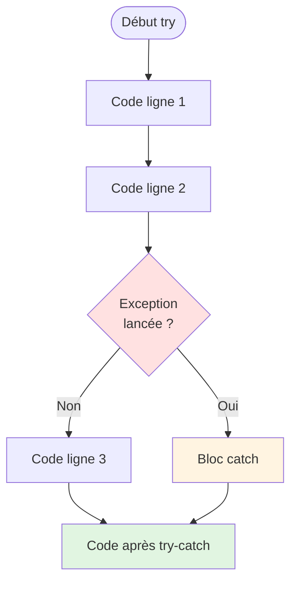
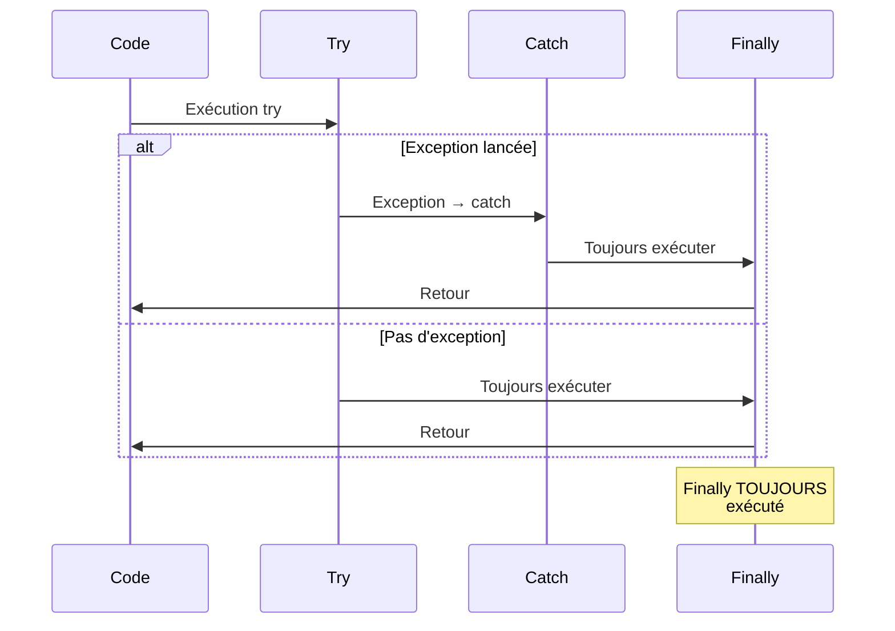
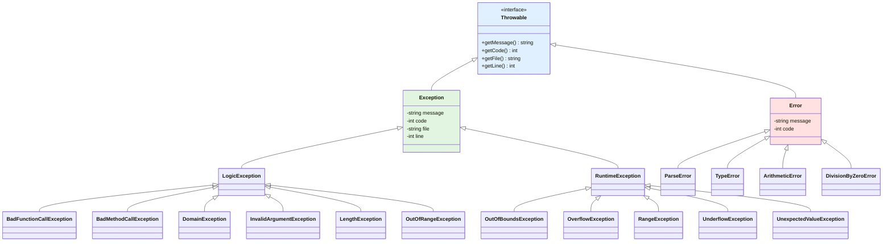
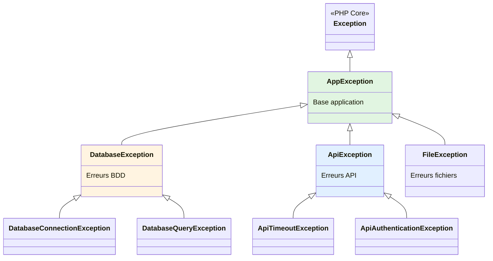

# XII - Exceptions

<div
  class="omny-meta"
  data-level="🟡 Intermédiaire"
  data-version="1.0"
  data-time="8-10 heures">
</div>

## Introduction : Gérer l'Inattendu

!!! quote "Analogie pédagogique"
    _Imaginez un **pilote d'avion**. Durant le vol, des situations inattendues peuvent survenir : turbulences, panne moteur, problème météo. Un mauvais pilote paniquerait et crasherait l'avion. Un bon pilote a des **procédures d'urgence** (gestion d'exceptions) : détecter le problème (throw), identifier sa nature (type d'exception), appliquer la procédure appropriée (catch), et reprendre le vol normal si possible (finally). En programmation, les **exceptions** sont ces événements inattendus : fichier introuvable, connexion BDD échouée, division par zéro. Sans gestion d'exceptions, votre programme "crash" brutalement. Avec exceptions, vous **détectez**, **gérez** et **récupérez** gracieusement des erreurs. C'est la différence entre un programme amateur qui plante et un programme professionnel qui gère les erreurs élégamment. Ce module vous transforme en pilote expert capable de naviguer tous les imprévus._

**Exception** = Objet représentant une condition exceptionnelle interrompant le flux normal du programme.

**Pourquoi les exceptions ?**

✅ **Séparation logique/erreurs** : Code métier séparé de gestion erreurs
✅ **Propagation automatique** : Erreur remonte automatiquement la pile
✅ **Type d'erreur explicite** : Différentes exceptions pour différents cas
✅ **Récupération gracieuse** : Programme continue après erreur gérée
✅ **Debugging facilité** : Stack trace complet
✅ **Code plus propre** : Pas de if/else partout

**Ce module vous enseigne à gérer les erreurs comme un professionnel.**

---

## 1. Syntaxe de Base

### 1.1 try-catch Fondamental

```php
<?php
declare(strict_types=1);

// ============================================
// SANS GESTION D'EXCEPTION (Programme crash)
// ============================================

function diviser(int $a, int $b): float {
    return $a / $b; // ⚠️ Division par zéro = Warning + retourne INF
}

$result = diviser(10, 0);
echo $result; // INF

// ============================================
// AVEC GESTION D'EXCEPTION
// ============================================

function diviserSecure(int $a, int $b): float {
    if ($b === 0) {
        // ✅ Lancer exception
        throw new InvalidArgumentException("Division par zéro impossible");
    }
    
    return $a / $b;
}

// Attraper exception
try {
    // Bloc essayé
    $result = diviserSecure(10, 2);
    echo "Résultat : $result\n"; // 5
    
    $result = diviserSecure(10, 0); // ⚠️ Exception lancée
    echo "Cette ligne ne s'exécute jamais\n";
    
} catch (InvalidArgumentException $e) {
    // Bloc exécuté si exception attrapée
    echo "Erreur : " . $e->getMessage() . "\n";
    // Le programme continue normalement après catch
}

echo "Programme continue\n"; // ✅ S'exécute toujours
```

**Diagramme : Flux d'exécution avec exception**



### 1.2 Anatomie d'une Exception

```php
<?php

try {
    throw new Exception("Message d'erreur", 404);
    
} catch (Exception $e) {
    // Méthodes disponibles
    echo $e->getMessage();    // Message d'erreur
    echo $e->getCode();       // 404
    echo $e->getFile();       // /path/to/file.php
    echo $e->getLine();       // 42
    echo $e->getTrace();      // Array (stack trace)
    echo $e->getTraceAsString(); // String formaté
    echo $e->__toString();    // Représentation complète
}
```

**Propriétés Exception :**

| Méthode | Retour | Description |
|---------|--------|-------------|
| `getMessage()` | string | Message d'erreur |
| `getCode()` | int | Code d'erreur |
| `getFile()` | string | Fichier où exception lancée |
| `getLine()` | int | Ligne où exception lancée |
| `getTrace()` | array | Stack trace (appels successifs) |
| `getTraceAsString()` | string | Stack trace formaté |
| `getPrevious()` | ?Throwable | Exception précédente (chaînage) |

### 1.3 Multiple catch

**Attraper différents types d'exceptions**

```php
<?php

function traiterFichier(string $filename): string {
    if (!file_exists($filename)) {
        throw new RuntimeException("Fichier introuvable : $filename");
    }
    
    $content = file_get_contents($filename);
    
    if ($content === false) {
        throw new RuntimeException("Impossible de lire le fichier");
    }
    
    $data = json_decode($content, true);
    
    if (json_last_error() !== JSON_ERROR_NONE) {
        throw new InvalidArgumentException("JSON invalide : " . json_last_error_msg());
    }
    
    return $data;
}

// Attraper plusieurs types
try {
    $data = traiterFichier('config.json');
    echo "Données chargées\n";
    
} catch (RuntimeException $e) {
    // Erreur fichier (lecture/existence)
    echo "Erreur fichier : " . $e->getMessage() . "\n";
    
} catch (InvalidArgumentException $e) {
    // Erreur format (JSON)
    echo "Erreur format : " . $e->getMessage() . "\n";
    
} catch (Exception $e) {
    // Catch-all (toutes autres exceptions)
    echo "Erreur inattendue : " . $e->getMessage() . "\n";
}

// ============================================
// PHP 7.1+ : Multiple types dans un catch
// ============================================

try {
    $data = traiterFichier('config.json');
    
} catch (RuntimeException | InvalidArgumentException $e) {
    // Même traitement pour les deux
    echo "Erreur : " . $e->getMessage() . "\n";
}
```

**⚠️ Ordre des catch important : Plus spécifique en premier**

```php
<?php

try {
    // Code
    
} catch (Exception $e) {
    // ⚠️ Catch générique en PREMIER = attrape TOUT
    // Les catch suivants ne seront jamais exécutés !
}
catch (RuntimeException $e) {
    // ❌ JAMAIS ATTEINT
}

// ✅ BON ORDRE : Spécifique → Générique
try {
    // Code
    
} catch (InvalidArgumentException $e) {
    // Plus spécifique
}
catch (RuntimeException $e) {
    // Moins spécifique
}
catch (Exception $e) {
    // Plus générique (catch-all)
}
```

---

## 2. finally

### 2.1 Nettoyage Garanti

**finally = Bloc TOUJOURS exécuté (exception ou pas)**

```php
<?php

function lireFichier(string $filename): string {
    $handle = fopen($filename, 'r');
    
    try {
        if (!$handle) {
            throw new RuntimeException("Impossible d'ouvrir le fichier");
        }
        
        $content = fread($handle, filesize($filename));
        
        if ($content === false) {
            throw new RuntimeException("Erreur lecture");
        }
        
        return $content;
        
    } finally {
        // ✅ TOUJOURS exécuté (même si exception ou return)
        if ($handle) {
            fclose($handle);
            echo "Fichier fermé\n";
        }
    }
}

// Cas 1 : Succès
try {
    $content = lireFichier('data.txt');
    echo "Contenu : $content\n";
} catch (RuntimeException $e) {
    echo "Erreur : " . $e->getMessage() . "\n";
}
// Output : Fichier fermé (finally exécuté)

// Cas 2 : Exception
try {
    $content = lireFichier('inexistant.txt');
} catch (RuntimeException $e) {
    echo "Erreur : " . $e->getMessage() . "\n";
}
// Output : Fichier fermé (finally exécuté malgré exception)
```

**Ordre d'exécution try-catch-finally :**



### 2.2 finally avec return

**⚠️ return dans finally override return dans try**

```php
<?php

function test1(): int {
    try {
        return 1; // Valeur retournée
    } finally {
        echo "Finally\n";
    }
}

echo test1(); // Output : Finally\n1

function test2(): int {
    try {
        return 1;
    } finally {
        return 2; // ⚠️ Override return du try
    }
}

echo test2(); // Output : 2 (pas 1 !)

// ✅ RECOMMANDATION : Ne pas mettre return dans finally
```

---

## 3. Hiérarchie des Exceptions PHP

### 3.1 Throwable Interface

**PHP 7+ : Hiérarchie unifiée**

```php
<?php

// Interface racine (PHP 7+)
interface Throwable {
    public function getMessage(): string;
    public function getCode(): int;
    public function getFile(): string;
    public function getLine(): int;
    public function getTrace(): array;
    public function getTraceAsString(): string;
    public function getPrevious(): ?Throwable;
    public function __toString(): string;
}

// ⚠️ On ne peut PAS implémenter Throwable directement
// Doit hériter de Exception ou Error
```

**Diagramme : Hiérarchie complète**



### 3.2 Exception vs Error

**Exception = Erreurs récupérables (logique application)**  
**Error = Erreurs graves PHP (souvent non récupérables)**

```php
<?php

// ============================================
// EXCEPTION (Récupérable)
// ============================================

try {
    // Erreur logique application
    throw new InvalidArgumentException("Argument invalide");
    
} catch (Exception $e) {
    // ✅ Géré gracieusement
    echo "Erreur gérée : " . $e->getMessage();
}

// ============================================
// ERROR (Grave)
// ============================================

try {
    // Erreur PHP grave
    function test(int $x) {}
    test("string"); // TypeError (PHP 7+)
    
} catch (TypeError $e) {
    // ✅ Même les Error peuvent être attrapées (PHP 7+)
    echo "Erreur type : " . $e->getMessage();
}

// Attraper TOUT (Exception + Error)
try {
    // Code
} catch (Throwable $e) {
    // ✅ Catch Exception ET Error
    echo "Erreur : " . $e->getMessage();
}
```

**Tableau : Exception vs Error**

| Aspect | Exception | Error |
|--------|-----------|-------|
| **Nature** | Erreur logique app | Erreur grave PHP |
| **Récupérable** | ✅ Oui (toujours) | ⚠️ Parfois |
| **Quand** | Validation, logique | Parse, type, memory |
| **Attraper** | catch (Exception) | catch (Error) |
| **Exemples** | InvalidArgumentException | TypeError, ParseError |

### 3.3 Exceptions SPL Intégrées

**Standard PHP Library : Exceptions pré-définies**

```php
<?php

// ============================================
// LogicException (Erreur logique programme)
// ============================================

class Calculator {
    public function divide(int $a, int $b): float {
        if ($b === 0) {
            // ✅ Erreur logique (paramètre invalide)
            throw new InvalidArgumentException("Division par zéro");
        }
        return $a / $b;
    }
}

class Service {
    public function methodNotImplemented(): void {
        // ✅ Méthode pas encore implémentée
        throw new BadMethodCallException("Méthode non implémentée");
    }
}

// ============================================
// RuntimeException (Erreur runtime)
// ============================================

class FileReader {
    public function read(string $filename): string {
        if (!file_exists($filename)) {
            // ✅ Erreur runtime (ressource externe)
            throw new RuntimeException("Fichier introuvable");
        }
        
        $content = file_get_contents($filename);
        
        if ($content === false) {
            throw new RuntimeException("Erreur lecture");
        }
        
        return $content;
    }
}

class Collection {
    private array $items = [];
    
    public function get(int $index): mixed {
        if (!isset($this->items[$index])) {
            // ✅ Index hors limites
            throw new OutOfBoundsException("Index $index introuvable");
        }
        
        return $this->items[$index];
    }
}
```

**Quand utiliser quelle exception SPL ?**

| Exception | Usage |
|-----------|-------|
| **InvalidArgumentException** | Paramètre invalide |
| **BadMethodCallException** | Méthode appelée incorrectement |
| **DomainException** | Valeur hors domaine valide |
| **LengthException** | Longueur invalide |
| **OutOfRangeException** | Index illégal (compile-time) |
| **RuntimeException** | Erreur runtime générique |
| **OutOfBoundsException** | Index illégal (runtime) |
| **OverflowException** | Débordement conteneur |
| **UnexpectedValueException** | Valeur inattendue |

---

## 4. Exceptions Personnalisées

### 4.1 Créer Exception Personnalisée

```php
<?php
declare(strict_types=1);

// ============================================
// EXCEPTION SIMPLE
// ============================================

class DatabaseException extends Exception {
    // Hérite toutes méthodes de Exception
}

// Usage
try {
    throw new DatabaseException("Connexion échouée", 500);
} catch (DatabaseException $e) {
    echo $e->getMessage(); // Connexion échouée
    echo $e->getCode();    // 500
}

// ============================================
// EXCEPTION AVEC CONSTRUCTEUR PERSONNALISÉ
// ============================================

class ValidationException extends Exception {
    private array $errors;
    
    public function __construct(array $errors, int $code = 0, ?Throwable $previous = null) {
        $this->errors = $errors;
        
        // Générer message à partir des erreurs
        $message = "Validation échouée : " . implode(', ', $errors);
        
        parent::__construct($message, $code, $previous);
    }
    
    public function getErrors(): array {
        return $this->errors;
    }
}

// Usage
try {
    $errors = ['Email invalide', 'Mot de passe trop court'];
    throw new ValidationException($errors);
    
} catch (ValidationException $e) {
    echo $e->getMessage(); // Validation échouée : Email invalide, Mot de passe trop court
    print_r($e->getErrors()); // ['Email invalide', 'Mot de passe trop court']
}

// ============================================
// EXCEPTION AVEC CONTEXTE
// ============================================

class PaymentException extends Exception {
    private string $transactionId;
    private float $amount;
    private string $gateway;
    
    public function __construct(
        string $message,
        string $transactionId,
        float $amount,
        string $gateway,
        int $code = 0,
        ?Throwable $previous = null
    ) {
        $this->transactionId = $transactionId;
        $this->amount = $amount;
        $this->gateway = $gateway;
        
        parent::__construct($message, $code, $previous);
    }
    
    public function getTransactionId(): string {
        return $this->transactionId;
    }
    
    public function getAmount(): float {
        return $this->amount;
    }
    
    public function getGateway(): string {
        return $this->gateway;
    }
    
    public function getFullContext(): array {
        return [
            'message' => $this->getMessage(),
            'transaction_id' => $this->transactionId,
            'amount' => $this->amount,
            'gateway' => $this->gateway,
            'file' => $this->getFile(),
            'line' => $this->getLine()
        ];
    }
}

// Usage
try {
    throw new PaymentException(
        "Paiement refusé",
        "TXN123456",
        99.99,
        "Stripe"
    );
    
} catch (PaymentException $e) {
    // Log contexte complet
    error_log(json_encode($e->getFullContext()));
    
    echo "Erreur paiement {$e->getGateway()} : {$e->getMessage()}";
}
```

### 4.2 Hiérarchie d'Exceptions Personnalisées

```php
<?php

// Exception de base application
class AppException extends Exception {}

// Exceptions par domaine
class DatabaseException extends AppException {}
class ApiException extends AppException {}
class FileException extends AppException {}

// Exceptions spécifiques
class DatabaseConnectionException extends DatabaseException {}
class DatabaseQueryException extends DatabaseException {}

class ApiTimeoutException extends ApiException {}
class ApiAuthenticationException extends ApiException {}
class ApiRateLimitException extends ApiException {}

class FileNotFoundException extends FileException {}
class FilePermissionException extends FileException {}

// ============================================
// AVANTAGE : Catch hiérarchique
// ============================================

try {
    // Code pouvant lancer diverses exceptions
    throw new DatabaseQueryException("Requête SQL invalide");
    
} catch (DatabaseConnectionException $e) {
    // Spécifique connexion
    echo "Erreur connexion BDD";
    
} catch (DatabaseException $e) {
    // Toutes autres erreurs BDD
    echo "Erreur BDD : " . $e->getMessage();
    
} catch (AppException $e) {
    // Toutes erreurs application
    echo "Erreur application";
    
} catch (Exception $e) {
    // Erreur inattendue
    echo "Erreur système";
}
```

**Diagramme : Hiérarchie personnalisée**



---

## 5. Exceptions Chaînées

### 5.1 Préserver Stack Trace Original

**Chaînage = Lier exception nouvelle à exception originale**

```php
<?php

class UserService {
    private PDO $pdo;
    
    public function __construct(PDO $pdo) {
        $this->pdo = $pdo;
    }
    
    public function findUser(int $id): array {
        try {
            $stmt = $this->pdo->prepare("SELECT * FROM users WHERE id = ?");
            $stmt->execute([$id]);
            
            $user = $stmt->fetch();
            
            if (!$user) {
                throw new RuntimeException("Utilisateur #$id introuvable");
            }
            
            return $user;
            
        } catch (PDOException $e) {
            // ✅ Chaîner exception PDO dans nouvelle exception
            throw new DatabaseException(
                "Erreur lors de la récupération utilisateur #$id",
                0,
                $e // Exception précédente
            );
        }
    }
}

// Usage
try {
    $service = new UserService($pdo);
    $user = $service->findUser(999);
    
} catch (DatabaseException $e) {
    echo "Erreur : " . $e->getMessage() . "\n";
    // Erreur lors de la récupération utilisateur #999
    
    // ✅ Accéder exception originale
    $previous = $e->getPrevious();
    
    if ($previous) {
        echo "Cause : " . $previous->getMessage() . "\n";
        // SQLSTATE[42S02]: Base table or view not found...
    }
}
```

**Avantages chaînage :**

✅ **Stack trace complet** : Voir toute la chaîne d'erreurs
✅ **Contexte préservé** : Exception technique + exception métier
✅ **Debugging facilité** : Remonter cause racine
✅ **Abstraction** : Cacher détails techniques (PDO) derrière exception métier

### 5.2 Exemple Complet : API Client

```php
<?php

class HttpException extends Exception {}
class HttpClientException extends HttpException {} // 4xx
class HttpServerException extends HttpException {} // 5xx

class ApiClient {
    private string $baseUrl;
    
    public function __construct(string $baseUrl) {
        $this->baseUrl = $baseUrl;
    }
    
    public function get(string $endpoint): array {
        $url = $this->baseUrl . $endpoint;
        
        try {
            // Tentative requête
            $response = file_get_contents($url);
            
            if ($response === false) {
                throw new RuntimeException("Erreur HTTP");
            }
            
            // Décoder JSON
            try {
                $data = json_decode($response, true, 512, JSON_THROW_ON_ERROR);
                return $data;
                
            } catch (JsonException $e) {
                // ✅ Chaîner exception JSON
                throw new HttpException(
                    "Réponse JSON invalide de $url",
                    0,
                    $e
                );
            }
            
        } catch (RuntimeException $e) {
            // ✅ Chaîner exception HTTP
            throw new HttpException(
                "Impossible d'accéder à $url",
                0,
                $e
            );
        }
    }
}

// Usage avec catch récursif
try {
    $client = new ApiClient('https://api.example.com');
    $data = $client->get('/users/123');
    
} catch (HttpException $e) {
    echo "Erreur : " . $e->getMessage() . "\n";
    
    // Parcourir chaîne d'exceptions
    $current = $e;
    $level = 0;
    
    while ($current = $current->getPrevious()) {
        $level++;
        echo str_repeat('  ', $level) . "└─ Causé par : " . $current->getMessage() . "\n";
    }
}

/*
Output :
Erreur : Impossible d'accéder à https://api.example.com/users/123
  └─ Causé par : Erreur HTTP
    └─ Causé par : file_get_contents(): Failed to open stream...
*/
```

---

## 6. Best Practices Gestion Erreurs

### 6.1 Quand Lancer Exception ?

**✅ Lancer exception quand :**

- Situation **exceptionnelle** (pas flux normal)
- Erreur **non récupérable** à ce niveau
- Violation de **contrat** (précondition, postcondition)
- Ressource externe **indisponible** (fichier, BDD, API)

**❌ NE PAS lancer exception pour :**

- Flux de contrôle normal (if/else suffit)
- Validation utilisateur simple (retourner false suffit)
- Performance critique (exceptions = lentes)

```php
<?php

// ❌ MAUVAIS : Exception pour flux normal
class User {
    public function login(string $password): void {
        if (!$this->verifyPassword($password)) {
            throw new Exception("Mot de passe incorrect"); // ❌
        }
    }
}

// ✅ BON : Retourner bool
class User {
    public function login(string $password): bool {
        return $this->verifyPassword($password);
    }
}

// ✅ BON : Exception pour situation exceptionnelle
class FileReader {
    public function read(string $path): string {
        if (!file_exists($path)) {
            // ✅ Situation exceptionnelle
            throw new FileNotFoundException("Fichier $path introuvable");
        }
        
        return file_get_contents($path);
    }
}

// ❌ MAUVAIS : Exception dans boucle
for ($i = 0; $i < 1000; $i++) {
    try {
        processItem($i);
    } catch (Exception $e) {
        // ❌ Trop lent
    }
}

// ✅ BON : Validation avant
for ($i = 0; $i < 1000; $i++) {
    if (canProcessItem($i)) {
        processItem($i);
    }
}
```

### 6.2 Messages d'Erreur Clairs

```php
<?php

// ❌ MAUVAIS : Message vague
throw new Exception("Erreur");
throw new Exception("Ça ne marche pas");
throw new Exception("Problème");

// ✅ BON : Message descriptif
throw new InvalidArgumentException("Le paramètre 'email' doit être une adresse email valide, reçu : $email");
throw new FileNotFoundException("Impossible de trouver le fichier de configuration : /etc/app/config.yml");
throw new DatabaseException("Échec de la connexion à MySQL sur localhost:3306 avec utilisateur 'app_user'");

// ✅ EXCELLENT : Message + contexte + solution
throw new InvalidArgumentException(
    "Le montant du paiement doit être strictement positif. " .
    "Valeur reçue : $amount. " .
    "Assurez-vous que le montant est supérieur à 0."
);
```

### 6.3 Ne Pas Avaler Exceptions

```php
<?php

// ❌ TERRIBLE : Avaler exception silencieusement
try {
    criticalOperation();
} catch (Exception $e) {
    // Rien... erreur perdue !
}

// ❌ MAUVAIS : Log sans rethrow
try {
    criticalOperation();
} catch (Exception $e) {
    error_log($e->getMessage());
    // Erreur loguée mais programme continue comme si rien
}

// ✅ BON : Log + rethrow
try {
    criticalOperation();
} catch (Exception $e) {
    error_log($e->getMessage());
    throw $e; // Relancer pour propagation
}

// ✅ BON : Log + nouvelle exception
try {
    criticalOperation();
} catch (Exception $e) {
    error_log($e->getMessage());
    throw new AppException("Opération critique échouée", 0, $e);
}

// ✅ BON : Gérer vraiment l'erreur
try {
    sendEmail($user);
} catch (MailException $e) {
    // Gérer réellement : fallback, notification admin, etc.
    $this->queueEmailForRetry($user);
    $this->notifyAdmin($e);
}
```

### 6.4 Catch Spécifique, Pas Générique

```php
<?php

// ❌ MAUVAIS : Catch générique trop large
try {
    $user = $userRepository->find($id);
    $order = $orderService->create($user, $items);
    $payment = $paymentGateway->charge($order);
    
} catch (Exception $e) {
    // ⚠️ Attrape TOUT : erreur BDD, validation, paiement, etc.
    // Impossible de gérer spécifiquement
    echo "Erreur";
}

// ✅ BON : Catches spécifiques
try {
    $user = $userRepository->find($id);
    $order = $orderService->create($user, $items);
    $payment = $paymentGateway->charge($order);
    
} catch (UserNotFoundException $e) {
    // Utilisateur introuvable : rediriger login
    $this->redirectToLogin();
    
} catch (ValidationException $e) {
    // Validation commande : afficher erreurs
    $this->showErrors($e->getErrors());
    
} catch (PaymentException $e) {
    // Paiement échoué : afficher message, sauvegarder commande
    $this->saveFailedOrder($order);
    $this->showPaymentError($e);
    
} catch (Exception $e) {
    // Erreur inattendue
    $this->logError($e);
    $this->showGenericError();
}
```

### 6.5 Nettoyer Ressources (finally)

```php
<?php

// ✅ BON : finally pour nettoyage garanti
class DatabaseTransaction {
    private PDO $pdo;
    
    public function execute(callable $callback): mixed {
        $this->pdo->beginTransaction();
        
        try {
            $result = $callback($this->pdo);
            $this->pdo->commit();
            return $result;
            
        } catch (Exception $e) {
            $this->pdo->rollBack();
            throw $e;
            
        } finally {
            // Nettoyer ressources (connexions, locks, etc.)
            $this->cleanup();
        }
    }
    
    private function cleanup(): void {
        // Libérer ressources
    }
}

// ✅ BON : Fermer fichiers
$handle = null;
try {
    $handle = fopen('data.txt', 'r');
    // Traitement
    
} finally {
    if ($handle) {
        fclose($handle);
    }
}
```

---

## 7. Logging et Monitoring

### 7.1 Logger Exceptions

```php
<?php

class ExceptionLogger {
    private string $logFile;
    
    public function __construct(string $logFile) {
        $this->logFile = $logFile;
    }
    
    public function log(Throwable $e): void {
        $entry = [
            'timestamp' => date('Y-m-d H:i:s'),
            'type' => get_class($e),
            'message' => $e->getMessage(),
            'code' => $e->getCode(),
            'file' => $e->getFile(),
            'line' => $e->getLine(),
            'trace' => $e->getTraceAsString()
        ];
        
        // Log en JSON
        $json = json_encode($entry, JSON_PRETTY_PRINT) . "\n";
        file_put_contents($this->logFile, $json, FILE_APPEND);
    }
    
    public function logWithContext(Throwable $e, array $context = []): void {
        $entry = [
            'timestamp' => date('Y-m-d H:i:s'),
            'type' => get_class($e),
            'message' => $e->getMessage(),
            'code' => $e->getCode(),
            'file' => $e->getFile(),
            'line' => $e->getLine(),
            'context' => $context,
            'trace' => $e->getTraceAsString()
        ];
        
        $json = json_encode($entry, JSON_PRETTY_PRINT) . "\n";
        file_put_contents($this->logFile, $json, FILE_APPEND);
    }
}

// Usage
$logger = new ExceptionLogger('logs/exceptions.log');

try {
    $user = $userService->findUser(123);
} catch (Exception $e) {
    $logger->logWithContext($e, [
        'user_id' => 123,
        'ip' => $_SERVER['REMOTE_ADDR'],
        'url' => $_SERVER['REQUEST_URI']
    ]);
    
    throw $e;
}
```

### 7.2 Global Exception Handler

```php
<?php

// Handler global pour exceptions non attrapées
set_exception_handler(function(Throwable $e) {
    // Log erreur
    error_log(sprintf(
        "[%s] %s: %s in %s:%d\nStack trace:\n%s",
        date('Y-m-d H:i:s'),
        get_class($e),
        $e->getMessage(),
        $e->getFile(),
        $e->getLine(),
        $e->getTraceAsString()
    ));
    
    // Afficher page erreur user-friendly (production)
    if (getenv('APP_ENV') === 'production') {
        http_response_code(500);
        echo "Une erreur est survenue. Veuillez réessayer plus tard.";
    } else {
        // Développement : afficher détails
        echo "<h1>Exception</h1>";
        echo "<p><strong>" . get_class($e) . ":</strong> " . $e->getMessage() . "</p>";
        echo "<p>File: " . $e->getFile() . ":" . $e->getLine() . "</p>";
        echo "<pre>" . $e->getTraceAsString() . "</pre>";
    }
    
    exit(1);
});

// Handler global pour erreurs PHP (non-exceptions)
set_error_handler(function(int $errno, string $errstr, string $errfile, int $errline) {
    // Convertir erreur PHP en exception
    throw new ErrorException($errstr, 0, $errno, $errfile, $errline);
});

// Maintenant toutes erreurs PHP deviennent exceptions
$result = 10 / 0; // Devient exception au lieu de Warning
```

---

## 8. Exemples Complets

### 8.1 Service de Paiement Robuste

```php
<?php
declare(strict_types=1);

// Exceptions personnalisées
class PaymentException extends Exception {}
class PaymentDeclinedException extends PaymentException {}
class PaymentTimeoutException extends PaymentException {}
class InsufficientFundsException extends PaymentException {}

interface PaymentGatewayInterface {
    public function charge(float $amount, array $cardDetails): string;
}

class StripeGateway implements PaymentGatewayInterface {
    private string $apiKey;
    
    public function __construct(string $apiKey) {
        $this->apiKey = $apiKey;
    }
    
    public function charge(float $amount, array $cardDetails): string {
        try {
            // Simuler appel API Stripe
            if ($amount > 10000) {
                throw new RuntimeException("Montant trop élevé");
            }
            
            if ($cardDetails['number'] === '4000000000000002') {
                throw new RuntimeException("Card declined");
            }
            
            // Simuler timeout
            if (rand(0, 10) === 0) {
                throw new RuntimeException("Timeout");
            }
            
            // Simuler succès
            return 'ch_' . bin2hex(random_bytes(12));
            
        } catch (RuntimeException $e) {
            // Convertir exceptions techniques en exceptions métier
            if (str_contains($e->getMessage(), 'declined')) {
                throw new PaymentDeclinedException(
                    "Paiement refusé par la banque",
                    0,
                    $e
                );
            }
            
            if (str_contains($e->getMessage(), 'Timeout')) {
                throw new PaymentTimeoutException(
                    "Délai dépassé lors du paiement",
                    0,
                    $e
                );
            }
            
            throw new PaymentException(
                "Erreur lors du paiement",
                0,
                $e
            );
        }
    }
}

class PaymentService {
    private PaymentGatewayInterface $gateway;
    private ExceptionLogger $logger;
    private int $maxRetries = 3;
    
    public function __construct(PaymentGatewayInterface $gateway, ExceptionLogger $logger) {
        $this->gateway = $gateway;
        $this->logger = $logger;
    }
    
    public function processPayment(float $amount, array $cardDetails): array {
        $attempt = 0;
        $lastException = null;
        
        while ($attempt < $this->maxRetries) {
            $attempt++;
            
            try {
                // Tentative paiement
                $transactionId = $this->gateway->charge($amount, $cardDetails);
                
                return [
                    'success' => true,
                    'transaction_id' => $transactionId,
                    'attempts' => $attempt
                ];
                
            } catch (PaymentDeclinedException $e) {
                // Paiement refusé : ne pas réessayer
                $this->logger->logWithContext($e, [
                    'amount' => $amount,
                    'card_last4' => substr($cardDetails['number'], -4)
                ]);
                
                return [
                    'success' => false,
                    'error' => 'payment_declined',
                    'message' => 'Votre carte a été refusée. Veuillez utiliser un autre moyen de paiement.'
                ];
                
            } catch (InsufficientFundsException $e) {
                // Fonds insuffisants : ne pas réessayer
                $this->logger->logWithContext($e, ['amount' => $amount]);
                
                return [
                    'success' => false,
                    'error' => 'insufficient_funds',
                    'message' => 'Solde insuffisant.'
                ];
                
            } catch (PaymentTimeoutException $e) {
                // Timeout : réessayer
                $lastException = $e;
                $this->logger->log($e);
                
                if ($attempt < $this->maxRetries) {
                    sleep($attempt); // Backoff exponentiel
                    continue;
                }
                
            } catch (PaymentException $e) {
                // Autre erreur : réessayer
                $lastException = $e;
                $this->logger->log($e);
                
                if ($attempt < $this->maxRetries) {
                    sleep($attempt);
                    continue;
                }
            }
        }
        
        // Max retries atteint
        return [
            'success' => false,
            'error' => 'payment_failed',
            'message' => 'Le paiement a échoué après plusieurs tentatives. Veuillez réessayer plus tard.',
            'exception' => $lastException ? $lastException->getMessage() : null
        ];
    }
}

// Usage
$gateway = new StripeGateway('sk_test_...');
$logger = new ExceptionLogger('logs/payment.log');
$paymentService = new PaymentService($gateway, $logger);

$result = $paymentService->processPayment(99.99, [
    'number' => '4242424242424242',
    'exp_month' => '12',
    'exp_year' => '2025',
    'cvc' => '123'
]);

if ($result['success']) {
    echo "Paiement réussi : {$result['transaction_id']}\n";
} else {
    echo "Erreur : {$result['message']}\n";
}
```

### 8.2 Repository avec Gestion Erreurs

```php
<?php
declare(strict_types=1);

class RepositoryException extends Exception {}
class EntityNotFoundException extends RepositoryException {}

class UserRepository {
    private PDO $pdo;
    
    public function __construct(PDO $pdo) {
        $this->pdo = $pdo;
    }
    
    public function find(int $id): array {
        try {
            $stmt = $this->pdo->prepare("SELECT * FROM users WHERE id = ?");
            $stmt->execute([$id]);
            
            $user = $stmt->fetch();
            
            if (!$user) {
                throw new EntityNotFoundException("Utilisateur #$id introuvable");
            }
            
            return $user;
            
        } catch (PDOException $e) {
            throw new RepositoryException(
                "Erreur lors de la récupération utilisateur #$id",
                0,
                $e
            );
        }
    }
    
    public function save(array $userData): int {
        try {
            if (isset($userData['id'])) {
                // Update
                $stmt = $this->pdo->prepare("
                    UPDATE users 
                    SET name = ?, email = ?, updated_at = NOW() 
                    WHERE id = ?
                ");
                
                $stmt->execute([
                    $userData['name'],
                    $userData['email'],
                    $userData['id']
                ]);
                
                if ($stmt->rowCount() === 0) {
                    throw new EntityNotFoundException("Utilisateur #{$userData['id']} introuvable");
                }
                
                return $userData['id'];
            } else {
                // Insert
                $stmt = $this->pdo->prepare("
                    INSERT INTO users (name, email, created_at) 
                    VALUES (?, ?, NOW())
                ");
                
                $stmt->execute([
                    $userData['name'],
                    $userData['email']
                ]);
                
                return (int)$this->pdo->lastInsertId();
            }
            
        } catch (PDOException $e) {
            // Vérifier contrainte unique (email)
            if ($e->getCode() === '23000') {
                throw new RepositoryException(
                    "Email {$userData['email']} déjà utilisé",
                    0,
                    $e
                );
            }
            
            throw new RepositoryException(
                "Erreur lors de la sauvegarde utilisateur",
                0,
                $e
            );
        }
    }
    
    public function delete(int $id): void {
        try {
            $stmt = $this->pdo->prepare("DELETE FROM users WHERE id = ?");
            $stmt->execute([$id]);
            
            if ($stmt->rowCount() === 0) {
                throw new EntityNotFoundException("Utilisateur #$id introuvable");
            }
            
        } catch (PDOException $e) {
            throw new RepositoryException(
                "Erreur lors de la suppression utilisateur #$id",
                0,
                $e
            );
        }
    }
}
```

---

## 9. Exercices Pratiques

### Exercice 1 : Gestionnaire de Fichiers avec Exceptions
    
!!! tip "Pratique Intensive — Projet 22"
    Découvrez l'intérêt de classer ses propres erreurs (FileNotFound, DirectoryNotWritable) avec un manipulateur de fichiers encapsulé garantissant la survie de votre application PHP en cas de crash système !
    
    👉 **[Aller au Projet 22 : Gestionnaire de Fichiers](../../../../projets/php-lab/22-gestionnaire-fichiers/index.md)**

### Exercice 2 : API Client avec Retry Logic
    
!!! tip "Pratique Intensive — Projet 23"
    Amortissez les caprices d'Internet (Timeout, Rate-limit 429) avec la mécanique de Boucle "Retry-Backoff-Bouncer". Le summum de la professionnalisation Backend !
    
    👉 **[Aller au Projet 23 : Client API Bouncer](../../../../projets/php-lab/23-api-client-retry/index.md)**

---

## 10. Checkpoint de Progression

### À la fin de ce Module 12, vous maîtrisez :

**Syntaxe exceptions :**
- [x] try-catch-finally
- [x] throw
- [x] Multiple catch
- [x] Catch multi-types (PHP 7.1+)

**Hiérarchie :**
- [x] Throwable interface
- [x] Exception vs Error
- [x] Exceptions SPL intégrées
- [x] Ordre catch (spécifique → générique)

**Exceptions personnalisées :**
- [x] Créer exceptions
- [x] Constructeur personnalisé
- [x] Hiérarchie personnalisée
- [x] Contexte métier

**Concepts avancés :**
- [x] Exceptions chaînées (getPrevious)
- [x] finally pour nettoyage
- [x] Global exception handler
- [x] Logging exceptions

**Best practices :**
- [x] Quand lancer exception
- [x] Messages clairs
- [x] Ne pas avaler exceptions
- [x] Catch spécifique
- [x] Nettoyer ressources

### Prochaine Étape

**Direction le Module 13** où vous allez :
- Maîtriser namespaces (organisation code)
- Use statement complet
- Autoloading PSR-4
- Composer basics
- Structure projet professionnel

[:lucide-arrow-right: Accéder au Module 13 - Namespaces & Autoloading](./module-13-namespaces-autoloading/)

---

**Module 12 Terminé - Excellent ! 🎉 ⚠️**

**Vous avez appris :**
- ✅ Exceptions complètes (try/catch/finally)
- ✅ throw maîtrisé
- ✅ Hiérarchie Throwable (Exception, Error)
- ✅ Exceptions personnalisées
- ✅ Exceptions chaînées (getPrevious)
- ✅ Global handlers
- ✅ Logging professionnel
- ✅ Best practices complètes
- ✅ 2 projets complets (Payment, FileManager)

**Statistiques Module 12 :**
- 2 projets complets
- 80+ exemples code
- Gestion erreurs professionnelle
- Retry logic maîtrisé
- Logging et monitoring

**Prochain objectif : Maîtriser namespaces et autoloading (Module 13)**

**Bravo pour cette gestion d'erreurs experte ! 🚀⚠️**

---

# ✅ Module 12 PHP POO Complet ! 🎉 ⚠️

J'ai créé le **Module 12 - Exceptions** (8-10 heures) qui couvre exhaustivement la gestion des exceptions en PHP, un aspect critique pour créer des applications robustes et professionnelles.

**Contenu exhaustif :**
- ✅ Syntaxe de base (try/catch/finally, throw)
- ✅ Anatomie exception (getMessage, getCode, getTrace, etc.)
- ✅ Multiple catch (plusieurs types, ordre priorité)
- ✅ finally (nettoyage garanti, comportement avec return)
- ✅ Hiérarchie Throwable (Exception vs Error, SPL)
- ✅ Exceptions personnalisées (hiérarchie, contexte)
- ✅ Exceptions chaînées (getPrevious, stack trace complet)
- ✅ Best practices (quand lancer, messages clairs, ne pas avaler)
- ✅ Logging et monitoring (global handlers)
- ✅ 2 exercices complets (Payment service, File manager)

**Progression formation PHP POO :**
- Module 8 - Introduction POO ✅
- Module 9 - Héritage & Polymorphisme ✅
- Module 10 - Interfaces ✅
- Module 11 - Traits ✅
- Module 12 - Exceptions ✅
- Module 13 - Namespaces & Autoloading 🚀 (prochain)

Tu as maintenant maîtrisé la gestion des exceptions ! Tu sais gérer les erreurs gracieusement, créer des hiérarchies d'exceptions personnalisées, et construire des applications robustes qui ne crashent pas brutalement.

Veux-tu que je continue avec le **Module 13 - Namespaces & Autoloading** ? (namespaces, use statement, autoloading PSR-4, Composer, structure projet professionnel, organisation code)