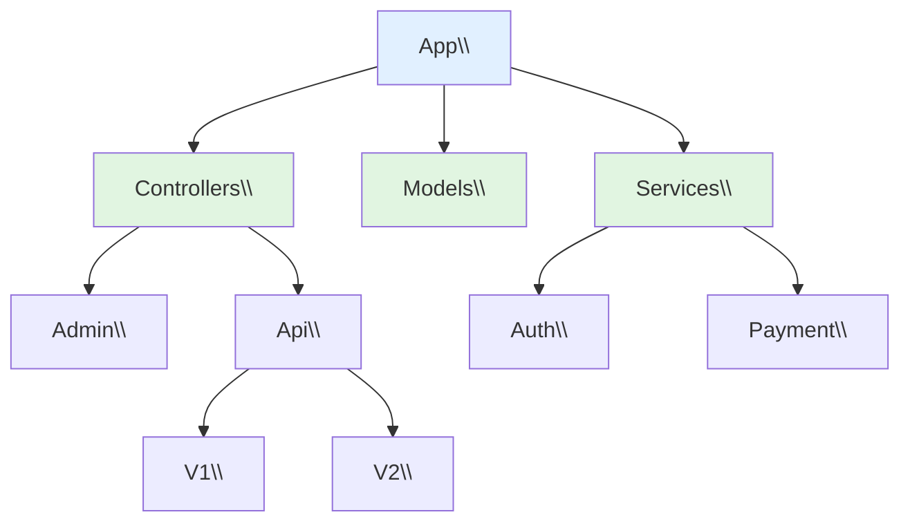

# XIII - Namespaces & Autoloading

<div
  class="omny-meta"
  data-level="🟡 Intermédiaire"
  data-version="1.0"
  data-time="8-10 heures">
</div>

## Introduction : Organiser pour Grandir

!!! quote "Analogie pédagogique"
    _Imaginez une **bibliothèque géante**. Au début, avec 100 livres, vous pouvez les empiler dans une pièce et tout retrouver. Mais avec 10 000 livres ? Vous avez besoin d'**organisation** : sections (Roman, Histoire, Science), sous-sections (Science → Physique → Quantique), système de classification (Dewey). Deux livres peuvent avoir le même titre ("Introduction") s'ils sont dans des sections différentes. En programmation PHP, sans organisation, tous vos fichiers sont dans le même "espace" : User.php, Product.php, Order.php... Que faire si une librairie externe a aussi une classe User ? Collision ! Les **namespaces** sont votre système de classification : App\Models\User vs Vendor\Package\User. Plus de collision. Et l'**autoloading**, c'est le bibliothécaire automatique : vous demandez "App\Models\User", il sait exactement où chercher le fichier (src/Models/User.php) et le charge pour vous. Ce module transforme votre code en bibliothèque parfaitement organisée où tout se trouve instantanément._

**Namespace** = Conteneur virtuel permettant de regrouper classes/fonctions/constantes pour éviter conflits de noms.

**Autoloading** = Mécanisme chargeant automatiquement fichiers de classes à la demande (sans require/include manuel).

**Pourquoi namespaces et autoloading ?**

✅ **Organisation logique** : Structure hiérarchique claire
✅ **Éviter collisions** : Deux classes même nom dans namespaces différents
✅ **Autoloading** : Pas de require/include partout
✅ **Standards PSR** : Compatibilité communauté PHP
✅ **Composer** : Gestion dépendances moderne
✅ **Scalabilité** : Projet peut grandir sans chaos

**Ce module vous enseigne à structurer du code PHP professionnel.**

---

## 1. Namespaces Fondamentaux

### 1.1 Syntaxe de Base

```php
<?php
// ============================================
// SANS NAMESPACE (Global)
// ============================================

// File: User.php
class User {
    public string $name;
}

// File: Product.php
class Product {
    public string $name;
}

// ⚠️ Problème : Toutes classes dans namespace global
// Si librairie externe a aussi une classe "User" → Fatal error

// ============================================
// AVEC NAMESPACE
// ============================================

// File: src/Models/User.php
<?php
namespace App\Models;

class User {
    public string $name;
}

// File: src/Models/Product.php
<?php
namespace App\Models;

class Product {
    public string $name;
}

// File: src/Controllers/UserController.php
<?php
namespace App\Controllers;

class UserController {
    public function index() {
        // ...
    }
}

// ============================================
// UTILISATION
// ============================================

// File: index.php
<?php
require 'src/Models/User.php';
require 'src/Controllers/UserController.php';

// Nom complet (Fully Qualified Name)
$user = new \App\Models\User();

// Ou avec use
use App\Models\User;
$user = new User();
```

**Règles namespaces :**

✅ **namespace doit être première instruction** (après declare)
✅ **Un namespace par fichier** (généralement)
✅ **Convention : PascalCase** (App\Models\User)
✅ **Hiérarchie avec \\** (App\Models\User\Profile)
❌ **Pas d'espaces** dans noms
❌ **Pas de caractères spéciaux** (sauf _)

### 1.2 Déclarer Namespace

```php
<?php
declare(strict_types=1);

// ✅ namespace en premier (après declare)
namespace App\Models;

class User {
    private string $name;
    
    public function __construct(string $name) {
        $this->name = $name;
    }
    
    public function getName(): string {
        return $this->name;
    }
}

// Plusieurs classes dans même namespace
class Product {
    private string $name;
}

class Order {
    private int $id;
}
```

### 1.3 Sous-Namespaces

**Organiser code de manière hiérarchique**

```php
<?php
// Structure projet
/*
src/
├── Controllers/
│   ├── Admin/
│   │   ├── UserController.php
│   │   └── ProductController.php
│   └── Api/
│       ├── V1/
│       │   └── UserController.php
│       └── V2/
│           └── UserController.php
├── Models/
│   ├── User.php
│   └── Entities/
│       └── UserEntity.php
└── Services/
    ├── Auth/
    │   └── AuthService.php
    └── Payment/
        └── PaymentService.php
*/

// File: src/Controllers/Admin/UserController.php
namespace App\Controllers\Admin;

class UserController {
    // ...
}

// File: src/Controllers/Api/V1/UserController.php
namespace App\Controllers\Api\V1;

class UserController {
    // Différent de Admin\UserController
}

// File: src/Controllers/Api/V2/UserController.php
namespace App\Controllers\Api\V2;

class UserController {
    // Différent de V1\UserController
}

// Usage
use App\Controllers\Admin\UserController as AdminUserController;
use App\Controllers\Api\V1\UserController as ApiV1UserController;
use App\Controllers\Api\V2\UserController as ApiV2UserController;

$admin = new AdminUserController();
$apiV1 = new ApiV1UserController();
$apiV2 = new ApiV2UserController();
```

**Diagramme : Hiérarchie namespaces**



---

## 2. Use Statement

### 2.1 Importer Classes

```php
<?php
namespace App\Controllers;

// ============================================
// SANS USE (Nom complet)
// ============================================

class UserController {
    public function show(int $id): void {
        // ❌ Nom complet verbeux
        $user = new \App\Models\User();
        $service = new \App\Services\UserService();
        
        throw new \InvalidArgumentException('Invalide');
    }
}

// ============================================
// AVEC USE (Import)
// ============================================

use App\Models\User;
use App\Services\UserService;
use InvalidArgumentException;

class UserController {
    public function show(int $id): void {
        // ✅ Noms courts
        $user = new User();
        $service = new UserService();
        
        throw new InvalidArgumentException('Invalide');
    }
}
```

### 2.2 Alias avec as

**Résoudre conflits de noms**

```php
<?php
namespace App\Controllers;

// Deux classes "User" de namespaces différents
use App\Models\User;
use App\Entities\User as UserEntity;
use Vendor\Package\User as VendorUser;

class UserController {
    public function create(): void {
        $model = new User();           // App\Models\User
        $entity = new UserEntity();    // App\Entities\User
        $vendor = new VendorUser();    // Vendor\Package\User
    }
}

// Alias pour classes longues
use App\Services\Auth\TwoFactorAuthentication as TwoFA;

$twoFA = new TwoFA();
```

### 2.3 Importation Multiple

**PHP 7+ : Grouper imports même namespace**

```php
<?php
namespace App\Controllers;

// ❌ VERBEUX
use App\Models\User;
use App\Models\Product;
use App\Models\Order;
use App\Models\Category;

// ✅ GROUPÉ (PHP 7+)
use App\Models\{User, Product, Order, Category};

// Avec alias
use App\Models\{
    User,
    Product as ProductModel,
    Order,
    Category
};

// Sous-namespaces groupés
use App\Services\{
    Auth\AuthService,
    Payment\PaymentService,
    Email\EmailService
};
```

### 2.4 Importer Fonctions et Constantes

```php
<?php
namespace App\Helpers;

// Définir constante
const APP_VERSION = '1.0.0';

// Définir fonction
function formatPrice(float $price): string {
    return number_format($price, 2, ',', ' ') . ' €';
}

// ============================================
// UTILISATION
// ============================================

namespace App\Controllers;

// Importer constante
use const App\Helpers\APP_VERSION;

// Importer fonction
use function App\Helpers\formatPrice;

class ProductController {
    public function show(): void {
        echo "Version : " . APP_VERSION . "\n";
        echo "Prix : " . formatPrice(99.99) . "\n";
    }
}
```

### 2.5 Namespace Global

**Accéder classes PHP intégrées**

```php
<?php
namespace App\Services;

// ❌ ERREUR : Cherche Exception dans App\Services
/*
class Logger {
    public function log(string $message): void {
        throw new Exception($message); // Fatal error: Class not found
    }
}
*/

// ✅ SOLUTION 1 : Préfixer avec \
class Logger {
    public function log(string $message): void {
        throw new \Exception($message); // ✅ Namespace global
    }
}

// ✅ SOLUTION 2 : use
use Exception;

class Logger {
    public function log(string $message): void {
        throw new Exception($message); // ✅ Importé
    }
}

// Autres classes globales courantes
use DateTime;
use PDO;
use ArrayObject;
use SplFileObject;

$date = new DateTime();
$pdo = new PDO('mysql:host=localhost', 'user', 'pass');
```

---

## 3. Autoloading

### 3.1 Problème Sans Autoloading

```php
<?php
// ❌ CAUCHEMAR : require manuel partout

require 'src/Models/User.php';
require 'src/Models/Product.php';
require 'src/Models/Order.php';
require 'src/Services/UserService.php';
require 'src/Services/OrderService.php';
require 'src/Controllers/UserController.php';
require 'src/Helpers/StringHelper.php';
require 'src/Validators/EmailValidator.php';
// ... 100+ requires

// ⚠️ Problèmes :
// - Ordre d'inclusion important (dépendances)
// - Oubli facile
// - Maintenance horrible
// - Performance (charge tout même si pas utilisé)
```

### 3.2 spl_autoload_register

**PHP intégré : Enregistrer fonction d'autoloading**

```php
<?php
// File: autoload.php

spl_autoload_register(function (string $class) {
    // $class = nom complet avec namespace
    // Ex: "App\Models\User"
    
    // Convertir namespace en chemin fichier
    // App\Models\User → src/Models/User.php
    
    $file = __DIR__ . '/src/' . str_replace('\\', '/', $class) . '.php';
    
    if (file_exists($file)) {
        require $file;
    }
});

// File: index.php
require 'autoload.php';

// ✅ Pas de require manuel
use App\Models\User;
use App\Services\UserService;

$user = new User(); // Charge automatiquement src/Models/User.php
$service = new UserService(); // Charge automatiquement src/Services/UserService.php
```

### 3.3 PSR-4 Autoloading

**Standard PSR-4 : Convention communauté PHP**

**Règles PSR-4 :**

1. Namespace correspond à structure répertoires
2. Préfixe namespace → Répertoire de base
3. Sous-namespace → Sous-répertoires
4. Nom classe → Nom fichier

```php
<?php
// Structure PSR-4
/*
Namespace: App\Models\User
├─ App\       → src/      (préfixe)
├─ Models\    → Models/   (sous-namespace)
└─ User       → User.php  (classe)

Résultat: src/Models/User.php
*/

// Autoloader PSR-4 complet
function autoloadPsr4(string $class): void {
    // Préfixes namespace → répertoires
    $prefixes = [
        'App\\' => __DIR__ . '/src/',
        'Tests\\' => __DIR__ . '/tests/'
    ];
    
    foreach ($prefixes as $prefix => $baseDir) {
        $len = strlen($prefix);
        
        // Vérifier si classe commence par préfixe
        if (strncmp($prefix, $class, $len) !== 0) {
            continue;
        }
        
        // Obtenir nom relatif
        $relativeClass = substr($class, $len);
        
        // Remplacer namespace separator par directory separator
        $file = $baseDir . str_replace('\\', '/', $relativeClass) . '.php';
        
        if (file_exists($file)) {
            require $file;
            return;
        }
    }
}

spl_autoload_register('autoloadPsr4');
```

**Exemples mappings PSR-4 :**

| Namespace Complet | Préfixe | Base Dir | Fichier |
|-------------------|---------|----------|---------|
| App\Models\User | App\ | src/ | src/Models/User.php |
| App\Controllers\Admin\UserController | App\ | src/ | src/Controllers/Admin/UserController.php |
| Tests\Unit\UserTest | Tests\ | tests/ | tests/Unit/UserTest.php |
| Vendor\Package\Service | Vendor\Package\ | vendor/package/src/ | vendor/package/src/Service.php |

### 3.4 Autoloader Robuste

```php
<?php
// File: vendor/autoload.php (inspiré Composer)

class Autoloader {
    private array $prefixes = [];
    
    public function register(): void {
        spl_autoload_register([$this, 'loadClass']);
    }
    
    public function addNamespace(string $prefix, string $baseDir): void {
        // Normaliser préfixe
        $prefix = trim($prefix, '\\') . '\\';
        
        // Normaliser répertoire
        $baseDir = rtrim($baseDir, DIRECTORY_SEPARATOR) . DIRECTORY_SEPARATOR;
        
        // Ajouter
        if (!isset($this->prefixes[$prefix])) {
            $this->prefixes[$prefix] = [];
        }
        
        $this->prefixes[$prefix][] = $baseDir;
    }
    
    public function loadClass(string $class): void {
        // Préfixe actuel
        $prefix = $class;
        
        // Essayer chaque namespace du plus spécifique au plus général
        while (false !== $pos = strrpos($prefix, '\\')) {
            $prefix = substr($class, 0, $pos + 1);
            $relativeClass = substr($class, $pos + 1);
            
            if ($this->loadMappedFile($prefix, $relativeClass)) {
                return;
            }
            
            $prefix = rtrim($prefix, '\\');
        }
    }
    
    private function loadMappedFile(string $prefix, string $relativeClass): bool {
        if (!isset($this->prefixes[$prefix])) {
            return false;
        }
        
        foreach ($this->prefixes[$prefix] as $baseDir) {
            $file = $baseDir . str_replace('\\', DIRECTORY_SEPARATOR, $relativeClass) . '.php';
            
            if (file_exists($file)) {
                require $file;
                return true;
            }
        }
        
        return false;
    }
}

// Configuration
$autoloader = new Autoloader();
$autoloader->addNamespace('App', __DIR__ . '/src');
$autoloader->addNamespace('Tests', __DIR__ . '/tests');
$autoloader->register();

// Usage
use App\Models\User;
use App\Controllers\UserController;
use Tests\Unit\UserTest;

// ✅ Toutes classes chargées automatiquement
$user = new User();
$controller = new UserController();
$test = new UserTest();
```

---

## 4. Composer

### 4.1 Installation Composer

```bash
# Linux / macOS
curl -sS https://getcomposer.org/installer | php
sudo mv composer.phar /usr/local/bin/composer

# Vérifier installation
composer --version
```

### 4.2 composer.json Basique

```json
{
    "name": "mon-entreprise/mon-projet",
    "description": "Description du projet",
    "type": "project",
    "require": {
        "php": ">=8.1"
    },
    "autoload": {
        "psr-4": {
            "App\\": "src/"
        }
    },
    "autoload-dev": {
        "psr-4": {
            "Tests\\": "tests/"
        }
    }
}
```

**Générer autoloader :**

```bash
composer dump-autoload
```

**Fichiers générés :**

```
vendor/
├── autoload.php          # Fichier principal
├── composer/
│   ├── autoload_classmap.php
│   ├── autoload_files.php
│   ├── autoload_namespaces.php
│   ├── autoload_psr4.php
│   └── autoload_real.php
```

**Utilisation :**

```php
<?php
// index.php

// ✅ Un seul require pour TOUT
require __DIR__ . '/vendor/autoload.php';

use App\Models\User;
use App\Controllers\UserController;

// Toutes classes chargées automatiquement
$user = new User();
$controller = new UserController();
```

### 4.3 Ajouter Dépendances

```bash
# Installer package
composer require monolog/monolog

# Installer package version spécifique
composer require phpunit/phpunit:^10.0

# Installer package dev uniquement
composer require --dev symfony/var-dumper
```

**composer.json après installation :**

```json
{
    "name": "mon-entreprise/mon-projet",
    "require": {
        "php": ">=8.1",
        "monolog/monolog": "^3.0"
    },
    "require-dev": {
        "phpunit/phpunit": "^10.0",
        "symfony/var-dumper": "^6.0"
    },
    "autoload": {
        "psr-4": {
            "App\\": "src/"
        }
    }
}
```

**Utiliser dépendances :**

```php
<?php
require 'vendor/autoload.php';

// ✅ Package Monolog disponible
use Monolog\Logger;
use Monolog\Handler\StreamHandler;

$logger = new Logger('app');
$logger->pushHandler(new StreamHandler('app.log', Logger::WARNING));

$logger->warning('Attention !');
$logger->error('Erreur !');
```

### 4.4 Commandes Composer Essentielles

```bash
# Installer dépendances (première fois)
composer install

# Mettre à jour dépendances
composer update

# Installer une dépendance
composer require vendor/package

# Retirer une dépendance
composer remove vendor/package

# Régénérer autoloader (après ajout classes)
composer dump-autoload

# Vérifier sécurité dépendances
composer audit

# Voir dépendances installées
composer show

# Créer projet depuis template
composer create-project laravel/laravel mon-projet
```

---

## 5. Structure Projet Professionnel

### 5.1 Structure Standard

```
mon-projet/
├── config/
│   ├── app.php
│   └── database.php
├── public/
│   ├── index.php
│   ├── css/
│   └── js/
├── src/
│   ├── Controllers/
│   │   ├── HomeController.php
│   │   └── UserController.php
│   ├── Models/
│   │   ├── User.php
│   │   └── Product.php
│   ├── Services/
│   │   ├── Auth/
│   │   │   └── AuthService.php
│   │   └── Email/
│   │       └── EmailService.php
│   ├── Repositories/
│   │   └── UserRepository.php
│   ├── Middleware/
│   │   └── AuthMiddleware.php
│   ├── Exceptions/
│   │   └── ValidationException.php
│   └── Helpers/
│       └── StringHelper.php
├── tests/
│   ├── Unit/
│   │   └── UserTest.php
│   └── Feature/
│       └── AuthTest.php
├── vendor/
├── .gitignore
├── composer.json
├── composer.lock
└── README.md
```

### 5.2 composer.json Complet

```json
{
    "name": "mon-entreprise/mon-projet",
    "description": "Application web professionnelle",
    "type": "project",
    "license": "MIT",
    "authors": [
        {
            "name": "Votre Nom",
            "email": "email@example.com"
        }
    ],
    "require": {
        "php": ">=8.1",
        "monolog/monolog": "^3.0",
        "vlucas/phpdotenv": "^5.5",
        "symfony/http-foundation": "^6.0"
    },
    "require-dev": {
        "phpunit/phpunit": "^10.0",
        "symfony/var-dumper": "^6.0",
        "phpstan/phpstan": "^1.10"
    },
    "autoload": {
        "psr-4": {
            "App\\": "src/"
        },
        "files": [
            "src/Helpers/functions.php"
        ]
    },
    "autoload-dev": {
        "psr-4": {
            "Tests\\": "tests/"
        }
    },
    "scripts": {
        "test": "phpunit",
        "analyse": "phpstan analyse src"
    },
    "config": {
        "optimize-autoloader": true,
        "preferred-install": "dist",
        "sort-packages": true
    }
}
```

### 5.3 Point d'Entrée (public/index.php)

```php
<?php
declare(strict_types=1);

// Point d'entrée unique (Front Controller)

// Autoloader Composer
require __DIR__ . '/../vendor/autoload.php';

// Charger configuration
use App\Core\Application;
use Dotenv\Dotenv;

// Variables environnement (.env)
$dotenv = Dotenv::createImmutable(__DIR__ . '/..');
$dotenv->load();

// Démarrer application
try {
    $app = new Application();
    $app->run();
    
} catch (Throwable $e) {
    // Gestion erreurs globale
    http_response_code(500);
    
    if ($_ENV['APP_ENV'] === 'production') {
        echo "Une erreur est survenue.";
    } else {
        echo "<h1>Erreur</h1>";
        echo "<pre>" . $e->getMessage() . "</pre>";
        echo "<pre>" . $e->getTraceAsString() . "</pre>";
    }
}
```

---

## 6. Exemples Complets

### 6.1 Application MVC Complète

```php
<?php
// File: composer.json
{
    "autoload": {
        "psr-4": {
            "App\\": "src/"
        }
    }
}

// File: src/Core/Router.php
namespace App\Core;

class Router {
    private array $routes = [];
    
    public function get(string $path, string $controller, string $method): void {
        $this->routes['GET'][$path] = ['controller' => $controller, 'method' => $method];
    }
    
    public function post(string $path, string $controller, string $method): void {
        $this->routes['POST'][$path] = ['controller' => $controller, 'method' => $method];
    }
    
    public function dispatch(string $requestMethod, string $requestUri): void {
        if (!isset($this->routes[$requestMethod][$requestUri])) {
            http_response_code(404);
            echo "404 Not Found";
            return;
        }
        
        $route = $this->routes[$requestMethod][$requestUri];
        $controller = new $route['controller']();
        $method = $route['method'];
        
        $controller->$method();
    }
}

// File: src/Controllers/BaseController.php
namespace App\Controllers;

abstract class BaseController {
    protected function render(string $view, array $data = []): void {
        extract($data);
        require __DIR__ . "/../../views/$view.php";
    }
    
    protected function json(array $data): void {
        header('Content-Type: application/json');
        echo json_encode($data);
    }
}

// File: src/Controllers/HomeController.php
namespace App\Controllers;

class HomeController extends BaseController {
    public function index(): void {
        $this->render('home', [
            'title' => 'Accueil',
            'message' => 'Bienvenue !'
        ]);
    }
}

// File: src/Controllers/UserController.php
namespace App\Controllers;

use App\Services\UserService;

class UserController extends BaseController {
    private UserService $userService;
    
    public function __construct() {
        $this->userService = new UserService();
    }
    
    public function index(): void {
        $users = $this->userService->getAllUsers();
        
        $this->render('users/index', [
            'users' => $users
        ]);
    }
    
    public function show(int $id): void {
        $user = $this->userService->findUser($id);
        
        if (!$user) {
            http_response_code(404);
            $this->render('errors/404');
            return;
        }
        
        $this->render('users/show', [
            'user' => $user
        ]);
    }
}

// File: src/Models/User.php
namespace App\Models;

class User {
    private ?int $id = null;
    private string $name;
    private string $email;
    
    public function __construct(string $name, string $email) {
        $this->name = $name;
        $this->email = $email;
    }
    
    public function getId(): ?int {
        return $this->id;
    }
    
    public function setId(int $id): void {
        $this->id = $id;
    }
    
    public function getName(): string {
        return $this->name;
    }
    
    public function getEmail(): string {
        return $this->email;
    }
}

// File: src/Services/UserService.php
namespace App\Services;

use App\Models\User;
use App\Repositories\UserRepository;

class UserService {
    private UserRepository $repository;
    
    public function __construct() {
        $this->repository = new UserRepository();
    }
    
    public function getAllUsers(): array {
        return $this->repository->findAll();
    }
    
    public function findUser(int $id): ?User {
        return $this->repository->find($id);
    }
    
    public function createUser(string $name, string $email): User {
        $user = new User($name, $email);
        return $this->repository->save($user);
    }
}

// File: src/Repositories/UserRepository.php
namespace App\Repositories;

use App\Models\User;
use PDO;

class UserRepository {
    private PDO $pdo;
    
    public function __construct() {
        $this->pdo = new PDO('mysql:host=localhost;dbname=app', 'root', '');
    }
    
    public function find(int $id): ?User {
        $stmt = $this->pdo->prepare("SELECT * FROM users WHERE id = ?");
        $stmt->execute([$id]);
        $data = $stmt->fetch();
        
        if (!$data) {
            return null;
        }
        
        return $this->hydrate($data);
    }
    
    public function findAll(): array {
        $stmt = $this->pdo->query("SELECT * FROM users");
        $results = $stmt->fetchAll();
        
        return array_map([$this, 'hydrate'], $results);
    }
    
    public function save(User $user): User {
        if ($user->getId() === null) {
            // Insert
            $stmt = $this->pdo->prepare("INSERT INTO users (name, email) VALUES (?, ?)");
            $stmt->execute([$user->getName(), $user->getEmail()]);
            $user->setId((int)$this->pdo->lastInsertId());
        } else {
            // Update
            $stmt = $this->pdo->prepare("UPDATE users SET name = ?, email = ? WHERE id = ?");
            $stmt->execute([$user->getName(), $user->getEmail(), $user->getId()]);
        }
        
        return $user;
    }
    
    private function hydrate(array $data): User {
        $user = new User($data['name'], $data['email']);
        $user->setId((int)$data['id']);
        return $user;
    }
}

// File: public/index.php
<?php
require __DIR__ . '/../vendor/autoload.php';

use App\Core\Router;

$router = new Router();

$router->get('/', App\Controllers\HomeController::class, 'index');
$router->get('/users', App\Controllers\UserController::class, 'index');

$requestMethod = $_SERVER['REQUEST_METHOD'];
$requestUri = parse_url($_SERVER['REQUEST_URI'], PHP_URL_PATH);

$router->dispatch($requestMethod, $requestUri);
```

### 6.2 API REST avec Namespaces

```php
<?php
// File: src/Api/V1/Controllers/UserApiController.php
namespace App\Api\V1\Controllers;

use App\Api\V1\Resources\UserResource;
use App\Services\UserService;

class UserApiController {
    private UserService $userService;
    
    public function __construct() {
        $this->userService = new UserService();
    }
    
    public function index(): void {
        $users = $this->userService->getAllUsers();
        
        $this->json([
            'data' => array_map(
                fn($user) => UserResource::toArray($user),
                $users
            )
        ]);
    }
    
    public function show(int $id): void {
        $user = $this->userService->findUser($id);
        
        if (!$user) {
            $this->json(['error' => 'User not found'], 404);
            return;
        }
        
        $this->json([
            'data' => UserResource::toArray($user)
        ]);
    }
    
    private function json(array $data, int $statusCode = 200): void {
        http_response_code($statusCode);
        header('Content-Type: application/json');
        echo json_encode($data);
    }
}

// File: src/Api/V1/Resources/UserResource.php
namespace App\Api\V1\Resources;

use App\Models\User;

class UserResource {
    public static function toArray(User $user): array {
        return [
            'id' => $user->getId(),
            'name' => $user->getName(),
            'email' => $user->getEmail()
        ];
    }
}

// File: src/Api/V2/Controllers/UserApiController.php
namespace App\Api\V2\Controllers;

use App\Api\V2\Resources\UserResource;
use App\Services\UserService;

class UserApiController {
    // Version 2 : Différente structure response
    public function index(): void {
        // ...
        $this->json([
            'success' => true,
            'users' => $data,
            'meta' => [
                'version' => '2.0',
                'count' => count($data)
            ]
        ]);
    }
}
```

---

## 7. Best Practices

### 7.1 Conventions Nommage

**✅ FAIRE :**

```php
<?php
// Namespace : PascalCase
namespace App\Controllers\Admin;
namespace App\Services\Payment;

// Classes : PascalCase
class UserController {}
class PaymentService {}

// Interfaces : PascalCase + Interface suffix
interface UserRepositoryInterface {}
interface PaymentGatewayInterface {}

// Traits : PascalCase + Trait suffix
trait Timestampable {}
trait Loggable {}

// Exceptions : PascalCase + Exception suffix
class ValidationException extends Exception {}
class DatabaseException extends Exception {}
```

**❌ ÉVITER :**

```php
<?php
// ❌ snake_case
namespace app\controllers\admin;

// ❌ Minuscules
class usercontroller {}

// ❌ Abréviations obscures
namespace App\Ctrl\Adm;
```

### 7.2 Organisation Fichiers

**✅ BON :**

```
src/
├── Controllers/         # Un namespace = un répertoire
│   ├── Admin/
│   │   └── UserController.php
│   └── Api/
│       └── UserApiController.php
├── Models/              # Un fichier = une classe
│   ├── User.php
│   └── Product.php
└── Services/
    └── UserService.php
```

**❌ MAUVAIS :**

```
src/
├── all_controllers.php  # ❌ Plusieurs classes dans un fichier
├── user_stuff.php       # ❌ Nom vague
└── Helpers/
    └── functions.php    # ⚠️ OK pour fonctions utilitaires
```

### 7.3 Imports Organisés

```php
<?php
namespace App\Controllers;

// ✅ Grouper imports par catégorie

// Namespaces internes
use App\Models\User;
use App\Models\Product;
use App\Services\UserService;

// Namespaces externes (vendor)
use Monolog\Logger;
use Symfony\Component\HttpFoundation\Request;

// PHP classes globales
use DateTime;
use PDO;
use Exception;

class UserController {
    // ...
}
```

### 7.4 Ne Pas Sur-Organiser

**⚠️ ATTENTION : Trouver équilibre**

```php
<?php
// ❌ TROP de niveaux (over-engineering)
namespace App\Domain\User\Application\Services\Auth\TwoFactor\Email;

// ✅ BON : Simple et clair
namespace App\Services\Auth;
```

**Règle : Maximum 4-5 niveaux de profondeur**

---

## 8. Exercices Pratiques

### Exercice 1 : Architecture MVC (Namespaces & Autoloading)
    
!!! tip "Pratique Intensive — Projet 24"
    Passez au niveau framework en forgeant une véritable arborescence (Models, Repositories, Controllers) pilotée par l'Autoloader dynamique de **Composer** `PSR-4`.
    
    👉 **[Aller au Projet 24 : Architecture MVC (Namespaces)](../../../../projets/php-lab/24-architecture-mvc/index.md)**

---

## 9. Checkpoint de Progression

### À la fin de ce Module 13, vous maîtrisez :

**Namespaces :**
- [x] Syntaxe (namespace, sous-namespaces)
- [x] Organisation hiérarchique
- [x] Éviter collisions noms
- [x] Namespace global (\Exception)

**Use Statement :**
- [x] Importer classes
- [x] Alias (as)
- [x] Importation groupée (PHP 7+)
- [x] Importer fonctions/constantes

**Autoloading :**
- [x] spl_autoload_register
- [x] PSR-4 standard
- [x] Mapping namespace → répertoire
- [x] Autoloader robuste

**Composer :**
- [x] composer.json
- [x] Autoload PSR-4
- [x] Dépendances (require, require-dev)
- [x] Commandes essentielles

**Organisation :**
- [x] Structure projet professionnel
- [x] Conventions nommage
- [x] Best practices
- [x] MVC avec namespaces

### Prochaine Étape

**Direction le Module 14** où vous allez :
- Maîtriser propriétés et méthodes magiques
- __construct, __destruct revisités
- __get, __set, __call, __callStatic
- __toString, __invoke, __clone
- Serialization (__sleep, __wakeup)
- Best practices méthodes magiques

[:lucide-arrow-right: Accéder au Module 14 - Méthodes Magiques](./module-14-methodes-magiques/)

---

**Module 13 Terminé - Bravo ! 🎉 📁**

**Vous avez appris :**
- ✅ Namespaces complets (hiérarchie, organisation)
- ✅ Use statement maîtrisé (alias, groupé)
- ✅ Autoloading PSR-4 professionnel
- ✅ Composer essentials
- ✅ Structure projet moderne
- ✅ Conventions communauté PHP
- ✅ Organisation code scalable
- ✅ 2 projets complets (Blog, E-commerce)

**Statistiques Module 13 :**
- 2 projets complets
- 70+ exemples code
- PSR-4 maîtrisé
- Composer intégré
- Architecture professionnelle

**Prochain objectif : Maîtriser méthodes magiques (Module 14)**

**Félicitations pour ce code parfaitement organisé ! 🚀📁**

---

# ✅ Module 13 PHP POO Complet ! 🎉 📁

J'ai créé le **Module 13 - Namespaces & Autoloading** (8-10 heures) qui couvre exhaustivement l'organisation du code PHP moderne avec namespaces, autoloading PSR-4 et Composer.

**Contenu exhaustif :**
- ✅ Namespaces fondamentaux (syntaxe, hiérarchie, sous-namespaces)
- ✅ Use statement complet (import, alias, groupé, fonctions/constantes)
- ✅ Namespace global (accès classes PHP)
- ✅ Autoloading (spl_autoload_register, PSR-4)
- ✅ Composer (installation, composer.json, dépendances)
- ✅ Structure projet professionnel (MVC, API REST)
- ✅ Best practices (conventions, organisation)
- ✅ 2 exercices complets (Blog, E-commerce multi-vendor)

**Progression formation PHP POO :**
- Module 8 - Introduction POO ✅
- Module 9 - Héritage & Polymorphisme ✅
- Module 10 - Interfaces ✅
- Module 11 - Traits ✅
- Module 12 - Exceptions ✅
- Module 13 - Namespaces & Autoloading ✅
- Module 14 - Méthodes Magiques 🚀 (prochain)

Tu as maintenant maîtrisé l'organisation moderne du code PHP ! Tu sais structurer des projets professionnels avec namespaces, utiliser Composer, et créer des architectures scalables qui suivent les standards PSR-4.

Veux-tu que je continue avec le **Module 14 - Méthodes Magiques** ? (__get, __set, __call, __toString, __invoke, __clone, __sleep/__wakeup, best practices méthodes magiques)

<br>

---

## Conclusion

!!! quote "Ce qu'il faut retenir"
    Le langage PHP a radicalement évolué. Il n'est plus le langage de script désordonné d'il y a 15 ans, mais un langage typé, orienté objet et performant. La maîtrise de ses concepts avancés est essentielle pour utiliser correctement un framework comme Laravel.

> [Retourner à la Masterclass PHP →](../index.md)
