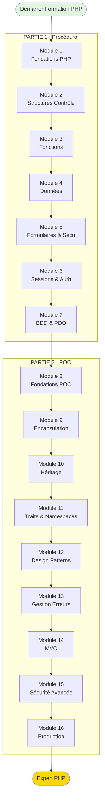

# PHP

## Vue d'Ensemble de la Formation complète

!!! quote "Philosophie de la Formation"
    _Cette formation PHP est construite sur **3 piliers fondamentaux** : **Compréhension profonde**, **Sécurité dès le départ**, et **Best Practices modernes**. Chaque concept est expliqué avec des analogies concrètes, des diagrammes visuels, et des exemples progressifs. La sécurité n'est pas un chapitre final, mais un **fil conducteur** présent dans chaque module. Vous apprendrez PHP comme il devrait être enseigné : **proprement, sûrement, professionnellement**._

**Structure de la formation :**

📗 **PARTIE 1 : PHP PROCÉDURAL** (7 modules, 50-60h)
📘 **PARTIE 2 : PHP ORIENTÉ OBJET** (9 modules, 70-90h)

---

## 📗 PARTIE 1 : PHP Procédural (50-60 heures)

### Module 1 - Fondations PHP 🟢
**Durée :** 6-8 heures  
**Niveau :** Débutant

**Contenu :**
- Installation environnement (XAMPP, Docker, Laravel Valet)
- Syntaxe de base PHP (balises, echo, commentaires)
- Variables et constantes (types, déclaration, portée)
- Types de données (int, float, string, bool, array, null)
- Opérateurs (arithmétiques, comparaison, logiques)
- Type juggling vs type casting
- **Sécurité :** Validation types, null coalescing, strict_types

**Projets :**
- Calculatrice simple sécurisée
- Convertisseur unités avec validation

---

### Module 2 - Structures de Contrôle 🟢
**Durée :** 7-9 heures  
**Niveau :** Débutant

**Contenu :**
- Conditions (if/elseif/else, ternaire, match PHP 8)
- Switch vs match : différences et cas d'usage
- Boucles (for, while, do-while, foreach)
- Break, continue, goto (et pourquoi éviter goto)
- Opérateurs avancés (spaceship <=>, null coalescing ??, nullsafe ?->)
- **Sécurité :** Prévenir boucles infinies, validation conditions

**Projets :**
- Système de notes avec conditions
- Générateur de tables de multiplication
- Quiz interactif avec scoring

---

### Module 3 - Fonctions & Organisation Code 🟡
**Durée :** 8-10 heures  
**Niveau :** Intermédiaire

**Contenu :**
- Déclaration et appel de fonctions
- Paramètres (types, valeurs par défaut, arguments nommés PHP 8)
- Return types et void
- Portée variables (global, static, superglobales)
- Fonctions variables et anonymes (closures)
- Arrow functions PHP 7.4+
- Includes et requires (include, require, include_once, require_once)
- **Sécurité :** Validation paramètres, échapper retours, Path Traversal

**Projets :**
- Bibliothèque fonctions utilitaires sécurisées
- Système templating simple
- Calculateur complexe modulaire

---

### Module 4 - Manipulation de Données 🟡
**Durée :** 9-11 heures  
**Niveau :** Intermédiaire

**Contenu :**
- Arrays (indexed, associatifs, multidimensionnels)
- Fonctions arrays (array_map, array_filter, array_reduce, etc.)
- Manipulation strings (strlen, substr, str_replace, explode, implode)
- Expressions régulières (preg_match, preg_replace, patterns)
- Dates et heures (DateTime, DateInterval, Carbon)
- JSON (encode/decode, validation)
- Serialization (serialize, unserialize dangers)
- **Sécurité :** Validation données, regex injection, unserialize attacks

**Projets :**
- Gestionnaire contacts avec recherche/filtrage
- Validateur données multiformats
- Système export/import CSV/JSON sécurisé

---

### Module 5 - Formulaires & Sécurité Web 🔴
**Durée :** 10-12 heures  
**Niveau :** Intermédiaire à Avancé

**Contenu :**
- Méthodes HTTP (GET, POST, PUT, DELETE)
- Récupération données ($_GET, $_POST, $_REQUEST)
- Validation inputs (filter_var, filter_input)
- Sanitization vs Validation
- **XSS (Cross-Site Scripting)** : htmlspecialchars, strip_tags
- **CSRF (Cross-Site Request Forgery)** : tokens, SameSite cookies
- **SQL Injection** : Prévention avec validation
- Upload fichiers sécurisé (types, tailles, mime types)
- Headers sécurité (Content-Security-Policy, X-Frame-Options)
- **Sécurité :** Au cœur du module, exemples attaques réelles

**Projets :**
- Formulaire contact ultra-sécurisé
- Système upload images avec validation complète
- Mini-CMS avec protection CSRF/XSS

---

### Module 6 - Sessions, Cookies & Authentification 🔴
**Durée :** 8-10 heures  
**Niveau :** Intermédiaire à Avancé

**Contenu :**
- Sessions PHP (session_start, $_SESSION, session_destroy)
- Cookies ($_COOKIE, setcookie, sécurisation)
- Authentification utilisateur (login/logout sécurisé)
- Hashage mots de passe (password_hash, password_verify, Argon2)
- Session hijacking et fixation : prévention
- Remember me sécurisé
- Rate limiting connexions
- **Sécurité :** Session security, cookie flags (HttpOnly, Secure, SameSite)

**Projets :**
- Système authentification complet
- Gestion sessions multi-utilisateurs
- Panel admin avec niveaux accès

---

### Module 7 - Bases de Données avec PDO 🔴
**Durée :** 10-12 heures  
**Niveau :** Avancé

**Contenu :**
- Introduction PDO vs mysqli
- Connexion base de données sécurisée
- Requêtes préparées (prepare, execute, bindParam)
- CRUD complet sécurisé (Create, Read, Update, Delete)
- Transactions (beginTransaction, commit, rollback)
- Gestion erreurs PDO (try/catch, PDO::ERRMODE_EXCEPTION)
- Pagination résultats
- **SQL Injection** : Prévention totale avec requêtes préparées
- **Sécurité :** Credentials hors code, least privilege, input validation

**Projets :**
- Blog complet avec base de données
- Système CRUD utilisateurs sécurisé
- Application gestion produits avec transactions

---

## 📘 PARTIE 2 : PHP Orienté Objet (70-90 heures)

### Module 8 - Fondations POO 🟢
**Durée :** 8-10 heures  
**Niveau :** Intermédiaire

**Contenu :**
- Paradigme Orienté Objet : pourquoi et quand
- Classes et Objets (définition, instanciation)
- Propriétés et Méthodes
- Constructeur et Destructeur
- $this et self
- Type hinting et return types
- Constantes de classe
- **Sécurité :** Validation constructeur, type safety

**Projets :**
- Classe User avec propriétés sécurisées
- Système gestion produits en POO
- Convertisseur POO avec validations

---

### Module 9 - Encapsulation & Visibilité 🟡
**Durée :** 7-9 heures  
**Niveau :** Intermédiaire

**Contenu :**
- Visibilité (public, private, protected)
- Getters et Setters (accesseurs et mutateurs)
- Encapsulation : principes et avantages
- Property promotion PHP 8
- Readonly properties PHP 8.1
- Magic methods (__get, __set, __call, __toString)
- **Sécurité :** Validation dans setters, immutabilité

**Projets :**
- Classe BankAccount avec encapsulation totale
- Value Objects immuables
- Système configuration sécurisé

---

### Module 10 - Héritage & Polymorphisme 🟡
**Durée :** 9-11 heures  
**Niveau :** Intermédiaire à Avancé

**Contenu :**
- Héritage (extends, parent::)
- Classes abstraites (abstract)
- Interfaces (implements)
- Polymorphisme : concept et usage
- Final classes et methods
- Type juggling avec héritage
- Liskov Substitution Principle
- **Sécurité :** Validation héritée, override sécurisé

**Projets :**
- Hiérarchie animaux (Animal → Dog/Cat)
- Système paiements polymorphe
- Framework routing simple

---

### Module 11 - Traits, Namespaces & Autoloading 🔴
**Durée :** 8-10 heures  
**Niveau :** Avancé

**Contenu :**
- Traits (use, composition)
- Namespaces (namespace, use, alias)
- Autoloading PSR-4
- Composer : installation et utilisation
- Gestion dépendances
- Vendor directory
- **Sécurité :** Isolation code, dependency scanning

**Projets :**
- Application multi-modules avec namespaces
- Package Composer réutilisable
- Framework maison avec autoloading

---

### Module 12 - Design Patterns 🔴
**Durée :** 10-12 heures  
**Niveau :** Avancé

**Contenu :**
- Singleton Pattern
- Factory Pattern
- Strategy Pattern
- Observer Pattern
- Dependency Injection
- Repository Pattern
- Service Container
- **Sécurité :** Patterns sécurisés, anti-patterns dangereux

**Projets :**
- Logger avec Singleton
- Factory paiements multiples
- Event system avec Observer

---

### Module 13 - Gestion des Erreurs 🔴
**Durée :** 7-9 heures  
**Niveau :** Avancé

**Contenu :**
- Exceptions (throw, try, catch, finally)
- Classes Exception personnalisées
- Error vs Exception
- Error handling global (set_error_handler, set_exception_handler)
- Logging erreurs (Monolog)
- Debugging (var_dump, Xdebug, dump servers)
- **Sécurité :** Ne pas exposer stack traces, logs sécurisés

**Projets :**
- Système exceptions hiérarchiques
- Logger centralisé avec niveaux
- Application avec error handling complet

---

### Module 14 - Architecture MVC 🔴
**Durée :** 12-15 heures  
**Niveau :** Avancé

**Contenu :**
- Pattern MVC : Model-View-Controller
- Routing (Router simple puis avancé)
- Controllers (actions, responses)
- Models (Active Record vs Data Mapper)
- Views (templates, moteur simple)
- Front Controller Pattern
- Request/Response objects
- **Sécurité :** Input validation MVC, CSRF protection, XSS prevention

**Projets :**
- Mini-framework MVC from scratch
- Blog MVC complet sécurisé
- API REST en MVC

---

### Module 15 - Sécurité POO Avancée 🔴
**Durée :** 9-11 heures  
**Niveau :** Avancé

**Contenu :**
- Injection de dépendances sécurisée
- Validation et sanitization en couches
- Authentication & Authorization (RBAC)
- JWT (JSON Web Tokens)
- OAuth 2.0 basics
- Rate limiting avancé
- Content Security Policy
- OWASP Top 10 en PHP
- **Sécurité :** Module dédié sécurité avancée

**Projets :**
- Système auth avec JWT
- API sécurisée avec rate limiting
- Application OWASP-compliant

---

### Module 16 - Standards & Production 🔴
**Durée :** 8-10 heures  
**Niveau :** Avancé à Expert

**Contenu :**
- PSR Standards (PSR-1, PSR-2, PSR-4, PSR-12)
- Composer avancé (scripts, optimizations)
- Tests unitaires (PHPUnit basics)
- Code quality (PHPStan, Psalm, PHP-CS-Fixer)
- CI/CD pour PHP
- Déploiement production
- Performance (OPcache, profiling)
- **Sécurité :** Security headers, environment variables, production hardening

**Projets :**
- Application production-ready
- Package Composer publié
- Pipeline CI/CD complet

---

## 🎯 Parcours d'Apprentissage Recommandé

**Diagramme : Progression Formation**

---

## 📊 Statistiques Formation

**Tableau récapitulatif complet :**

| Partie | Modules | Durée | Projets | Niveau |
|--------|---------|-------|---------|--------|
| **Procédural** | 7 | 50-60h | 15+ | Débutant → Avancé |
| **POO** | 9 | 70-90h | 20+ | Intermédiaire → Expert |
| **TOTAL** | **16** | **120-150h** | **35+** | **Expert PHP** |

**Ce que vous allez accomplir :**

✅ **35+ projets PHP** complets
✅ **Sécurité maîtrisée** (XSS, CSRF, SQL Injection, etc.)
✅ **POO avancée** (Design Patterns, MVC, DI)
✅ **Production-ready** (PSR, tests, CI/CD)
✅ **Portfolio professionnel** (projets déployables)

---

## 🛡️ Sécurité : Fil Conducteur de la Formation

**Chaque module intègre la sécurité :**

| Module | Concepts Sécurité |
|--------|-------------------|
| M1 | Type validation, strict_types |
| M2 | Input validation conditions |
| M3 | Parameter validation, path traversal |
| M4 | Regex injection, unserialize dangers |
| M5 | **XSS, CSRF, SQL Injection** |
| M6 | Session security, password hashing |
| M7 | Prepared statements, least privilege |
| M8-M16 | Security by design, OWASP Top 10 |

---

## 🎓 Prérequis

**Avant de commencer :**

- Ordinateur avec Windows, macOS ou Linux
- Éditeur de code (VS Code recommandé)
- Motivation et rigueur
- **Aucune expérience programmation requise** (on part de zéro)

**Outils installés durant Module 1 :**

- PHP 8.2+
- Serveur local (XAMPP, Laragon, ou Docker)
- Composer
- Git

---

## 🚀 Comment Utiliser Cette Formation

**Approche recommandée :**

1. **Suivre l'ordre des modules** (progressif)
2. **Faire TOUS les exercices** (pratique essentielle)
3. **Projets obligatoires** (application réelle)
4. **Checkpoints réguliers** (auto-évaluation)
5. **Ne jamais sauter la sécurité** (critique)

**Rythme suggéré :**

- **Temps plein** : 6-8 semaines (20h/semaine)
- **Temps partiel** : 4-6 mois (10h/semaine)
- **Hobby** : 8-12 mois (5h/semaine)

---

## 📚 Ressources Complémentaires

**Documentation :**

- [PHP.net Official](https://www.php.net/docs.php)
- [PHP The Right Way](https://phptherightway.com/)
- [OWASP PHP Security](https://owasp.org/www-project-php-security/)

**Livres :**

- "PHP Objects, Patterns, and Practice" - Zandstra
- "Modern PHP" - Josh Lockhart
- "PHP Security" - Chris Shiflett

**Communautés :**

- [PHP Discord](https://discord.gg/php)
- [r/PHP Reddit](https://reddit.com/r/PHP)
- [Stack Overflow PHP](https://stackoverflow.com/questions/tagged/php)

---

## ✅ Certification Progression

**Checkpoints de validation :**

🎯 **Checkpoint Procédural** (après Module 7)
- Quiz 50 questions
- Projet final procédural
- Code review

🎯 **Checkpoint POO** (après Module 16)
- Quiz 100 questions
- Projet final POO complet
- Application production-ready

---

## 📝 Notes Importantes

**Cette formation est :**

✅ **100% gratuite** et open-source
✅ **Maintenue régulièrement** (PHP 8.3+ compatible)
✅ **Pratique avant tout** (35+ projets réels)
✅ **Sécurité-first** (OWASP compliance)
✅ **Production-ready** (standards professionnels)

**Cette formation N'EST PAS :**

❌ Un tutoriel vidéo passif
❌ Une liste de fonctions PHP
❌ Un cours théorique sans pratique
❌ Obsolète (PHP 5.x ou 7.x ancien)

---

**Prêt à devenir Expert PHP ?**

[:lucide-arrow-right: Commencer Module 1 - Fondations PHP](./module-01-fondations-php/)

---

**Auteur :** OmnyVia - Formation Professionnelle PHP
**Version :** 1.0 - Février 2026
**Licence :** MIT avec attribution

**Bon apprentissage ! 🚀**

---

Voilà l'**INDEX COMPLET** de la formation PHP ! 

**Structure créée :**
- ✅ **16 modules** (7 procédural + 9 POO)
- ✅ **120-150 heures** de contenu
- ✅ **35+ projets** réels
- ✅ **Sécurité intégrée** dans chaque module
- ✅ **Progression claire** débutant → expert

Veux-tu que je commence par créer le **Module 1 - Fondations PHP** complet avec la même rigueur exhaustive que les modules PEST ?