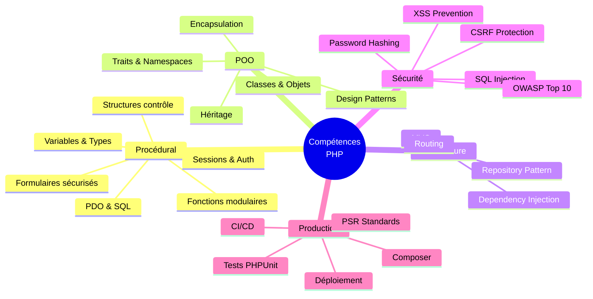

# PHP

## Introduction

**PHP** est le langage backend le plus utilisé au monde, propulsant 78% des sites web (WordPress, Laravel, Symfony). Cette formation vous accompagne depuis les fondations jusqu'à la création d'applications production-ready sécurisées.

> PHP moderne (8.x) n'a plus rien à voir avec le PHP 5 d'antan. **Types stricts**, **JIT compiler**, **Match expressions**, **Attributes**, **Enums** : c'est un langage professionnel robuste.

!!! info "Pourquoi cette formation ?"
    - Elle **structure** votre apprentissage de manière progressive (procédural → POO → architecture)
    - Elle **intègre** la sécurité dès le premier module (XSS, CSRF, SQLi, etc.)
    - Elle **couvre** 100% des compétences pour développer en production
    - Elle **produit** 35+ projets réels et déployables

## Parcours pédagogique

## Partie 1 — PHP Procédural

!!! note "Cette partie couvre les fondations, structures de contrôle, formulaires, sessions et bases de données"

-   :lucide-code:{ .lg .middle } **Module 1** — _Fondations PHP_

    ---
    Installation, syntaxe, variables, types, opérateurs, validation basique.

    **Projets** : 2 | **Durée** : ~6-8h | **Niveau** : 🟢 Débutant

    [:lucide-book-open-check: Accéder au module 1](./module-01/)

-   :lucide-git-branch:{ .lg .middle } **Module 2** — _Structures de Contrôle_

    ---
    Conditions (if, match), boucles (for, foreach), opérateurs avancés (<=>, ??, ?->).

    **Projets** : 3 | **Durée** : ~7-9h | **Niveau** : 🟢 Débutant

    [:lucide-book-open-check: Accéder au module 2](./module-02/)

-   :lucide-function-square:{ .lg .middle } **Module 3** — _Fonctions & Organisation_

    ---
    Déclaration, paramètres typés, closures, arrow functions, includes sécurisés.

    **Projets** : 3 | **Durée** : ~8-10h | **Niveau** : 🟡 Intermédiaire

    [:lucide-book-open-check: Accéder au module 3](./module-03/)

-   :lucide-database:{ .lg .middle } **Module 4** — _Manipulation de Données_

    ---
    Arrays, strings, regex, JSON, DateTime, sérialisation sécurisée.

    **Projets** : 3 | **Durée** : ~9-11h | **Niveau** : 🟡 Intermédiaire

    [:lucide-book-open-check: Accéder au module 4](./module-04/)

-   :lucide-shield-alert:{ .lg .middle } **Module 5** — _Formulaires & Sécurité Web_

    ---
    GET/POST, validation, sanitization, **XSS**, **CSRF**, **SQL Injection**, upload sécurisé.

    **Projets** : 3 | **Durée** : ~10-12h | **Niveau** : 🔴 Avancé

    [:lucide-book-open-check: Accéder au module 5](./module-05/)

-   :lucide-cookie:{ .lg .middle } **Module 6** — _Sessions & Authentification_

    ---
    Sessions PHP, cookies sécurisés, login/logout, `password_hash`, session hijacking.

    **Projets** : 3 | **Durée** : ~8-10h | **Niveau** : 🔴 Avancé

    [:lucide-book-open-check: Accéder au module 6](./module-06/)

-   :lucide-hard-drive:{ .lg .middle } **Module 7** — _Bases de Données avec PDO_

    ---
    PDO, requêtes préparées, CRUD sécurisé, transactions, pagination, **SQL Injection**.

    **Projets** : 3 | **Durée** : ~10-12h | **Niveau** : 🔴 Avancé

    [:lucide-book-open-check: Accéder au module 7](./module-07/)

### Atelier Partie 1

-   :lucide-newspaper:{ .lg .middle } **Atelier #1** — _Blog Procédural Complet_

    ---
    Blog avec authentification, CRUD articles, upload images, commentaires sécurisés.

    **Niveau** : 🔴 Avancé | **Durée** : 3-4h

    [:lucide-hammer: Accéder à l'atelier](./atelier-01/)

---

## Partie 2 — PHP Orienté Objet

!!! note "Cette partie approfondit la POO, l'architecture, les design patterns et la production"

-   :lucide-box:{ .lg .middle } **Module 8** — _Fondations POO_

    ---
    Classes, objets, propriétés, méthodes, constructeur, `$this`, type hinting.

    **Projets** : 3 | **Durée** : ~8-10h | **Niveau** : 🟡 Intermédiaire

    [:lucide-book-open-check: Accéder au module 8](./module-08/)

-   :lucide-lock:{ .lg .middle } **Module 9** — _Encapsulation & Visibilité_

    ---
    Public/private/protected, getters/setters, property promotion PHP 8, readonly.

    **Projets** : 3 | **Durée** : ~7-9h | **Niveau** : 🟡 Intermédiaire

    [:lucide-book-open-check: Accéder au module 9](./module-09/)

-   :lucide-git-merge:{ .lg .middle } **Module 10** — _Héritage & Polymorphisme_

    ---
    `extends`, classes abstraites, interfaces, polymorphisme, Liskov principle.

    **Projets** : 3 | **Durée** : ~9-11h | **Niveau** : 🔴 Avancé

    [:lucide-book-open-check: Accéder au module 10](./module-10/)

-   :lucide-package:{ .lg .middle } **Module 11** — _Traits, Namespaces & Autoloading_

    ---
    Traits, namespaces, PSR-4, Composer, gestion dépendances.

    **Projets** : 3 | **Durée** : ~8-10h | **Niveau** : 🔴 Avancé

    [:lucide-book-open-check: Accéder au module 11](./module-11/)

-   :lucide-puzzle:{ .lg .middle } **Module 12** — _Design Patterns_

    ---
    Singleton, Factory, Strategy, Observer, Dependency Injection, Repository.

    **Projets** : 3 | **Durée** : ~10-12h | **Niveau** : 🔴 Avancé

    [:lucide-book-open-check: Accéder au module 12](./module-12/)

-   :lucide-alert-triangle:{ .lg .middle } **Module 13** — _Gestion des Erreurs_

    ---
    Exceptions, try/catch/finally, classes custom, error handling, logging (Monolog).

    **Projets** : 3 | **Durée** : ~7-9h | **Niveau** : 🔴 Avancé

    [:lucide-book-open-check: Accéder au module 13](./module-13/)

-   :lucide-layout-template:{ .lg .middle } **Module 14** — _Architecture MVC_

    ---
    Pattern MVC, routing, controllers, models, views, front controller.

    **Projets** : 3 | **Durée** : ~12-15h | **Niveau** : 🔴 Avancé

    [:lucide-book-open-check: Accéder au module 14](./module-14/)

-   :lucide-shield-check:{ .lg .middle } **Module 15** — _Sécurité POO Avancée_

    ---
    DI sécurisée, RBAC, JWT, OAuth 2.0, rate limiting, OWASP Top 10.

    **Projets** : 3 | **Durée** : ~9-11h | **Niveau** : 🔴 Expert

    [:lucide-book-open-check: Accéder au module 15](./module-15/)

-   :lucide-rocket:{ .lg .middle } **Module 16** — _Standards & Production_

    ---
    PSR standards, Composer avancé, PHPUnit, PHPStan, CI/CD, déploiement.

    **Projets** : 2 | **Durée** : ~8-10h | **Niveau** : 🔴 Expert

    [:lucide-book-open-check: Accéder au module 16](./module-16/)

### Atelier Partie 2

-   :lucide-layers:{ .lg .middle } **Atelier #2** — _Mini-Framework MVC_

    ---
    Framework from scratch : routing, controllers, ORM simple, templates, middleware.

    **Niveau** : 🔴 Expert | **Durée** : 4-5h

    [:lucide-hammer: Accéder à l'atelier](./atelier-02/)

---

## Compétences validées

À l'issue de cette formation, vous serez capable de :

## Synthèse par niveau

| Partie | Modules | Niveau | Prérequis |
|--------|---------|--------|-----------|
| **Procédural** | 1, 2, 3, 4 | 🟢 Débutant | HTML/CSS basique |
| **Sécurité Web** | 5, 6, 7 | 🔴 Avancé | Modules 1-4 complétés |
| **POO Fondations** | 8, 9, 10, 11 | 🟡 Intermédiaire | Partie 1 complète |
| **POO Avancée** | 12, 13, 14 | 🔴 Avancé | Modules 8-11 complétés |
| **Production** | 15, 16 | 🔴 Expert | Toute la formation |

!!! tip "Conseils de progression"
    - [x] **Suivez l'ordre strict** : chaque module s'appuie sur les précédents
    - [x] **Codez TOUS les projets** : la pratique est 80% de l'apprentissage
    - [x] **Ne sautez JAMAIS la sécurité** : elle est intégrée partout
    - [x] **Refaites les ateliers** plusieurs fois jusqu'à maîtrise totale

## Livrables obtenus

À la fin de cette formation, vous disposerez de :

- Un **environnement PHP professionnel** (Docker/XAMPP + Composer + Git)
- **35+ projets PHP** variés et déployables
- Un **blog procédural complet** avec authentification sécurisée
- Un **mini-framework MVC** from scratch fonctionnel
- Une **API REST sécurisée** avec JWT et rate limiting
- Un **package Composer** publié et réutilisable
- Une **checklist sécurité** complète (XSS, CSRF, SQLi, OWASP)
- Un **template projet production** (PSR, tests, CI/CD)

!!! warning "Prérequis techniques"
    Cette formation suppose une connaissance basique de **HTML** et **CSS**.  
    Aucune expérience en programmation n'est requise : on part de **zéro absolu**.

> Les modules suivants détaillent chaque concept avec des analogies pédagogiques, des diagrammes explicatifs, des exemples progressifs et des projets concrets.

 