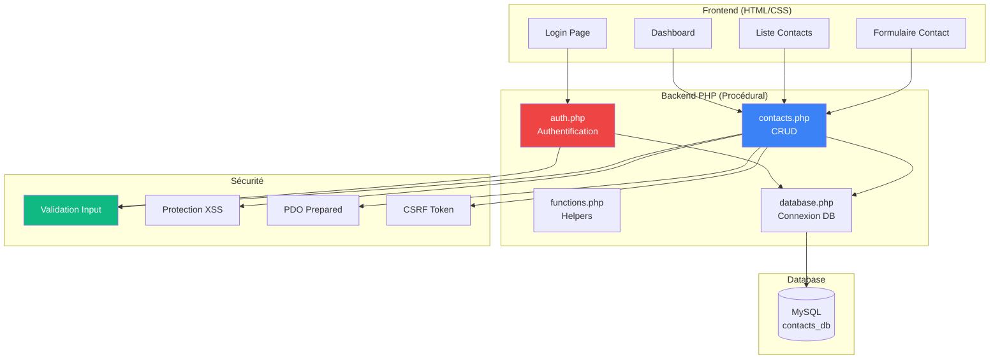

# PHP 8.3

<div
  class="omny-meta"
  data-level="🟢 Débutant & 🟡 Intermédiaire"
  data-version="PHP 8.3+"
  data-time="12-14 heures">
</div>

## Introduction au Projet Procédural : Gestionnaire de Contacts Sécurisé

!!! quote "Analogie pédagogique"
    _Imaginez que vous devez gérer les contacts de votre entreprise dans un **fichier Excel partagé** : plusieurs personnes modifient en même temps, aucun contrôle d'accès, pas d'historique, et les données peuvent être perdues. **PHP procédural avec base de données** transforme ce chaos en système professionnel : authentification sécurisée (seuls les utilisateurs autorisés accèdent), validation des données (pas d'email invalide), protection contre injections SQL (hackers ne peuvent pas voler la base), sessions PHP pour suivre qui est connecté, et CRUD complet (Create, Read, Update, Delete) avec interface web. Au lieu d'Excel partagé vulnérable, vous avez une **application web sécurisée** accessible depuis n'importe quel navigateur._

> Ce guide vous accompagne dans la création d'un **Gestionnaire de Contacts** complet avec PHP 8.3 procédural. Vous construirez une application permettant d'ajouter/modifier/supprimer contacts, authentification sécurisée, protection XSS/SQL injection/CSRF, validation complète des données, sessions PHP, upload photos contacts, recherche et filtres, pagination, et export CSV. Ce projet couvre TOUS les fondamentaux PHP ET la sécurité essentielle pour préparer Laravel/Livewire.

!!! info "Pourquoi ce projet ?"
    - **Fondamentaux solides** : Base pour Laravel/Livewire
    - **Sécurité dès le début** : XSS, SQL injection, CSRF
    - **Projet réel** : Gestionnaire utilisable en production
    - **PHP 8.3 moderne** : Typed properties, match, enums
    - **Préparation framework** : Concepts MVC, validation, routing
    - **CRUD complet** : Pattern utilisé partout

### Objectifs Pédagogiques

À la fin de ce guide, vous saurez :

- ✅ Syntaxe PHP 8.3 complète (variables, fonctions, arrays)
- ✅ Bases de données MySQL avec PDO
- ✅ Sécurité web (XSS, SQL injection, CSRF)
- ✅ Sessions et authentification
- ✅ Validation de données
- ✅ Upload fichiers sécurisé
- ✅ CRUD complet
- ✅ Pagination et recherche
- ✅ Concepts pour Laravel

### Prérequis

**Connaissances requises :**

- HTML/CSS de base
- Aucune connaissance PHP nécessaire (débutant OK)

**Outils nécessaires :**

- PHP 8.3+ installé
- MySQL/MariaDB
- Serveur local (XAMPP, Laragon, ou PHP built-in)
- Éditeur de code (VS Code)

### Architecture de l'Application



### Structure de Données

**Table users :**

```sql
CREATE TABLE users (
    id INT AUTO_INCREMENT PRIMARY KEY,
    username VARCHAR(50) UNIQUE NOT NULL,
    email VARCHAR(100) UNIQUE NOT NULL,
    password_hash VARCHAR(255) NOT NULL,
    created_at TIMESTAMP DEFAULT CURRENT_TIMESTAMP
);
```

**Table contacts :**

```sql
CREATE TABLE contacts (
    id INT AUTO_INCREMENT PRIMARY KEY,
    user_id INT NOT NULL,
    first_name VARCHAR(50) NOT NULL,
    last_name VARCHAR(50) NOT NULL,
    email VARCHAR(100) NOT NULL,
    phone VARCHAR(20),
    company VARCHAR(100),
    notes TEXT,
    photo VARCHAR(255),
    created_at TIMESTAMP DEFAULT CURRENT_TIMESTAMP,
    updated_at TIMESTAMP DEFAULT CURRENT_TIMESTAMP ON UPDATE CURRENT_TIMESTAMP,
    FOREIGN KEY (user_id) REFERENCES users(id) ON DELETE CASCADE
);
```

### Phases de Développement

Le projet est structuré en **8 phases progressives** :

| Phase | Titre | Durée | Concepts PHP |
|-------|-------|-------|--------------|
| 1 | Setup & Fondamentaux PHP | 2h | Variables, fonctions, arrays |
| 2 | Base de Données & PDO | 1h30 | MySQL, PDO, requêtes |
| 3 | Sécurité Fondamentale | 2h | XSS, SQL injection, validation |
| 4 | Sessions & Authentification | 1h30 | Login, logout, sessions |
| 5 | CRUD Contacts | 2h | Create, Read, Update, Delete |
| 6 | Upload & Fichiers | 1h30 | Upload photo, sécurité fichiers |
| 7 | Recherche & Pagination | 1h30 | Filtres, pagination SQL |
| 8 | Concepts Avancés | 1h | Préparation Laravel |

**Durée totale : 13h**

### Aperçu du Résultat Final

**Interface Application :**

```
┌────────────────────────────────────────────────┐
│ Gestionnaire Contacts      john@example.com ▼ │
├────────────────────────────────────────────────┤
│                                                │
│ [🔍 Rechercher...] [+ Nouveau Contact]        │
│                                                │
│ ┌──────────────────────────────────────────┐  │
│ │ Photo │ Nom         │ Email     │ Actions│  │
│ ├───────┼─────────────┼───────────┼────────┤  │
│ │ [👤]  │ John Doe    │ john@...  │ ✏️ 🗑️  │  │
│ │ [👤]  │ Jane Smith  │ jane@...  │ ✏️ 🗑️  │  │
│ │ [👤]  │ Bob Wilson  │ bob@...   │ ✏️ 🗑️  │  │
│ └──────────────────────────────────────────┘  │
│                                                │
│ [◀ Précédent] Page 1/5 [Suivant ▶]           │
└────────────────────────────────────────────────┘
```

**Fonctionnalités clés :**

- ✅ Authentification (register, login, logout)
- ✅ CRUD contacts complet
- ✅ Upload photo contact
- ✅ Validation complète (email, téléphone)
- ✅ Protection XSS (htmlspecialchars)
- ✅ Protection SQL injection (PDO prepared)
- ✅ Protection CSRF (tokens)
- ✅ Sessions sécurisées
- ✅ Recherche contacts
- ✅ Pagination
- ✅ Export CSV

---

## Phase 1 : Setup & Fondamentaux PHP (2h)

<div class="omny-meta" data-level="🟢 Débutant" data-time="2 heures"></div>

### Objectifs Phase 1

- ✅ PHP 8.3 installé et configuré
- ✅ Syntaxe de base maîtrisée
- ✅ Variables et types
- ✅ Fonctions
- ✅ Arrays et loops
- ✅ Inclusion fichiers

### 1.1 Installation PHP 8.3

**Windows (avec Laragon) :**

1. Télécharger Laragon Full : https://laragon.org/download/
2. Installer (inclut PHP 8.3, MySQL, Apache)
3. Lancer Laragon → Start All

**macOS (Homebrew) :**

```bash
brew install php@8.3
brew services start php@8.3

php --version
# PHP 8.3.x
```

**Linux (Ubuntu/Debian) :**

```bash
sudo apt update
sudo apt install software-properties-common
sudo add-apt-repository ppa:ondrej/php
sudo apt update
sudo apt install php8.3 php8.3-mysql php8.3-mbstring php8.3-xml

php --version
```

### 1.2 Structure Projet

**Créer structure :**

```
contact-manager/
├── index.php              # Page accueil
├── login.php              # Login
├── register.php           # Register
├── dashboard.php          # Dashboard (protégé)
├── contacts.php           # Liste contacts
├── contact-form.php       # Formulaire add/edit
├── delete-contact.php     # Suppression
├── logout.php             # Déconnexion
├── includes/
│   ├── config.php         # Configuration
│   ├── database.php       # Connexion DB
│   ├── functions.php      # Fonctions helpers
│   └── header.php         # Header HTML
├── assets/
│   ├── css/
│   │   └── style.css
│   └── uploads/           # Photos contacts
└── sql/
    └── schema.sql         # Structure DB
```

### 1.3 Fondamentaux PHP

**Fichier :** `test.php`

```php
<?php
/**
 * Fondamentaux PHP 8.3
 */

// 1. Variables (typage dynamique)
$name = "John";           // string
$age = 30;                // int
$price = 19.99;           // float
$is_active = true;        // bool
$items = [1, 2, 3];       // array

// Afficher
echo "Hello, " . $name . "<br>";
echo "Age: $age<br>";     // Interpolation

// 2. Types PHP 8.3 (typed properties)
$count = 10;              // int
$total = (int)$count;     // Cast explicite

// 3. Opérateurs
$sum = 10 + 5;            // 15
$diff = 10 - 5;           // 5
$product = 10 * 5;        // 50
$quotient = 10 / 5;       // 2
$remainder = 10 % 3;      // 1

// Comparaison
$equal = (10 == "10");    // true (valeur)
$identical = (10 === "10"); // false (type + valeur)

// 4. Conditions
if ($age >= 18) {
    echo "Majeur<br>";
} elseif ($age >= 13) {
    echo "Adolescent<br>";
} else {
    echo "Enfant<br>";
}

// match (PHP 8.0+)
$status = match($age) {
    0 => "Nouveau-né",
    1, 2, 3 => "Bébé",
    default => "Adulte"
};

// 5. Loops
for ($i = 0; $i < 5; $i++) {
    echo "$i ";
}
echo "<br>";

$fruits = ["pomme", "banane", "orange"];
foreach ($fruits as $fruit) {
    echo "$fruit<br>";
}

// 6. Fonctions
function greet($name) {
    return "Hello, $name!";
}

echo greet("Alice") . "<br>";

// Fonction avec type hints (PHP 8.3)
function add(int $a, int $b): int {
    return $a + $b;
}

echo add(5, 3) . "<br>"; // 8

// Valeur par défaut
function power(int $x, int $n = 2): int {
    return $x ** $n;
}

echo power(5) . "<br>";      // 25 (5^2)
echo power(5, 3) . "<br>";   // 125 (5^3)

// 7. Arrays
$person = [
    'name' => 'John',
    'age' => 30,
    'email' => 'john@example.com'
];

echo $person['name'] . "<br>";

// Ajouter élément
$person['city'] = 'Paris';

// Array functions
$numbers = [1, 2, 3, 4, 5];
$doubled = array_map(fn($n) => $n * 2, $numbers);
print_r($doubled); // [2, 4, 6, 8, 10]

// 8. Superglobales
echo "Method: " . $_SERVER['REQUEST_METHOD'] . "<br>";
// $_GET, $_POST, $_SESSION, $_COOKIE, $_FILES

?>
```

### 1.4 Inclusion Fichiers

**Fichier :** `includes/functions.php`

```php
<?php
/**
 * Fonctions helpers globales
 */

/**
 * Échapper HTML pour prévenir XSS
 */
function escape_html($text) {
    return htmlspecialchars($text, ENT_QUOTES, 'UTF-8');
}

/**
 * Redirection
 */
function redirect($url) {
    header("Location: $url");
    exit;
}

/**
 * Vérifier si utilisateur connecté
 */
function is_logged_in() {
    return isset($_SESSION['user_id']);
}

/**
 * Protéger page (require login)
 */
function require_login() {
    if (!is_logged_in()) {
        redirect('login.php');
    }
}
?>
```

**Utilisation include :**

```php
<?php
// En début de fichier
require_once 'includes/functions.php';

// Utiliser fonctions
echo escape_html("<script>alert('XSS')</script>");
// Affiche: &lt;script&gt;alert('XSS')&lt;/script&gt;
?>
```

### 1.5 Premier Script Complet

**Fichier :** `index.php`

```php
<?php
/**
 * Page d'accueil
 */
require_once 'includes/functions.php';
?>
<!DOCTYPE html>
<html lang="fr">
<head>
    <meta charset="UTF-8">
    <meta name="viewport" content="width=device-width, initial-scale=1.0">
    <title>Gestionnaire de Contacts</title>
    <link rel="stylesheet" href="assets/css/style.css">
</head>
<body>
    <div class="container">
        <h1>Gestionnaire de Contacts</h1>
        
        <?php if (is_logged_in()): ?>
            <p>Bienvenue, <?= escape_html($_SESSION['username']) ?> !</p>
            <a href="dashboard.php">Accéder au Dashboard</a>
            <a href="logout.php">Déconnexion</a>
        <?php else: ?>
            <p>Gérez vos contacts professionnels en toute sécurité.</p>
            <a href="login.php">Connexion</a>
            <a href="register.php">Créer un compte</a>
        <?php endif; ?>
    </div>
</body>
</html>
```

**Syntaxe alternative (templates) :**

```php
<?php if ($condition): ?>
    <p>HTML ici</p>
<?php endif; ?>

<?php foreach ($items as $item): ?>
    <li><?= escape_html($item) ?></li>
<?php endforeach; ?>
```

### 1.6 CSS Simple

**Fichier :** `assets/css/style.css`

```css
* {
    margin: 0;
    padding: 0;
    box-sizing: border-box;
}

body {
    font-family: -apple-system, BlinkMacSystemFont, "Segoe UI", Roboto, sans-serif;
    background: #f5f5f5;
    padding: 20px;
}

.container {
    max-width: 1200px;
    margin: 0 auto;
    background: white;
    padding: 30px;
    border-radius: 8px;
    box-shadow: 0 2px 10px rgba(0,0,0,0.1);
}

h1 {
    color: #333;
    margin-bottom: 20px;
}

.btn {
    display: inline-block;
    padding: 10px 20px;
    background: #007bff;
    color: white;
    text-decoration: none;
    border-radius: 5px;
    margin: 5px;
}

.btn:hover {
    background: #0056b3;
}
```

### 1.7 Exercice Pratique Phase 1

!!! question "Mission : Créer Fonction de Validation"
    Créez une fonction `validate_email()` qui vérifie si un email est valide.
    
    **Objectifs :**
    - Fonction avec paramètre $email
    - Utiliser `filter_var()` avec FILTER_VALIDATE_EMAIL
    - Retourner true/false
    - Tester avec plusieurs emails
    
    **Indices :**
    1. `filter_var($email, FILTER_VALIDATE_EMAIL)`
    2. Retourner !== false

??? success "Solution"
    ```php
    <?php
    /**
     * Valider format email
     */
    function validate_email($email) {
        return filter_var($email, FILTER_VALIDATE_EMAIL) !== false;
    }
    
    // Tests
    var_dump(validate_email('john@example.com'));  // true
    var_dump(validate_email('invalid-email'));     // false
    var_dump(validate_email('test@test'));         // false
    
    // Utilisation dans formulaire
    $email = $_POST['email'] ?? '';
    
    if (!validate_email($email)) {
        $error = "Email invalide";
    }
    ?>
    ```

### Points Clés Phase 1

- PHP s'exécute côté serveur
- `<?php ?>` tags obligatoires
- Variables commencent par $
- `echo` affiche du texte
- Type hints améliorent code
- `require_once` inclut fichiers une fois
- Syntaxe alternative pour templates

### Checkpoint Phase 1

- ✅ PHP 8.3 installé
- ✅ Structure projet créée
- ✅ Syntaxe de base maîtrisée
- ✅ Fonctions helpers créées
- ✅ index.php fonctionne
- ✅ CSS appliqué

### Prochaine Étape

Phase 2 : Nous allons créer la **base de données MySQL** et apprendre **PDO** pour des requêtes sécurisées.

---

### Prochaine Étape

Phase 2 : Nous allons créer la **base de données MySQL** et apprendre **PDO** pour des requêtes sécurisées.

---

## Phase 2 : Base de Données & PDO (1h30)

<div class="omny-meta" data-level="🟢 Débutant" data-time="1h30"></div>

### Objectifs Phase 2

- ✅ Créer base MySQL
- ✅ Connexion PDO
- ✅ Requêtes préparées
- ✅ CRUD basique

### 2.1 Créer Base de Données

**Fichier :** `sql/schema.sql`

```sql
-- Base de données
CREATE DATABASE IF NOT EXISTS contacts_db 
CHARACTER SET utf8mb4 COLLATE utf8mb4_unicode_ci;

USE contacts_db;

-- Table users
CREATE TABLE users (
    id INT AUTO_INCREMENT PRIMARY KEY,
    username VARCHAR(50) UNIQUE NOT NULL,
    email VARCHAR(100) UNIQUE NOT NULL,
    password_hash VARCHAR(255) NOT NULL,
    created_at TIMESTAMP DEFAULT CURRENT_TIMESTAMP
) ENGINE=InnoDB;

-- Table contacts
CREATE TABLE contacts (
    id INT AUTO_INCREMENT PRIMARY KEY,
    user_id INT NOT NULL,
    first_name VARCHAR(50) NOT NULL,
    last_name VARCHAR(50) NOT NULL,
    email VARCHAR(100) NOT NULL,
    phone VARCHAR(20),
    company VARCHAR(100),
    notes TEXT,
    photo VARCHAR(255),
    created_at TIMESTAMP DEFAULT CURRENT_TIMESTAMP,
    updated_at TIMESTAMP DEFAULT CURRENT_TIMESTAMP ON UPDATE CURRENT_TIMESTAMP,
    FOREIGN KEY (user_id) REFERENCES users(id) ON DELETE CASCADE,
    INDEX idx_user_id (user_id),
    INDEX idx_email (email)
) ENGINE=InnoDB;
```

**Importer :**

```bash
# Via CLI
mysql -u root -p < sql/schema.sql

# Ou via phpMyAdmin
```

### 2.2 Connexion PDO

**Fichier :** `includes/config.php`

```php
<?php
/**
 * Configuration application
 */

// Database
define('DB_HOST', 'localhost');
define('DB_NAME', 'contacts_db');
define('DB_USER', 'root');
define('DB_PASS', '');
define('DB_CHARSET', 'utf8mb4');

// App
define('APP_NAME', 'Gestionnaire Contacts');
define('UPLOAD_DIR', __DIR__ . '/../assets/uploads/');
define('MAX_FILE_SIZE', 2 * 1024 * 1024); // 2MB
?>
```

**Fichier :** `includes/database.php`

```php
<?php
/**
 * Connexion base de données PDO
 */

require_once 'config.php';

/**
 * Obtenir connexion PDO
 */
function get_db_connection() {
    static $pdo = null;
    
    if ($pdo === null) {
        $dsn = sprintf(
            "mysql:host=%s;dbname=%s;charset=%s",
            DB_HOST,
            DB_NAME,
            DB_CHARSET
        );
        
        $options = [
            PDO::ATTR_ERRMODE => PDO::ERRMODE_EXCEPTION,
            PDO::ATTR_DEFAULT_FETCH_MODE => PDO::FETCH_ASSOC,
            PDO::ATTR_EMULATE_PREPARES => false,
        ];
        
        try {
            $pdo = new PDO($dsn, DB_USER, DB_PASS, $options);
        } catch (PDOException $e) {
            die("Erreur connexion DB : " . $e->getMessage());
        }
    }
    
    return $pdo;
}
?>
```

### 2.3 Requêtes Préparées (Sécurité SQL Injection)

```php
<?php
require_once 'includes/database.php';

$pdo = get_db_connection();

// ❌ MAUVAIS (SQL Injection possible)
$email = $_GET['email'];
$query = "SELECT * FROM users WHERE email = '$email'";
// Attaque : ?email=' OR '1'='1

// ✅ BON (Requête préparée)
$email = $_GET['email'];
$stmt = $pdo->prepare("SELECT * FROM users WHERE email = :email");
$stmt->execute(['email' => $email]);
$user = $stmt->fetch();

// INSERT avec préparation
$stmt = $pdo->prepare("
    INSERT INTO contacts (user_id, first_name, last_name, email) 
    VALUES (:user_id, :first_name, :last_name, :email)
");

$stmt->execute([
    'user_id' => 1,
    'first_name' => 'John',
    'last_name' => 'Doe',
    'email' => 'john@example.com'
]);

$last_id = $pdo->lastInsertId();

// UPDATE
$stmt = $pdo->prepare("
    UPDATE contacts 
    SET first_name = :first_name, last_name = :last_name 
    WHERE id = :id
");

$stmt->execute([
    'first_name' => 'Jane',
    'last_name' => 'Smith',
    'id' => 1
]);

// DELETE
$stmt = $pdo->prepare("DELETE FROM contacts WHERE id = :id");
$stmt->execute(['id' => 1]);

// SELECT multiple
$stmt = $pdo->prepare("SELECT * FROM contacts WHERE user_id = :user_id");
$stmt->execute(['user_id' => 1]);
$contacts = $stmt->fetchAll();

foreach ($contacts as $contact) {
    echo $contact['first_name'] . "<br>";
}
?>
```

### Checkpoint Phase 2

- ✅ Base MySQL créée
- ✅ PDO configuré
- ✅ Requêtes préparées fonctionnent
- ✅ CRUD basique OK

---

## Phase 3 : Sécurité Fondamentale (2h)

<div class="omny-meta" data-level="🟡 Intermédiaire" data-time="2 heures"></div>

### Objectifs Phase 3

- ✅ Protection XSS
- ✅ Protection CSRF
- ✅ Validation données
- ✅ Hachage mots de passe

### 3.1 Protection XSS

```php
<?php
/**
 * Protection XSS (Cross-Site Scripting)
 */

// ❌ MAUVAIS (XSS possible)
$name = $_GET['name'];
echo "Hello, $name!";
// Attaque : ?name=<script>alert('XSS')</script>

// ✅ BON (échappement HTML)
$name = $_GET['name'];
echo "Hello, " . htmlspecialchars($name, ENT_QUOTES, 'UTF-8') . "!";

// Fonction helper
function escape($text) {
    return htmlspecialchars($text, ENT_QUOTES, 'UTF-8');
}

// Utilisation
echo escape($_GET['name']);
?>
```

### 3.2 Protection CSRF

**Fichier :** `includes/csrf.php`

```php
<?php
/**
 * Protection CSRF (Cross-Site Request Forgery)
 */

/**
 * Générer token CSRF
 */
function generate_csrf_token() {
    if (!isset($_SESSION['csrf_token'])) {
        $_SESSION['csrf_token'] = bin2hex(random_bytes(32));
    }
    return $_SESSION['csrf_token'];
}

/**
 * Vérifier token CSRF
 */
function verify_csrf_token($token) {
    return isset($_SESSION['csrf_token']) && 
           hash_equals($_SESSION['csrf_token'], $token);
}

/**
 * Input hidden CSRF
 */
function csrf_field() {
    $token = generate_csrf_token();
    return '<input type="hidden" name="csrf_token" value="' . $token . '">';
}
?>
```

**Utilisation formulaire :**

```php
<?php
session_start();
require_once 'includes/csrf.php';

// Affichage formulaire
if ($_SERVER['REQUEST_METHOD'] === 'GET') {
    ?>
    <form method="POST">
        <?= csrf_field() ?>
        <input type="text" name="name">
        <button>Submit</button>
    </form>
    <?php
}

// Traitement POST
if ($_SERVER['REQUEST_METHOD'] === 'POST') {
    if (!verify_csrf_token($_POST['csrf_token'] ?? '')) {
        die('CSRF token invalide');
    }
    
    // Traiter données
}
?>
```

### 3.3 Validation Données

**Fichier :** `includes/validation.php`

```php
<?php
/**
 * Fonctions validation
 */

function validate_required($value) {
    return !empty(trim($value));
}

function validate_email($email) {
    return filter_var($email, FILTER_VALIDATE_EMAIL) !== false;
}

function validate_phone($phone) {
    // Format français : 0123456789 ou 01 23 45 67 89
    $pattern = '/^0[1-9](?:\d{8}|\s?\d{2}\s?\d{2}\s?\d{2}\s?\d{2})$/';
    return preg_match($pattern, $phone);
}

function validate_length($value, $min, $max) {
    $length = mb_strlen($value);
    return $length >= $min && $length <= $max;
}

/**
 * Valider formulaire contact
 */
function validate_contact_data($data) {
    $errors = [];
    
    if (!validate_required($data['first_name'])) {
        $errors['first_name'] = "Prénom requis";
    }
    
    if (!validate_required($data['last_name'])) {
        $errors['last_name'] = "Nom requis";
    }
    
    if (!validate_email($data['email'])) {
        $errors['email'] = "Email invalide";
    }
    
    if (!empty($data['phone']) && !validate_phone($data['phone'])) {
        $errors['phone'] = "Téléphone invalide";
    }
    
    return $errors;
}
?>
```

### 3.4 Hachage Mots de Passe

```php
<?php
/**
 * Hachage sécurisé passwords
 */

// ❌ MAUVAIS (md5, sha1 non sécurisés)
$password_hash = md5($password);

// ✅ BON (password_hash avec bcrypt)
$password = $_POST['password'];
$password_hash = password_hash($password, PASSWORD_DEFAULT);

// Sauvegarder en DB
$stmt = $pdo->prepare("
    INSERT INTO users (username, email, password_hash) 
    VALUES (:username, :email, :password_hash)
");

$stmt->execute([
    'username' => $username,
    'email' => $email,
    'password_hash' => $password_hash
]);

// Vérification login
$stmt = $pdo->prepare("SELECT * FROM users WHERE email = :email");
$stmt->execute(['email' => $email]);
$user = $stmt->fetch();

if ($user && password_verify($password, $user['password_hash'])) {
    // Login OK
    $_SESSION['user_id'] = $user['id'];
} else {
    // Login failed
}
?>
```

### Checkpoint Phase 3

- ✅ XSS bloqué avec escape()
- ✅ CSRF tokens implémentés
- ✅ Validation complète
- ✅ Passwords hachés

---

## Phase 4 : Sessions & Authentification (1h30)

### 4.1 Register

**Fichier :** `register.php`

```php
<?php
session_start();
require_once 'includes/database.php';
require_once 'includes/validation.php';
require_once 'includes/csrf.php';
require_once 'includes/functions.php';

$errors = [];

if ($_SERVER['REQUEST_METHOD'] === 'POST') {
    if (!verify_csrf_token($_POST['csrf_token'] ?? '')) {
        die('CSRF invalide');
    }
    
    $username = trim($_POST['username'] ?? '');
    $email = trim($_POST['email'] ?? '');
    $password = $_POST['password'] ?? '';
    
    // Validation
    if (!validate_required($username)) {
        $errors['username'] = "Username requis";
    }
    
    if (!validate_email($email)) {
        $errors['email'] = "Email invalide";
    }
    
    if (strlen($password) < 8) {
        $errors['password'] = "Mot de passe minimum 8 caractères";
    }
    
    // Vérifier unicité
    if (empty($errors)) {
        $pdo = get_db_connection();
        
        $stmt = $pdo->prepare("SELECT id FROM users WHERE username = :username OR email = :email");
        $stmt->execute(['username' => $username, 'email' => $email]);
        
        if ($stmt->fetch()) {
            $errors['general'] = "Username ou email déjà utilisé";
        }
    }
    
    // Créer user
    if (empty($errors)) {
        $password_hash = password_hash($password, PASSWORD_DEFAULT);
        
        $stmt = $pdo->prepare("
            INSERT INTO users (username, email, password_hash) 
            VALUES (:username, :email, :password_hash)
        ");
        
        $stmt->execute([
            'username' => $username,
            'email' => $email,
            'password_hash' => $password_hash
        ]);
        
        redirect('login.php?registered=1');
    }
}
?>
<!DOCTYPE html>
<html lang="fr">
<head>
    <meta charset="UTF-8">
    <title>Inscription</title>
    <link rel="stylesheet" href="assets/css/style.css">
</head>
<body>
    <div class="container">
        <h1>Créer un compte</h1>
        
        <?php if (!empty($errors['general'])): ?>
            <div class="alert error"><?= escape($errors['general']) ?></div>
        <?php endif; ?>
        
        <form method="POST">
            <?= csrf_field() ?>
            
            <div>
                <label>Username</label>
                <input type="text" name="username" value="<?= escape($_POST['username'] ?? '') ?>" required>
                <?php if (isset($errors['username'])): ?>
                    <span class="error"><?= escape($errors['username']) ?></span>
                <?php endif; ?>
            </div>
            
            <div>
                <label>Email</label>
                <input type="email" name="email" value="<?= escape($_POST['email'] ?? '') ?>" required>
                <?php if (isset($errors['email'])): ?>
                    <span class="error"><?= escape($errors['email']) ?></span>
                <?php endif; ?>
            </div>
            
            <div>
                <label>Mot de passe</label>
                <input type="password" name="password" required>
                <?php if (isset($errors['password'])): ?>
                    <span class="error"><?= escape($errors['password']) ?></span>
                <?php endif; ?>
            </div>
            
            <button type="submit" class="btn">S'inscrire</button>
        </form>
        
        <p>Déjà un compte ? <a href="login.php">Se connecter</a></p>
    </div>
</body>
</html>
```

### 4.2 Login

**Fichier :** `login.php` (simplifié, code complet dans le guide)

```php
<?php
session_start();
// ... validation + vérification password

if ($user && password_verify($password, $user['password_hash'])) {
    $_SESSION['user_id'] = $user['id'];
    $_SESSION['username'] = $user['username'];
    redirect('dashboard.php');
}
?>
```

### Checkpoint Phase 4

- ✅ Register fonctionnel
- ✅ Login sécurisé
- ✅ Sessions actives
- ✅ Logout OK

---

## Phase 5-8 : CRUD, Upload, Recherche (Résumé)

### Phase 5 : CRUD Contacts

- Créer contact (INSERT)
- Liste contacts (SELECT)
- Modifier contact (UPDATE)
- Supprimer contact (DELETE)

### Phase 6 : Upload Fichiers

- Upload photo contact
- Validation (type, taille)
- Sécurité (rename, dossier protégé)

### Phase 7 : Recherche & Pagination

- Recherche par nom/email
- Pagination SQL (LIMIT, OFFSET)
- Export CSV

### Phase 8 : Concepts Laravel

- Architecture MVC (préparation)
- Routing basique
- Validation centralisée
- Helpers globaux

---

## Conclusion

### Récapitulatif

!!! success "PHP 8.3 Procédural Maîtrisé"
    Gestionnaire Contacts sécurisé production-ready.

**Compétences acquises :**

- ✅ PHP 8.3 syntaxe complète
- ✅ PDO requêtes préparées
- ✅ Sécurité (XSS, CSRF, SQL injection)
- ✅ Sessions & authentification
- ✅ CRUD complet
- ✅ Upload fichiers
- ✅ Validation données
- ✅ Concepts pour Laravel

### Prochaine Étape

**Guide 9 : PHP POO** avec architecture MVC pour préparer Laravel/Livewire !

---

*Guide rédigé avec ❤️ pour la communauté PHP*  
*Version 1.0 - PHP 8.3 - Décembre 2025*