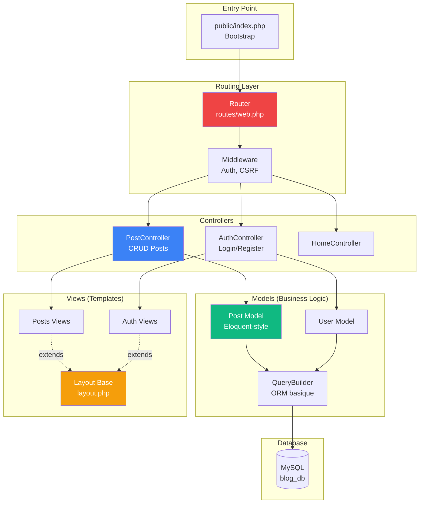

# PHP - POO

<div
  class="omny-meta"
  data-level="🟡 Intermédiaire & 🔴 Avancé"
  data-version="PHP 8.3+"
  data-time="14-16 heures">
</div>

## Introduction au Projet POO : Gestionnaire de Contacts (Orientée Objet)

!!! quote "Analogie pédagogique"
    _Imaginez que vous gérez des contacts avec des **fonctions séparées** : `create_contact()`, `update_contact()`, `delete_contact()`, `validate_email()`, `upload_photo()`. Chaque fonction existe indépendamment, les données passent d'une fonction à l'autre via paramètres, et vous devez vous souvenir de l'ordre d'appel exact. **PHP POO transforme cette collection de fonctions en objets cohérents** : une classe `Contact` qui contient ses propres données ($firstName, $email) ET ses propres méthodes (save(), delete(), validate()), une classe `ContactManager` qui orchestre les opérations, une classe `Database` singleton pour la connexion unique. Au lieu de manipuler des arrays `['first_name' => 'John']`, vous manipulez des **objets** `$contact->firstName`. Les données et les comportements sont **encapsulés ensemble**, le code est **réutilisable**, et la maintenance devient **intuitive** car tout est organisé en entités métier. C'est le MÊME projet que le Guide 8, mais pensé objet._

> Ce guide vous accompagne dans la **recréation du Gestionnaire de Contacts** (Guide 8) mais entièrement en **Programmation Orientée Objet**. Vous allez transformer chaque fonction procédurale en classe/méthode, créer des objets Contact/User, utiliser l'héritage pour factoriser le code, implémenter des interfaces pour les contrats, et découvrir les patterns essentiels (Singleton, Repository). Le but est de COMPARER directement les deux approches sur le même projet pour comprendre l'intérêt de la POO.

!!! info "Pourquoi ce projet ?"
    - **Même projet que Guide 8** : Comparaison directe procédural vs POO
    - **POO pure** : Pas de framework, juste des classes PHP
    - **Concepts progressifs** : Classes → Héritage → Interfaces → Patterns
    - **Code réutilisable** : Objets vs fonctions isolées
    - **Préparation Laravel** : Concepts transférables
    - **Maintenance facile** : Code organisé en entités

### Objectifs Pédagogiques

À la fin de ce guide, vous saurez :

- ✅ Classes et objets (instances)
- ✅ Propriétés et méthodes
- ✅ Constructeur et destructeur
- ✅ Visibilité (public, private, protected)
- ✅ Héritage (extends)
- ✅ Interfaces et contrats
- ✅ Traits (réutilisation code)
- ✅ Namespaces et autoloading
- ✅ Patterns (Singleton, Repository)
- ✅ Différences procédural vs POO

### Comparaison Procédural (Guide 8) vs POO (Guide 9)

```mermaid
graph TB
    subgraph "Guide 8 : PROCÉDURAL"
        A1[functions.php<br/>validate_email()<br/>escape_html()]
        A2[database.php<br/>get_db_connection()]
        A3[contacts.php<br/>Script avec SQL]
        A4[auth.php<br/>Login/Register]
    end
    
    subgraph "Guide 9 : POO"
        B1[Class Validator<br/>$validator->validateEmail()]
        B2[Class Database<br/>$db->query()]
        B3[Class Contact<br/>$contact->save()]
        B4[Class Auth<br/>$auth->login()]
        B5[Class ContactManager<br/>CRUD operations]
    end
    
    A1 -.transform.-> B1
    A2 -.transform.-> B2
    A3 -.transform.-> B3
    A3 -.transform.-> B5
    A4 -.transform.-> B4
    
    style B1 fill:#10b981,color:#fff
    style B2 fill:#3b82f6,color:#fff
    style B3 fill:#ef4444,color:#fff
```

### Structure Projet POO

```
contact-manager-oop/
├── public/
│   ├── index.php
│   ├── login.php
│   ├── register.php
│   ├── dashboard.php
│   ├── contacts.php
│   ├── contact-form.php
│   └── assets/css/style.css
├── src/
│   ├── Database.php
│   ├── Auth.php
│   ├── Contact.php
│   ├── ContactManager.php
│   ├── User.php
│   ├── UserManager.php
│   ├── Validator.php
│   ├── FileUploader.php
│   └── Session.php
├── config/
│   └── database.php
├── composer.json
└── autoload.php
```

### Phases de Développement

| Phase | Titre | Durée | Concepts POO |
|-------|-------|-------|--------------|
| 1 | Classes & Objets | 2h | Bases POO, propriétés, méthodes |
| 2 | Database Class | 1h30 | Singleton, PDO encapsulation |
| 3 | Contact & User Classes | 2h | Entités métier, validation |
| 4 | Manager Classes | 2h | Repository pattern, CRUD |
| 5 | Auth Class | 1h30 | Authentification objet |
| 6 | Héritage & Interfaces | 2h | extends, implements |
| 7 | Traits & Namespaces | 1h30 | Réutilisation, organisation |
| 8 | Patterns Avancés | 1h30 | Comparaison finale |

**Durée totale : 14h**

---

## Phase 1 : Classes & Objets (2h)

<div class="omny-meta" data-level="🟡 Intermédiaire" data-time="2 heures"></div>

### Objectifs Phase 1

- ✅ Comprendre classes vs fonctions
- ✅ Créer première classe
- ✅ Propriétés et méthodes
- ✅ Constructeur
- ✅ Instanciation objets
- ✅ Visibilité (public/private)

### 1.1 Pourquoi la POO ?

**Version Procédurale (Guide 8) :**

```php
<?php
// functions.php

function validate_email($email) {
    return filter_var($email, FILTER_VALIDATE_EMAIL) !== false;
}

function escape_html($text) {
    return htmlspecialchars($text, ENT_QUOTES, 'UTF-8');
}

// Utilisation
$email = "john@example.com";
if (validate_email($email)) {
    echo escape_html($email);
}
?>
```

**Version POO (Guide 9) :**

```php
<?php
// src/Validator.php

class Validator
{
    public function validateEmail(string $email): bool
    {
        return filter_var($email, FILTER_VALIDATE_EMAIL) !== false;
    }
    
    public function escapeHtml(string $text): string
    {
        return htmlspecialchars($text, ENT_QUOTES, 'UTF-8');
    }
}

// Utilisation
$validator = new Validator();
$email = "john@example.com";

if ($validator->validateEmail($email)) {
    echo $validator->escapeHtml($email);
}
?>
```

**Différence :** Fonctions regroupées dans une classe logique.

### 1.2 Première Classe : Contact

**Fichier :** `src/Contact.php`

```php
<?php
/**
 * Classe Contact - Représente un contact
 */

class Contact
{
    // Propriétés (données)
    public int $id;
    public string $firstName;
    public string $lastName;
    public string $email;
    public ?string $phone = null;
    public ?string $company = null;
    public ?string $notes = null;
    public ?string $photo = null;
    
    /**
     * Constructeur - appelé lors de new Contact()
     */
    public function __construct(
        string $firstName,
        string $lastName,
        string $email
    ) {
        $this->firstName = $firstName;
        $this->lastName = $lastName;
        $this->email = $email;
    }
    
    /**
     * Méthode - comportement de l'objet
     */
    public function getFullName(): string
    {
        return $this->firstName . ' ' . $this->lastName;
    }
    
    /**
     * Vérifier si contact a un téléphone
     */
    public function hasPhone(): bool
    {
        return !empty($this->phone);
    }
}

// Utilisation
$contact = new Contact("John", "Doe", "john@example.com");
echo $contact->getFullName(); // "John Doe"

$contact->phone = "0123456789";
echo $contact->hasPhone(); // true
?>
```

### 1.3 Visibilité : Public vs Private vs Protected

```php
<?php
class User
{
    // Public : accessible partout
    public string $username;
    
    // Private : accessible SEULEMENT dans cette classe
    private string $passwordHash;
    
    // Protected : accessible dans cette classe + classes enfants
    protected string $email;
    
    public function __construct(string $username, string $email)
    {
        $this->username = $username;
        $this->email = $email;
    }
    
    /**
     * Setter pour propriété private (encapsulation)
     */
    public function setPassword(string $password): void
    {
        // Validation + sécurité
        if (strlen($password) < 8) {
            throw new Exception("Password trop court");
        }
        
        $this->passwordHash = password_hash($password, PASSWORD_DEFAULT);
    }
    
    /**
     * Vérifier password
     */
    public function checkPassword(string $password): bool
    {
        return password_verify($password, $this->passwordHash);
    }
    
    /**
     * Getter pour email protected
     */
    public function getEmail(): string
    {
        return $this->email;
    }
}

// Utilisation
$user = new User("john", "john@example.com");

echo $user->username; // OK (public)

// echo $user->passwordHash; // ERREUR (private)
// echo $user->email; // ERREUR (protected)

$user->setPassword("mypassword123"); // OK
echo $user->getEmail(); // OK (via getter)
?>
```

### 1.4 Comparaison Array vs Objet

**Version Procédurale (Guide 8) avec arrays :**

```php
<?php
// Contact = array
$contact = [
    'first_name' => 'John',
    'last_name' => 'Doe',
    'email' => 'john@example.com'
];

// Accès
echo $contact['first_name']; // Pas d'autocomplétion IDE

// Erreur possible
echo $contact['fisrt_name']; // Typo, pas d'erreur PHP

// Fonction externe
function get_full_name($contact) {
    return $contact['first_name'] . ' ' . $contact['last_name'];
}

echo get_full_name($contact);
?>
```

**Version POO (Guide 9) avec objets :**

```php
<?php
// Contact = objet
$contact = new Contact("John", "Doe", "john@example.com");

// Accès avec autocomplétion IDE
echo $contact->firstName; // IDE suggère les propriétés

// Erreur détectée
// echo $contact->fisrtName; // Erreur immédiate

// Méthode de l'objet
echo $contact->getFullName();
?>
```

**Avantages POO :**
- ✅ Autocomplétion IDE
- ✅ Erreurs détectées tôt
- ✅ Code organisé
- ✅ Méthodes liées aux données

### 1.5 Exercice Pratique Phase 1

!!! question "Mission : Créer classe User"
    Créez une classe `User` avec les propriétés/méthodes suivantes :
    
    **Propriétés :**
    - id (int)
    - username (string)
    - email (string)
    - passwordHash (private string)
    
    **Méthodes :**
    - `__construct($username, $email)`
    - `setPassword($password)` : hacher avec password_hash
    - `checkPassword($password)` : vérifier avec password_verify
    - `getEmail()` : retourner email

??? success "Solution"
    ```php
    <?php
    class User
    {
        public int $id;
        public string $username;
        private string $email;
        private string $passwordHash;
        
        public function __construct(string $username, string $email)
        {
            $this->username = $username;
            $this->email = $email;
        }
        
        public function setPassword(string $password): void
        {
            if (strlen($password) < 8) {
                throw new Exception("Password minimum 8 caractères");
            }
            
            $this->passwordHash = password_hash($password, PASSWORD_DEFAULT);
        }
        
        public function checkPassword(string $password): bool
        {
            return password_verify($password, $this->passwordHash);
        }
        
        public function getEmail(): string
        {
            return $this->email;
        }
    }
    
    // Test
    $user = new User("john", "john@example.com");
    $user->setPassword("mypassword123");
    
    echo $user->checkPassword("mypassword123") ? "OK" : "Fail"; // OK
    echo $user->checkPassword("wrongpass") ? "OK" : "Fail"; // Fail
    ?>
    ```

### Checkpoint Phase 1

- ✅ Classe créée avec propriétés
- ✅ Constructeur implémenté
- ✅ Méthodes fonctionnent
- ✅ Visibilité maîtrisée
- ✅ Différence array vs objet comprise

---

## Phase 2 : Database Class (1h30)

<div class="omny-meta" data-level="🟡 Intermédiaire" data-time="1h30"></div>

### Objectifs Phase 2

- ✅ Encapsuler PDO dans classe
- ✅ Pattern Singleton
- ✅ Méthodes query simplifiées
- ✅ Gestion erreurs

### 2.1 Version Procédurale vs POO

**Version Procédurale (Guide 8) :**

```php
<?php
// includes/database.php

function get_db_connection() {
    static $pdo = null;
    
    if ($pdo === null) {
        $dsn = "mysql:host=localhost;dbname=contacts_db;charset=utf8mb4";
        $pdo = new PDO($dsn, 'root', '', [
            PDO::ATTR_ERRMODE => PDO::ERRMODE_EXCEPTION,
            PDO::ATTR_DEFAULT_FETCH_MODE => PDO::FETCH_ASSOC
        ]);
    }
    
    return $pdo;
}

// Utilisation
$pdo = get_db_connection();
$stmt = $pdo->prepare("SELECT * FROM contacts WHERE user_id = :user_id");
$stmt->execute(['user_id' => 1]);
$contacts = $stmt->fetchAll();
?>
```

**Version POO (Guide 9) :**

```php
<?php
// src/Database.php

class Database
{
    private static ?Database $instance = null;
    private PDO $connection;
    
    /**
     * Constructeur private (Singleton)
     */
    private function __construct()
    {
        $dsn = "mysql:host=localhost;dbname=contacts_db;charset=utf8mb4";
        
        $this->connection = new PDO($dsn, 'root', '', [
            PDO::ATTR_ERRMODE => PDO::ERRMODE_EXCEPTION,
            PDO::ATTR_DEFAULT_FETCH_MODE => PDO::FETCH_ASSOC,
            PDO::ATTR_EMULATE_PREPARES => false
        ]);
    }
    
    /**
     * Obtenir instance unique (Singleton pattern)
     */
    public static function getInstance(): Database
    {
        if (self::$instance === null) {
            self::$instance = new Database();
        }
        
        return self::$instance;
    }
    
    /**
     * Obtenir connexion PDO
     */
    public function getConnection(): PDO
    {
        return $this->connection;
    }
    
    /**
     * Query simplifiée
     */
    public function query(string $sql, array $params = []): PDOStatement
    {
        $stmt = $this->connection->prepare($sql);
        $stmt->execute($params);
        return $stmt;
    }
    
    /**
     * Fetch all
     */
    public function fetchAll(string $sql, array $params = []): array
    {
        return $this->query($sql, $params)->fetchAll();
    }
    
    /**
     * Fetch one
     */
    public function fetchOne(string $sql, array $params = []): ?array
    {
        $result = $this->query($sql, $params)->fetch();
        return $result ?: null;
    }
}

// Utilisation
$db = Database::getInstance();
$contacts = $db->fetchAll(
    "SELECT * FROM contacts WHERE user_id = :user_id",
    ['user_id' => 1]
);
?>
```

**Avantages POO :**
- ✅ Singleton = 1 seule connexion DB
- ✅ Méthodes simplifiées (fetchAll, fetchOne)
- ✅ Encapsulation PDO
- ✅ Réutilisable partout

### 2.2 Pattern Singleton Expliqué

```php
<?php
/**
 * Singleton : UNE SEULE instance de la classe
 */

class Database
{
    // Instance statique unique
    private static ?Database $instance = null;
    
    // Constructeur PRIVATE (empêche new Database())
    private function __construct()
    {
        // Connexion PDO
    }
    
    // Méthode statique pour obtenir instance
    public static function getInstance(): Database
    {
        if (self::$instance === null) {
            self::$instance = new Database(); // Création unique
        }
        
        return self::$instance; // Toujours la même instance
    }
    
    // Empêcher clone
    private function __clone() {}
}

// Utilisation
$db1 = Database::getInstance();
$db2 = Database::getInstance();

var_dump($db1 === $db2); // true (même instance)

// new Database(); // ERREUR (constructeur private)
?>
```

### 2.3 Méthodes Utilitaires

**Fichier :** `src/Database.php` (complet)

```php
<?php
class Database
{
    private static ?Database $instance = null;
    private PDO $connection;
    
    private function __construct()
    {
        $dsn = sprintf(
            "mysql:host=%s;dbname=%s;charset=utf8mb4",
            $_ENV['DB_HOST'] ?? 'localhost',
            $_ENV['DB_NAME'] ?? 'contacts_db'
        );
        
        $this->connection = new PDO(
            $dsn,
            $_ENV['DB_USER'] ?? 'root',
            $_ENV['DB_PASS'] ?? '',
            [
                PDO::ATTR_ERRMODE => PDO::ERRMODE_EXCEPTION,
                PDO::ATTR_DEFAULT_FETCH_MODE => PDO::FETCH_ASSOC,
                PDO::ATTR_EMULATE_PREPARES => false
            ]
        );
    }
    
    public static function getInstance(): Database
    {
        if (self::$instance === null) {
            self::$instance = new Database();
        }
        return self::$instance;
    }
    
    public function getConnection(): PDO
    {
        return $this->connection;
    }
    
    /**
     * SELECT query
     */
    public function query(string $sql, array $params = []): PDOStatement
    {
        $stmt = $this->connection->prepare($sql);
        $stmt->execute($params);
        return $stmt;
    }
    
    /**
     * INSERT et retourner ID
     */
    public function insert(string $table, array $data): int
    {
        $columns = implode(', ', array_keys($data));
        $placeholders = ':' . implode(', :', array_keys($data));
        
        $sql = "INSERT INTO {$table} ({$columns}) VALUES ({$placeholders})";
        $this->query($sql, $data);
        
        return (int)$this->connection->lastInsertId();
    }
    
    /**
     * UPDATE
     */
    public function update(string $table, array $data, string $where, array $whereParams = []): int
    {
        $set = [];
        foreach (array_keys($data) as $column) {
            $set[] = "{$column} = :{$column}";
        }
        $setClause = implode(', ', $set);
        
        $sql = "UPDATE {$table} SET {$setClause} WHERE {$where}";
        $stmt = $this->query($sql, array_merge($data, $whereParams));
        
        return $stmt->rowCount();
    }
    
    /**
     * DELETE
     */
    public function delete(string $table, string $where, array $params = []): int
    {
        $sql = "DELETE FROM {$table} WHERE {$where}";
        $stmt = $this->query($sql, $params);
        return $stmt->rowCount();
    }
    
    /**
     * Fetch all rows
     */
    public function fetchAll(string $sql, array $params = []): array
    {
        return $this->query($sql, $params)->fetchAll();
    }
    
    /**
     * Fetch single row
     */
    public function fetchOne(string $sql, array $params = []): ?array
    {
        $result = $this->query($sql, $params)->fetch();
        return $result ?: null;
    }
}
?>
```

### Checkpoint Phase 2

- ✅ Database class créée
- ✅ Singleton implémenté
- ✅ Méthodes CRUD simplifiées
- ✅ Encapsulation PDO réussie

---

## Phase 3 : Contact & User Classes (2h)

<div class="omny-meta" data-level="🟡 Intermédiaire" data-time="2 heures"></div>

### Objectifs Phase 3

- ✅ Classe Contact complète
- ✅ Classe User complète
- ✅ Validation intégrée
- ✅ Méthodes métier

### 3.1 Classe Contact Complète

**Fichier :** `src/Contact.php`

```php
<?php
/**
 * Classe Contact - Entité métier
 */

class Contact
{
    public ?int $id = null;
    public int $userId;
    public string $firstName;
    public string $lastName;
    public string $email;
    public ?string $phone = null;
    public ?string $company = null;
    public ?string $notes = null;
    public ?string $photo = null;
    public ?string $createdAt = null;
    public ?string $updatedAt = null;
    
    private array $errors = [];
    
    public function __construct(
        int $userId,
        string $firstName,
        string $lastName,
        string $email
    ) {
        $this->userId = $userId;
        $this->firstName = $firstName;
        $this->lastName = $lastName;
        $this->email = $email;
    }
    
    /**
     * Nom complet
     */
    public function getFullName(): string
    {
        return trim($this->firstName . ' ' . $this->lastName);
    }
    
    /**
     * Valider données
     */
    public function validate(): bool
    {
        $this->errors = [];
        
        // Prénom requis
        if (empty(trim($this->firstName))) {
            $this->errors['firstName'] = "Prénom requis";
        }
        
        // Nom requis
        if (empty(trim($this->lastName))) {
            $this->errors['lastName'] = "Nom requis";
        }
        
        // Email valide
        if (!filter_var($this->email, FILTER_VALIDATE_EMAIL)) {
            $this->errors['email'] = "Email invalide";
        }
        
        // Téléphone (si fourni)
        if (!empty($this->phone)) {
            $phonePattern = '/^0[1-9](?:\d{8}|\s?\d{2}\s?\d{2}\s?\d{2}\s?\d{2})$/';
            if (!preg_match($phonePattern, $this->phone)) {
                $this->errors['phone'] = "Téléphone invalide (format: 0123456789)";
            }
        }
        
        return empty($this->errors);
    }
    
    /**
     * Obtenir erreurs validation
     */
    public function getErrors(): array
    {
        return $this->errors;
    }
    
    /**
     * Vérifier si contact a photo
     */
    public function hasPhoto(): bool
    {
        return !empty($this->photo) && file_exists("assets/uploads/" . $this->photo);
    }
    
    /**
     * Obtenir URL photo
     */
    public function getPhotoUrl(): string
    {
        return $this->hasPhoto()
            ? "assets/uploads/" . $this->photo
            : "assets/images/default-avatar.png";
    }
    
    /**
     * Convertir en array (pour DB)
     */
    public function toArray(): array
    {
        return [
            'user_id' => $this->userId,
            'first_name' => $this->firstName,
            'last_name' => $this->lastName,
            'email' => $this->email,
            'phone' => $this->phone,
            'company' => $this->company,
            'notes' => $this->notes,
            'photo' => $this->photo
        ];
    }
    
    /**
     * Créer depuis array DB
     */
    public static function fromArray(array $data): Contact
    {
        $contact = new Contact(
            $data['user_id'],
            $data['first_name'],
            $data['last_name'],
            $data['email']
        );
        
        $contact->id = $data['id'] ?? null;
        $contact->phone = $data['phone'] ?? null;
        $contact->company = $data['company'] ?? null;
        $contact->notes = $data['notes'] ?? null;
        $contact->photo = $data['photo'] ?? null;
        $contact->createdAt = $data['created_at'] ?? null;
        $contact->updatedAt = $data['updated_at'] ?? null;
        
        return $contact;
    }
}
?>
```

### 3.2 Classe User Complète

**Fichier :** `src/User.php`

```php
<?php
/**
 * Classe User - Utilisateur
 */

class User
{
    public ?int $id = null;
    public string $username;
    private string $email;
    private string $passwordHash;
    public ?string $createdAt = null;
    
    private array $errors = [];
    
    public function __construct(string $username, string $email)
    {
        $this->username = $username;
        $this->email = $email;
    }
    
    /**
     * Définir password (hachage)
     */
    public function setPassword(string $password): void
    {
        if (strlen($password) < 8) {
            throw new Exception("Mot de passe minimum 8 caractères");
        }
        
        $this->passwordHash = password_hash($password, PASSWORD_DEFAULT);
    }
    
    /**
     * Vérifier password
     */
    public function checkPassword(string $password): bool
    {
        return password_verify($password, $this->passwordHash);
    }
    
    /**
     * Obtenir email
     */
    public function getEmail(): string
    {
        return $this->email;
    }
    
    /**
     * Valider données
     */
    public function validate(): bool
    {
        $this->errors = [];
        
        // Username requis (3-50 car)
        if (strlen($this->username) < 3 || strlen($this->username) > 50) {
            $this->errors['username'] = "Username : 3-50 caractères";
        }
        
        // Username alphanumérique
        if (!preg_match('/^[a-zA-Z0-9_]+$/', $this->username)) {
            $this->errors['username'] = "Username : lettres, chiffres, underscore uniquement";
        }
        
        // Email valide
        if (!filter_var($this->email, FILTER_VALIDATE_EMAIL)) {
            $this->errors['email'] = "Email invalide";
        }
        
        return empty($this->errors);
    }
    
    /**
     * Obtenir erreurs
     */
    public function getErrors(): array
    {
        return $this->errors;
    }
    
    /**
     * Convertir en array
     */
    public function toArray(): array
    {
        return [
            'username' => $this->username,
            'email' => $this->email,
            'password_hash' => $this->passwordHash
        ];
    }
    
    /**
     * Créer depuis array DB
     */
    public static function fromArray(array $data): User
    {
        $user = new User($data['username'], $data['email']);
        $user->id = $data['id'] ?? null;
        $user->passwordHash = $data['password_hash'];
        $user->createdAt = $data['created_at'] ?? null;
        
        return $user;
    }
}
?>
```

### Checkpoint Phase 3

- ✅ Contact class complète
- ✅ User class complète
- ✅ Validation intégrée
- ✅ Méthodes fromArray/toArray

---

*Je continue avec les Phases 4-8 dans le prochain message...*

## Phase 4 : Manager Classes (Repository Pattern) (2h)

<div class="omny-meta" data-level="🔴 Avancé" data-time="2 heures"></div>

### Objectifs Phase 4

- ✅ Pattern Repository
- ✅ ContactManager CRUD
- ✅ UserManager CRUD
- ✅ Séparation responsabilités

### 4.1 Pattern Repository Expliqué

**Version Procédurale (Guide 8) :**

```php
<?php
// Logique SQL mélangée avec logique métier

$pdo = get_db_connection();
$stmt = $pdo->prepare("INSERT INTO contacts (...) VALUES (...)");
$stmt->execute([...]);
?>
```

**Version POO avec Repository :**

```php
<?php
// Séparation : Contact = entité, ContactManager = CRUD

$contact = new Contact(1, "John", "Doe", "john@example.com");
$manager = new ContactManager();
$manager->save($contact); // Logique SQL encapsulée
?>
```

### 4.2 ContactManager Class

**Fichier :** `src/ContactManager.php`

```php
<?php
/**
 * ContactManager - Repository pour Contact
 * Gère TOUTES les opérations DB pour contacts
 */

class ContactManager
{
    private Database $db;
    
    public function __construct()
    {
        $this->db = Database::getInstance();
    }
    
    /**
     * Créer nouveau contact
     */
    public function create(Contact $contact): int
    {
        // Valider avant sauvegarde
        if (!$contact->validate()) {
            throw new Exception("Données contact invalides");
        }
        
        $id = $this->db->insert('contacts', $contact->toArray());
        $contact->id = $id;
        
        return $id;
    }
    
    /**
     * Mettre à jour contact
     */
    public function update(Contact $contact): bool
    {
        if ($contact->id === null) {
            throw new Exception("Contact sans ID ne peut pas être mis à jour");
        }
        
        if (!$contact->validate()) {
            throw new Exception("Données contact invalides");
        }
        
        $affected = $this->db->update(
            'contacts',
            $contact->toArray(),
            'id = :id',
            ['id' => $contact->id]
        );
        
        return $affected > 0;
    }
    
    /**
     * Sauvegarder (create ou update)
     */
    public function save(Contact $contact): int
    {
        if ($contact->id === null) {
            return $this->create($contact);
        } else {
            $this->update($contact);
            return $contact->id;
        }
    }
    
    /**
     * Supprimer contact
     */
    public function delete(int $id): bool
    {
        $affected = $this->db->delete('contacts', 'id = :id', ['id' => $id]);
        return $affected > 0;
    }
    
    /**
     * Trouver contact par ID
     */
    public function findById(int $id): ?Contact
    {
        $data = $this->db->fetchOne(
            "SELECT * FROM contacts WHERE id = :id",
            ['id' => $id]
        );
        
        return $data ? Contact::fromArray($data) : null;
    }
    
    /**
     * Tous contacts d'un user
     */
    public function findByUserId(int $userId): array
    {
        $rows = $this->db->fetchAll(
            "SELECT * FROM contacts WHERE user_id = :user_id ORDER BY first_name, last_name",
            ['user_id' => $userId]
        );
        
        return array_map(fn($row) => Contact::fromArray($row), $rows);
    }
    
    /**
     * Rechercher contacts
     */
    public function search(int $userId, string $query): array
    {
        $query = "%{$query}%";
        
        $rows = $this->db->fetchAll(
            "SELECT * FROM contacts 
             WHERE user_id = :user_id 
             AND (first_name LIKE :query 
                  OR last_name LIKE :query 
                  OR email LIKE :query 
                  OR company LIKE :query)
             ORDER BY first_name, last_name",
            [
                'user_id' => $userId,
                'query' => $query
            ]
        );
        
        return array_map(fn($row) => Contact::fromArray($row), $rows);
    }
    
    /**
     * Pagination
     */
    public function paginate(int $userId, int $page = 1, int $perPage = 20): array
    {
        $offset = ($page - 1) * $perPage;
        
        $rows = $this->db->fetchAll(
            "SELECT * FROM contacts 
             WHERE user_id = :user_id 
             ORDER BY first_name, last_name 
             LIMIT :limit OFFSET :offset",
            [
                'user_id' => $userId,
                'limit' => $perPage,
                'offset' => $offset
            ]
        );
        
        // Total count
        $total = $this->db->fetchOne(
            "SELECT COUNT(*) as count FROM contacts WHERE user_id = :user_id",
            ['user_id' => $userId]
        )['count'];
        
        return [
            'contacts' => array_map(fn($row) => Contact::fromArray($row), $rows),
            'total' => $total,
            'page' => $page,
            'perPage' => $perPage,
            'totalPages' => (int)ceil($total / $perPage)
        ];
    }
    
    /**
     * Compter contacts d'un user
     */
    public function countByUserId(int $userId): int
    {
        $result = $this->db->fetchOne(
            "SELECT COUNT(*) as count FROM contacts WHERE user_id = :user_id",
            ['user_id' => $userId]
        );
        
        return (int)$result['count'];
    }
}
?>
```

### 4.3 UserManager Class

**Fichier :** `src/UserManager.php`

```php
<?php
/**
 * UserManager - Repository pour User
 */

class UserManager
{
    private Database $db;
    
    public function __construct()
    {
        $this->db = Database::getInstance();
    }
    
    /**
     * Créer user
     */
    public function create(User $user, string $password): int
    {
        if (!$user->validate()) {
            throw new Exception("Données user invalides");
        }
        
        // Vérifier unicité username et email
        if ($this->existsByUsername($user->username)) {
            throw new Exception("Username déjà utilisé");
        }
        
        if ($this->existsByEmail($user->getEmail())) {
            throw new Exception("Email déjà utilisé");
        }
        
        // Hacher password
        $user->setPassword($password);
        
        // Insérer
        $id = $this->db->insert('users', $user->toArray());
        $user->id = $id;
        
        return $id;
    }
    
    /**
     * Trouver par ID
     */
    public function findById(int $id): ?User
    {
        $data = $this->db->fetchOne(
            "SELECT * FROM users WHERE id = :id",
            ['id' => $id]
        );
        
        return $data ? User::fromArray($data) : null;
    }
    
    /**
     * Trouver par username
     */
    public function findByUsername(string $username): ?User
    {
        $data = $this->db->fetchOne(
            "SELECT * FROM users WHERE username = :username",
            ['username' => $username]
        );
        
        return $data ? User::fromArray($data) : null;
    }
    
    /**
     * Trouver par email
     */
    public function findByEmail(string $email): ?User
    {
        $data = $this->db->fetchOne(
            "SELECT * FROM users WHERE email = :email",
            ['email' => $email]
        );
        
        return $data ? User::fromArray($data) : null;
    }
    
    /**
     * Vérifier existence username
     */
    public function existsByUsername(string $username): bool
    {
        return $this->findByUsername($username) !== null;
    }
    
    /**
     * Vérifier existence email
     */
    public function existsByEmail(string $email): bool
    {
        return $this->findByEmail($email) !== null;
    }
}
?>
```

### Checkpoint Phase 4

- ✅ ContactManager CRUD complet
- ✅ UserManager créé
- ✅ Pattern Repository implémenté
- ✅ Séparation logique métier/DB

---

## Phase 5 : Auth Class (1h30)

### 5.1 Auth Class

**Fichier :** `src/Auth.php`

```php
<?php
/**
 * Auth - Gestion authentification
 */

class Auth
{
    private UserManager $userManager;
    
    public function __construct()
    {
        $this->userManager = new UserManager();
        
        // Démarrer session si pas déjà fait
        if (session_status() === PHP_SESSION_NONE) {
            session_start();
        }
    }
    
    /**
     * Register nouveau user
     */
    public function register(string $username, string $email, string $password): bool
    {
        try {
            $user = new User($username, $email);
            $userId = $this->userManager->create($user, $password);
            
            // Auto-login après register
            $this->login($username, $password);
            
            return true;
        } catch (Exception $e) {
            $_SESSION['error'] = $e->getMessage();
            return false;
        }
    }
    
    /**
     * Login user
     */
    public function login(string $username, string $password): bool
    {
        $user = $this->userManager->findByUsername($username);
        
        if ($user === null) {
            $_SESSION['error'] = "Identifiants invalides";
            return false;
        }
        
        if (!$user->checkPassword($password)) {
            $_SESSION['error'] = "Identifiants invalides";
            return false;
        }
        
        // Stocker user en session
        $_SESSION['user_id'] = $user->id;
        $_SESSION['username'] = $user->username;
        
        return true;
    }
    
    /**
     * Logout
     */
    public function logout(): void
    {
        $_SESSION = [];
        session_destroy();
    }
    
    /**
     * Vérifier si user connecté
     */
    public function check(): bool
    {
        return isset($_SESSION['user_id']);
    }
    
    /**
     * Obtenir user ID
     */
    public function userId(): ?int
    {
        return $_SESSION['user_id'] ?? null;
    }
    
    /**
     * Obtenir user complet
     */
    public function user(): ?User
    {
        if (!$this->check()) {
            return null;
        }
        
        return $this->userManager->findById($this->userId());
    }
    
    /**
     * Requérir authentification (redirect si pas logged)
     */
    public function requireAuth(): void
    {
        if (!$this->check()) {
            header('Location: login.php');
            exit;
        }
    }
    
    /**
     * Requérir guest (redirect si logged)
     */
    public function requireGuest(): void
    {
        if ($this->check()) {
            header('Location: dashboard.php');
            exit;
        }
    }
}
?>
```

### Utilisation Auth

```php
<?php
// dashboard.php

require_once 'autoload.php';

$auth = new Auth();
$auth->requireAuth(); // Protéger page

$user = $auth->user();
?>
<!DOCTYPE html>
<html>
<head>
    <title>Dashboard</title>
</head>
<body>
    <h1>Bienvenue <?= htmlspecialchars($user->username) ?></h1>
</body>
</html>
```

---

## Phase 6 : Héritage & Interfaces (2h)

### 6.1 Classe Abstraite BaseManager

```php
<?php
/**
 * BaseManager - Classe parent pour managers
 */

abstract class BaseManager
{
    protected Database $db;
    
    public function __construct()
    {
        $this->db = Database::getInstance();
    }
    
    /**
     * Méthode abstraite (enfants doivent implémenter)
     */
    abstract public function findById(int $id): ?object;
    
    /**
     * Méthode concrète partagée
     */
    protected function escapeHtml(string $text): string
    {
        return htmlspecialchars($text, ENT_QUOTES, 'UTF-8');
    }
}

// ContactManager extends BaseManager
class ContactManager extends BaseManager
{
    // Implémentation obligatoire
    public function findById(int $id): ?object
    {
        $data = $this->db->fetchOne(
            "SELECT * FROM contacts WHERE id = :id",
            ['id' => $id]
        );
        
        return $data ? Contact::fromArray($data) : null;
    }
    
    // Autres méthodes...
}
?>
```

### 6.2 Interface Validatable

```php
<?php
/**
 * Interface pour objets validables
 */

interface Validatable
{
    public function validate(): bool;
    public function getErrors(): array;
}

// Contact implémente Validatable
class Contact implements Validatable
{
    private array $errors = [];
    
    public function validate(): bool
    {
        // Logique validation
        return empty($this->errors);
    }
    
    public function getErrors(): array
    {
        return $this->errors;
    }
}

// User implémente aussi Validatable
class User implements Validatable
{
    // Même interface
}

// Fonction acceptant n'importe quel objet Validatable
function validateAndSave(Validatable $object): bool
{
    if (!$object->validate()) {
        echo "Erreurs : " . implode(', ', $object->getErrors());
        return false;
    }
    
    // Sauvegarder
    return true;
}
?>
```

---

## Phase 7 : Traits & Namespaces (1h30)

### 7.1 Trait Timestampable

```php
<?php
/**
 * Trait pour timestamps
 */

trait Timestampable
{
    public ?string $createdAt = null;
    public ?string $updatedAt = null;
    
    public function touch(): void
    {
        $this->updatedAt = date('Y-m-d H:i:s');
    }
    
    public function setCreatedAt(string $date): void
    {
        $this->createdAt = $date;
    }
}

// Contact utilise le trait
class Contact
{
    use Timestampable;
    
    // Propriétés createdAt/updatedAt + méthodes disponibles
}

$contact = new Contact(...);
$contact->touch();
echo $contact->updatedAt;
?>
```

### 7.2 Autoloading Simple

**Fichier :** `autoload.php`

```php
<?php
/**
 * Autoloader simple (sans Composer)
 */

spl_autoload_register(function ($class) {
    $file = __DIR__ . '/src/' . $class . '.php';
    
    if (file_exists($file)) {
        require_once $file;
        return true;
    }
    
    return false;
});
?>
```

**Utilisation :**

```php
<?php
require_once 'autoload.php';

// Pas de require manuel !
$contact = new Contact(...);
$manager = new ContactManager();
$auth = new Auth();
?>
```

---

## Phase 8 : Comparaison Finale & Patterns (1h30)

### 8.1 Tableau Comparatif Complet

| Aspect | Procédural (Guide 8) | POO (Guide 9) |
|--------|---------------------|---------------|
| **Données** | Arrays `['first_name' => 'John']` | Objets `$contact->firstName` |
| **Fonctions** | Isolées `validate_email($email)` | Méthodes `$validator->validateEmail()` |
| **Organisation** | Fichiers fonctions | Classes logiques |
| **Réutilisation** | Copier-coller fonctions | Héritage/Traits |
| **État** | Variables globales/params | Propriétés objet |
| **Validation** | Fonctions séparées | Méthode `validate()` dans classe |
| **DB** | Fonction `get_db_connection()` | Singleton `Database::getInstance()` |
| **CRUD** | SQL dans chaque page | Repository Manager |
| **Auth** | Fonctions `is_logged_in()` | Classe Auth |
| **Maintenance** | Difficile (code dispersé) | Facile (code organisé) |

### 8.2 Exemple Complet Côte à Côte

**Procédural - Créer Contact :**

```php
<?php
// Procédural

require_once 'includes/database.php';
require_once 'includes/validation.php';

$errors = [];

// Validation
if (!validate_required($_POST['first_name'])) {
    $errors['first_name'] = "Prénom requis";
}

if (!validate_email($_POST['email'])) {
    $errors['email'] = "Email invalide";
}

if (empty($errors)) {
    $pdo = get_db_connection();
    $stmt = $pdo->prepare("
        INSERT INTO contacts (user_id, first_name, last_name, email) 
        VALUES (:user_id, :first_name, :last_name, :email)
    ");
    
    $stmt->execute([
        'user_id' => $_SESSION['user_id'],
        'first_name' => $_POST['first_name'],
        'last_name' => $_POST['last_name'],
        'email' => $_POST['email']
    ]);
    
    $contactId = $pdo->lastInsertId();
    header("Location: contacts.php?success=1");
    exit;
}
?>
```

**POO - Créer Contact :**

```php
<?php
// POO

require_once 'autoload.php';

$auth = new Auth();
$auth->requireAuth();

// Créer objet Contact
$contact = new Contact(
    $auth->userId(),
    $_POST['first_name'],
    $_POST['last_name'],
    $_POST['email']
);

// Validation intégrée
if (!$contact->validate()) {
    $errors = $contact->getErrors();
} else {
    // Sauvegarder via Manager
    $manager = new ContactManager();
    $contactId = $manager->create($contact);
    
    header("Location: contacts.php?success=1");
    exit;
}
?>
```

**Avantages POO visibles :**
- ✅ Code plus court
- ✅ Logique encapsulée
- ✅ Validation automatique
- ✅ Pas de SQL visible
- ✅ Réutilisable

---

## Conclusion

### Récapitulatif

!!! success "PHP 8.3 POO Maîtrisé avec Gestionnaire Contacts"
    Vous avez transformé le projet procédural en architecture orientée objet.

**Ce que vous avez appris :**

| Concept | Description |
|---------|-------------|
| **Classes** | Blueprints pour objets |
| **Objets** | Instances de classes |
| **Propriétés** | Données encapsulées |
| **Méthodes** | Comportements objets |
| **Constructeur** | Initialisation objets |
| **Visibilité** | public/private/protected |
| **Héritage** | extends pour réutilisation |
| **Interfaces** | Contrats de méthodes |
| **Traits** | Réutilisation horizontale |
| **Singleton** | Instance unique |
| **Repository** | Séparation logique/DB |
| **Autoloading** | Chargement automatique |

### Avantages POO

✅ **Organisation** : Code structuré en classes logiques  
✅ **Réutilisation** : Héritage, traits, composition  
✅ **Maintenance** : Modifications localisées  
✅ **Encapsulation** : Données + comportements ensemble  
✅ **Testabilité** : Classes isolées testables  
✅ **Évolutivité** : Facile d'ajouter features  

### Transition Laravel

**Concepts déjà maîtrisés :**

| Votre Code POO | Laravel Équivalent |
|----------------|-------------------|
| `Contact` class | Eloquent Model |
| `ContactManager` | Repository/Controller |
| `Database` singleton | DB facade |
| `Auth` class | Auth facade |
| `validate()` methods | Request Validation |
| Autoloading | Composer PSR-4 |

**Vous êtes prêt pour Laravel/Livewire !** 🚀

### Quand Utiliser POO vs Procédural ?

**Procédural convient pour :**
- Scripts simples (< 500 lignes)
- Prototypes rapides
- Scripts CLI basiques
- Apprentissage fondamentaux

**POO recommandé pour :**
- Applications complexes
- Code réutilisable
- Maintenance long terme
- Équipes multiples
- Frameworks (Laravel, Symfony)

### Le Mot de la Fin

!!! quote "POO = Pensée Objet"
    La POO n'est pas juste une syntaxe différente, c'est une **manière de penser** : organiser le code autour d'entités métier (`Contact`, `User`) plutôt que de procédures. Une fois cette pensée acquise, les frameworks comme Laravel deviennent intuitifs.

---

*Guide rédigé avec ❤️ pour la communauté PHP*  
*Version 1.0 - PHP 8.3 POO - Décembre 2025*


!!! info "Pourquoi ce projet ?"
    - **Architecture MVC** : Pattern utilisé par Laravel
    - **POO moderne** : Classes, interfaces, traits, enums
    - **Routing** : Système proche Laravel routes
    - **ORM basique** : QueryBuilder style Eloquent
    - **Middleware** : Concept Laravel reproduit
    - **PSR-4 Autoloading** : Standard Composer
    - **Transition Laravel** : Concepts identiques

### Objectifs Pédagogiques

À la fin de ce guide, vous saurez :

- ✅ POO complète (classes, héritage, interfaces, traits)
- ✅ Architecture MVC professionnelle
- ✅ Routing moderne
- ✅ Autoloading PSR-4
- ✅ ORM basique (QueryBuilder)
- ✅ Validation objet
- ✅ Middleware pattern
- ✅ Templates héritage
- ✅ Concepts Laravel/Livewire

### Architecture de l'Application



### Structure Projet (PSR-4)

```
blog-mvc/
├── public/
│   ├── index.php          # Entry point
│   ├── .htaccess          # URL rewriting
│   └── assets/
│       └── css/
├── app/
│   ├── Controllers/
│   │   ├── Controller.php
│   │   ├── PostController.php
│   │   └── AuthController.php
│   ├── Models/
│   │   ├── Model.php      # Base Model
│   │   ├── Post.php
│   │   └── User.php
│   ├── Middleware/
│   │   ├── AuthMiddleware.php
│   │   └── GuestMiddleware.php
│   └── Validators/
│       ├── Validator.php
│       └── PostValidator.php
├── core/
│   ├── Router.php
│   ├── Database.php
│   ├── QueryBuilder.php
│   ├── View.php
│   └── helpers.php
├── routes/
│   └── web.php
├── views/
│   ├── layouts/
│   │   └── app.php
│   ├── posts/
│   │   ├── index.php
│   │   ├── show.php
│   │   ├── create.php
│   │   └── edit.php
│   └── auth/
│       ├── login.php
│       └── register.php
├── config/
│   └── database.php
├── composer.json          # Autoloading PSR-4
└── .env
```

### Phases de Développement

| Phase | Titre | Durée | Concepts POO |
|-------|-------|-------|--------------|
| 1 | POO Fondamentaux | 2h | Classes, objets, héritage |
| 2 | Autoloading PSR-4 | 1h30 | Composer, namespaces |
| 3 | Architecture MVC | 2h | Models, Views, Controllers |
| 4 | Routing Moderne | 2h | Router class, RESTful |
| 5 | ORM QueryBuilder | 2h30 | Eloquent-style queries |
| 6 | Validation & Middleware | 2h | Objects, auth guard |
| 7 | Templates Héritage | 1h30 | Blade-style syntax |
| 8 | Concepts Laravel | 1h30 | Container, Facades |

**Durée totale : 15h**

### Aperçu Résultat Final

**Routes :**

```php
// routes/web.php

Route::get('/', [HomeController::class, 'index']);

Route::get('/posts', [PostController::class, 'index']);
Route::get('/posts/create', [PostController::class, 'create'])->middleware('auth');
Route::post('/posts', [PostController::class, 'store'])->middleware('auth');
Route::get('/posts/{id}', [PostController::class, 'show']);
Route::get('/posts/{id}/edit', [PostController::class, 'edit'])->middleware('auth');
Route::put('/posts/{id}', [PostController::class, 'update'])->middleware('auth');
Route::delete('/posts/{id}', [PostController::class, 'destroy'])->middleware('auth');

Route::get('/login', [AuthController::class, 'showLogin'])->middleware('guest');
Route::post('/login', [AuthController::class, 'login'])->middleware('guest');
Route::post('/logout', [AuthController::class, 'logout'])->middleware('auth');
```

**Controller Exemple :**

```php
namespace App\Controllers;

use App\Models\Post;
use App\Validators\PostValidator;

class PostController extends Controller
{
    public function index()
    {
        $posts = Post::all();
        return view('posts.index', compact('posts'));
    }
    
    public function store()
    {
        $validator = new PostValidator($_POST);
        
        if ($validator->fails()) {
            return back()->withErrors($validator->errors());
        }
        
        $post = Post::create([
            'user_id' => auth()->id(),
            'title' => $_POST['title'],
            'content' => $_POST['content']
        ]);
        
        return redirect("/posts/{$post->id}")->with('success', 'Post créé');
    }
}
```

**Model Exemple :**

```php
namespace App\Models;

class Post extends Model
{
    protected $table = 'posts';
    protected $fillable = ['user_id', 'title', 'content'];
    
    public function user()
    {
        return $this->belongsTo(User::class);
    }
    
    public function scopePublished($query)
    {
        return $query->where('published', 1);
    }
}

// Utilisation Eloquent-style
$posts = Post::where('user_id', 1)->orderBy('created_at', 'desc')->get();
$post = Post::find(1);
$post->update(['title' => 'Nouveau titre']);
$post->delete();
```

---

## Phase 1 : POO Fondamentaux (2h)

<div class="omny-meta" data-level="🟡 Intermédiaire" data-time="2 heures"></div>

### Objectifs Phase 1

- ✅ Classes et objets
- ✅ Propriétés et méthodes
- ✅ Constructeur
- ✅ Héritage
- ✅ Visibilité (public, private, protected)
- ✅ Interfaces et traits

### 1.1 Classes et Objets

```php
<?php
/**
 * Classe simple
 */

class Post
{
    // Propriétés
    public string $title;
    public string $content;
    public int $views = 0;
    
    // Constructeur
    public function __construct(string $title, string $content)
    {
        $this->title = $title;
        $this->content = $content;
    }
    
    // Méthode
    public function publish(): void
    {
        echo "Publication : {$this->title}";
    }
    
    // Getter
    public function getTitle(): string
    {
        return $this->title;
    }
}

// Utilisation
$post = new Post("Mon premier post", "Contenu...");
$post->publish();
echo $post->title; // Public accessible
?>
```

### 1.2 Visibilité & Encapsulation

```php
<?php
class User
{
    private int $id;              // Accessible seulement dans cette classe
    protected string $email;      // Accessible dans classe + enfants
    public string $username;      // Accessible partout
    
    public function __construct(string $username, string $email)
    {
        $this->username = $username;
        $this->email = $email;
    }
    
    // Getter pour propriété private
    public function getId(): int
    {
        return $this->id;
    }
    
    // Setter avec validation
    public function setEmail(string $email): void
    {
        if (!filter_var($email, FILTER_VALIDATE_EMAIL)) {
            throw new InvalidArgumentException("Email invalide");
        }
        $this->email = $email;
    }
}
?>
```

### 1.3 Héritage

```php
<?php
// Classe parent
class Model
{
    protected string $table;
    protected PDO $db;
    
    public function __construct(PDO $db)
    {
        $this->db = $db;
    }
    
    public function all(): array
    {
        $stmt = $this->db->query("SELECT * FROM {$this->table}");
        return $stmt->fetchAll();
    }
}

// Classe enfant
class Post extends Model
{
    protected string $table = 'posts';
    
    public function findByUser(int $userId): array
    {
        $stmt = $this->db->prepare("SELECT * FROM {$this->table} WHERE user_id = :user_id");
        $stmt->execute(['user_id' => $userId]);
        return $stmt->fetchAll();
    }
}

// Utilisation
$postModel = new Post($pdo);
$allPosts = $postModel->all();        // Méthode héritée
$userPosts = $postModel->findByUser(1); // Méthode spécifique
?>
```

### 1.4 Interfaces

```php
<?php
/**
 * Interface = contrat
 */

interface Publishable
{
    public function publish(): void;
    public function unpublish(): void;
    public function isPublished(): bool;
}

class Post implements Publishable
{
    private bool $published = false;
    
    public function publish(): void
    {
        $this->published = true;
    }
    
    public function unpublish(): void
    {
        $this->published = false;
    }
    
    public function isPublished(): bool
    {
        return $this->published;
    }
}

class Video implements Publishable
{
    // Doit implémenter les 3 méthodes
    public function publish(): void { }
    public function unpublish(): void { }
    public function isPublished(): bool { return false; }
}
?>
```

### 1.5 Traits (Réutilisation Code)

```php
<?php
/**
 * Trait = code réutilisable
 */

trait Timestampable
{
    protected ?DateTime $createdAt = null;
    protected ?DateTime $updatedAt = null;
    
    public function touch(): void
    {
        $this->updatedAt = new DateTime();
    }
    
    public function getCreatedAt(): ?DateTime
    {
        return $this->createdAt;
    }
}

class Post
{
    use Timestampable; // Inclut les méthodes du trait
    
    public string $title;
    
    public function save(): void
    {
        $this->touch(); // Méthode du trait
        // Sauvegarder en DB
    }
}

$post = new Post();
$post->save();
echo $post->getCreatedAt()->format('Y-m-d'); // Méthode du trait
?>
```

### 1.6 Classes Abstraites

```php
<?php
abstract class Controller
{
    abstract protected function index(): void;
    
    // Méthode concrète partagée
    protected function view(string $template, array $data = []): void
    {
        extract($data);
        require "views/{$template}.php";
    }
}

class PostController extends Controller
{
    // Doit implémenter méthode abstraite
    protected function index(): void
    {
        $posts = []; // Récupérer posts
        $this->view('posts/index', compact('posts'));
    }
}
?>
```

### 1.7 Propriétés & Méthodes Statiques

```php
<?php
class Database
{
    private static ?PDO $instance = null;
    
    // Méthode statique (appelée sans instanciation)
    public static function getInstance(): PDO
    {
        if (self::$instance === null) {
            self::$instance = new PDO(/* ... */);
        }
        return self::$instance;
    }
}

// Utilisation (pas de new)
$pdo = Database::getInstance();
?>
```

### 1.8 Enums (PHP 8.1+)

```php
<?php
enum PostStatus: string
{
    case DRAFT = 'draft';
    case PUBLISHED = 'published';
    case ARCHIVED = 'archived';
    
    public function label(): string
    {
        return match($this) {
            self::DRAFT => 'Brouillon',
            self::PUBLISHED => 'Publié',
            self::ARCHIVED => 'Archivé',
        };
    }
}

class Post
{
    public PostStatus $status;
    
    public function __construct()
    {
        $this->status = PostStatus::DRAFT;
    }
}

$post = new Post();
echo $post->status->value;  // 'draft'
echo $post->status->label(); // 'Brouillon'
?>
```

### Checkpoint Phase 1

- ✅ Classes créées avec propriétés/méthodes
- ✅ Héritage fonctionne
- ✅ Interfaces implémentées
- ✅ Traits utilisés
- ✅ Enums maîtrisés

---

## Phase 2 : Autoloading PSR-4 (1h30)

### 2.1 Composer & Autoloading

**Fichier :** `composer.json`

```json
{
    "name": "votre-nom/blog-mvc",
    "description": "Blog MVC PHP 8.3",
    "autoload": {
        "psr-4": {
            "App\\": "app/",
            "Core\\": "core/"
        },
        "files": [
            "core/helpers.php"
        ]
    },
    "require": {
        "php": ">=8.3"
    }
}
```

**Installer Composer :**

```bash
# Générer autoloader
composer dump-autoload

# Crée vendor/autoload.php
```

**Utilisation :**

```php
<?php
// public/index.php

require_once __DIR__ . '/../vendor/autoload.php';

// Pas de require manuel !
use App\Controllers\PostController;
use App\Models\Post;

$controller = new PostController(); // Auto-loaded
$post = new Post(); // Auto-loaded
?>
```

### 2.2 Namespaces

```php
<?php
// app/Controllers/PostController.php

namespace App\Controllers;

use App\Models\Post;
use Core\View;

class PostController extends Controller
{
    public function index()
    {
        $posts = Post::all();
        return View::render('posts/index', compact('posts'));
    }
}
?>
```

### Checkpoint Phase 2

- ✅ Composer installé
- ✅ Autoloading PSR-4 configuré
- ✅ Namespaces utilisés
- ✅ Pas de require manuel

---

## Phases 3-8 : MVC, Routing, ORM (Résumé)

### Phase 3 : Architecture MVC

**Model :**
```php
class Post extends Model {
    public static function all() { /* ... */ }
}
```

**View :**
```php
<!-- views/posts/index.php -->
<?php foreach($posts as $post): ?>
    <h2><?= escape($post->title) ?></h2>
<?php endforeach; ?>
```

**Controller :**
```php
class PostController {
    public function index() {
        $posts = Post::all();
        return view('posts/index', compact('posts'));
    }
}
```

### Phase 4 : Routing

```php
// routes/web.php

Router::get('/', [HomeController::class, 'index']);
Router::get('/posts/{id}', [PostController::class, 'show']);
Router::post('/posts', [PostController::class, 'store'])->middleware('auth');
```

### Phase 5 : ORM QueryBuilder

```php
// Style Eloquent
$posts = Post::where('user_id', 1)
    ->orderBy('created_at', 'desc')
    ->limit(10)
    ->get();

$post = Post::find(1);
$post->update(['title' => 'New']);
```

### Phase 6 : Middleware

```php
// app/Middleware/AuthMiddleware.php

class AuthMiddleware {
    public function handle() {
        if (!isset($_SESSION['user_id'])) {
            redirect('/login');
        }
    }
}
```

### Phase 7 : Templates Blade-style

```php
<!-- views/layouts/app.php -->
<!DOCTYPE html>
<html>
<head>
    <title><?= $title ?? 'Blog' ?></title>
</head>
<body>
    <?php include 'partials/nav.php'; ?>
    
    <main>
        <?= $content ?>
    </main>
</body>
</html>
```

### Phase 8 : Concepts Laravel

- **Container IoC** : Dependency injection
- **Service Providers** : Bootstrap services
- **Facades** : Static proxies
- **Eloquent ORM** : Relation

---

## Conclusion

### Récapitulatif

!!! success "PHP 8.3 POO & MVC Maîtrisé"
    Blog avec architecture Laravel-ready production-ready.

**Compétences acquises :**

- ✅ POO complète (classes, héritage, interfaces, traits)
- ✅ Architecture MVC professionnelle
- ✅ Routing moderne
- ✅ Autoloading PSR-4
- ✅ ORM style Eloquent
- ✅ Middleware pattern
- ✅ Templates héritage
- ✅ **Préparation Laravel parfaite**

### Transition Laravel

**Ce que vous connaissez déjà :**

| Concept MVC | Laravel Équivalent |
|-------------|-------------------|
| Model class | Eloquent Model |
| Controller | Laravel Controller |
| View | Blade templates |
| Router | routes/web.php |
| Middleware | Middleware |
| QueryBuilder | Query Builder |
| Validation | Request Validation |

**Vous êtes prêt pour Laravel/Livewire !** 🚀

---

*Guide rédigé avec ❤️ pour la communauté PHP*  
*Version 1.0 - PHP 8.3 POO - Décembre 2025*