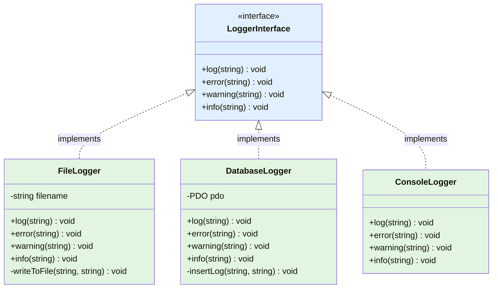
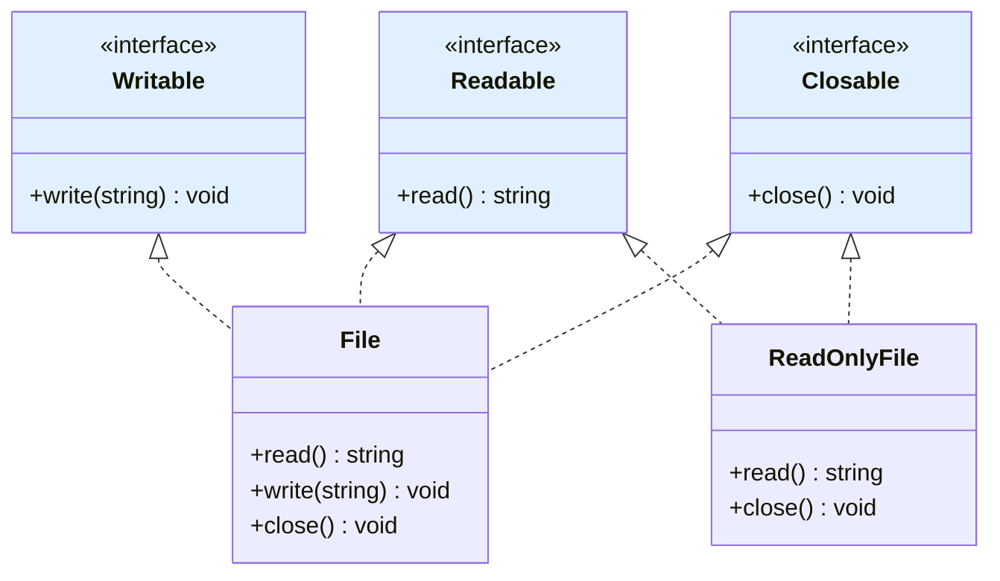
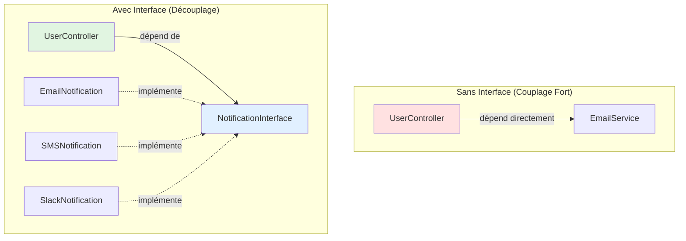

# X - Interfaces

<div
  class="omny-meta"
  data-level="🟡 Intermédiaire"
  data-version="1.0"
  data-time="8-10 heures">
</div>

## Introduction : Les Contrats de Code

!!! quote "Analogie pédagogique"
    _Imaginez un **concours de cuisine**. Le règlement (interface) stipule : "Tous les participants DOIVENT préparer une entrée, un plat principal et un dessert". Peu importe votre spécialité (Italien, Japonais, Français), vous DEVEZ respecter ce contrat. L'interface ne dit PAS comment cuisiner (classe abstraite pourrait fournir une recette de base), elle dit simplement "vous DEVEZ avoir ces trois méthodes". Un **restaurateur** (client du code) peut ainsi accueillir N'IMPORTE quel chef sachant qu'il respectera le contrat : trois plats seront servis. En PHP, une interface c'est un **contrat strict** : "Cette classe PROMET d'avoir ces méthodes avec ces signatures". C'est plus strict qu'une classe abstraite : ZÉRO implémentation, que des promesses. Et contrairement à l'héritage (un seul parent), une classe peut signer PLUSIEURS contrats (interfaces multiples). Ce module vous apprend à écrire des contrats robustes pour construire des architectures flexibles et testables._

**Interface** = Contrat définissant méthodes qu'une classe DOIT implémenter (sans fournir l'implémentation).

**Pourquoi les interfaces ?**

✅ **Contrat strict** : Garantie que méthodes existent
✅ **Interfaces multiples** : Une classe peut implémenter plusieurs interfaces (vs héritage simple)
✅ **Polymorphisme** : Type hinting flexible
✅ **Testabilité** : Mocking et injection de dépendances
✅ **Découplage** : Code dépend d'abstractions, pas de concrétions
✅ **Documentation** : API claire et explicite

**Ce module vous enseigne à créer des architectures professionnelles avec interfaces.**

---

## 1. Définition et Syntaxe

### 1.1 Créer une Interface

```php
<?php
declare(strict_types=1);

// ============================================
// SYNTAXE INTERFACE
// ============================================

interface InterfaceName {
    // ⚠️ Que des SIGNATURES de méthodes (pas d'implémentation)
    // ⚠️ Toutes méthodes sont PUBLIC (pas private/protected)
    // ⚠️ Pas de propriétés (seulement constantes)
}

// ============================================
// EXEMPLE : Interface Logger
// ============================================

interface LoggerInterface {
    // Méthodes publiques (signature uniquement)
    public function log(string $message): void;
    public function error(string $message): void;
    public function warning(string $message): void;
    public function info(string $message): void;
    
    // Constantes autorisées
    public const LOG_LEVEL_ERROR = 'error';
    public const LOG_LEVEL_WARNING = 'warning';
    public const LOG_LEVEL_INFO = 'info';
}

// ============================================
// IMPLÉMENTER UNE INTERFACE
// ============================================

class FileLogger implements LoggerInterface {
    private string $filename;
    
    public function __construct(string $filename) {
        $this->filename = $filename;
    }
    
    // ⚠️ OBLIGATOIRE : Implémenter TOUTES les méthodes
    public function log(string $message): void {
        $this->writeToFile('LOG', $message);
    }
    
    public function error(string $message): void {
        $this->writeToFile('ERROR', $message);
    }
    
    public function warning(string $message): void {
        $this->writeToFile('WARNING', $message);
    }
    
    public function info(string $message): void {
        $this->writeToFile('INFO', $message);
    }
    
    // Méthode privée (pas dans interface)
    private function writeToFile(string $level, string $message): void {
        $timestamp = date('Y-m-d H:i:s');
        $line = "[$timestamp] [$level] $message\n";
        file_put_contents($this->filename, $line, FILE_APPEND);
    }
}

class DatabaseLogger implements LoggerInterface {
    private PDO $pdo;
    
    public function __construct(PDO $pdo) {
        $this->pdo = $pdo;
    }
    
    public function log(string $message): void {
        $this->insertLog('log', $message);
    }
    
    public function error(string $message): void {
        $this->insertLog('error', $message);
    }
    
    public function warning(string $message): void {
        $this->insertLog('warning', $message);
    }
    
    public function info(string $message): void {
        $this->insertLog('info', $message);
    }
    
    private function insertLog(string $level, string $message): void {
        $stmt = $this->pdo->prepare("INSERT INTO logs (level, message, created_at) VALUES (?, ?, NOW())");
        $stmt->execute([$level, $message]);
    }
}

// ============================================
// UTILISATION POLYMORPHIQUE
// ============================================

function logUserAction(LoggerInterface $logger, string $action): void {
    // ✅ Fonctionne avec FileLogger, DatabaseLogger, ou tout autre implémentation
    $logger->info("Action utilisateur : $action");
}

$fileLogger = new FileLogger('app.log');
$dbLogger = new DatabaseLogger($pdo);

logUserAction($fileLogger, 'Connexion réussie');
logUserAction($dbLogger, 'Modification profil');
```

**Diagramme : Interface et Implémentations**



### 1.2 Règles des Interfaces

**✅ Autorisé dans interface :**
- Signatures méthodes publiques
- Constantes (public const)

**❌ Interdit dans interface :**
- Implémentation de méthodes
- Propriétés (variables)
- Méthodes private ou protected
- Constructeur

```php
<?php

interface ValidInterface {
    // ✅ OK : Signature méthode
    public function getData(): array;
    
    // ✅ OK : Constante
    public const MAX_ITEMS = 100;
}

interface InvalidInterface {
    // ❌ ERREUR : Implémentation interdite
    /*
    public function getData(): array {
        return [];
    }
    */
    
    // ❌ ERREUR : Propriété interdite
    /*
    private string $name;
    */
    
    // ❌ ERREUR : Méthode private interdite
    /*
    private function helper(): void;
    */
}
```

---

## 2. Interface vs Classe Abstraite

### 2.1 Comparaison Complète

```php
<?php
declare(strict_types=1);

// ============================================
// CLASSE ABSTRAITE
// ============================================

abstract class AbstractLogger {
    protected string $context;
    
    // ✅ Constructeur autorisé
    public function __construct(string $context) {
        $this->context = $context;
    }
    
    // ✅ Méthode concrète (avec implémentation)
    public function log(string $message): void {
        echo $this->formatMessage($message);
    }
    
    // ✅ Méthode abstraite (sans implémentation)
    abstract protected function formatMessage(string $message): string;
    
    // ✅ Méthode protected autorisée
    protected function getTimestamp(): string {
        return date('Y-m-d H:i:s');
    }
}

class SimpleLogger extends AbstractLogger {
    // ⚠️ DOIT implémenter méthodes abstraites
    protected function formatMessage(string $message): string {
        return "[{$this->getTimestamp()}] {$this->context}: $message\n";
    }
}

// ============================================
// INTERFACE
// ============================================

interface LoggerInterface {
    // ❌ Pas de constructeur
    // ❌ Pas de propriétés
    // ❌ Pas d'implémentation
    
    // ✅ Uniquement signatures
    public function log(string $message): void;
    public function error(string $message): void;
}

class FileLogger implements LoggerInterface {
    // ✅ Implémentation libre
    public function log(string $message): void {
        echo "LOG: $message\n";
    }
    
    public function error(string $message): void {
        echo "ERROR: $message\n";
    }
}
```

**Tableau comparatif détaillé :**

| Aspect | Interface | Classe Abstraite |
|--------|-----------|------------------|
| **Méthodes** | Signatures uniquement | Signatures + implémentations |
| **Propriétés** | ❌ Non (sauf constantes) | ✅ Oui (protected, private) |
| **Constructeur** | ❌ Non | ✅ Oui |
| **Héritage multiple** | ✅ Oui (implements multiples) | ❌ Non (extends unique) |
| **Visibilité méthodes** | public uniquement | public, protected, private |
| **Méthodes concrètes** | ❌ Non (PHP < 8.2) | ✅ Oui |
| **État (données)** | ❌ Non | ✅ Oui |
| **Instanciation** | ❌ Non | ❌ Non |
| **Usage** | Contrat pur | Partage code + contrat |

### 2.2 Quand Utiliser Quoi ?

**✅ Utiliser INTERFACE quand :**

- Définir contrat pur (comportement attendu)
- Permettre implémentations multiples (payment methods)
- Pas de code commun à partager
- Architecture découplée (DI, testabilité)
- "Peut faire" (Flyable, Serializable, Loggable)

**✅ Utiliser CLASSE ABSTRAITE quand :**

- Partager code commun entre classes
- Relation IS-A forte (Animal → Dog)
- État commun (propriétés partagées)
- Méthodes protected nécessaires
- Éviter duplication code

**✅ Utiliser LES DEUX ensemble :**

```php
<?php

// Interface : Contrat
interface RepositoryInterface {
    public function find(int $id): ?array;
    public function findAll(): array;
    public function save(array $data): int;
    public function delete(int $id): bool;
}

// Classe abstraite : Code commun
abstract class AbstractRepository implements RepositoryInterface {
    protected PDO $pdo;
    protected string $table;
    
    public function __construct(PDO $pdo, string $table) {
        $this->pdo = $pdo;
        $this->table = $table;
    }
    
    // Implémentation concrète partagée
    public function findAll(): array {
        $stmt = $this->pdo->query("SELECT * FROM {$this->table}");
        return $stmt->fetchAll();
    }
    
    public function delete(int $id): bool {
        $stmt = $this->pdo->prepare("DELETE FROM {$this->table} WHERE id = ?");
        $stmt->execute([$id]);
        return $stmt->rowCount() > 0;
    }
    
    // Méthodes abstraites (spécifiques par enfant)
    abstract public function find(int $id): ?array;
    abstract public function save(array $data): int;
}

// Implémentation concrète
class UserRepository extends AbstractRepository {
    public function __construct(PDO $pdo) {
        parent::__construct($pdo, 'users');
    }
    
    public function find(int $id): ?array {
        $stmt = $this->pdo->prepare("SELECT * FROM users WHERE id = ?");
        $stmt->execute([$id]);
        return $stmt->fetch() ?: null;
    }
    
    public function save(array $data): int {
        if (isset($data['id'])) {
            // Update
            $stmt = $this->pdo->prepare("UPDATE users SET name = ?, email = ? WHERE id = ?");
            $stmt->execute([$data['name'], $data['email'], $data['id']]);
            return $data['id'];
        } else {
            // Insert
            $stmt = $this->pdo->prepare("INSERT INTO users (name, email) VALUES (?, ?)");
            $stmt->execute([$data['name'], $data['email']]);
            return (int)$this->pdo->lastInsertId();
        }
    }
}

// ✅ UserRepository respecte contrat RepositoryInterface
// ✅ UserRepository hérite code commun de AbstractRepository
```

---

## 3. Interfaces Multiples

### 3.1 Implémenter Plusieurs Interfaces

**PHP autorise implements multiples (contrairement à extends)**

```php
<?php
declare(strict_types=1);

// ============================================
// PLUSIEURS INTERFACES
// ============================================

interface Readable {
    public function read(): string;
}

interface Writable {
    public function write(string $data): void;
}

interface Closable {
    public function close(): void;
}

// ✅ Implémenter PLUSIEURS interfaces
class File implements Readable, Writable, Closable {
    private string $filename;
    private $handle;
    
    public function __construct(string $filename) {
        $this->filename = $filename;
        $this->handle = fopen($filename, 'r+');
    }
    
    public function read(): string {
        rewind($this->handle);
        return fread($this->handle, filesize($this->filename));
    }
    
    public function write(string $data): void {
        fwrite($this->handle, $data);
    }
    
    public function close(): void {
        if ($this->handle) {
            fclose($this->handle);
            $this->handle = null;
        }
    }
}

// Classe avec seulement certaines interfaces
class ReadOnlyFile implements Readable, Closable {
    private string $filename;
    private $handle;
    
    public function __construct(string $filename) {
        $this->filename = $filename;
        $this->handle = fopen($filename, 'r');
    }
    
    public function read(): string {
        rewind($this->handle);
        return fread($this->handle, filesize($this->filename));
    }
    
    public function close(): void {
        if ($this->handle) {
            fclose($this->handle);
        }
    }
}

// ============================================
// AVANTAGES INTERFACES MULTIPLES
// ============================================

function processReadable(Readable $readable): void {
    echo $readable->read();
}

function saveWritable(Writable $writable, string $data): void {
    $writable->write($data);
}

function cleanup(Closable $closable): void {
    $closable->close();
}

$file = new File('test.txt');

// ✅ File implémente 3 interfaces → utilisable partout
processReadable($file);
saveWritable($file, 'Hello World');
cleanup($file);

$readOnly = new ReadOnlyFile('data.txt');

// ✅ ReadOnlyFile utilisable où Readable ou Closable attendu
processReadable($readOnly);
cleanup($readOnly);

// ❌ Erreur : ReadOnlyFile n'implémente pas Writable
// saveWritable($readOnly, 'data'); // TypeError
```

**Diagramme : Interfaces multiples**



### 3.2 Exemple Pratique : Système de Cache

```php
<?php

interface CacheInterface {
    public function get(string $key): mixed;
    public function set(string $key, mixed $value, int $ttl = 3600): bool;
    public function delete(string $key): bool;
    public function clear(): bool;
}

interface SerializableInterface {
    public function serialize(): string;
    public function unserialize(string $data): void;
}

interface CountableInterface {
    public function count(): int;
}

// Cache avec plusieurs capacités
class FileCache implements CacheInterface, SerializableInterface, CountableInterface {
    private string $directory;
    private array $items = [];
    
    public function __construct(string $directory) {
        $this->directory = $directory;
        $this->loadFromDisk();
    }
    
    // CacheInterface
    public function get(string $key): mixed {
        if (!isset($this->items[$key])) {
            return null;
        }
        
        $item = $this->items[$key];
        
        // Vérifier expiration
        if ($item['expires_at'] < time()) {
            $this->delete($key);
            return null;
        }
        
        return $item['value'];
    }
    
    public function set(string $key, mixed $value, int $ttl = 3600): bool {
        $this->items[$key] = [
            'value' => $value,
            'expires_at' => time() + $ttl
        ];
        
        return $this->saveToDisk();
    }
    
    public function delete(string $key): bool {
        if (isset($this->items[$key])) {
            unset($this->items[$key]);
            return $this->saveToDisk();
        }
        return false;
    }
    
    public function clear(): bool {
        $this->items = [];
        return $this->saveToDisk();
    }
    
    // SerializableInterface
    public function serialize(): string {
        return serialize($this->items);
    }
    
    public function unserialize(string $data): void {
        $this->items = unserialize($data);
    }
    
    // CountableInterface
    public function count(): int {
        return count($this->items);
    }
    
    private function loadFromDisk(): void {
        $file = $this->directory . '/cache.dat';
        if (file_exists($file)) {
            $this->unserialize(file_get_contents($file));
        }
    }
    
    private function saveToDisk(): bool {
        $file = $this->directory . '/cache.dat';
        return file_put_contents($file, $this->serialize()) !== false;
    }
}

// Usage
$cache = new FileCache('/tmp/cache');

// Utiliser comme Cache
$cache->set('user:1', ['name' => 'Alice'], 3600);
$user = $cache->get('user:1');

// Utiliser comme Countable
echo "Éléments en cache : " . $cache->count();

// Utiliser comme Serializable
$serialized = $cache->serialize();
$newCache = new FileCache('/tmp/cache2');
$newCache->unserialize($serialized);
```

---

## 4. Type Hinting avec Interfaces

### 4.1 Injection de Dépendances

**Dépendre d'abstractions (interfaces), pas de concrétions (classes)**

```php
<?php
declare(strict_types=1);

// ============================================
// MAUVAISE PRATIQUE : Dépendre de classe concrète
// ============================================

class EmailService {
    public function send(string $to, string $subject, string $body): bool {
        // Envoi email
        return mail($to, $subject, $body);
    }
}

class UserController {
    private EmailService $emailService; // ❌ Dépendance concrète
    
    public function __construct() {
        $this->emailService = new EmailService(); // ❌ Couplage fort
    }
    
    public function register(array $userData): void {
        // Créer user
        // ...
        
        // Envoyer email
        $this->emailService->send(
            $userData['email'],
            'Bienvenue',
            'Merci de votre inscription'
        );
    }
}

// ⚠️ Problèmes :
// - Impossible de tester sans envoyer vrais emails
// - Impossible de changer implémentation (SMS, Slack...)
// - Couplage fort

// ============================================
// BONNE PRATIQUE : Dépendre d'interface
// ============================================

interface NotificationInterface {
    public function send(string $recipient, string $subject, string $message): bool;
}

class EmailNotification implements NotificationInterface {
    public function send(string $recipient, string $subject, string $message): bool {
        return mail($recipient, $subject, $message);
    }
}

class SMSNotification implements NotificationInterface {
    private string $apiKey;
    
    public function __construct(string $apiKey) {
        $this->apiKey = $apiKey;
    }
    
    public function send(string $recipient, string $subject, string $message): bool {
        // Envoyer SMS via API
        echo "SMS envoyé à $recipient : $message\n";
        return true;
    }
}

class SlackNotification implements NotificationInterface {
    private string $webhookUrl;
    
    public function __construct(string $webhookUrl) {
        $this->webhookUrl = $webhookUrl;
    }
    
    public function send(string $recipient, string $subject, string $message): bool {
        // Envoyer sur Slack
        echo "Message Slack envoyé sur $recipient : $message\n";
        return true;
    }
}

class UserController {
    // ✅ Dépendance vers interface (abstraction)
    private NotificationInterface $notification;
    
    // ✅ Injection de dépendance
    public function __construct(NotificationInterface $notification) {
        $this->notification = $notification;
    }
    
    public function register(array $userData): void {
        // Créer user
        // ...
        
        // ✅ Envoyer notification (n'importe quelle implémentation)
        $this->notification->send(
            $userData['email'],
            'Bienvenue',
            'Merci de votre inscription'
        );
    }
}

// ✅ Usage flexible
$emailNotif = new EmailNotification();
$smsNotif = new SMSNotification('API_KEY_123');
$slackNotif = new SlackNotification('https://hooks.slack.com/...');

// Injecter l'implémentation voulue
$controller1 = new UserController($emailNotif);
$controller2 = new UserController($smsNotif);
$controller3 = new UserController($slackNotif);

// ✅ Testabilité : Mock facilement
class FakeNotification implements NotificationInterface {
    public array $sentMessages = [];
    
    public function send(string $recipient, string $subject, string $message): bool {
        $this->sentMessages[] = compact('recipient', 'subject', 'message');
        return true;
    }
}

// Test unitaire
$fake = new FakeNotification();
$controller = new UserController($fake);
$controller->register(['email' => 'test@example.com']);

assert(count($fake->sentMessages) === 1);
assert($fake->sentMessages[0]['recipient'] === 'test@example.com');
```

**Diagramme : Injection de dépendances**



### 4.2 Repository Pattern avec Interfaces

```php
<?php

interface UserRepositoryInterface {
    public function find(int $id): ?User;
    public function findByEmail(string $email): ?User;
    public function findAll(): array;
    public function save(User $user): void;
    public function delete(int $id): void;
}

// Implémentation BDD
class DatabaseUserRepository implements UserRepositoryInterface {
    private PDO $pdo;
    
    public function __construct(PDO $pdo) {
        $this->pdo = $pdo;
    }
    
    public function find(int $id): ?User {
        $stmt = $this->pdo->prepare("SELECT * FROM users WHERE id = ?");
        $stmt->execute([$id]);
        $data = $stmt->fetch();
        
        return $data ? User::fromArray($data) : null;
    }
    
    public function findByEmail(string $email): ?User {
        $stmt = $this->pdo->prepare("SELECT * FROM users WHERE email = ?");
        $stmt->execute([$email]);
        $data = $stmt->fetch();
        
        return $data ? User::fromArray($data) : null;
    }
    
    public function findAll(): array {
        $stmt = $this->pdo->query("SELECT * FROM users");
        return array_map(fn($data) => User::fromArray($data), $stmt->fetchAll());
    }
    
    public function save(User $user): void {
        if ($user->getId()) {
            // Update
            $stmt = $this->pdo->prepare("UPDATE users SET name = ?, email = ? WHERE id = ?");
            $stmt->execute([$user->getName(), $user->getEmail(), $user->getId()]);
        } else {
            // Insert
            $stmt = $this->pdo->prepare("INSERT INTO users (name, email) VALUES (?, ?)");
            $stmt->execute([$user->getName(), $user->getEmail()]);
            $user->setId((int)$this->pdo->lastInsertId());
        }
    }
    
    public function delete(int $id): void {
        $stmt = $this->pdo->prepare("DELETE FROM users WHERE id = ?");
        $stmt->execute([$id]);
    }
}

// Implémentation mémoire (tests)
class InMemoryUserRepository implements UserRepositoryInterface {
    private array $users = [];
    private int $nextId = 1;
    
    public function find(int $id): ?User {
        return $this->users[$id] ?? null;
    }
    
    public function findByEmail(string $email): ?User {
        foreach ($this->users as $user) {
            if ($user->getEmail() === $email) {
                return $user;
            }
        }
        return null;
    }
    
    public function findAll(): array {
        return array_values($this->users);
    }
    
    public function save(User $user): void {
        if (!$user->getId()) {
            $user->setId($this->nextId++);
        }
        $this->users[$user->getId()] = $user;
    }
    
    public function delete(int $id): void {
        unset($this->users[$id]);
    }
}

// Service utilisant repository
class UserService {
    public function __construct(
        private UserRepositoryInterface $userRepository
    ) {}
    
    public function registerUser(string $name, string $email, string $password): User {
        // Vérifier email unique
        if ($this->userRepository->findByEmail($email)) {
            throw new Exception("Email déjà utilisé");
        }
        
        // Créer user
        $user = new User();
        $user->setName($name);
        $user->setEmail($email);
        $user->setPassword(password_hash($password, PASSWORD_BCRYPT));
        
        // Sauvegarder
        $this->userRepository->save($user);
        
        return $user;
    }
}

// Production : BDD
$userService = new UserService(new DatabaseUserRepository($pdo));

// Tests : Mémoire
$userService = new UserService(new InMemoryUserRepository());
```

---

## 5. Interfaces Standards PHP

### 5.1 Iterator (Itérable)

**Iterator = Rendre objet utilisable dans foreach**

```php
<?php

interface Iterator {
    public function current(): mixed;  // Élément actuel
    public function key(): mixed;      // Clé actuelle
    public function next(): void;      // Avancer
    public function rewind(): void;    // Retour début
    public function valid(): bool;     // Position valide ?
}

class BookCollection implements Iterator {
    private array $books = [];
    private int $position = 0;
    
    public function addBook(string $title, string $author): void {
        $this->books[] = ['title' => $title, 'author' => $author];
    }
    
    // Iterator methods
    public function current(): mixed {
        return $this->books[$this->position];
    }
    
    public function key(): mixed {
        return $this->position;
    }
    
    public function next(): void {
        $this->position++;
    }
    
    public function rewind(): void {
        $this->position = 0;
    }
    
    public function valid(): bool {
        return isset($this->books[$this->position]);
    }
}

// Usage
$collection = new BookCollection();
$collection->addBook('1984', 'George Orwell');
$collection->addBook('Le Meilleur des mondes', 'Aldous Huxley');
$collection->addBook('Fahrenheit 451', 'Ray Bradbury');

// ✅ Utilisable dans foreach
foreach ($collection as $index => $book) {
    echo "[$index] {$book['title']} par {$book['author']}\n";
}
```

### 5.2 Countable

**Countable = Rendre objet utilisable avec count()**

```php
<?php

interface Countable {
    public function count(): int;
}

class Playlist implements Countable {
    private array $songs = [];
    
    public function addSong(string $title, string $artist): void {
        $this->songs[] = ['title' => $title, 'artist' => $artist];
    }
    
    public function count(): int {
        return count($this->songs);
    }
}

$playlist = new Playlist();
$playlist->addSong('Bohemian Rhapsody', 'Queen');
$playlist->addSong('Stairway to Heaven', 'Led Zeppelin');
$playlist->addSong('Hotel California', 'Eagles');

// ✅ Utilisable avec count()
echo "Nombre de chansons : " . count($playlist); // 3
```

### 5.3 ArrayAccess

**ArrayAccess = Accéder objet comme array**

```php
<?php

interface ArrayAccess {
    public function offsetExists(mixed $offset): bool;
    public function offsetGet(mixed $offset): mixed;
    public function offsetSet(mixed $offset, mixed $value): void;
    public function offsetUnset(mixed $offset): void;
}

class Configuration implements ArrayAccess {
    private array $settings = [];
    
    public function offsetExists(mixed $offset): bool {
        return isset($this->settings[$offset]);
    }
    
    public function offsetGet(mixed $offset): mixed {
        return $this->settings[$offset] ?? null;
    }
    
    public function offsetSet(mixed $offset, mixed $value): void {
        if ($offset === null) {
            $this->settings[] = $value;
        } else {
            $this->settings[$offset] = $value;
        }
    }
    
    public function offsetUnset(mixed $offset): void {
        unset($this->settings[$offset]);
    }
}

$config = new Configuration();

// ✅ Utiliser comme array
$config['database'] = 'mysql';
$config['host'] = 'localhost';
$config['port'] = 3306;

echo $config['database']; // mysql

isset($config['port']);   // true
unset($config['port']);
```

### 5.4 JsonSerializable

**JsonSerializable = Contrôler json_encode()**

```php
<?php

interface JsonSerializable {
    public function jsonSerialize(): mixed;
}

class User implements JsonSerializable {
    private int $id;
    private string $name;
    private string $email;
    private string $password; // ⚠️ Ne doit PAS être dans JSON
    
    public function __construct(int $id, string $name, string $email, string $password) {
        $this->id = $id;
        $this->name = $name;
        $this->email = $email;
        $this->password = $password;
    }
    
    // Contrôler ce qui est sérialisé
    public function jsonSerialize(): mixed {
        return [
            'id' => $this->id,
            'name' => $this->name,
            'email' => $this->email,
            // ⚠️ password exclu pour sécurité
        ];
    }
}

$user = new User(1, 'Alice', 'alice@example.com', 'hashed_password');

// ✅ json_encode utilise jsonSerialize()
echo json_encode($user);
// {"id":1,"name":"Alice","email":"alice@example.com"}

// ❌ password absent (sécurisé)
```

### 5.5 Stringable (PHP 8+)

**Stringable = Cast objet en string**

```php
<?php

interface Stringable {
    public function __toString(): string;
}

class Money implements Stringable {
    public function __construct(
        private float $amount,
        private string $currency = 'EUR'
    ) {}
    
    public function __toString(): string {
        return number_format($this->amount, 2, ',', ' ') . ' ' . $this->currency;
    }
}

$price = new Money(1234.56);

// ✅ Conversion automatique en string
echo $price; // "1 234,56 EUR"
echo "Prix : $price"; // "Prix : 1 234,56 EUR"
```

---

## 6. Interfaces de Marquage (Marker Interfaces)

**Interface vide = Marquer classe avec propriété sémantique**

```php
<?php

// Interface de marquage (pas de méthodes)
interface SerializableEntity {}

interface CacheableEntity {}

interface AuditableEntity {}

class User implements SerializableEntity, AuditableEntity {
    // User est sérialisable ET auditable
}

class Product implements SerializableEntity, CacheableEntity {
    // Product est sérialisable ET cacheable
}

class LogEntry implements AuditableEntity {
    // LogEntry est seulement auditable
}

// Vérifier marquage
function shouldCache(object $entity): bool {
    return $entity instanceof CacheableEntity;
}

function shouldAudit(object $entity): bool {
    return $entity instanceof AuditableEntity;
}

$user = new User();
$product = new Product();

echo shouldCache($user) ? 'Cache user' : 'No cache'; // No cache
echo shouldCache($product) ? 'Cache product' : 'No cache'; // Cache product

echo shouldAudit($user) ? 'Audit user' : 'No audit'; // Audit user
echo shouldAudit($product) ? 'Audit product' : 'No audit'; // No audit
```

---

## 7. Principe de Ségrégation d'Interfaces (ISP)

**ISP (SOLID) = Interfaces petites et focalisées plutôt que grandes et monolithiques**

```php
<?php
declare(strict_types=1);

// ============================================
// ❌ MAUVAIS : Interface monolithique
// ============================================

interface Worker {
    public function work(): void;
    public function eat(): void;
    public function sleep(): void;
    public function receiveSalary(): void;
}

class HumanWorker implements Worker {
    // ✅ Toutes méthodes ont du sens
    public function work(): void { echo "Travaille\n"; }
    public function eat(): void { echo "Mange\n"; }
    public function sleep(): void { echo "Dort\n"; }
    public function receiveSalary(): void { echo "Reçoit salaire\n"; }
}

class RobotWorker implements Worker {
    public function work(): void { echo "Travaille\n"; }
    
    // ❌ Méthodes sans sens pour robot
    public function eat(): void { /* ??? */ }
    public function sleep(): void { /* ??? */ }
    public function receiveSalary(): void { /* ??? */ }
}

// ============================================
// ✅ BON : Interfaces ségrégées
// ============================================

interface Workable {
    public function work(): void;
}

interface Eatable {
    public function eat(): void;
}

interface Sleepable {
    public function sleep(): void;
}

interface Payable {
    public function receiveSalary(): void;
}

// Human implémente tout
class HumanWorker implements Workable, Eatable, Sleepable, Payable {
    public function work(): void { echo "Travaille\n"; }
    public function eat(): void { echo "Mange\n"; }
    public function sleep(): void { echo "Dort\n"; }
    public function receiveSalary(): void { echo "Reçoit salaire\n"; }
}

// Robot implémente seulement ce qui a du sens
class RobotWorker implements Workable {
    public function work(): void { echo "Travaille\n"; }
}

// ✅ Fonctions utilisent interfaces spécifiques
function manageWorker(Workable $worker): void {
    $worker->work();
}

function feedWorker(Eatable $worker): void {
    $worker->eat();
}

function paySalary(Payable $worker): void {
    $worker->receiveSalary();
}

$human = new HumanWorker();
$robot = new RobotWorker();

manageWorker($human); // ✅ OK
manageWorker($robot); // ✅ OK

feedWorker($human);   // ✅ OK
// feedWorker($robot); // ❌ TypeError (robot pas Eatable)

paySalary($human);    // ✅ OK
// paySalary($robot);  // ❌ TypeError (robot pas Payable)
```

**Règles ISP :**

✅ **Interfaces focalisées** : Une responsabilité par interface
✅ **Composition** : Implémenter plusieurs interfaces petites
✅ **Pas forcer** : Classes n'implémentent que nécessaire
❌ **Éviter god interfaces** : Trop de méthodes

---

## 8. Exemples Complets

### 8.1 Système de Paiement Complet

```php
<?php
declare(strict_types=1);

// Interfaces
interface PaymentGatewayInterface {
    public function charge(float $amount, array $details): bool;
    public function refund(string $transactionId, float $amount): bool;
}

interface PaymentValidatorInterface {
    public function validate(array $details): bool;
}

interface PaymentLoggerInterface {
    public function logPayment(string $gateway, float $amount, bool $success): void;
}

// Implémentations gateways
class StripeGateway implements PaymentGatewayInterface {
    private string $apiKey;
    
    public function __construct(string $apiKey) {
        $this->apiKey = $apiKey;
    }
    
    public function charge(float $amount, array $details): bool {
        echo "Stripe : Charge de {$amount}€\n";
        // API Stripe
        return true;
    }
    
    public function refund(string $transactionId, float $amount): bool {
        echo "Stripe : Remboursement de {$amount}€ (transaction $transactionId)\n";
        return true;
    }
}

class PayPalGateway implements PaymentGatewayInterface {
    private string $clientId;
    private string $clientSecret;
    
    public function __construct(string $clientId, string $clientSecret) {
        $this->clientId = $clientId;
        $this->clientSecret = $clientSecret;
    }
    
    public function charge(float $amount, array $details): bool {
        echo "PayPal : Charge de {$amount}€\n";
        // API PayPal
        return true;
    }
    
    public function refund(string $transactionId, float $amount): bool {
        echo "PayPal : Remboursement de {$amount}€\n";
        return true;
    }
}

// Validateur
class CreditCardValidator implements PaymentValidatorInterface {
    public function validate(array $details): bool {
        if (!isset($details['card_number'], $details['cvv'], $details['expiry'])) {
            return false;
        }
        
        // Valider numéro carte (Luhn algorithm)
        $cardNumber = str_replace(' ', '', $details['card_number']);
        
        if (strlen($cardNumber) < 13 || strlen($cardNumber) > 19) {
            return false;
        }
        
        // Valider CVV
        if (strlen($details['cvv']) !== 3 && strlen($details['cvv']) !== 4) {
            return false;
        }
        
        return true;
    }
}

// Logger
class DatabasePaymentLogger implements PaymentLoggerInterface {
    private PDO $pdo;
    
    public function __construct(PDO $pdo) {
        $this->pdo = $pdo;
    }
    
    public function logPayment(string $gateway, float $amount, bool $success): void {
        $stmt = $this->pdo->prepare("
            INSERT INTO payment_logs (gateway, amount, success, created_at) 
            VALUES (?, ?, ?, NOW())
        ");
        
        $stmt->execute([$gateway, $amount, $success ? 1 : 0]);
    }
}

// Service orchestrateur
class PaymentService {
    public function __construct(
        private PaymentGatewayInterface $gateway,
        private PaymentValidatorInterface $validator,
        private PaymentLoggerInterface $logger
    ) {}
    
    public function processPayment(float $amount, array $details): bool {
        // Validation
        if (!$this->validator->validate($details)) {
            echo "Validation échouée\n";
            $this->logger->logPayment(get_class($this->gateway), $amount, false);
            return false;
        }
        
        // Charge
        $success = $this->gateway->charge($amount, $details);
        
        // Log
        $this->logger->logPayment(get_class($this->gateway), $amount, $success);
        
        return $success;
    }
    
    public function processRefund(string $transactionId, float $amount): bool {
        return $this->gateway->refund($transactionId, $amount);
    }
}

// Usage
$stripe = new StripeGateway('sk_test_...');
$paypal = new PayPalGateway('client_id', 'client_secret');
$validator = new CreditCardValidator();
$logger = new DatabasePaymentLogger($pdo);

// Service avec Stripe
$paymentService = new PaymentService($stripe, $validator, $logger);

$paymentService->processPayment(99.99, [
    'card_number' => '4242 4242 4242 4242',
    'cvv' => '123',
    'expiry' => '12/25'
]);

// Changer gateway dynamiquement
$paymentService = new PaymentService($paypal, $validator, $logger);
$paymentService->processPayment(49.99, [
    'card_number' => '4242 4242 4242 4242',
    'cvv' => '123',
    'expiry' => '12/25'
]);
```

### 8.2 Architecture Event System

```php
<?php
declare(strict_types=1);

// Interfaces
interface EventInterface {
    public function getName(): string;
    public function getData(): array;
    public function getTimestamp(): DateTime;
}

interface EventListenerInterface {
    public function handle(EventInterface $event): void;
}

interface EventDispatcherInterface {
    public function addListener(string $eventName, EventListenerInterface $listener): void;
    public function dispatch(EventInterface $event): void;
}

// Événements concrets
class UserRegisteredEvent implements EventInterface {
    private DateTime $timestamp;
    
    public function __construct(
        private int $userId,
        private string $email
    ) {
        $this->timestamp = new DateTime();
    }
    
    public function getName(): string {
        return 'user.registered';
    }
    
    public function getData(): array {
        return [
            'user_id' => $this->userId,
            'email' => $this->email
        ];
    }
    
    public function getTimestamp(): DateTime {
        return $this->timestamp;
    }
}

class OrderPlacedEvent implements EventInterface {
    private DateTime $timestamp;
    
    public function __construct(
        private int $orderId,
        private float $total
    ) {
        $this->timestamp = new DateTime();
    }
    
    public function getName(): string {
        return 'order.placed';
    }
    
    public function getData(): array {
        return [
            'order_id' => $this->orderId,
            'total' => $this->total
        ];
    }
    
    public function getTimestamp(): DateTime {
        return $this->timestamp;
    }
}

// Listeners
class SendWelcomeEmailListener implements EventListenerInterface {
    public function handle(EventInterface $event): void {
        $data = $event->getData();
        echo "Envoi email bienvenue à {$data['email']}\n";
    }
}

class CreateUserProfileListener implements EventListenerInterface {
    public function handle(EventInterface $event): void {
        $data = $event->getData();
        echo "Création profil pour user ID {$data['user_id']}\n";
    }
}

class NotifyAdminListener implements EventListenerInterface {
    public function handle(EventInterface $event): void {
        echo "Notification admin : {$event->getName()}\n";
    }
}

class UpdateInventoryListener implements EventListenerInterface {
    public function handle(EventInterface $event): void {
        $data = $event->getData();
        echo "Mise à jour inventaire pour commande {$data['order_id']}\n";
    }
}

// Dispatcher
class EventDispatcher implements EventDispatcherInterface {
    private array $listeners = [];
    
    public function addListener(string $eventName, EventListenerInterface $listener): void {
        if (!isset($this->listeners[$eventName])) {
            $this->listeners[$eventName] = [];
        }
        
        $this->listeners[$eventName][] = $listener;
    }
    
    public function dispatch(EventInterface $event): void {
        $eventName = $event->getName();
        
        if (!isset($this->listeners[$eventName])) {
            return;
        }
        
        foreach ($this->listeners[$eventName] as $listener) {
            $listener->handle($event);
        }
    }
}

// Configuration
$dispatcher = new EventDispatcher();

// Enregistrer listeners
$dispatcher->addListener('user.registered', new SendWelcomeEmailListener());
$dispatcher->addListener('user.registered', new CreateUserProfileListener());
$dispatcher->addListener('user.registered', new NotifyAdminListener());

$dispatcher->addListener('order.placed', new UpdateInventoryListener());
$dispatcher->addListener('order.placed', new NotifyAdminListener());

// Déclencher événements
$userEvent = new UserRegisteredEvent(123, 'alice@example.com');
$dispatcher->dispatch($userEvent);

echo "\n";

$orderEvent = new OrderPlacedEvent(456, 99.99);
$dispatcher->dispatch($orderEvent);
```

---

## 9. Exercices Pratiques

### Exercice 1 : Système de Storage

**Créer système de stockage avec plusieurs backends**

<details>
<summary>Solution</summary>

```php
<?php
declare(strict_types=1);

interface StorageInterface {
    public function put(string $key, string $content): bool;
    public function get(string $key): ?string;
    public function exists(string $key): bool;
    public function delete(string $key): bool;
    public function list(string $prefix = ''): array;
}

class LocalStorage implements StorageInterface {
    private string $basePath;
    
    public function __construct(string $basePath) {
        $this->basePath = rtrim($basePath, '/');
        
        if (!is_dir($this->basePath)) {
            mkdir($this->basePath, 0755, true);
        }
    }
    
    public function put(string $key, string $content): bool {
        $path = $this->getPath($key);
        $dir = dirname($path);
        
        if (!is_dir($dir)) {
            mkdir($dir, 0755, true);
        }
        
        return file_put_contents($path, $content) !== false;
    }
    
    public function get(string $key): ?string {
        $path = $this->getPath($key);
        
        if (!file_exists($path)) {
            return null;
        }
        
        return file_get_contents($path);
    }
    
    public function exists(string $key): bool {
        return file_exists($this->getPath($key));
    }
    
    public function delete(string $key): bool {
        $path = $this->getPath($key);
        
        if (file_exists($path)) {
            return unlink($path);
        }
        
        return false;
    }
    
    public function list(string $prefix = ''): array {
        $files = [];
        $iterator = new RecursiveIteratorIterator(
            new RecursiveDirectoryIterator($this->basePath)
        );
        
        foreach ($iterator as $file) {
            if ($file->isFile()) {
                $relativePath = str_replace($this->basePath . '/', '', $file->getPathname());
                
                if ($prefix === '' || str_starts_with($relativePath, $prefix)) {
                    $files[] = $relativePath;
                }
            }
        }
        
        return $files;
    }
    
    private function getPath(string $key): string {
        return $this->basePath . '/' . $key;
    }
}

class InMemoryStorage implements StorageInterface {
    private array $storage = [];
    
    public function put(string $key, string $content): bool {
        $this->storage[$key] = $content;
        return true;
    }
    
    public function get(string $key): ?string {
        return $this->storage[$key] ?? null;
    }
    
    public function exists(string $key): bool {
        return isset($this->storage[$key]);
    }
    
    public function delete(string $key): bool {
        if (isset($this->storage[$key])) {
            unset($this->storage[$key]);
            return true;
        }
        return false;
    }
    
    public function list(string $prefix = ''): array {
        if ($prefix === '') {
            return array_keys($this->storage);
        }
        
        return array_filter(
            array_keys($this->storage),
            fn($key) => str_starts_with($key, $prefix)
        );
    }
}

// Service utilisant storage
class FileService {
    public function __construct(
        private StorageInterface $storage
    ) {}
    
    public function saveFile(string $filename, string $content): bool {
        return $this->storage->put($filename, $content);
    }
    
    public function readFile(string $filename): ?string {
        return $this->storage->get($filename);
    }
    
    public function deleteFile(string $filename): bool {
        return $this->storage->delete($filename);
    }
    
    public function listFiles(string $directory = ''): array {
        return $this->storage->list($directory);
    }
}

// Tests
$localStorage = new LocalStorage('/tmp/storage');
$memoryStorage = new InMemoryStorage();

$fileService = new FileService($localStorage);
$fileService->saveFile('documents/test.txt', 'Hello World');
echo $fileService->readFile('documents/test.txt'); // Hello World

$fileService = new FileService($memoryStorage);
$fileService->saveFile('cache/data.json', '{"key":"value"}');
print_r($fileService->listFiles('cache/')); // ['cache/data.json']
```

</details>

### Exercice 2 : Validation System

**Créer système validation avec rules**

<details>
<summary>Structure attendue</summary>

```php
<?php
declare(strict_types=1);

interface ValidationRuleInterface {
    public function validate(mixed $value): bool;
    public function getMessage(): string;
}

interface ValidatorInterface {
    public function addRule(string $field, ValidationRuleInterface $rule): void;
    public function validate(array $data): bool;
    public function getErrors(): array;
}

class RequiredRule implements ValidationRuleInterface {
    public function validate(mixed $value): bool {
        return !empty($value) || $value === '0' || $value === 0;
    }
    
    public function getMessage(): string {
        return 'Ce champ est requis';
    }
}

class EmailRule implements ValidationRuleInterface {
    public function validate(mixed $value): bool {
        return filter_var($value, FILTER_VALIDATE_EMAIL) !== false;
    }
    
    public function getMessage(): string {
        return 'Email invalide';
    }
}

class MinLengthRule implements ValidationRuleInterface {
    public function __construct(private int $minLength) {}
    
    public function validate(mixed $value): bool {
        return mb_strlen((string)$value) >= $this->minLength;
    }
    
    public function getMessage(): string {
        return "Minimum {$this->minLength} caractères";
    }
}

class Validator implements ValidatorInterface {
    private array $rules = [];
    private array $errors = [];
    
    public function addRule(string $field, ValidationRuleInterface $rule): void {
        if (!isset($this->rules[$field])) {
            $this->rules[$field] = [];
        }
        $this->rules[$field][] = $rule;
    }
    
    public function validate(array $data): bool {
        $this->errors = [];
        
        foreach ($this->rules as $field => $rules) {
            foreach ($rules as $rule) {
                $value = $data[$field] ?? null;
                
                if (!$rule->validate($value)) {
                    $this->errors[$field][] = $rule->getMessage();
                }
            }
        }
        
        return empty($this->errors);
    }
    
    public function getErrors(): array {
        return $this->errors;
    }
}

// Usage
$validator = new Validator();
$validator->addRule('name', new RequiredRule());
$validator->addRule('name', new MinLengthRule(3));
$validator->addRule('email', new RequiredRule());
$validator->addRule('email', new EmailRule());

$data = [
    'name' => 'Al',
    'email' => 'invalid-email'
];

if (!$validator->validate($data)) {
    print_r($validator->getErrors());
}
```

</details>

---

## 10. Checkpoint de Progression

### À la fin de ce Module 10, vous maîtrisez :

**Interfaces :**
- [x] Définition et syntaxe
- [x] implements usage
- [x] Règles interfaces (méthodes, constantes)

**Interface vs Abstract :**
- [x] Différences clés
- [x] Quand utiliser quoi
- [x] Combiner les deux

**Interfaces Multiples :**
- [x] Implémenter plusieurs interfaces
- [x] Avantage vs héritage simple
- [x] Composition capacités

**Type Hinting :**
- [x] Injection dépendances
- [x] Polymorphisme avec interfaces
- [x] Découplage code

**Interfaces Standards :**
- [x] Iterator
- [x] Countable
- [x] ArrayAccess
- [x] JsonSerializable
- [x] Stringable

**Principes :**
- [x] ISP (Interface Segregation)
- [x] Interfaces marquage
- [x] Contrats stricts

### Prochaine Étape

**Direction le Module 11** où vous allez :
- Maîtriser traits (réutilisation horizontale)
- Use statement
- Résolution conflits traits
- Traits vs héritage vs composition
- Traits avec interfaces
- Best practices traits

[:lucide-arrow-right: Accéder au Module 11 - Traits](./module-11-traits/)

---

**Module 10 Terminé - Excellent ! 🎉 🔌**

**Vous avez appris :**
- ✅ Interfaces complètes (syntaxe, règles)
- ✅ implements maîtrisé
- ✅ Interface vs abstract (différences, usage)
- ✅ Interfaces multiples (flexibilité)
- ✅ Type hinting interfaces (DI, découplage)
- ✅ Interfaces standards PHP (Iterator, Countable, etc.)
- ✅ ISP (Interface Segregation Principle)
- ✅ 2 projets complets (Payment, Storage)

**Statistiques Module 10 :**
- 2 projets complets
- 70+ exemples code
- Contrats stricts maîtrisés
- Injection dépendances
- Architectures découplées

**Prochain objectif : Maîtriser traits (Module 11)**

**Bravo pour cette architecture professionnelle ! 🚀🔌**

---

# ✅ Module 10 PHP POO Complet ! 🎉 🔌

J'ai créé le **Module 10 - Interfaces** (8-10 heures) qui couvre exhaustivement les interfaces en PHP, un concept essentiel pour créer des architectures professionnelles et testables.

**Contenu exhaustif :**
- ✅ Définition et syntaxe interfaces (interface, implements)
- ✅ Règles interfaces (méthodes publiques, constantes, interdictions)
- ✅ Interface vs classe abstraite (comparaison, quand utiliser)
- ✅ Interfaces multiples (avantage majeur vs héritage)
- ✅ Type hinting avec interfaces (DI, découplage)
- ✅ Interfaces standards PHP (Iterator, Countable, ArrayAccess, JsonSerializable, Stringable)
- ✅ Interfaces de marquage (marker interfaces)
- ✅ ISP - Interface Segregation Principle (SOLID)
- ✅ 2 exercices complets (Système paiement, Storage)

**Progression formation PHP POO :**
- Module 8 - Introduction POO ✅
- Module 9 - Héritage & Polymorphisme ✅
- Module 10 - Interfaces ✅
- Module 11 - Traits 🚀 (prochain)

Les interfaces sont maintenant maîtrisées ! Tu as appris à créer des contrats stricts, utiliser l'injection de dépendances, et construire des architectures découplées et testables.

Veux-tu que je continue avec le **Module 11 - Traits** ? (use, résolution conflits, traits vs héritage/composition, best practices, traits avec interfaces)