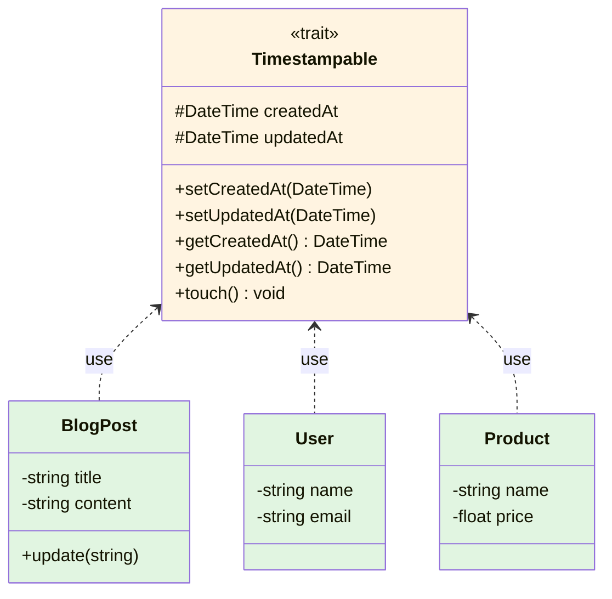
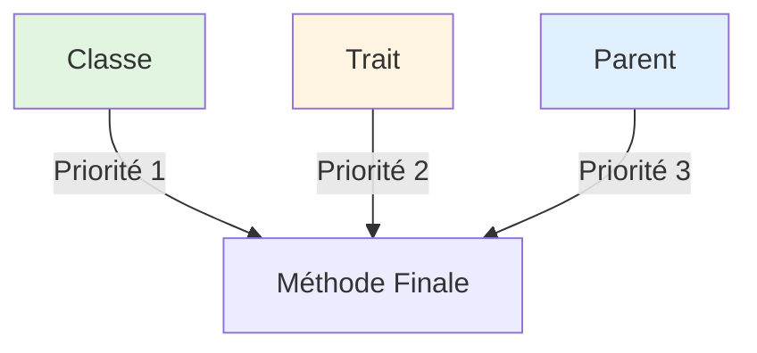

# XI - Traits

<div
  class="omny-meta"
  data-level="🟡 Intermédiaire"
  data-version="1.0"
  data-time="6-8 heures">
</div>

## Introduction : Réutilisation Horizontale

!!! quote "Analogie pédagogique"
    _Imaginez une **cuisine professionnelle**. Chaque chef (classe) a ses spécialités : le chef pâtissier fait des gâteaux, le chef saucier fait des sauces. Mais certaines compétences sont communes : savoir utiliser un couteau, peser des ingrédients, nettoyer son plan de travail. En **héritage classique**, vous créeriez une classe "Chef" avec ces compétences de base, et tous les chefs hériteraient. Mais que faire si vous avez un serveur qui doit aussi peser (portions) ou un sommelier qui doit nettoyer (verres) ? Ils ne sont pas des chefs ! Avec les **traits**, vous créez des "kits de compétences" réutilisables : `trait Weighable`, `trait Cleanable`, `trait KnifeSkills`. N'importe qui dans la cuisine peut "emprunter" ces compétences sans être forcé d'hériter d'une hiérarchie rigide. Les traits sont comme des **lego** : vous assemblez les pièces dont vous avez besoin. Ce module vous apprend à créer du code réutilisable sans les contraintes de l'héritage._

**Trait** = Mécanisme de réutilisation de code en PHP permettant de partager méthodes entre classes sans héritage.

**Pourquoi les traits ?**

✅ **Réutilisation horizontale** : Partager code entre classes non liées
✅ **Éviter duplication** : DRY (Don't Repeat Yourself)
✅ **Pas d'héritage multiple** : PHP n'autorise qu'un parent, traits contournent
✅ **Flexibilité** : Composer fonctionnalités à la carte
✅ **Organisation** : Séparer responsabilités
✅ **Mixins** : Ajouter comportements sans modifier hiérarchie

**Limitations traits :**

⚠️ Pas de polymorphisme (type hinting)
⚠️ Ordre de priorité complexe
⚠️ Risque de couplage caché
⚠️ Difficile de suivre provenance méthodes

**Ce module vous enseigne à utiliser traits efficacement sans tomber dans les pièges.**

---

## 1. Syntaxe de Base

### 1.1 Définir et Utiliser un Trait

```php
<?php
declare(strict_types=1);

// ============================================
// DÉFINIR UN TRAIT
// ============================================

trait Timestampable {
    protected DateTime $createdAt;
    protected ?DateTime $updatedAt = null;
    
    public function setCreatedAt(DateTime $date): void {
        $this->createdAt = $date;
    }
    
    public function setUpdatedAt(DateTime $date): void {
        $this->updatedAt = $date;
    }
    
    public function getCreatedAt(): DateTime {
        return $this->createdAt;
    }
    
    public function getUpdatedAt(): ?DateTime {
        return $this->updatedAt;
    }
    
    public function touch(): void {
        $this->updatedAt = new DateTime();
    }
}

// ============================================
// UTILISER UN TRAIT
// ============================================

class BlogPost {
    use Timestampable; // ✅ "Importer" les méthodes du trait
    
    private string $title;
    private string $content;
    
    public function __construct(string $title, string $content) {
        $this->title = $title;
        $this->content = $content;
        $this->createdAt = new DateTime(); // Propriété du trait
    }
    
    public function update(string $content): void {
        $this->content = $content;
        $this->touch(); // Méthode du trait
    }
}

class User {
    use Timestampable; // ✅ Même trait, classe différente
    
    private string $name;
    private string $email;
    
    public function __construct(string $name, string $email) {
        $this->name = $name;
        $this->email = $email;
        $this->createdAt = new DateTime();
    }
}

// Usage
$post = new BlogPost('Introduction Traits', 'Contenu...');
echo $post->getCreatedAt()->format('Y-m-d H:i:s');

sleep(2);
$post->update('Nouveau contenu');
$post->touch();
echo $post->getUpdatedAt()->format('Y-m-d H:i:s');

$user = new User('Alice', 'alice@example.com');
echo $user->getCreatedAt()->format('Y-m-d H:i:s');
```

**Diagramme : Trait partagé**



### 1.2 Plusieurs Traits

**Une classe peut utiliser plusieurs traits**

```php
<?php

trait Loggable {
    protected array $logs = [];
    
    public function log(string $message): void {
        $this->logs[] = [
            'message' => $message,
            'timestamp' => new DateTime()
        ];
    }
    
    public function getLogs(): array {
        return $this->logs;
    }
}

trait Cacheable {
    private static array $cache = [];
    
    protected function getCached(string $key): mixed {
        return self::$cache[$key] ?? null;
    }
    
    protected function setCache(string $key, mixed $value): void {
        self::$cache[$key] = $value;
    }
    
    protected function clearCache(): void {
        self::$cache = [];
    }
}

trait Validatable {
    protected array $errors = [];
    
    abstract protected function rules(): array;
    
    public function validate(): bool {
        $this->errors = [];
        
        foreach ($this->rules() as $field => $rules) {
            // Logique validation
        }
        
        return empty($this->errors);
    }
    
    public function getErrors(): array {
        return $this->errors;
    }
}

// ✅ Utiliser PLUSIEURS traits
class Article {
    use Timestampable, Loggable, Cacheable, Validatable;
    
    private string $title;
    private string $content;
    
    public function __construct(string $title, string $content) {
        $this->title = $title;
        $this->content = $content;
        $this->createdAt = new DateTime();
        
        $this->log('Article créé');
    }
    
    protected function rules(): array {
        return [
            'title' => ['required', 'min:5'],
            'content' => ['required', 'min:50']
        ];
    }
    
    public function publish(): bool {
        if (!$this->validate()) {
            return false;
        }
        
        $this->log('Article publié');
        $this->setCache("article:{$this->title}", $this);
        
        return true;
    }
}

// Article a maintenant :
// - Propriétés/méthodes de Timestampable
// - Propriétés/méthodes de Loggable
// - Propriétés/méthodes de Cacheable
// - Propriétés/méthodes de Validatable
```

---

## 2. Résolution de Conflits

### 2.1 Conflit de Noms de Méthodes

**Quand 2 traits ont méthode même nom → Erreur fatale**

```php
<?php

trait Logger {
    public function log(string $message): void {
        echo "[LOG] $message\n";
    }
}

trait Auditor {
    public function log(string $message): void {
        echo "[AUDIT] $message\n";
    }
}

// ❌ ERREUR FATALE : Conflit méthode log()
/*
class System {
    use Logger, Auditor;
    // Fatal error: Trait method log has not been applied
}
*/

// ============================================
// SOLUTION 1 : insteadof (choisir une méthode)
// ============================================

class System {
    use Logger, Auditor {
        Logger::log insteadof Auditor; // ✅ Utiliser Logger::log
    }
    
    public function test(): void {
        $this->log('Test'); // Appelle Logger::log
    }
}

$system = new System();
$system->test(); // [LOG] Test

// ============================================
// SOLUTION 2 : as (aliaser méthode)
// ============================================

class SystemWithBoth {
    use Logger, Auditor {
        Logger::log insteadof Auditor;  // log() = Logger::log
        Auditor::log as auditLog;       // auditLog() = Auditor::log
    }
    
    public function test(): void {
        $this->log('Message');         // [LOG] Message
        $this->auditLog('Audit');      // [AUDIT] Audit
    }
}

$system = new SystemWithBoth();
$system->test();
```

### 2.2 Modifier Visibilité avec as

**as permet aussi de changer visibilité**

```php
<?php

trait PrivateHelper {
    private function helper(): string {
        return 'Helper privé';
    }
}

class Service {
    use PrivateHelper {
        // ✅ Rendre public une méthode privée
        helper as public publicHelper;
    }
    
    public function test(): void {
        echo $this->helper();        // Privé (original)
        echo $this->publicHelper();  // Public (alias)
    }
}

$service = new Service();
// $service->helper();       // ❌ Erreur : méthode privée
$service->publicHelper();    // ✅ OK : méthode publique

// Inversement : rendre privée une méthode publique
trait PublicTrait {
    public function doSomething(): void {
        echo "Doing something\n";
    }
}

class RestrictedService {
    use PublicTrait {
        doSomething as private;
    }
    
    public function execute(): void {
        $this->doSomething(); // ✅ OK en interne
    }
}

$restricted = new RestrictedService();
// $restricted->doSomething(); // ❌ Erreur : maintenant privée
$restricted->execute();        // ✅ OK
```

### 2.3 Résolution Complexe

```php
<?php

trait A {
    public function test(): void {
        echo "A::test\n";
    }
    
    public function foo(): void {
        echo "A::foo\n";
    }
}

trait B {
    public function test(): void {
        echo "B::test\n";
    }
    
    public function bar(): void {
        echo "B::bar\n";
    }
}

trait C {
    public function test(): void {
        echo "C::test\n";
    }
}

class Complex {
    use A, B, C {
        // test() : Utiliser A, masquer B et C
        A::test insteadof B, C;
        
        // Créer alias pour B::test et C::test
        B::test as testB;
        C::test as testC;
        
        // foo() : Rendre privé
        A::foo as private;
    }
    
    public function execute(): void {
        $this->test();   // A::test
        $this->testB();  // B::test
        $this->testC();  // C::test
        $this->foo();    // A::foo (privé)
        $this->bar();    // B::bar
    }
}

$obj = new Complex();
$obj->execute();
$obj->testB();
// $obj->foo(); // ❌ Erreur : privé
```

---

## 3. Traits vs Héritage vs Composition

### 3.1 Comparaison Complète

```php
<?php
declare(strict_types=1);

// ============================================
// HÉRITAGE (IS-A)
// ============================================

abstract class Animal {
    protected string $name;
    
    public function __construct(string $name) {
        $this->name = $name;
    }
    
    public function eat(): void {
        echo "{$this->name} mange\n";
    }
}

class Dog extends Animal {
    public function bark(): void {
        echo "{$this->name} aboie\n";
    }
}

// ✅ Dog IS-A Animal (relation claire)
// ❌ Un seul parent possible
// ❌ Hiérarchie rigide

// ============================================
// COMPOSITION (HAS-A)
// ============================================

class Engine {
    public function start(): void {
        echo "Moteur démarré\n";
    }
}

class Car {
    private Engine $engine;
    
    public function __construct(Engine $engine) {
        $this->engine = $engine;
    }
    
    public function start(): void {
        $this->engine->start();
    }
}

// ✅ Car HAS-A Engine (relation claire)
// ✅ Flexibilité (injection)
// ✅ Testabilité (mock Engine)
// ❌ Verbeux (délégation manuelle)

// ============================================
// TRAITS (Mixins)
// ============================================

trait Flyable {
    public function fly(): void {
        echo "Vol en cours\n";
    }
}

trait Swimmable {
    public function swim(): void {
        echo "Nage en cours\n";
    }
}

class Duck {
    use Flyable, Swimmable;
    
    public function quack(): void {
        echo "Coin coin\n";
    }
}

class Airplane {
    use Flyable; // Même trait, classe différente
    
    public function takeOff(): void {
        $this->fly();
    }
}

// ✅ Partage comportements entre classes non liées
// ✅ Plusieurs traits possibles
// ❌ Pas de polymorphisme (pas de type hinting Flyable)
// ❌ Couplage caché
```

**Tableau comparatif :**

| Aspect | Héritage | Composition | Traits |
|--------|----------|-------------|--------|
| **Relation** | IS-A | HAS-A | Mixins |
| **Nombre** | 1 parent | N objets | N traits |
| **Polymorphisme** | ✅ Oui | ✅ Oui (interfaces) | ❌ Non |
| **Flexibilité** | ❌ Rigide | ✅ Flexible | ✅ Flexible |
| **Testabilité** | ⚠️ Moyenne | ✅ Excellente | ⚠️ Moyenne |
| **Verbosité** | ✅ Concis | ❌ Verbeux | ✅ Concis |
| **Usage** | Hiérarchie naturelle | Dépendances | Réutilisation code |

### 3.2 Quand Utiliser Traits ?

**✅ Utiliser traits quand :**

- Partager code entre classes NON liées hiérarchiquement
- Comportements orthogonaux (logging, timestamps, cache)
- Éviter duplication sans forcer héritage
- Pas besoin polymorphisme

**❌ NE PAS utiliser traits quand :**

- Relation IS-A claire → Héritage
- Besoin polymorphisme → Interface + Composition
- État complexe partagé → Classe séparée
- Logique métier critique → Explicite vaut mieux

**Exemple : Mauvais usage trait**

```php
<?php

// ❌ MAUVAIS : Logique métier dans trait
trait PaymentProcessor {
    private string $apiKey;
    
    public function processPayment(float $amount): bool {
        // Logique métier complexe
        // ⚠️ Difficile à tester, couplage caché
        return true;
    }
}

class OrderService {
    use PaymentProcessor; // ❌ Couplage fort invisible
}

// ✅ MEILLEUR : Injection dépendance
interface PaymentProcessorInterface {
    public function processPayment(float $amount): bool;
}

class StripePaymentProcessor implements PaymentProcessorInterface {
    public function __construct(private string $apiKey) {}
    
    public function processPayment(float $amount): bool {
        return true;
    }
}

class OrderService {
    public function __construct(
        private PaymentProcessorInterface $paymentProcessor
    ) {}
}
```

---

## 4. Traits avec Méthodes Abstraites

### 4.1 Forcer Implémentation

**Trait peut déclarer méthodes abstraites → Classe DOIT implémenter**

```php
<?php
declare(strict_types=1);

trait Serializable {
    // Méthode abstraite : classe doit implémenter
    abstract protected function toArray(): array;
    
    // Méthode concrète utilisant l'abstraite
    public function toJson(): string {
        return json_encode($this->toArray());
    }
    
    public function toXml(): string {
        $array = $this->toArray();
        // Conversion XML
        return '<?xml version="1.0"?><data>' . $this->arrayToXml($array) . '</data>';
    }
    
    private function arrayToXml(array $data): string {
        $xml = '';
        foreach ($data as $key => $value) {
            $xml .= "<$key>$value</$key>";
        }
        return $xml;
    }
}

class User {
    use Serializable;
    
    private int $id;
    private string $name;
    private string $email;
    
    public function __construct(int $id, string $name, string $email) {
        $this->id = $id;
        $this->name = $name;
        $this->email = $email;
    }
    
    // ⚠️ OBLIGATOIRE : Implémenter méthode abstraite du trait
    protected function toArray(): array {
        return [
            'id' => $this->id,
            'name' => $this->name,
            'email' => $this->email
        ];
    }
}

class Product {
    use Serializable;
    
    private string $name;
    private float $price;
    
    public function __construct(string $name, float $price) {
        $this->name = $name;
        $this->price = $price;
    }
    
    // ⚠️ OBLIGATOIRE
    protected function toArray(): array {
        return [
            'name' => $this->name,
            'price' => $this->price
        ];
    }
}

// Usage
$user = new User(1, 'Alice', 'alice@example.com');
echo $user->toJson();  // {"id":1,"name":"Alice","email":"alice@example.com"}
echo $user->toXml();   // <?xml version="1.0"?><data><id>1</id>...

$product = new Product('Laptop', 999.99);
echo $product->toJson(); // {"name":"Laptop","price":999.99}
```

### 4.2 Trait avec Propriétés Requises

```php
<?php

trait Sluggable {
    private string $slug;
    
    // ⚠️ Suppose que classe a propriété $title
    abstract protected function getTitle(): string;
    
    public function generateSlug(): void {
        $title = $this->getTitle();
        $this->slug = $this->slugify($title);
    }
    
    public function getSlug(): string {
        if (!isset($this->slug)) {
            $this->generateSlug();
        }
        return $this->slug;
    }
    
    private function slugify(string $text): string {
        $text = strtolower($text);
        $text = preg_replace('/[^a-z0-9]+/', '-', $text);
        return trim($text, '-');
    }
}

class Article {
    use Sluggable;
    
    private string $title;
    
    public function __construct(string $title) {
        $this->title = $title;
    }
    
    protected function getTitle(): string {
        return $this->title;
    }
}

$article = new Article('Introduction aux Traits PHP');
echo $article->getSlug(); // introduction-aux-traits-php
```

---

## 5. Traits Utilisant d'Autres Traits

### 5.1 Composition de Traits

**Trait peut utiliser d'autres traits**

```php
<?php

trait LoggerTrait {
    protected function log(string $message): void {
        echo "[LOG] $message\n";
    }
}

trait TimestampTrait {
    protected function timestamp(): string {
        return date('Y-m-d H:i:s');
    }
}

// Trait composé d'autres traits
trait TimestampedLogger {
    use LoggerTrait, TimestampTrait;
    
    protected function logWithTimestamp(string $message): void {
        $this->log("[{$this->timestamp()}] $message");
    }
}

class Service {
    use TimestampedLogger;
    
    public function execute(): void {
        $this->logWithTimestamp('Service exécuté');
    }
}

$service = new Service();
$service->execute(); // [LOG] [2024-02-08 15:30:45] Service exécuté
```

### 5.2 Hiérarchie de Traits

```php
<?php

trait BaseTrait {
    protected function baseMethod(): string {
        return 'Base';
    }
}

trait MiddleTrait {
    use BaseTrait;
    
    protected function middleMethod(): string {
        return $this->baseMethod() . ' > Middle';
    }
}

trait TopTrait {
    use MiddleTrait;
    
    public function topMethod(): string {
        return $this->middleMethod() . ' > Top';
    }
}

class MyClass {
    use TopTrait;
}

$obj = new MyClass();
echo $obj->topMethod(); // Base > Middle > Top
```

---

## 6. Propriétés dans Traits

### 6.1 Propriétés Partagées

```php
<?php

trait HasAttributes {
    protected array $attributes = [];
    
    public function setAttribute(string $key, mixed $value): void {
        $this->attributes[$key] = $value;
    }
    
    public function getAttribute(string $key): mixed {
        return $this->attributes[$key] ?? null;
    }
    
    public function hasAttribute(string $key): bool {
        return isset($this->attributes[$key]);
    }
    
    public function getAllAttributes(): array {
        return $this->attributes;
    }
}

class User {
    use HasAttributes;
    
    private string $name;
    
    public function __construct(string $name) {
        $this->name = $name;
    }
}

$user = new User('Alice');
$user->setAttribute('age', 25);
$user->setAttribute('city', 'Paris');

echo $user->getAttribute('age');  // 25
print_r($user->getAllAttributes()); // ['age' => 25, 'city' => 'Paris']
```

### 6.2 Conflit de Propriétés

**⚠️ Si classe et trait ont propriété même nom → Erreur fatale**

```php
<?php

trait HasName {
    protected string $name = 'Trait Name';
}

// ❌ ERREUR FATALE : Propriété $name définie dans classe ET trait
/*
class Person {
    use HasName;
    
    protected string $name = 'Person Name'; // Fatal error
}
*/

// ✅ SOLUTION : Pas de conflit de nom
trait HasDisplayName {
    protected string $displayName = 'Default';
    
    public function setDisplayName(string $name): void {
        $this->displayName = $name;
    }
}

class Person {
    use HasDisplayName;
    
    protected string $name; // ✅ Pas de conflit
    
    public function __construct(string $name) {
        $this->name = $name;
        $this->setDisplayName($name);
    }
}
```

---

## 7. Traits et Interfaces

### 7.1 Trait Implémentant Interface

**Classe peut utiliser trait pour implémenter interface**

```php
<?php
declare(strict_types=1);

interface JsonSerializableInterface {
    public function toJson(): string;
    public function fromJson(string $json): void;
}

trait JsonSerializableTrait {
    abstract protected function toArray(): array;
    abstract protected function fromArray(array $data): void;
    
    public function toJson(): string {
        return json_encode($this->toArray());
    }
    
    public function fromJson(string $json): void {
        $data = json_decode($json, true);
        if ($data === null) {
            throw new InvalidArgumentException('JSON invalide');
        }
        $this->fromArray($data);
    }
}

class User implements JsonSerializableInterface {
    use JsonSerializableTrait;
    
    private int $id;
    private string $name;
    private string $email;
    
    public function __construct(int $id, string $name, string $email) {
        $this->id = $id;
        $this->name = $name;
        $this->email = $email;
    }
    
    protected function toArray(): array {
        return [
            'id' => $this->id,
            'name' => $this->name,
            'email' => $this->email
        ];
    }
    
    protected function fromArray(array $data): void {
        $this->id = $data['id'];
        $this->name = $data['name'];
        $this->email = $data['email'];
    }
}

class Product implements JsonSerializableInterface {
    use JsonSerializableTrait;
    
    private string $name;
    private float $price;
    
    public function __construct(string $name, float $price) {
        $this->name = $name;
        $this->price = $price;
    }
    
    protected function toArray(): array {
        return [
            'name' => $this->name,
            'price' => $this->price
        ];
    }
    
    protected function fromArray(array $data): void {
        $this->name = $data['name'];
        $this->price = $data['price'];
    }
}

// ✅ Polymorphisme via interface
function saveAsJson(JsonSerializableInterface $object): void {
    file_put_contents('data.json', $object->toJson());
}

$user = new User(1, 'Alice', 'alice@example.com');
$product = new Product('Laptop', 999.99);

saveAsJson($user);
saveAsJson($product);
```

---

## 8. Ordre de Priorité

### 8.1 Résolution de Méthodes

**Ordre de priorité : Classe > Trait > Parent**

```php
<?php

trait MyTrait {
    public function test(): void {
        echo "Trait::test\n";
    }
}

class ParentClass {
    public function test(): void {
        echo "Parent::test\n";
    }
}

class ChildClass extends ParentClass {
    use MyTrait;
    
    // Ordre : Classe > Trait > Parent
    // test() vient du Trait (pas du Parent)
}

$child = new ChildClass();
$child->test(); // Trait::test

// Si classe redéfinit méthode → Classe gagne
class ChildClassOverride extends ParentClass {
    use MyTrait;
    
    // ✅ Classe override trait ET parent
    public function test(): void {
        echo "Child::test\n";
    }
}

$child = new ChildClassOverride();
$child->test(); // Child::test
```

**Diagramme : Ordre de priorité**



---

## 9. Exemples Complets

### 9.1 Système Complet CRUD avec Traits

```php
<?php
declare(strict_types=1);

// Trait Timestamps
trait Timestampable {
    protected DateTime $createdAt;
    protected DateTime $updatedAt;
    
    protected function initializeTimestamps(): void {
        $now = new DateTime();
        $this->createdAt = $now;
        $this->updatedAt = $now;
    }
    
    public function touch(): void {
        $this->updatedAt = new DateTime();
    }
    
    public function getCreatedAt(): DateTime {
        return $this->createdAt;
    }
    
    public function getUpdatedAt(): DateTime {
        return $this->updatedAt;
    }
}

// Trait Validation
trait Validatable {
    protected array $errors = [];
    
    abstract protected function rules(): array;
    
    public function validate(): bool {
        $this->errors = [];
        
        foreach ($this->rules() as $field => $rules) {
            $value = $this->$field ?? null;
            
            foreach ($rules as $rule) {
                if ($rule === 'required' && empty($value)) {
                    $this->errors[$field][] = "$field est requis";
                }
                
                if (str_starts_with($rule, 'min:')) {
                    $min = (int)substr($rule, 4);
                    if (strlen($value) < $min) {
                        $this->errors[$field][] = "$field doit faire minimum $min caractères";
                    }
                }
                
                if (str_starts_with($rule, 'max:')) {
                    $max = (int)substr($rule, 4);
                    if (strlen($value) > $max) {
                        $this->errors[$field][] = "$field doit faire maximum $max caractères";
                    }
                }
            }
        }
        
        return empty($this->errors);
    }
    
    public function getErrors(): array {
        return $this->errors;
    }
}

// Trait Soft Delete
trait SoftDeletable {
    protected ?DateTime $deletedAt = null;
    
    public function delete(): void {
        $this->deletedAt = new DateTime();
    }
    
    public function restore(): void {
        $this->deletedAt = null;
    }
    
    public function isDeleted(): bool {
        return $this->deletedAt !== null;
    }
    
    public function getDeletedAt(): ?DateTime {
        return $this->deletedAt;
    }
}

// Trait Observer
trait Observable {
    protected array $observers = [];
    
    public function addObserver(string $event, callable $callback): void {
        if (!isset($this->observers[$event])) {
            $this->observers[$event] = [];
        }
        $this->observers[$event][] = $callback;
    }
    
    protected function notify(string $event): void {
        if (!isset($this->observers[$event])) {
            return;
        }
        
        foreach ($this->observers[$event] as $callback) {
            $callback($this);
        }
    }
}

// Modèle utilisant tous les traits
class User {
    use Timestampable, Validatable, SoftDeletable, Observable;
    
    private ?int $id = null;
    private string $name;
    private string $email;
    private string $password;
    
    public function __construct(string $name, string $email, string $password) {
        $this->name = $name;
        $this->email = $email;
        $this->password = password_hash($password, PASSWORD_BCRYPT);
        
        $this->initializeTimestamps();
        $this->notify('created');
    }
    
    protected function rules(): array {
        return [
            'name' => ['required', 'min:3', 'max:50'],
            'email' => ['required'],
            'password' => ['required', 'min:8']
        ];
    }
    
    public function save(): bool {
        if (!$this->validate()) {
            return false;
        }
        
        $this->touch();
        $this->notify('saved');
        
        // Sauvegarder en BDD
        return true;
    }
    
    public function update(array $data): bool {
        foreach ($data as $key => $value) {
            if (property_exists($this, $key)) {
                $this->$key = $value;
            }
        }
        
        return $this->save();
    }
    
    public function delete(): void {
        parent::delete(); // SoftDeletable
        $this->notify('deleted');
    }
}

// Usage
$user = new User('Alice', 'alice@example.com', 'password123');

// Observer
$user->addObserver('created', function($user) {
    echo "User créé : {$user->getName()}\n";
});

$user->addObserver('saved', function($user) {
    echo "User sauvegardé\n";
});

// Validation
if ($user->validate()) {
    $user->save();
} else {
    print_r($user->getErrors());
}

// Soft delete
$user->delete();
echo $user->isDeleted() ? 'Supprimé' : 'Actif'; // Supprimé

$user->restore();
echo $user->isDeleted() ? 'Supprimé' : 'Actif'; // Actif

// Timestamps
echo $user->getCreatedAt()->format('Y-m-d H:i:s');
```

### 9.2 Système de Permissions avec Traits

```php
<?php
declare(strict_types=1);

trait HasRoles {
    protected array $roles = [];
    
    public function assignRole(string $role): void {
        if (!in_array($role, $this->roles, true)) {
            $this->roles[] = $role;
        }
    }
    
    public function removeRole(string $role): void {
        $this->roles = array_filter($this->roles, fn($r) => $r !== $role);
    }
    
    public function hasRole(string $role): bool {
        return in_array($role, $this->roles, true);
    }
    
    public function hasAnyRole(array $roles): bool {
        return !empty(array_intersect($this->roles, $roles));
    }
    
    public function hasAllRoles(array $roles): bool {
        return empty(array_diff($roles, $this->roles));
    }
    
    public function getRoles(): array {
        return $this->roles;
    }
}

trait HasPermissions {
    protected array $permissions = [];
    
    public function grantPermission(string $permission): void {
        if (!in_array($permission, $this->permissions, true)) {
            $this->permissions[] = $permission;
        }
    }
    
    public function revokePermission(string $permission): void {
        $this->permissions = array_filter($this->permissions, fn($p) => $p !== $permission);
    }
    
    public function hasPermission(string $permission): bool {
        return in_array($permission, $this->permissions, true);
    }
    
    public function getPermissions(): array {
        return $this->permissions;
    }
}

trait Authorizable {
    use HasRoles, HasPermissions;
    
    protected static array $rolePermissions = [
        'admin' => ['*'], // Toutes permissions
        'editor' => ['posts.create', 'posts.edit', 'posts.delete', 'posts.publish'],
        'author' => ['posts.create', 'posts.edit'],
        'viewer' => ['posts.read']
    ];
    
    public function can(string $permission): bool {
        // Vérifier permission directe
        if ($this->hasPermission($permission)) {
            return true;
        }
        
        // Vérifier permissions des rôles
        foreach ($this->roles as $role) {
            $rolePerms = self::$rolePermissions[$role] ?? [];
            
            // Admin a toutes permissions
            if (in_array('*', $rolePerms, true)) {
                return true;
            }
            
            if (in_array($permission, $rolePerms, true)) {
                return true;
            }
        }
        
        return false;
    }
    
    public function cannot(string $permission): bool {
        return !$this->can($permission);
    }
}

class User {
    use Authorizable;
    
    private string $name;
    private string $email;
    
    public function __construct(string $name, string $email) {
        $this->name = $name;
        $this->email = $email;
    }
    
    public function getName(): string {
        return $this->name;
    }
}

// Usage
$admin = new User('Admin', 'admin@example.com');
$admin->assignRole('admin');

$editor = new User('Editor', 'editor@example.com');
$editor->assignRole('editor');

$author = new User('Author', 'author@example.com');
$author->assignRole('author');

// Vérifier permissions
echo $admin->can('posts.delete') ? 'Oui' : 'Non';   // Oui (admin a *)
echo $editor->can('posts.delete') ? 'Oui' : 'Non';  // Oui (dans role)
echo $author->can('posts.delete') ? 'Oui' : 'Non';  // Non

// Permission directe
$author->grantPermission('posts.delete');
echo $author->can('posts.delete') ? 'Oui' : 'Non';  // Oui (permission directe)

// Multiple rôles
$superEditor = new User('Super Editor', 'super@example.com');
$superEditor->assignRole('editor');
$superEditor->assignRole('admin');

echo $superEditor->can('anything') ? 'Oui' : 'Non'; // Oui (admin)
```

---

## 10. Best Practices et Anti-Patterns

### 10.1 Best Practices

**✅ FAIRE :**

```php
<?php

// ✅ Traits pour comportements orthogonaux
trait Loggable {
    protected function log(string $message): void {
        // Logging simple
    }
}

// ✅ Noms descriptifs (adjectifs avec -able)
trait Cacheable { }
trait Validatable { }
trait Timestampable { }

// ✅ Traits petits et focalisés (SRP)
trait HasUuid {
    protected string $uuid;
    
    protected function generateUuid(): void {
        $this->uuid = uniqid('', true);
    }
    
    public function getUuid(): string {
        return $this->uuid;
    }
}

// ✅ Documentation claire
/**
 * Ajoute capacité de cache à une classe
 * 
 * Requiert : classe doit avoir méthode getCacheKey()
 */
trait Cacheable {
    abstract protected function getCacheKey(): string;
    
    // ...
}

// ✅ Traits avec interfaces
interface CacheableInterface {
    public function getFromCache(): mixed;
    public function putInCache(mixed $value): void;
}

trait CacheableTrait {
    public function getFromCache(): mixed { /* ... */ }
    public function putInCache(mixed $value): void { /* ... */ }
}

class Product implements CacheableInterface {
    use CacheableTrait;
}
```

### 10.2 Anti-Patterns

**❌ ÉVITER :**

```php
<?php

// ❌ Trait avec trop de responsabilités
trait GodTrait {
    // Logging
    protected function log() { }
    
    // Validation
    protected function validate() { }
    
    // Cache
    protected function cache() { }
    
    // Database
    protected function save() { }
    
    // ⚠️ Violation SRP
}

// ❌ Trait avec logique métier
trait OrderProcessor {
    public function processOrder(Order $order): void {
        // ⚠️ Logique métier ne doit pas être dans trait
        // Difficile à tester, couplage caché
    }
}

// ❌ Trait modifiant état externe
trait StaticCounter {
    protected static int $count = 0; // ⚠️ État global
    
    protected function incrementCount(): void {
        self::$count++;
    }
}

// ❌ Trait dépendant de propriétés non documentées
trait Notifiable {
    protected function notify(): void {
        // ⚠️ Suppose $email existe sans le dire
        mail($this->email, 'Notification', 'Message');
    }
}

// ✅ MEILLEUR : Abstract method
trait NotifiableBetter {
    abstract protected function getEmail(): string;
    
    protected function notify(): void {
        mail($this->getEmail(), 'Notification', 'Message');
    }
}
```

### 10.3 Règles d'Or

1. **Traits = Comportements, pas état** : Minimiser propriétés
2. **Petits et focalisés** : Un trait = une responsabilité
3. **Documentation** : Préciser dépendances (abstract methods)
4. **Préférer composition** : Si besoin polymorphisme
5. **Éviter logique métier** : Traits = utilitaires techniques
6. **Nommage clair** : -able, -trait suffixe

---

## 11. Exercices Pratiques

### Exercice 1 : Système de Notifications Multi-Canal

**Créer traits pour envoyer notifications via différents canaux**

<details>
<summary>Solution</summary>

```php
<?php
declare(strict_types=1);

trait EmailNotifiable {
    abstract protected function getEmail(): string;
    
    protected function sendEmail(string $subject, string $message): bool {
        echo "Email envoyé à {$this->getEmail()} : $subject\n";
        // mail($this->getEmail(), $subject, $message);
        return true;
    }
}

trait SmsNotifiable {
    abstract protected function getPhoneNumber(): string;
    
    protected function sendSms(string $message): bool {
        echo "SMS envoyé au {$this->getPhoneNumber()} : $message\n";
        // API SMS
        return true;
    }
}

trait PushNotifiable {
    abstract protected function getDeviceToken(): ?string;
    
    protected function sendPush(string $title, string $message): bool {
        $token = $this->getDeviceToken();
        
        if ($token === null) {
            return false;
        }
        
        echo "Push envoyé à $token : $title\n";
        // API Push (Firebase, etc.)
        return true;
    }
}

trait SlackNotifiable {
    abstract protected function getSlackChannel(): ?string;
    
    protected function sendSlack(string $message): bool {
        $channel = $this->getSlackChannel();
        
        if ($channel === null) {
            return false;
        }
        
        echo "Message Slack envoyé sur #$channel : $message\n";
        // Slack webhook
        return true;
    }
}

// Interface pour garantir méthode notify
interface NotifiableInterface {
    public function notify(string $message, array $channels = []): void;
}

// Classe utilisant tous les traits
class User implements NotifiableInterface {
    use EmailNotifiable, SmsNotifiable, PushNotifiable, SlackNotifiable;
    
    public function __construct(
        private string $name,
        private string $email,
        private ?string $phoneNumber = null,
        private ?string $deviceToken = null,
        private ?string $slackChannel = null
    ) {}
    
    protected function getEmail(): string {
        return $this->email;
    }
    
    protected function getPhoneNumber(): string {
        return $this->phoneNumber ?? '';
    }
    
    protected function getDeviceToken(): ?string {
        return $this->deviceToken;
    }
    
    protected function getSlackChannel(): ?string {
        return $this->slackChannel;
    }
    
    public function notify(string $message, array $channels = ['email']): void {
        foreach ($channels as $channel) {
            match ($channel) {
                'email' => $this->sendEmail('Notification', $message),
                'sms' => $this->sendSms($message),
                'push' => $this->sendPush('Notification', $message),
                'slack' => $this->sendSlack($message),
                default => null
            };
        }
    }
}

// Tests
$user = new User(
    'Alice',
    'alice@example.com',
    '+33612345678',
    'device_token_abc',
    'general'
);

$user->notify('Bienvenue !', ['email', 'sms']);
$user->notify('Nouvelle commande', ['email', 'push', 'slack']);
```

</details>

### Exercice 2 : Query Builder avec Traits

**Créer query builder modulaire avec traits**

<details>
<summary>Structure attendue</summary>

```php
<?php
declare(strict_types=1);

trait Selectable {
    protected array $selects = ['*'];
    
    public function select(string ...$columns): self {
        $this->selects = $columns;
        return $this;
    }
}

trait Whereable {
    protected array $wheres = [];
    
    public function where(string $column, string $operator, mixed $value): self {
        $this->wheres[] = compact('column', 'operator', 'value');
        return $this;
    }
}

trait Orderable {
    protected array $orders = [];
    
    public function orderBy(string $column, string $direction = 'ASC'): self {
        $this->orders[] = compact('column', 'direction');
        return $this;
    }
}

trait Limitable {
    protected ?int $limit = null;
    protected ?int $offset = null;
    
    public function limit(int $limit): self {
        $this->limit = $limit;
        return $this;
    }
    
    public function offset(int $offset): self {
        $this->offset = $offset;
        return $this;
    }
}

class QueryBuilder {
    use Selectable, Whereable, Orderable, Limitable;
    
    private string $table;
    
    public function __construct(string $table) {
        $this->table = $table;
    }
    
    public function toSql(): string {
        $sql = 'SELECT ' . implode(', ', $this->selects);
        $sql .= " FROM {$this->table}";
        
        if (!empty($this->wheres)) {
            $conditions = array_map(
                fn($w) => "{$w['column']} {$w['operator']} ?",
                $this->wheres
            );
            $sql .= ' WHERE ' . implode(' AND ', $conditions);
        }
        
        if (!empty($this->orders)) {
            $orders = array_map(
                fn($o) => "{$o['column']} {$o['direction']}",
                $this->orders
            );
            $sql .= ' ORDER BY ' . implode(', ', $orders);
        }
        
        if ($this->limit !== null) {
            $sql .= " LIMIT {$this->limit}";
        }
        
        if ($this->offset !== null) {
            $sql .= " OFFSET {$this->offset}";
        }
        
        return $sql;
    }
}

// Usage
$qb = new QueryBuilder('users');
$sql = $qb->select('id', 'name', 'email')
          ->where('active', '=', 1)
          ->where('age', '>=', 18)
          ->orderBy('name', 'ASC')
          ->limit(10)
          ->offset(20)
          ->toSql();

echo $sql;
// SELECT id, name, email FROM users WHERE active = ? AND age >= ? ORDER BY name ASC LIMIT 10 OFFSET 20
```

</details>

---

## 12. Checkpoint de Progression

### À la fin de ce Module 11, vous maîtrisez :

**Traits basiques :**
- [x] Définition (trait keyword)
- [x] Utilisation (use statement)
- [x] Plusieurs traits
- [x] Propriétés dans traits

**Résolution conflits :**
- [x] insteadof (choisir méthode)
- [x] as (aliaser, changer visibilité)
- [x] Conflits complexes

**Concepts avancés :**
- [x] Méthodes abstraites dans traits
- [x] Traits composés (traits de traits)
- [x] Ordre de priorité (Classe > Trait > Parent)

**Best practices :**
- [x] Quand utiliser traits
- [x] Traits vs héritage vs composition
- [x] Traits avec interfaces
- [x] Anti-patterns à éviter

### Prochaine Étape

**Direction le Module 12** où vous allez :
- Maîtriser exceptions (try, catch, finally)
- Hiérarchie exceptions PHP
- Créer exceptions personnalisées
- Best practices gestion erreurs
- Exception vs Error
- Logging erreurs

[:lucide-arrow-right: Accéder au Module 12 - Exceptions](./module-12-exceptions/)

---

**Module 11 Terminé - Bravo ! 🎉 🧩**

**Vous avez appris :**
- ✅ Traits complets (définition, utilisation)
- ✅ use statement maîtrisé
- ✅ Résolution conflits (insteadof, as)
- ✅ Traits vs héritage vs composition
- ✅ Méthodes abstraites dans traits
- ✅ Traits composés
- ✅ Traits avec interfaces
- ✅ Best practices et anti-patterns
- ✅ 2 projets complets (CRUD, Permissions)

**Statistiques Module 11 :**
- 2 projets complets
- 60+ exemples code
- Réutilisation horizontale maîtrisée
- Composition flexible
- Architectures modulaires

**Prochain objectif : Maîtriser exceptions (Module 12)**

**Félicitations pour cette maîtrise des traits ! 🚀🧩**

---

# ✅ Module 11 PHP POO Complet ! 🎉 🧩

J'ai créé le **Module 11 - Traits** (6-8 heures) qui couvre exhaustivement les traits PHP, un mécanisme puissant de réutilisation horizontale de code.

**Contenu exhaustif :**
- ✅ Syntaxe de base (trait, use, plusieurs traits)
- ✅ Résolution de conflits (insteadof, as, visibilité)
- ✅ Traits vs héritage vs composition (comparaison complète)
- ✅ Méthodes abstraites dans traits
- ✅ Traits composés (traits utilisant traits)
- ✅ Propriétés dans traits (conflits, partage)
- ✅ Traits et interfaces ensemble
- ✅ Ordre de priorité (Classe > Trait > Parent)
- ✅ Best practices et anti-patterns
- ✅ 2 exercices complets (Notifications, Query Builder)

**Progression formation PHP POO :**
- Module 8 - Introduction POO ✅
- Module 9 - Héritage & Polymorphisme ✅
- Module 10 - Interfaces ✅
- Module 11 - Traits ✅
- Module 12 - Exceptions 🚀 (prochain)

Tu as maintenant maîtrisé les traits ! Tu sais quand les utiliser, comment résoudre les conflits, et comment éviter les anti-patterns. Les traits sont un outil puissant pour la réutilisation de code sans les contraintes de l'héritage.

Veux-tu que je continue avec le **Module 12 - Exceptions** ? (try/catch/finally, hiérarchie exceptions PHP, exceptions personnalisées, best practices gestion erreurs, Exception vs Error, logging)