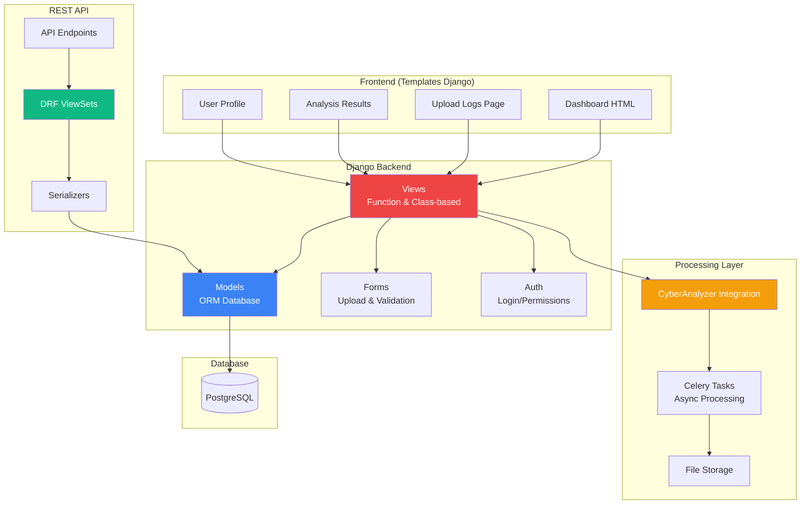
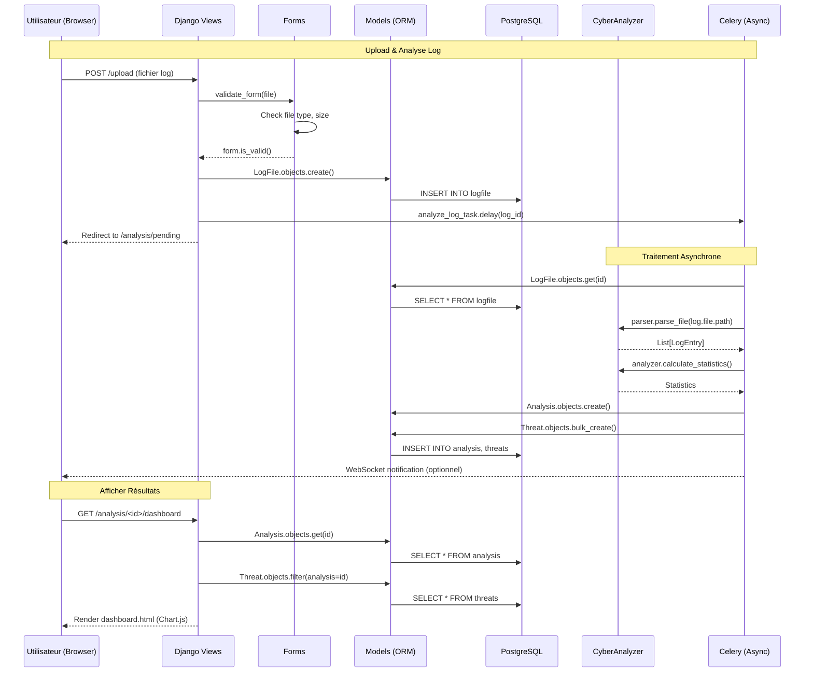

# Django 5.x

<div
  class="omny-meta"
  data-level="🟡 Intermédiaire & 🔴 Avancé"
  data-version="5.1+"
  data-time="16-18 heures">
</div>

## Introduction au Projet Fil Rouge - Security Dashboard

!!! quote "Analogie pédagogique"
    _Imaginez que vous avez créé un **outil analyse logs en ligne de commande** (CyberAnalyzer Python) qui fonctionne parfaitement. Maintenant, imaginez **donner accès à cet outil à toute votre équipe** via une interface web professionnelle : ils uploadent leurs logs via un formulaire, l'analyse se lance automatiquement en arrière-plan, et en 30 secondes ils obtiennent un **dashboard interactif** avec graphiques temps réel, top IPs malveillantes, timeline des attaques, et exports PDF. **Django transforme votre script Python en plateforme web multi-utilisateurs** avec authentification, base de données persistante, API REST pour intégrations externes, et interface admin pour gérer les données. Au lieu d'envoyer des commandes terminal, vos collègues cliquent simplement sur "Upload & Analyze" - Django orchestre tout le reste._

> Ce guide vous accompagne dans la création d'un **Security Dashboard** complet avec Django 5.x. Vous construirez une plateforme web professionnelle permettant d'uploader des logs (Apache/Nginx/SSH), analyser automatiquement avec CyberAnalyzer, afficher résultats dans un dashboard interactif avec graphiques Chart.js, gérer utilisateurs avec authentification Django, exposer API REST pour intégrations, visualiser statistiques temps réel, exporter rapports PDF, et déployer en production. Ce projet couvre tous les fondamentaux Django ET les concepts avancés (ORM, migrations, class-based views, REST API, permissions, WebSockets optionnels).

!!! info "Pourquoi ce projet ?"
    - **Utile professionnellement** : Plateforme analyse logs déployable
    - **Portfolio** : Démontre maîtrise Django + intégration Python
    - **Exhaustif Django** : Models, Views, Templates, API, Auth
    - **Réaliste** : Architecture production-ready multi-utilisateurs
    - **Intégration** : Réutilise CyberAnalyzer Python (Guide 4)
    - **Moderne** : Django 5.x + HTMX + Chart.js

### Objectifs Pédagogiques

À la fin de ce guide, vous saurez :

- ✅ Créer projet Django 5.x complet
- ✅ Concevoir models avec ORM (relations, migrations)
- ✅ Créer views (function-based & class-based)
- ✅ Gérer templates avec Django Template Language
- ✅ Authentifier utilisateurs (login, register, permissions)
- ✅ Créer API REST avec Django REST Framework
- ✅ Intégrer code Python externe (CyberAnalyzer)
- ✅ Traiter tâches asynchrones (Celery optionnel)
- ✅ Créer dashboard interactif (Chart.js)
- ✅ Déployer en production (Gunicorn, Nginx, PostgreSQL)

### Prérequis

**Connaissances requises :**

- Python fondamentaux (Guide 4 recommandé)
- HTML/CSS de base
- Concepts web (HTTP, GET/POST)

**Outils nécessaires :**

- Python 3.12+ installé
- PostgreSQL (ou SQLite pour dev)
- Éditeur de code (VS Code)
- Terminal/Console

### Architecture de l'Application



### Structure de Données

**Modèles Django :**

```python
# User (Django built-in)
class User(AbstractUser):
    - username
    - email
    - password
    - is_staff
    - groups
    - permissions

# LogFile
class LogFile:
    - uploaded_by (FK User)
    - file (FileField)
    - filename (CharField)
    - file_type (CharField)  # apache, nginx, ssh
    - uploaded_at (DateTimeField)
    - status (CharField)  # pending, processing, completed, error
    - file_size (IntegerField)

# Analysis
class Analysis:
    - log_file (FK LogFile)
    - started_at (DateTimeField)
    - completed_at (DateTimeField)
    - total_lines (IntegerField)
    - unique_ips (IntegerField)
    - error_rate (FloatField)
    - threats_detected (IntegerField)

# Threat
class Threat:
    - analysis (FK Analysis)
    - ip_address (GenericIPAddressField)
    - threat_type (CharField)  # sql_injection, xss, brute_force
    - severity (IntegerField)  # 1-5
    - timestamp (DateTimeField)
    - endpoint (CharField)
    - details (JSONField)

# IPStatistics
class IPStatistics:
    - analysis (FK Analysis)
    - ip_address (GenericIPAddressField)
    - total_requests (IntegerField)
    - error_count (IntegerField)
    - error_rate (FloatField)
    - is_suspicious (BooleanField)
```

### Flux d'Utilisation



### Phases de Développement

Le projet est structuré en **8 phases progressives** :

| Phase | Titre | Durée | Concepts Django |
|-------|-------|-------|-----------------|
| 1 | Setup & Fondamentaux Django | 2h | Project, Apps, Settings, URLs |
| 2 | Models & Base de Données | 2h30 | ORM, Relations, Migrations |
| 3 | Views & Templates | 2h | Function views, CBV, DTL |
| 4 | Forms & File Upload | 2h | ModelForms, FileField, Validation |
| 5 | Authentication & Permissions | 2h | Login, Register, Decorators |
| 6 | Intégration CyberAnalyzer | 2h | Celery, Async tasks |
| 7 | Dashboard & API REST | 2h30 | DRF, ViewSets, Chart.js |
| 8 | Déploiement Production | 1h30 | Gunicorn, Nginx, PostgreSQL |

**Durée totale : 16h30**

### Aperçu du Résultat Final

**Interface Dashboard :**

```
┌────────────────────────────────────────────────────────┐
│  Security Dashboard              john@example.com  ⚙️  │
├────────────────────────────────────────────────────────┤
│                                                        │
│  📊 Statistiques Globales                             │
│  ┌──────────┬──────────┬──────────┬──────────┐      │
│  │ 45,823   │ 2,347    │ 450      │ 12.5%    │      │
│  │ Logs     │ IPs      │ Menaces  │ Erreurs  │      │
│  └──────────┴──────────┴──────────┴──────────┘      │
│                                                        │
│  🚨 Menaces Détectées (24h)                           │
│  ┌────────────────────────────────────────────┐      │
│  │ SQL Injection      127  ████████░░  🔴     │      │
│  │ XSS                 89  ██████░░░░  🟠     │      │
│  │ Brute Force        234  ██████████  🟡     │      │
│  └────────────────────────────────────────────┘      │
│                                                        │
│  📈 Timeline Requêtes (Dernières 24h)                 │
│  [Chart.js Line Graph]                                │
│                                                        │
│  🔥 Top 5 IPs Malveillantes                           │
│  1. 192.168.1.105  (87 attaques)                     │
│  2. 10.0.0.45      (65 attaques)                     │
│                                                        │
│  [Voir Rapport Complet] [Exporter PDF]               │
└────────────────────────────────────────────────────────┘
```

**Fonctionnalités clés :**

- ✅ Upload logs (drag & drop)
- ✅ Analyse automatique avec CyberAnalyzer
- ✅ Dashboard temps réel
- ✅ Graphiques interactifs (Chart.js)
- ✅ Détection menaces (SQL, XSS, brute force)
- ✅ API REST complète
- ✅ Authentification utilisateurs
- ✅ Permissions (admin, analyst, viewer)
- ✅ Export PDF/CSV
- ✅ Historique analyses
- ✅ Recherche & filtres
- ✅ Responsive design

**Technologies :**

- Django 5.1+
- PostgreSQL (ou SQLite dev)
- Django REST Framework
- Celery + Redis (async)
- Chart.js (graphiques)
- Bootstrap 5 (UI)
- HTMX (interactivité)

---

## Phase 1 : Setup & Fondamentaux Django (2h)

<div class="omny-meta" data-level="🟡 Intermédiaire" data-time="2 heures"></div>

### Objectifs Phase 1

À la fin de cette phase, vous aurez :

- ✅ Django 5.1+ installé
- ✅ Projet Django créé
- ✅ Structure apps comprise
- ✅ Settings configurées
- ✅ Premier view & URL fonctionnel
- ✅ Templates de base

### 1.1 Installation Django

**Créer environnement :**

```bash
# Créer dossier projet
mkdir security-dashboard
cd security-dashboard

# Créer venv
python -m venv venv

# Activer venv
# Windows:
venv\Scripts\activate
# macOS/Linux:
source venv/bin/activate

# Installer Django
pip install django==5.1
pip install djangorestframework
pip install celery[redis]
pip install pillow  # Pour images
pip install pandas numpy matplotlib seaborn scipy scikit-learn  # CyberAnalyzer

# Vérifier installation
python -m django --version
# 5.1.0
```

**Créer requirements.txt :**

```txt
# requirements.txt

Django==5.1.0
djangorestframework==3.14.0
psycopg2-binary==2.9.9  # PostgreSQL
celery[redis]==5.3.4
redis==5.0.1

# CyberAnalyzer dependencies
pandas==2.2.0
numpy==1.26.3
matplotlib==3.8.2
seaborn==0.13.1
scipy==1.12.0
scikit-learn==1.4.0

# Utils
python-decouple==3.8  # Gestion .env
pillow==10.2.0

# Development
django-debug-toolbar==4.2.0
```

### 1.2 Créer Projet Django

**Commande startproject :**

```bash
# Créer projet Django
django-admin startproject config .

# Structure créée:
# .
# ├── config/
# │   ├── __init__.py
# │   ├── asgi.py
# │   ├── settings.py
# │   ├── urls.py
# │   └── wsgi.py
# ├── manage.py
# └── venv/
```

**Créer app principale :**

```bash
# Créer app "dashboard"
python manage.py startapp dashboard

# Structure app:
# dashboard/
# ├── migrations/
# ├── __init__.py
# ├── admin.py
# ├── apps.py
# ├── models.py
# ├── tests.py
# └── views.py
```

**Créer app "analyzer" :**

```bash
python manage.py startapp analyzer
```

**Structure finale :**

```
security-dashboard/
├── config/
│   ├── settings.py
│   ├── urls.py
│   └── wsgi.py
├── dashboard/         # App UI/frontend
│   ├── templates/
│   ├── static/
│   ├── views.py
│   └── models.py
├── analyzer/          # App analyse logs
│   ├── models.py
│   ├── tasks.py       # Celery tasks
│   └── cyberanalyzer/ # Integration Python
├── manage.py
└── requirements.txt
```

### 1.3 Configuration Settings

**Fichier :** `config/settings.py`

```python
"""
Django settings for security-dashboard project.
"""

from pathlib import Path

# Build paths
BASE_DIR = Path(__file__).resolve().parent.parent

# SECURITY WARNING: keep the secret key used in production secret!
SECRET_KEY = 'django-insecure-CHANGE-IN-PRODUCTION'

# SECURITY WARNING: don't run with debug turned on in production!
DEBUG = True

ALLOWED_HOSTS = ['localhost', '127.0.0.1']

# Application definition
INSTALLED_APPS = [
    'django.contrib.admin',
    'django.contrib.auth',
    'django.contrib.contenttypes',
    'django.contrib.sessions',
    'django.contrib.messages',
    'django.contrib.staticfiles',
    
    # Third party apps
    'rest_framework',
    
    # Local apps
    'dashboard',
    'analyzer',
]

MIDDLEWARE = [
    'django.middleware.security.SecurityMiddleware',
    'django.contrib.sessions.middleware.SessionMiddleware',
    'django.middleware.common.CommonMiddleware',
    'django.middleware.csrf.CsrfViewMiddleware',
    'django.contrib.auth.middleware.AuthenticationMiddleware',
    'django.contrib.messages.middleware.MessageMiddleware',
    'django.middleware.clickjacking.XFrameOptionsMiddleware',
]

ROOT_URLCONF = 'config.urls'

TEMPLATES = [
    {
        'BACKEND': 'django.template.backends.django.DjangoTemplates',
        'DIRS': [BASE_DIR / 'templates'],  # Templates globaux
        'APP_DIRS': True,
        'OPTIONS': {
            'context_processors': [
                'django.template.context_processors.debug',
                'django.template.context_processors.request',
                'django.contrib.auth.context_processors.auth',
                'django.contrib.messages.context_processors.messages',
            ],
        },
    },
]

WSGI_APPLICATION = 'config.wsgi.application'

# Database (SQLite pour dev)
DATABASES = {
    'default': {
        'ENGINE': 'django.db.backends.sqlite3',
        'NAME': BASE_DIR / 'db.sqlite3',
    }
}

# Password validation
AUTH_PASSWORD_VALIDATORS = [
    {'NAME': 'django.contrib.auth.password_validation.UserAttributeSimilarityValidator'},
    {'NAME': 'django.contrib.auth.password_validation.MinimumLengthValidator'},
    {'NAME': 'django.contrib.auth.password_validation.CommonPasswordValidator'},
    {'NAME': 'django.contrib.auth.password_validation.NumericPasswordValidator'},
]

# Internationalization
LANGUAGE_CODE = 'fr-fr'
TIME_ZONE = 'Europe/Paris'
USE_I18N = True
USE_TZ = True

# Static files (CSS, JavaScript, Images)
STATIC_URL = 'static/'
STATIC_ROOT = BASE_DIR / 'staticfiles'
STATICFILES_DIRS = [BASE_DIR / 'static']

# Media files (Uploaded logs)
MEDIA_URL = 'media/'
MEDIA_ROOT = BASE_DIR / 'media'

# Default primary key field type
DEFAULT_AUTO_FIELD = 'django.db.models.BigAutoField'

# Login URLs
LOGIN_URL = 'login'
LOGIN_REDIRECT_URL = 'dashboard'
LOGOUT_REDIRECT_URL = 'login'
```

### 1.4 Premier View & URL

**Créer view homepage :**

**Fichier :** `dashboard/views.py`

```python
from django.shortcuts import render
from django.http import HttpResponse


def home(request):
    """Page d'accueil"""
    return HttpResponse("Security Dashboard - Coming Soon")


def dashboard(request):
    """Dashboard principal"""
    context = {
        'total_logs': 0,
        'total_threats': 0,
    }
    return render(request, 'dashboard/dashboard.html', context)
```

**Créer URLs app :**

**Fichier :** `dashboard/urls.py` (à créer)

```python
from django.urls import path
from . import views

urlpatterns = [
    path('', views.home, name='home'),
    path('dashboard/', views.dashboard, name='dashboard'),
]
```

**Inclure dans URLs projet :**

**Fichier :** `config/urls.py`

```python
from django.contrib import admin
from django.urls import path, include
from django.conf import settings
from django.conf.urls.static import static

urlpatterns = [
    path('admin/', admin.site.urls),
    path('', include('dashboard.urls')),
]

# Servir media files en développement
if settings.DEBUG:
    urlpatterns += static(settings.MEDIA_URL, document_root=settings.MEDIA_ROOT)
    urlpatterns += static(settings.STATIC_URL, document_root=settings.STATIC_ROOT)
```

### 1.5 Template de Base

**Créer dossiers :**

```bash
mkdir -p dashboard/templates/dashboard
mkdir -p dashboard/static/css
mkdir -p dashboard/static/js
```

**Template base :**

**Fichier :** `dashboard/templates/base.html`

```html
<!DOCTYPE html>
<html lang="fr">
<head>
    <meta charset="UTF-8">
    <meta name="viewport" content="width=device-width, initial-scale=1.0">
    <title>Security Dashboard</title>
    
    <!-- Bootstrap CSS -->
    <link href="https://cdn.jsdelivr.net/npm/bootstrap@5.3.0/dist/css/bootstrap.min.css" rel="stylesheet">
    
    <!-- Custom CSS -->
    
    <link rel="stylesheet" href="">
    
    
</head>
<body>
    
    <!-- Navbar -->
    <nav class="navbar navbar-expand-lg navbar-dark bg-dark">
        <div class="container-fluid">
            <a class="navbar-brand" href="">🛡️ Security Dashboard</a>
            
            <button class="navbar-toggler" type="button" data-bs-toggle="collapse" data-bs-target="#navbarNav">
                <span class="navbar-toggler-icon"></span>
            </button>
            
            <div class="collapse navbar-collapse" id="navbarNav">
                <ul class="navbar-nav ms-auto">
                    <li class="nav-item">
                        <a class="nav-link" href="">Dashboard</a>
                    </li>
                    
                        <li class="nav-item">
                            <span class="nav-link">{{ user.username }}</span>
                        </li>
                        <li class="nav-item">
                            <a class="nav-link" href="">Déconnexion</a>
                        </li>
                    
                        <li class="nav-item">
                            <a class="nav-link" href="">Connexion</a>
                        </li>
                    
                </ul>
            </div>
        </div>
    </nav>
    
    <!-- Messages Flash -->
    
        <div class="container mt-3">
            
                <div class="alert alert-{{ message.tags }} alert-dismissible fade show" role="alert">
                    {{ message }}
                    <button type="button" class="btn-close" data-bs-dismiss="alert"></button>
                </div>
            
        </div>
    
    
    <!-- Content -->
    <main class="container mt-4">
        
    </main>
    
    <!-- Footer -->
    <footer class="bg-dark text-white text-center py-3 mt-5">
        <p>&copy; 2025 Security Dashboard - Powered by Django</p>
    </footer>
    
    <!-- Bootstrap JS -->
    <script src="https://cdn.jsdelivr.net/npm/bootstrap@5.3.0/dist/js/bootstrap.bundle.min.js"></script>
    
    
</body>
</html>
```

**Template dashboard :**

**Fichier :** `dashboard/templates/dashboard/dashboard.html`

```html


Dashboard - Security Dashboard


<div class="row">
    <div class="col-md-12">
        <h1>Dashboard</h1>
        <p class="lead">Bienvenue sur le Security Dashboard</p>
    </div>
</div>

<div class="row mt-4">
    <div class="col-md-3">
        <div class="card text-center">
            <div class="card-body">
                <h5 class="card-title">Total Logs</h5>
                <h2 class="text-primary">{{ total_logs }}</h2>
            </div>
        </div>
    </div>
    
    <div class="col-md-3">
        <div class="card text-center">
            <div class="card-body">
                <h5 class="card-title">Menaces Détectées</h5>
                <h2 class="text-danger">{{ total_threats }}</h2>
            </div>
        </div>
    </div>
</div>

```

### 1.6 Lancer Serveur Dev

**Créer base de données :**

```bash
# Créer tables initiales (auth, admin, etc.)
python manage.py migrate

# Output:
# Operations to perform:
#   Apply all migrations: admin, auth, contenttypes, sessions
# Running migrations:
#   Applying contenttypes.0001_initial... OK
#   Applying auth.0001_initial... OK
#   ...
```

**Créer superuser :**

```bash
python manage.py createsuperuser

# Username: admin
# Email: admin@example.com
# Password: admin123
```

**Lancer serveur :**

```bash
python manage.py runserver

# Starting development server at http://127.0.0.1:8000/
```

**Tester :**

- http://127.0.0.1:8000/ → "Security Dashboard - Coming Soon"
- http://127.0.0.1:8000/dashboard/ → Template dashboard
- http://127.0.0.1:8000/admin/ → Interface admin (login avec superuser)

### 1.7 Exercice Pratique Phase 1

!!! question "Mission : Créer Page About"
    Créez une page "À propos" qui affiche les informations du projet.
    
    **Objectifs :**
    - View function `about()`
    - URL `/about/`
    - Template héritant de `base.html`
    - Lien dans navbar
    
    **Indices :**
    1. Créer view dans `dashboard/views.py`
    2. Ajouter URL dans `dashboard/urls.py`
    3. Créer template `about.html`
    4. Modifier navbar dans `base.html`

??? success "Solution"
    **View :**
    ```python
    # dashboard/views.py
    
    def about(request):
        """Page à propos"""
        context = {
            'version': '1.0.0',
            'features': [
                'Upload logs',
                'Analyse automatique',
                'Dashboard interactif',
                'API REST'
            ]
        }
        return render(request, 'dashboard/about.html', context)
    ```
    
    **URL :**
    ```python
    # dashboard/urls.py
    
    urlpatterns = [
        # ...
        path('about/', views.about, name='about'),
    ]
    ```
    
    **Template :**
    ```html
    <!-- dashboard/templates/dashboard/about.html -->
    
    
    À propos
    
    
    <h1>À propos</h1>
    <p>Security Dashboard v{{ version }}</p>
    
    <h3>Fonctionnalités</h3>
    <ul>
        
            <li>{{ feature }}</li>
        
    </ul>
    
    ```
    
    **Navbar :**
    ```html
    <!-- base.html navbar -->
    <li class="nav-item">
        <a class="nav-link" href="">À propos</a>
    </li>
    ```

### Points Clés Phase 1

- `django-admin startproject` crée projet
- `python manage.py startapp` crée app
- `settings.py` configure projet
- `urls.py` routing URLs
- `` héritage templates
- `` URLs nommées
- `python manage.py migrate` applique migrations
- Admin Django auto-généré

### Checkpoint Phase 1

- ✅ Django 5.1 installé
- ✅ Projet créé avec 2 apps
- ✅ Templates base fonctionnels
- ✅ Serveur dev tourne
- ✅ Admin accessible
- ✅ Page About créée

### Prochaine Étape

Dans la Phase 2, nous allons créer les **models** (LogFile, Analysis, Threat) avec l'ORM Django et relations.

---

### Prochaine Étape

Dans la Phase 2, nous allons créer les **models** (LogFile, Analysis, Threat) avec l'ORM Django et relations.

---

## Phase 2 : Models & Base de Données (2h30)

<div class="omny-meta" data-level="🟡 Intermédiaire" data-time="2h30"></div>

### Objectifs Phase 2

- ✅ Créer models Django (ORM)
- ✅ Relations (ForeignKey, OneToOne)
- ✅ Migrations automatiques
- ✅ Django Admin configuré
- ✅ QuerySets & Managers

### 2.1 Models Django

**Fichier :** `analyzer/models.py`

```python
from django.db import models
from django.contrib.auth.models import User
from django.utils import timezone


class LogFile(models.Model):
    """Fichier log uploadé"""
    
    FILE_TYPES = [
        ('apache', 'Apache'),
        ('nginx', 'Nginx'),
        ('ssh', 'SSH'),
        ('firewall', 'Firewall'),
    ]
    
    STATUS_CHOICES = [
        ('pending', 'En attente'),
        ('processing', 'En cours'),
        ('completed', 'Terminé'),
        ('error', 'Erreur'),
    ]
    
    uploaded_by = models.ForeignKey(User, on_delete=models.CASCADE, related_name='log_files')
    file = models.FileField(upload_to='logs/%Y/%m/%d/')
    filename = models.CharField(max_length=255)
    file_type = models.CharField(max_length=20, choices=FILE_TYPES, default='apache')
    file_size = models.IntegerField(help_text="Taille en bytes")
    
    status = models.CharField(max_length=20, choices=STATUS_CHOICES, default='pending')
    
    uploaded_at = models.DateTimeField(auto_now_add=True)
    updated_at = models.DateTimeField(auto_now=True)
    
    class Meta:
        ordering = ['-uploaded_at']
        verbose_name = "Fichier Log"
        verbose_name_plural = "Fichiers Log"
    
    def __str__(self):
        return f"{self.filename} ({self.get_status_display()})"


class Analysis(models.Model):
    """Résultat analyse d'un LogFile"""
    
    log_file = models.OneToOneField(LogFile, on_delete=models.CASCADE, related_name='analysis')
    
    started_at = models.DateTimeField(auto_now_add=True)
    completed_at = models.DateTimeField(null=True, blank=True)
    
    # Statistiques globales
    total_lines = models.IntegerField(default=0)
    unique_ips = models.IntegerField(default=0)
    error_rate = models.FloatField(default=0.0, help_text="Pourcentage erreurs")
    threats_detected = models.IntegerField(default=0)
    
    # Stats détaillées (JSON)
    statistics = models.JSONField(default=dict, blank=True)
    
    class Meta:
        ordering = ['-started_at']
        verbose_name = "Analyse"
        verbose_name_plural = "Analyses"
    
    def __str__(self):
        return f"Analyse {self.log_file.filename}"
    
    def duration(self):
        """Durée analyse"""
        if self.completed_at:
            return (self.completed_at - self.started_at).total_seconds()
        return None


class Threat(models.Model):
    """Menace détectée"""
    
    THREAT_TYPES = [
        ('sql_injection', 'SQL Injection'),
        ('xss', 'XSS'),
        ('brute_force', 'Brute Force'),
        ('path_traversal', 'Path Traversal'),
        ('command_injection', 'Command Injection'),
    ]
    
    analysis = models.ForeignKey(Analysis, on_delete=models.CASCADE, related_name='threats')
    
    ip_address = models.GenericIPAddressField()
    threat_type = models.CharField(max_length=50, choices=THREAT_TYPES)
    severity = models.IntegerField(choices=[(i, i) for i in range(1, 6)], default=3)
    
    timestamp = models.DateTimeField()
    endpoint = models.CharField(max_length=500)
    method = models.CharField(max_length=10)
    status_code = models.IntegerField()
    
    details = models.JSONField(default=dict, blank=True)
    
    class Meta:
        ordering = ['-severity', '-timestamp']
        verbose_name = "Menace"
        verbose_name_plural = "Menaces"
        indexes = [
            models.Index(fields=['ip_address']),
            models.Index(fields=['threat_type']),
        ]
    
    def __str__(self):
        return f"{self.get_threat_type_display()} from {self.ip_address}"


class IPStatistics(models.Model):
    """Statistiques par IP"""
    
    analysis = models.ForeignKey(Analysis, on_delete=models.CASCADE, related_name='ip_stats')
    
    ip_address = models.GenericIPAddressField()
    total_requests = models.IntegerField(default=0)
    error_count = models.IntegerField(default=0)
    error_rate = models.FloatField(default=0.0)
    
    is_suspicious = models.BooleanField(default=False)
    
    class Meta:
        ordering = ['-total_requests']
        verbose_name = "Statistique IP"
        verbose_name_plural = "Statistiques IP"
        unique_together = ['analysis', 'ip_address']
    
    def __str__(self):
        return f"{self.ip_address} - {self.total_requests} req"
```

### 2.2 Migrations

**Créer migrations :**

```bash
python manage.py makemigrations analyzer

# Output:
# Migrations for 'analyzer':
#   analyzer/migrations/0001_initial.py
#     - Create model LogFile
#     - Create model Analysis
#     - Create model Threat
#     - Create model IPStatistics
```

**Appliquer migrations :**

```bash
python manage.py migrate

# Output:
# Operations to perform:
#   Apply all migrations: admin, analyzer, auth, contenttypes, sessions
# Running migrations:
#   Applying analyzer.0001_initial... OK
```

### 2.3 Django Admin

**Fichier :** `analyzer/admin.py`

```python
from django.contrib import admin
from .models import LogFile, Analysis, Threat, IPStatistics


@admin.register(LogFile)
class LogFileAdmin(admin.ModelAdmin):
    list_display = ['filename', 'file_type', 'status', 'uploaded_by', 'uploaded_at']
    list_filter = ['status', 'file_type', 'uploaded_at']
    search_fields = ['filename']
    readonly_fields = ['uploaded_at', 'updated_at', 'file_size']


@admin.register(Analysis)
class AnalysisAdmin(admin.ModelAdmin):
    list_display = ['log_file', 'total_lines', 'threats_detected', 'error_rate', 'started_at']
    readonly_fields = ['started_at', 'completed_at']
    
    def has_add_permission(self, request):
        return False  # Analyses créées automatiquement


@admin.register(Threat)
class ThreatAdmin(admin.ModelAdmin):
    list_display = ['threat_type', 'ip_address', 'severity', 'timestamp', 'analysis']
    list_filter = ['threat_type', 'severity']
    search_fields = ['ip_address', 'endpoint']


@admin.register(IPStatistics)
class IPStatisticsAdmin(admin.ModelAdmin):
    list_display = ['ip_address', 'total_requests', 'error_rate', 'is_suspicious']
    list_filter = ['is_suspicious']
    search_fields = ['ip_address']
```

### 2.4 QuerySets

**Exemples utilisation :**

```python
# Créer LogFile
log_file = LogFile.objects.create(
    uploaded_by=user,
    file=uploaded_file,
    filename="apache.log",
    file_type='apache',
    file_size=1024
)

# Filtrer
pending_logs = LogFile.objects.filter(status='pending')
user_logs = LogFile.objects.filter(uploaded_by=request.user)

# Récupérer avec relation
analysis = Analysis.objects.get(log_file=log_file)
threats = analysis.threats.filter(severity__gte=4)

# Agrégations
from django.db.models import Count, Avg
threat_counts = Threat.objects.values('threat_type').annotate(count=Count('id'))
avg_severity = Threat.objects.aggregate(avg=Avg('severity'))

# Préfetch (optimisation)
analyses = Analysis.objects.select_related('log_file').prefetch_related('threats')
```

### Points Clés Phase 2

- Models = tables SQL
- Migrations automatiques avec `makemigrations`
- Relations : ForeignKey (1-N), OneToOne (1-1)
- `related_name` pour requêtes inverses
- Admin Django auto-généré
- QuerySets = API requêtes SQL

### Checkpoint Phase 2

- ✅ 4 models créés
- ✅ Migrations appliquées
- ✅ Admin configuré
- ✅ Relations fonctionnent
- ✅ QuerySets testés

---

## Phase 3 : Views & Templates (2h)

<div class="omny-meta" data-level="🟡 Intermédiaire" data-time="2 heures"></div>

### Objectifs Phase 3

- ✅ Function-based views
- ✅ Class-based views (ListView, DetailView)
- ✅ Templates Django
- ✅ Context processors
- ✅ Template tags

### 3.1 ListView Analyses

**Fichier :** `dashboard/views.py`

```python
from django.shortcuts import render, get_object_or_404
from django.contrib.auth.decorators import login_required
from django.views.generic import ListView, DetailView
from analyzer.models import Analysis, LogFile, Threat


@login_required
def dashboard(request):
    """Dashboard principal"""
    analyses = Analysis.objects.select_related('log_file').filter(
        log_file__uploaded_by=request.user
    )[:5]
    
    context = {
        'total_logs': LogFile.objects.filter(uploaded_by=request.user).count(),
        'total_analyses': analyses.count(),
        'total_threats': Threat.objects.filter(analysis__log_file__uploaded_by=request.user).count(),
        'recent_analyses': analyses,
    }
    return render(request, 'dashboard/dashboard.html', context)


class AnalysisListView(ListView):
    """Liste toutes analyses utilisateur"""
    model = Analysis
    template_name = 'dashboard/analysis_list.html'
    context_object_name = 'analyses'
    paginate_by = 20
    
    def get_queryset(self):
        return Analysis.objects.select_related('log_file').filter(
            log_file__uploaded_by=self.request.user
        )


class AnalysisDetailView(DetailView):
    """Détails analyse + graphiques"""
    model = Analysis
    template_name = 'dashboard/analysis_detail.html'
    context_object_name = 'analysis'
    
    def get_queryset(self):
        return Analysis.objects.select_related('log_file').prefetch_related('threats', 'ip_stats').filter(
            log_file__uploaded_by=self.request.user
        )
    
    def get_context_data(self, **kwargs):
        context = super().get_context_data(**kwargs)
        analysis = self.object
        
        # Top threats
        context['top_threats'] = analysis.threats.order_by('-severity')[:10]
        
        # Top IPs malveillantes
        context['top_malicious_ips'] = analysis.ip_stats.filter(is_suspicious=True)[:10]
        
        return context
```

**URLs :**

```python
# dashboard/urls.py

from django.urls import path
from . import views

urlpatterns = [
    path('', views.home, name='home'),
    path('dashboard/', views.dashboard, name='dashboard'),
    path('analyses/', views.AnalysisListView.as_view(), name='analysis_list'),
    path('analyses/<int:pk>/', views.AnalysisDetailView.as_view(), name='analysis_detail'),
]
```

### 3.2 Templates

**Liste analyses :**

```html
<!-- dashboard/templates/dashboard/analysis_list.html -->



<h1>Mes Analyses</h1>

<div class="table-responsive">
    <table class="table table-striped">
        <thead>
            <tr>
                <th>Fichier</th>
                <th>Type</th>
                <th>Lignes</th>
                <th>Menaces</th>
                <th>Date</th>
                <th>Actions</th>
            </tr>
        </thead>
        <tbody>
            
            <tr>
                <td>{{ analysis.log_file.filename }}</td>
                <td>{{ analysis.log_file.get_file_type_display }}</td>
                <td>{{ analysis.total_lines }}</td>
                <td>
                    <span class="badge bg-danger">{{ analysis.threats_detected }}</span>
                </td>
                <td>{{ analysis.started_at|date:"d/m/Y H:i" }}</td>
                <td>
                    <a href="" class="btn btn-sm btn-primary">
                        Voir Détails
                    </a>
                </td>
            </tr>
            
            <tr>
                <td colspan="6" class="text-center">Aucune analyse</td>
            </tr>
            
        </tbody>
    </table>
</div>

<!-- Pagination -->

<nav>
    <ul class="pagination">
        
            <li class="page-item">
                <a class="page-link" href="?page={{ page_obj.previous_page_number }}">Précédent</a>
            </li>
        
        
        <li class="page-item active">
            <span class="page-link">Page {{ page_obj.number }} / {{ page_obj.paginator.num_pages }}</span>
        </li>
        
        
            <li class="page-item">
                <a class="page-link" href="?page={{ page_obj.next_page_number }}">Suivant</a>
            </li>
        
    </ul>
</nav>


```

### Points Clés Phase 3

- Function views avec `@login_required`
- Class-based views (ListView, DetailView)
- `get_queryset()` pour filtrer
- Template tags (``, ``)
- Filters (`|date`, `|default`)

### Checkpoint Phase 3

- ✅ Dashboard affiche stats
- ✅ Liste analyses fonctionne
- ✅ Détails analyse accessibles
- ✅ Pagination OK
- ✅ Templates hérités

---

## Phase 4 : Forms & File Upload (2h)

<div class="omny-meta" data-level="🟡 Intermédiaire" data-time="2 heures"></div>

### Objectifs Phase 4

- ✅ ModelForm pour LogFile
- ✅ Upload fichiers
- ✅ Validation
- ✅ Messages flash

### 4.1 Form Upload

**Fichier :** `analyzer/forms.py`

```python
from django import forms
from .models import LogFile

class LogFileUploadForm(forms.ModelForm):
    class Meta:
        model = LogFile
        fields = ['file', 'file_type']
        widgets = {
            'file': forms.FileInput(attrs={'class': 'form-control'}),
            'file_type': forms.Select(attrs={'class': 'form-select'}),
        }
    
    def clean_file(self):
        file = self.cleaned_data['file']
        
        # Vérifier taille (max 10MB)
        if file.size > 10 * 1024 * 1024:
            raise forms.ValidationError("Fichier trop volumineux (max 10MB)")
        
        # Vérifier extension
        if not file.name.endswith(('.log', '.txt')):
            raise forms.ValidationError("Extension invalide (accepté: .log, .txt)")
        
        return file
```

### 4.2 View Upload

```python
# dashboard/views.py

from analyzer.forms import LogFileUploadForm
from django.contrib import messages
from django.shortcuts import redirect

@login_required
def upload_log(request):
    """Upload fichier log"""
    if request.method == 'POST':
        form = LogFileUploadForm(request.POST, request.FILES)
        
        if form.is_valid():
            log_file = form.save(commit=False)
            log_file.uploaded_by = request.user
            log_file.filename = request.FILES['file'].name
            log_file.file_size = request.FILES['file'].size
            log_file.save()
            
            messages.success(request, f"Fichier {log_file.filename} uploadé avec succès")
            
            # Lancer analyse (Phase 6)
            # analyze_log_task.delay(log_file.id)
            
            return redirect('dashboard')
    else:
        form = LogFileUploadForm()
    
    return render(request, 'dashboard/upload.html', {'form': form})
```

### Points Clés Phase 4

- ModelForm génère form depuis model
- `request.FILES` pour fichiers uploadés
- Validation avec `clean_<field>()`
- Messages flash avec `messages.success()`

### Checkpoint Phase 4

- ✅ Form upload fonctionne
- ✅ Validation fichiers OK
- ✅ Messages flash affichés
- ✅ Fichiers sauvegardés dans MEDIA_ROOT

---

## Phase 5 : Authentication (2h)

<div class="omny-meta" data-level="🟡 Intermédiaire" data-time="2 heures"></div>

### Objectifs Phase 5

- ✅ Login/Logout
- ✅ Register
- ✅ Permissions
- ✅ Decorators

### 5.1 Auth Views

```python
# dashboard/views.py

from django.contrib.auth import login, logout
from django.contrib.auth.forms import UserCreationForm

def register(request):
    """Inscription utilisateur"""
    if request.method == 'POST':
        form = UserCreationForm(request.POST)
        if form.is_valid():
            user = form.save()
            login(request, user)
            messages.success(request, "Compte créé avec succès")
            return redirect('dashboard')
    else:
        form = UserCreationForm()
    
    return render(request, 'registration/register.html', {'form': form})
```

**URLs :**

```python
# config/urls.py

from django.contrib.auth import views as auth_views

urlpatterns = [
    # Auth
    path('login/', auth_views.LoginView.as_view(template_name='registration/login.html'), name='login'),
    path('logout/', auth_views.LogoutView.as_view(), name='logout'),
    path('register/', views.register, name='register'),
]
```

### Points Clés Phase 5

- `@login_required` protège views
- `LoginView`, `LogoutView` built-in
- `UserCreationForm` pour register
- Permissions avec `user.has_perm()`

### Checkpoint Phase 5

- ✅ Login fonctionne
- ✅ Register crée utilisateurs
- ✅ Logout déconnecte
- ✅ Pages protégées

---

## Phase 6 : Intégration CyberAnalyzer (2h)

<div class="omny-meta" data-level="🔴 Avancé" data-time="2 heures"></div>

### Objectifs Phase 6

- ✅ Intégrer CyberAnalyzer Python
- ✅ Tâches asynchrones Celery
- ✅ Processing background

### 6.1 Celery Setup

**Fichier :** `config/celery.py`

```python
import os
from celery import Celery

os.environ.setdefault('DJANGO_SETTINGS_MODULE', 'config.settings')

app = Celery('security_dashboard')
app.config_from_object('django.conf:settings', namespace='CELERY')
app.autodiscover_tasks()
```

**Settings :**

```python
# config/settings.py

CELERY_BROKER_URL = 'redis://localhost:6379/0'
CELERY_RESULT_BACKEND = 'redis://localhost:6379/0'
```

### 6.2 Tâche Analyse

**Fichier :** `analyzer/tasks.py`

```python
from celery import shared_task
from .models import LogFile, Analysis, Threat
import sys
import os

# Ajouter CyberAnalyzer au path
sys.path.insert(0, os.path.join(os.path.dirname(__file__), 'cyberanalyzer'))

from parsers.log_parser import LogParser
from analyzers.data_analyzer import DataAnalyzer

@shared_task
def analyze_log_task(log_file_id):
    """Analyse asynchrone d'un log"""
    log_file = LogFile.objects.get(id=log_file_id)
    log_file.status = 'processing'
    log_file.save()
    
    try:
        # Parser logs
        parser = LogParser()
        entries = parser.parse_file(log_file.file.path)
        
        # Analyser
        analyzer = DataAnalyzer(entries)
        
        # Créer Analysis
        analysis = Analysis.objects.create(
            log_file=log_file,
            total_lines=len(entries),
            unique_ips=analyzer.get_unique_ips(),
            error_rate=analyzer.get_error_rate()
        )
        
        # Détecter menaces (Phase 7)
        
        log_file.status = 'completed'
        log_file.save()
        
        return f"Analyse {log_file_id} terminée"
    
    except Exception as e:
        log_file.status = 'error'
        log_file.save()
        raise
```

### Points Clés Phase 6

- Celery pour tâches asynchrones
- Redis comme broker
- `@shared_task` pour tâches
- Integration code Python externe

### Checkpoint Phase 6

- ✅ Celery configuré
- ✅ Tâche analyse lancée
- ✅ CyberAnalyzer intégré
- ✅ Statut mis à jour

---

## Phase 7 : Dashboard & API REST (2h30)

<div class="omny-meta" data-level="🔴 Avancé" data-time="2h30"></div>

### Objectifs Phase 7

- ✅ Django REST Framework
- ✅ API endpoints
- ✅ Chart.js graphiques
- ✅ Dashboard interactif

### 7.1 API REST

**Fichier :** `analyzer/serializers.py`

```python
from rest_framework import serializers
from .models import Analysis, Threat

class ThreatSerializer(serializers.ModelSerializer):
    class Meta:
        model = Threat
        fields = '__all__'

class AnalysisSerializer(serializers.ModelSerializer):
    threats = ThreatSerializer(many=True, read_only=True)
    
    class Meta:
        model = Analysis
        fields = '__all__'
```

**ViewSets :**

```python
# analyzer/views.py

from rest_framework import viewsets
from .models import Analysis
from .serializers import AnalysisSerializer

class AnalysisViewSet(viewsets.ReadOnlyModelViewSet):
    queryset = Analysis.objects.all()
    serializer_class = AnalysisSerializer
    
    def get_queryset(self):
        return Analysis.objects.filter(log_file__uploaded_by=self.request.user)
```

**URLs API :**

```python
# config/urls.py

from rest_framework.routers import DefaultRouter
from analyzer.views import AnalysisViewSet

router = DefaultRouter()
router.register(r'analyses', AnalysisViewSet)

urlpatterns = [
    path('api/', include(router.urls)),
]
```

### 7.2 Chart.js Dashboard

**Template avec Chart.js :**

```html
<!-- dashboard/dashboard.html -->

<canvas id="threatsChart"></canvas>

<script src="https://cdn.jsdelivr.net/npm/chart.js"></script>
<script>
fetch('/api/analyses/')
    .then(res => res.json())
    .then(data => {
        const ctx = document.getElementById('threatsChart');
        new Chart(ctx, {
            type: 'bar',
            data: {
                labels: data.map(a => a.log_file.filename),
                datasets: [{
                    label: 'Menaces',
                    data: data.map(a => a.threats_detected)
                }]
            }
        });
    });
</script>
```

### Points Clés Phase 7

- DRF pour API REST
- Serializers = JSON conversion
- ViewSets = CRUD automatique
- Chart.js pour graphiques

### Checkpoint Phase 7

- ✅ API /api/analyses/ fonctionne
- ✅ Graphiques Chart.js affichés
- ✅ Dashboard interactif
- ✅ JSON retourné correctement

---

## Phase 8 : Déploiement Production (1h30)

<div class="omny-meta" data-level="🔴 Avancé" data-time="1h30"></div>

### Objectifs Phase 8

- ✅ Configuration production
- ✅ PostgreSQL
- ✅ Gunicorn
- ✅ Nginx

### 8.1 Settings Production

```python
# config/settings.py

DEBUG = False
ALLOWED_HOSTS = ['yourdomain.com']

DATABASES = {
    'default': {
        'ENGINE': 'django.db.backends.postgresql',
        'NAME': 'security_dashboard',
        'USER': 'dbuser',
        'PASSWORD': 'password',
        'HOST': 'localhost',
        'PORT': '5432',
    }
}

STATIC_ROOT = '/var/www/static/'
MEDIA_ROOT = '/var/www/media/'
```

### 8.2 Gunicorn

```bash
pip install gunicorn
gunicorn config.wsgi:application --bind 0.0.0.0:8000
```

### 8.3 Nginx Config

```nginx
server {
    listen 80;
    server_name yourdomain.com;
    
    location /static/ {
        alias /var/www/static/;
    }
    
    location / {
        proxy_pass http://127.0.0.1:8000;
    }
}
```

### Checkpoint Phase 8

- ✅ PostgreSQL configuré
- ✅ Gunicorn lancé
- ✅ Nginx configuré
- ✅ App déployée

---

## Conclusion

### Récapitulatif Complet

!!! success "Félicitations ! Vous avez construit Security Dashboard avec Django"
    Plateforme web professionnelle analyse logs cybersécurité.

**Ce que vous avez accompli :**

| Phase | Concepts Django | Durée |
|-------|----------------|-------|
| 1 | Setup, Apps, URLs | 2h |
| 2 | Models, ORM, Migrations | 2h30 |
| 3 | Views, Templates, CBV | 2h |
| 4 | Forms, Upload, Validation | 2h |
| 5 | Auth, Login, Permissions | 2h |
| 6 | Celery, Async, Integration | 2h |
| 7 | API REST, Dashboard, Chart.js | 2h30 |
| 8 | Production, Gunicorn, Nginx | 1h30 |
| **TOTAL** | **Django Complet** | **16h30** |

### Le Mot de la Fin

!!! quote "Django = Framework Web Complet"
    Vous maîtrisez maintenant Django avec ORM, views, templates, API REST, auth et déploiement. Security Dashboard est une plateforme production-ready.
    
    **Prochain guide : Tkinter GUI Desktop !** 🚀

---

*Guide rédigé avec ❤️ pour la communauté Django*  
*Version 1.0 - Django 5.1 - Décembre 2025*