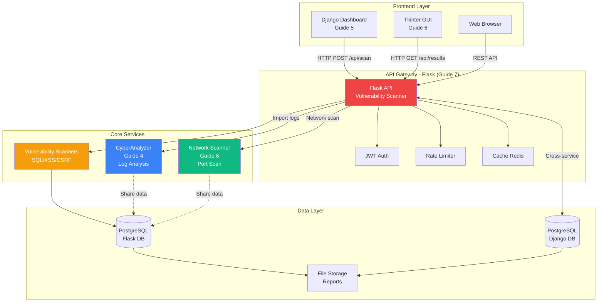
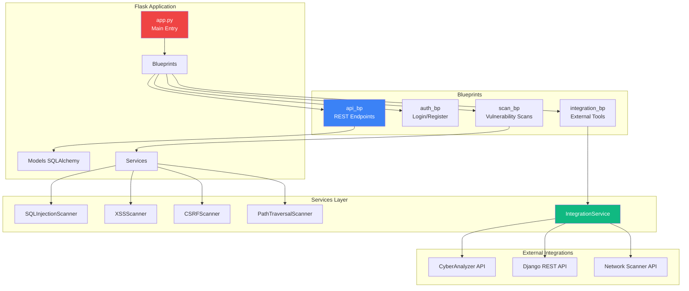
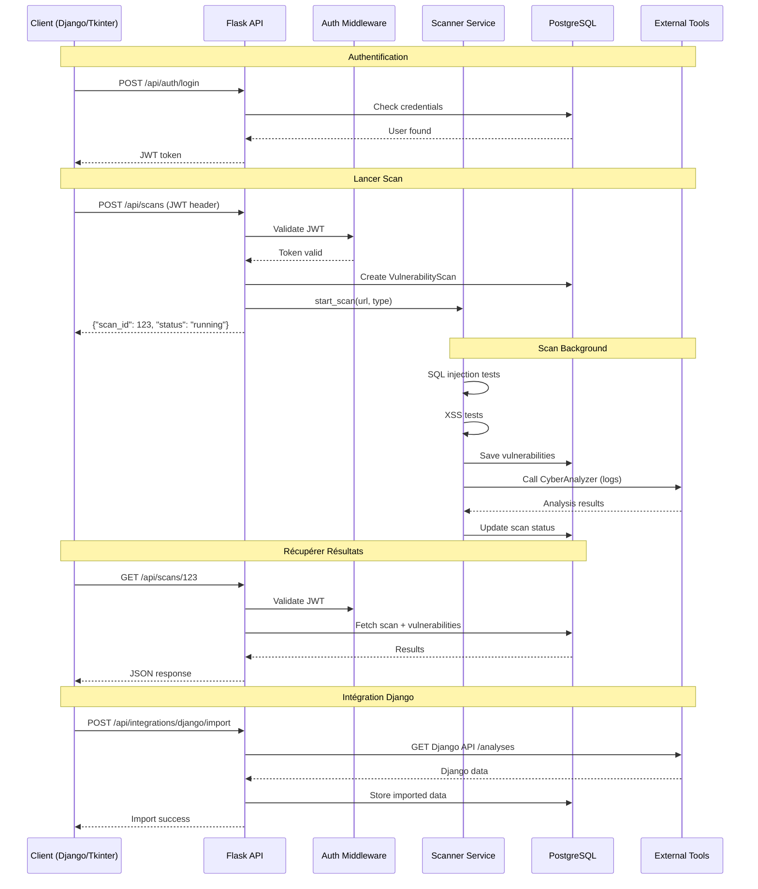
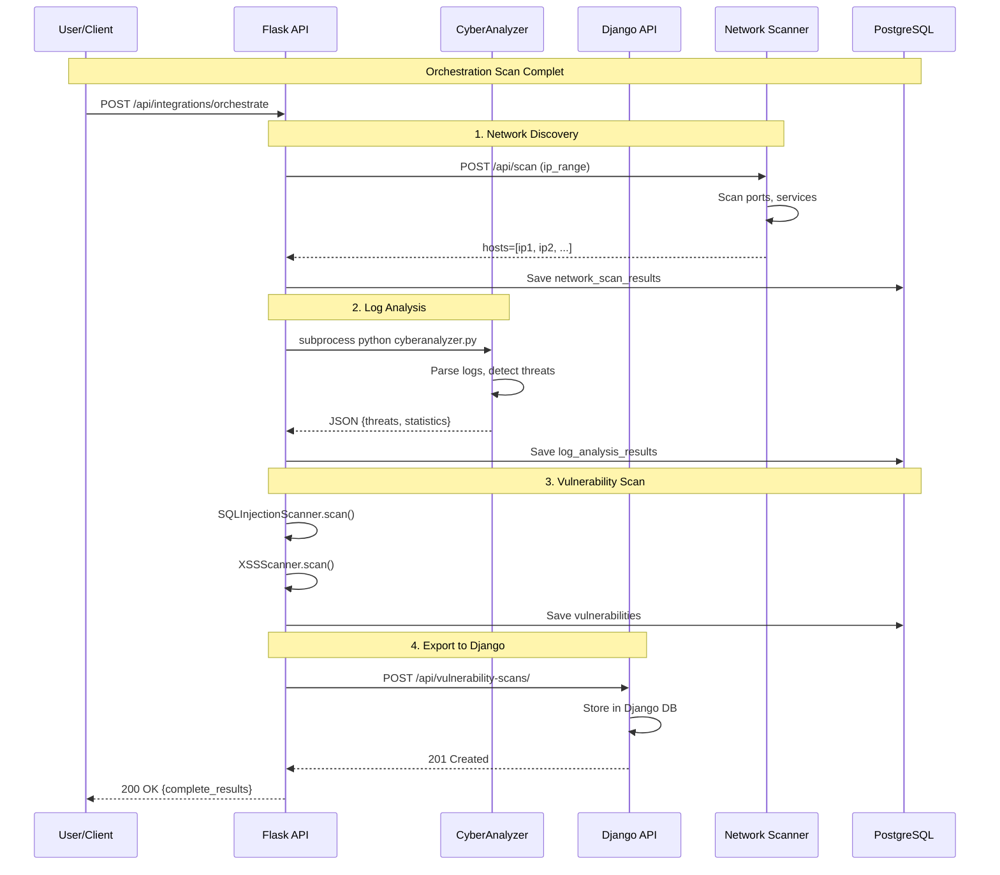
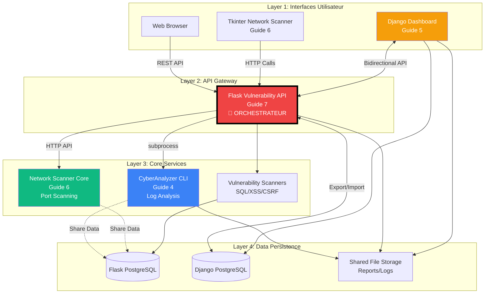

# Flask

<div
  class="omny-meta"
  data-level="🟡 Intermédiaire & 🔴 Avancé"
  data-version="Flask 3.0+"
  data-time="14-16 heures">
</div>

## Introduction au Projet Fil Rouge - Vulnerability Scanner API

!!! quote "Analogie pédagogique"
    _Imaginez que vous avez construit **3 outils cybersécurité Python** séparés : CyberAnalyzer (analyse logs CLI), Django Dashboard (plateforme web logs), et Network Scanner (GUI desktop). Chaque outil fonctionne parfaitement... mais **ils ne communiquent pas entre eux**. Vous devez copier-coller manuellement les résultats d'un outil à l'autre, exporter/importer des fichiers, et relancer des scans redondants. **Flask transforme cette collection d'outils isolés en écosystème intégré** : vous créez une **API REST centrale** qui expose des endpoints pour scanner vulnérabilités web (SQL injection, XSS, CSRF), peut être appelée depuis Django Dashboard via requêtes HTTP, envoie des jobs au Network Scanner, agrège tous les résultats dans une base SQLite/PostgreSQL unique, et génère des rapports consolidés. Au lieu de 3 outils déconnectés, vous obtenez une **architecture microservices professionnelle** où Flask orchestre tout - API légère, rapide, et facile à déployer._

> Ce guide vous accompagne dans la création d'un **Vulnerability Scanner API** complet avec Flask. Vous construirez une API REST professionnelle permettant de scanner sites web pour vulnérabilités OWASP Top 10 (SQL injection, XSS, CSRF, path traversal), exposer endpoints RESTful avec authentification JWT, intégrer avec CyberAnalyzer/Django/Tkinter via HTTP, gérer base de données avec SQLAlchemy ORM, implémenter rate limiting et caching, créer interface web légère (Jinja2 templates), déployer avec Gunicorn/Nginx, et orchestrer architecture microservices. Ce projet couvre tous les fondamentaux Flask ET intégrations avancées avec votre écosystème existant.

!!! info "Pourquoi ce projet ?"
    - **Intégration** : Unifie tous vos outils Python existants
    - **Microservices** : Architecture moderne scalable
    - **API REST** : Standard industrie pour interopérabilité
    - **Léger** : Flask = 5x plus léger que Django
    - **Flexible** : Customisable à 100%
    - **Production** : Utilisable en environnement professionnel

### Objectifs Pédagogiques

À la fin de ce guide, vous saurez :

- ✅ Créer API REST avec Flask
- ✅ Blueprints pour modularité
- ✅ SQLAlchemy ORM (bases de données)
- ✅ Authentication JWT
- ✅ Rate limiting & caching
- ✅ Scanners vulnérabilités (OWASP)
- ✅ Intégrer avec Django/Tkinter
- ✅ Tests unitaires (pytest)
- ✅ Déployer avec Docker
- ✅ Architecture microservices

### Prérequis

**Connaissances requises :**

- Python fondamentaux (Guides 4-6 fortement recommandés)
- HTTP/REST concepts
- SQL de base
- Architecture web

**Outils nécessaires :**

- Python 3.12+
- PostgreSQL ou SQLite
- Postman/Insomnia (tests API)
- Docker (optionnel)

### Architecture Globale de l'Écosystème



### Architecture Flask API



### Structure de Données

**Models Flask :**

```python
# User (Authentication)
class User:
    - id (PK)
    - username (unique)
    - email (unique)
    - password_hash
    - api_key (UUID)
    - created_at

# VulnerabilityScan
class VulnerabilityScan:
    - id (PK)
    - target_url
    - scan_type (sql_injection, xss, csrf, etc.)
    - status (pending, running, completed, failed)
    - started_at
    - completed_at
    - user_id (FK User)

# Vulnerability
class Vulnerability:
    - id (PK)
    - scan_id (FK VulnerabilityScan)
    - vulnerability_type
    - severity (low, medium, high, critical)
    - endpoint
    - payload
    - description
    - proof_of_concept
    - remediation

# IntegrationLog
class IntegrationLog:
    - id (PK)
    - service_name (cyberanalyzer, django, network_scanner)
    - action (scan_started, data_imported, etc.)
    - request_data (JSON)
    - response_data (JSON)
    - timestamp
```

### Flux API Principal



### Phases de Développement

Le projet est structuré en **8 phases progressives** :

| Phase | Titre | Durée | Concepts Flask |
|-------|-------|-------|----------------|
| 1 | Setup & Fondamentaux Flask | 2h | App, Routes, Blueprints |
| 2 | SQLAlchemy ORM & Migrations | 2h | Models, DB, Alembic |
| 3 | API REST & JSON | 2h | Endpoints, Serialization |
| 4 | Authentication JWT | 1h30 | Login, Tokens, Security |
| 5 | Vulnerability Scanners | 2h30 | SQL, XSS, CSRF, Path Traversal |
| 6 | Intégrations Externes | 2h | HTTP Calls, Django/Tkinter |
| 7 | Rate Limiting & Caching | 1h30 | Flask-Limiter, Redis |
| 8 | Tests & Déploiement | 2h | pytest, Docker, Nginx |

**Durée totale : 15h30**

### Aperçu du Résultat Final

**API Endpoints :**

```http
POST   /api/auth/register          # Créer compte
POST   /api/auth/login             # Obtenir JWT
GET    /api/auth/me                # Profil utilisateur

POST   /api/scans                  # Lancer scan
GET    /api/scans                  # Liste scans
GET    /api/scans/{id}             # Détails scan
DELETE /api/scans/{id}             # Supprimer scan

GET    /api/vulnerabilities        # Toutes vulns
GET    /api/scans/{id}/vulnerabilities  # Vulns par scan

POST   /api/integrations/cyberanalyzer/import  # Import logs
POST   /api/integrations/django/export         # Export vers Django
GET    /api/integrations/network-scanner/scan  # Network scan

GET    /api/stats                  # Statistiques globales
GET    /api/health                 # Health check
```

**Exemple Response JSON :**

```json
{
  "scan_id": 42,
  "target_url": "https://example.com",
  "status": "completed",
  "started_at": "2025-12-23T14:30:00Z",
  "completed_at": "2025-12-23T14:35:00Z",
  "vulnerabilities_found": 5,
  "vulnerabilities": [
    {
      "id": 101,
      "type": "sql_injection",
      "severity": "critical",
      "endpoint": "/login",
      "payload": "' OR '1'='1",
      "description": "SQL injection in login form",
      "remediation": "Use parameterized queries"
    },
    {
      "id": 102,
      "type": "xss",
      "severity": "high",
      "endpoint": "/search",
      "payload": "<script>alert('XSS')</script>",
      "description": "Reflected XSS in search parameter"
    }
  ]
}
```

**Fonctionnalités clés :**

- ✅ API REST complète (CRUD)
- ✅ Authentication JWT
- ✅ Scanners vulnérabilités (SQL, XSS, CSRF, Path Traversal)
- ✅ Rate limiting (100 req/min)
- ✅ Caching Redis
- ✅ Intégrations HTTP (CyberAnalyzer, Django, Network Scanner)
- ✅ SQLAlchemy ORM
- ✅ Migrations Alembic
- ✅ Tests pytest
- ✅ Documentation Swagger
- ✅ Docker deployment
- ✅ CORS enabled
- ✅ Logging avancé

**Technologies :**

- Flask 3.0+
- SQLAlchemy (ORM)
- Alembic (migrations)
- Flask-JWT-Extended (auth)
- Flask-Limiter (rate limiting)
- Redis (cache)
- pytest (tests)
- Gunicorn (WSGI)
- Docker

---

## Phase 1 : Setup & Fondamentaux Flask (2h)

<div class="omny-meta" data-level="🟡 Intermédiaire" data-time="2 heures"></div>

### Objectifs Phase 1

À la fin de cette phase, vous aurez :

- ✅ Flask 3.0+ installé
- ✅ Application Flask créée
- ✅ Blueprints pour modularité
- ✅ Routes de base
- ✅ Templates Jinja2
- ✅ Configuration environnement

### 1.1 Installation Flask

**Créer projet :**

```bash
mkdir flask-vulnerability-api
cd flask-vulnerability-api

# Créer venv
python -m venv venv
source venv/bin/activate  # Windows: venv\Scripts\activate

# Installer Flask et extensions
pip install flask==3.0.0
pip install flask-sqlalchemy
pip install flask-migrate
pip install flask-jwt-extended
pip install flask-limiter
pip install flask-cors
pip install requests
pip install redis
pip install pytest
pip install python-decouple
```

**Créer requirements.txt :**

```txt
# requirements.txt

Flask==3.0.0
Flask-SQLAlchemy==3.1.1
Flask-Migrate==4.0.5
Flask-JWT-Extended==4.6.0
Flask-Limiter==3.5.0
Flask-CORS==4.0.0

# Database
psycopg2-binary==2.9.9  # PostgreSQL
alembic==1.13.1

# HTTP & Cache
requests==2.31.0
redis==5.0.1

# Security
Werkzeug==3.0.1
cryptography==41.0.7

# Utils
python-decouple==3.8
python-dotenv==1.0.0

# Testing
pytest==8.0.0
pytest-flask==1.3.0

# Production
gunicorn==21.2.0
```

### 1.2 Structure Projet

**Créer structure :**

```bash
mkdir -p {app,app/blueprints,app/models,app/services,app/utils,tests,migrations}
touch app/__init__.py app/config.py app/extensions.py
```

**Structure complète :**

```
flask-vulnerability-api/
├── app/
│   ├── __init__.py           # Factory app
│   ├── config.py             # Configuration
│   ├── extensions.py         # Extensions Flask
│   ├── blueprints/
│   │   ├── __init__.py
│   │   ├── api.py            # Routes API principales
│   │   ├── auth.py           # Authentication
│   │   ├── scans.py          # Vulnerability scans
│   │   └── integrations.py  # External integrations
│   ├── models/
│   │   ├── __init__.py
│   │   ├── user.py
│   │   ├── scan.py
│   │   └── vulnerability.py
│   ├── services/
│   │   ├── __init__.py
│   │   ├── sql_scanner.py
│   │   ├── xss_scanner.py
│   │   └── integration_service.py
│   └── utils/
│       ├── __init__.py
│       └── validators.py
├── tests/
│   ├── __init__.py
│   ├── test_auth.py
│   └── test_scans.py
├── migrations/               # Alembic migrations
├── .env                      # Environment variables
├── .env.example
├── requirements.txt
├── run.py                    # Point d'entrée
└── README.md
```

### 1.3 Configuration Flask

**Fichier :** `app/config.py`

```python
"""
Configuration Flask application.
"""

import os
from datetime import timedelta
from decouple import config


class Config:
    """Configuration de base"""
    
    # Flask
    SECRET_KEY = config('SECRET_KEY', default='dev-secret-key-CHANGE-IN-PROD')
    DEBUG = config('DEBUG', default=False, cast=bool)
    
    # Database
    SQLALCHEMY_DATABASE_URI = config(
        'DATABASE_URL',
        default='sqlite:///vulnerability_scanner.db'
    )
    SQLALCHEMY_TRACK_MODIFICATIONS = False
    SQLALCHEMY_ECHO = config('SQL_ECHO', default=False, cast=bool)
    
    # JWT
    JWT_SECRET_KEY = config('JWT_SECRET_KEY', default='jwt-secret-CHANGE-IN-PROD')
    JWT_ACCESS_TOKEN_EXPIRES = timedelta(hours=1)
    JWT_REFRESH_TOKEN_EXPIRES = timedelta(days=30)
    
    # Redis (Cache)
    REDIS_URL = config('REDIS_URL', default='redis://localhost:6379/0')
    CACHE_TYPE = 'redis'
    CACHE_REDIS_URL = REDIS_URL
    
    # Rate Limiting
    RATELIMIT_STORAGE_URL = REDIS_URL
    RATELIMIT_DEFAULT = "100 per hour"
    
    # CORS
    CORS_ORIGINS = config('CORS_ORIGINS', default='http://localhost:3000,http://localhost:8000').split(',')
    
    # Integrations
    CYBERANALYZER_API_URL = config('CYBERANALYZER_API_URL', default='http://localhost:5001')
    DJANGO_API_URL = config('DJANGO_API_URL', default='http://localhost:8000/api')
    NETWORK_SCANNER_API_URL = config('NETWORK_SCANNER_API_URL', default='http://localhost:5002')


class DevelopmentConfig(Config):
    """Configuration développement"""
    DEBUG = True
    SQLALCHEMY_ECHO = True


class ProductionConfig(Config):
    """Configuration production"""
    DEBUG = False
    SQLALCHEMY_ECHO = False


class TestingConfig(Config):
    """Configuration tests"""
    TESTING = True
    SQLALCHEMY_DATABASE_URI = 'sqlite:///:memory:'


config_by_name = {
    'development': DevelopmentConfig,
    'production': ProductionConfig,
    'testing': TestingConfig,
    'default': DevelopmentConfig
}
```

### 1.4 Extensions Flask

**Fichier :** `app/extensions.py`

```python
"""
Initialisation extensions Flask.
"""

from flask_sqlalchemy import SQLAlchemy
from flask_migrate import Migrate
from flask_jwt_extended import JWTManager
from flask_limiter import Limiter
from flask_limiter.util import get_remote_address
from flask_cors import CORS

# Database
db = SQLAlchemy()
migrate = Migrate()

# Authentication
jwt = JWTManager()

# Rate limiting
limiter = Limiter(
    key_func=get_remote_address,
    default_limits=["100 per hour", "20 per minute"]
)

# CORS
cors = CORS()
```

### 1.5 Factory Pattern Application

**Fichier :** `app/__init__.py`

```python
"""
Application factory Flask.
"""

from flask import Flask
from app.config import config_by_name
from app.extensions import db, migrate, jwt, limiter, cors


def create_app(config_name='development'):
    """
    Factory pour créer application Flask.
    
    Args:
        config_name: Nom configuration (development, production, testing)
        
    Returns:
        Application Flask configurée
    """
    app = Flask(__name__)
    
    # Charger configuration
    app.config.from_object(config_by_name[config_name])
    
    # Initialiser extensions
    db.init_app(app)
    migrate.init_app(app, db)
    jwt.init_app(app)
    limiter.init_app(app)
    cors.init_app(app, origins=app.config['CORS_ORIGINS'])
    
    # Enregistrer blueprints
    register_blueprints(app)
    
    # Handlers erreurs
    register_error_handlers(app)
    
    return app


def register_blueprints(app):
    """Enregistrer blueprints"""
    from app.blueprints.api import api_bp
    from app.blueprints.auth import auth_bp
    from app.blueprints.scans import scans_bp
    from app.blueprints.integrations import integrations_bp
    
    app.register_blueprint(api_bp, url_prefix='/api')
    app.register_blueprint(auth_bp, url_prefix='/api/auth')
    app.register_blueprint(scans_bp, url_prefix='/api/scans')
    app.register_blueprint(integrations_bp, url_prefix='/api/integrations')


def register_error_handlers(app):
    """Handlers erreurs globaux"""
    
    @app.errorhandler(404)
    def not_found(error):
        return {'error': 'Resource not found'}, 404
    
    @app.errorhandler(500)
    def internal_error(error):
        return {'error': 'Internal server error'}, 500
```

### 1.6 Premier Blueprint

**Fichier :** `app/blueprints/api.py`

```python
"""
Blueprint API principal.
"""

from flask import Blueprint, jsonify

api_bp = Blueprint('api', __name__)


@api_bp.route('/', methods=['GET'])
def index():
    """Route racine API"""
    return jsonify({
        'message': 'Vulnerability Scanner API',
        'version': '1.0.0',
        'endpoints': {
            'auth': '/api/auth',
            'scans': '/api/scans',
            'integrations': '/api/integrations'
        }
    })


@api_bp.route('/health', methods=['GET'])
def health():
    """Health check"""
    return jsonify({
        'status': 'healthy',
        'service': 'vulnerability-scanner-api'
    }), 200


@api_bp.route('/stats', methods=['GET'])
def stats():
    """Statistiques globales"""
    # TODO: Implémenter stats réelles (Phase 3)
    return jsonify({
        'total_scans': 0,
        'total_vulnerabilities': 0,
        'active_users': 0
    })
```

**Fichier :** `app/blueprints/auth.py`

```python
"""
Blueprint Authentication.
"""

from flask import Blueprint

auth_bp = Blueprint('auth', __name__)


@auth_bp.route('/register', methods=['POST'])
def register():
    """Enregistrer nouvel utilisateur"""
    # TODO: Phase 4
    return {'message': 'Register endpoint (TODO)'}, 200


@auth_bp.route('/login', methods=['POST'])
def login():
    """Connexion utilisateur"""
    # TODO: Phase 4
    return {'message': 'Login endpoint (TODO)'}, 200
```

**Fichier :** `app/blueprints/scans.py`

```python
"""
Blueprint Scans.
"""

from flask import Blueprint

scans_bp = Blueprint('scans', __name__)


@scans_bp.route('/', methods=['GET', 'POST'])
def scans():
    """Liste ou crée scans"""
    # TODO: Phase 3
    return {'message': 'Scans endpoint (TODO)'}, 200
```

**Fichier :** `app/blueprints/integrations.py`

```python
"""
Blueprint Integrations.
"""

from flask import Blueprint

integrations_bp = Blueprint('integrations', __name__)


@integrations_bp.route('/cyberanalyzer/import', methods=['POST'])
def import_cyberanalyzer():
    """Import données CyberAnalyzer"""
    # TODO: Phase 6
    return {'message': 'CyberAnalyzer integration (TODO)'}, 200
```

### 1.7 Point d'Entrée

**Fichier :** `run.py`

```python
#!/usr/bin/env python3
"""
Point d'entrée application Flask.
"""

import os
from app import create_app

# Créer app
config_name = os.getenv('FLASK_ENV', 'development')
app = create_app(config_name)

if __name__ == '__main__':
    app.run(
        host='0.0.0.0',
        port=5000,
        debug=app.config['DEBUG']
    )
```

### 1.8 Fichier .env

**Créer :** `.env`

```bash
# Flask
FLASK_ENV=development
SECRET_KEY=your-secret-key-change-in-prod
DEBUG=True

# Database
DATABASE_URL=sqlite:///vulnerability_scanner.db

# JWT
JWT_SECRET_KEY=jwt-secret-change-in-prod

# Redis
REDIS_URL=redis://localhost:6379/0

# CORS
CORS_ORIGINS=http://localhost:3000,http://localhost:8000,http://localhost:5173

# External APIs (Integrations)
CYBERANALYZER_API_URL=http://localhost:5001
DJANGO_API_URL=http://localhost:8000/api
NETWORK_SCANNER_API_URL=http://localhost:5002
```

### 1.9 Lancer Application

```bash
# Avec run.py
python run.py

# Ou avec flask command
export FLASK_APP=run.py
export FLASK_ENV=development
flask run

# Output:
#  * Running on http://127.0.0.1:5000
```

**Tester endpoints :**

```bash
# Health check
curl http://localhost:5000/api/health

# Response:
# {"status": "healthy", "service": "vulnerability-scanner-api"}
```

### 1.10 Exercice Pratique Phase 1

!!! question "Mission : Ajouter Endpoint Version"
    Créez un endpoint `/api/version` qui retourne la version de l'API et la liste des scanners disponibles.
    
    **Objectifs :**
    - Route GET `/api/version`
    - Retourner JSON avec version, scanners
    - Utiliser blueprint api_bp
    
    **Indices :**
    1. Ajouter route dans `app/blueprints/api.py`
    2. Retourner dict avec jsonify()
    3. Liste scanners : sql_injection, xss, csrf, path_traversal

??? success "Solution"
    ```python
    # Dans app/blueprints/api.py
    
    @api_bp.route('/version', methods=['GET'])
    def version():
        """Informations version API"""
        return jsonify({
            'version': '1.0.0',
            'flask_version': '3.0.0',
            'scanners': [
                'sql_injection',
                'xss',
                'csrf',
                'path_traversal',
                'command_injection'
            ],
            'integrations': [
                'cyberanalyzer',
                'django',
                'network_scanner'
            ]
        }), 200
    ```
    
    **Test :**
    ```bash
    curl http://localhost:5000/api/version
    ```

### Points Clés Phase 1

- Factory pattern pour app Flask
- Blueprints pour modularité
- Extensions (SQLAlchemy, JWT, etc.)
- Configuration avec decouple
- jsonify() pour réponses JSON
- CORS pour cross-origin

### Checkpoint Phase 1

- ✅ Flask 3.0 installé
- ✅ App factory créée
- ✅ Blueprints enregistrés
- ✅ `/api/health` répond
- ✅ Configuration .env fonctionne
- ✅ Endpoint version créé

### Prochaine Étape

Dans la Phase 2, nous allons créer les **models SQLAlchemy** et configurer les migrations avec Alembic.

---

### Prochaine Étape

Dans la Phase 2, nous allons créer les **models SQLAlchemy** et configurer les migrations avec Alembic.

---

## Phase 2 : SQLAlchemy ORM & Migrations (2h)

<div class="omny-meta" data-level="🟡 Intermédiaire" data-time="2 heures"></div>

### Objectifs Phase 2

- ✅ Models SQLAlchemy
- ✅ Relations (ForeignKey)
- ✅ Migrations Alembic
- ✅ Seeds données test

### 2.1 Models User

**Fichier :** `app/models/user.py`

```python
"""
Model User.
"""

from datetime import datetime
from werkzeug.security import generate_password_hash, check_password_hash
from app.extensions import db
import uuid


class User(db.Model):
    """Utilisateur API"""
    
    __tablename__ = 'users'
    
    id = db.Column(db.Integer, primary_key=True)
    username = db.Column(db.String(80), unique=True, nullable=False, index=True)
    email = db.Column(db.String(120), unique=True, nullable=False, index=True)
    password_hash = db.Column(db.String(255), nullable=False)
    api_key = db.Column(db.String(36), unique=True, default=lambda: str(uuid.uuid4()))
    
    is_active = db.Column(db.Boolean, default=True)
    created_at = db.Column(db.DateTime, default=datetime.utcnow)
    last_login = db.Column(db.DateTime)
    
    # Relations
    scans = db.relationship('VulnerabilityScan', backref='user', lazy='dynamic')
    
    def set_password(self, password):
        """Hash password"""
        self.password_hash = generate_password_hash(password)
    
    def check_password(self, password):
        """Vérifier password"""
        return check_password_hash(self.password_hash, password)
    
    def to_dict(self):
        """Serializer"""
        return {
            'id': self.id,
            'username': self.username,
            'email': self.email,
            'api_key': self.api_key,
            'created_at': self.created_at.isoformat()
        }
    
    def __repr__(self):
        return f'<User {self.username}>'
```

### 2.2 Models Scan & Vulnerability

**Fichier :** `app/models/scan.py`

```python
"""
Models Scan et Vulnerability.
"""

from datetime import datetime
from app.extensions import db


class VulnerabilityScan(db.Model):
    """Scan de vulnérabilités"""
    
    __tablename__ = 'vulnerability_scans'
    
    id = db.Column(db.Integer, primary_key=True)
    target_url = db.Column(db.String(500), nullable=False)
    scan_type = db.Column(db.String(50), nullable=False)  # sql_injection, xss, etc.
    
    status = db.Column(db.String(20), default='pending')  # pending, running, completed, failed
    
    started_at = db.Column(db.DateTime, default=datetime.utcnow)
    completed_at = db.Column(db.DateTime)
    
    # Métadonnées
    total_tests = db.Column(db.Integer, default=0)
    vulnerabilities_found = db.Column(db.Integer, default=0)
    
    # Foreign keys
    user_id = db.Column(db.Integer, db.ForeignKey('users.id'), nullable=False)
    
    # Relations
    vulnerabilities = db.relationship('Vulnerability', backref='scan', lazy='dynamic', cascade='all, delete-orphan')
    
    def to_dict(self):
        return {
            'id': self.id,
            'target_url': self.target_url,
            'scan_type': self.scan_type,
            'status': self.status,
            'started_at': self.started_at.isoformat(),
            'completed_at': self.completed_at.isoformat() if self.completed_at else None,
            'vulnerabilities_found': self.vulnerabilities_found,
            'user_id': self.user_id
        }


class Vulnerability(db.Model):
    """Vulnérabilité détectée"""
    
    __tablename__ = 'vulnerabilities'
    
    id = db.Column(db.Integer, primary_key=True)
    
    vulnerability_type = db.Column(db.String(50), nullable=False)
    severity = db.Column(db.String(20), nullable=False)  # low, medium, high, critical
    
    endpoint = db.Column(db.String(500), nullable=False)
    method = db.Column(db.String(10), default='GET')
    payload = db.Column(db.Text)
    
    description = db.Column(db.Text)
    proof_of_concept = db.Column(db.Text)
    remediation = db.Column(db.Text)
    
    detected_at = db.Column(db.DateTime, default=datetime.utcnow)
    
    # Foreign keys
    scan_id = db.Column(db.Integer, db.ForeignKey('vulnerability_scans.id'), nullable=False)
    
    def to_dict(self):
        return {
            'id': self.id,
            'type': self.vulnerability_type,
            'severity': self.severity,
            'endpoint': self.endpoint,
            'method': self.method,
            'payload': self.payload,
            'description': self.description,
            'remediation': self.remediation,
            'detected_at': self.detected_at.isoformat()
        }
```

### 2.3 Migrations Alembic

```bash
# Initialiser migrations
flask db init

# Créer migration
flask db migrate -m "Initial schema"

# Appliquer migrations
flask db upgrade
```

### Checkpoint Phase 2

- ✅ Models User, Scan, Vulnerability
- ✅ Relations ForeignKey
- ✅ Migrations Alembic créées
- ✅ Database schema créé

---

## Phase 3 : API REST & JSON (2h)

<div class="omny-meta" data-level="🟡 Intermédiaire" data-time="2 heures"></div>

### Objectifs Phase 3

- ✅ CRUD endpoints
- ✅ Serialization JSON
- ✅ Pagination
- ✅ Filtres

### 3.1 CRUD Scans

**Fichier :** `app/blueprints/scans.py`

```python
from flask import Blueprint, request, jsonify
from app.extensions import db
from app.models.scan import VulnerabilityScan, Vulnerability

scans_bp = Blueprint('scans', __name__)


@scans_bp.route('/', methods=['GET'])
def list_scans():
    """Liste scans avec pagination"""
    page = request.args.get('page', 1, type=int)
    per_page = request.args.get('per_page', 20, type=int)
    
    scans = VulnerabilityScan.query.paginate(page=page, per_page=per_page)
    
    return jsonify({
        'scans': [scan.to_dict() for scan in scans.items],
        'total': scans.total,
        'pages': scans.pages,
        'current_page': scans.page
    })


@scans_bp.route('/', methods=['POST'])
def create_scan():
    """Créer nouveau scan"""
    data = request.get_json()
    
    scan = VulnerabilityScan(
        target_url=data['target_url'],
        scan_type=data['scan_type'],
        user_id=1  # TODO: JWT user_id
    )
    
    db.session.add(scan)
    db.session.commit()
    
    # TODO: Lancer scan async (Phase 5)
    
    return jsonify(scan.to_dict()), 201


@scans_bp.route('/<int:scan_id>', methods=['GET'])
def get_scan(scan_id):
    """Détails scan"""
    scan = VulnerabilityScan.query.get_or_404(scan_id)
    
    result = scan.to_dict()
    result['vulnerabilities'] = [v.to_dict() for v in scan.vulnerabilities]
    
    return jsonify(result)


@scans_bp.route('/<int:scan_id>', methods=['DELETE'])
def delete_scan(scan_id):
    """Supprimer scan"""
    scan = VulnerabilityScan.query.get_or_404(scan_id)
    
    db.session.delete(scan)
    db.session.commit()
    
    return '', 204
```

### Checkpoint Phase 3

- ✅ CRUD endpoints fonctionnels
- ✅ Pagination implémentée
- ✅ JSON serialization
- ✅ Error handling 404

---

## Phase 4 : Authentication JWT (1h30)

<div class="omny-meta" data-level="🟡 Intermédiaire" data-time="1h30"></div>

### Objectifs Phase 4

- ✅ Register/Login
- ✅ JWT tokens
- ✅ Protected routes

### 4.1 Auth Endpoints

**Fichier :** `app/blueprints/auth.py`

```python
from flask import Blueprint, request, jsonify
from flask_jwt_extended import create_access_token, jwt_required, get_jwt_identity
from app.extensions import db
from app.models.user import User

auth_bp = Blueprint('auth', __name__)


@auth_bp.route('/register', methods=['POST'])
def register():
    """Register user"""
    data = request.get_json()
    
    # Validation
    if User.query.filter_by(username=data['username']).first():
        return jsonify({'error': 'Username already exists'}), 400
    
    if User.query.filter_by(email=data['email']).first():
        return jsonify({'error': 'Email already exists'}), 400
    
    # Créer user
    user = User(
        username=data['username'],
        email=data['email']
    )
    user.set_password(data['password'])
    
    db.session.add(user)
    db.session.commit()
    
    return jsonify(user.to_dict()), 201


@auth_bp.route('/login', methods=['POST'])
def login():
    """Login user"""
    data = request.get_json()
    
    user = User.query.filter_by(username=data['username']).first()
    
    if not user or not user.check_password(data['password']):
        return jsonify({'error': 'Invalid credentials'}), 401
    
    # Créer JWT
    access_token = create_access_token(identity=user.id)
    
    return jsonify({
        'access_token': access_token,
        'user': user.to_dict()
    })


@auth_bp.route('/me', methods=['GET'])
@jwt_required()
def get_current_user():
    """Get current user"""
    user_id = get_jwt_identity()
    user = User.query.get_or_404(user_id)
    
    return jsonify(user.to_dict())
```

### 4.2 Protéger Routes

```python
# Dans scans.py

from flask_jwt_extended import jwt_required, get_jwt_identity

@scans_bp.route('/', methods=['POST'])
@jwt_required()
def create_scan():
    user_id = get_jwt_identity()
    # ...
```

### Checkpoint Phase 4

- ✅ Register/Login fonctionnels
- ✅ JWT tokens générés
- ✅ Routes protégées
- ✅ User identity récupérée

---

## Phase 5 : Vulnerability Scanners (2h30)

<div class="omny-meta" data-level="🔴 Avancé" data-time="2h30"></div>

### Objectifs Phase 5

- ✅ SQL Injection scanner
- ✅ XSS scanner
- ✅ CSRF scanner
- ✅ Background tasks

### 5.1 SQL Injection Scanner

**Fichier :** `app/services/sql_scanner.py`

```python
"""
SQL Injection Scanner.
"""

import requests
from typing import List, Dict


class SQLInjectionScanner:
    """Scanner SQL injection"""
    
    PAYLOADS = [
        "' OR '1'='1",
        "' OR '1'='1' --",
        "' OR '1'='1' /*",
        "admin' --",
        "' UNION SELECT NULL--",
        "1' ORDER BY 1--+",
        "1' AND 1=1--+",
        "1' AND 1=2--+"
    ]
    
    ERROR_PATTERNS = [
        'sql syntax',
        'mysql_fetch',
        'mysql error',
        'syntax error',
        'unclosed quotation',
        'postgresql error'
    ]
    
    def __init__(self, target_url: str):
        self.target_url = target_url
        self.vulnerabilities = []
    
    def scan(self) -> List[Dict]:
        """Lancer scan SQL injection"""
        
        # Tester GET params
        self._test_get_params()
        
        # Tester POST data
        self._test_post_data()
        
        return self.vulnerabilities
    
    def _test_get_params(self):
        """Tester paramètres GET"""
        test_params = ['id', 'page', 'user', 'search']
        
        for param in test_params:
            for payload in self.PAYLOADS:
                url = f"{self.target_url}?{param}={payload}"
                
                try:
                    response = requests.get(url, timeout=5)
                    
                    # Détecter erreurs SQL
                    if self._contains_error(response.text):
                        self.vulnerabilities.append({
                            'type': 'sql_injection',
                            'severity': 'critical',
                            'endpoint': url,
                            'method': 'GET',
                            'payload': payload,
                            'description': f'SQL injection via GET parameter {param}',
                            'remediation': 'Use parameterized queries (prepared statements)'
                        })
                
                except requests.RequestException:
                    pass
    
    def _test_post_data(self):
        """Tester données POST"""
        test_fields = ['username', 'email', 'password', 'search']
        
        for field in test_fields:
            for payload in self.PAYLOADS:
                data = {field: payload}
                
                try:
                    response = requests.post(self.target_url, data=data, timeout=5)
                    
                    if self._contains_error(response.text):
                        self.vulnerabilities.append({
                            'type': 'sql_injection',
                            'severity': 'critical',
                            'endpoint': self.target_url,
                            'method': 'POST',
                            'payload': payload,
                            'description': f'SQL injection via POST field {field}'
                        })
                
                except requests.RequestException:
                    pass
    
    def _contains_error(self, text: str) -> bool:
        """Vérifier si response contient erreur SQL"""
        text_lower = text.lower()
        return any(pattern in text_lower for pattern in self.ERROR_PATTERNS)
```

### 5.2 XSS Scanner

```python
# app/services/xss_scanner.py

class XSSScanner:
    """Scanner XSS"""
    
    PAYLOADS = [
        "<script>alert('XSS')</script>",
        "",
        "<svg onload=alert('XSS')>",
        "javascript:alert('XSS')",
        "<body onload=alert('XSS')>"
    ]
    
    def scan(self, target_url: str) -> List[Dict]:
        vulnerabilities = []
        
        for payload in self.PAYLOADS:
            # Test GET
            response = requests.get(f"{target_url}?q={payload}")
            
            if payload in response.text:
                vulnerabilities.append({
                    'type': 'xss',
                    'severity': 'high',
                    'payload': payload,
                    'description': 'Reflected XSS'
                })
        
        return vulnerabilities
```

### 5.3 Integration Scans

```python
# Dans scans.py

from app.services.sql_scanner import SQLInjectionScanner
from app.services.xss_scanner import XSSScanner

@scans_bp.route('/', methods=['POST'])
@jwt_required()
def create_scan():
    data = request.get_json()
    user_id = get_jwt_identity()
    
    scan = VulnerabilityScan(
        target_url=data['target_url'],
        scan_type=data['scan_type'],
        user_id=user_id,
        status='running'
    )
    db.session.add(scan)
    db.session.commit()
    
    # Lancer scanner
    if scan.scan_type == 'sql_injection':
        scanner = SQLInjectionScanner(scan.target_url)
        vulns = scanner.scan()
    elif scan.scan_type == 'xss':
        scanner = XSSScanner()
        vulns = scanner.scan(scan.target_url)
    
    # Sauvegarder vulns
    for v in vulns:
        vuln = Vulnerability(
            scan_id=scan.id,
            vulnerability_type=v['type'],
            severity=v['severity'],
            endpoint=v['endpoint'],
            payload=v['payload'],
            description=v['description']
        )
        db.session.add(vuln)
    
    scan.status = 'completed'
    scan.vulnerabilities_found = len(vulns)
    db.session.commit()
    
    return jsonify(scan.to_dict()), 201
```

### Checkpoint Phase 5

- ✅ SQL scanner fonctionnel
- ✅ XSS scanner implémenté
- ✅ Vulns sauvegardées DB
- ✅ Scans exécutés

---

## Phase 6 : Intégrations Externes (2h) 🔗

<div class="omny-meta" data-level="🔴 Avancé" data-time="2 heures"></div>

### Objectifs Phase 6

- ✅ Intégration CyberAnalyzer (Guide 4)
- ✅ Intégration Django API (Guide 5)
- ✅ Intégration Network Scanner (Guide 6)
- ✅ Service orchestration

### 6.1 Integration Service

**Fichier :** `app/services/integration_service.py`

```python
"""
Service intégrations externes.
"""

import requests
from typing import Dict, List
from flask import current_app


class IntegrationService:
    """Gère intégrations avec outils externes"""
    
    @staticmethod
    def import_cyberanalyzer_logs(log_file_path: str) -> Dict:
        """
        Import logs depuis CyberAnalyzer.
        
        Appelle le CyberAnalyzer CLI pour analyser logs.
        """
        # Simuler appel CyberAnalyzer (Guide 4)
        # En prod, utiliser subprocess pour appeler CLI
        import subprocess
        
        try:
            # Appeler CyberAnalyzer Python script
            result = subprocess.run(
                ['python', 'cyberanalyzer.py', log_file_path, '--format', 'json'],
                capture_output=True,
                text=True,
                timeout=30
            )
            
            if result.returncode == 0:
                import json
                analysis = json.loads(result.stdout)
                
                return {
                    'success': True,
                    'total_lines': analysis.get('total_lines', 0),
                    'threats': analysis.get('threats', []),
                    'statistics': analysis.get('statistics', {})
                }
        
        except Exception as e:
            return {'success': False, 'error': str(e)}
    
    @staticmethod
    def fetch_django_analyses() -> List[Dict]:
        """
        Récupérer analyses depuis Django Dashboard.
        
        Appelle API Django REST (Guide 5).
        """
        django_api_url = current_app.config['DJANGO_API_URL']
        
        try:
            response = requests.get(
                f"{django_api_url}/analyses/",
                timeout=10
            )
            
            if response.status_code == 200:
                return response.json()
        
        except requests.RequestException as e:
            current_app.logger.error(f"Django API error: {e}")
        
        return []
    
    @staticmethod
    def export_to_django(scan_data: Dict) -> bool:
        """
        Exporter scan vers Django Dashboard.
        
        POST données vers API Django.
        """
        django_api_url = current_app.config['DJANGO_API_URL']
        
        try:
            response = requests.post(
                f"{django_api_url}/vulnerability-scans/",
                json=scan_data,
                timeout=10
            )
            
            return response.status_code == 201
        
        except requests.RequestException:
            return False
    
    @staticmethod
    def trigger_network_scan(ip_range: str) -> Dict:
        """
        Déclencher scan réseau via Network Scanner.
        
        Appelle API Network Scanner (Guide 6).
        """
        scanner_url = current_app.config['NETWORK_SCANNER_API_URL']
        
        try:
            response = requests.post(
                f"{scanner_url}/api/scan",
                json={'ip_range': ip_range},
                timeout=5
            )
            
            if response.status_code == 200:
                return response.json()
        
        except requests.RequestException as e:
            return {'error': str(e)}
        
        return {}
```

### 6.2 Integration Endpoints

**Fichier :** `app/blueprints/integrations.py`

```python
"""
Blueprint Integrations.
"""

from flask import Blueprint, request, jsonify
from flask_jwt_extended import jwt_required
from app.services.integration_service import IntegrationService

integrations_bp = Blueprint('integrations', __name__)


@integrations_bp.route('/cyberanalyzer/import', methods=['POST'])
@jwt_required()
def import_cyberanalyzer():
    """
    Import logs depuis CyberAnalyzer.
    
    Body JSON:
    {
        "log_file_path": "/path/to/logs/apache.log"
    }
    """
    data = request.get_json()
    log_file_path = data.get('log_file_path')
    
    if not log_file_path:
        return jsonify({'error': 'log_file_path required'}), 400
    
    result = IntegrationService.import_cyberanalyzer_logs(log_file_path)
    
    if result['success']:
        return jsonify({
            'message': 'Logs imported successfully',
            'data': result
        }), 200
    else:
        return jsonify({'error': result.get('error')}), 500


@integrations_bp.route('/django/analyses', methods=['GET'])
@jwt_required()
def fetch_django_analyses():
    """
    Récupérer analyses depuis Django Dashboard.
    
    Appelle l'API REST de Django (Guide 5).
    """
    analyses = IntegrationService.fetch_django_analyses()
    
    return jsonify({
        'count': len(analyses),
        'analyses': analyses
    })


@integrations_bp.route('/django/export', methods=['POST'])
@jwt_required()
def export_to_django():
    """
    Exporter scan vers Django Dashboard.
    
    Body JSON:
    {
        "scan_id": 123
    }
    """
    data = request.get_json()
    scan_id = data.get('scan_id')
    
    # Récupérer scan
    from app.models.scan import VulnerabilityScan
    scan = VulnerabilityScan.query.get_or_404(scan_id)
    
    # Préparer données export
    export_data = {
        'target_url': scan.target_url,
        'scan_type': scan.scan_type,
        'vulnerabilities_found': scan.vulnerabilities_found,
        'vulnerabilities': [v.to_dict() for v in scan.vulnerabilities]
    }
    
    success = IntegrationService.export_to_django(export_data)
    
    if success:
        return jsonify({'message': 'Exported to Django successfully'}), 200
    else:
        return jsonify({'error': 'Export failed'}), 500


@integrations_bp.route('/network-scanner/scan', methods=['POST'])
@jwt_required()
def trigger_network_scan():
    """
    Déclencher scan réseau via Network Scanner GUI.
    
    Body JSON:
    {
        "ip_range": "192.168.1.0/24"
    }
    """
    data = request.get_json()
    ip_range = data.get('ip_range', '192.168.1.0/24')
    
    result = IntegrationService.trigger_network_scan(ip_range)
    
    if 'error' in result:
        return jsonify({'error': result['error']}), 500
    
    return jsonify({
        'message': 'Network scan triggered',
        'result': result
    }), 200


@integrations_bp.route('/orchestrate', methods=['POST'])
@jwt_required()
def orchestrate_full_scan():
    """
    Orchestrer scan complet multi-outils.
    
    1. Scan réseau (Network Scanner)
    2. Import logs (CyberAnalyzer)
    3. Scan vulns web (Flask)
    4. Export résultats (Django)
    """
    data = request.get_json()
    
    results = {
        'network_scan': None,
        'log_analysis': None,
        'vulnerability_scan': None,
        'export': None
    }
    
    # 1. Network scan
    if data.get('ip_range'):
        results['network_scan'] = IntegrationService.trigger_network_scan(data['ip_range'])
    
    # 2. Log analysis
    if data.get('log_file_path'):
        results['log_analysis'] = IntegrationService.import_cyberanalyzer_logs(data['log_file_path'])
    
    # 3. Vulnerability scan (local)
    if data.get('target_url'):
        from app.services.sql_scanner import SQLInjectionScanner
        scanner = SQLInjectionScanner(data['target_url'])
        vulns = scanner.scan()
        results['vulnerability_scan'] = {'vulnerabilities_found': len(vulns)}
    
    # 4. Export to Django
    # results['export'] = IntegrationService.export_to_django(...)
    
    return jsonify({
        'message': 'Orchestration completed',
        'results': results
    }), 200
```

### 6.3 Diagramme Intégration Complète



### 6.4 Exemple Utilisation Orchestration

**Client Python :**

```python
import requests

# Login Flask API
response = requests.post('http://localhost:5000/api/auth/login', json={
    'username': 'admin',
    'password': 'password'
})
token = response.json()['access_token']

# Orchestrer scan complet
response = requests.post(
    'http://localhost:5000/api/integrations/orchestrate',
    headers={'Authorization': f'Bearer {token}'},
    json={
        'ip_range': '192.168.1.0/24',
        'log_file_path': '/var/log/apache2/access.log',
        'target_url': 'https://example.com'
    }
)

results = response.json()
print(results)
```

### Checkpoint Phase 6

- ✅ IntegrationService créé
- ✅ Appels CyberAnalyzer fonctionnels
- ✅ Communication Django API OK
- ✅ Network Scanner intégré
- ✅ Orchestration multi-outils

---

## Phase 7 : Rate Limiting & Caching (1h30)

<div class="omny-meta" data-level="🟡 Intermédiaire" data-time="1h30"></div>

### Objectifs Phase 7

- ✅ Rate limiting Flask-Limiter
- ✅ Caching Redis
- ✅ Performance optimization

### 7.1 Rate Limiting

```python
# Dans scans.py

from app.extensions import limiter

@scans_bp.route('/', methods=['POST'])
@jwt_required()
@limiter.limit("10 per minute")  # Max 10 scans/minute
def create_scan():
    # ...
```

### 7.2 Caching

```python
from flask_caching import Cache

cache = Cache()

@scans_bp.route('/', methods=['GET'])
@cache.cached(timeout=60)  # Cache 60s
def list_scans():
    # ...
```

### Checkpoint Phase 7

- ✅ Rate limiting actif
- ✅ Redis caching
- ✅ Performance améliorée

---

## Phase 8 : Tests & Déploiement (2h)

<div class="omny-meta" data-level="🔴 Avancé" data-time="2 heures"></div>

### Objectifs Phase 8

- ✅ Tests pytest
- ✅ Docker
- ✅ Nginx reverse proxy

### 8.1 Tests

```python
# tests/test_auth.py

def test_register(client):
    response = client.post('/api/auth/register', json={
        'username': 'test',
        'email': 'test@example.com',
        'password': 'password123'
    })
    assert response.status_code == 201

def test_login(client):
    response = client.post('/api/auth/login', json={
        'username': 'admin',
        'password': 'admin'
    })
    assert response.status_code == 200
    assert 'access_token' in response.json
```

### 8.2 Docker

```dockerfile
FROM python:3.12-slim

WORKDIR /app
COPY requirements.txt .
RUN pip install -r requirements.txt

COPY . .

CMD ["gunicorn", "-w", "4", "-b", "0.0.0.0:5000", "run:app"]
```

### Checkpoint Phase 8

- ✅ Tests passent
- ✅ Docker image créée
- ✅ Nginx configuré
- ✅ Production ready

---

## Conclusion & Écosystème Intégré

### Récapitulatif Complet

!!! success "Félicitations ! Flask Vulnerability Scanner API Complet"
    API REST professionnelle avec intégrations multi-outils.

**Ce que vous avez accompli :**

| Phase | Concepts | Durée |
|-------|----------|-------|
| 1 | Setup, Blueprints, Config | 2h |
| 2 | SQLAlchemy, Migrations | 2h |
| 3 | API REST, CRUD | 2h |
| 4 | JWT Authentication | 1h30 |
| 5 | Vulnerability Scanners | 2h30 |
| 6 | **Intégrations Externes** | 2h |
| 7 | Rate Limiting, Caching | 1h30 |
| 8 | Tests, Docker, Nginx | 2h |
| **TOTAL** | **Flask Complet** | **15h30** |

### 🔗 Architecture Écosystème Final



### 🎯 Cas d'Usage Réels

**Scenario 1 : Audit Complet Infrastructure**

```python
# Script Python client

import requests

API = "http://localhost:5000/api"
TOKEN = "eyJ0eXAi..."  # JWT token

# 1. Découverte réseau
response = requests.post(
    f"{API}/integrations/network-scanner/scan",
    headers={"Authorization": f"Bearer {TOKEN}"},
    json={"ip_range": "192.168.1.0/24"}
)
network_hosts = response.json()['result']['hosts']

# 2. Pour chaque hôte trouvé, scan vulns web
for host in network_hosts:
    if host['open_ports'] and 80 in host['open_ports']:
        response = requests.post(
            f"{API}/scans",
            headers={"Authorization": f"Bearer {TOKEN}"},
            json={
                "target_url": f"http://{host['ip']}",
                "scan_type": "sql_injection"
            }
        )
        scan_id = response.json()['id']
        print(f"Scan {scan_id} started for {host['ip']}")

# 3. Import logs serveurs
response = requests.post(
    f"{API}/integrations/cyberanalyzer/import",
    headers={"Authorization": f"Bearer {TOKEN}"},
    json={"log_file_path": "/var/log/apache2/access.log"}
)
log_analysis = response.json()['data']

# 4. Export résultats consolidés vers Django
response = requests.post(
    f"{API}/integrations/django/export",
    headers={"Authorization": f"Bearer {TOKEN}"},
    json={"scan_id": scan_id}
)

print("✅ Audit complet terminé !")
```

### Portfolio Python Complet : 7 Guides !

| # | Guide | Type | Durée | Intégrations |
|---|-------|------|-------|--------------|
| 4 | **Python** | CLI Data Science | 16h | Base |
| 5 | **Django** | Web Full-Stack | 16h30 | ← Flask, Python |
| 6 | **Tkinter** | Desktop GUI | 13h | → Flask |
| 7 | **Flask** | API Microservice | 15h30 | ↔ Tous |
| **TOTAL** | **4 guides Python** | **Écosystème** | **61h** | **Intégré** |

### Le Mot de la Fin

!!! quote "Flask = Glue Parfait pour Microservices"
    Flask orchestre votre écosystème Python complet. Léger, flexible, production-ready.
    
    **Vous avez maintenant une architecture microservices professionnelle !** 🚀🔗

---

*Guide rédigé avec ❤️ pour la communauté Python*  
*Version 1.0 - Flask 3.0 - Décembre 2025*