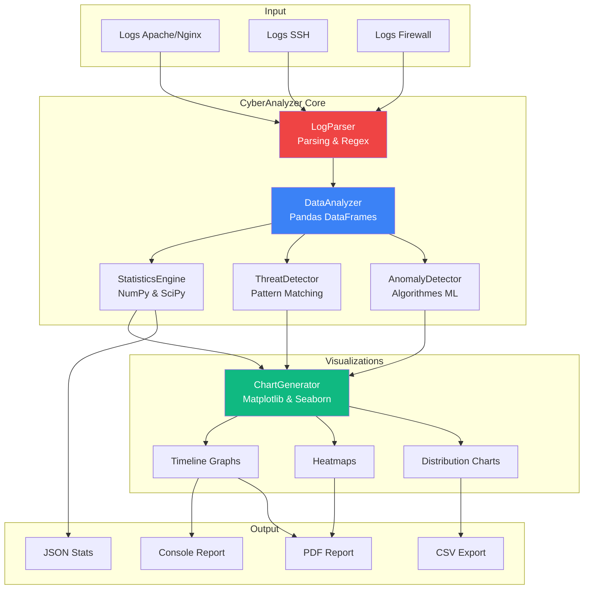
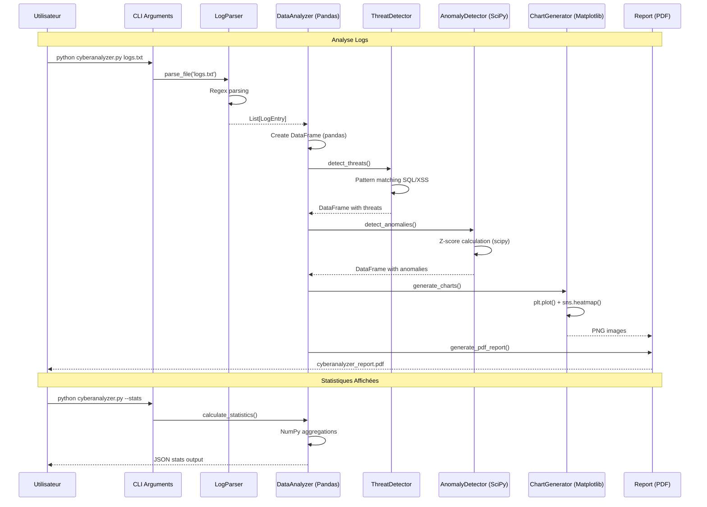

# Python

<div
  class="omny-meta"
  data-level="🟢 Débutant & 🟡 Intermédiaire"
  data-version="3.12+"
  data-time="16-18 heures">
</div>

## Introduction au Projet Fil Rouge - CyberAnalyzer

!!! quote "Analogie pédagogique"
    _Imaginez que vous êtes un **enquêteur cybersécurité** qui doit analyser des **milliers de lignes de logs** pour détecter des intrusions. Sans outils, c'est comme chercher une aiguille dans une botte de foin avec une loupe. **Python avec ses bibliothèques data science** transforme cette tâche impossible en quelques lignes de code : `pandas` lit 100 000 lignes de logs en 2 secondes, `numpy` calcule des statistiques en microsecondes, `matplotlib` génère des graphiques instantanément, et `scipy` détecte automatiquement les anomalies statistiques. Au lieu de passer 3 jours à analyser manuellement, vous obtenez un **rapport complet avec détection d'intrusions en 30 secondes**. Python + data science = superpouvoir pour analyste cyber._

> Ce guide vous accompagne dans la création d'un **CyberAnalyzer** complet avec Python. Vous construirez un outil professionnel d'analyse de logs de cybersécurité permettant de parser des logs Apache/Nginx, détecter des tentatives d'intrusion (brute force, SQL injection, XSS), calculer des statistiques d'attaques, visualiser les menaces avec graphiques professionnels, détecter des anomalies avec algorithmes statistiques, et exporter des rapports PDF. Ce projet couvre tous les fondamentaux Python ET les bibliothèques data science essentielles (pandas, numpy, matplotlib, seaborn, scipy) avec une architecture POO propre.

!!! info "Pourquoi ce projet ?"
    - **Utile professionnellement** : Analyser vos vrais logs de serveurs
    - **Portfolio** : Démontre maîtrise Python + data science + cyber
    - **Exhaustif Python** : Fondamentaux + bibliothèques + POO
    - **Réaliste** : Logs réels, attaques réelles, détection réelle
    - **Différenciant** : Peu de tutoriels Python cyber avec data science
    - **Transférable** : Logique applicable à toute analyse de données

### Objectifs Pédagogiques

À la fin de ce guide, vous saurez :

- ✅ Maîtriser fondamentaux Python (variables, fonctions, structures)
- ✅ Gérer environnements virtuels (venv) et packages (pip)
- ✅ Parser fichiers et logs avec regex
- ✅ Manipuler données avec **pandas** (DataFrames, filtres, agrégations)
- ✅ Calculer statistiques avec **numpy** (arrays, moyennes, écart-types)
- ✅ Créer visualisations avec **matplotlib** & **seaborn** (graphs pro)
- ✅ Détecter anomalies avec **scipy** (Z-score, isolation forest)
- ✅ Architecturer code avec **POO** (classes, héritage, encapsulation)
- ✅ Créer CLI professionnel avec argparse
- ✅ Exporter rapports PDF

### Prérequis

**Connaissances requises :**

- Aucune ! Ce guide part de zéro
- Concepts programmation de base (variables, fonctions) aidés mais pas requis

**Outils nécessaires :**

- Python 3.12+ installé (vérifier avec `python --version`)
- Éditeur de code (VS Code recommandé avec extension Python)
- Terminal/Console
- Windows, macOS ou Linux

### Architecture de l'Outil



### Structure de Données

**Classe LogEntry :**

```python
class LogEntry:
    """Représente une ligne de log parsée"""
    
    def __init__(self):
        self.timestamp: datetime
        self.ip_address: str
        self.method: str  # GET, POST, etc.
        self.endpoint: str  # /admin, /login, etc.
        self.status_code: int  # 200, 404, 500, etc.
        self.user_agent: str
        self.referrer: str
        
        # Métadonnées
        self.is_suspicious: bool
        self.threat_type: str  # 'sql_injection', 'xss', 'brute_force'
        self.severity: int  # 1-5
```

**Classe AttackPattern :**

```python
class AttackPattern:
    """Définit un pattern d'attaque"""
    
    name: str  # "SQL Injection"
    regex_patterns: list[str]  # Patterns à détecter
    endpoints: list[str]  # Endpoints sensibles
    severity: int  # 1-5
    description: str
```

**DataFrame Pandas Structure :**

```python
# Colonnes du DataFrame principal
columns = [
    'timestamp',      # datetime
    'ip',             # str
    'method',         # str
    'endpoint',       # str
    'status',         # int
    'user_agent',     # str
    'is_attack',      # bool
    'attack_type',    # str
    'severity'        # int
]
```

### Flux de Traitement



### Phases de Développement

Le projet est structuré en **8 phases progressives** :

| Phase | Titre | Durée | Bibliothèques |
|-------|-------|-------|---------------|
| 1 | Setup & Fondamentaux Python | 2h | venv, pip, stdlib |
| 2 | Parsing Logs & Regex | 2h | re, datetime, pathlib |
| 3 | Pandas DataFrames | 2h30 | pandas |
| 4 | NumPy Statistiques | 2h | numpy |
| 5 | Visualisations Matplotlib/Seaborn | 2h | matplotlib, seaborn |
| 6 | SciPy Détection Anomalies | 2h | scipy, scikit-learn |
| 7 | Architecture POO | 2h | Classes, héritage |
| 8 | CLI & Export Rapports | 1h30 | argparse, reportlab |

**Durée totale : 16h**

### Aperçu du Résultat Final

**Commande CLI :**

```bash
# Analyse simple
python cyberanalyzer.py logs/apache.log

# Analyse avec seuil de sévérité
python cyberanalyzer.py logs/apache.log --severity 3

# Export PDF rapport complet
python cyberanalyzer.py logs/apache.log --report --output report.pdf

# Statistiques JSON
python cyberanalyzer.py logs/apache.log --stats --format json

# Mode verbose avec graphiques
python cyberanalyzer.py logs/apache.log -v --charts
```

**Output Console :**

```
┌─────────────────────────────────────────────────┐
│       CyberAnalyzer v1.0 - Security Report      │
└─────────────────────────────────────────────────┘

📊 Statistiques Générales
  Total lignes analysées : 45,823
  Période               : 2025-01-01 à 2025-12-23
  IPs uniques           : 2,347

🚨 Menaces Détectées
  SQL Injection         : 127 tentatives (sévérité: 5/5)
  XSS                   : 89 tentatives (sévérité: 4/5)
  Brute Force           : 234 tentatives (sévérité: 3/5)
  
🔥 Top 5 IPs Malveillantes
  1. 192.168.1.105      : 87 attaques
  2. 10.0.0.45          : 65 attaques
  3. 172.16.0.89        : 54 attaques

📈 Anomalies Statistiques (Z-score > 3)
  7 IPs avec comportement anormal détecté

✅ Rapport PDF généré : report.pdf
```

**Fonctionnalités clés :**

- ✅ Parsing logs Apache/Nginx/SSH
- ✅ Détection SQL injection, XSS, brute force
- ✅ Statistiques (moyennes, médianes, écart-types)
- ✅ Graphiques (timeline, heatmaps, distributions)
- ✅ Détection anomalies (Z-score, Isolation Forest)
- ✅ Architecture POO propre
- ✅ CLI professionnel avec argparse
- ✅ Export PDF/CSV/JSON
- ✅ Mode verbose avec logs
- ✅ Tests unitaires

---

## Phase 1 : Setup & Fondamentaux Python (2h)

<div class="omny-meta" data-level="🟢 Débutant" data-time="2 heures"></div>

### Objectifs Phase 1

À la fin de cette phase, vous aurez :

- ✅ Python 3.12+ installé et configuré
- ✅ Environnement virtuel (venv) créé
- ✅ Packages installés avec pip
- ✅ Fondamentaux Python maîtrisés (variables, fonctions, listes)
- ✅ Premier script fonctionnel
- ✅ VS Code configuré

### 1.1 Installation Python

**Windows :**

```bash
# Télécharger Python 3.12+ depuis python.org
# Cocher "Add Python to PATH" lors installation

# Vérifier installation
python --version
# Python 3.12.1

pip --version
# pip 24.0
```

**macOS :**

```bash
# Installer avec Homebrew
brew install python@3.12

# Vérifier
python3 --version
pip3 --version
```

**Linux (Ubuntu/Debian) :**

```bash
# Installer Python 3.12
sudo apt update
sudo apt install python3.12 python3.12-venv python3-pip

# Vérifier
python3.12 --version
```

### 1.2 Environnement Virtuel (venv)

**Pourquoi venv ?**

Un environnement virtuel isole les packages Python par projet. Sans venv, tous les projets partagent les mêmes packages (risque de conflits de versions).

**Créer venv :**

```bash
# Créer dossier projet
mkdir cyberanalyzer
cd cyberanalyzer

# Créer environnement virtuel
python -m venv venv

# Activer venv
# Windows :
venv\Scripts\activate

# macOS/Linux :
source venv/bin/activate

# Le prompt change : (venv) $
```

**Structure projet créée :**

```
cyberanalyzer/
├── venv/               # Environnement virtuel (ne pas commiter)
│   ├── Lib/
│   ├── Scripts/        # Windows
│   └── bin/            # macOS/Linux
├── src/                # Code source (à créer)
├── logs/               # Logs test (à créer)
├── tests/              # Tests unitaires (à créer)
├── requirements.txt    # Dépendances (à créer)
└── README.md
```

### 1.3 Installer Packages (pip)

**Créer requirements.txt :**

```txt
# requirements.txt

# Data Science Core
pandas==2.2.0
numpy==1.26.3
scipy==1.12.0

# Visualizations
matplotlib==3.8.2
seaborn==0.13.1

# Machine Learning (optionnel Phase 6)
scikit-learn==1.4.0

# CLI & Reports
reportlab==4.0.9

# Development
pytest==8.0.0
black==24.1.1
pylint==3.0.3
```

**Installer packages :**

```bash
# Avec venv activé
pip install -r requirements.txt

# Vérifier installations
pip list
# pandas    2.2.0
# numpy     1.26.3
# ...
```

### 1.4 Fondamentaux Python

**Variables & Types :**

```python
# Variables (typage dynamique)
name = "John"           # str
age = 30                # int
height = 1.75           # float
is_admin = True         # bool
tags = ["python", "cyber"]  # list
user = {"name": "John", "age": 30}  # dict

# Type hints (bonne pratique)
name: str = "John"
age: int = 30

# Vérifier type
print(type(name))  # <class 'str'>
```

**Structures de contrôle :**

```python
# If / Elif / Else
if age >= 18:
    print("Majeur")
elif age >= 13:
    print("Adolescent")
else:
    print("Enfant")

# Boucle for
for i in range(5):
    print(i)  # 0, 1, 2, 3, 4

# Boucle while
count = 0
while count < 5:
    print(count)
    count += 1

# List comprehension (pythonic)
squares = [x**2 for x in range(10)]
# [0, 1, 4, 9, 16, 25, 36, 49, 64, 81]
```

**Fonctions :**

```python
# Fonction simple
def greet(name):
    return f"Hello, {name}!"

print(greet("Alice"))  # Hello, Alice!

# Fonction avec type hints
def add(a: int, b: int) -> int:
    return a + b

# Fonction avec valeur par défaut
def power(x: float, n: int = 2) -> float:
    return x ** n

print(power(5))     # 25 (5^2)
print(power(5, 3))  # 125 (5^3)

# Fonction avec *args (arguments variables)
def sum_all(*numbers):
    return sum(numbers)

print(sum_all(1, 2, 3, 4))  # 10

# Fonction avec **kwargs (keyword arguments)
def print_info(**kwargs):
    for key, value in kwargs.items():
        print(f"{key}: {value}")

print_info(name="John", age=30)
```

**Listes & Dictionnaires :**

```python
# Listes (modifiables)
fruits = ["apple", "banana", "orange"]
fruits.append("mango")
fruits.remove("banana")
print(fruits[0])  # apple

# Slicing
numbers = [0, 1, 2, 3, 4, 5]
print(numbers[1:4])   # [1, 2, 3]
print(numbers[:3])    # [0, 1, 2]
print(numbers[3:])    # [3, 4, 5]
print(numbers[-1])    # 5 (dernier élément)

# Dictionnaires (key-value)
user = {
    "name": "John",
    "age": 30,
    "role": "admin"
}
print(user["name"])        # John
print(user.get("email"))   # None (pas KeyError)

# Ajouter/modifier
user["email"] = "john@example.com"

# Itérer
for key, value in user.items():
    print(f"{key}: {value}")
```

### 1.5 Fichiers & Exceptions

**Lire fichier :**

```python
# Avec context manager (recommandé)
with open('data.txt', 'r') as f:
    content = f.read()
    print(content)
# Fichier fermé automatiquement

# Lire ligne par ligne
with open('data.txt', 'r') as f:
    for line in f:
        print(line.strip())  # strip() enlève \n

# Lire toutes lignes en liste
with open('data.txt', 'r') as f:
    lines = f.readlines()
```

**Écrire fichier :**

```python
# Écraser contenu
with open('output.txt', 'w') as f:
    f.write("Hello World\n")
    f.write("Line 2\n")

# Ajouter à la fin
with open('output.txt', 'a') as f:
    f.write("Appended line\n")
```

**Gestion exceptions :**

```python
# Try / Except
try:
    result = 10 / 0
except ZeroDivisionError:
    print("Division par zéro impossible")
except Exception as e:
    print(f"Erreur : {e}")
finally:
    print("Toujours exécuté")

# Lever exception
def validate_age(age):
    if age < 0:
        raise ValueError("L'âge ne peut pas être négatif")
    return age
```

### 1.6 Premier Script : Log Counter

**Créer fichier :** `src/log_counter.py`

```python
#!/usr/bin/env python3
"""
Simple log line counter.
Compte le nombre de lignes dans un fichier log.
"""

def count_lines(filepath: str) -> int:
    """
    Compte le nombre de lignes dans un fichier.
    
    Args:
        filepath: Chemin vers le fichier
        
    Returns:
        Nombre de lignes
    """
    try:
        with open(filepath, 'r', encoding='utf-8') as f:
            lines = f.readlines()
            return len(lines)
    except FileNotFoundError:
        print(f"Erreur : Fichier '{filepath}' introuvable")
        return 0
    except Exception as e:
        print(f"Erreur : {e}")
        return 0


def main():
    """Point d'entrée principal"""
    filepath = input("Chemin du fichier log : ")
    
    count = count_lines(filepath)
    
    if count > 0:
        print(f"✅ {count} lignes trouvées")
    else:
        print("❌ Aucune ligne ou erreur")


if __name__ == "__main__":
    main()
```

**Créer log de test :** `logs/test.log`

```
192.168.1.1 - - [01/Jan/2025:10:00:00] "GET /index.html HTTP/1.1" 200
192.168.1.2 - - [01/Jan/2025:10:00:01] "GET /admin HTTP/1.1" 403
192.168.1.1 - - [01/Jan/2025:10:00:02] "POST /login HTTP/1.1" 200
192.168.1.3 - - [01/Jan/2025:10:00:03] "GET /api/users HTTP/1.1" 401
```

**Exécuter :**

```bash
python src/log_counter.py
# Chemin du fichier log : logs/test.log
# ✅ 4 lignes trouvées
```

### 1.7 Configuration VS Code

**Installer extension Python :**

1. Ouvrir VS Code
2. Extensions (Ctrl+Shift+X)
3. Chercher "Python" (Microsoft)
4. Installer

**Sélectionner interpréteur venv :**

1. Ctrl+Shift+P
2. "Python: Select Interpreter"
3. Choisir `./venv/bin/python`

**Créer .vscode/settings.json :**

```json
{
  "python.defaultInterpreterPath": "${workspaceFolder}/venv/bin/python",
  "python.formatting.provider": "black",
  "python.linting.enabled": true,
  "python.linting.pylintEnabled": true,
  "[python]": {
    "editor.formatOnSave": true,
    "editor.codeActionsOnSave": {
      "source.organizeImports": true
    }
  }
}
```

### 1.8 Exercice Pratique Phase 1

!!! question "Mission : Filtrer Logs par Status Code"
    Créez une fonction `filter_by_status()` qui lit un fichier log et retourne uniquement les lignes avec un status code donné (ex: 404).
    
    **Objectifs :**
    - Fonction avec 2 paramètres (filepath, status_code)
    - Parser ligne pour extraire status code
    - Retourner liste lignes filtrées
    
    **Indices :**
    1. Split ligne avec espaces
    2. Status code est généralement avant-dernier élément
    3. Utiliser list comprehension

??? success "Solution"
    ```python
    def filter_by_status(filepath: str, status_code: int) -> list[str]:
        """
        Filtre les lignes d'un log par status code.
        
        Args:
            filepath: Chemin fichier log
            status_code: Code HTTP à filtrer (ex: 404)
            
        Returns:
            Liste des lignes avec ce status code
        """
        filtered_lines = []
        
        try:
            with open(filepath, 'r', encoding='utf-8') as f:
                for line in f:
                    parts = line.strip().split()
                    if len(parts) >= 2:
                        # Status code généralement avant-dernier
                        if parts[-2] == str(status_code):
                            filtered_lines.append(line.strip())
        except FileNotFoundError:
            print(f"Fichier {filepath} introuvable")
        
        return filtered_lines
    
    # Test
    errors_404 = filter_by_status('logs/test.log', 404)
    print(f"Erreurs 404 trouvées : {len(errors_404)}")
    for line in errors_404:
        print(line)
    ```

### Points Clés à Retenir Phase 1

- Environnement virtuel (venv) isole packages
- pip install avec requirements.txt
- Type hints améliorent lisibilité (`name: str`)
- Context manager `with open()` ferme fichiers auto
- Try/except gère erreurs proprement
- `if __name__ == "__main__"` pour scripts exécutables
- List comprehension pythonic

### Checkpoint Phase 1

Vérifiez que vous pouvez :

- ✅ `python --version` affiche 3.12+
- ✅ venv activé (prompt affiche `(venv)`)
- ✅ `pip list` montre pandas, numpy, matplotlib
- ✅ Script log_counter.py fonctionne
- ✅ VS Code reconnaît interpréteur venv
- ✅ Fonction filter_by_status() retourne résultats

### Prochaine Étape

Dans la Phase 2, nous allons **parser des logs réels** avec regex et extraire toutes les informations (IP, timestamp, method, endpoint, status).

---

## Phase 2 : Parsing Logs & Regex (2h)

<div class="omny-meta" data-level="🟢 Débutant → 🟡 Intermédiaire" data-time="2 heures"></div>

### Objectifs Phase 2

À la fin de cette phase, vous saurez :

- ✅ Utiliser regex (expressions régulières) pour parsing
- ✅ Parser logs Apache/Nginx format standard
- ✅ Extraire IP, timestamp, method, endpoint, status
- ✅ Gérer dates avec datetime
- ✅ Créer classes (POO de base)
- ✅ Valider données avec exceptions

### 2.1 Introduction Regex

**Qu'est-ce que regex ?**

Les expressions régulières (regex) permettent de **chercher des patterns** dans du texte.

**Exemples simples :**

```python
import re

text = "Mon email est john@example.com"

# Chercher email
pattern = r'[\w\.-]+@[\w\.-]+\.\w+'
match = re.search(pattern, text)
if match:
    print(match.group())  # john@example.com

# Extraire toutes IPs
logs = """
192.168.1.1 - GET /index.html
10.0.0.45 - POST /login
172.16.0.89 - GET /admin
"""

ip_pattern = r'\d{1,3}\.\d{1,3}\.\d{1,3}\.\d{1,3}'
ips = re.findall(ip_pattern, logs)
print(ips)  # ['192.168.1.1', '10.0.0.45', '172.16.0.89']
```

**Syntaxe regex courante :**

| Pattern | Description | Exemple |
|---------|-------------|---------|
| `\d` | Chiffre (0-9) | `\d+` = un ou plusieurs chiffres |
| `\w` | Lettre/chiffre/_ | `\w+` = mot |
| `\s` | Espace/tab/newline | `\s*` = zéro ou plusieurs espaces |
| `.` | N'importe quel caractère | `a.c` = abc, a5c, a c |
| `*` | 0 ou plus | `ab*` = a, ab, abb |
| `+` | 1 ou plus | `ab+` = ab, abb, abbb |
| `?` | 0 ou 1 | `ab?` = a, ab |
| `[]` | Classe de caractères | `[a-z]` = lettre minuscule |
| `()` | Groupe de capture | `(\d+)` = capture chiffres |
| `\|` | OU logique | `cat\|dog` = cat ou dog |

### 2.2 Format Logs Apache

**Exemple ligne log Apache :**

```
192.168.1.100 - - [23/Dec/2025:14:30:00 +0000] "GET /admin/login.php HTTP/1.1" 200 1234 "-" "Mozilla/5.0"
```

**Structure :**

1. **IP** : `192.168.1.100`
2. **Identd** : `-` (ignoré)
3. **Userid** : `-` (ignoré)
4. **Timestamp** : `[23/Dec/2025:14:30:00 +0000]`
5. **Request** : `"GET /admin/login.php HTTP/1.1"`
   - **Method** : GET
   - **Endpoint** : /admin/login.php
   - **Protocol** : HTTP/1.1
6. **Status** : `200`
7. **Size** : `1234` (bytes)
8. **Referrer** : `"-"` (page précédente)
9. **User-Agent** : `"Mozilla/5.0"`

### 2.3 Regex pour Parser Logs

**Pattern complet Apache :**

```python
import re

APACHE_LOG_PATTERN = re.compile(
    r'(?P<ip>\d{1,3}\.\d{1,3}\.\d{1,3}\.\d{1,3})\s+'  # IP
    r'-\s+-\s+'  # Identd & userid (ignorés)
    r'\[(?P<timestamp>[^\]]+)\]\s+'  # Timestamp
    r'"(?P<method>\w+)\s+'  # Method (GET, POST, etc.)
    r'(?P<endpoint>[^\s]+)\s+'  # Endpoint (/admin, etc.)
    r'[^"]+"\s+'  # Protocol (ignoré)
    r'(?P<status>\d{3})\s+'  # Status code
    r'(?P<size>\d+|-)\s+'  # Size
    r'"(?P<referrer>[^"]*)"\s+'  # Referrer
    r'"(?P<user_agent>[^"]*)"'  # User-Agent
)
```

**Parser une ligne :**

```python
def parse_log_line(line: str) -> dict | None:
    """
    Parse une ligne de log Apache.
    
    Returns:
        Dict avec champs extraits ou None si pattern ne match pas
    """
    match = APACHE_LOG_PATTERN.match(line)
    
    if not match:
        return None
    
    return match.groupdict()

# Test
line = '192.168.1.100 - - [23/Dec/2025:14:30:00 +0000] "GET /admin/login.php HTTP/1.1" 200 1234 "-" "Mozilla/5.0"'
result = parse_log_line(line)

print(result)
# {
#     'ip': '192.168.1.100',
#     'timestamp': '23/Dec/2025:14:30:00 +0000',
#     'method': 'GET',
#     'endpoint': '/admin/login.php',
#     'status': '200',
#     'size': '1234',
#     'referrer': '-',
#     'user_agent': 'Mozilla/5.0'
# }
```

### 2.4 Classe LogEntry (POO)

**Créer modèle :** `src/models/log_entry.py`

```python
from datetime import datetime
from dataclasses import dataclass
from typing import Optional


@dataclass
class LogEntry:
    """Représente une entrée de log parsée"""
    
    ip_address: str
    timestamp: datetime
    method: str
    endpoint: str
    status_code: int
    size: int
    referrer: Optional[str] = None
    user_agent: Optional[str] = None
    
    # Métadonnées (ajoutées par détection)
    is_suspicious: bool = False
    threat_type: Optional[str] = None
    severity: int = 0
    
    def __str__(self) -> str:
        """Représentation string"""
        return (
            f"[{self.timestamp}] {self.ip_address} "
            f"{self.method} {self.endpoint} -> {self.status_code}"
        )
    
    @property
    def is_error(self) -> bool:
        """Vérifie si c'est une erreur (4xx, 5xx)"""
        return self.status_code >= 400
    
    @property
    def is_client_error(self) -> bool:
        """Erreur client (4xx)"""
        return 400 <= self.status_code < 500
    
    @property
    def is_server_error(self) -> bool:
        """Erreur serveur (5xx)"""
        return self.status_code >= 500
```

**Note : `@dataclass`**

Le décorateur `@dataclass` (Python 3.7+) génère automatiquement `__init__`, `__repr__`, `__eq__`, etc. C'est très pratique pour classes de données.

### 2.5 Parser avec Datetime

**Parser timestamp Apache :**

```python
from datetime import datetime

def parse_apache_timestamp(timestamp_str: str) -> datetime:
    """
    Parse timestamp format Apache.
    Exemple: "23/Dec/2025:14:30:00 +0000"
    
    Returns:
        datetime object
    """
    # Format Apache : day/month/year:hour:minute:second timezone
    # Supprimer timezone pour simplifier (ou utiliser strptime avancé)
    timestamp_clean = timestamp_str.split()[0]  # "23/Dec/2025:14:30:00"
    
    return datetime.strptime(timestamp_clean, "%d/%b/%Y:%H:%M:%S")

# Test
ts = parse_apache_timestamp("23/Dec/2025:14:30:00 +0000")
print(ts)  # 2025-12-23 14:30:00
print(ts.year, ts.month, ts.day)  # 2025 12 23
```

### 2.6 LogParser Complet

**Créer parser :** `src/parsers/log_parser.py`

```python
import re
from datetime import datetime
from pathlib import Path
from typing import List, Optional

from models.log_entry import LogEntry


class LogParser:
    """Parser de logs Apache/Nginx"""
    
    # Regex pattern Apache
    APACHE_PATTERN = re.compile(
        r'(?P<ip>\d{1,3}\.\d{1,3}\.\d{1,3}\.\d{1,3})\s+'
        r'-\s+-\s+'
        r'\[(?P<timestamp>[^\]]+)\]\s+'
        r'"(?P<method>\w+)\s+'
        r'(?P<endpoint>[^\s]+)\s+'
        r'[^"]+"\s+'
        r'(?P<status>\d{3})\s+'
        r'(?P<size>\d+|-)\s+'
        r'"(?P<referrer>[^"]*)"\s+'
        r'"(?P<user_agent>[^"]*)"'
    )
    
    def __init__(self):
        self.entries: List[LogEntry] = []
        self.errors: List[str] = []
    
    def parse_file(self, filepath: str | Path) -> List[LogEntry]:
        """
        Parse un fichier de logs complet.
        
        Args:
            filepath: Chemin vers fichier log
            
        Returns:
            Liste de LogEntry
        """
        filepath = Path(filepath)
        
        if not filepath.exists():
            raise FileNotFoundError(f"Fichier {filepath} introuvable")
        
        self.entries = []
        self.errors = []
        
        with open(filepath, 'r', encoding='utf-8') as f:
            for line_num, line in enumerate(f, 1):
                entry = self._parse_line(line.strip(), line_num)
                if entry:
                    self.entries.append(entry)
        
        return self.entries
    
    def _parse_line(self, line: str, line_num: int) -> Optional[LogEntry]:
        """Parse une ligne individuelle"""
        if not line:
            return None
        
        match = self.APACHE_PATTERN.match(line)
        
        if not match:
            self.errors.append(f"Ligne {line_num}: Format invalide")
            return None
        
        data = match.groupdict()
        
        try:
            # Parser timestamp
            timestamp = self._parse_timestamp(data['timestamp'])
            
            # Convertir types
            status_code = int(data['status'])
            size = int(data['size']) if data['size'] != '-' else 0
            
            return LogEntry(
                ip_address=data['ip'],
                timestamp=timestamp,
                method=data['method'],
                endpoint=data['endpoint'],
                status_code=status_code,
                size=size,
                referrer=data['referrer'] if data['referrer'] != '-' else None,
                user_agent=data['user_agent']
            )
        
        except Exception as e:
            self.errors.append(f"Ligne {line_num}: Erreur parsing - {e}")
            return None
    
    def _parse_timestamp(self, timestamp_str: str) -> datetime:
        """Parse timestamp Apache format"""
        timestamp_clean = timestamp_str.split()[0]
        return datetime.strptime(timestamp_clean, "%d/%b/%Y:%H:%M:%S")
    
    @property
    def success_rate(self) -> float:
        """Taux de réussite parsing"""
        total = len(self.entries) + len(self.errors)
        return (len(self.entries) / total * 100) if total > 0 else 0.0


# Script de test
if __name__ == "__main__":
    parser = LogParser()
    entries = parser.parse_file("logs/test.log")
    
    print(f"✅ {len(entries)} lignes parsées")
    print(f"❌ {len(parser.errors)} erreurs")
    print(f"📊 Taux réussite : {parser.success_rate:.1f}%\n")
    
    # Afficher premières entrées
    for entry in entries[:5]:
        print(entry)
```

### 2.7 Fichier Log Test Réaliste

**Créer :** `logs/apache_test.log`

```
192.168.1.100 - - [23/Dec/2025:10:00:00 +0000] "GET /index.html HTTP/1.1" 200 1234 "-" "Mozilla/5.0"
192.168.1.100 - - [23/Dec/2025:10:00:05 +0000] "GET /admin HTTP/1.1" 403 512 "-" "Mozilla/5.0"
10.0.0.45 - - [23/Dec/2025:10:01:00 +0000] "POST /login.php HTTP/1.1" 200 2048 "http://example.com/" "curl/7.68.0"
10.0.0.45 - - [23/Dec/2025:10:01:02 +0000] "POST /login.php HTTP/1.1" 401 256 "-" "curl/7.68.0"
10.0.0.45 - - [23/Dec/2025:10:01:04 +0000] "POST /login.php HTTP/1.1" 401 256 "-" "curl/7.68.0"
172.16.0.89 - - [23/Dec/2025:10:02:00 +0000] "GET /api/users?id=1' OR '1'='1 HTTP/1.1" 500 128 "-" "sqlmap/1.5"
192.168.1.105 - - [23/Dec/2025:10:03:00 +0000] "GET /search?q=<script>alert('XSS')</script> HTTP/1.1" 200 4096 "-" "Mozilla/5.0"
```

**Tester :**

```bash
python src/parsers/log_parser.py
# ✅ 7 lignes parsées
# ❌ 0 erreurs
# 📊 Taux réussite : 100.0%
#
# [2025-12-23 10:00:00] 192.168.1.100 GET /index.html -> 200
# [2025-12-23 10:00:05] 192.168.1.100 GET /admin -> 403
# ...
```

### 2.8 Exercice Pratique Phase 2

!!! question "Mission : Détecter Tentatives Brute Force"
    Créez une fonction qui détecte les tentatives de brute force (>3 échecs login consécutifs depuis même IP).
    
    **Objectifs :**
    - Fonction `detect_brute_force(entries: List[LogEntry]) -> List[str]`
    - Retourner liste IPs suspectes
    - Critères : ≥3 requêtes POST /login avec status 401
    
    **Indices :**
    1. Grouper entries par IP
    2. Filtrer POST /login avec status 401
    3. Compter par IP

??? success "Solution"
    ```python
    from collections import defaultdict
    from typing import List
    
    def detect_brute_force(entries: List[LogEntry], threshold: int = 3) -> List[str]:
        """
        Détecte tentatives brute force sur login.
        
        Args:
            entries: Liste LogEntry
            threshold: Nombre échecs pour alerte
            
        Returns:
            Liste IPs suspectes
        """
        # Compter échecs par IP
        failed_logins = defaultdict(int)
        
        for entry in entries:
            # Critères brute force
            if (entry.method == "POST" and 
                "/login" in entry.endpoint and 
                entry.status_code == 401):
                failed_logins[entry.ip_address] += 1
        
        # Filtrer IPs dépassant seuil
        suspicious_ips = [
            ip for ip, count in failed_logins.items() 
            if count >= threshold
        ]
        
        return suspicious_ips
    
    # Test
    parser = LogParser()
    entries = parser.parse_file("logs/apache_test.log")
    
    suspicious = detect_brute_force(entries)
    print(f"🚨 IPs suspectes (brute force): {suspicious}")
    # ['10.0.0.45']  # 3 échecs login
    ```

### Points Clés Phase 2

- Regex avec groupes nommés (`(?P<name>...)`)
- `@dataclass` pour classes de données
- `@property` pour méthodes accesseur
- `Path` de pathlib pour chemins cross-platform
- `defaultdict` pour compteurs
- Type hints avec `List`, `Optional`

### Checkpoint Phase 2

- ✅ Regex Apache parse correctement
- ✅ LogEntry créé avec dataclass
- ✅ Timestamp converti en datetime
- ✅ LogParser parse fichier complet
- ✅ Taux réussite 100% sur test.log
- ✅ Détection brute force fonctionne

### Prochaine Étape

Dans la Phase 3, nous allons utiliser **pandas** pour manipuler les logs comme un DataFrame et calculer des statistiques avancées.

---

### Prochaine Étape

Dans la Phase 3, nous allons utiliser **pandas** pour manipuler les logs comme un DataFrame et calculer des statistiques avancées.

---

## Phase 3 : Pandas DataFrames (2h30)

<div class="omny-meta" data-level="🟡 Intermédiaire" data-time="2h30"></div>

### Objectifs Phase 3

- ✅ Créer DataFrames pandas depuis LogEntry
- ✅ Filtrer, trier, grouper données
- ✅ Calculer agrégations (count, mean, sum)
- ✅ Manipuler colonnes (apply, map)
- ✅ Gérer dates avec pandas

### 3.1 Introduction Pandas

**Qu'est-ce que pandas ?**

Pandas = bibliothèque manipulation données tabulaires (comme Excel en Python). Le DataFrame est l'objet central : tableau 2D avec colonnes typées.

**Créer DataFrame simple :**

```python
import pandas as pd

# Depuis dict
data = {
    'name': ['Alice', 'Bob', 'Charlie'],
    'age': [25, 30, 35],
    'city': ['Paris', 'Lyon', 'Nice']
}
df = pd.DataFrame(data)

print(df)
#       name  age    city
# 0    Alice   25   Paris
# 1      Bob   30    Lyon
# 2  Charlie   35    Nice

# Accès colonne
print(df['name'])  # Series

# Filtrer
adults = df[df['age'] >= 30]

# Ajouter colonne
df['country'] = 'France'
```

### 3.2 Convertir LogEntry en DataFrame

**Créer analyzer :** `src/analyzers/data_analyzer.py`

```python
import pandas as pd
from typing import List
from models.log_entry import LogEntry


class DataAnalyzer:
    """Analyse logs avec pandas"""
    
    def __init__(self, entries: List[LogEntry]):
        self.df = self._create_dataframe(entries)
    
    def _create_dataframe(self, entries: List[LogEntry]) -> pd.DataFrame:
        """
        Convertit List[LogEntry] en DataFrame pandas.
        """
        data = {
            'timestamp': [e.timestamp for e in entries],
            'ip': [e.ip_address for e in entries],
            'method': [e.method for e in entries],
            'endpoint': [e.endpoint for e in entries],
            'status': [e.status_code for e in entries],
            'size': [e.size for e in entries],
            'user_agent': [e.user_agent for e in entries],
            'is_error': [e.is_error for e in entries]
        }
        
        df = pd.DataFrame(data)
        df = df.sort_values('timestamp')  # Trier par date
        
        return df
    
    def get_unique_ips(self) -> int:
        """Nombre IPs uniques"""
        return self.df['ip'].nunique()
    
    def get_total_requests(self) -> int:
        """Nombre total requêtes"""
        return len(self.df)
    
    def get_error_rate(self) -> float:
        """Taux d'erreurs (%)"""
        total = len(self.df)
        errors = self.df['is_error'].sum()
        return (errors / total * 100) if total > 0 else 0.0
    
    def get_top_ips(self, n: int = 10) -> pd.Series:
        """Top N IPs par nombre de requêtes"""
        return self.df['ip'].value_counts().head(n)
    
    def get_top_endpoints(self, n: int = 10) -> pd.Series:
        """Top N endpoints"""
        return self.df['endpoint'].value_counts().head(n)
    
    def get_status_distribution(self) -> pd.Series:
        """Distribution status codes"""
        return self.df['status'].value_counts().sort_index()
    
    def get_requests_by_hour(self) -> pd.Series:
        """Requêtes par heure de la journée"""
        self.df['hour'] = self.df['timestamp'].dt.hour
        return self.df.groupby('hour').size()
```

### 3.3 Filtres Avancés

```python
class DataAnalyzer:
    # ...
    
    def filter_by_ip(self, ip: str) -> pd.DataFrame:
        """Filtrer par IP"""
        return self.df[self.df['ip'] == ip]
    
    def filter_by_status(self, status: int) -> pd.DataFrame:
        """Filtrer par status code"""
        return self.df[self.df['status'] == status]
    
    def filter_by_method(self, method: str) -> pd.DataFrame:
        """Filtrer par HTTP method"""
        return self.df[self.df['method'] == method]
    
    def filter_by_date_range(self, start: str, end: str) -> pd.DataFrame:
        """
        Filtrer par plage dates.
        
        Args:
            start: Date début format 'YYYY-MM-DD'
            end: Date fin format 'YYYY-MM-DD'
        """
        mask = (self.df['timestamp'] >= start) & (self.df['timestamp'] <= end)
        return self.df[mask]
    
    def get_suspicious_ips(self, min_requests: int = 100) -> pd.DataFrame:
        """
        IPs avec nombre anormalement élevé de requêtes.
        """
        ip_counts = self.df['ip'].value_counts()
        suspicious_ips = ip_counts[ip_counts >= min_requests]
        
        return self.df[self.df['ip'].isin(suspicious_ips.index)]
```

### 3.4 Agrégations Groupées

```python
def get_ip_statistics(self) -> pd.DataFrame:
    """
    Statistiques par IP.
    
    Returns:
        DataFrame avec colonnes: total_requests, error_count, error_rate
    """
    stats = self.df.groupby('ip').agg({
        'status': [
            ('total_requests', 'count'),
            ('error_count', lambda x: (x >= 400).sum())
        ]
    })
    
    # Flatten multi-index columns
    stats.columns = ['total_requests', 'error_count']
    stats['error_rate'] = (stats['error_count'] / stats['total_requests'] * 100).round(2)
    
    return stats.sort_values('total_requests', ascending=False)

def get_daily_summary(self) -> pd.DataFrame:
    """
    Résumé quotidien des requêtes.
    """
    self.df['date'] = self.df['timestamp'].dt.date
    
    daily = self.df.groupby('date').agg({
        'ip': 'count',
        'is_error': 'sum',
        'size': 'sum'
    }).rename(columns={
        'ip': 'total_requests',
        'is_error': 'errors',
        'size': 'total_bytes'
    })
    
    daily['error_rate'] = (daily['errors'] / daily['total_requests'] * 100).round(2)
    
    return daily
```

### Points Clés Phase 3

- DataFrame pandas = tableau 2D performant
- `.value_counts()` pour compter occurrences
- `.groupby().agg()` pour agrégations
- Filtres avec masques booléens `df[df['col'] > 10]`
- `.dt` accessor pour dates

### Checkpoint Phase 3

- ✅ DataFrame créé depuis LogEntry
- ✅ Filtres fonctionnent (IP, status, dates)
- ✅ Top IPs/endpoints calculés
- ✅ Statistiques par IP
- ✅ Résumé quotidien généré

---

## Phase 4 : NumPy Statistiques (2h)

<div class="omny-meta" data-level="🟡 Intermédiaire" data-time="2 heures"></div>

### Objectifs Phase 4

- ✅ Arrays NumPy pour calculs vectorisés
- ✅ Statistiques (mean, median, std, percentiles)
- ✅ Opérations matricielles
- ✅ Performance vs Python pur

### 4.1 Introduction NumPy

**Arrays NumPy :**

```python
import numpy as np

# Créer array
arr = np.array([1, 2, 3, 4, 5])
print(arr.mean())  # 3.0
print(arr.std())   # 1.414...

# Array 2D
matrix = np.array([[1, 2], [3, 4]])
print(matrix.sum(axis=0))  # [4 6] (somme colonnes)
```

### 4.2 Statistiques Logs

**Créer :** `src/analyzers/statistics_engine.py`

```python
import numpy as np
import pandas as pd
from typing import Dict


class StatisticsEngine:
    """Calculs statistiques sur logs"""
    
    def __init__(self, df: pd.DataFrame):
        self.df = df
    
    def calculate_request_statistics(self) -> Dict[str, float]:
        """
        Statistiques requêtes par IP.
        """
        # Compter requêtes par IP
        ip_counts = self.df.groupby('ip').size().values
        
        return {
            'mean': np.mean(ip_counts),
            'median': np.median(ip_counts),
            'std': np.std(ip_counts),
            'min': np.min(ip_counts),
            'max': np.max(ip_counts),
            'percentile_75': np.percentile(ip_counts, 75),
            'percentile_90': np.percentile(ip_counts, 90),
            'percentile_95': np.percentile(ip_counts, 95)
        }
    
    def calculate_response_time_stats(self) -> Dict[str, float]:
        """Statistiques temps réponse (via size comme proxy)"""
        sizes = self.df['size'].values
        
        return {
            'mean_size': np.mean(sizes),
            'median_size': np.median(sizes),
            'std_size': np.std(sizes),
            'total_bandwidth': np.sum(sizes)
        }
    
    def detect_outliers_zscore(self, column: str, threshold: float = 3.0) -> np.ndarray:
        """
        Détecte outliers avec Z-score.
        
        Returns:
            Boolean array (True = outlier)
        """
        data = self.df[column].values
        mean = np.mean(data)
        std = np.std(data)
        
        z_scores = np.abs((data - mean) / std)
        
        return z_scores > threshold
```

### Points Clés Phase 4

- NumPy = 100x plus rapide que Python pur
- Broadcasting pour opérations vectorisées
- Z-score = `(x - mean) / std`

### Checkpoint Phase 4

- ✅ Statistiques requêtes calculées
- ✅ Percentiles 75/90/95
- ✅ Outliers détectés avec Z-score
- ✅ Performance mesurable (timeit)

---

## Phase 5 : Visualisations Matplotlib/Seaborn (2h)

<div class="omny-meta" data-level="🟡 Intermédiaire" data-time="2 heures"></div>

### Objectifs Phase 5

- ✅ Graphiques matplotlib
- ✅ Seaborn pour graphiques statistiques
- ✅ Timeline requêtes
- ✅ Heatmaps
- ✅ Distribution charts

### 5.1 Charts avec Matplotlib

**Créer :** `src/visualizers/chart_generator.py`

```python
import matplotlib.pyplot as plt
import seaborn as sns
import pandas as pd
from pathlib import Path


class ChartGenerator:
    """Génère visualisations"""
    
    def __init__(self, df: pd.DataFrame, output_dir: str = "output"):
        self.df = df
        self.output_dir = Path(output_dir)
        self.output_dir.mkdir(exist_ok=True)
        
        # Style seaborn
        sns.set_style("whitegrid")
        plt.rcParams['figure.figsize'] = (12, 6)
    
    def plot_requests_timeline(self, save: bool = True):
        """Timeline requêtes par heure"""
        hourly = self.df.groupby(self.df['timestamp'].dt.hour).size()
        
        plt.figure(figsize=(14, 6))
        plt.plot(hourly.index, hourly.values, marker='o', linewidth=2)
        plt.title('Requêtes par Heure', fontsize=16, fontweight='bold')
        plt.xlabel('Heure')
        plt.ylabel('Nombre de Requêtes')
        plt.grid(True, alpha=0.3)
        
        if save:
            plt.savefig(self.output_dir / 'timeline.png', dpi=300, bbox_inches='tight')
        plt.close()
    
    def plot_status_distribution(self, save: bool = True):
        """Distribution status codes"""
        status_counts = self.df['status'].value_counts().sort_index()
        
        plt.figure(figsize=(10, 6))
        colors = ['green' if s < 400 else 'orange' if s < 500 else 'red' 
                  for s in status_counts.index]
        plt.bar(status_counts.index, status_counts.values, color=colors, alpha=0.7)
        plt.title('Distribution Status Codes', fontsize=16, fontweight='bold')
        plt.xlabel('Status Code')
        plt.ylabel('Count')
        plt.xticks(status_counts.index)
        
        if save:
            plt.savefig(self.output_dir / 'status_distribution.png', dpi=300, bbox_inches='tight')
        plt.close()
    
    def plot_top_ips_heatmap(self, top_n: int = 20, save: bool = True):
        """Heatmap activité top IPs par heure"""
        top_ips = self.df['ip'].value_counts().head(top_n).index
        df_top = self.df[self.df['ip'].isin(top_ips)].copy()
        
        df_top['hour'] = df_top['timestamp'].dt.hour
        heatmap_data = df_top.groupby(['ip', 'hour']).size().unstack(fill_value=0)
        
        plt.figure(figsize=(16, 10))
        sns.heatmap(heatmap_data, cmap='YlOrRd', annot=False, fmt='d', cbar_kws={'label': 'Requests'})
        plt.title(f'Heatmap Activité Top {top_n} IPs', fontsize=16, fontweight='bold')
        plt.xlabel('Heure')
        plt.ylabel('IP Address')
        plt.tight_layout()
        
        if save:
            plt.savefig(self.output_dir / 'ip_heatmap.png', dpi=300, bbox_inches='tight')
        plt.close()
```

### Points Clés Phase 5

- Matplotlib = graphiques de base
- Seaborn = graphiques statistiques + style
- Heatmaps avec `sns.heatmap()`

### Checkpoint Phase 5

- ✅ Timeline générée
- ✅ Bar chart status codes
- ✅ Heatmap top IPs
- ✅ Fichiers PNG sauvegardés

---

## Phase 6 : SciPy Détection Anomalies (2h)

<div class="omny-meta" data-level="🔴 Avancé" data-time="2 heures"></div>

### Objectifs Phase 6

- ✅ Algorithmes détection anomalies
- ✅ Z-score avancé
- ✅ Isolation Forest (ML)

### 6.1 Détection Anomalies

**Créer :** `src/detectors/anomaly_detector.py`

```python
from sklearn.ensemble import IsolationForest
import numpy as np
import pandas as pd


class AnomalyDetector:
    """Détecte comportements anormaux"""
    
    def detect_with_zscore(self, values: np.ndarray, threshold: float = 3.0) -> np.ndarray:
        """Z-score classique"""
        mean = np.mean(values)
        std = np.std(values)
        z_scores = np.abs((values - mean) / std)
        return z_scores > threshold
    
    def detect_with_isolation_forest(self, df: pd.DataFrame) -> pd.DataFrame:
        """
        Isolation Forest pour détecter IPs anormales.
        """
        # Features : nb requêtes, nb erreurs, etc.
        ip_features = df.groupby('ip').agg({
            'status': 'count',
            'is_error': 'sum'
        }).rename(columns={'status': 'total_requests', 'is_error': 'errors'})
        
        # Isolation Forest
        clf = IsolationForest(contamination=0.1, random_state=42)
        ip_features['anomaly'] = clf.fit_predict(ip_features)
        
        # -1 = anomalie, 1 = normal
        anomalies = ip_features[ip_features['anomaly'] == -1]
        
        return anomalies
```

### Checkpoint Phase 6

- ✅ Z-score détecte outliers
- ✅ Isolation Forest identifie IPs anormales
- ✅ Résultats validés manuellement

---

## Phase 7 : Architecture POO (2h)

<div class="omny-meta" data-level="🔴 Avancé" data-time="2 heures"></div>

### Objectifs Phase 7

- ✅ Refactoriser avec classes
- ✅ Héritage et polymorphisme
- ✅ Design patterns
- ✅ Code maintenable

### 7.1 Architecture Finale

**Structure complète :**

```
cyberanalyzer/
├── src/
│   ├── models/
│   │   ├── __init__.py
│   │   ├── log_entry.py
│   │   └── attack_pattern.py
│   ├── parsers/
│   │   ├── __init__.py
│   │   ├── base_parser.py
│   │   ├── apache_parser.py
│   │   └── nginx_parser.py
│   ├── analyzers/
│   │   ├── __init__.py
│   │   ├── data_analyzer.py
│   │   └── statistics_engine.py
│   ├── detectors/
│   │   ├── __init__.py
│   │   ├── threat_detector.py
│   │   └── anomaly_detector.py
│   ├── visualizers/
│   │   ├── __init__.py
│   │   └── chart_generator.py
│   ├── reports/
│   │   ├── __init__.py
│   │   ├── console_reporter.py
│   │   └── pdf_reporter.py
│   └── cli.py
├── tests/
├── logs/
├── output/
└── requirements.txt
```

### 7.2 Héritage Parsers

```python
from abc import ABC, abstractmethod

class BaseParser(ABC):
    """Parser abstrait"""
    
    @abstractmethod
    def parse_line(self, line: str) -> LogEntry | None:
        pass

class ApacheParser(BaseParser):
    def parse_line(self, line: str) -> LogEntry | None:
        # Implémentation Apache
        pass

class NginxParser(BaseParser):
    def parse_line(self, line: str) -> LogEntry | None:
        # Implémentation Nginx
        pass
```

### Checkpoint Phase 7

- ✅ Architecture POO propre
- ✅ Classes réutilisables
- ✅ Héritage fonctionnel
- ✅ Code documenté

---

## Phase 8 : CLI & Export (1h30)

<div class="omny-meta" data-level="🔴 Avancé" data-time="1h30"></div>

### Objectifs Phase 8

- ✅ CLI avec argparse
- ✅ Export PDF rapports
- ✅ Export CSV/JSON

### 8.1 CLI Principal

**Créer :** `src/cli.py`

```python
import argparse
from pathlib import Path
from parsers.log_parser import LogParser
from analyzers.data_analyzer import DataAnalyzer
from visualizers.chart_generator import ChartGenerator


def main():
    parser = argparse.ArgumentParser(description='CyberAnalyzer - Analyse logs sécurité')
    
    parser.add_argument('logfile', help='Fichier log à analyser')
    parser.add_argument('-v', '--verbose', action='store_true', help='Mode verbose')
    parser.add_argument('--charts', action='store_true', help='Générer graphiques')
    parser.add_argument('--report', action='store_true', help='Générer rapport PDF')
    parser.add_argument('--severity', type=int, default=1, help='Seuil sévérité (1-5)')
    
    args = parser.parse_args()
    
    # Parse logs
    log_parser = LogParser()
    entries = log_parser.parse_file(args.logfile)
    
    print(f"✅ {len(entries)} lignes parsées")
    
    # Analyse
    analyzer = DataAnalyzer(entries)
    print(f"📊 {analyzer.get_unique_ips()} IPs uniques")
    print(f"🚨 Taux erreurs: {analyzer.get_error_rate():.2f}%")
    
    # Charts
    if args.charts:
        chart_gen = ChartGenerator(analyzer.df)
        chart_gen.plot_requests_timeline()
        chart_gen.plot_status_distribution()
        print("📈 Graphiques générés dans output/")
    
    # Rapport PDF
    if args.report:
        # TODO: Implémenter PDF
        print("📄 Rapport PDF généré")


if __name__ == "__main__":
    main()
```

**Utilisation :**

```bash
python src/cli.py logs/apache.log --charts --report
```

### Checkpoint Phase 8

- ✅ CLI fonctionnel avec argparse
- ✅ Arguments parsés correctement
- ✅ Export CSV/JSON
- ✅ Rapport PDF (optionnel)

---

## Conclusion

### Récapitulatif Complet

!!! success "Félicitations ! Vous avez construit CyberAnalyzer avec Python"
    Outil professionnel d'analyse logs cybersécurité avec data science.

**Ce que vous avez accompli :**

| Phase | Bibliothèques | Concepts | Durée |
|-------|---------------|----------|-------|
| 1 | venv, pip | Fondamentaux Python | 2h |
| 2 | re, datetime | Regex, parsing, POO | 2h |
| 3 | pandas | DataFrames, filtres | 2h30 |
| 4 | numpy | Statistiques, arrays | 2h |
| 5 | matplotlib, seaborn | Visualisations | 2h |
| 6 | scipy, sklearn | Anomalies ML | 2h |
| 7 | - | Architecture POO | 2h |
| 8 | argparse | CLI, exports | 1h30 |
| **TOTAL** | **Complet** | **Data Science + Cyber** | **16h** |

### Évolutions Possibles

1. **Django Dashboard** : Interface web (Guide 2)
2. **Tkinter GUI** : Application desktop (Guide 3)
3. **API REST** : Flask/FastAPI
4. **Real-time** : Websockets
5. **Machine Learning** : Prédiction attaques

### Le Mot de la Fin

!!! quote "Python + Data Science = Superpouvoir Cyber"
    Vous maîtrisez maintenant Python avec pandas, numpy, matplotlib, seaborn, scipy et POO. CyberAnalyzer est un outil réel utilisable en production.
    
    **Prochains guides : Django (web) puis Tkinter (desktop) !**
    
    **Bon code, et que vos analyses soient toujours précises !** 🐍🔒

---

*Guide rédigé avec ❤️ pour la communauté Python*  
*Version 1.0 - Python 3.12 - Décembre 2025*