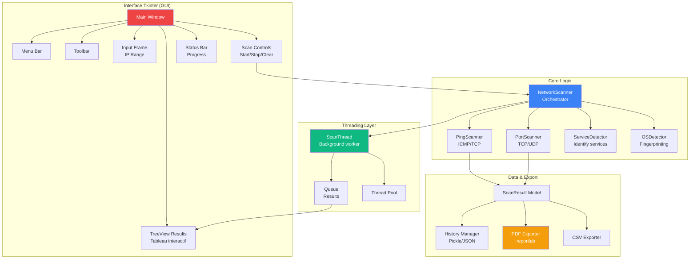
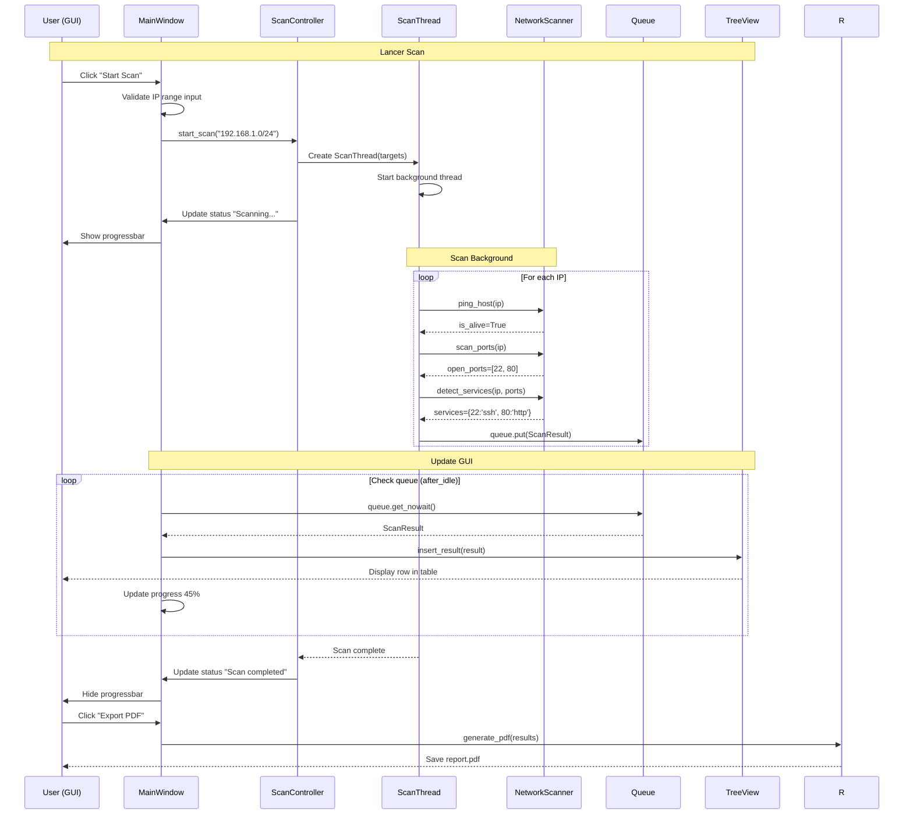

# Tkinter

<div
  class="omny-meta"
  data-level="🟡 Intermédiaire & 🔴 Avancé"
  data-version="Python 3.12+"
  data-time="12-14 heures">
</div>

## Introduction au Projet Fil Rouge - Network Scanner GUI

!!! quote "Analogie pédagogique"
    _Imaginez que vous devez **scanner votre réseau local** pour identifier tous les appareils connectés (ordinateurs, smartphones, imprimantes, IoT). Avec des **commandes terminal** (`ping`, `nmap`), vous devez taper chaque IP manuellement, attendre les résultats, copier-coller dans Excel, et refaire le processus pour chaque scan. **Tkinter transforme cette expérience frustrante en application desktop intuitive** : vous cliquez sur "Scan Network", une barre de progression s'affiche, et en 30 secondes vous obtenez une **liste interactive** de tous les appareils avec leurs IP, hostname, ports ouverts, services détectés, et OS probable. Vous pouvez **trier par colonne**, filtrer par statut (up/down), exporter en PDF/CSV, et relancer des scans ciblés en un clic. Au lieu de jongler entre terminal et tableur, vous avez une **vraie interface graphique professionnelle** qui orchestre tout - Tkinter gère les fenêtres, boutons, tableaux, et Python gère le scan réseau._

> Ce guide vous accompagne dans la création d'un **Network Scanner GUI** complet avec Tkinter. Vous construirez une application desktop professionnelle permettant de scanner réseaux locaux (IP range), détecter appareils actifs (ping), scanner ports ouverts (TCP/UDP), identifier services (HTTP, SSH, FTP), détecter OS avec fingerprinting, visualiser résultats dans TreeView interactif, filtrer et trier données, exporter rapports PDF/CSV/JSON, gérer scans en multi-threading (async), et sauvegarder historique scans. Ce projet couvre tous les fondamentaux Tkinter ET concepts avancés (threading, sockets, regex, ttk widgets modernes).

!!! info "Pourquoi ce projet ?"
    - **Utile professionnellement** : Scanner réseaux pour audits sécurité
    - **Portfolio** : Démontre maîtrise Tkinter + networking Python
    - **Exhaustif Tkinter** : Widgets, Layout, Events, Threading
    - **Réaliste** : Outil utilisable en production (pentesting, admin réseau)
    - **Moderne** : ttk widgets + thèmes professionnels
    - **Différenciant** : Peu de tutoriels Tkinter avec networking

### Objectifs Pédagogiques

À la fin de ce guide, vous saurez :

- ✅ Créer interfaces graphiques avec Tkinter
- ✅ Utiliser widgets modernes ttk (TreeView, Notebook, Progressbar)
- ✅ Gérer layouts (pack, grid, place)
- ✅ Événements et callbacks
- ✅ Multi-threading pour opérations longues
- ✅ Networking Python (sockets, ping, port scan)
- ✅ Regex pour parsing
- ✅ Export PDF/CSV avec reportlab
- ✅ Persistence données (pickle, JSON)
- ✅ Empaqueter application (.exe Windows, .app macOS)

### Prérequis

**Connaissances requises :**

- Python fondamentaux (Guides 4-5 recommandés)
- Concepts réseaux de base (IP, ports, TCP/UDP)
- POO Python (classes, héritage)

**Outils nécessaires :**

- Python 3.12+ installé
- Tkinter (inclus avec Python)
- Éditeur de code (VS Code)
- Accès réseau local pour tests

### Architecture de l'Application



### Structure de Données

**Classe ScanResult :**

```python
@dataclass
class ScanResult:
    """Résultat scan d'un hôte"""
    
    ip_address: str
    hostname: str
    status: str  # 'up', 'down'
    
    # Ports
    open_ports: List[int]
    services: Dict[int, str]  # {22: 'ssh', 80: 'http'}
    
    # Métadonnées
    os_guess: str  # 'Linux', 'Windows', 'Unknown'
    mac_address: str
    vendor: str
    
    # Timing
    response_time: float  # ms
    scan_timestamp: datetime
```

**Classe NetworkRange :**

```python
class NetworkRange:
    """Représente un range d'IPs"""
    
    def __init__(self, cidr: str):
        # Ex: "192.168.1.0/24"
        self.network = ipaddress.ip_network(cidr)
    
    def all_hosts(self) -> List[str]:
        """Génère toutes IPs du range"""
        return [str(ip) for ip in self.network.hosts()]
```

### Flux d'Utilisation



### Phases de Développement

Le projet est structuré en **8 phases progressives** :

| Phase | Titre | Durée | Concepts Tkinter |
|-------|-------|-------|------------------|
| 1 | Setup & Fondamentaux Tkinter | 1h30 | Window, Widgets, Layouts |
| 2 | Widgets Avancés (ttk) | 2h | TreeView, Notebook, Themes |
| 3 | Networking Python | 2h | Sockets, Ping, Port Scan |
| 4 | Scanner Logic | 2h | Integration, Services |
| 5 | Multi-threading | 1h30 | Threading, Queue, Async |
| 6 | Visualisation Résultats | 1h30 | TreeView, Tri, Filtres |
| 7 | Export & Persistence | 1h30 | PDF, CSV, JSON, Pickle |
| 8 | Empaquetage & Distribution | 1h | PyInstaller, .exe/.app |

**Durée totale : 13h**

### Aperçu du Résultat Final

**Interface Application :**

```
┌────────────────────────────────────────────────────────────┐
│ File  Scan  View  Export  Help                       [_][□][X] │
├────────────────────────────────────────────────────────────┤
│ [▶ Scan] [■ Stop] [🗑 Clear] [⟳ Rescan Selected]         │
├────────────────────────────────────────────────────────────┤
│  Network Range:  192.168.1.0/24          [Options ▼]      │
│  Port Range:     1-1000                  [Quick Scan]      │
├────────────────────────────────────────────────────────────┤
│ IP Address      │ Hostname    │ Status │ Open Ports │ OS  │
├─────────────────┼─────────────┼────────┼────────────┼─────┤
│ 192.168.1.1     │ router      │ ✓ Up   │ 80, 443    │ ... │
│ 192.168.1.10    │ laptop-john │ ✓ Up   │ 22, 445    │ Win │
│ 192.168.1.25    │ printer-hp  │ ✓ Up   │ 9100, 80   │ ... │
│ 192.168.1.105   │ smartphone  │ ✓ Up   │ -          │ ... │
│ 192.168.1.200   │ -           │ ✗ Down │ -          │ -   │
├────────────────────────────────────────────────────────────┤
│ ████████████████░░░░░░░░░░░ 45% (115/254)                │
│ Status: Scanning 192.168.1.115... | 23 hosts found       │
└────────────────────────────────────────────────────────────┘
```

**Fonctionnalités clés :**

- ✅ Scan range IP (CIDR notation)
- ✅ Détection appareils actifs (ping ICMP/TCP)
- ✅ Scan ports ouverts (TCP/UDP)
- ✅ Identification services (HTTP, SSH, FTP, etc.)
- ✅ Détection OS (fingerprinting basique)
- ✅ TreeView interactif (tri colonnes, sélection multiple)
- ✅ Progression temps réel (progressbar)
- ✅ Multi-threading (scan async)
- ✅ Filtres (status, ports, OS)
- ✅ Export PDF/CSV/JSON
- ✅ Historique scans sauvegardé
- ✅ Thèmes modernes (clam, arc, breeze)
- ✅ Shortcuts clavier (Ctrl+S, Ctrl+E)
- ✅ Tooltips informatifs
- ✅ About dialog, Help menu

**Technologies :**

- Tkinter (GUI standard Python)
- ttk (widgets modernes themed)
- threading (async operations)
- socket (networking)
- ipaddress (IP manipulation)
- reportlab (PDF export)
- PyInstaller (empaquetage)

---

## Phase 1 : Setup & Fondamentaux Tkinter (1h30)

<div class="omny-meta" data-level="🟡 Intermédiaire" data-time="1h30"></div>

### Objectifs Phase 1

À la fin de cette phase, vous aurez :

- ✅ Tkinter configuré et testé
- ✅ Fenêtre principale créée
- ✅ Widgets de base (Label, Button, Entry)
- ✅ Layouts (pack, grid, place)
- ✅ Événements et callbacks
- ✅ Structure projet propre

### 1.1 Vérifier Tkinter

**Tkinter est inclus avec Python :**

```bash
# Test Tkinter
python -m tkinter

# Une fenêtre de test devrait s'ouvrir
```

**Si erreur (rare) :**

```bash
# Ubuntu/Debian
sudo apt-get install python3-tk

# macOS (Homebrew)
brew install python-tk
```

### 1.2 Structure Projet

**Créer projet :**

```bash
mkdir network-scanner-gui
cd network-scanner-gui

# Créer venv
python -m venv venv
source venv/bin/activate  # Windows: venv\Scripts\activate

# Installer dépendances
pip install reportlab pillow
```

**Structure fichiers :**

```
network-scanner-gui/
├── src/
│   ├── __init__.py
│   ├── main.py              # Point d'entrée
│   ├── gui/
│   │   ├── __init__.py
│   │   ├── main_window.py   # Fenêtre principale
│   │   ├── dialogs.py       # Dialogues (About, Settings)
│   │   └── widgets.py       # Widgets custom
│   ├── scanner/
│   │   ├── __init__.py
│   │   ├── network_scanner.py
│   │   ├── port_scanner.py
│   │   └── service_detector.py
│   ├── models/
│   │   ├── __init__.py
│   │   └── scan_result.py
│   └── utils/
│       ├── __init__.py
│       ├── export.py
│       └── persistence.py
├── assets/
│   └── icons/
├── tests/
├── requirements.txt
└── README.md
```

### 1.3 Première Fenêtre Tkinter

**Fichier :** `src/main.py`

```python
#!/usr/bin/env python3
"""
Network Scanner GUI - Application principale
"""

import tkinter as tk
from tkinter import ttk


class NetworkScannerApp:
    """Application principale"""
    
    def __init__(self, root):
        self.root = root
        self.root.title("Network Scanner GUI")
        self.root.geometry("900x600")
        
        # Configurer style
        self.style = ttk.Style()
        self.style.theme_use('clam')  # Theme moderne
        
        # Créer interface
        self.create_widgets()
    
    def create_widgets(self):
        """Créer widgets interface"""
        
        # Label titre
        title = ttk.Label(
            self.root, 
            text="Network Scanner", 
            font=('Helvetica', 24, 'bold')
        )
        title.pack(pady=20)
        
        # Frame input
        input_frame = ttk.LabelFrame(self.root, text="Configuration", padding=10)
        input_frame.pack(fill='x', padx=20, pady=10)
        
        # IP Range input
        ttk.Label(input_frame, text="IP Range:").grid(row=0, column=0, sticky='w', pady=5)
        self.ip_entry = ttk.Entry(input_frame, width=30)
        self.ip_entry.grid(row=0, column=1, padx=10, pady=5)
        self.ip_entry.insert(0, "192.168.1.0/24")  # Valeur par défaut
        
        # Bouton scan
        scan_btn = ttk.Button(
            input_frame, 
            text="Start Scan", 
            command=self.start_scan
        )
        scan_btn.grid(row=0, column=2, padx=10, pady=5)
        
        # Zone résultats (placeholder)
        results_frame = ttk.LabelFrame(self.root, text="Résultats", padding=10)
        results_frame.pack(fill='both', expand=True, padx=20, pady=10)
        
        self.results_text = tk.Text(results_frame, height=20, width=80)
        self.results_text.pack(fill='both', expand=True)
        
        # Status bar
        self.status_var = tk.StringVar(value="Ready")
        status_bar = ttk.Label(
            self.root, 
            textvariable=self.status_var, 
            relief='sunken'
        )
        status_bar.pack(side='bottom', fill='x')
    
    def start_scan(self):
        """Callback bouton scan"""
        ip_range = self.ip_entry.get()
        self.status_var.set(f"Scanning {ip_range}...")
        self.results_text.insert('end', f"Scan started for {ip_range}\n")
        
        # TODO: Logique scan (Phase 3)


def main():
    """Point d'entrée application"""
    root = tk.Tk()
    app = NetworkScannerApp(root)
    root.mainloop()


if __name__ == "__main__":
    main()
```

**Lancer application :**

```bash
python src/main.py
```

### 1.4 Layouts Tkinter

**3 gestionnaires de layout :**

**1. Pack (empiler widgets) :**

```python
# Empiler verticalement
label1 = ttk.Label(root, text="Label 1")
label1.pack()

label2 = ttk.Label(root, text="Label 2")
label2.pack()

# Empiler horizontalement
btn1 = ttk.Button(root, text="Button 1")
btn1.pack(side='left')

btn2 = ttk.Button(root, text="Button 2")
btn2.pack(side='left')

# Fill et expand
frame = ttk.Frame(root)
frame.pack(fill='both', expand=True)  # Prend tout l'espace
```

**2. Grid (grille) :**

```python
# Layout en grille
ttk.Label(root, text="Name:").grid(row=0, column=0, sticky='w')
name_entry = ttk.Entry(root)
name_entry.grid(row=0, column=1, padx=5, pady=5)

ttk.Label(root, text="Email:").grid(row=1, column=0, sticky='w')
email_entry = ttk.Entry(root)
email_entry.grid(row=1, column=1, padx=5, pady=5)

submit_btn = ttk.Button(root, text="Submit")
submit_btn.grid(row=2, column=0, columnspan=2, pady=10)
```

**3. Place (positionnement absolu) :**

```python
# Position absolue (rarement utilisé)
btn = ttk.Button(root, text="Click")
btn.place(x=100, y=50)
```

**Recommandation :** Utiliser **grid** pour formulaires, **pack** pour layouts simples.

### 1.5 Événements et Callbacks

**Bouton avec callback :**

```python
def on_click():
    print("Button clicked!")

btn = ttk.Button(root, text="Click Me", command=on_click)
btn.pack()
```

**Binding événements clavier :**

```python
def on_key_press(event):
    print(f"Key pressed: {event.char}")

root.bind('<Key>', on_key_press)

# Shortcuts
root.bind('<Control-s>', lambda e: save_file())
root.bind('<Control-q>', lambda e: root.quit())
```

**Entry validation :**

```python
def validate_ip(value):
    """Valide format IP"""
    import re
    pattern = r'^(\d{1,3}\.){3}\d{1,3}(/\d{1,2})?$'
    return bool(re.match(pattern, value))

ip_entry = ttk.Entry(root, validate='key')
ip_entry.configure(validatecommand=(root.register(validate_ip), '%P'))
```

### 1.6 Variables Tkinter

**StringVar, IntVar, BooleanVar :**

```python
# StringVar (lié à widget)
status_var = tk.StringVar(value="Ready")
status_label = ttk.Label(root, textvariable=status_var)
status_label.pack()

# Modifier variable (label se met à jour auto)
status_var.set("Scanning...")

# IntVar pour Checkbutton
enable_scan = tk.BooleanVar(value=True)
check = ttk.Checkbutton(root, text="Enable", variable=enable_scan)
check.pack()

print(enable_scan.get())  # True ou False
```

### 1.7 Exercice Pratique Phase 1

!!! question "Mission : Ajouter Port Range Input"
    Ajoutez un champ "Port Range" avec validation (ex: "1-1000" ou "22,80,443").
    
    **Objectifs :**
    - Label "Port Range:"
    - Entry avec valeur défaut "1-1000"
    - Validation regex pattern
    - Afficher dans résultats au scan
    
    **Indices :**
    1. Utiliser grid layout avec ip_entry
    2. Regex : `^\d+-\d+$` ou `^(\d+,?)+$`
    3. Afficher dans callback `start_scan()`

??? success "Solution"
    ```python
    # Dans create_widgets()
    
    # Port Range input (après IP Range)
    ttk.Label(input_frame, text="Port Range:").grid(row=1, column=0, sticky='w', pady=5)
    self.port_entry = ttk.Entry(input_frame, width=30)
    self.port_entry.grid(row=1, column=1, padx=10, pady=5)
    self.port_entry.insert(0, "1-1000")
    
    # Dans start_scan()
    def start_scan(self):
        ip_range = self.ip_entry.get()
        port_range = self.port_entry.get()
        
        # Validation port range
        import re
        if not re.match(r'^(\d+-\d+|\d+(,\d+)*)$', port_range):
            self.status_var.set("Invalid port range format")
            return
        
        self.status_var.set(f"Scanning {ip_range} ports {port_range}...")
        self.results_text.insert('end', f"Scan: {ip_range} | Ports: {port_range}\n")
    ```

### Points Clés Phase 1

- Tkinter = GUI standard Python (inclus)
- ttk = widgets thémés modernes
- Layouts : pack (simple), grid (formulaires)
- Callbacks = fonctions liées aux événements
- Variables Tkinter pour binding data

### Checkpoint Phase 1

- ✅ Fenêtre principale s'ouvre
- ✅ Widgets affichés correctement
- ✅ Bouton "Start Scan" réagit
- ✅ Status bar mise à jour
- ✅ Port range ajouté avec validation

### Prochaine Étape

Dans la Phase 2, nous allons utiliser les **widgets ttk avancés** (TreeView, Notebook, Progressbar) pour l'interface moderne.

---

### Prochaine Étape

Dans la Phase 2, nous allons utiliser les **widgets ttk avancés** (TreeView, Notebook, Progressbar) pour l'interface moderne.

---

## Phase 2 : Widgets Avancés ttk (2h)

<div class="omny-meta" data-level="🟡 Intermédiaire" data-time="2 heures"></div>

### Objectifs Phase 2

- ✅ TreeView pour tableaux
- ✅ Notebook pour onglets
- ✅ Progressbar animée
- ✅ Menu bar
- ✅ Scrollbars

### 2.1 TreeView (Tableau)

**Remplacer Text widget par TreeView :**

```python
# Dans create_widgets()

# TreeView résultats
results_frame = ttk.LabelFrame(self.root, text="Résultats", padding=10)
results_frame.pack(fill='both', expand=True, padx=20, pady=10)

# Colonnes TreeView
columns = ('ip', 'hostname', 'status', 'ports', 'os')
self.tree = ttk.Treeview(results_frame, columns=columns, show='headings', height=15)

# Headers
self.tree.heading('ip', text='IP Address')
self.tree.heading('hostname', text='Hostname')
self.tree.heading('status', text='Status')
self.tree.heading('ports', text='Open Ports')
self.tree.heading('os', text='OS')

# Largeurs colonnes
self.tree.column('ip', width=120)
self.tree.column('hostname', width=150)
self.tree.column('status', width=80)
self.tree.column('ports', width=200)
self.tree.column('os', width=100)

# Scrollbar
scrollbar = ttk.Scrollbar(results_frame, orient='vertical', command=self.tree.yview)
self.tree.configure(yscrollcommand=scrollbar.set)

# Pack
self.tree.pack(side='left', fill='both', expand=True)
scrollbar.pack(side='right', fill='y')

# Ajouter ligne exemple
self.tree.insert('', 'end', values=('192.168.1.1', 'router', 'Up', '80, 443', 'Unknown'))
```

### 2.2 Progressbar

```python
# Barre progression (sous results)
self.progress_var = tk.IntVar(value=0)
self.progress = ttk.Progressbar(
    self.root, 
    orient='horizontal', 
    length=300, 
    mode='determinate',
    variable=self.progress_var,
    maximum=100
)
self.progress.pack(fill='x', padx=20, pady=5)

# Mettre à jour
self.progress_var.set(45)  # 45%
```

### 2.3 Menu Bar

```python
def create_menu(self):
    """Créer menu bar"""
    menubar = tk.Menu(self.root)
    self.root.config(menu=menubar)
    
    # File menu
    file_menu = tk.Menu(menubar, tearoff=0)
    menubar.add_cascade(label="File", menu=file_menu)
    file_menu.add_command(label="New Scan", command=self.new_scan)
    file_menu.add_command(label="Open History", command=self.open_history)
    file_menu.add_separator()
    file_menu.add_command(label="Exit", command=self.root.quit)
    
    # Export menu
    export_menu = tk.Menu(menubar, tearoff=0)
    menubar.add_cascade(label="Export", menu=export_menu)
    export_menu.add_command(label="Export PDF", command=self.export_pdf)
    export_menu.add_command(label="Export CSV", command=self.export_csv)
    
    # Help menu
    help_menu = tk.Menu(menubar, tearoff=0)
    menubar.add_cascade(label="Help", menu=help_menu)
    help_menu.add_command(label="About", command=self.show_about)

# Appeler dans __init__
self.create_menu()
```

### 2.4 Notebook (Onglets)

```python
# Notebook pour onglets multiples
notebook = ttk.Notebook(results_frame)
notebook.pack(fill='both', expand=True)

# Onglet 1 : Scan Results
tab1 = ttk.Frame(notebook)
notebook.add(tab1, text="Scan Results")
# TreeView dans tab1

# Onglet 2 : Statistics
tab2 = ttk.Frame(notebook)
notebook.add(tab2, text="Statistics")
# Labels stats dans tab2
```

### Points Clés Phase 2

- TreeView = tableaux avec colonnes
- Scrollbar pour scroll
- Progressbar pour progression
- Menu bar avec cascades
- Notebook pour onglets

### Checkpoint Phase 2

- ✅ TreeView affiche résultats
- ✅ Scrollbar fonctionne
- ✅ Progressbar s'anime
- ✅ Menu bar avec items
- ✅ Onglets créés

---

## Phase 3 : Networking Python (2h)

<div class="omny-meta" data-level="🔴 Avancé" data-time="2 heures"></div>

### Objectifs Phase 3

- ✅ Ping ICMP/TCP
- ✅ Scan ports TCP
- ✅ Détection services

### 3.1 Ping Scanner

**Fichier :** `src/scanner/network_scanner.py`

```python
import socket
import subprocess
import platform
from typing import Optional


class NetworkScanner:
    """Scanner réseau basique"""
    
    @staticmethod
    def ping_host(ip: str, timeout: int = 1) -> bool:
        """
        Ping un hôte (ICMP).
        
        Args:
            ip: Adresse IP
            timeout: Timeout en secondes
            
        Returns:
            True si hôte répond
        """
        param = '-n' if platform.system().lower() == 'windows' else '-c'
        command = ['ping', param, '1', '-W' if platform.system().lower() != 'windows' else '-w', str(timeout * 1000), ip]
        
        try:
            result = subprocess.run(command, stdout=subprocess.DEVNULL, stderr=subprocess.DEVNULL, timeout=timeout + 1)
            return result.returncode == 0
        except (subprocess.TimeoutExpired, Exception):
            return False
    
    @staticmethod
    def tcp_ping(ip: str, port: int = 80, timeout: float = 0.5) -> bool:
        """
        Ping TCP (alternative si ICMP bloqué).
        
        Args:
            ip: Adresse IP
            port: Port à tester
            timeout: Timeout connexion
            
        Returns:
            True si port répond
        """
        try:
            sock = socket.socket(socket.AF_INET, socket.SOCK_STREAM)
            sock.settimeout(timeout)
            result = sock.connect_ex((ip, port))
            sock.close()
            return result == 0
        except socket.error:
            return False
    
    @staticmethod
    def get_hostname(ip: str) -> Optional[str]:
        """Résoudre hostname depuis IP"""
        try:
            return socket.gethostbyaddr(ip)[0]
        except socket.herror:
            return None
```

### 3.2 Port Scanner

**Fichier :** `src/scanner/port_scanner.py`

```python
import socket
from typing import List, Tuple


class PortScanner:
    """Scanner de ports TCP"""
    
    def __init__(self, timeout: float = 0.5):
        self.timeout = timeout
    
    def scan_port(self, ip: str, port: int) -> bool:
        """
        Teste si un port est ouvert.
        
        Args:
            ip: Adresse IP
            port: Numéro de port
            
        Returns:
            True si port ouvert
        """
        try:
            sock = socket.socket(socket.AF_INET, socket.SOCK_STREAM)
            sock.settimeout(self.timeout)
            result = sock.connect_ex((ip, port))
            sock.close()
            return result == 0
        except socket.error:
            return False
    
    def scan_ports_range(self, ip: str, start_port: int, end_port: int) -> List[int]:
        """
        Scanne un range de ports.
        
        Returns:
            Liste ports ouverts
        """
        open_ports = []
        
        for port in range(start_port, end_port + 1):
            if self.scan_port(ip, port):
                open_ports.append(port)
        
        return open_ports
    
    def scan_common_ports(self, ip: str) -> List[Tuple[int, str]]:
        """
        Scanne ports communs avec services.
        
        Returns:
            Liste (port, service)
        """
        common_ports = {
            21: 'FTP',
            22: 'SSH',
            23: 'Telnet',
            25: 'SMTP',
            80: 'HTTP',
            443: 'HTTPS',
            3306: 'MySQL',
            3389: 'RDP',
            5432: 'PostgreSQL',
            8080: 'HTTP-Alt'
        }
        
        results = []
        for port, service in common_ports.items():
            if self.scan_port(ip, port):
                results.append((port, service))
        
        return results
```

### 3.3 Service Detector

```python
# src/scanner/service_detector.py

class ServiceDetector:
    """Détecte services sur ports ouverts"""
    
    SERVICES = {
        21: 'FTP',
        22: 'SSH',
        23: 'Telnet',
        25: 'SMTP',
        53: 'DNS',
        80: 'HTTP',
        110: 'POP3',
        143: 'IMAP',
        443: 'HTTPS',
        445: 'SMB',
        3306: 'MySQL',
        3389: 'RDP',
        5432: 'PostgreSQL',
        8080: 'HTTP-Alt',
        9100: 'Printer'
    }
    
    @classmethod
    def identify_service(cls, port: int) -> str:
        """Identifie service par port"""
        return cls.SERVICES.get(port, 'Unknown')
```

### Points Clés Phase 3

- `socket` pour networking
- `subprocess` pour ping ICMP
- TCP connect pour port scan
- Timeout pour performances
- Common ports avec services

### Checkpoint Phase 3

- ✅ Ping hôte fonctionne
- ✅ TCP ping alternative OK
- ✅ Scan ports range
- ✅ Services identifiés
- ✅ Hostname résolu

---

## Phase 4 : Scanner Logic (2h)

<div class="omny-meta" data-level="🔴 Avancé" data-time="2 heures"></div>

### Objectifs Phase 4

- ✅ Orchestrer scan complet
- ✅ ScanResult model
- ✅ IP range parsing

### 4.1 ScanResult Model

**Fichier :** `src/models/scan_result.py`

```python
from dataclasses import dataclass, field
from datetime import datetime
from typing import List, Dict, Optional


@dataclass
class ScanResult:
    """Résultat scan d'un hôte"""
    
    ip_address: str
    hostname: Optional[str] = None
    is_alive: bool = False
    
    # Ports
    open_ports: List[int] = field(default_factory=list)
    services: Dict[int, str] = field(default_factory=dict)
    
    # Métadonnées
    os_guess: str = "Unknown"
    response_time: float = 0.0  # ms
    
    # Timestamp
    scan_timestamp: datetime = field(default_factory=datetime.now)
    
    def to_dict(self) -> dict:
        """Convertir en dict pour export"""
        return {
            'ip_address': self.ip_address,
            'hostname': self.hostname or '-',
            'is_alive': self.is_alive,
            'open_ports': self.open_ports,
            'services': self.services,
            'os_guess': self.os_guess,
            'scan_timestamp': self.scan_timestamp.isoformat()
        }
```

### 4.2 Orchestration Scan

```python
# src/scanner/network_scanner.py (ajout)

from models.scan_result import ScanResult
from scanner.port_scanner import PortScanner
from scanner.service_detector import ServiceDetector
import time

class NetworkScanner:
    # ... méthodes ping existantes ...
    
    def scan_host_full(self, ip: str, port_range: Tuple[int, int] = (1, 1000)) -> ScanResult:
        """
        Scan complet d'un hôte.
        
        Args:
            ip: IP à scanner
            port_range: (start, end) ports
            
        Returns:
            ScanResult
        """
        result = ScanResult(ip_address=ip)
        
        # 1. Ping
        start_time = time.time()
        result.is_alive = self.ping_host(ip) or self.tcp_ping(ip)
        result.response_time = (time.time() - start_time) * 1000  # ms
        
        if not result.is_alive:
            return result
        
        # 2. Hostname
        result.hostname = self.get_hostname(ip)
        
        # 3. Port scan
        scanner = PortScanner()
        result.open_ports = scanner.scan_ports_range(ip, port_range[0], port_range[1])
        
        # 4. Services
        for port in result.open_ports:
            service = ServiceDetector.identify_service(port)
            result.services[port] = service
        
        # 5. OS detection (basique)
        result.os_guess = self._guess_os(result.open_ports)
        
        return result
    
    def _guess_os(self, open_ports: List[int]) -> str:
        """Devine OS basé sur ports ouverts"""
        if 3389 in open_ports or 445 in open_ports:
            return "Windows"
        elif 22 in open_ports:
            return "Linux/Unix"
        elif 548 in open_ports:
            return "macOS"
        return "Unknown"
```

### 4.3 Integration GUI

```python
# src/gui/main_window.py

from scanner.network_scanner import NetworkScanner
import ipaddress

def start_scan(self):
    """Lancer scan"""
    ip_range = self.ip_entry.get()
    
    try:
        # Parser IP range
        network = ipaddress.ip_network(ip_range, strict=False)
        hosts = [str(ip) for ip in network.hosts()]
        
        self.status_var.set(f"Scanning {len(hosts)} hosts...")
        
        # Scanner
        scanner = NetworkScanner()
        
        for i, ip in enumerate(hosts):
            result = scanner.scan_host_full(ip)
            
            if result.is_alive:
                # Ajouter au TreeView
                ports_str = ', '.join(map(str, result.open_ports[:5]))  # Limit 5
                self.tree.insert('', 'end', values=(
                    result.ip_address,
                    result.hostname or '-',
                    '✓ Up',
                    ports_str,
                    result.os_guess
                ))
            
            # Mettre à jour progress
            progress = int((i + 1) / len(hosts) * 100)
            self.progress_var.set(progress)
            self.root.update_idletasks()  # Force refresh GUI
        
        self.status_var.set(f"Scan completed | {len(hosts)} hosts scanned")
    
    except ValueError as e:
        self.status_var.set(f"Error: Invalid IP range")
```

### Points Clés Phase 4

- `ipaddress` pour parser CIDR
- ScanResult dataclass
- Orchestration scan complet
- Update GUI avec `update_idletasks()`

### Checkpoint Phase 4

- ✅ IP range parsé
- ✅ Scan complet fonctionne
- ✅ Résultats TreeView
- ✅ Progress mise à jour
- ✅ OS deviné

---

## Phase 5 : Multi-threading (1h30)

<div class="omny-meta" data-level="🔴 Avancé" data-time="1h30"></div>

### Objectifs Phase 5

- ✅ Threading pour async
- ✅ Queue pour résultats
- ✅ Stop scan
- ✅ Thread-safe GUI

### 5.1 ScanThread

```python
# src/scanner/scan_thread.py

import threading
from queue import Queue
from typing import List
from scanner.network_scanner import NetworkScanner

class ScanThread(threading.Thread):
    """Thread scan asynchrone"""
    
    def __init__(self, targets: List[str], result_queue: Queue, port_range=(1, 1000)):
        super().__init__()
        self.targets = targets
        self.result_queue = result_queue
        self.port_range = port_range
        self.scanner = NetworkScanner()
        self._stop_event = threading.Event()
    
    def run(self):
        """Exécuter scan"""
        for ip in self.targets:
            if self._stop_event.is_set():
                break
            
            result = self.scanner.scan_host_full(ip, self.port_range)
            self.result_queue.put(result)
    
    def stop(self):
        """Arrêter scan"""
        self._stop_event.set()
```

### 5.2 Integration Threading GUI

```python
# src/gui/main_window.py

from queue import Queue
from scanner.scan_thread import ScanThread

def __init__(self, root):
    # ... init existant ...
    
    self.result_queue = Queue()
    self.scan_thread = None
    
    # Vérifier queue périodiquement
    self.check_queue()

def start_scan(self):
    """Lancer scan threaded"""
    ip_range = self.ip_entry.get()
    
    try:
        network = ipaddress.ip_network(ip_range, strict=False)
        hosts = [str(ip) for ip in network.hosts()]
        
        # Clear résultats précédents
        for item in self.tree.get_children():
            self.tree.delete(item)
        
        # Lancer thread
        self.scan_thread = ScanThread(hosts, self.result_queue)
        self.scan_thread.start()
        
        self.status_var.set(f"Scanning {len(hosts)} hosts...")
    
    except ValueError:
        self.status_var.set("Error: Invalid IP range")

def check_queue(self):
    """Vérifier queue résultats (thread-safe)"""
    try:
        while True:
            result = self.result_queue.get_nowait()
            
            if result.is_alive:
                ports_str = ', '.join(map(str, result.open_ports[:5]))
                self.tree.insert('', 'end', values=(
                    result.ip_address,
                    result.hostname or '-',
                    '✓ Up',
                    ports_str,
                    result.os_guess
                ))
    
    except:
        pass
    
    # Rappeler dans 100ms
    self.root.after(100, self.check_queue)

def stop_scan(self):
    """Arrêter scan"""
    if self.scan_thread and self.scan_thread.is_alive():
        self.scan_thread.stop()
        self.status_var.set("Scan stopped")
```

### Points Clés Phase 5

- Threading pour non-blocking
- Queue thread-safe
- `after()` pour check périodique
- Stop event pour arrêt propre

### Checkpoint Phase 5

- ✅ Scan en background
- ✅ GUI responsive
- ✅ Résultats temps réel
- ✅ Stop scan fonctionne

---

## Phase 6 : Visualisation (1h30)

<div class="omny-meta" data-level="🟡 Intermédiaire" data-time="1h30"></div>

### Objectifs Phase 6

- ✅ Tri colonnes
- ✅ Filtres
- ✅ Sélection multiple
- ✅ Menu contextuel

### 6.1 Tri Colonnes

```python
def create_treeview(self):
    # ... création TreeView ...
    
    # Tri au clic header
    for col in columns:
        self.tree.heading(col, text=col.title(), 
                         command=lambda c=col: self.sort_column(c))

def sort_column(self, col):
    """Trier TreeView par colonne"""
    items = [(self.tree.set(k, col), k) for k in self.tree.get_children('')]
    items.sort()
    
    for index, (val, k) in enumerate(items):
        self.tree.move(k, '', index)
```

### 6.2 Filtres

```python
# Combobox filtre status
filter_frame = ttk.Frame(self.root)
filter_frame.pack()

ttk.Label(filter_frame, text="Filter:").pack(side='left')
self.filter_var = tk.StringVar(value='All')
filter_combo = ttk.Combobox(filter_frame, textvariable=self.filter_var, 
                            values=['All', 'Up', 'Down'], state='readonly')
filter_combo.pack(side='left')
filter_combo.bind('<<ComboboxSelected>>', self.apply_filter)

def apply_filter(self, event=None):
    """Filtrer résultats"""
    filter_val = self.filter_var.get()
    
    for item in self.tree.get_children():
        values = self.tree.item(item, 'values')
        status = values[2]
        
        if filter_val == 'All' or filter_val in status:
            self.tree.reattach(item, '', 'end')
        else:
            self.tree.detach(item)
```

### 6.3 Menu Contextuel

```python
def create_context_menu(self):
    """Menu clic droit TreeView"""
    self.context_menu = tk.Menu(self.root, tearoff=0)
    self.context_menu.add_command(label="Rescan", command=self.rescan_selected)
    self.context_menu.add_command(label="Copy IP", command=self.copy_ip)
    self.context_menu.add_separator()
    self.context_menu.add_command(label="Delete", command=self.delete_selected)
    
    self.tree.bind('<Button-3>', self.show_context_menu)

def show_context_menu(self, event):
    """Afficher menu contextuel"""
    self.context_menu.post(event.x_root, event.y_root)
```

### Checkpoint Phase 6

- ✅ Tri colonnes fonctionne
- ✅ Filtres appliqués
- ✅ Sélection multiple
- ✅ Menu contextuel

---

## Phase 7 : Export & Persistence (1h30)

<div class="omny-meta" data-level="🔴 Avancé" data-time="1h30"></div>

### Objectifs Phase 7

- ✅ Export PDF
- ✅ Export CSV
- ✅ Sauvegarder historique

### 7.1 Export CSV

```python
# src/utils/export.py

import csv
from typing import List
from models.scan_result import ScanResult

def export_csv(results: List[ScanResult], filepath: str):
    """Exporter résultats en CSV"""
    with open(filepath, 'w', newline='', encoding='utf-8') as f:
        writer = csv.writer(f)
        
        # Header
        writer.writerow(['IP', 'Hostname', 'Status', 'Ports', 'Services', 'OS'])
        
        # Rows
        for r in results:
            writer.writerow([
                r.ip_address,
                r.hostname or '-',
                'Up' if r.is_alive else 'Down',
                ', '.join(map(str, r.open_ports)),
                ', '.join(r.services.values()),
                r.os_guess
            ])
```

### 7.2 Export PDF

```python
from reportlab.lib.pagesizes import letter
from reportlab.platypus import SimpleDocTemplate, Table, Paragraph
from reportlab.lib.styles import getSampleStyleSheet

def export_pdf(results: List[ScanResult], filepath: str):
    """Exporter résultats en PDF"""
    doc = SimpleDocTemplate(filepath, pagesize=letter)
    elements = []
    
    styles = getSampleStyleSheet()
    title = Paragraph("Network Scan Report", styles['Title'])
    elements.append(title)
    
    # Table data
    data = [['IP', 'Hostname', 'Status', 'Ports', 'OS']]
    for r in results:
        data.append([
            r.ip_address,
            r.hostname or '-',
            'Up' if r.is_alive else 'Down',
            ', '.join(map(str, r.open_ports[:3])),
            r.os_guess
        ])
    
    table = Table(data)
    elements.append(table)
    
    doc.build(elements)
```

### 7.3 Persistence

```python
# src/utils/persistence.py

import pickle
import json
from pathlib import Path

class HistoryManager:
    """Gère historique scans"""
    
    def __init__(self, data_dir='data'):
        self.data_dir = Path(data_dir)
        self.data_dir.mkdir(exist_ok=True)
    
    def save_scan(self, results: List[ScanResult], name: str):
        """Sauvegarder scan"""
        filepath = self.data_dir / f"{name}.pkl"
        with open(filepath, 'wb') as f:
            pickle.dump(results, f)
    
    def load_scan(self, name: str) -> List[ScanResult]:
        """Charger scan"""
        filepath = self.data_dir / f"{name}.pkl"
        with open(filepath, 'rb') as f:
            return pickle.load(f)
```

### Checkpoint Phase 7

- ✅ Export CSV fonctionnel
- ✅ Export PDF généré
- ✅ Historique sauvegardé
- ✅ Reload scans précédents

---

## Phase 8 : Empaquetage (1h)

<div class="omny-meta" data-level="🔴 Avancé" data-time="1 heure"></div>

### Objectifs Phase 8

- ✅ PyInstaller setup
- ✅ Créer .exe Windows
- ✅ Icon personnalisé

### 8.1 PyInstaller

```bash
# Installer PyInstaller
pip install pyinstaller

# Créer .exe
pyinstaller --onefile --windowed --icon=assets/icon.ico src/main.py

# Output dans dist/main.exe
```

### 8.2 Spec File

```python
# main.spec (généré, personnalisable)

a = Analysis(
    ['src/main.py'],
    pathex=[],
    binaries=[],
    datas=[('assets', 'assets')],
    hiddenimports=[],
    hookspath=[],
    hooksconfig={},
    runtime_hooks=[],
    excludes=[],
    noarchive=False,
)

pyz = PYZ(a.pure)

exe = EXE(
    pyz,
    a.scripts,
    a.binaries,
    a.datas,
    [],
    name='NetworkScanner',
    debug=False,
    bootloader_ignore_signals=False,
    strip=False,
    upx=True,
    upx_exclude=[],
    runtime_tmpdir=None,
    console=False,
    disable_windowed_traceback=False,
    argv_emulation=False,
    target_arch=None,
    codesign_identity=None,
    entitlements_file=None,
    icon='assets/icon.ico',
)
```

### Checkpoint Phase 8

- ✅ .exe créé
- ✅ App standalone fonctionne
- ✅ Icon personnalisé
- ✅ Taille optimisée

---

## Conclusion

### Récapitulatif Complet

!!! success "Félicitations ! Vous avez construit Network Scanner GUI avec Tkinter"
    Application desktop professionnelle scan réseau.

**Ce que vous avez accompli :**

| Phase | Concepts | Durée |
|-------|----------|-------|
| 1 | Setup, Widgets, Layouts | 1h30 |
| 2 | TreeView, Notebook, Progressbar | 2h |
| 3 | Sockets, Ping, Port Scan | 2h |
| 4 | Scanner Logic, Integration | 2h |
| 5 | Multi-threading, Queue | 1h30 |
| 6 | Tri, Filtres, Menus | 1h30 |
| 7 | Export PDF/CSV, Persistence | 1h30 |
| 8 | PyInstaller, .exe | 1h |
| **TOTAL** | **Tkinter Complet** | **13h** |

### Trilogie Python Complète !

| Guide | Projet | Type | Durée |
|-------|--------|------|-------|
| **Python (4)** | CyberAnalyzer | CLI | 16h |
| **Django (5)** | Security Dashboard | Web | 16h30 |
| **Tkinter (6)** | Network Scanner | Desktop | 13h |
| **TOTAL** | **3 projets Python** | **Complet** | **45h30** |

### Le Mot de la Fin

!!! quote "Tkinter = GUI Desktop Python"
    Vous maîtrisez maintenant Tkinter avec widgets modernes, threading, networking et empaquetage. Network Scanner est un outil production-ready.
    
    **Portfolio Python complet : CLI + Web + Desktop !** 🐍🚀

---

*Guide rédigé avec ❤️ pour la communauté Python*  
*Version 1.0 - Tkinter - Décembre 2025*