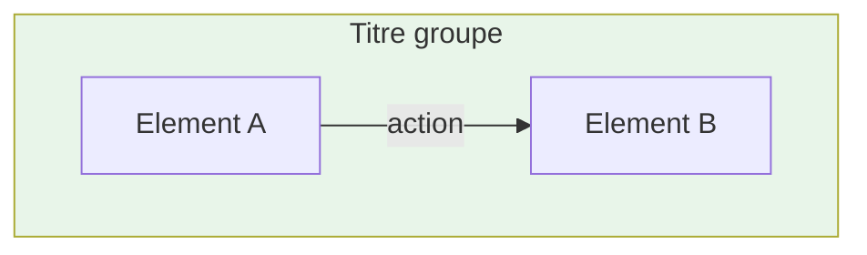
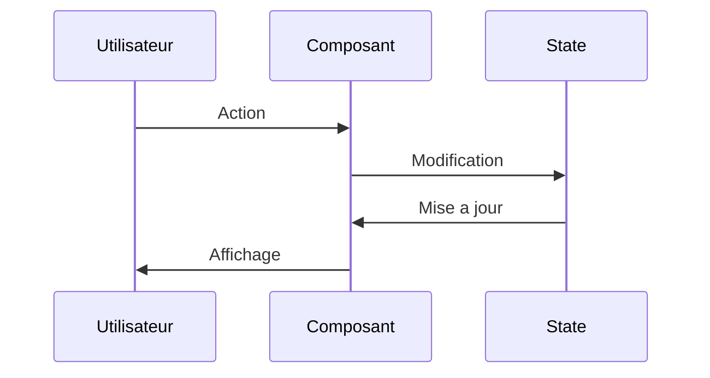
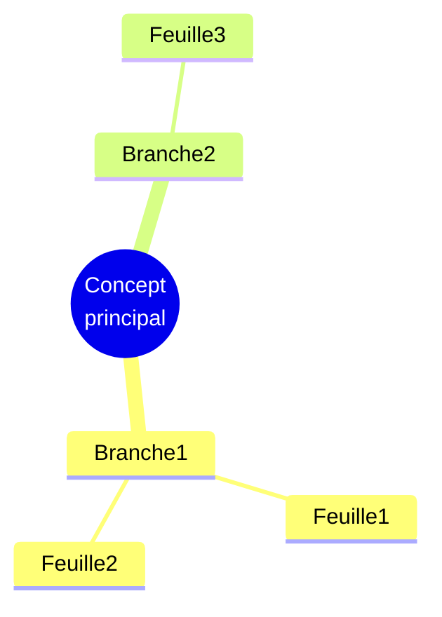

# Template Standard - Lecons Alpine.js

Ce document definit la structure et les conventions a respecter pour chaque lecon de la formation Alpine.js.

---

## Structure du frontmatter

```yaml
---
description: "[Action verb] + [Sujet precis] + [Benefice ou contexte]"
icon: lucide/[icone-contextuelle]
tags: ["ALPINE", "TAG_SPECIFIQUE_1", "TAG_SPECIFIQUE_2"]
---
```

### Regles du frontmatter

| Champ | Regle | Exemple BON | Exemple MAUVAIS |
|-------|-------|-------------|-----------------|
| `description` | Unique par lecon, commence par un verbe | "Maitriser les evenements clavier et leurs modifiers" | "Formation complete Alpine.js" |
| `icon` | Contextuelle au contenu | `lucide/keyboard` pour les evenements | `lucide/mountain` partout |
| `tags` | 3-5 tags pertinents | `["ALPINE", "EVENTS", "MODIFIERS"]` | `["CYBERSECURITY", "PENTEST"]` |

### Icones recommandees par chapitre

| Chapitre | Theme | Icones suggerees |
|----------|-------|------------------|
| C1 | Installation | `lucide/download`, `lucide/info`, `lucide/package` |
| C2 | Etat/Affichage | `lucide/database`, `lucide/eye`, `lucide/toggle-left` |
| C3 | Binding | `lucide/link`, `lucide/form-input`, `lucide/text-cursor` |
| C4 | Evenements | `lucide/mouse-pointer-click`, `lucide/keyboard`, `lucide/zap` |
| C5 | Rendu dynamique | `lucide/list`, `lucide/filter`, `lucide/repeat` |
| C6 | Reactivite | `lucide/refresh-cw`, `lucide/activity`, `lucide/cpu` |
| C7 | Transitions | `lucide/sparkles`, `lucide/move`, `lucide/wand-2` |
| C8 | Communication | `lucide/radio`, `lucide/send`, `lucide/message-square` |
| C9 | Stores | `lucide/warehouse`, `lucide/database`, `lucide/archive` |
| C10 | Persistance | `lucide/hard-drive`, `lucide/save`, `lucide/cloud` |
| C11 | Plugins | `lucide/puzzle`, `lucide/plug`, `lucide/package-plus` |
| C12 | Production | `lucide/rocket`, `lucide/shield-check`, `lucide/check-circle` |

---

## Structure du contenu

### En-tete de lecon

```markdown
# [Titre clair et actionnable]

<div
  class="omny-meta"
  data-level="[Niveau]"
  data-version="3.14.x"
  data-time="[XX-XX minutes]">
</div>

## Introduction

!!! quote "Analogie pedagogique"
    _[Analogie concrete pour introduire le concept]_

[Paragraphe d'introduction contextualisant le sujet]

!!! info "Objectifs de cette lecon"
    A la fin de cette lecon, vous saurez :
    
    - **[Verbe]** [objectif 1]
    - **[Verbe]** [objectif 2]
    - **[Verbe]** [objectif 3]
    - **[Verbe]** [objectif 4]

---
```

### Niveaux disponibles

- `🟢 Debutant`
- `🟢 Debutant a 🟡 Intermediaire`
- `🟡 Intermediaire`
- `🟡 Intermediaire a 🔴 Avance`
- `🔴 Avance`

### Temps estimes par type de lecon

| Type | Duree |
|------|-------|
| Concept simple | 15-20 minutes |
| Concept standard | 20-25 minutes |
| Concept avance | 25-35 minutes |
| Atelier simple | 30-45 minutes |
| Atelier avance | 45-90 minutes |

---

## Callouts (admonitions)

### Types disponibles et usage

```markdown
!!! info "Titre optionnel"
    Information complementaire, contexte, explication.

!!! tip "Titre optionnel"
    Conseil pratique, astuce, bonne pratique.

!!! warning "Titre optionnel"
    Attention particuliere, precaution a prendre.

!!! danger "Titre optionnel"
    Risque critique, erreur grave a eviter absolument.

!!! note "Titre optionnel"
    Note technique, precision, detail supplementaire.

!!! quote "Titre optionnel"
    Citation, analogie, phrase memorable.
```

### Quand utiliser chaque type

| Type | Cas d'usage |
|------|-------------|
| `info` | Objectifs, contexte, explications complementaires |
| `tip` | Astuces, bonnes pratiques, raccourcis |
| `warning` | Pieges courants, comportements inattendus |
| `danger` | Failles de securite, erreurs critiques, anti-patterns |
| `note` | Precisions techniques, notes de version |
| `quote` | Analogies pedagogiques, citations, phrases cles |

---

## Diagrammes Mermaid obligatoires

### Minimum requis par lecon

Chaque lecon doit contenir **au moins 2 diagrammes** parmi :

1. **Flowchart** : Pour les flux, processus, decisions
2. **Sequence** : Pour les interactions temporelles
3. **Mindmap** : Pour les concepts hierarchiques
4. **State diagram** : Pour les etats et transitions

### Templates de diagrammes

#### Flowchart (flux de donnees)

```markdown

```

#### Sequence (interactions)

```markdown

```

#### Mindmap (concepts)

```markdown

```

---

## Blocs de code

### Format obligatoire

```markdown
```[langage]
// Langage : [Nom du langage]
// ----------------------------------------------------------------
// [Description de ce que fait le code]
[code]
```
```

### Exemples

```html
<!-- Langage : HTML + Alpine.js -->
<!-- ---------------------------------------------------------------- -->
<!-- Composant dropdown avec fermeture intelligente -->
<div x-data="{ open: false }">
    <button @click="open = !open">Menu</button>
    <nav x-show="open" @click.outside="open = false">
        <!-- Contenu -->
    </nav>
</div>
```

```javascript
// Langage : JavaScript
// ----------------------------------------------------------------
// Composant Alpine externalise pour reutilisation
export function dropdownComponent() {
    return {
        open: false,
        toggle() {
            this.open = !this.open;
        },
        close() {
            this.open = false;
        }
    };
}
```

---

## Tableaux

### Format standard

```markdown
| Colonne 1 | Colonne 2 | Colonne 3 |
|-----------|-----------|-----------|
| Valeur | Valeur | Valeur |
```

### Alignement

```markdown
| Gauche | Centre | Droite |
|:-------|:------:|-------:|
| texte | texte | texte |
```

---

## Section finale obligatoire

### Resume

```markdown
## Resume de la lecon

!!! tip "Points cles a retenir"
    - **[Concept 1]** : [explication courte]
    - **[Concept 2]** : [explication courte]
    - **[Concept 3]** : [explication courte]

### Schema recapitulatif

```mermaid
[Diagramme de synthese]
```

---
```

### Exercice pratique

```markdown
## Exercice pratique

!!! note "Objectif : [Competence a valider]"
    [Description de l'exercice]

**Contraintes :**

- Contrainte 1
- Contrainte 2

**Indice :**

```[langage]
[Code d'aide]
```

---
```

### Liens et conclusion

```markdown
## Pour aller plus loin

| Ressource | Description |
|-----------|-------------|
| [Lien 1](url) | Description |
| [Lecon suivante](url) | Description |

!!! quote "Le mot de la fin"
    _[Citation ou phrase memorable resumant la lecon]_
```

---

## Checklist de validation

Avant de publier une lecon, verifier :

- [ ] Frontmatter unique et pertinent
- [ ] Icone contextuelle (pas `lucide/mountain` partout)
- [ ] Tags specifiques au contenu
- [ ] Temps estime realiste
- [ ] Analogie pedagogique en introduction
- [ ] Objectifs clairs avec verbes d'action
- [ ] Au moins 2 diagrammes Mermaid
- [ ] Callouts utilises de maniere appropriee
- [ ] Code commente avec langage identifie
- [ ] Tableaux pour les comparaisons
- [ ] Resume avec points cles
- [ ] Exercice pratique
- [ ] Lien vers lecon suivante
- [ ] Citation conclusive

---

## Exemple de conversion

### AVANT (style actuel)

```markdown
---
description: "Formation complete sur la technologie alpine.js"
icon: lucide/mountain
tags: ["ALPINE", "JAVASCRIPT", "REACTIVE", "FRONTEND", "CYBERSECURITY", "PENTEST"]
status: alpha
---

# Lecon n° 1

## Qu'est-ce que Alpine.js ?

### Objectif de la lecon

A la fin de cette lecon, tu dois etre capable de repondre...
```

### APRES (nouveau style)

```markdown
---
description: "Decouvrir Alpine.js, son positionnement et la philosophie HTML-first"
icon: lucide/info
tags: ["ALPINE", "INTRODUCTION", "FRAMEWORK", "HTML-FIRST"]
---

# Qu'est-ce que Alpine.js ?

<div
  class="omny-meta"
  data-level="🟢 Debutant"
  data-version="3.14.x"
  data-time="20-25 minutes">
</div>

## Introduction

!!! quote "Analogie pedagogique"
    _Imaginez que vous renovez une maison..._

!!! info "Objectifs de cette lecon"
    A la fin de cette lecon, vous saurez :
    
    - **Definir** ce qu'est Alpine.js
    - **Comprendre** la philosophie HTML-first
    ...
```

---

## Notes sur le ton

| Aspect | Ancien style | Nouveau style |
|--------|--------------|---------------|
| Pronom | Tutoiement ("tu") | Vouvoiement ("vous") |
| Ton | Informel, familier | Professionnel, accessible |
| Structure | Narration libre | Sections normalisees |
| Visuels | Quasi absents | Diagrammes obligatoires |

---

*Template version 1.0 - Formation Alpine.js*
