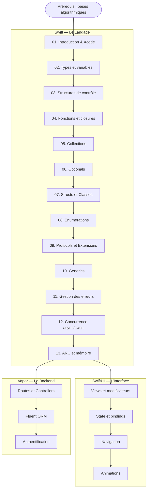

# Développement Mobile

!!! quote "Analogie"
    _Apprendre à développer pour mobile, c'est comme apprendre à conduire une voiture de sport après avoir conduit des berlines toute sa vie. Les règles de la route sont les mêmes (la logique de programmation), mais le moteur, la tenue de route et les instruments de bord sont entièrement différents. Swift n'est pas "un autre PHP" — c'est un langage conçu pour la performance, la sécurité mémoire et l'expérience développeur sur l'écosystème Apple._

## Objectif

Cette section couvre le développement mobile natif sur l'écosystème Apple, de l'initiation au langage Swift jusqu'à la construction d'applications iOS professionnelles avec SwiftUI, en passant par le développement backend avec Vapor.

Le parcours est structuré en trois phases progressives et dépendantes :

- **Swift** — le langage. Fondations obligatoires sans lesquelles SwiftUI est incompréhensible.
- **SwiftUI** — le framework d'interface. Construit entièrement sur les concepts avancés de Swift (Protocols, Generics, Property Wrappers).
- **Vapor** — le framework backend Swift. Pour construire des APIs Swift de bout en bout.

!!! warning "Prérequis recommandés"
    Cette section suppose une **expérience préalable en programmation** — dans n'importe quel langage. Si vous avez suivi les sections HTML, CSS et JavaScript d'OmnyDocs, vous avez le bagage algorithmique nécessaire. Si vous débutez en programmation absolue, commencez par la section [PHP Procédural](../lang/php/procedural/module1.md) qui couvre les fondamentaux algorithmiques.

 

---

## Les trois piliers

- ### :simple-swift: Swift — Le Langage
    ---
    Treize modules couvrant les fondations du langage : types et variables, structures de contrôle, fonctions, closures, collections, **Optionals**, structs, classes, protocols, generics, gestion des erreurs, concurrence et gestion mémoire.

    [Démarrer Swift](./swift/index.md)

- ### :lucide-smartphone: SwiftUI — L'Interface
    ---
    Le framework déclaratif d'Apple pour construire des interfaces iOS, macOS, watchOS et tvOS. Views, State management, Navigation, Animations et interactions.

    *Section en préparation — Swift requis*

- ### :lucide-server: Vapor — Le Backend Swift
    ---
    Framework web Swift pour construire des APIs REST, des middlewares d'authentification et des bases de données avec Fluent ORM. L'équivalent Swift de Laravel.

    *Section en préparation — Swift requis*

 

---

## Progression recommandée

 

---

## Pourquoi Swift en 2025

Swift est le langage officiel d'Apple depuis 2014 (open source depuis 2015). Il a remplacé Objective-C pour le développement iOS et macOS.

En 2025, Swift est utilisé pour développer des applications sur l'intégralité de l'écosystème Apple (iOS, macOS, watchOS, tvOS, visionOS), et s'étend progressivement au backend avec Vapor et à l'embarqué avec Swift Embedded. C'est un langage compilé, statiquement typé, conçu pour la sécurité et la performance.

Ce qui le distingue fondamentalement des langages web couverts dans OmnyDocs :

| Caractéristique | Swift | PHP / JavaScript |
| --- | --- | --- |
| Typage | Statique et inféré | Dynamique |
| Compilation | AOT (ahead of time) | Interprété / JIT |
| Gestion mémoire | ARC automatique | Garbage Collector |
| Null safety | Optionals obligatoires | null implicite |
| Paradigme dominant | Protocol-Oriented | Orienté Objet |
| Exécution | iOS / macOS / Linux | Navigateur / Serveur |

 

---

## Conclusion

!!! quote "Notre recommandation"
    Ne sautez pas les modules Swift fondamentaux pour aller directement à SwiftUI. Les Property Wrappers (`@State`, `@Binding`), les ViewBuilders et le système de types de SwiftUI sont construits sur les Protocols, les Generics et les closures de Swift. Sans ces bases, SwiftUI sera une boîte noire que vous utiliserez sans comprendre.

**Point d'entrée : [Swift — Le Langage](./swift/index.md)**

 